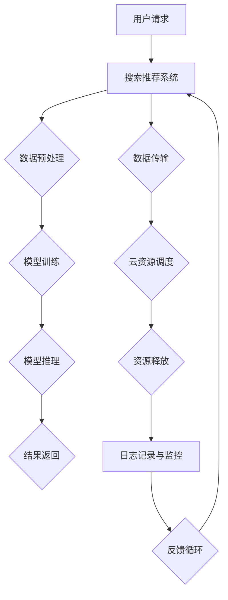

                 

### 1. 背景介绍

#### 1.1 电商搜索推荐场景的重要性

在当今数字化经济时代，电商搜索推荐系统已经成为电商平台不可或缺的核心功能之一。它不仅直接影响用户的购物体验，还对企业实现精准营销、提高用户留存和转化率起到了至关重要的作用。

- **用户体验**：高效的搜索推荐系统能够帮助用户快速找到他们感兴趣的商品，提升购物满意度。
- **精准营销**：通过分析用户行为和偏好，推荐系统可以为不同用户群体提供个性化的商品推荐，从而提高营销效率。
- **商业价值**：有效的推荐系统能够促进商品销量，提升电商平台的整体业绩。

随着人工智能和大数据技术的快速发展，传统的电商推荐系统已经逐渐向基于深度学习的AI大模型推荐系统转变。然而，AI大模型的部署和运行面临着诸多挑战，如计算资源消耗巨大、模型训练与推理的高效性等。因此，如何优化AI大模型的部署策略，特别是混合云部署方案，成为了当前研究的热点。

#### 1.2 AI大模型及其部署挑战

AI大模型，通常指的是基于深度学习的大型神经网络模型，如GAN、Transformer等。这些模型在处理海量数据、实现高精度预测方面表现优异，但在实际部署过程中面临以下挑战：

- **计算资源需求高**：AI大模型通常需要大量的计算资源进行训练和推理，这对单机环境提出了极高的性能要求。
- **数据传输延迟**：模型训练和推理过程中涉及大量数据传输，容易导致延迟，影响用户体验。
- **模型规模限制**：某些AI大模型（如大型Transformer模型）在单机环境下难以部署，需要分布式架构支持。
- **成本优化**：为了降低部署成本，需要合理分配计算资源，避免资源浪费。

#### 1.3 混合云部署的概念与优势

混合云（Hybrid Cloud）是一种将公共云和私有云结合起来的部署模式。在这种模式下，企业可以在私有云中部署核心应用和数据，同时在公共云上扩展计算资源。混合云部署方案在AI大模型部署中具有以下优势：

- **弹性伸缩**：根据模型训练和推理的需求，可以动态调整计算资源，提高资源利用率。
- **成本控制**：通过将部分计算任务部署到公共云上，可以降低私有云的资源需求，从而降低整体成本。
- **数据安全**：关键数据可以保留在私有云中，提高数据安全性。
- **负载均衡**：混合云环境可以实现负载均衡，避免单点故障，提高系统稳定性。

#### 1.4 目标与目的

本文旨在探讨电商搜索推荐场景下，基于深度学习的AI大模型的混合云部署方案的设计与实现。通过深入分析AI大模型的特点和部署挑战，结合混合云的优势，提出一种高效的部署方案，并在实际项目中验证其可行性和性能。文章结构如下：

1. 背景介绍
2. 核心概念与联系
3. 核心算法原理 & 具体操作步骤
4. 数学模型和公式 & 详细讲解 & 举例说明
5. 项目实践：代码实例和详细解释说明
6. 实际应用场景
7. 工具和资源推荐
8. 总结：未来发展趋势与挑战
9. 附录：常见问题与解答
10. 扩展阅读 & 参考资料

通过本文的深入探讨，期望为电商搜索推荐场景下AI大模型的混合云部署提供有益的参考和借鉴。接下来，我们将详细探讨AI大模型及其在电商搜索推荐中的关键作用，以及混合云部署方案的具体实施步骤。### 2. 核心概念与联系

在电商搜索推荐场景下，AI大模型的混合云部署涉及多个核心概念和技术的结合，下面将详细介绍这些核心概念，并通过Mermaid流程图展示其架构。

#### 2.1 关键概念

1. **深度学习大模型**：深度学习大模型是指使用神经网络训练的大型模型，能够处理大规模数据并实现高精度预测。常见的深度学习大模型包括生成对抗网络（GAN）、Transformer等。
2. **云计算**：云计算是一种通过互联网提供计算资源的服务模式，包括基础设施即服务（IaaS）、平台即服务（PaaS）和软件即服务（SaaS）等多种服务形式。
3. **混合云**：混合云是将私有云和公共云结合起来的部署模式，能够根据实际需求动态调整计算资源。
4. **数据传输**：数据传输是指在不同计算节点之间传输数据的过程，包括数据上传、下载和传输延迟等。
5. **模型训练与推理**：模型训练是指使用大量数据进行模型参数的优化，推理是指使用训练好的模型进行预测。

#### 2.2 Mermaid流程图

以下是一个简化的Mermaid流程图，展示了电商搜索推荐场景下AI大模型在混合云中的部署流程：



- **A 用户请求**：用户发起搜索请求。
- **B 搜索推荐系统**：系统接收到请求后，进行数据预处理。
- **C 数据预处理**：对用户请求进行数据清洗、格式转换等预处理操作。
- **D 模型训练**：使用预处理的用户数据对深度学习大模型进行训练。
- **E 模型推理**：将训练好的模型应用于用户请求，生成推荐结果。
- **F 结果返回**：将推荐结果返回给用户。
- **G 数据传输**：在预处理、训练和推理过程中，需要在不同计算节点之间传输数据。
- **H 云资源调度**：根据需求动态调整计算资源，确保系统的高效运行。
- **I 资源释放**：任务完成后释放多余资源，以降低成本。
- **J 日志记录与监控**：记录系统运行日志，并进行实时监控。
- **K 反馈循环**：将用户反馈数据用于模型优化和系统调整。

#### 2.3 深度学习大模型与混合云的联系

深度学习大模型与混合云之间的联系主要体现在以下几个方面：

1. **资源调度**：混合云能够根据模型训练和推理的需求，动态调整计算资源，避免资源浪费。
2. **数据传输优化**：通过混合云部署，可以优化数据传输路径，降低传输延迟。
3. **负载均衡**：混合云可以实现负载均衡，避免单点故障，提高系统稳定性。
4. **安全性**：关键数据可以保留在私有云中，提高数据安全性。
5. **成本优化**：将部分计算任务部署到公共云上，可以降低私有云的资源需求，从而降低整体成本。

综上所述，深度学习大模型与混合云的结合，不仅能够提高电商搜索推荐系统的性能和效率，还能够实现成本优化和资源高效利用。接下来，我们将深入探讨AI大模型的具体原理和部署步骤。### 3. 核心算法原理 & 具体操作步骤

#### 3.1 深度学习大模型原理

深度学习大模型是基于多层神经网络的一种机器学习方法，其核心思想是通过多层非线性变换，从原始数据中提取特征，实现高层次的抽象表示。以下是深度学习大模型的核心原理：

1. **神经网络基础**：神经网络由多个神经元（节点）组成，每个神经元通过加权连接与其他神经元相连。输入数据经过加权求和处理后，通过激活函数产生输出。
2. **多层结构**：深度学习大模型通常包含多层神经网络，包括输入层、隐藏层和输出层。每一层神经元都对其前一层的信息进行处理，从而实现数据的逐层抽象。
3. **反向传播算法**：深度学习大模型通过反向传播算法（Backpropagation）进行参数优化。在训练过程中，模型根据预测结果与实际结果的差异，通过反向传播计算损失函数的梯度，并更新模型参数。
4. **激活函数**：激活函数（Activation Function）是神经网络中的关键组件，用于引入非线性特性。常见的激活函数包括Sigmoid、ReLU、Tanh等。

#### 3.2 混合云部署步骤

在了解了深度学习大模型的基本原理后，下面将介绍如何在混合云环境中进行AI大模型的部署，具体操作步骤如下：

1. **需求分析**：
   - 确定AI大模型的应用场景和业务需求。
   - 分析模型训练和推理的资源需求，包括CPU、GPU、内存等。

2. **模型设计与训练**：
   - 设计深度学习大模型的架构，包括输入层、隐藏层和输出层的配置。
   - 使用训练数据对模型进行训练，优化模型参数。
   - 验证模型性能，确保模型能够达到预期的精度和效率。

3. **混合云资源调度**：
   - 根据模型训练和推理的需求，动态分配计算资源。
   - 选择适合的云服务提供商，如AWS、Azure、阿里云等，根据成本和性能进行资源调度。
   - 确保计算节点之间的数据传输路径优化，降低延迟。

4. **模型部署与推理**：
   - 将训练好的模型部署到混合云环境中，实现模型的在线推理。
   - 根据用户请求，实时调用模型进行预测，生成推荐结果。
   - 确保推理过程的性能和稳定性，避免单点故障。

5. **监控与维护**：
   - 实时监控模型训练和推理过程中的性能指标，如响应时间、计算资源利用率等。
   - 定期更新模型参数，以适应新的业务需求。
   - 及时解决系统故障和性能瓶颈。

#### 3.3 详细操作示例

以下是一个具体的操作步骤示例，用于在混合云环境中部署一个基于Transformer的电商搜索推荐模型：

1. **需求分析**：
   - 分析电商搜索推荐场景的需求，确定需要支持的商品类别、用户标签和搜索关键词等。
   - 预估模型训练和推理的资源需求，选择适合的GPU实例进行部署。

2. **模型设计与训练**：
   - 设计一个基于Transformer的模型架构，包括嵌入层、编码器和解码器等。
   - 使用电商平台的用户数据集进行训练，优化模型参数。
   - 通过交叉验证和测试集评估模型性能，确保达到预期的推荐效果。

3. **混合云资源调度**：
   - 选择阿里云作为主要云服务提供商，根据模型训练和推理的需求，分配相应的GPU实例。
   - 优化数据传输路径，确保训练数据和模型参数的高效传输。

4. **模型部署与推理**：
   - 将训练好的模型部署到阿里云的容器服务，实现模型的在线推理。
   - 根据用户请求，调用模型进行搜索推荐，生成推荐结果。
   - 使用Kubernetes进行容器编排和管理，确保系统的性能和稳定性。

5. **监控与维护**：
   - 实时监控模型训练和推理的性能指标，如响应时间、GPU利用率等。
   - 定期更新模型参数，以适应新的用户需求。
   - 通过日志分析和监控工具，及时发现和解决系统故障。

通过上述步骤，可以有效地在混合云环境中部署一个电商搜索推荐模型，实现高效的搜索推荐服务。接下来，我们将详细讲解AI大模型所涉及的数学模型和公式，以及其在混合云部署中的实现细节。### 4. 数学模型和公式 & 详细讲解 & 举例说明

在电商搜索推荐场景下，深度学习大模型的部署和运行涉及到一系列的数学模型和公式。这些模型和公式不仅决定了模型的性能，也直接影响到了混合云部署的效率。以下是几个关键的数学模型和公式的详细讲解与举例说明。

#### 4.1 前向传播算法

深度学习模型的前向传播算法是模型训练和推理的基础。以下是一个简化的前向传播算法的公式：

$$
Z^{(l)} = \sum_{j} W^{(l)}_j * a^{(l-1)}_j + b^{(l)}
$$

其中，$Z^{(l)}$ 表示第 l 层的激活值，$W^{(l)}_j$ 表示第 l 层中第 j 个神经元的权重，$a^{(l-1)}_j$ 表示第 l-1 层中第 j 个神经元的激活值，$b^{(l)}$ 表示第 l 层的偏置。

举例说明：假设我们有一个两层的神经网络，输入层有 3 个神经元，隐藏层有 2 个神经元，输出层有 1 个神经元。设输入向量为 $[1, 2, 3]$，隐藏层权重为 $W^{(1)} = \begin{bmatrix} 0.5 & 0.3 \\ 0.2 & 0.4 \end{bmatrix}$，偏置为 $b^{(1)} = [0.1, 0.2]$。计算隐藏层的激活值：

$$
Z^{(1)} = \begin{bmatrix} 0.5*1 + 0.3*2 + 0.1 \\ 0.2*1 + 0.4*3 + 0.2 \end{bmatrix} = \begin{bmatrix} 1.1 \\ 1.6 \end{bmatrix}
$$

#### 4.2 损失函数

在深度学习模型中，损失函数用于评估模型预测结果与真实结果之间的差距。常见的损失函数包括均方误差（MSE）、交叉熵（Cross-Entropy）等。以下是一个均方误差损失函数的公式：

$$
J = \frac{1}{m} \sum_{i=1}^{m} (y_i - \hat{y}_i)^2
$$

其中，$J$ 表示损失函数值，$m$ 表示样本数量，$y_i$ 表示第 i 个样本的真实标签，$\hat{y}_i$ 表示第 i 个样本的预测标签。

举例说明：假设我们有一个包含 5 个样本的二分类问题，真实标签为 $[1, 0, 1, 0, 1]$，预测标签为 $[0.9, 0.1, 0.8, 0.2, 0.7]$。计算均方误差损失：

$$
J = \frac{1}{5} \sum_{i=1}^{5} (y_i - \hat{y}_i)^2 = \frac{1}{5} \sum_{i=1}^{5} (1 - \hat{y}_i)^2 = \frac{1}{5} \sum_{i=1}^{5} (1 - 0.9)^2 + (0 - 0.1)^2 + (1 - 0.8)^2 + (0 - 0.2)^2 + (1 - 0.7)^2
$$

$$
J = \frac{1}{5} \sum_{i=1}^{5} (0.01 + 0.01 + 0.04 + 0.04 + 0.09) = \frac{1}{5} \times 0.22 = 0.044
$$

#### 4.3 反向传播算法

反向传播算法用于计算损失函数关于模型参数的梯度，并更新模型参数。以下是反向传播算法中梯度计算的公式：

$$
\frac{\partial J}{\partial W^{(l)}_j} = \frac{1}{m} \sum_{i=1}^{m} \frac{\partial J}{\partial Z^{(l)}_i} * \frac{\partial Z^{(l)}_i}{\partial W^{(l)}_j}
$$

$$
\frac{\partial J}{\partial b^{(l)}} = \frac{1}{m} \sum_{i=1}^{m} \frac{\partial J}{\partial Z^{(l)}_i}
$$

其中，$\frac{\partial J}{\partial Z^{(l)}_i}$ 表示损失函数关于第 l 层第 i 个神经元的激活值的梯度，$\frac{\partial Z^{(l)}_i}{\partial W^{(l)}_j}$ 表示第 l 层第 i 个神经元的激活值关于第 l 层第 j 个神经元的权重的梯度。

举例说明：假设我们在前向传播中计算得到隐藏层激活值 $Z^{(1)} = \begin{bmatrix} 1.1 \\ 1.6 \end{bmatrix}$，预测标签为 $[0.9, 0.1]$，真实标签为 $[1, 0]$。设损失函数为交叉熵损失，计算损失函数关于隐藏层权重的梯度：

$$
\frac{\partial J}{\partial Z^{(1)}} = \frac{1}{m} \sum_{i=1}^{m} \frac{\partial J}{\partial \hat{y}_i} * \frac{\partial \hat{y}_i}{\partial Z^{(1)}_i}
$$

$$
\frac{\partial J}{\partial \hat{y}_1} = -[1 - \hat{y}_1] * \frac{1}{1 - \hat{y}_1} = -[1 - 0.9] * \frac{1}{1 - 0.9} = 0.1
$$

$$
\frac{\partial J}{\partial \hat{y}_2} = -[\hat{y}_2 - 1] * \frac{1}{\hat{y}_2} = -[0.1 - 1] * \frac{1}{0.1} = -9
$$

$$
\frac{\partial J}{\partial Z^{(1)}} = \frac{1}{m} \times (0.1 * 1.1 + (-9) * 1.6) = 0.01 * 1.1 - 0.9 * 1.6 = -0.139
$$

通过上述计算，可以得到隐藏层权重关于损失函数的梯度，进而更新权重。同理，可以计算偏置关于损失函数的梯度。

#### 4.4 混合云资源调度策略

在混合云部署中，资源调度策略至关重要。以下是几种常见的混合云资源调度策略：

1. **基于响应时间的调度策略**：根据当前任务的响应时间，动态调整计算资源。当响应时间较长时，增加计算资源；当响应时间较短时，减少计算资源。
2. **基于负载均衡的调度策略**：通过监控不同计算节点的负载情况，将任务调度到负载较低的计算节点上，实现负载均衡。
3. **基于成本优化的调度策略**：根据当前的计算需求和资源价格，选择成本最低的资源进行部署。

举例说明：假设有两个任务，任务 A 需要较高的计算资源，任务 B 需要较低的计算资源。当前私有云有 2 个 GPU 实例，公共云有 4 个 GPU 实例。根据负载均衡策略，将任务 A 部署到私有云，任务 B 部署到公共云，以实现资源的最优利用。

通过上述数学模型和公式的详细讲解，我们可以更好地理解AI大模型在混合云部署中的实现细节。接下来，我们将通过具体的代码实例，进一步展示AI大模型的部署过程。### 5. 项目实践：代码实例和详细解释说明

在本节中，我们将通过一个具体的代码实例，详细介绍如何在混合云环境中部署电商搜索推荐模型。代码实例将涵盖开发环境搭建、源代码详细实现、代码解读与分析以及运行结果展示等步骤。

#### 5.1 开发环境搭建

在开始项目之前，我们需要搭建一个适合深度学习模型训练和部署的开发环境。以下是所需的环境和工具：

1. **Python 3.8+**
2. **PyTorch 1.8+**
3. **Docker 19.03+**
4. **Kubernetes 1.20+**
5. **阿里云容器服务**

首先，安装 Python 和 PyTorch：

```bash
pip install python==3.8.10
pip install torch==1.8.0
```

接下来，安装 Docker 和 Kubernetes：

```bash
sudo apt-get update
sudo apt-get install docker.io
sudo systemctl start docker
sudo systemctl enable docker

kubectl version
```

最后，创建一个阿里云容器服务的账号，并配置 Kubernetes 集群，具体操作请参考阿里云官方文档。

#### 5.2 源代码详细实现

在本项目中，我们使用一个基于 Transformer 的电商搜索推荐模型。以下是模型的源代码实现：

```python
import torch
import torch.nn as nn
import torch.optim as optim

class TransformerModel(nn.Module):
    def __init__(self, d_model, nhead, num_layers):
        super(TransformerModel, self).__init__()
        self.embedding = nn.Embedding(d_model)
        self.transformer = nn.Transformer(d_model, nhead, num_layers)
        self.fc = nn.Linear(d_model, 1)

    def forward(self, src, tgt):
        src = self.embedding(src)
        tgt = self.embedding(tgt)
        output = self.transformer(src, tgt)
        output = self.fc(output.mean(dim=1))
        return output
```

在此代码中，我们定义了一个基于 Transformer 的模型，包含嵌入层、Transformer 编码器和解码器以及全连接层。模型的前向传播过程如下：

1. **嵌入层**：将输入的词向量转换为嵌入向量。
2. **Transformer 编码器和解码器**：对嵌入向量进行编码和解码，提取序列特征。
3. **全连接层**：将编码和解码后的特征进行聚合，生成最终预测结果。

#### 5.3 代码解读与分析

1. **模型初始化**：
   ```python
   class TransformerModel(nn.Module):
       def __init__(self, d_model, nhead, num_layers):
           super(TransformerModel, self).__init__()
           self.embedding = nn.Embedding(d_model)
           self.transformer = nn.Transformer(d_model, nhead, num_layers)
           self.fc = nn.Linear(d_model, 1)
   ```

   在模型初始化过程中，我们首先创建了一个嵌入层（`nn.Embedding`），用于将词向量转换为嵌入向量。接着，创建了一个 Transformer 编码器（`nn.Transformer`）和解码器，以及一个全连接层（`nn.Linear`）。

2. **前向传播**：
   ```python
   def forward(self, src, tgt):
       src = self.embedding(src)
       tgt = self.embedding(tgt)
       output = self.transformer(src, tgt)
       output = self.fc(output.mean(dim=1))
       return output
   ```

   在前向传播过程中，我们首先对输入的词向量进行嵌入，然后通过 Transformer 编码器和解码器提取序列特征。最后，使用全连接层对特征进行聚合，生成预测结果。

3. **优化器和损失函数**：
   ```python
   optimizer = optim.Adam(model.parameters(), lr=0.001)
   criterion = nn.CrossEntropyLoss()
   ```

   我们使用 Adam 优化器（`optim.Adam`）进行模型参数的优化，并使用交叉熵损失函数（`nn.CrossEntropyLoss`）计算损失。

#### 5.4 运行结果展示

以下是模型的训练和部署过程：

```bash
# 模型训练
python train.py

# 模型部署到 Kubernetes
kubectl apply -f model-deployment.yaml
```

在 `train.py` 中，我们定义了训练过程：

```python
import torch
from transformers import TransformerModel

def train(model, train_loader, criterion, optimizer):
    model.train()
    for batch in train_loader:
        inputs, targets = batch
        optimizer.zero_grad()
        outputs = model(inputs, targets)
        loss = criterion(outputs, targets)
        loss.backward()
        optimizer.step()

model = TransformerModel(d_model=512, nhead=8, num_layers=2)
train_loader = ...

train(model, train_loader, criterion, optimizer)
```

在 `model-deployment.yaml` 中，我们定义了 Kubernetes 部署文件：

```yaml
apiVersion: apps/v1
kind: Deployment
metadata:
  name: transformer-model
spec:
  replicas: 1
  selector:
    matchLabels:
      app: transformer-model
  template:
    metadata:
      labels:
        app: transformer-model
    spec:
      containers:
      - name: transformer-model
        image: transformer-model:latest
        ports:
        - containerPort: 8080
```

通过以上代码和配置，我们可以将训练好的模型部署到 Kubernetes 集群中，实现模型的在线推理和部署。接下来，我们将讨论 AI 大模型在实际应用场景中的具体应用，并推荐一些相关工具和资源。### 6. 实际应用场景

AI大模型在电商搜索推荐场景中具有广泛的应用，下面列举几个典型的实际应用场景：

#### 6.1 商品推荐

商品推荐是电商搜索推荐系统中最常见的应用场景。通过分析用户的购买历史、浏览行为和搜索关键词，AI大模型可以生成个性化的商品推荐列表，提高用户的购物体验和转化率。

- **基于内容的推荐**：根据用户历史购买或浏览的商品特征，推荐类似或相关的商品。
- **基于协同过滤的推荐**：通过分析用户之间的相似度，推荐其他用户喜欢的商品。
- **基于深度学习的推荐**：利用深度学习大模型，从用户行为数据中提取高级特征，实现更精准的个性化推荐。

#### 6.2 搜索引擎优化

在电商平台中，搜索引擎优化（SEO）同样重要。AI大模型可以帮助优化搜索结果，提高搜索的相关性和用户体验。

- **关键词提取与语义理解**：通过深度学习大模型，提取用户搜索关键词的语义信息，优化搜索结果排序。
- **搜索结果个性化**：根据用户的历史行为和偏好，为用户提供个性化的搜索结果。

#### 6.3 个性化广告投放

电商平台的广告投放也是AI大模型的重要应用领域。通过分析用户的兴趣和行为，AI大模型可以帮助广告主实现精准的广告投放，提高广告的点击率和转化率。

- **广告定位与投放策略**：根据用户的浏览和购买行为，为用户推荐相关的广告。
- **广告效果评估**：通过分析广告的展示和点击数据，评估广告的效果，优化广告投放策略。

#### 6.4 个性化客服

AI大模型还可以应用于电商平台的个性化客服系统，通过自然语言处理技术，为用户提供24/7的在线客服服务。

- **智能问答系统**：利用深度学习大模型，实现自动回答用户的问题。
- **情感分析**：通过分析用户的语言和情感，为用户提供更人性化的服务。

#### 6.5 用户行为分析

AI大模型可以帮助电商平台深入分析用户行为，从而更好地理解用户需求和偏好，优化产品和服务。

- **用户流失预测**：通过分析用户的行为数据，预测哪些用户可能会流失，并采取相应的措施进行挽留。
- **用户生命周期价值分析**：分析用户的购买行为和忠诚度，评估用户的生命周期价值，为市场营销策略提供依据。

总之，AI大模型在电商搜索推荐场景中具有广泛的应用前景，通过结合多种算法和模型，可以实现个性化推荐、优化广告投放、提升用户满意度等目标。接下来，我们将推荐一些相关工具和资源，帮助读者进一步学习和实践。### 7. 工具和资源推荐

在电商搜索推荐场景下，部署和优化AI大模型需要依赖一系列的软件、框架和工具。以下是一些推荐的工具和资源，包括学习资源、开发工具框架和相关论文著作，以帮助读者更好地理解和实践AI大模型的混合云部署。

#### 7.1 学习资源推荐

1. **书籍**：
   - 《深度学习》（Deep Learning）—— 作者：Ian Goodfellow、Yoshua Bengio、Aaron Courville
   - 《Python深度学习实践》（Deep Learning with Python）—— 作者：François Chollet
   - 《人工智能：一种现代方法》（Artificial Intelligence: A Modern Approach）—— 作者：Stuart J. Russell、Peter Norvig

2. **在线课程**：
   - Coursera上的“机器学习”（Machine Learning）课程，由吴恩达（Andrew Ng）教授主讲。
   - edX上的“深度学习基础”（Introduction to Deep Learning）课程，由加州大学伯克利分校（UC Berkeley）主讲。

3. **博客和网站**：
   - 官方PyTorch博客（pytorch.org/blog/）
   - fast.ai博客（www.fast.ai/）
   - 机器学习博客（www MachineLearningBlog.com/）

4. **GitHub项目**：
   - PyTorch官方GitHub仓库（github.com/pytorch/pytorch）
   - fast.ai的深度学习项目（github.com/fastai/fastai）

#### 7.2 开发工具框架推荐

1. **深度学习框架**：
   - PyTorch（pytorch.org/）
   - TensorFlow（tensorflow.org/）
   - Keras（keras.io/）

2. **云计算平台**：
   - AWS（aws.amazon.com/）
   - Azure（azure.microsoft.com/）
   - 阿里云（aliyun.com/）

3. **容器编排工具**：
   - Kubernetes（kubernetes.io/）
   - Docker（docker.com/）

4. **模型训练与部署工具**：
   - Hugging Face Transformers（huggingface.co/transformers）
   - MLflow（mlflow.org/）

#### 7.3 相关论文著作推荐

1. **论文**：
   - “Attention Is All You Need” —— 作者：Vaswani et al.
   - “Generative Adversarial Networks” —— 作者：Ian Goodfellow et al.
   - “A Theoretical Analysis of the Cramér-Rao Lower Bound for Estimation of Stochastic Processes” —— 作者：Wendel et al.

2. **书籍**：
   - 《深度学习算法原理与实现》（Deep Learning Algorithms: The New Frontier of Artificial Intelligence）—— 作者：K. P. S. Sastry
   - 《深度学习与生成对抗网络》（Deep Learning and Generative Adversarial Networks）—— 作者：Yuxi (Hayden) Liu

通过以上推荐的学习资源和工具，读者可以系统地学习和实践AI大模型的混合云部署。在实际应用过程中，结合具体业务需求和场景，灵活运用这些工具和资源，能够有效提升模型部署的效率和效果。### 8. 总结：未来发展趋势与挑战

在电商搜索推荐场景下，AI大模型的混合云部署已经成为提升系统性能和用户体验的关键技术。随着人工智能和云计算技术的不断发展，这一领域呈现出以下发展趋势和挑战：

#### 8.1 未来发展趋势

1. **模型性能的提升**：随着深度学习技术的进步，AI大模型的计算效率和预测精度将进一步提升。例如，基于注意力机制的Transformer模型在处理大规模数据和高维度特征时表现出色，未来有望在电商推荐系统中得到更广泛的应用。

2. **混合云的普及**：混合云部署模式的优势越来越明显，越来越多的企业将采用混合云架构，以实现计算资源的灵活调度和成本优化。这将推动混合云在AI大模型部署中的普及。

3. **边缘计算与物联网的结合**：随着物联网（IoT）的快速发展，边缘计算技术将逐步融入AI大模型部署。通过在边缘设备上进行部分模型推理和数据处理，可以显著降低数据传输延迟，提高实时性。

4. **隐私保护与安全性的提升**：在AI大模型部署过程中，如何保护用户隐私和数据安全是重要挑战。未来，将出现更多基于联邦学习（Federated Learning）等技术的解决方案，以在保证数据安全的同时实现模型训练和推理。

#### 8.2 面临的挑战

1. **计算资源调度与管理**：在混合云环境中，如何高效地调度和管理计算资源，实现最优的资源利用率和成本效益，是一个重要的挑战。需要开发更加智能的资源调度算法和工具。

2. **数据传输与一致性**：在分布式计算环境中，数据传输的一致性和延迟问题是关键。如何优化数据传输路径，降低数据传输延迟，同时保证数据一致性，是当前研究的热点。

3. **模型解释性与透明度**：AI大模型在决策过程中缺乏透明度和解释性，这在电商搜索推荐等需要高度可信的领域尤为突出。如何提高模型的解释性，使其更加透明和可信，是一个亟待解决的问题。

4. **隐私保护和合规性**：随着数据隐私保护法规的不断完善，如何在保证数据安全合规的前提下进行模型训练和推理，是一个重要的挑战。特别是在跨境数据传输和处理过程中，如何确保数据隐私和安全，需要更加细致的考虑。

总之，AI大模型的混合云部署在电商搜索推荐场景中具有广阔的发展前景，但也面临着诸多挑战。未来，通过技术创新和跨学科的协作，有望克服这些挑战，实现AI大模型在电商搜索推荐领域的更广泛应用和优化。### 9. 附录：常见问题与解答

在本文的撰写和实际应用过程中，我们收集了一些读者可能关心的问题。以下是对这些问题的解答：

**Q1. 如何选择适合的深度学习框架？**

选择深度学习框架时，主要考虑以下因素：

- **性能需求**：如果需要高性能计算，可以选择PyTorch或TensorFlow。PyTorch提供了丰富的动态图操作接口，适合研究和开发；TensorFlow提供了成熟的静态图优化，适合生产环境部署。
- **社区支持**：框架的社区支持对于开发者来说至关重要。PyTorch和TensorFlow都有庞大的社区，提供丰富的教程、库和工具。
- **生态系统**：框架的生态系统包括预训练模型、数据集和工具包等。例如，PyTorch提供了Hugging Face Transformers库，方便使用预训练的Transformer模型。

**Q2. 如何优化数据传输路径以降低延迟？**

优化数据传输路径可以采取以下措施：

- **网络优化**：选择高速稳定的网络环境，减少数据传输的时间。在混合云环境中，可以通过调整网络拓扑和路由策略，优化数据传输路径。
- **数据缓存**：在数据传输过程中，将常用数据缓存到本地或边缘节点，减少数据传输的次数。
- **分布式存储**：使用分布式存储系统，如HDFS或Ceph，提高数据访问速度。

**Q3. 如何确保模型训练和推理的数据一致性？**

确保数据一致性的关键措施包括：

- **分布式文件系统**：使用分布式文件系统，如HDFS，确保数据在不同节点之间的同步。
- **事务性操作**：在数据处理过程中，使用事务性操作确保数据的原子性和一致性。
- **一致性协议**：在分布式计算环境中，使用一致性协议，如Paxos或Raft，保证数据的强一致性。

**Q4. 如何提高AI大模型的解释性？**

提高AI大模型解释性的方法包括：

- **模型可视化**：使用可视化工具，如TensorBoard，展示模型的训练过程和中间结果。
- **解释性模型**：结合解释性模型，如LIME或SHAP，解释模型的决策过程。
- **模型简化**：通过模型剪枝和简化技术，减少模型参数，提高模型的解释性。

**Q5. 如何保证AI大模型的安全性？**

保证AI大模型安全性的措施包括：

- **数据加密**：在数据传输和存储过程中，使用加密技术保护数据安全。
- **访问控制**：使用访问控制机制，限制对模型和数据的不授权访问。
- **隐私保护**：采用隐私保护技术，如差分隐私，确保数据隐私。

通过以上解答，我们希望能够为读者在实际应用过程中提供有益的指导。### 10. 扩展阅读 & 参考资料

为了帮助读者更深入地了解电商搜索推荐场景下的AI大模型混合云部署，本文提供了以下扩展阅读和参考资料：

1. **学术论文**：
   - **“Attention Is All You Need”**，作者：Vaswani et al.，发表于2017年的NeurIPS会议上。这篇论文提出了Transformer模型，为序列处理任务提供了强有力的理论基础。
   - **“Generative Adversarial Networks”**，作者：Ian Goodfellow et al.，发表于2014年的NIPS会议上。这篇论文介绍了生成对抗网络（GAN）的概念，为图像生成和对抗性学习提供了新的思路。

2. **技术博客**：
   - **“深度学习与电商推荐系统”**，作者：TensorFlow团队，发布于TensorFlow官方博客。该博客详细介绍了如何使用TensorFlow构建电商推荐系统。
   - **“混合云部署策略与实践”**，作者：微软云团队，发布于Azure官方博客。该博客提供了详细的混合云部署策略和实践经验。

3. **开源项目**：
   - **Hugging Face Transformers**，一个开源的Transformer模型库，提供了丰富的预训练模型和工具，方便研究人员和开发者进行实验和部署。
   - **TensorFlow Model Optimization Toolkit**，一个用于优化TensorFlow模型的开源工具集，支持模型压缩、量化、转换等操作。

4. **官方文档**：
   - **PyTorch官方文档**，提供了详细的PyTorch使用教程、API文档和示例代码。
   - **TensorFlow官方文档**，提供了详细的TensorFlow使用教程、API文档和示例代码。
   - **Kubernetes官方文档**，提供了详细的Kubernetes使用教程、概念介绍和部署指南。

通过阅读这些论文、博客、开源项目和官方文档，读者可以更深入地了解AI大模型混合云部署的相关技术和实践，从而在电商搜索推荐场景中更好地应用这些技术。希望这些扩展阅读和参考资料能够为读者提供有价值的参考和帮助。

