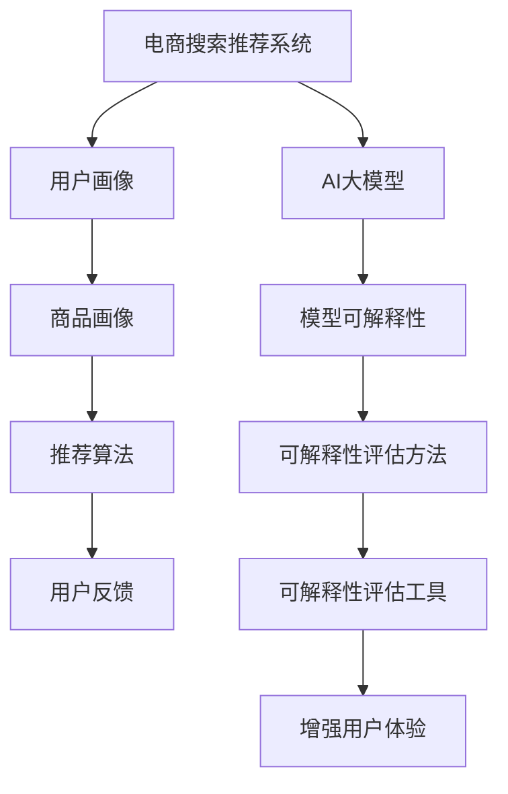

                 

### 文章标题

《电商搜索推荐效果评估中的AI大模型模型可解释性评估工具开发与应用》

> 关键词：电商搜索、推荐系统、AI大模型、模型可解释性、评估工具、开发与应用

> 摘要：本文深入探讨了在电商搜索推荐系统中，如何开发与应用AI大模型的模型可解释性评估工具。通过分析电商推荐系统的架构和业务场景，详细介绍了模型可解释性的重要性、评估方法以及工具的开发流程，并结合实际案例进行了验证。

---

## 1. 背景介绍

随着互联网技术的迅猛发展，电子商务已经成为现代商业的重要模式。在电商平台上，用户通过搜索引擎查找商品，然后浏览、对比、购买。为了提高用户体验和销售额，电商平台纷纷引入了推荐系统，基于用户的搜索历史、购物行为等数据，为用户推荐相关商品。

推荐系统通常采用机器学习算法，尤其是深度学习算法，来生成个性化的推荐结果。然而，随着AI大模型（如深度神经网络）在推荐系统中的应用，模型的可解释性问题日益凸显。传统方法难以解释大模型的决策过程，导致用户对推荐结果的不信任，从而影响了系统的使用效果。

因此，本文旨在解决以下问题：
1. 如何评估AI大模型在电商搜索推荐中的可解释性？
2. 如何开发一种可解释性评估工具，以提高推荐系统的可靠性和用户体验？

## 2. 核心概念与联系

为了深入理解模型可解释性评估工具的开发与应用，我们首先需要了解一些核心概念和它们之间的联系。

### 2.1 电商搜索推荐系统

电商搜索推荐系统的核心功能是基于用户的行为数据生成个性化的推荐结果。其基本架构通常包括用户画像、商品画像、推荐算法和用户反馈等模块。

### 2.2 AI大模型

AI大模型通常指的是深度神经网络（DNN）等复杂模型，其参数数量巨大，能够自动从数据中学习特征和规律。然而，这些模型往往是黑盒模型，其内部决策过程难以解释。

### 2.3 模型可解释性

模型可解释性是指能够解释模型决策过程的能力。在推荐系统中，可解释性有助于理解模型为什么推荐某个商品，从而增强用户对推荐结果的可信度。

### 2.4 可解释性评估方法

常见的模型可解释性评估方法包括：
1. **特征重要性分析**：分析模型对各个特征的依赖程度。
2. **注意力机制**：追踪模型在决策过程中的注意力分布。
3. **决策路径追踪**：追踪模型从输入到输出的决策路径。
4. **规则提取**：从模型中提取可解释的规则。

### 2.5 可解释性评估工具

可解释性评估工具通常包括：
1. **可视化工具**：用于展示模型的决策过程和特征重要性。
2. **分析工具**：用于计算和评估模型的可解释性指标。

下面是电商推荐系统与AI大模型及模型可解释性之间的Mermaid流程图：

---

接下来，我们将详细探讨核心算法原理和具体操作步骤，以便更好地理解模型可解释性评估工具的开发与应用。

