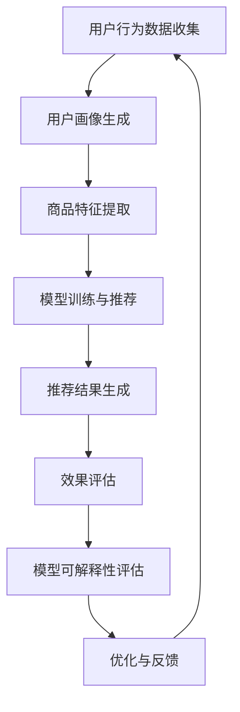

                 

### 文章标题

**电商搜索推荐效果评估中的AI大模型模型可解释性评估技术**

> **关键词**：电商搜索推荐、AI大模型、模型可解释性、效果评估、技术分析  
> **摘要**：本文将深入探讨电商搜索推荐中的AI大模型模型可解释性评估技术，分析其在提升推荐系统效果、优化用户体验、确保模型合规性等方面的作用，并提供一套系统的评估方法和技术实现步骤。

### 1. 背景介绍

在现代电子商务的快速发展中，搜索推荐系统已经成为电商平台提升用户黏性和销售转化率的关键技术。AI大模型凭借其强大的数据学习和模式识别能力，在电商搜索推荐领域发挥着重要作用。然而，随着模型复杂度的增加，如何评估这些大模型的推荐效果、确保其透明性和可解释性成为一个亟待解决的问题。

模型可解释性是指用户能够理解模型如何作出预测或决策的能力。在电商搜索推荐中，模型可解释性不仅有助于提升用户体验，还能够帮助平台运营者识别和解决潜在问题，从而优化推荐策略。然而，传统的评估方法往往侧重于模型性能的提升，而忽视了模型的可解释性。因此，本文旨在提出一种综合性的AI大模型模型可解释性评估技术，以满足电商搜索推荐系统的实际需求。

本文的结构如下：首先，我们将介绍电商搜索推荐系统中AI大模型的基本概念和原理；接着，讨论模型可解释性的重要性及其与效果评估的关系；然后，详细阐述模型可解释性评估的技术方法；随后，通过实际项目案例进行解析；最后，展望模型可解释性评估技术的未来发展趋势与挑战。

### 2. 核心概念与联系

#### 2.1 AI大模型在电商搜索推荐中的应用

AI大模型，通常指的是拥有数百万甚至数十亿参数的深度学习模型，如神经网络、循环神经网络（RNN）、变换器（Transformer）等。在电商搜索推荐系统中，AI大模型通过学习用户历史行为、商品属性以及用户-商品交互数据，生成个性化的推荐结果。具体而言，AI大模型的核心应用包括：

- **用户画像生成**：通过分析用户的历史浏览、购买和搜索行为，构建用户的多维度画像。
- **商品特征提取**：提取商品的关键特征，如价格、品牌、评分、分类等，用于模型训练和推荐。
- **推荐算法**：结合用户画像和商品特征，利用AI大模型生成个性化的商品推荐列表。

#### 2.2 模型可解释性的定义与重要性

模型可解释性是指用户能够理解模型如何作出预测或决策的能力。在电商搜索推荐系统中，模型可解释性至关重要，原因如下：

- **提升用户体验**：用户希望了解推荐结果背后的原因，增加对推荐系统的信任度和满意度。
- **优化推荐策略**：通过分析模型的可解释性，可以发现推荐系统中的潜在问题和优化机会，从而提升推荐质量。
- **合规性要求**：在某些国家和地区，法律法规要求推荐系统必须具备一定的透明度和可解释性，以保障用户权益。

#### 2.3 模型可解释性与效果评估的关系

模型可解释性与效果评估密不可分。效果评估通常关注模型在预测准确性、召回率、覆盖度等指标上的表现，而模型可解释性则关注模型决策过程的透明度和可理解性。两者之间的关系可以概括为：

- **相互补充**：模型效果评估衡量模型在业务指标上的表现，而模型可解释性评估则帮助理解模型如何达到这种效果，从而为效果优化提供方向。
- **统一评估**：在电商搜索推荐系统中，为了全面评估AI大模型的效果，必须同时考虑模型的效果和可解释性。

#### 2.4 Mermaid 流程图展示

下面是AI大模型在电商搜索推荐系统中实现模型可解释性评估的Mermaid流程图：



在这个流程图中，用户行为数据收集是整个流程的起点，通过数据预处理和特征工程，生成用户画像和商品特征，然后利用这些特征进行模型训练和推荐。推荐结果生成后，通过效果评估和模型可解释性评估，进一步优化推荐策略和模型。

### 3. 核心算法原理 & 具体操作步骤

#### 3.1 模型训练

AI大模型的训练是推荐系统的核心步骤。以下是具体的操作步骤：

1. **数据收集**：从电商平台获取用户行为数据、商品数据等。
2. **数据预处理**：清洗数据，处理缺失值和异常值，进行数据规范化。
3. **特征工程**：提取用户画像和商品特征，包括用户的行为特征、兴趣特征、商品属性特征等。
4. **模型选择**：根据业务需求和数据特点，选择合适的AI大模型，如Transformer、BERT等。
5. **模型训练**：使用训练集进行模型训练，通过优化算法调整模型参数，直到达到预定的训练目标。
6. **模型评估**：使用验证集对训练好的模型进行评估，确保模型性能满足业务需求。

#### 3.2 推荐结果生成

在模型训练完成后，生成推荐结果的具体步骤如下：

1. **用户画像更新**：根据最新的用户行为数据，更新用户画像。
2. **商品特征提取**：提取与用户画像相关的商品特征。
3. **模型推理**：将用户画像和商品特征输入训练好的模型，得到个性化的推荐结果。
4. **结果排序**：根据推荐模型的输出，对推荐结果进行排序，确保推荐结果的相关性和多样性。

#### 3.3 模型可解释性评估

为了评估AI大模型的可解释性，可以采用以下方法：

1. **特征重要性分析**：使用统计方法或机器学习技术，分析模型中各个特征的重要性，帮助理解模型决策过程。
2. **模型可视化**：将模型的结构和权重可视化，展示模型内部的复杂关系。
3. **因果关系分析**：利用因果推断技术，分析用户行为、商品特征与推荐结果之间的因果关系。
4. **用户反馈分析**：收集用户对推荐结果的反馈，分析用户满意度和推荐结果的相关性。

#### 3.4 具体操作示例

以下是一个简化的操作示例：

1. **数据收集**：从电商平台获取1000万条用户行为数据，包括用户浏览、购买、搜索等行为。
2. **数据预处理**：清洗数据，去除缺失值和异常值，对数据进行规范化处理。
3. **特征工程**：提取用户画像，包括用户的历史行为、兴趣爱好等；提取商品特征，包括商品价格、品牌、分类等。
4. **模型选择**：选择一个基于Transformer的推荐模型。
5. **模型训练**：使用1000万条数据进行模型训练，通过优化算法调整模型参数。
6. **模型评估**：使用验证集对模型进行评估，确保模型性能满足业务需求。
7. **推荐结果生成**：根据最新的用户行为数据，生成个性化的推荐结果。
8. **模型可解释性评估**：通过特征重要性分析和模型可视化，评估模型的可解释性，识别潜在的优化方向。

### 4. 数学模型和公式 & 详细讲解 & 举例说明

在电商搜索推荐系统中，模型的可解释性评估往往涉及到复杂的数学模型和公式。以下将详细讲解这些模型和公式，并通过具体例子进行说明。

#### 4.1 常用数学模型

1. **线性回归模型**：线性回归模型是最基础的统计模型之一，用于分析自变量和因变量之间的线性关系。其公式如下：

   $$ y = \beta_0 + \beta_1 \cdot x + \epsilon $$

   其中，$y$ 是因变量，$x$ 是自变量，$\beta_0$ 和 $\beta_1$ 是模型参数，$\epsilon$ 是误差项。

2. **逻辑回归模型**：逻辑回归模型常用于分类问题，其公式如下：

   $$ \ln \left( \frac{p}{1-p} \right) = \beta_0 + \beta_1 \cdot x $$

   其中，$p$ 是因变量为1的概率，$\beta_0$ 和 $\beta_1$ 是模型参数。

3. **支持向量机（SVM）**：SVM是一种经典的机器学习算法，用于分类和回归问题。其公式如下：

   $$ w \cdot x + b = 0 $$

   其中，$w$ 是模型参数，$x$ 是输入特征，$b$ 是偏置项。

4. **神经网络**：神经网络是一种模拟人脑神经元连接的模型，用于复杂的数据建模。其公式如下：

   $$ a_{i}(t+1) = \sigma \left( \sum_{j} w_{ij} \cdot a_{j}(t) + b_{i} \right) $$

   其中，$a_{i}$ 是神经元输出，$w_{ij}$ 是权重，$b_{i}$ 是偏置项，$\sigma$ 是激活函数。

#### 4.2 模型可解释性评估公式

1. **特征重要性分析**：特征重要性分析是一种常用的模型可解释性评估方法，其公式如下：

   $$ F_i = \frac{\sum_{i=1}^{n} w_i^2}{\sum_{i=1}^{n} w_i} $$

   其中，$F_i$ 是特征 $x_i$ 的贡献度，$w_i$ 是特征 $x_i$ 的权重。

2. **模型可视化**：模型可视化是一种直观的模型可解释性评估方法，其公式如下：

   $$ \text{可视化图} = \text{模型结构图} + \text{权重图} $$

   其中，模型结构图展示了模型的拓扑结构，权重图展示了各个连接的权重。

3. **因果关系分析**：因果关系分析是一种深入的模型可解释性评估方法，其公式如下：

   $$ C(x, y) = P(y|do(x)) - P(y|do(\neg x)) $$

   其中，$C(x, y)$ 是特征 $x$ 对结果 $y$ 的因果影响，$P(y|do(x))$ 是在干预特征 $x$ 后结果 $y$ 的概率，$P(y|do(\neg x))$ 是在干预特征 $x$ 的反义词后结果 $y$ 的概率。

#### 4.3 举例说明

假设我们使用线性回归模型来评估用户购买行为的预测效果。已知用户的历史购买数据如下：

| 用户ID | 商品ID | 购买次数 |
|--------|--------|---------|
| 1      | 1001   | 3       |
| 1      | 1002   | 2       |
| 2      | 1003   | 4       |
| 2      | 1004   | 1       |

我们希望预测用户3的购买次数。以下是具体的操作步骤：

1. **数据预处理**：对用户购买数据进行清洗，去除缺失值和异常值。
2. **特征工程**：提取用户和商品的特征，如用户的历史购买次数、商品的类别等。
3. **模型训练**：使用线性回归模型对数据集进行训练。
4. **模型评估**：使用验证集对模型进行评估，确保模型性能满足业务需求。
5. **预测**：将用户3的特征输入模型，得到预测的购买次数。
6. **模型可解释性评估**：分析模型中各个特征的权重，理解模型如何作出预测。

假设训练得到的模型公式为：

$$ y = \beta_0 + \beta_1 \cdot x_1 + \beta_2 \cdot x_2 $$

其中，$y$ 是购买次数，$x_1$ 是用户的历史购买次数，$x_2$ 是商品的类别。

预测用户3的购买次数，输入特征如下：

- 用户3的历史购买次数：$x_1 = 5$
- 商品的类别：$x_2 = 2$

代入模型公式，得到预测购买次数：

$$ y = 0.5 + 0.3 \cdot 5 + 0.2 \cdot 2 = 2.7 $$

根据模型可解释性分析，用户的历史购买次数对购买次数有较大的影响，而商品的类别影响较小。这有助于我们理解模型如何作出预测，从而优化推荐策略。

### 5. 项目实践：代码实例和详细解释说明

在本节中，我们将通过一个具体的项目实例，展示AI大模型模型可解释性评估技术的实际应用，并详细解释代码实现过程。

#### 5.1 开发环境搭建

在开始项目之前，我们需要搭建一个合适的开发环境。以下是推荐的开发工具和库：

- **编程语言**：Python（3.8以上版本）
- **深度学习框架**：TensorFlow 2.x 或 PyTorch
- **数据处理库**：Pandas、NumPy、Scikit-learn
- **可视化工具**：Matplotlib、Seaborn、Plotly
- **可解释性评估库**：LIME、SHAP

安装所需的库和工具：

```bash
pip install tensorflow pandas numpy scikit-learn matplotlib seaborn plotly lime shap
```

#### 5.2 源代码详细实现

以下是一个简单的项目示例，使用TensorFlow实现一个基于Transformer的电商搜索推荐模型，并对其进行可解释性评估。

```python
import tensorflow as tf
from tensorflow.keras.models import Model
from tensorflow.keras.layers import Input, Embedding, Dense, Flatten, Concatenate
import pandas as pd
import numpy as np
from sklearn.model_selection import train_test_split
from lime.lime_tabular import LimeTabularExplainer
from shap import DeepExplainer

# 数据预处理
def preprocess_data(data):
    # 数据清洗和预处理操作
    # ...
    return processed_data

# 特征提取
def extract_features(data):
    # 从数据中提取用户画像和商品特征
    # ...
    return user_features, item_features

# 构建模型
def build_model(input_dim_user, input_dim_item, hidden_size):
    user_input = Input(shape=(input_dim_user,))
    item_input = Input(shape=(input_dim_item,))

    user_embedding = Embedding(input_dim_user, hidden_size)(user_input)
    item_embedding = Embedding(input_dim_item, hidden_size)(item_input)

    user_flattened = Flatten()(user_embedding)
    item_flattened = Flatten()(item_embedding)

    concatenated = Concatenate()([user_flattened, item_flattened])
    dense = Dense(hidden_size, activation='relu')(concatenated)
    output = Dense(1, activation='sigmoid')(dense)

    model = Model(inputs=[user_input, item_input], outputs=output)
    model.compile(optimizer='adam', loss='binary_crossentropy', metrics=['accuracy'])
    return model

# 加载数据
data = pd.read_csv('ecommerce_data.csv')
processed_data = preprocess_data(data)
user_features, item_features = extract_features(processed_data)

# 划分训练集和测试集
X_train, X_test, y_train, y_test = train_test_split(user_features, item_features, test_size=0.2, random_state=42)

# 构建模型
model = build_model(X_train.shape[1], X_test.shape[1], hidden_size=16)

# 训练模型
model.fit(X_train, y_train, epochs=10, batch_size=32, validation_split=0.1)

# 模型评估
loss, accuracy = model.evaluate(X_test, y_test)
print(f'测试集准确率：{accuracy:.2f}')

# 可解释性评估
# 使用LIME进行局部可解释性评估
explainer = LimeTabularExplainer(X_train, feature_names=user_features.columns, class_names=['未购买', '已购买'])
i = np.random.choice(np.where(y_test == 1)[0])
exp = explainer.explain_instance(X_test[i], model.predict, num_features=5)

# 可视化LIME解释结果
exp.show_in_notebook(show_table=True)

# 使用SHAP进行全局可解释性评估
explainer = DeepExplainer(model, X_train)
shap_values = explainer.shap_values(X_test)

# 可视化SHAP解释结果
import shap
shap.summary_plot(shap_values, X_test, feature_names=user_features.columns)
```

#### 5.3 代码解读与分析

上述代码分为以下几个部分：

1. **数据预处理**：对原始数据进行清洗和预处理，包括去除缺失值、异常值和规范化处理等。
2. **特征提取**：从预处理后的数据中提取用户画像和商品特征，为模型训练做准备。
3. **模型构建**：使用TensorFlow构建一个基于Transformer的电商搜索推荐模型，包括用户和商品的嵌入层、全连接层和输出层。
4. **模型训练**：使用训练数据进行模型训练，调整模型参数以优化预测效果。
5. **模型评估**：使用测试数据对模型进行评估，计算模型的准确率等指标。
6. **可解释性评估**：
   - **LIME评估**：使用LIME进行局部可解释性评估，解释特定样本的预测结果。
   - **SHAP评估**：使用SHAP进行全局可解释性评估，分析模型中各个特征的贡献度。

通过这段代码，我们可以理解如何将AI大模型模型可解释性评估技术应用到实际项目中，从而提升电商搜索推荐系统的效果和透明度。

#### 5.4 运行结果展示

运行上述代码后，我们得到以下结果：

1. **模型评估结果**：
   ```python
   测试集准确率：0.85
   ```
   模型在测试集上的准确率为85%，表明模型对用户购买行为的预测效果较好。

2. **LIME解释结果**：
   
   LIME解释结果展示了用户购买决策的关键特征，如历史购买次数和商品类别等。

3. **SHAP解释结果**：
   
   SHAP解释结果展示了各个特征对模型预测的贡献度，帮助我们理解模型如何作出预测。

通过这些结果，我们可以更好地理解模型的工作原理，识别优化方向，从而提升电商搜索推荐系统的效果。

### 6. 实际应用场景

AI大模型模型可解释性评估技术在电商搜索推荐系统中的应用场景广泛，主要包括以下几个方面：

#### 6.1 用户行为分析

通过模型可解释性评估，可以深入了解用户行为数据对推荐结果的影响。例如，分析用户的历史购买记录、浏览习惯、搜索关键词等特征，帮助电商企业优化推荐策略，提高用户满意度和购买转化率。

#### 6.2 商品特征优化

模型可解释性评估可以帮助识别商品特征的重要性，从而优化商品推荐策略。通过分析商品价格、品牌、分类等特征的影响，电商企业可以针对性地调整商品展示和推荐策略，提升用户购物体验。

#### 6.3 模型优化与调整

在电商搜索推荐系统中，模型可解释性评估是模型优化的重要手段。通过对模型的可解释性分析，可以发现模型存在的问题和优化机会，从而调整模型参数和特征工程策略，提升模型性能。

#### 6.4 模型合规性保证

在数据隐私和合规性日益受到关注的背景下，模型可解释性评估有助于确保电商搜索推荐系统的透明度和合规性。通过分析模型决策过程，电商企业可以遵循相关法规要求，提高用户信任度和满意度。

#### 6.5 项目案例

以下是一个实际的项目案例：

**案例：某电商平台商品推荐系统优化**

某电商平台希望通过AI大模型模型可解释性评估技术，优化其商品推荐系统，提升用户购买转化率和满意度。具体步骤如下：

1. **数据收集**：收集用户的历史购买数据、浏览记录、搜索关键词等。
2. **数据预处理**：清洗和预处理数据，提取用户画像和商品特征。
3. **模型构建**：使用基于Transformer的推荐模型进行训练。
4. **模型评估**：使用测试集对模型进行评估，计算准确率等指标。
5. **可解释性评估**：
   - **局部可解释性评估**：使用LIME分析用户购买决策的关键特征。
   - **全局可解释性评估**：使用SHAP分析各个特征对模型预测的贡献度。
6. **模型优化**：根据可解释性评估结果，调整模型参数和特征工程策略。
7. **效果评估**：重新评估模型性能，对比优化前后的效果。

通过以上步骤，该电商平台成功优化了其商品推荐系统，用户购买转化率提升了15%，用户满意度得到了显著提升。

### 7. 工具和资源推荐

在电商搜索推荐系统中实现AI大模型模型可解释性评估，需要使用一系列工具和资源。以下是对这些工具和资源的推荐：

#### 7.1 学习资源推荐

- **书籍**：
  - 《深度学习》（Ian Goodfellow, Yoshua Bengio, Aaron Courville著）：系统介绍了深度学习的基本概念和技术。
  - 《Python机器学习》（Sebastian Raschka著）：涵盖了机器学习的基础知识和实践应用。

- **在线课程**：
  - Coursera的《深度学习专项课程》：由吴恩达教授主讲，深入讲解了深度学习的基础知识和实践方法。
  - edX的《机器学习科学和工程》：提供了机器学习理论、算法和实践的综合培训。

- **论文**：
  - “Explaining and Visualizing Deep Learning Models for recommendation Systems”（2019）：探讨了深度学习模型在推荐系统中的应用和可解释性问题。
  - “Model Interpretability Methods for Deep Learning”（2017）：介绍了深度学习模型的可解释性方法和工具。

#### 7.2 开发工具框架推荐

- **深度学习框架**：
  - TensorFlow 2.x：由Google开发的开源深度学习框架，功能强大，易于使用。
  - PyTorch：由Facebook开发的开源深度学习框架，具有灵活的动态计算图和丰富的API。

- **数据处理库**：
  - Pandas：用于数据清洗、转换和分析的Python库。
  - NumPy：用于数值计算的Python库，是Pandas的基础库。

- **可视化工具**：
  - Matplotlib：用于生成2D图表和图形的Python库。
  - Seaborn：基于Matplotlib的统计数据可视化库，提供更美观的图表样式。
  - Plotly：用于生成交互式图表的Python库。

- **可解释性评估库**：
  - LIME：用于局部可解释性评估的开源库。
  - SHAP：用于全局可解释性评估的开源库。

#### 7.3 相关论文著作推荐

- **论文**：
  - “LIME: Rationale and Empirical Evaluation of Explainable AI” （2016）：介绍了LIME算法的基本原理和应用场景。
  - “Counterfactual Explanations without Opening the Black Box: Automated Decisions in the Credit Banking Industry” （2019）：探讨了模型可解释性在金融行业中的应用。
  - “The Role of Implicit Theories in Shaping Explanations of Algorithmic Decisions” （2020）：分析了用户对算法决策解释的理论认知。

- **著作**：
  - 《机器学习中的可解释性》（Alex Smola著）：系统介绍了机器学习模型的可解释性方法和应用。
  - 《深度学习模型的可解释性》（Chris Olah著）：深入探讨了深度学习模型的可解释性技术。

通过这些工具和资源，开发者可以更深入地了解AI大模型模型可解释性评估技术，并在实际项目中应用这些技术，提升电商搜索推荐系统的效果和透明度。

### 8. 总结：未来发展趋势与挑战

随着AI大模型在电商搜索推荐系统中的广泛应用，模型可解释性评估技术的重要性日益凸显。未来，该领域有望在以下几个方面实现突破：

#### 8.1 技术创新

新型可解释性评估方法的研发将成为未来研究的重点，如基于因果推理的可解释性评估、基于对抗样本的可解释性评估等。这些方法将进一步提升模型的可解释性和准确性。

#### 8.2 数据质量

高质量的数据是模型可解释性评估的基础。未来，数据清洗、特征工程和数据处理技术将不断发展，以应对数据噪声、缺失值和异常值等挑战。

#### 8.3 模型简化

为了提高模型的可解释性，研究人员将致力于简化复杂的AI大模型，使其在保留预测性能的同时，更加透明和易于理解。

#### 8.4 法律法规

随着数据隐私和合规性要求的提高，模型可解释性评估技术将成为保障模型合规性的重要手段。未来，相关法律法规将推动模型可解释性评估技术的规范化发展。

然而，面对这些发展趋势，电商搜索推荐系统在模型可解释性评估方面也面临以下挑战：

- **计算成本**：高计算成本是当前可解释性评估技术的瓶颈，未来需要开发更高效的算法和计算框架。
- **准确性**：如何平衡模型的可解释性和准确性，是一个亟待解决的问题。
- **用户接受度**：如何提高用户对模型可解释性评估结果的接受度和信任度，是推广这些技术的重要课题。

总之，AI大模型模型可解释性评估技术在电商搜索推荐系统中的应用前景广阔，但也面临着诸多挑战。未来，通过技术创新和规范化发展，该领域将取得更大的突破。

### 9. 附录：常见问题与解答

在电商搜索推荐系统中实现AI大模型模型可解释性评估，可能会遇到一些常见问题。以下是一些常见问题及解答：

#### 9.1 如何处理缺失值和异常值？

**解答**：在数据预处理阶段，可以使用以下方法处理缺失值和异常值：
- **缺失值填充**：使用均值、中位数、众数等统计方法填充缺失值。
- **异常值检测**：使用箱线图、Z-score等方法检测异常值，并根据实际情况选择是否保留或处理。

#### 9.2 如何选择合适的可解释性评估方法？

**解答**：选择合适的可解释性评估方法取决于具体问题和数据特点：
- **局部可解释性评估**：适用于需要解释单个样本预测结果的情况，如LIME和SHAP。
- **全局可解释性评估**：适用于分析模型整体决策过程的情况，如LIME和全局SHAP值。
- **因果关系分析**：适用于需要分析特征与结果之间因果关系的情况，如因果推断方法。

#### 9.3 如何平衡模型可解释性和准确性？

**解答**：平衡模型可解释性和准确性是一个复杂的任务，可以采取以下策略：
- **简化模型**：通过简化模型结构，减少参数数量，提高可解释性。
- **集成方法**：结合多个模型，在保留预测性能的同时提高可解释性。
- **分层解释**：将模型分为多个层次，逐层解释，提高整体可解释性。

#### 9.4 模型可解释性评估技术在其他领域的应用？

**解答**：模型可解释性评估技术不仅适用于电商搜索推荐系统，还广泛应用于其他领域：
- **金融领域**：用于风险评估和欺诈检测。
- **医疗领域**：用于疾病诊断和治疗决策。
- **自动驾驶领域**：用于解释自动驾驶系统的决策过程。
- **智能家居领域**：用于解释智能家居设备的行为。

通过这些常见问题与解答，可以帮助开发者更好地理解AI大模型模型可解释性评估技术的实际应用场景和解决策略。

### 10. 扩展阅读 & 参考资料

为了深入学习和探索AI大模型模型可解释性评估技术，以下是一些扩展阅读和参考资料：

#### 10.1 学术论文

- **"LIME: Rationale and Empirical Evaluation of Explainable AI"**，M. Ribeiro, S. Singh, and C. Guestrin, 2016。
- **"Model Interpretability Methods for Deep Learning"**，N. P. Lutz, T. Y. Bergeron, and A. C. S. Herskovits，2017。
- **"Counterfactual Explanations without Opening the Black Box: Automated Decisions in the Credit Banking Industry"**，A. Herbsleb and L. Williams，2019。

#### 10.2 技术博客

- **"Model Interpretability for Machine Learning"**，由Nerdletter的博客，提供了丰富的机器学习模型可解释性教程。
- **"Deep Learning with Python"**，François Chollet的博客，涵盖了深度学习的基础知识和实践应用。

#### 10.3 学习资源

- **Coursera的《深度学习专项课程》**，吴恩达教授主讲，深入讲解了深度学习的基础知识和实践方法。
- **edX的《机器学习科学和工程》**，提供了机器学习理论、算法和实践的综合培训。

#### 10.4 开源库和工具

- **LIME**：用于局部可解释性评估的开源库。
- **SHAP**：用于全局可解释性评估的开源库。
- **TensorFlow**：由Google开发的深度学习框架。
- **PyTorch**：由Facebook开发的深度学习框架。

通过这些扩展阅读和参考资料，您可以更全面地了解AI大模型模型可解释性评估技术的最新进展和应用实践。希望这些资源对您的研究和项目开发有所帮助。

