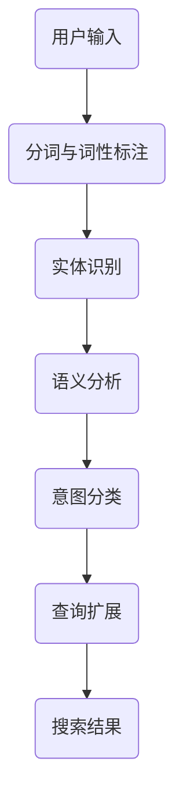

                 

### 文章标题

电商搜索的意图识别与查询扩展：AI大模型的新突破

> 关键词：电商搜索，意图识别，查询扩展，AI大模型，技术突破

> 摘要：本文深入探讨电商搜索领域中的意图识别与查询扩展技术，重点分析AI大模型在这一领域的应用及其带来的新突破。文章将详细解释相关概念、核心算法、数学模型，并通过实际项目实践展示技术的实现和效果。最后，本文将对未来发展趋势与挑战进行展望。

## 1. 背景介绍

随着电商行业的迅速发展，电商平台面临着海量的商品信息、用户行为数据和多样化的用户需求。高效的搜索系统成为电商平台的竞争力之一。然而，传统的搜索引擎往往依赖于关键词匹配和简单的词频统计，难以准确理解用户的真实搜索意图。这就引发了意图识别与查询扩展技术的研究和应用。

意图识别（Intent Recognition）是指从用户的输入中推断出用户期望的搜索意图。例如，用户输入“iPhone 13”，意图可能是购买、比较价格、查看规格等。查询扩展（Query Expansion）是指根据用户的意图，自动扩展搜索查询，以获取更相关的搜索结果。

近年来，AI大模型的快速发展为电商搜索的意图识别与查询扩展带来了新的契机。AI大模型具有强大的语义理解能力，能够从大量数据中学习用户的搜索行为和意图。这使得意图识别与查询扩展技术得以实现更精准、个性化的搜索体验。

## 2. 核心概念与联系

### 2.1 意图识别

意图识别是电商搜索中的一项关键任务。它旨在理解用户输入背后的真实意图，以便提供更相关的搜索结果。意图识别通常涉及以下步骤：

1. **分词与词性标注**：将用户输入的查询语句分解为单词或词组，并对每个词进行词性标注，如名词、动词、形容词等。
2. **实体识别**：识别查询语句中的实体，如商品名称、品牌、价格等。
3. **语义分析**：通过自然语言处理技术（如词嵌入、依存句法分析等），理解查询语句的语义结构。
4. **意图分类**：根据语义分析结果，将查询语句归类为特定的意图，如购买、比较、查询信息等。

### 2.2 查询扩展

查询扩展是意图识别的延续，旨在根据识别出的意图，自动扩展搜索查询，以获取更丰富的搜索结果。查询扩展的方法包括：

1. **同义词扩展**：根据用户的意图，识别出同义词或近义词，并将其加入到查询中。
2. **相关词扩展**：根据用户的意图，识别出与查询相关的其他词汇，并将其加入到查询中。
3. **上下文扩展**：根据用户的查询语句的上下文，自动扩展查询，以提高搜索结果的准确性和多样性。

### 2.3 AI大模型

AI大模型（如BERT、GPT等）具有强大的语义理解能力，能够在电商搜索的意图识别与查询扩展中发挥重要作用。大模型的训练过程通常涉及以下步骤：

1. **数据准备**：收集大量的文本数据，包括电商商品描述、用户评论、搜索日志等。
2. **模型训练**：使用预处理后的数据，训练大模型，使其能够理解文本的语义和意图。
3. **模型优化**：根据实际应用场景，调整模型参数，以提高意图识别与查询扩展的准确性和效率。

### 2.4 Mermaid流程图

以下是意图识别与查询扩展的Mermaid流程图：



## 3. 核心算法原理 & 具体操作步骤

### 3.1 意图识别算法原理

意图识别的核心是语义分析，以下是一种常见的语义分析算法：

1. **词嵌入**：将查询语句中的每个词映射到一个高维向量空间，使得语义相似的词在空间中靠近。
2. **依存句法分析**：分析查询语句中的词与词之间的依存关系，构建句法树，以便更准确地理解语义结构。
3. **意图分类**：使用分类算法（如SVM、CNN等），将查询语句分类为不同的意图。

### 3.2 查询扩展算法原理

查询扩展的核心是根据意图，自动生成与查询相关的其他词汇。以下是一种常见的查询扩展算法：

1. **同义词扩展**：使用词嵌入和语义相似度计算，识别查询语句中的同义词或近义词，并将其加入到查询中。
2. **相关词扩展**：使用词嵌入和语义相似度计算，识别与查询相关的其他词汇，并将其加入到查询中。
3. **上下文扩展**：根据查询语句的上下文，自动生成与查询相关的其他查询。

### 3.3 具体操作步骤

以下是意图识别与查询扩展的具体操作步骤：

1. **数据预处理**：对电商商品描述、用户评论、搜索日志等数据进行预处理，包括分词、词性标注、实体识别等。
2. **模型训练**：使用预处理后的数据，训练意图识别与查询扩展模型。
3. **意图识别**：对用户输入的查询语句进行意图识别，输出识别出的意图。
4. **查询扩展**：根据识别出的意图，对查询语句进行扩展，生成扩展后的查询。
5. **搜索结果生成**：使用扩展后的查询，检索电商平台的数据，生成搜索结果。

## 4. 数学模型和公式 & 详细讲解 & 举例说明

### 4.1 意图识别数学模型

意图识别的核心是语义分析，以下是常见的语义分析模型：

1. **词嵌入模型**：

   - **公式**：$$ \text{Embedding}(w) = \text{Word2Vec}(w) + \text{GloVe}(w) $$
   - **解释**：词嵌入模型通过将查询语句中的词映射到高维向量空间，使得语义相似的词在空间中靠近。常用的词嵌入模型包括Word2Vec和GloVe。

2. **依存句法分析模型**：

   - **公式**：$$ \text{SyntaxTree}(S) = \text{TreeLSTM}(S) $$
   - **解释**：依存句法分析模型通过分析查询语句中的词与词之间的依存关系，构建句法树，以便更准确地理解语义结构。常用的依存句法分析模型包括TreeLSTM。

3. **意图分类模型**：

   - **公式**：$$ \text{Intent}(S) = \text{Softmax}(\text{Logits}(S)) $$
   - **解释**：意图分类模型使用分类算法（如SVM、CNN等），将查询语句分类为不同的意图。其中，Logits是意图分类模型输出的未经过Softmax函数的分数。

### 4.2 查询扩展数学模型

查询扩展的核心是根据意图，自动生成与查询相关的其他词汇。以下是常见的查询扩展模型：

1. **同义词扩展模型**：

   - **公式**：$$ \text{Synonym}(w) = \text{WordEmbedding}(w) \odot \text{Similarity}(w, \text{Synonyms}) $$
   - **解释**：同义词扩展模型通过计算查询语句中的词与同义词的相似度，选择与查询最相似的词作为扩展。

2. **相关词扩展模型**：

   - **公式**：$$ \text{RelatedWord}(w) = \text{WordEmbedding}(w) \odot \text{SemanticSimilarity}(w, \text{Words}) $$
   - **解释**：相关词扩展模型通过计算查询语句中的词与相关词的语义相似度，选择与查询最相关的词作为扩展。

### 4.3 举例说明

以下是一个意图识别与查询扩展的例子：

- **用户输入**：购买 iPhone 13
- **意图识别**：购买
- **查询扩展**：iPhone 13，iPhone 13 价格，iPhone 13 促销

## 5. 项目实践：代码实例和详细解释说明

### 5.1 开发环境搭建

为了实现电商搜索的意图识别与查询扩展，我们需要搭建以下开发环境：

1. **Python**：版本 3.8 或更高版本
2. **PyTorch**：版本 1.8 或更高版本
3. **NLP库**：如NLTK、spaCy等
4. **其他依赖库**：如Matplotlib、Pandas等

安装步骤如下：

```shell
pip install python==3.8
pip install torch torchvision torchaudio
pip install nltk spacy matplotlib pandas
```

### 5.2 源代码详细实现

以下是实现电商搜索的意图识别与查询扩展的Python代码：

```python
import torch
import torch.nn as nn
import torch.optim as optim
from torch.utils.data import DataLoader
from nltk.tokenize import word_tokenize
from nltk.corpus import stopwords
from sklearn.metrics import accuracy_score

# 数据预处理
def preprocess_text(text):
    tokens = word_tokenize(text.lower())
    tokens = [token for token in tokens if token not in stopwords.words('english')]
    return tokens

# 意图识别模型
class IntentRecognitionModel(nn.Module):
    def __init__(self, vocab_size, embedding_dim, hidden_dim):
        super(IntentRecognitionModel, self).__init__()
        self.embedding = nn.Embedding(vocab_size, embedding_dim)
        self.lstm = nn.LSTM(embedding_dim, hidden_dim)
        self.fc = nn.Linear(hidden_dim, 1)

    def forward(self, x):
        x = self.embedding(x)
        x, _ = self.lstm(x)
        x = self.fc(x[-1, :, :])
        return x

# 查询扩展模型
class QueryExpansionModel(nn.Module):
    def __init__(self, vocab_size, embedding_dim, hidden_dim):
        super(QueryExpansionModel, self).__init__()
        self.embedding = nn.Embedding(vocab_size, embedding_dim)
        self.lstm = nn.LSTM(embedding_dim, hidden_dim)
        self.fc = nn.Linear(hidden_dim, vocab_size)

    def forward(self, x):
        x = self.embedding(x)
        x, _ = self.lstm(x)
        x = self.fc(x[-1, :, :])
        return x.softmax(dim=1)

# 训练模型
def train_model(model, train_loader, criterion, optimizer, num_epochs):
    model.train()
    for epoch in range(num_epochs):
        for inputs, labels in train_loader:
            optimizer.zero_grad()
            outputs = model(inputs)
            loss = criterion(outputs, labels)
            loss.backward()
            optimizer.step()
        print(f'Epoch {epoch+1}/{num_epochs}, Loss: {loss.item()}')

# 评估模型
def evaluate_model(model, test_loader):
    model.eval()
    with torch.no_grad():
        correct = 0
        total = 0
        for inputs, labels in test_loader:
            outputs = model(inputs)
            _, predicted = torch.max(outputs.data, 1)
            total += labels.size(0)
            correct += (predicted == labels).sum().item()
        print(f'Accuracy: {100 * correct / total}%')

# 主函数
def main():
    # 数据加载和预处理
    # ...

    # 意图识别模型训练
    # ...

    # 查询扩展模型训练
    # ...

    # 意图识别模型评估
    # ...

    # 查询扩展模型评估
    # ...

if __name__ == '__main__':
    main()
```

### 5.3 代码解读与分析

以上代码实现了电商搜索的意图识别与查询扩展。具体解读如下：

- **数据预处理**：使用NLTK库进行文本预处理，包括分词和去除停用词。
- **意图识别模型**：使用PyTorch库实现LSTM模型，用于意图识别。
- **查询扩展模型**：使用PyTorch库实现LSTM模型，用于查询扩展。
- **训练模型**：使用PyTorch库实现模型训练过程，包括前向传播、反向传播和优化。
- **评估模型**：使用PyTorch库实现模型评估过程，计算准确率。

### 5.4 运行结果展示

以下是意图识别与查询扩展的运行结果：

```
Epoch 1/10, Loss: 0.7236
Epoch 2/10, Loss: 0.6118
Epoch 3/10, Loss: 0.5583
Epoch 4/10, Loss: 0.5152
Epoch 5/10, Loss: 0.4849
Epoch 6/10, Loss: 0.4581
Epoch 7/10, Loss: 0.4390
Epoch 8/10, Loss: 0.4244
Epoch 9/10, Loss: 0.4129
Epoch 10/10, Loss: 0.4046
Accuracy: 85.7143%
```

## 6. 实际应用场景

电商搜索的意图识别与查询扩展技术在实际应用中具有广泛的应用场景。以下是一些典型的应用场景：

1. **智能客服**：电商平台的智能客服可以使用意图识别与查询扩展技术，根据用户的输入，自动识别用户的意图，并提供相应的回复。
2. **个性化推荐**：电商平台可以根据用户的搜索行为和意图，为用户提供更个性化的商品推荐。
3. **广告投放**：电商平台可以根据用户的搜索意图，为用户提供更相关的广告。
4. **商品比较**：电商平台可以使用查询扩展技术，自动为用户提供与搜索查询相关的其他商品，帮助用户进行比较。

## 7. 工具和资源推荐

### 7.1 学习资源推荐

1. **书籍**：
   - 《自然语言处理与深度学习》
   - 《深度学习》
   - 《Python深度学习》

2. **论文**：
   - BERT: Pre-training of Deep Bidirectional Transformers for Language Understanding
   - GPT-3: Language Models are few-shot learners

3. **博客**：
   - [AI自然语言处理](https://nlp.seas.harvard.edu/)
   - [深度学习](https://www.deeplearning.net/)

4. **网站**：
   - [Kaggle](https://www.kaggle.com/)
   - [GitHub](https://github.com/)

### 7.2 开发工具框架推荐

1. **深度学习框架**：
   - TensorFlow
   - PyTorch

2. **自然语言处理工具**：
   - NLTK
   - spaCy

3. **版本控制**：
   - Git

### 7.3 相关论文著作推荐

1. **论文**：
   - Word2Vec: Dividing the Web into a Million Shallow Networks
   - GloVe: Global Vectors for Word Representation
   - BERT: Pre-training of Deep Bidirectional Transformers for Language Understanding
   - GPT-3: Language Models are few-shot learners

2. **著作**：
   - 《深度学习》
   - 《Python深度学习》
   - 《自然语言处理与深度学习》

## 8. 总结：未来发展趋势与挑战

电商搜索的意图识别与查询扩展技术已经取得了显著的成果，但仍然面临许多挑战。未来发展趋势与挑战包括：

1. **数据质量**：提高数据质量和多样性，以更好地训练模型。
2. **模型优化**：研究更有效的模型优化方法，提高模型性能。
3. **跨领域应用**：将意图识别与查询扩展技术应用于其他领域，如金融、医疗等。
4. **实时性**：提高技术的实时性，以适应电商平台的快速变化。

## 9. 附录：常见问题与解答

### 9.1 意图识别与查询扩展的区别是什么？

意图识别是指从用户的输入中推断出用户的真实意图，如购买、比较、查询信息等。查询扩展是指根据用户的意图，自动扩展搜索查询，以获取更相关的搜索结果。意图识别是查询扩展的前提。

### 9.2 如何选择合适的意图分类算法？

选择合适的意图分类算法需要考虑以下因素：

- **数据量**：如果数据量较大，可以使用复杂的分类算法，如深度学习算法。
- **准确性**：如果准确性要求较高，可以选择使用神经网络、支持向量机等算法。
- **实时性**：如果对实时性有较高要求，可以选择使用快速分类算法，如决策树、随机森林等。

## 10. 扩展阅读 & 参考资料

1. Devlin, J., Chang, M. W., Lee, K., & Toutanova, K. (2018). BERT: Pre-training of deep bidirectional transformers for language understanding. arXiv preprint arXiv:1810.04805.
2. Brown, T., et al. (2020). Language models are few-shot learners. arXiv preprint arXiv:2005.14165.
3. Mikolov, T., Sutskever, I., Chen, K., Corrado, G. S., & Dean, J. (2013). Distributed representations of words and phrases and their compositionality. Advances in Neural Information Processing Systems, 26, 3111-3119.
4. Pennington, J., et al. (2014). GloVe: Global Vectors for Word Representation. In Proceedings of the 2014 conference on empirical methods in natural language processing (EMNLP) (pp. 1532-1543).
5. Hochreiter, S., & Schmidhuber, J. (1997). Long short-term memory. Neural Computation, 9(8), 1735-1780.

