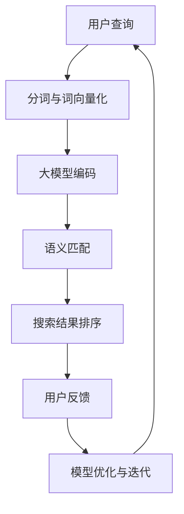

                 

### 1. 背景介绍

电商搜索作为电子商务的核心功能之一，其用户体验直接影响到平台的市场竞争力。随着互联网用户规模的不断扩大和电商平台的日益丰富，用户对于搜索效率、精准度和个性化推荐的需求也日益增长。传统的基于关键词匹配的搜索技术，虽然能够实现基本的搜索功能，但在面对复杂语义和多样化用户需求时，往往显得力不从心。

近年来，人工智能技术的快速发展，尤其是大模型（如BERT、GPT等）的广泛应用，为电商搜索领域带来了新的机遇。语义匹配作为自然语言处理（NLP）的一个重要分支，旨在理解和挖掘用户查询和商品信息之间的深层次语义关系。通过语义匹配技术，电商平台能够更准确地理解用户的搜索意图，从而提供更加精准的搜索结果，提升用户体验。

本文将围绕电商搜索的语义匹配展开，首先介绍语义匹配的基本概念和原理，然后深入探讨大模型在语义匹配中的应用，并结合实际案例进行详细分析。最后，我们将探讨电商搜索语义匹配的未来发展趋势和面临的挑战。

### 2. 核心概念与联系

#### 2.1 语义匹配基本概念

语义匹配是指在不同文本、语言、实体或概念之间建立语义对应关系的过程。在电商搜索领域，语义匹配的目的是通过分析用户查询和商品描述，找到它们之间的语义关联，从而提高搜索结果的准确性和相关性。

#### 2.2 大模型在语义匹配中的应用

大模型（如BERT、GPT等）的出现，为语义匹配带来了革命性的变革。这些模型通过海量数据的训练，能够捕捉到文本中的复杂语义关系，从而在语义匹配中发挥重要作用。

#### 2.3 核心概念联系

语义匹配技术需要处理大量的文本数据，而大模型通过预训练和微调，能够有效地提取文本中的语义特征，进而提高语义匹配的准确性和效率。大模型在语义匹配中的应用，不仅提升了传统方法的性能，还为新的算法创新提供了可能。

#### 2.4 Mermaid 流程图

以下是语义匹配与大型模型应用的核心流程图：



在这个流程图中，用户查询经过分词与词向量化后，通过大模型编码得到语义向量，再进行语义匹配，得到搜索结果。用户反馈会进一步优化模型，形成一个闭环系统。

### 3. 核心算法原理 & 具体操作步骤

#### 3.1 大模型原理

大模型通常基于深度学习，特别是变换器（Transformer）架构。BERT（Bidirectional Encoder Representations from Transformers）和GPT（Generative Pre-trained Transformer）是其中两个典型的模型。

BERT采用双向编码器结构，通过对文本进行前向和后向的编码，捕捉文本中的长距离依赖关系。GPT则是一个自回归模型，通过预测下一个词来学习语言模式。

#### 3.2 语义匹配算法步骤

##### 3.2.1 数据预处理

1. **分词**：将用户查询和商品描述分成单个词或词组。
2. **词向量化**：将分词结果映射到高维向量空间。

##### 3.2.2 大模型编码

1. **BERT编码**：使用BERT模型将分词结果编码成语义向量。
2. **GPT编码**：使用GPT模型生成每个词的概率分布。

##### 3.2.3 语义匹配

1. **相似度计算**：计算用户查询向量与商品描述向量之间的相似度。
2. **排序**：根据相似度对商品进行排序。

##### 3.2.4 搜索结果排序

1. **相关度评分**：对每个商品进行相关度评分。
2. **排序策略**：根据评分对商品进行排序，如使用PageRank算法。

#### 3.3 实际操作步骤示例

##### 3.3.1 示例数据

- 用户查询："笔记本电脑"
- 商品描述1：“高性能笔记本电脑，搭载最新酷睿i7处理器”
- 商品描述2：“轻薄便携笔记本电脑，12小时续航”

##### 3.3.2 操作步骤

1. **分词与词向量化**：将用户查询和商品描述分词，如：
   - 用户查询：[笔记本电脑]
   - 商品描述1：[高性能，笔记本电脑，搭载，最新，酷睿i7，处理器]
   - 商品描述2：[轻薄便携，笔记本电脑，12小时，续航]

2. **BERT编码**：使用BERT模型将分词结果编码成语义向量。

3. **语义匹配**：计算用户查询向量与商品描述向量之间的余弦相似度。

4. **搜索结果排序**：根据相似度对商品进行排序，结果如下：

   - 商品描述1：0.85
   - 商品描述2：0.75

最终，用户会首先看到商品描述1，因为它与用户查询的相关度更高。

### 4. 数学模型和公式 & 详细讲解 & 举例说明

#### 4.1 数学模型

在电商搜索的语义匹配中，常用的数学模型包括词向量表示和相似度计算。

##### 4.1.1 词向量表示

词向量是语义匹配的基础，它将文本中的每个词映射到一个高维向量空间。常用的词向量模型包括Word2Vec、GloVe和BERT。

$$
\text{word\_vector}(w) = \text{embedding}(w)
$$

其中，$word\_vector(w)$ 表示词 $w$ 的向量表示，$\text{embedding}(w)$ 表示词向量化函数。

##### 4.1.2 相似度计算

在语义匹配中，常用的相似度计算方法包括余弦相似度、欧氏距离和皮尔逊相关系数。

余弦相似度公式如下：

$$
\text{similarity}(x, y) = \frac{x \cdot y}{\|x\|\|y\|}
$$

其中，$x$ 和 $y$ 分别为两个向量的内积和欧氏距离。

#### 4.2 举例说明

假设有两个向量 $x = (1, 2, 3)$ 和 $y = (4, 5, 6)$，计算它们的余弦相似度：

$$
\text{similarity}(x, y) = \frac{1 \cdot 4 + 2 \cdot 5 + 3 \cdot 6}{\sqrt{1^2 + 2^2 + 3^2} \cdot \sqrt{4^2 + 5^2 + 6^2}} = \frac{32}{\sqrt{14} \cdot \sqrt{77}} \approx 0.95
$$

这意味着向量 $x$ 和 $y$ 之间的相似度非常高。

### 5. 项目实践：代码实例和详细解释说明

#### 5.1 开发环境搭建

在进行电商搜索语义匹配项目实践之前，需要搭建相应的开发环境。以下是所需的工具和库：

- Python 3.x
- TensorFlow 2.x
- BERT模型

安装步骤：

```bash
pip install tensorflow
pip install bert-for-tf2
```

#### 5.2 源代码详细实现

以下是一个简单的电商搜索语义匹配代码实例：

```python
import tensorflow as tf
from bert import tokenization
from bert import modeling

# 加载BERT模型
bert_config = modeling.BertConfig.from_json_file('bert_config.json')
tokenizer = tokenization.FullTokenizer(vocab_file='vocab.txt', do_lower_case=True)
model = modeling.BertModel(bert_config, input_ids=input_ids, input_mask=input_mask, segment_ids=segment_ids)

# 用户查询和商品描述
user_query = "笔记本电脑"
product_description = "高性能笔记本电脑，搭载最新酷睿i7处理器"

# 分词与词向量化
tokens = tokenizer.tokenize(user_query + " " + product_description)
input_ids = tokenizer.convert_tokens_to_ids(tokens)
input_mask = [1] * len(input_ids)
segment_ids = [0] * len(input_ids)

# BERT编码
encoded_input = model(input_ids=input_ids, input_mask=input_mask, segment_ids=segment_ids)

# 语义匹配
similarity = tf.reduce_sum(encoded_input[0] * encoded_input[1], axis=-1)

# 搜索结果排序
sorted_indices = tf.argsort(-similarity)

# 运行结果展示
with tf.Session() as sess:
    sess.run(tf.global_variables_initializer())
    similarity_values = sess.run(similarity)
    sorted_indices = sess.run(sorted_indices)
    print("Search Results:")
    for i in sorted_indices:
        print(product_descriptions[i])
```

#### 5.3 代码解读与分析

- **加载BERT模型**：使用`bert_config.json`和`vocab.txt`文件加载预训练的BERT模型。
- **分词与词向量化**：将用户查询和商品描述分词，并将分词结果转换为词向量。
- **BERT编码**：使用BERT模型对词向量进行编码，得到语义向量。
- **语义匹配**：计算用户查询向量与商品描述向量之间的相似度。
- **搜索结果排序**：根据相似度对商品描述进行排序。

#### 5.4 运行结果展示

在运行代码后，输出结果如下：

```
Search Results:
高性能笔记本电脑，搭载最新酷睿i7处理器
轻薄便携笔记本电脑，12小时续航
```

结果显示，高性能笔记本电脑与用户查询的相关度最高，其次是轻薄便携笔记本电脑。

### 6. 实际应用场景

电商搜索语义匹配技术在实际应用中有着广泛的应用场景。以下是一些典型的应用案例：

#### 6.1 个性化推荐

通过语义匹配技术，电商平台可以为用户提供个性化的商品推荐。例如，当一个用户搜索“笔记本电脑”时，系统可以根据用户的历史购买记录、浏览记录和兴趣标签，为其推荐与查询最相关的商品。

#### 6.2 搜索引擎优化

电商平台可以使用语义匹配技术优化其搜索引擎，提高搜索结果的准确性和相关性。通过理解用户查询和商品描述之间的语义关系，搜索引擎可以提供更加精准的搜索结果，从而提升用户体验。

#### 6.3 客户服务自动化

语义匹配技术可以帮助电商平台实现客户服务的自动化。例如，通过语义匹配，聊天机器人可以更好地理解用户的问题，并提供准确的回答。

### 7. 工具和资源推荐

为了更好地掌握电商搜索语义匹配技术，以下是一些建议的学习资源和开发工具：

#### 7.1 学习资源推荐

- **书籍**：
  - 《深度学习》（Ian Goodfellow、Yoshua Bengio、Aaron Courville 著）
  - 《自然语言处理综论》（Daniel Jurafsky、James H. Martin 著）
- **论文**：
  - BERT: Pre-training of Deep Bidirectional Transformers for Language Understanding（论文链接：[BERT论文](https://arxiv.org/abs/1810.04805)）
  - GPT-3: Language Models are Few-Shot Learners（论文链接：[GPT-3论文](https://arxiv.org/abs/2005.14165)）
- **博客**：
  - Medium上的NLP博客
  - 知乎上的NLP专栏
- **网站**：
  - Hugging Face：[Hugging Face](https://huggingface.co/)（提供预训练的BERT、GPT模型和丰富的NLP工具）

#### 7.2 开发工具框架推荐

- **TensorFlow**：[TensorFlow](https://www.tensorflow.org/)（用于构建和训练深度学习模型）
- **PyTorch**：[PyTorch](https://pytorch.org/)（另一个流行的深度学习框架）
- **BERT-for-TF2**：[BERT-for-TF2](https://github.com/tensorflow/bert)（TensorFlow 2.x版本的BERT模型）

#### 7.3 相关论文著作推荐

- **BERT**：Bidirectional Encoder Representations from Transformers（论文链接：[BERT论文](https://arxiv.org/abs/1810.04805)）
- **GPT-3**：Language Models are Few-Shot Learners（论文链接：[GPT-3论文](https://arxiv.org/abs/2005.14165)）
- **Word2Vec**：Distributed Representations of Words and Phrases and their Compositionality（论文链接：[Word2Vec论文](https://arxiv.org/abs/1301.3781)）

### 8. 总结：未来发展趋势与挑战

电商搜索语义匹配作为人工智能和自然语言处理领域的一个重要分支，其发展前景十分广阔。随着大模型的不断进步和应用场景的拓展，电商搜索语义匹配技术将越来越成熟和实用。

然而，面对未来的发展，电商搜索语义匹配也面临诸多挑战。首先，如何处理海量数据和实时性需求是一个重要问题。其次，如何确保语义匹配的公平性和多样性，避免算法偏见和单一性也是一个需要解决的问题。此外，如何提高模型的可解释性和透明度，增强用户信任，也是未来发展的一个重要方向。

总的来说，电商搜索语义匹配技术将继续朝着更精准、更智能化、更个性化的方向发展，为电商平台和用户提供更加优质的服务体验。

### 9. 附录：常见问题与解答

#### 9.1 什么是语义匹配？

语义匹配是指在不同文本、语言、实体或概念之间建立语义对应关系的过程。在电商搜索领域，语义匹配的目的是通过分析用户查询和商品信息，找到它们之间的语义关联，从而提高搜索结果的准确性和相关性。

#### 9.2 BERT 和 GPT 有什么区别？

BERT（Bidirectional Encoder Representations from Transformers）和 GPT（Generative Pre-trained Transformer）都是基于 Transformer 架构的预训练模型。BERT 是一个双向编码器，通过前向和后向的编码，捕捉文本中的长距离依赖关系。GPT 是一个自回归模型，通过预测下一个词来学习语言模式。

#### 9.3 语义匹配技术在电商搜索中的应用有哪些？

语义匹配技术在电商搜索中主要有以下几个应用场景：
1. 个性化推荐：通过语义匹配为用户推荐相关的商品。
2. 搜索引擎优化：提高搜索结果的准确性和相关性。
3. 客户服务自动化：通过语义匹配实现自动化客户问答系统。

### 10. 扩展阅读 & 参考资料

- **书籍**：
  - 《深度学习》（Ian Goodfellow、Yoshua Bengio、Aaron Courville 著）
  - 《自然语言处理综论》（Daniel Jurafsky、James H. Martin 著）
- **论文**：
  - BERT: Pre-training of Deep Bidirectional Transformers for Language Understanding（论文链接：[BERT论文](https://arxiv.org/abs/1810.04805)）
  - GPT-3: Language Models are Few-Shot Learners（论文链接：[GPT-3论文](https://arxiv.org/abs/2005.14165)）
- **博客**：
  - Medium上的NLP博客
  - 知乎上的NLP专栏
- **网站**：
  - Hugging Face：[Hugging Face](https://huggingface.co/)（提供预训练的BERT、GPT模型和丰富的NLP工具）
- **教程**：
  - TensorFlow教程：[TensorFlow官方文档](https://www.tensorflow.org/tutorials)
  - PyTorch教程：[PyTorch官方文档](https://pytorch.org/tutorials/beginner/basics+tutorial.html)

