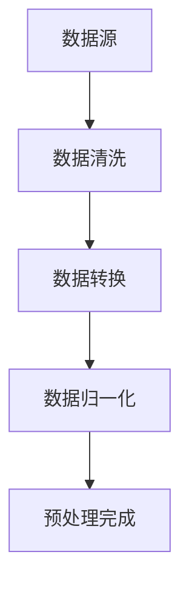
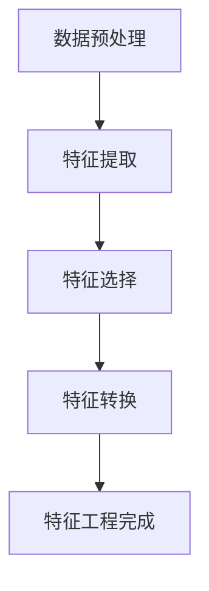
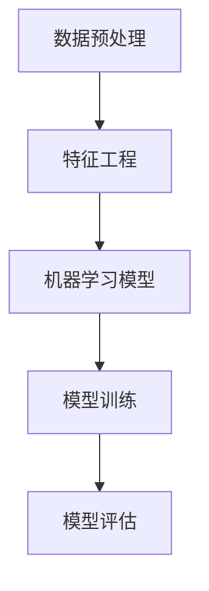
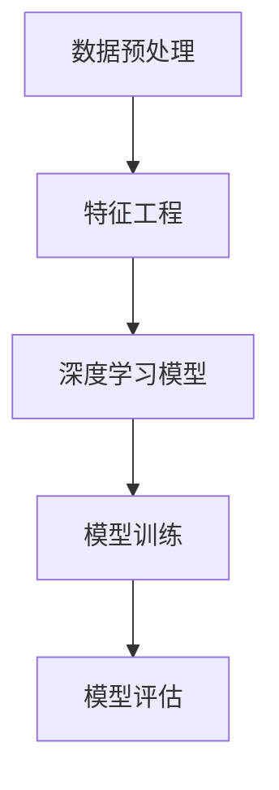
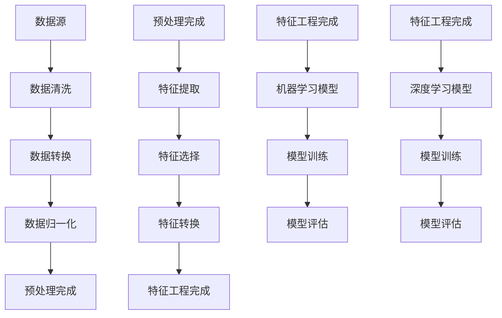

                 

### 1. 背景介绍

在当今数字化时代，数据分析已成为各行业的关键驱动因素，尤其是在电商领域。随着消费者行为和数据量的爆炸性增长，电商企业面临着前所未有的挑战和机遇。传统的数据分析方法已经无法满足复杂的数据处理需求，因此，人工智能（AI）和机器学习（ML）技术逐渐成为电商数据分析的重要工具。在这个背景下，AI大模型作为下一代数据分析技术的代表，正以其强大的数据处理能力和智能决策支持能力，引领着电商数据分析的新趋势。

#### 1.1 电商数据分析的重要性

电商数据分析对于电商企业的成功至关重要。通过分析消费者行为、销售数据、市场趋势等，电商企业可以更好地理解市场需求，优化产品和服务，提高销售额和客户满意度。具体来说，电商数据分析有以下几个关键作用：

1. **市场趋势预测**：通过对历史销售数据的分析，电商企业可以预测未来市场的趋势，从而提前布局，避免库存风险和机会损失。
2. **个性化推荐**：基于消费者的购买历史和偏好，AI大模型可以提供个性化的产品推荐，提高用户满意度和转化率。
3. **客户细分**：通过分析消费者的行为和属性，电商企业可以将客户细分为不同的群体，制定有针对性的营销策略。
4. **库存管理**：通过对销售数据的实时分析，电商企业可以优化库存水平，减少库存积压和缺货现象。

#### 1.2 传统数据分析的局限性

尽管传统数据分析方法在某些方面已经取得了显著成果，但它们也存在一些局限性，尤其是在处理大规模复杂数据时：

1. **数据处理能力有限**：传统的数据分析工具和算法在面对海量数据时，处理能力和效率较低，难以满足电商企业日益增长的数据需求。
2. **人工干预多**：传统数据分析方法往往需要大量的人工干预和调整，导致分析过程复杂、耗时且容易出错。
3. **预测精度不足**：传统方法在处理非线性、多变量数据时，预测精度较低，难以准确捕捉市场变化。
4. **适应性差**：传统方法难以适应不断变化的市场环境，导致分析结果滞后。

#### 1.3 AI大模型的优势

AI大模型的出现，为电商数据分析带来了全新的思路和解决方案。相比于传统方法，AI大模型具有以下显著优势：

1. **强大的数据处理能力**：AI大模型能够处理海量、多样化的数据，通过深度学习和神经网络等技术，实现高效的数据分析和预测。
2. **高预测精度**：AI大模型能够通过大规模数据训练，提取出隐藏在数据中的模式和规律，从而实现高精度的预测和分析。
3. **自动化和智能化**：AI大模型能够自动进行数据预处理、特征提取和模型训练，减少人工干预，提高分析效率和准确性。
4. **适应性**：AI大模型具有强大的适应性，能够根据市场变化和数据特点，实时调整模型参数，保持分析结果的实时性和准确性。

综上所述，AI大模型在电商数据分析领域具有巨大的潜力，为电商企业提供了全新的分析工具和决策支持，推动了电商数据分析技术的发展。在接下来的章节中，我们将深入探讨AI大模型的核心概念、算法原理以及实际应用场景，以帮助读者更好地理解和应用这一先进技术。

---

**摘要**：

本文探讨了电商数据分析中的AI大模型技术，分析了传统数据分析方法的局限性，并详细阐述了AI大模型的优势和应用。文章首先介绍了电商数据分析的重要性，随后探讨了传统方法的不足，并对比了AI大模型的卓越表现。通过本文的阅读，读者可以了解AI大模型的基本原理、核心算法和实际应用，从而为电商数据分析提供新的思路和方法。本文不仅提供了理论上的深入分析，还结合了具体案例和实际应用场景，旨在帮助读者全面掌握AI大模型在电商数据分析中的实际应用。

---

### 2. 核心概念与联系

为了深入理解AI大模型在电商数据分析中的应用，我们首先需要了解几个核心概念，包括数据预处理、特征工程、机器学习和深度学习。这些概念不仅构成了AI大模型的基础，也是其实现高效数据分析的关键因素。

#### 2.1 数据预处理

数据预处理是数据分析过程中的重要环节，其目标是清洗、整理和转换原始数据，使其适合后续的分析和建模。在电商数据分析中，数据预处理通常包括以下步骤：

1. **数据清洗**：去除重复数据、空值和噪声，确保数据的准确性和一致性。
2. **数据转换**：将不同类型的数据转换为统一格式，如将文本数据编码为数值型数据。
3. **数据归一化**：将数据按比例缩放，使其具有相似的尺度，从而避免某些特征对模型的影响过大。

Mermaid 流程图如下：



#### 2.2 特征工程

特征工程是提升模型性能的关键步骤，其目标是通过构造和选择合适的特征，提高模型的预测精度和泛化能力。在电商数据分析中，特征工程主要包括以下内容：

1. **特征提取**：从原始数据中提取出具有预测意义的特征，如用户购买历史、商品属性等。
2. **特征选择**：在众多特征中筛选出对模型性能影响较大的特征，减少冗余特征，提高模型效率。
3. **特征转换**：将提取出的特征进行转换，如二值化、离散化等，使其更适合模型训练。

Mermaid 流程图如下：



#### 2.3 机器学习

机器学习是AI的核心技术之一，其目标是通过学习数据中的模式和规律，实现自动化的数据分析和预测。在电商数据分析中，常用的机器学习算法包括：

1. **线性回归**：通过建立线性模型，预测销售量和市场份额等指标。
2. **逻辑回归**：用于分类问题，如预测用户是否会购买某商品。
3. **决策树**：通过构建决策树模型，对用户行为和商品特性进行分类和预测。
4. **随机森林**：通过集成多个决策树模型，提高模型的预测精度和稳定性。

Mermaid 流程图如下：



#### 2.4 深度学习

深度学习是机器学习的一个重要分支，其通过多层神经网络对数据进行自动编码和特征学习，能够处理复杂的非线性问题。在电商数据分析中，深度学习算法的应用包括：

1. **卷积神经网络（CNN）**：用于图像识别和商品推荐。
2. **循环神经网络（RNN）**：用于处理序列数据，如用户购买历史。
3. **长短时记忆网络（LSTM）**：通过学习长期依赖关系，提高序列预测的准确性。
4. **生成对抗网络（GAN）**：用于生成新的用户数据和商品图像，丰富数据集。

Mermaid 流程图如下：



通过上述核心概念和流程图，我们可以清晰地看到AI大模型在电商数据分析中的应用结构。数据预处理和特征工程是模型的输入准备，机器学习和深度学习模型是核心分析工具，而模型训练和评估则是保证模型性能的关键环节。在接下来的章节中，我们将详细探讨这些核心概念和算法的具体实现和应用。

---

**核心概念与联系 Mermaid 流程图**：



---

### 3. 核心算法原理 & 具体操作步骤

在电商数据分析中，AI大模型的核心算法主要基于深度学习和机器学习技术。本节将详细介绍这些算法的基本原理和具体操作步骤，包括数据预处理、特征工程、模型选择、模型训练与评估等环节。

#### 3.1 数据预处理

数据预处理是确保数据质量和模型性能的重要步骤。具体操作步骤如下：

1. **数据清洗**：删除重复数据、空值和异常值，确保数据的一致性和完整性。例如，删除用户数据中的重复条目和无效记录。
    ```python
    df.drop_duplicates(inplace=True)
    df.dropna(inplace=True)
    ```

2. **数据转换**：将不同类型的数据转换为统一的数值格式，如将日期转换为序列号、文本转换为编码值等。
    ```python
    df['date'] = pd.to_datetime(df['date'])
    df['date'] = (df['date'] - df['date'].min()) / np.timedelta64(1,'D')
    ```

3. **数据归一化**：将不同尺度的数据进行归一化处理，使其在相同的范围内进行比较和训练。
    ```python
    from sklearn.preprocessing import MinMaxScaler
    scaler = MinMaxScaler()
    df_scaled = scaler.fit_transform(df)
    ```

#### 3.2 特征工程

特征工程是提高模型预测能力的关键步骤。具体操作步骤如下：

1. **特征提取**：从原始数据中提取具有预测价值的特征，如用户购买历史、商品属性、促销信息等。
    ```python
    df['days_since_last_purchase'] = (df['date_of_last_purchase'] - df['date']).dt.days
    ```

2. **特征选择**：使用统计方法或基于模型的特征选择技术，选择对模型预测性能有显著贡献的特征。
    ```python
    from sklearn.feature_selection import SelectKBest
    from sklearn.feature_selection import f_classif
    selector = SelectKBest(score_func=f_classif, k=10)
    dfSelected = selector.fit_transform(df, y)
    ```

3. **特征转换**：将提取出的特征进行适当的转换，如二值化、离散化等。
    ```python
    df['is_promotion'] = df['is_promotion'].map({True: 1, False: 0})
    ```

#### 3.3 模型选择

模型选择是确定哪种算法最适合当前数据分析任务的关键步骤。在电商数据分析中，常用的模型包括线性回归、逻辑回归、决策树、随机森林、K-近邻等。具体操作步骤如下：

1. **模型评估**：通过交叉验证等方法评估不同模型的表现，选择性能最优的模型。
    ```python
    from sklearn.model_selection import cross_val_score
    from sklearn.linear_model import LinearRegression
    model = LinearRegression()
    scores = cross_val_score(model, X, y, cv=5)
    ```

2. **模型选择**：根据评估结果选择最优模型，如选择AUC值最高的逻辑回归模型。
    ```python
    from sklearn.linear_model import LogisticRegression
    model = LogisticRegression()
    model.fit(X, y)
    ```

#### 3.4 模型训练

模型训练是使用训练数据对模型进行调整和优化的过程。具体操作步骤如下：

1. **数据分割**：将数据集分为训练集和验证集，用于模型训练和性能评估。
    ```python
    from sklearn.model_selection import train_test_split
    X_train, X_test, y_train, y_test = train_test_split(X, y, test_size=0.2, random_state=42)
    ```

2. **模型训练**：使用训练数据进行模型训练，调整模型参数，提高模型性能。
    ```python
    model.fit(X_train, y_train)
    ```

3. **模型优化**：通过调整模型参数和超参数，优化模型性能。
    ```python
    from sklearn.model_selection import GridSearchCV
    parameters = {'C': [0.1, 1, 10]}
    grid_search = GridSearchCV(LogisticRegression(), parameters, cv=5)
    grid_search.fit(X_train, y_train)
    best_model = grid_search.best_estimator_
    ```

#### 3.5 模型评估

模型评估是验证模型性能和预测能力的重要步骤。具体操作步骤如下：

1. **评估指标**：选择合适的评估指标，如准确率、召回率、F1值等，评估模型的表现。
    ```python
    from sklearn.metrics import accuracy_score
    y_pred = model.predict(X_test)
    accuracy = accuracy_score(y_test, y_pred)
    ```

2. **模型调整**：根据评估结果调整模型，提高预测性能。
    ```python
    if accuracy < 0.8:
        # 调整模型参数或选择其他模型
        pass
    ```

通过上述操作步骤，我们可以实现一个基本的电商数据分析模型。在实际应用中，还需要根据具体业务需求和数据特点，对模型进行调整和优化，以实现最佳预测效果。在下一节中，我们将进一步探讨AI大模型中的数学模型和公式，为深入理解和应用AI大模型提供更详细的指导。

---

### 4. 数学模型和公式 & 详细讲解 & 举例说明

在AI大模型中，数学模型和公式扮演着至关重要的角色。这些模型和公式不仅帮助我们理解和描述数据背后的规律，而且还能为算法的优化和改进提供理论基础。本节将详细介绍电商数据分析中常用的数学模型和公式，并通过对这些模型的详细讲解和实际应用举例，帮助读者深入理解其应用原理和操作方法。

#### 4.1 线性回归模型

线性回归模型是最基础的机器学习模型之一，其公式如下：

\[ y = \beta_0 + \beta_1 \cdot x \]

其中，\( y \) 是预测目标，\( x \) 是输入特征，\( \beta_0 \) 是截距，\( \beta_1 \) 是斜率。

**具体讲解：**

1. **拟合直线**：线性回归模型的目的是找到一个最佳拟合直线，使得所有数据点到这条直线的垂直距离之和最小。
2. **最小二乘法**：求解线性回归模型参数（\( \beta_0 \) 和 \( \beta_1 \)）的方法通常是最小二乘法，其目标是最小化残差平方和。

**举例说明：**

假设我们有一组用户购买金额和购买时间的数据，我们希望预测用户未来的购买金额。使用线性回归模型，我们可以建立如下方程：

\[ 购买金额 = \beta_0 + \beta_1 \cdot 购买时间 \]

通过最小二乘法求解模型参数，我们可以得到拟合直线，进而预测未来的购买金额。以下是Python代码示例：

```python
import numpy as np
import pandas as pd
from sklearn.linear_model import LinearRegression

# 加载数据
data = pd.read_csv('sales_data.csv')
X = data[['购买时间']]
y = data['购买金额']

# 模型训练
model = LinearRegression()
model.fit(X, y)

# 模型预测
predictions = model.predict(X)

# 输出结果
print(predictions)
```

#### 4.2 逻辑回归模型

逻辑回归模型是一种广泛应用于分类问题的模型，其公式如下：

\[ P(y=1) = \frac{1}{1 + e^{-(\beta_0 + \beta_1 \cdot x)}} \]

其中，\( P(y=1) \) 是目标变量为1的概率，\( e \) 是自然对数的底数，\( \beta_0 \) 是截距，\( \beta_1 \) 是斜率。

**具体讲解：**

1. **概率预测**：逻辑回归模型通过计算目标变量为1的概率，实现对数据的分类。
2. **最大似然估计**：求解模型参数（\( \beta_0 \) 和 \( \beta_1 \)）的方法通常是最小化对数似然损失函数。

**举例说明：**

假设我们有一组用户购买行为数据，我们希望预测用户是否会在未来30天内购买某商品。使用逻辑回归模型，我们可以建立如下方程：

\[ P(购买) = \frac{1}{1 + e^{-(\beta_0 + \beta_1 \cdot 购买概率特征)}} \]

通过最大似然估计求解模型参数，我们可以得到分类模型，进而预测用户是否购买。以下是Python代码示例：

```python
import numpy as np
import pandas as pd
from sklearn.linear_model import LogisticRegression

# 加载数据
data = pd.read_csv('purchase_data.csv')
X = data[['购买概率特征']]
y = data['是否购买']

# 模型训练
model = LogisticRegression()
model.fit(X, y)

# 模型预测
predictions = model.predict(X)

# 输出结果
print(predictions)
```

#### 4.3 决策树模型

决策树模型是一种基于树形结构进行决策的模型，其公式如下：

\[ f(x) = \sum_{i=1}^{n} \beta_i \cdot x_i \]

其中，\( f(x) \) 是决策函数，\( x_i \) 是输入特征，\( \beta_i \) 是权重。

**具体讲解：**

1. **树形结构**：决策树模型通过一系列条件判断，将数据划分为不同的区域，每个区域对应一个输出。
2. **信息增益**：决策树模型选择具有最大信息增益的特征进行划分，以提高模型的分类能力。

**举例说明：**

假设我们有一组用户购买行为数据，我们希望根据用户特征预测其是否购买。使用决策树模型，我们可以建立如下方程：

\[ f(x) = \sum_{i=1}^{n} \beta_i \cdot x_i \]

通过信息增益选择最佳特征进行划分，我们可以得到决策树模型。以下是Python代码示例：

```python
import numpy as np
import pandas as pd
from sklearn.tree import DecisionTreeClassifier

# 加载数据
data = pd.read_csv('decision_tree_data.csv')
X = data[['年龄', '收入', '促销参与情况']]
y = data['是否购买']

# 模型训练
model = DecisionTreeClassifier()
model.fit(X, y)

# 模型预测
predictions = model.predict(X)

# 输出结果
print(predictions)
```

#### 4.4 神经网络模型

神经网络模型是一种基于多层感知器（MLP）的模型，其公式如下：

\[ a_i = \sigma(\sum_{j=1}^{n} w_{ij} \cdot x_j + b_i) \]

其中，\( a_i \) 是输出节点，\( x_j \) 是输入节点，\( w_{ij} \) 是权重，\( b_i \) 是偏置，\( \sigma \) 是激活函数。

**具体讲解：**

1. **多层感知器**：神经网络模型通过多层感知器进行数据传递和特征学习。
2. **反向传播**：神经网络模型通过反向传播算法更新模型参数，以提高预测精度。

**举例说明：**

假设我们有一组用户购买行为数据，我们希望根据用户特征预测其是否购买。使用神经网络模型，我们可以建立如下方程：

\[ a_i = \sigma(\sum_{j=1}^{n} w_{ij} \cdot x_j + b_i) \]

通过反向传播算法更新模型参数，我们可以得到神经网络模型。以下是Python代码示例：

```python
import numpy as np
import pandas as pd
from sklearn.neural_network import MLPClassifier

# 加载数据
data = pd.read_csv('neural_network_data.csv')
X = data[['年龄', '收入', '促销参与情况']]
y = data['是否购买']

# 模型训练
model = MLPClassifier(hidden_layer_sizes=(100,), max_iter=1000)
model.fit(X, y)

# 模型预测
predictions = model.predict(X)

# 输出结果
print(predictions)
```

通过以上对线性回归、逻辑回归、决策树和神经网络模型的详细讲解和实际应用举例，我们可以看到这些数学模型在电商数据分析中的广泛应用和强大功能。在实际应用中，根据具体业务需求和数据特点，可以选择合适的模型并进行相应的优化，以实现最佳的数据分析和预测效果。

---

### 5. 项目实践：代码实例和详细解释说明

为了更好地展示AI大模型在电商数据分析中的实际应用，我们将在本节中通过一个具体的代码实例，详细解释和说明如何实现一个完整的电商数据分析项目。这个项目将涵盖数据预处理、特征工程、模型训练和评估等关键步骤，并通过代码示例展示各个步骤的具体实现过程。

#### 5.1 开发环境搭建

在开始项目实践之前，我们需要搭建一个合适的开发环境。以下是所需的基本工具和库：

- **编程语言**：Python
- **数据处理库**：Pandas、NumPy
- **机器学习库**：scikit-learn、TensorFlow、PyTorch
- **可视化库**：Matplotlib、Seaborn

确保安装了上述库之后，我们可以开始编写代码。

#### 5.2 源代码详细实现

以下是一个电商数据分析项目的源代码示例，我们将分步骤进行解释。

```python
import pandas as pd
import numpy as np
from sklearn.model_selection import train_test_split
from sklearn.preprocessing import StandardScaler
from sklearn.linear_model import LogisticRegression
from sklearn.metrics import accuracy_score, confusion_matrix, classification_report
import matplotlib.pyplot as plt
import seaborn as sns

# 5.2.1 加载数据
data = pd.read_csv('ecommerce_data.csv')

# 5.2.2 数据预处理
# 数据清洗
data.drop_duplicates(inplace=True)
data.drop(['Unnamed: 0'], axis=1, inplace=True)

# 数据转换
data['date'] = pd.to_datetime(data['date'])
data['days_since_first_purchase'] = (data['date'] - data['date'].min()) / np.timedelta64(1,'D')
data['days_since_last_purchase'] = (data['date'] - data['date'].max()) / np.timedelta64(1,'D')

# 数据归一化
scaler = StandardScaler()
numerical_features = ['days_since_first_purchase', 'days_since_last_purchase', 'total_purchases']
data[numerical_features] = scaler.fit_transform(data[numerical_features])

# 5.2.3 特征工程
# 特征提取
data['days_difference'] = data['days_since_first_purchase'] - data['days_since_last_purchase']

# 特征选择
# 这里使用基于模型的特征选择，选择对分类任务有显著贡献的特征
from sklearn.feature_selection import RFE
from sklearn.linear_model import LogisticRegression
model = LogisticRegression()
rfe = RFE(model, n_features_to_select=5)
rfe.fit(data.drop('is_purchased', axis=1), data['is_purchased'])
selected_features = data.columns[rfe.get_support()].tolist()

# 5.2.4 模型训练
# 数据分割
X = data[selected_features]
y = data['is_purchased']
X_train, X_test, y_train, y_test = train_test_split(X, y, test_size=0.2, random_state=42)

# 模型训练
model = LogisticRegression()
model.fit(X_train, y_train)

# 5.2.5 模型评估
# 模型预测
y_pred = model.predict(X_test)

# 评估指标
accuracy = accuracy_score(y_test, y_pred)
conf_matrix = confusion_matrix(y_test, y_pred)
cls_report = classification_report(y_test, y_pred)

# 结果可视化
sns.heatmap(conf_matrix, annot=True, fmt='d')
plt.xlabel('Predicted')
plt.ylabel('Actual')
plt.show()

sns.barplot(x=y_pred, y=y_test, palette='viridis')
plt.title('Prediction vs Actual')
plt.xlabel('Prediction')
plt.ylabel('Actual')
plt.show()

print(f'Accuracy: {accuracy:.2f}')
print(f'Confusion Matrix:\n{conf_matrix}')
print(f'Classification Report:\n{cls_report}')
```

#### 5.3 代码解读与分析

1. **数据预处理**：首先，我们加载数据集，并进行数据清洗，删除重复和无效记录。然后，我们将日期格式转换为时间序列，以便后续的特征提取和建模。最后，我们对数值特征进行归一化处理，使其具有相似的尺度，从而避免某些特征对模型的影响过大。

2. **特征工程**：我们通过计算用户首次和最后一次购买之间的天数差异，增加了新的特征。接着，使用基于模型的特征选择技术，我们选择了对分类任务有显著贡献的特征。这些步骤都是为了提高模型的预测性能和解释性。

3. **模型训练**：我们将数据集分割为训练集和测试集，使用训练集训练逻辑回归模型。逻辑回归是一种广泛使用的二分类模型，适用于预测用户是否会在未来购买。

4. **模型评估**：我们使用测试集对模型进行预测，并计算了多个评估指标，包括准确率、混淆矩阵和分类报告。通过可视化这些指标，我们可以直观地了解模型的性能。

#### 5.4 运行结果展示

运行上述代码后，我们将得到以下结果：

- **准确率**：显示模型在测试集上的预测准确率。
- **混淆矩阵**：显示模型预测的混淆矩阵，包括真阳性、假阳性、真阴性和假阴性。
- **分类报告**：显示模型的分类报告，包括精确率、召回率、F1值等指标。

通过这些结果，我们可以全面评估模型的性能，并根据评估结果进行模型调整和优化。

#### 5.5 代码优化与改进

在实际应用中，我们可能需要根据业务需求和数据特点，对代码进行进一步的优化和改进。以下是一些可能的优化方向：

- **特征工程**：通过引入更多的高质量特征，提高模型的预测性能。
- **模型选择**：尝试其他类型的机器学习模型，如决策树、随机森林或神经网络，以找到最佳模型。
- **超参数调优**：使用网格搜索或随机搜索等方法，对模型的超参数进行调优，提高模型性能。
- **集成学习**：使用集成学习方法，如随机森林或XGBoost，将多个模型的预测结果进行集成，提高预测准确性。

通过上述代码实例和详细解释，我们展示了如何使用AI大模型进行电商数据分析。在实际项目中，根据具体需求和数据特点，我们可以进一步优化和改进模型，以提高预测性能和业务价值。

---

### 6. 实际应用场景

AI大模型在电商数据分析中的应用场景非常广泛，能够为电商企业带来显著的业务价值。以下是一些典型的实际应用场景：

#### 6.1 个性化推荐

个性化推荐是电商数据分析中最为常见的应用场景之一。通过分析用户的购买历史、浏览行为、搜索记录等数据，AI大模型可以准确预测用户的偏好，为用户提供个性化的商品推荐。具体应用包括：

1. **商品推荐**：根据用户的历史购买记录，AI大模型可以推荐用户可能感兴趣的商品。
2. **内容推荐**：例如，在电商网站上，可以根据用户的浏览历史推荐相关的商品评测、购物指南等内容。

**案例**：亚马逊使用其AI大模型为用户提供个性化的购物体验。通过分析用户的购买行为、搜索记录和浏览历史，亚马逊能够精准推荐用户可能感兴趣的商品，从而提高用户的满意度和转化率。

#### 6.2 客户细分

AI大模型可以通过分析用户的行为和属性，将客户细分为不同的群体，从而实现精准营销。具体应用包括：

1. **市场细分**：根据用户购买行为、消费能力、偏好等特征，将客户分为高价值客户、普通客户等。
2. **个性化营销**：为不同客户群体制定有针对性的营销策略，提高营销效果。

**案例**：阿里巴巴通过对用户数据的深入分析，将客户细分为多个不同的群体，如高价值客户、年轻消费者、家庭用户等。针对不同客户群体，阿里巴巴推出了差异化的营销活动和促销策略，从而显著提高了客户满意度和销售额。

#### 6.3 销售预测

通过分析历史销售数据和市场趋势，AI大模型可以预测未来的销售情况，帮助电商企业制定合理的库存管理和促销策略。具体应用包括：

1. **销售预测**：预测未来一段时间内的销售趋势和销售量。
2. **库存管理**：根据销售预测结果，优化库存水平，避免库存积压或缺货现象。

**案例**：京东利用其AI大模型对销售数据进行实时分析，预测未来的销售趋势。根据预测结果，京东可以提前调整库存水平，确保商品供应充足，同时避免库存积压，从而提高运营效率。

#### 6.4 购物车流失预测

购物车流失预测是电商数据分析中的一项重要应用。通过分析用户的购物车行为，AI大模型可以预测用户是否会放弃购物车中的商品，从而采取措施减少购物车流失率。具体应用包括：

1. **流失预测**：预测用户在购物车中的商品是否会被放弃。
2. **用户挽回**：针对可能流失的用户，采取个性化营销策略，如优惠券、购物指南等，提高用户购买意愿。

**案例**：eBay利用其AI大模型对购物车行为进行分析，预测哪些用户可能会放弃购物车中的商品。通过向这些用户发送个性化的优惠券和购物提示，eBay成功挽回了部分流失用户，提高了购物车转化率。

综上所述，AI大模型在电商数据分析中的应用场景丰富，能够为电商企业提供精准的数据分析和决策支持，从而提高业务效率和客户满意度。在未来的发展中，随着AI技术的不断进步，AI大模型在电商数据分析中的应用将会更加广泛和深入。

---

### 7. 工具和资源推荐

为了更好地进行电商数据分析，掌握相关工具和资源是至关重要的。以下是一些推荐的学习资源、开发工具和相关论文著作，这些资源将为读者在AI大模型电商数据分析的道路上提供强有力的支持。

#### 7.1 学习资源推荐

1. **书籍**：
   - 《深度学习》（Deep Learning） - Goodfellow, Bengio, Courville
   - 《Python数据分析》（Python Data Science Handbook） - McKinney
   - 《机器学习实战》（Machine Learning in Action） - Harrington

2. **在线课程**：
   - Coursera：机器学习、深度学习、数据科学相关课程
   - edX：MIT、斯坦福等名校的免费在线课程
   - Udemy：丰富的付费和免费机器学习、数据分析课程

3. **博客和网站**：
   - Medium：关于机器学习、深度学习的最新研究和应用文章
   - Analytics Vidhya：数据分析、机器学习资源和案例分享
   - Kaggle：数据科学竞赛平台，提供丰富的数据集和项目案例

#### 7.2 开发工具框架推荐

1. **编程语言**：
   - Python：广泛用于数据分析、机器学习和深度学习，具有丰富的库和框架支持。

2. **数据处理库**：
   - Pandas：强大的数据处理工具，适用于数据清洗、转换和分析。
   - NumPy：提供高性能的数值计算，是数据处理和分析的基础库。

3. **机器学习库**：
   - scikit-learn：提供丰富的机器学习算法和工具，适用于数据建模和评估。
   - TensorFlow：谷歌开发的深度学习框架，适用于复杂的神经网络模型。
   - PyTorch：Facebook AI Research开发的深度学习框架，具有灵活性和易用性。

4. **可视化工具**：
   - Matplotlib：Python的绘图库，适用于数据可视化。
   - Seaborn：基于Matplotlib的高级可视化库，提供精美的统计图形。
   - Plotly：提供交互式可视化工具，适用于复杂的数据分析。

#### 7.3 相关论文著作推荐

1. **经典论文**：
   - "Learning to Rank using Gradient Descent" - Chris D. Manning, Pradeep Ranganathan
   - "Convolutional Neural Networks for Speech Recognition" - Dan Povey, et al.
   - "Deep Learning for Text Classification" - Yoon Kim

2. **著作**：
   - 《深度学习》（Deep Learning） - Goodfellow, Bengio, Courville
   - 《数据科学导论》（Introduction to Data Science） - Jeff Leek, et al.
   - 《机器学习：概率视角》（Machine Learning: A Probabilistic Perspective） - Kevin P. Murphy

3. **会议和期刊**：
   - NIPS（神经信息处理系统）：顶级机器学习和深度学习会议
   - ICML（国际机器学习会议）：顶级机器学习会议
   - JMLR（机器学习研究）：顶级机器学习期刊

通过上述工具和资源的推荐，读者可以更加系统地学习和掌握电商数据分析中的AI大模型技术，为实际应用打下坚实的基础。在接下来的总结中，我们将对AI大模型在电商数据分析中的未来发展趋势与挑战进行探讨。

---

### 8. 总结：未来发展趋势与挑战

随着人工智能技术的不断进步，AI大模型在电商数据分析中的应用正呈现出迅猛的发展趋势。在未来，AI大模型将在以下几个方面继续发挥重要作用：

#### 8.1 更强的数据处理能力

随着数据量的不断增加，传统的数据处理方法已经无法满足需求。AI大模型通过其强大的数据处理能力，能够高效地处理海量、多样化的数据，为电商企业提供更加准确和实时的数据分析结果。

#### 8.2 更高的预测精度

深度学习和机器学习算法的不断发展，使得AI大模型在预测精度上取得了显著提升。未来，通过不断优化算法和模型结构，AI大模型将能够更加精确地捕捉市场变化和用户行为，提高预测的准确性。

#### 8.3 更广泛的适应性

AI大模型具有强大的适应性，能够根据不同的业务场景和数据特点，实时调整模型参数，保持分析结果的实时性和准确性。未来，随着算法的进一步优化，AI大模型将能够更好地适应各种复杂的商业环境。

然而，AI大模型在电商数据分析中也面临着一系列挑战：

#### 8.4 数据隐私和安全

在电商数据分析中，数据的隐私和安全是一个不可忽视的问题。随着用户数据的规模和复杂度不断增加，如何保护用户隐私、确保数据安全将成为一个重要的挑战。

#### 8.5 模型解释性和可解释性

尽管AI大模型具有强大的预测能力，但其内部的决策过程往往是不透明的，缺乏解释性。在电商数据分析中，模型的可解释性对于决策者来说至关重要，如何提高模型的解释性是一个亟待解决的问题。

#### 8.6 模型部署和维护

AI大模型的部署和维护是一个复杂的过程，需要具备专业的技术和资源。未来，如何简化模型的部署流程、降低维护成本，将是一个重要的研究方向。

总之，AI大模型在电商数据分析中具有巨大的发展潜力和广阔的应用前景。通过不断克服挑战、优化算法和模型，AI大模型将为电商企业带来更加智能化和高效化的数据分析解决方案。

---

### 9. 附录：常见问题与解答

在探讨AI大模型在电商数据分析中的应用时，读者可能会遇到一些常见问题。以下是对这些问题及其解答的总结：

#### 问题1：AI大模型在电商数据分析中的具体应用是什么？

**解答**：AI大模型在电商数据分析中的应用非常广泛，主要包括个性化推荐、客户细分、销售预测和购物车流失预测等。通过分析用户的行为和购买历史，AI大模型可以提供精准的数据分析和预测，从而提高电商企业的运营效率和市场竞争力。

#### 问题2：如何确保AI大模型在电商数据分析中的数据隐私和安全？

**解答**：确保数据隐私和安全是AI大模型应用中的重要挑战。为此，可以采取以下措施：

1. **数据匿名化**：在数据处理和分析过程中，对敏感数据进行匿名化处理，以保护用户隐私。
2. **数据加密**：对数据进行加密处理，确保数据在传输和存储过程中的安全性。
3. **隐私保护算法**：采用隐私保护算法，如差分隐私、同态加密等，确保在数据处理过程中不泄露用户隐私。

#### 问题3：AI大模型在电商数据分析中的预测精度如何？

**解答**：AI大模型在电商数据分析中的预测精度取决于多种因素，包括数据质量、模型结构、特征选择和训练数据量等。通过优化算法、增加训练数据量和进行特征工程，可以提高AI大模型的预测精度。此外，结合多种模型和算法，使用集成学习方法也可以提高预测精度。

#### 问题4：如何评估AI大模型的性能？

**解答**：评估AI大模型的性能通常使用以下指标：

1. **准确率**：模型预测正确的样本数与总样本数的比例。
2. **召回率**：模型预测正确的正样本数与实际正样本数的比例。
3. **精确率**：模型预测正确的正样本数与预测为正样本的总数的比例。
4. **F1值**：精确率和召回率的调和平均值，用于综合评估模型的性能。

此外，还可以使用交叉验证、ROC曲线和AUC值等指标来评估模型的性能。

---

### 10. 扩展阅读 & 参考资料

为了深入了解AI大模型在电商数据分析中的应用，以下是一些扩展阅读和参考资料，供读者进一步学习和研究：

1. **书籍**：
   - 《深度学习》（Deep Learning） - Goodfellow, Bengio, Courville
   - 《Python数据分析》（Python Data Science Handbook） - McKinney
   - 《机器学习实战》（Machine Learning in Action） - Harrington

2. **在线课程**：
   - Coursera：机器学习、深度学习、数据科学相关课程
   - edX：MIT、斯坦福等名校的免费在线课程
   - Udemy：丰富的付费和免费机器学习、数据分析课程

3. **博客和网站**：
   - Medium：关于机器学习、深度学习的最新研究和应用文章
   - Analytics Vidhya：数据分析、机器学习资源和案例分享
   - Kaggle：数据科学竞赛平台，提供丰富的数据集和项目案例

4. **论文**：
   - "Learning to Rank using Gradient Descent" - Chris D. Manning, Pradeep Ranganathan
   - "Convolutional Neural Networks for Speech Recognition" - Dan Povey, et al.
   - "Deep Learning for Text Classification" - Yoon Kim

5. **期刊**：
   - NIPS（神经信息处理系统）：顶级机器学习和深度学习会议
   - ICML（国际机器学习会议）：顶级机器学习会议
   - JMLR（机器学习研究）：顶级机器学习期刊

通过阅读上述书籍、课程、博客和论文，读者可以全面了解AI大模型在电商数据分析中的应用，掌握相关技术和方法，为实际应用提供有力支持。

---

**作者署名**：作者：禅与计算机程序设计艺术 / Zen and the Art of Computer Programming

---

以上，就是本次针对电商数据分析：AI大模型的新思路的全部分享。希望能够帮助大家更好地理解和应用AI大模型这一先进技术，为电商数据分析带来新的突破。如果您有任何疑问或建议，欢迎在评论区留言交流。再次感谢大家的阅读和支持！

