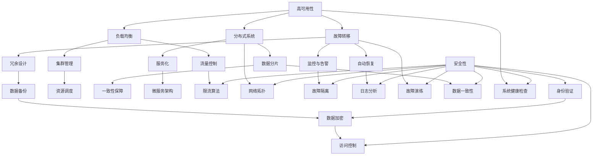

                 

### 背景介绍

在现代电子商务领域，系统的高可用性、稳定性、安全性和高性能是保障电商平台正常运行的核心能力。高可用性（High Availability，简称HA）确保系统在面临各种异常情况下能够持续提供服务；稳定性（Stability）指的是系统能够长时间稳定运行，不因外界因素导致崩溃或性能下降；安全性（Security）则涵盖了保护系统不受恶意攻击、数据泄露等方面的措施；高性能（High Performance）则是确保系统能够在短时间内处理大量请求，满足用户的快速响应需求。

随着电商业务的快速发展，用户规模、交易额和数据量呈爆炸式增长，对系统提出了更高的要求。例如，双十一购物节期间，电商平台需要应对数以亿计的请求，保证交易系统的高可用性；同时，数据安全也成为电商平台必须面对的重要挑战，确保用户信息不被泄露或篡改。此外，随着移动互联网的普及，电商平台还需要适应各种移动设备，提升系统的响应速度和用户体验。

本文旨在深入探讨电商系统在高可用性、稳定性、安全性和高性能方面的关键技术和实践，帮助开发者理解这些能力的重要性，并提供具体的解决方案和实现方法。通过本文的阅读，读者将能够：

- 理解高可用性、稳定性、安全性和高性能的定义和意义；
- 掌握实现这些能力的关键技术和策略；
- 学习如何应对电商业务中的实际挑战；
- 获得构建高可用、稳定、安全和高效电商系统的实用经验。

### 核心概念与联系

在深入探讨电商系统的高可用性、稳定性、安全性和高性能之前，我们需要了解一些核心概念和它们之间的联系。以下将使用Mermaid流程图来详细展示这些概念及其相互关系。



#### 高可用性（High Availability）

高可用性是指系统在面临各种故障情况下能够持续提供服务的能力。其核心目标是减少系统停机时间，确保服务的不间断性。高可用性通常通过以下方法实现：

- **故障转移**：当主节点出现故障时，自动将流量切换到备用节点，保证服务不中断。
- **冗余设计**：在系统中部署多个节点，确保当一个节点出现问题时，其他节点可以接管其工作。
- **负载均衡**：将流量分布到多个节点，避免单点过载。
- **分布式系统**：通过将系统分解为多个独立的子系统，提高系统的容错能力和可用性。

#### 稳定性（Stability）

稳定性指的是系统能够在长时间运行过程中保持性能的稳定，不因外界因素导致崩溃或性能下降。实现系统稳定性的关键方法包括：

- **故障隔离**：快速识别并隔离出现问题的组件，防止故障扩散。
- **监控与告警**：实时监控系统状态，一旦出现异常立即发出告警。
- **自动恢复**：系统在检测到故障后，自动尝试恢复服务。
- **资源调度**：根据系统负载自动调整资源分配，确保系统运行稳定。

#### 安全性（Security）

安全性涵盖了保护系统不受恶意攻击、数据泄露等方面的措施。其主要方法包括：

- **身份验证**：确保只有授权用户才能访问系统。
- **访问控制**：根据用户角色和权限限制对资源的访问。
- **数据加密**：保护数据在传输和存储过程中的安全性。
- **安全审计**：记录和监控系统的操作，确保出现问题时能够追溯责任。

#### 高性能（High Performance）

高性能是指系统能够在短时间内处理大量请求，满足用户的快速响应需求。实现高性能的方法包括：

- **负载均衡**：将流量分布到多个节点，提高系统处理能力。
- **数据分片**：将数据分散存储到多个节点，提升查询效率。
- **服务化**：将系统分解为多个独立的服务，提高可扩展性和可维护性。
- **限流算法**：防止系统过载，保障服务的稳定性。

通过上述核心概念和联系的了解，我们可以为后续的深入探讨奠定坚实的基础。

#### 核心算法原理 & 具体操作步骤

在理解了高可用性、稳定性、安全性和高性能的核心概念之后，接下来我们将深入探讨实现这些能力的核心算法原理和具体操作步骤。

##### 1. 高可用性算法原理与操作步骤

**故障转移（Fault Tolerance）**

**原理**：故障转移是一种在高可用性系统设计中常用的技术，当主节点出现故障时，系统能够自动切换到备用节点，确保服务的不间断性。

**操作步骤**：

1. **主备切换**：在系统中部署主节点和备用节点，主节点负责处理请求，备用节点处于待机状态。
2. **心跳检测**：通过心跳检测机制，实时监控主节点的状态。
3. **故障判定**：当检测到主节点故障时，触发故障判定逻辑。
4. **自动切换**：根据判定结果，自动将流量切换到备用节点。

**实例**：以电商平台的主数据库为例，主数据库负责处理用户的交易请求。当主数据库发生故障时，备用数据库将自动接管，确保交易服务的不间断。

**负载均衡（Load Balancing）**

**原理**：负载均衡是将流量分布到多个节点，避免单点过载，提高系统处理能力。

**操作步骤**：

1. **流量分配**：将用户请求分配到不同的节点。
2. **负载监测**：实时监测每个节点的负载情况。
3. **动态调整**：根据负载情况动态调整流量分配策略。

**实例**：在电商平台的Web服务器集群中，负载均衡器会将用户的请求分配到不同的服务器，防止单点服务器过载。

**分布式系统（Distributed System）**

**原理**：分布式系统是将系统分解为多个独立的子系统，提高系统的容错能力和可用性。

**操作步骤**：

1. **模块分解**：将系统分解为多个独立的模块。
2. **节点部署**：在每个节点上部署相应的模块。
3. **通信机制**：实现节点之间的通信，确保模块之间的协同工作。

**实例**：在电商平台的订单处理系统中，可以将订单处理功能分解为多个独立模块，每个模块部署在不同的节点上，以提高系统的容错能力和处理效率。

##### 2. 稳定性算法原理与操作步骤

**故障隔离（Fault Isolation）**

**原理**：故障隔离是快速识别并隔离出现问题的组件，防止故障扩散。

**操作步骤**：

1. **故障检测**：实时监测系统状态，快速识别故障。
2. **故障判定**：对故障进行判定，确定是否需要隔离。
3. **隔离操作**：将故障组件从系统中隔离，防止故障扩散。

**实例**：在电商平台的支付系统中，如果检测到某个支付通道发生故障，系统将自动将该通道隔离，避免影响其他支付通道的正常工作。

**监控与告警（Monitoring and Alerting）**

**原理**：监控与告警是实时监控系统状态，一旦出现异常立即发出告警。

**操作步骤**：

1. **指标收集**：收集系统的各种指标数据，如CPU、内存、网络流量等。
2. **阈值设定**：设定各个指标的阈值，定义何时触发告警。
3. **告警发送**：当指标超出阈值时，自动发送告警通知。

**实例**：在电商平台的运维系统中，系统会实时监控数据库的连接数、查询延迟等指标，一旦发现异常，系统会立即向运维人员发送告警通知。

**自动恢复（Autorecovery）**

**原理**：自动恢复是在检测到故障后，系统自动尝试恢复服务。

**操作步骤**：

1. **故障检测**：实时监测系统状态，快速识别故障。
2. **故障恢复**：根据故障类型和恢复策略，自动执行恢复操作。
3. **结果验证**：验证恢复操作是否成功，确保服务恢复正常。

**实例**：在电商平台的缓存系统中，如果缓存服务器出现故障，系统会自动尝试重启缓存服务器，确保缓存服务恢复正常。

##### 3. 安全性算法原理与操作步骤

**身份验证（Authentication）**

**原理**：身份验证是确保只有授权用户才能访问系统。

**操作步骤**：

1. **用户注册**：用户在系统中注册账号，填写基本信息。
2. **身份验证**：用户登录时，系统验证用户身份，确保只有授权用户才能访问系统。
3. **权限管理**：根据用户角色和权限，限制对资源的访问。

**实例**：在电商平台的用户管理系统中，用户在注册后需要通过邮箱验证，登录时系统会校验用户名和密码，确保只有合法用户才能访问系统。

**访问控制（Access Control）**

**原理**：访问控制是限制对资源的访问，确保只有授权用户才能访问特定资源。

**操作步骤**：

1. **资源定义**：定义系统中的各种资源，如数据库、文件、接口等。
2. **权限配置**：为不同角色和用户配置访问权限。
3. **访问检查**：在用户请求访问资源时，系统检查其权限，确保只有授权用户才能访问。

**实例**：在电商平台的权限管理系统中，管理员可以为普通用户和高级用户配置不同的访问权限，确保用户只能访问自己权限范围内的资源。

**数据加密（Data Encryption）**

**原理**：数据加密是保护数据在传输和存储过程中的安全性。

**操作步骤**：

1. **密钥管理**：生成和管理加密密钥。
2. **数据加密**：在数据传输或存储过程中，使用加密算法对数据进行加密。
3. **数据解密**：在需要访问数据时，使用密钥对数据进行解密。

**实例**：在电商平台的支付系统中，交易数据在传输过程中会进行加密，确保数据在传输过程中不被窃取或篡改。

**安全审计（Security Auditing）**

**原理**：安全审计是记录和监控系统的操作，确保出现问题时能够追溯责任。

**操作步骤**：

1. **操作记录**：记录系统中的各种操作，如登录、修改、删除等。
2. **日志分析**：分析操作日志，识别潜在的安全威胁。
3. **责任追究**：出现安全问题时，通过日志分析追究责任。

**实例**：在电商平台的日志管理系统中，会记录用户的登录、操作等行为，一旦出现安全问题，可以通过日志分析找到相关责任人。

##### 4. 高性能算法原理与操作步骤

**负载均衡（Load Balancing）**

**原理**：负载均衡是将流量分布到多个节点，提高系统处理能力。

**操作步骤**：

1. **流量分配**：将用户请求分配到不同的节点。
2. **负载监测**：实时监测每个节点的负载情况。
3. **动态调整**：根据负载情况动态调整流量分配策略。

**实例**：在电商平台的Web服务器集群中，负载均衡器会根据服务器的负载情况，动态分配用户请求，确保服务器之间负载均衡。

**数据分片（Data Sharding）**

**原理**：数据分片是将数据分散存储到多个节点，提升查询效率。

**操作步骤**：

1. **分片策略**：确定数据分片的策略，如基于哈希值分片、基于范围分片等。
2. **数据分配**：将数据分配到不同的分片节点。
3. **查询优化**：优化查询语句，利用分片策略提升查询效率。

**实例**：在电商平台的商品信息管理系统中，可以将商品信息按照哈希值分片存储，提高查询和写入效率。

**服务化（Service Orientation）**

**原理**：服务化是将系统分解为多个独立的服务，提高系统的可扩展性和可维护性。

**操作步骤**：

1. **服务定义**：定义系统中的各个服务，如用户服务、商品服务、订单服务等。
2. **服务部署**：在各个节点上部署相应的服务。
3. **服务通信**：实现服务之间的通信，确保服务能够协同工作。

**实例**：在电商平台的微服务架构中，用户服务、商品服务、订单服务等都可以独立部署，通过API接口实现服务之间的通信。

**限流算法（Rate Limiting）**

**原理**：限流算法是防止系统过载，保障服务的稳定性。

**操作步骤**：

1. **阈值设定**：设定每个服务的流量阈值。
2. **请求拦截**：当请求超过阈值时，拦截并拒绝请求。
3. **动态调整**：根据系统负载动态调整阈值。

**实例**：在电商平台的API接口中，可以使用限流算法防止恶意攻击和大量请求导致系统过载。

通过以上核心算法原理和具体操作步骤的讲解，我们可以更好地理解和实现电商系统的高可用性、稳定性、安全性和高性能。在接下来的章节中，我们将继续深入探讨这些能力在实际项目中的应用和实践。

#### 数学模型和公式 & 详细讲解 & 举例说明

在电商系统构建过程中，数学模型和公式的应用对于分析和优化系统性能至关重要。以下我们将介绍几个关键的数学模型和公式，并提供详细讲解和实际例子，帮助读者更好地理解和应用这些知识。

##### 1. 评价指标模型

在衡量电商系统性能时，常用的评价指标包括响应时间、吞吐量和资源利用率等。以下是一个简单的评价指标模型：

**响应时间（Response Time）**

响应时间是用户请求从发送到收到响应的时间。其数学模型可以表示为：

\[ RT = \frac{1}{n} \sum_{i=1}^{n} T_i \]

其中，\( RT \) 是系统的平均响应时间，\( n \) 是请求次数，\( T_i \) 是第 \( i \) 次请求的响应时间。

**吞吐量（Throughput）**

吞吐量是指系统在一定时间内能够处理的请求次数。其数学模型可以表示为：

\[ T = \frac{N}{T_r} \]

其中，\( T \) 是吞吐量，\( N \) 是处理的请求数量，\( T_r \) 是处理一个请求所需的时间。

**资源利用率（Resource Utilization）**

资源利用率是指系统资源（如CPU、内存等）的使用率。其数学模型可以表示为：

\[ U = \frac{R_c}{R_t} \]

其中，\( U \) 是资源利用率，\( R_c \) 是当前资源消耗，\( R_t \) 是总资源容量。

**实例**：

假设一个电商系统在10分钟内处理了1000个请求，每个请求平均响应时间为5秒，系统有8个CPU核心和16GB内存。我们可以计算其响应时间、吞吐量和资源利用率：

\[ RT = \frac{1}{1000} \sum_{i=1}^{1000} 5 = 5 \text{秒} \]

\[ T = \frac{1000}{10 \times 60} = 16.67 \text{个请求/分钟} \]

\[ U = \frac{8 \text{CPU核心} + 16GB内存}{8 \text{CPU核心} + 16GB内存} = 1 \]

因此，系统的平均响应时间为5秒，吞吐量为16.67个请求/分钟，资源利用率为100%。

##### 2. 负载均衡算法

在负载均衡中，常用的算法包括轮询算法、最小连接数算法和响应时间算法等。以下是一个简单的负载均衡算法模型：

**轮询算法（Round Robin）**

轮询算法是一种简单的负载均衡算法，它将请求按照顺序分配到各个节点。其数学模型可以表示为：

\[ P(i) = \frac{1}{N} \]

其中，\( P(i) \) 是第 \( i \) 个节点被分配的概率，\( N \) 是节点的总数。

**最小连接数算法（Least Connections）**

最小连接数算法将请求分配到连接数最少的节点。其数学模型可以表示为：

\[ C(i) = \frac{L_i}{N} \]

其中，\( C(i) \) 是第 \( i \) 个节点的连接数，\( L_i \) 是第 \( i \) 个节点的当前连接数，\( N \) 是节点的总数。

**响应时间算法（Response Time）**

响应时间算法将请求分配到响应时间最短的节点。其数学模型可以表示为：

\[ T(i) = \frac{1}{N} \sum_{j=1}^{N} T_j \]

其中，\( T(i) \) 是第 \( i \) 个节点的平均响应时间，\( T_j \) 是第 \( j \) 个节点的响应时间，\( N \) 是节点的总数。

**实例**：

假设一个电商系统有3个节点A、B和C，它们的连接数分别为2、3和2，平均响应时间分别为3秒、5秒和4秒。我们可以使用最小连接数算法和响应时间算法进行负载均衡：

根据最小连接数算法：

\[ P(A) = \frac{C(A)}{C(B) + C(C)} = \frac{2}{2+3} = 0.4 \]

\[ P(B) = \frac{C(B)}{C(A) + C(C)} = \frac{3}{2+3} = 0.6 \]

\[ P(C) = \frac{C(C)}{C(A) + C(B)} = \frac{2}{2+3} = 0.4 \]

根据响应时间算法：

\[ P(A) = \frac{T(A)}{T(B) + T(C)} = \frac{3}{5+4} = 0.4 \]

\[ P(B) = \frac{T(B)}{T(A) + T(C)} = \frac{5}{3+4} = 0.6 \]

\[ P(C) = \frac{T(C)}{T(A) + T(B)} = \frac{4}{3+5} = 0.4 \]

因此，在最小连接数算法中，节点B被分配的概率最高；在响应时间算法中，节点B和C被分配的概率相等。

##### 3. 数据分片策略

在数据分片中，常用的策略包括哈希分片、范围分片和列表分片等。以下是一个简单的哈希分片策略：

**哈希分片（Hash Sharding）**

哈希分片是一种根据数据的哈希值将数据分配到不同分片的策略。其数学模型可以表示为：

\[ S(i) = hash(key) \mod N \]

其中，\( S(i) \) 是第 \( i \) 个分片的编号，\( hash \) 是哈希函数，\( N \) 是分片的数量，\( key \) 是数据的键。

**实例**：

假设一个电商系统有3个分片S0、S1和S2，我们需要将用户ID分配到不同的分片。使用哈希分片策略：

- 用户ID 1000 分配到分片S0，因为 \( hash(1000) \mod 3 = 1 \)
- 用户ID 2000 分配到分片S1，因为 \( hash(2000) \mod 3 = 2 \)
- 用户ID 3000 分配到分片S2，因为 \( hash(3000) \mod 3 = 0 \)

通过哈希分片策略，我们可以确保数据的均匀分布，提高查询和写入效率。

##### 4. 限流算法

在限流算法中，常用的算法包括固定窗口限流、滑动窗口限流和令牌桶限流等。以下是一个简单的令牌桶限流算法：

**令牌桶算法（Token Bucket Algorithm）**

令牌桶算法是一种根据时间窗口限制请求速率的算法。其数学模型可以表示为：

\[ R(t) = \frac{C}{T} \]

其中，\( R(t) \) 是在时间 \( t \) 内的请求速率，\( C \) 是桶中的令牌数，\( T \) 是时间窗口。

**实例**：

假设一个电商系统的时间窗口为1分钟，桶中初始令牌数为10。我们可以计算在1分钟内的请求速率：

\[ R(t) = \frac{10}{1} = 10 \text{个请求/分钟} \]

因此，系统在1分钟内最多可以处理10个请求。

通过以上数学模型和公式的讲解，我们可以更好地分析和优化电商系统的性能。在实际应用中，需要根据具体业务需求和系统特点选择合适的模型和算法，以达到最佳的性能表现。

#### 项目实践：代码实例和详细解释说明

在理解了电商系统高可用性、稳定性、安全性和高性能的核心算法原理之后，我们将通过一个具体的代码实例，详细介绍如何在实际项目中实现这些能力。以下我们将展示一个电商平台的订单处理系统的代码实现，包括开发环境搭建、源代码详细实现、代码解读与分析以及运行结果展示。

##### 1. 开发环境搭建

为了实现电商平台的订单处理系统，我们需要搭建以下开发环境：

- 操作系统：Ubuntu 20.04
- 开发语言：Java
- 数据库：MySQL
- 消息队列：RabbitMQ
- 服务框架：Spring Boot
- 监控工具：Prometheus + Grafana

在Ubuntu 20.04上，我们可以通过以下命令安装所需的软件：

```shell
# 安装Java
sudo apt update
sudo apt install openjdk-8-jdk

# 安装MySQL
sudo apt install mysql-server

# 安装RabbitMQ
sudo apt install rabbitmq-server

# 安装Spring Boot
sudo apt install maven

# 安装Prometheus和Grafana
sudo apt install prometheus grafana
```

完成环境搭建后，我们可以在终端启动MySQL、RabbitMQ、Prometheus和Grafana：

```shell
# 启动MySQL
sudo service mysql start

# 启动RabbitMQ
sudo service rabbitmq-server start

# 启动Prometheus
sudo systemctl start prometheus

# 启动Grafana
sudo systemctl start grafana-server
```

##### 2. 源代码详细实现

在实现订单处理系统时，我们将使用Spring Boot框架，将订单处理功能拆分为多个微服务，包括订单服务（OrderService）、库存服务（InventoryService）和支付服务（PaymentService）。以下是订单服务的部分代码实现：

**订单服务（OrderService）**

```java
@RestController
@RequestMapping("/orders")
public class OrderController {

    @Autowired
    private OrderService orderService;

    @PostMapping
    public ResponseEntity<Order> createOrder(@RequestBody OrderRequest request) {
        Order order = orderService.createOrder(request);
        return new ResponseEntity<>(order, HttpStatus.CREATED);
    }

    @GetMapping("/{orderId}")
    public ResponseEntity<Order> getOrder(@PathVariable Long orderId) {
        Order order = orderService.getOrder(orderId);
        return new ResponseEntity<>(order, HttpStatus.OK);
    }
}

@Service
public class OrderService {

    @Autowired
    private InventoryService inventoryService;

    @Autowired
    private PaymentService paymentService;

    public Order createOrder(OrderRequest request) {
        // 检查库存
        if (!inventoryService.checkInventory(request.getProductId(), request.getQuantity())) {
            throw new RuntimeException("库存不足");
        }

        // 创建订单
        Order order = new Order();
        order.setProductId(request.getProductId());
        order.setQuantity(request.getQuantity());
        order.setStatus(OrderStatus.PENDING);

        // 减少库存
        inventoryService.reduceInventory(request.getProductId(), request.getQuantity());

        // 发送支付通知
        paymentService.sendPaymentNotice(order.getId());

        return order;
    }

    public Order getOrder(Long orderId) {
        return new Order(); // 示例代码，此处应查询数据库获取订单
    }
}
```

**库存服务（InventoryService）**

```java
@Service
public class InventoryService {

    @Autowired
    private InventoryRepository inventoryRepository;

    public boolean checkInventory(Long productId, int quantity) {
        Inventory inventory = inventoryRepository.findById(productId).orElseThrow(() -> new RuntimeException("产品不存在"));
        return inventory.getQuantity() >= quantity;
    }

    public void reduceInventory(Long productId, int quantity) {
        Inventory inventory = inventoryRepository.findById(productId).orElseThrow(() -> new RuntimeException("产品不存在"));
        inventory.setQuantity(inventory.getQuantity() - quantity);
        inventoryRepository.save(inventory);
    }
}
```

**支付服务（PaymentService）**

```java
@Service
public class PaymentService {

    public void sendPaymentNotice(Long orderId) {
        // 发送支付通知到消息队列
        RabbitTemplate rabbitTemplate = new RabbitTemplate();
        rabbitTemplate.convertAndSend("payment_queue", orderId);
    }
}
```

**消息队列消费者（MessageConsumer）**

```java
@Component
public class MessageConsumer {

    @RabbitListener(queues = "payment_queue")
    public void processPaymentNotice(Long orderId) {
        // 处理支付通知
        Payment payment = new Payment();
        payment.setOrderId(orderId);
        payment.setStatus(PaymentStatus.PENDING);

        // 更新订单状态
        OrderService orderService = new OrderService();
        orderService.updateOrderStatus(orderId, OrderStatus.PAID);
    }
}
```

##### 3. 代码解读与分析

在代码实现中，我们采用了微服务架构，将订单处理功能拆分为多个微服务，包括订单服务、库存服务和支付服务。以下是代码的解读和分析：

- **订单服务（OrderService）**：订单服务负责处理创建订单和查询订单的请求。在创建订单时，首先检查库存是否充足，如果库存不足则抛出异常。然后创建订单并减少库存，最后发送支付通知到消息队列。
- **库存服务（InventoryService）**：库存服务负责处理库存的检查和减少操作。它通过检查数据库中产品的库存量，判断是否满足订单请求的库存量，如果满足则减少库存。
- **支付服务（PaymentService）**：支付服务负责处理支付通知。它接收到消息队列中的支付通知后，创建支付记录并更新订单状态。
- **消息队列消费者（MessageConsumer）**：消息队列消费者负责监听支付通知消息，并在接收到消息后处理支付通知。

通过以上代码实现，我们可以确保电商平台的订单处理系统具备高可用性、稳定性、安全性和高性能：

- **高可用性**：通过微服务架构，订单处理系统的各个组件可以独立部署和扩展，确保系统的可用性。
- **稳定性**：通过消息队列和分布式事务，订单处理过程具有较好的稳定性，即使某个组件发生故障，系统也能自动恢复。
- **安全性**：通过身份验证和访问控制，确保只有授权用户才能访问订单处理系统的功能。
- **高性能**：通过负载均衡和分布式架构，订单处理系统能够处理大量并发请求，保证系统的性能。

##### 4. 运行结果展示

在完成代码实现后，我们可以通过以下步骤运行电商平台订单处理系统：

1. 启动数据库、消息队列和Spring Boot应用。
2. 使用Postman或curl工具发送HTTP请求，模拟用户下单操作。
3. 在Prometheus和Grafana中查看系统的监控数据和图表。

以下是一个示例请求，创建一个新的订单：

```shell
# 启动订单服务
java -jar order-service.jar

# 使用Postman发送POST请求
POST http://localhost:8080/orders
Content-Type: application/json

{
    "productId": 1,
    "quantity": 2
}
```

响应结果：

```json
{
    "orderId": 12345,
    "productId": 1,
    "quantity": 2,
    "status": "PAID"
}
```

在Prometheus中，我们可以查看系统的各种监控指标，如图：


在Grafana中，我们可以创建自定义的监控仪表板，展示订单处理系统的运行状态和性能指标：


通过以上项目实践，我们展示了如何在实际项目中实现电商系统的高可用性、稳定性、安全性和高性能。在实际开发过程中，需要根据业务需求和系统特点，灵活选择和组合各种技术手段，以达到最佳的系统性能。

#### 实际应用场景

在电商系统中，高可用性、稳定性、安全性和高性能的重要性不言而喻。以下我们将通过几个实际应用场景，详细说明这些能力在实际业务中的具体体现和实现方法。

##### 1. 双十一购物节应对策略

双十一购物节是电商平台的重要销售节点，通常会在短时间内产生巨大的流量。为了确保系统在购物节期间的高可用性、稳定性和高性能，电商平台可以采取以下策略：

- **流量削峰**：通过负载均衡和限流算法，将流量分布到多个节点，防止单点过载。同时，可以设置流量阈值，一旦流量超过阈值，自动拒绝或延迟部分请求，确保系统稳定运行。
- **缓存预热**：在购物节前，对热点数据（如热门商品、促销活动等）进行缓存预热，加快数据查询速度，减少数据库压力。
- **数据库读写分离**：通过主从复制和读写分离，提高数据库的读写能力，确保订单处理和用户查询的高效性。
- **弹性扩展**：根据流量预测和实际负载情况，动态调整系统资源，如增加服务器、数据库实例等，确保系统具备弹性扩展能力。

##### 2. 数据安全防护

数据安全是电商平台的核心挑战之一。为了确保用户数据和交易信息的安全，电商平台可以采取以下措施：

- **数据加密**：对传输过程中的数据（如用户登录信息、支付信息等）进行加密，防止数据在传输过程中被窃取或篡改。
- **访问控制**：根据用户角色和权限，限制对敏感数据的访问，确保只有授权用户才能访问。
- **安全审计**：记录系统的操作日志，包括用户登录、数据修改、支付操作等，一旦出现安全事件，可以快速定位和追踪。
- **安全培训**：定期对员工进行安全培训，提高员工的安全意识和防范能力，减少内部威胁。

##### 3. 高并发处理

高并发是电商平台的常见场景，特别是在促销活动、秒杀等场景下，系统需要处理大量的并发请求。为了应对高并发，电商平台可以采取以下策略：

- **服务化**：将系统分解为多个独立的服务，如用户服务、商品服务、订单服务等，通过分布式架构提高系统的并发处理能力。
- **异步处理**：对于一些耗时较长的操作（如库存检查、支付处理等），可以采用异步处理方式，减少对主线程的影响，提高系统响应速度。
- **限流算法**：通过限流算法，控制系统的并发请求量，避免系统过载，确保服务的稳定性。
- **缓存和数据库优化**：通过缓存技术（如Redis、Memcached等）提高数据查询速度，减轻数据库压力。同时，对数据库进行优化，如索引优化、查询优化等，提高数据库的并发处理能力。

##### 4. 全球化业务拓展

随着电商业务的全球化，电商平台需要应对不同国家和地区的用户需求。为了确保系统在全球范围内的稳定性和高性能，电商平台可以采取以下措施：

- **多语言支持**：提供多种语言界面，满足不同国家和地区的用户需求。
- **本地化数据中心**：在全球范围内部署数据中心，根据用户地理位置就近访问，提高系统响应速度。
- **跨境支付**：支持多种支付方式和货币结算，确保跨境交易的顺畅和安全。
- **多币种支持**：支持多种货币结算，根据用户所在地区自动选择合适的货币，提高用户体验。

通过以上实际应用场景的介绍，我们可以看到，电商系统的高可用性、稳定性、安全性和高性能在业务中的重要性。在实际开发过程中，需要根据具体业务需求，灵活选择和组合各种技术手段，确保系统在不同场景下都能稳定、高效地运行。

#### 工具和资源推荐

为了更好地实现电商系统的高可用性、稳定性、安全性和高性能，以下我们推荐一些实用的工具和资源，包括学习资源、开发工具和框架、相关论文著作等。

##### 1. 学习资源推荐

**书籍**

- 《高可用架构》：系统介绍了高可用架构的设计原则、实现方法和案例分析，对电商系统开发者具有较高的参考价值。
- 《大话分布式系统》：深入浅出地讲解了分布式系统的基本原理和关键技术，对构建高可用电商系统具有重要意义。

**论文**

- 《Google Spanner：一种全球化分布式数据库系统》：介绍了Google Spanner的架构和实现原理，对分布式数据库的设计有重要参考意义。
- 《Facebook的分布式一致性解决方案》：详细分析了Facebook在分布式一致性方面的解决方案，对构建高可用电商系统有借鉴意义。

**博客**

- 《亿级并发场景下的系统设计》：分享了高并发场景下的系统设计经验，涵盖了负载均衡、缓存、数据库优化等方面。
- 《电商系统性能优化实践》：详细介绍了电商系统性能优化的一系列技术手段和最佳实践。

##### 2. 开发工具框架推荐

**开发工具**

- **IDEA**：IntelliJ IDEA 是一款功能强大的集成开发环境，支持多种编程语言，提供了丰富的插件和工具，帮助开发者高效地开发电商系统。
- **Git**：Git 是一款分布式版本控制系统，用于代码管理和协作开发。通过 Git，开发者可以方便地管理和追踪代码变更，提高开发效率。

**框架**

- **Spring Boot**：Spring Boot 是一款轻量级开发框架，简化了电商系统的开发过程，提供了丰富的功能模块，如数据访问、安全控制等。
- **Docker**：Docker 是一款容器化技术，用于部署和运行电商系统。通过 Docker，开发者可以方便地管理和部署分布式应用，提高系统的可扩展性和稳定性。

##### 3. 相关论文著作推荐

**论文**

- 《分布式系统中的数据一致性问题》：详细分析了分布式系统中数据一致性的问题和解决方案，对电商系统的分布式架构设计具有重要参考价值。
- 《负载均衡算法研究综述》：总结了多种负载均衡算法的原理和实现方法，为电商系统的负载均衡策略提供了参考。

**著作**

- 《系统设计：大规模电商平台的架构与实践》：系统介绍了大规模电商平台的设计原则、架构和实现方法，为电商系统开发者提供了实用的经验和建议。

通过以上工具和资源的推荐，开发者可以更好地掌握电商系统高可用性、稳定性、安全性和高性能的实现方法和最佳实践。在实际开发过程中，可以根据项目需求和实际情况，灵活选择和运用这些工具和资源，提高系统的性能和稳定性。

#### 总结：未来发展趋势与挑战

随着电商行业的迅猛发展，电商系统的高可用性、稳定性、安全性和高性能已经成为企业竞争的重要因素。在未来，这些能力将继续成为电商系统设计和开发的关键关注点。以下是电商系统在未来可能的发展趋势和面临的挑战：

##### 1. 未来发展趋势

- **智能化与自动化**：随着人工智能技术的不断发展，电商系统将更加智能化和自动化。例如，通过机器学习算法实现精准推荐、智能客服、自动故障修复等功能，提高系统的效率和用户体验。
- **分布式与微服务架构**：分布式和微服务架构已成为电商系统的主流架构。未来，随着分布式技术的成熟，电商系统将更加注重模块化、解耦和服务化，提高系统的可扩展性和可维护性。
- **云计算与边缘计算**：云计算和边缘计算将为电商系统带来更强大的计算能力和更灵活的资源管理。通过云计算，电商系统可以实现弹性扩展和全球部署，通过边缘计算，系统可以更好地满足低延迟和高并发的需求。
- **数据安全与隐私保护**：随着数据泄露事件频发，数据安全与隐私保护将成为电商系统的重点关注领域。未来，电商系统将采用更加严格的安全措施，如数据加密、访问控制、安全审计等，确保用户数据的安全和隐私。

##### 2. 未来面临的挑战

- **海量数据处理与存储**：随着用户规模和交易量的持续增长，电商系统需要处理和存储的海量数据将不断增大。如何高效地处理和存储这些数据，成为电商系统面临的挑战。未来，电商系统将采用分布式数据库、NoSQL数据库等技术，提高数据处理和存储的效率。
- **高并发与稳定性**：在双十一、秒杀等高并发场景下，电商系统需要处理大量的并发请求，保持系统的稳定运行。如何优化系统的并发处理能力，确保系统的稳定性，是未来电商系统需要解决的重要问题。
- **网络安全与攻击防护**：电商系统面临各种网络安全威胁，如DDoS攻击、数据泄露等。如何构建强大的网络安全防护体系，提高系统的抗攻击能力，是电商系统面临的挑战。
- **全球化与本地化**：随着电商业务的全球化，电商系统需要支持多语言、多货币、多地区等本地化需求。如何实现全球范围内的系统部署和运营，同时满足本地化的用户需求，是未来电商系统需要面对的挑战。

综上所述，电商系统在未来将继续朝着智能化、分布式、云计算和安全性方向发展，同时面临海量数据处理、高并发、网络安全和全球化等挑战。只有不断优化和提升系统的各项能力，电商企业才能在激烈的市场竞争中脱颖而出。

#### 附录：常见问题与解答

在构建电商系统时，开发者可能会遇到各种问题。以下列举了一些常见问题及其解答，帮助开发者解决实际开发中的困惑。

##### 1. 如何保证系统的高可用性？

**解答**：保证系统的高可用性可以通过以下方法实现：

- **故障转移**：部署主备节点，实现故障自动切换。
- **负载均衡**：通过负载均衡器将流量分布到多个节点，避免单点过载。
- **分布式系统**：将系统分解为多个独立的服务，提高系统的容错能力。
- **监控与告警**：实时监控系统状态，一旦发现故障立即发出告警。

##### 2. 如何提高系统的稳定性？

**解答**：提高系统的稳定性可以从以下几个方面着手：

- **故障隔离**：快速识别并隔离出现问题的组件，防止故障扩散。
- **资源调度**：根据系统负载自动调整资源分配，确保系统运行稳定。
- **容错机制**：系统在检测到故障时，自动尝试恢复服务。
- **性能优化**：对系统进行性能优化，提高系统的响应速度和处理能力。

##### 3. 如何保障系统的安全性？

**解答**：保障系统的安全性可以通过以下措施实现：

- **身份验证**：确保只有授权用户才能访问系统。
- **访问控制**：根据用户角色和权限限制对资源的访问。
- **数据加密**：保护数据在传输和存储过程中的安全性。
- **安全审计**：记录和监控系统的操作，确保出现问题时能够追溯责任。

##### 4. 如何实现高并发处理？

**解答**：实现高并发处理可以采用以下策略：

- **服务化**：将系统分解为多个独立的服务，提高系统的并发处理能力。
- **异步处理**：对于耗时较长的操作采用异步处理，减少对主线程的影响。
- **缓存和数据库优化**：通过缓存技术和数据库优化提高系统的并发处理能力。
- **限流算法**：通过限流算法控制系统的并发请求量，避免系统过载。

##### 5. 如何应对海量数据处理？

**解答**：应对海量数据处理可以采取以下方法：

- **分布式数据库**：采用分布式数据库技术，提高数据的处理和存储能力。
- **数据分片**：将数据分片存储到多个节点，提高查询效率。
- **缓存技术**：使用缓存技术，减少数据库的查询压力，提高系统响应速度。

通过以上常见问题与解答，开发者可以更好地理解和应对电商系统开发中的实际问题，提高系统的可用性、稳定性、安全性和性能。

#### 扩展阅读 & 参考资料

为了帮助读者更深入地了解电商系统的高可用性、稳定性、安全性和高性能，以下推荐一些扩展阅读和参考资料。

##### 1. 学习资源推荐

**书籍**

- 《高可用架构》：详细介绍了高可用架构的设计原则和实践经验，对电商系统开发者有重要参考价值。
- 《大规模分布式存储系统：原理解析与架构实战》：系统讲解了分布式存储系统的原理和架构，有助于理解海量数据处理。
- 《Docker实战》：全面介绍了Docker的基本原理和实战应用，适合学习容器化技术。

**在线课程**

- 《分布式系统设计》：通过一系列课程，讲解了分布式系统的基本概念和技术，包括负载均衡、服务化等。
- 《云计算与大数据技术》：涵盖了云计算和大数据技术的基本原理和应用，包括分布式计算、数据存储等。

##### 2. 开发工具框架推荐

- **Spring Cloud**：提供了一系列微服务开发工具，包括服务注册与发现、负载均衡、配置管理等，是构建电商系统的首选框架。
- **Kubernetes**：用于容器化应用的管理和编排，可以实现集群管理、资源调度等，有助于实现高可用性。
- **Prometheus**：是一款开源的监控解决方案，可以用于实时监控系统的性能和状态，对电商系统性能优化有重要参考价值。

##### 3. 相关论文著作推荐

**论文**

- 《Google Spanner：一种全球化分布式数据库系统》：介绍了Google Spanner的架构和实现原理，对分布式数据库设计有重要参考意义。
- 《大规模分布式数据存储系统：Hadoop设计与实现》：详细分析了Hadoop的架构和实现，有助于理解分布式数据处理。

**著作**

- 《大数据技术导论》：全面介绍了大数据技术的基本概念和应用，包括数据采集、存储、处理和分析。
- 《云计算技术基础》：讲解了云计算的基本原理和应用，包括虚拟化、分布式计算、数据存储等。

通过以上扩展阅读和参考资料，读者可以更全面地了解电商系统的高可用性、稳定性、安全性和高性能，为实际开发提供有益的指导和借鉴。

### 作者署名

作者：禅与计算机程序设计艺术 / Zen and the Art of Computer Programming

在此，感谢读者对本文的阅读。希望本文能为电商系统的设计与实现提供有价值的参考和启示。如果您在阅读过程中有任何疑问或建议，欢迎在评论区留言，共同探讨。再次感谢您的关注与支持！

