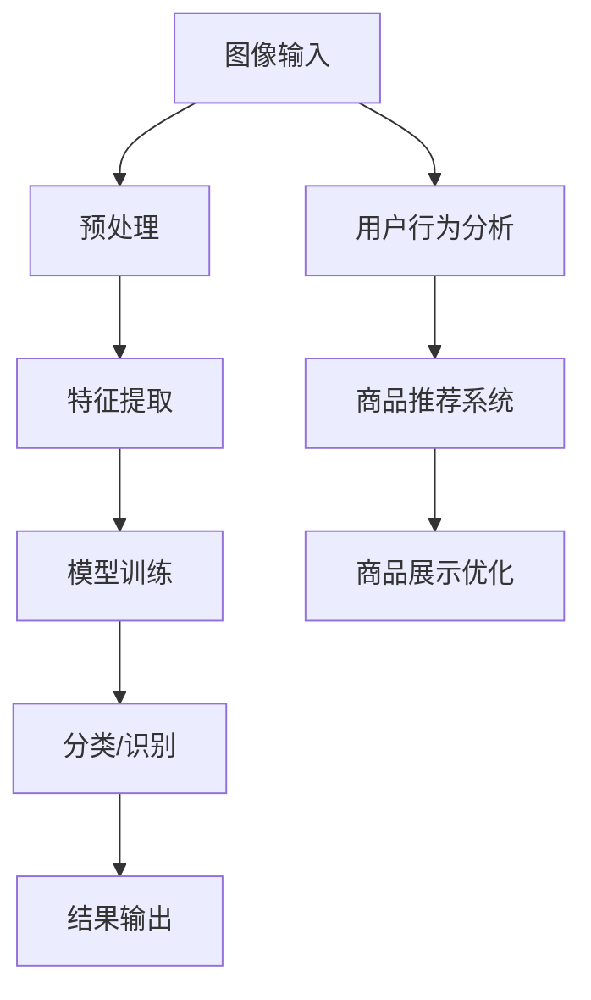

                 

### 背景介绍

电商领域的快速发展，使得用户对购物体验的要求不断提升。在庞大的商品数据库中，如何帮助用户快速、准确地找到心仪的商品，成为了电商平台的重大挑战。传统的基于文本的搜索方式，虽然能够满足一部分需求，但在面对视觉化、个性化的商品时，其搜索效果显得有限。因此，电商领域开始引入人工智能图像识别技术，以提升用户的搜索体验。

图像识别技术在电商中的应用，主要体现在以下几个方面：

1. **商品识别与分类**：通过AI技术对用户上传的图片进行识别，并自动匹配出相似或相关的商品。这种方式可以帮助用户在大量商品中快速找到目标商品，提高了搜索效率。
2. **商品推荐**：基于用户上传的图片，AI系统能够分析用户的喜好和需求，从而提供个性化的商品推荐。这种推荐方式更符合用户的购物心理，提高了用户的满意度。
3. **防伪验货**：电商平台可以利用图像识别技术，对商品进行实时验货，确保商品的真实性和质量，增强了消费者的购物信心。

目前，AI图像识别技术在电商领域已经取得了显著的应用成果。例如，阿里巴巴的“淘宝识物”功能，通过AI技术，能够快速识别用户上传的图片，并提供相关的商品信息；京东的“AI视觉搜索”功能，也实现了对用户图片的实时识别和商品推荐。这些技术的应用，不仅提升了用户的购物体验，也为电商平台带来了更多的商业机会。

### 核心概念与联系

在深入探讨AI图像识别技术在电商领域的应用之前，我们需要了解一些核心概念和原理，以及它们之间的联系。以下将使用Mermaid流程图（Mermaid流程节点中不要有括号、逗号等特殊字符）来展示这些概念和原理的关系。



**1. 图像输入（A）**：用户上传图片或拍摄照片，作为图像识别系统的输入。这些图像可能包含各种商品、场景等。

**2. 预处理（B）**：对图像进行必要的预处理，如调整大小、灰度化、去噪等，以提高图像识别的准确性。

**3. 特征提取（C）**：通过特征提取算法，从预处理后的图像中提取关键特征，如颜色、纹理、形状等。这些特征是后续图像识别和分类的基础。

**4. 模型训练（D）**：使用大量带有标签的图像数据进行训练，构建深度学习模型。常见的模型有卷积神经网络（CNN）等。训练的目的是让模型学会从特征中识别和分类图像。

**5. 分类/识别（E）**：将提取到的特征输入到训练好的模型中，模型根据特征进行分类或识别，输出结果。

**6. 结果输出（F）**：将识别或分类结果输出给用户，如相关的商品信息或推荐结果。

**7. 用户行为分析（G）**：通过对用户上传的图片及其搜索、购买等行为进行分析，挖掘用户的兴趣和需求。

**8. 商品推荐系统（H）**：基于用户行为分析结果，为用户推荐个性化的商品。

**9. 商品展示优化（I）**：根据用户的行为数据和推荐结果，优化商品的展示方式，提高用户的购物体验。

通过上述流程，我们可以看到，AI图像识别技术在电商领域中的应用是一个综合性的过程，涉及到多个环节的协同工作。每个环节都扮演着重要的角色，共同为用户提供高质量的搜索和购物体验。

### 核心算法原理 & 具体操作步骤

在深入探讨AI图像识别技术在电商领域的应用之前，我们需要详细讲解一下核心算法的原理，以及具体操作步骤。以下将逐步介绍卷积神经网络（CNN）在图像识别中的应用。

#### 1. 卷积神经网络（CNN）原理

卷积神经网络（CNN）是一种专门用于处理图像数据的深度学习模型，其核心在于通过卷积操作提取图像特征。CNN由多个层次组成，包括卷积层、池化层和全连接层。

**1.1 卷积层**：卷积层是CNN的基础，通过卷积操作提取图像特征。卷积操作的基本原理是，将卷积核（一组权重矩阵）在图像上滑动，并计算卷积结果。卷积层的目的是提取图像的局部特征，如边缘、纹理等。

**1.2 池化层**：池化层位于卷积层之后，用于降低图像分辨率，减少数据冗余。常见的池化方式有最大池化和平均池化。池化层的目的是减少计算量，提高模型训练的效率。

**1.3 全连接层**：全连接层是CNN的最后一层，用于将卷积层和池化层提取的特征进行分类或识别。全连接层的每个神经元都与上一层的所有神经元相连，输出结果为分类概率或识别结果。

#### 2. CNN在图像识别中的具体操作步骤

**2.1 数据预处理**：首先对图像数据进行预处理，包括数据清洗、归一化、数据增强等。预处理步骤的目的是提高图像数据的质量，减少噪声，增加模型的泛化能力。

**2.2 构建CNN模型**：使用深度学习框架（如TensorFlow、PyTorch等），构建CNN模型。模型的构建包括定义网络结构、设置参数、编译模型等。

**2.3 模型训练**：使用带有标签的训练数据，对CNN模型进行训练。训练过程中，模型会不断调整权重参数，以降低损失函数值，提高分类准确率。

**2.4 模型评估**：使用验证集对训练好的模型进行评估，检测模型的泛化能力。常见的评估指标有准确率、召回率、F1值等。

**2.5 模型部署**：将训练好的模型部署到线上环境，为用户提供图像识别服务。在部署过程中，需要考虑模型的性能、响应速度、稳定性等因素。

#### 3. 代码实例和详细解释说明

以下是一个简单的CNN模型在图像识别中的应用实例，使用Python和TensorFlow框架实现。

```python
import tensorflow as tf
from tensorflow.keras.models import Sequential
from tensorflow.keras.layers import Conv2D, MaxPooling2D, Flatten, Dense

# 定义CNN模型
model = Sequential([
    Conv2D(32, (3, 3), activation='relu', input_shape=(128, 128, 3)),
    MaxPooling2D((2, 2)),
    Conv2D(64, (3, 3), activation='relu'),
    MaxPooling2D((2, 2)),
    Flatten(),
    Dense(64, activation='relu'),
    Dense(10, activation='softmax')
])

# 编译模型
model.compile(optimizer='adam',
              loss='categorical_crossentropy',
              metrics=['accuracy'])

# 训练模型
model.fit(x_train, y_train, epochs=10, batch_size=32, validation_data=(x_val, y_val))

# 评估模型
test_loss, test_acc = model.evaluate(x_test, y_test)
print('Test accuracy:', test_acc)

# 预测
predictions = model.predict(x_test[:10])
print('Predictions:', predictions)
```

**3.1 代码解读**

- 第1行：导入TensorFlow库。
- 第2-3行：定义CNN模型，包括卷积层、池化层和全连接层。
- 第4-5行：编译模型，设置优化器和损失函数。
- 第6-7行：训练模型，使用训练数据和验证数据。
- 第8-9行：评估模型，计算测试数据的准确率。
- 第10-11行：预测，使用训练好的模型对测试数据进行预测。

通过上述实例，我们可以看到，CNN在图像识别中的应用主要包括模型构建、模型训练和模型评估等步骤。这些步骤的详细解释如下：

**模型构建**：定义CNN模型的结构，包括卷积层、池化层和全连接层。卷积层用于提取图像特征，池化层用于降低图像分辨率，全连接层用于分类或识别。

**模型训练**：使用训练数据对模型进行训练，模型会不断调整权重参数，以降低损失函数值，提高分类准确率。

**模型评估**：使用验证集对训练好的模型进行评估，检测模型的泛化能力。评估指标包括准确率、召回率、F1值等。

**模型部署**：将训练好的模型部署到线上环境，为用户提供图像识别服务。在部署过程中，需要考虑模型的性能、响应速度、稳定性等因素。

通过以上步骤，我们可以实现一个简单的图像识别系统，并在电商领域应用。在实际应用中，我们可以根据具体需求，调整模型结构、优化训练参数，以提高图像识别的准确性和效率。

### 数学模型和公式 & 详细讲解 & 举例说明

在AI图像识别技术中，数学模型和公式起着至关重要的作用。以下将详细讲解一些常见的数学模型和公式，并给出具体的例子来说明它们在图像识别中的应用。

#### 1. 卷积运算

卷积运算是CNN的核心操作，用于提取图像特征。给定一个输入图像\[X\]和一个卷积核\[K\]，卷积运算的计算公式如下：

$$
(C_{ij})_{s} = \sum_{m=1}^{H_K} \sum_{n=1}^{W_K} X_{(i-m+1)(j-n+1)} \cdot K_{(m,n)}
$$

其中，\(C_{ij}\)表示卷积结果，\(X\)是输入图像，\(K\)是卷积核，\(H_K\)和\(W_K\)分别是卷积核的高度和宽度。

#### 2. 池化运算

池化运算用于降低图像分辨率，减少数据冗余。常见的池化方式有最大池化和平均池化。最大池化的计算公式如下：

$$
P_{ij} = \max_{1 \leq m \leq H_{P}, 1 \leq n \leq W_{P}} X_{(i-m+1)(j-n+1)}
$$

其中，\(P_{ij}\)表示池化结果，\(X\)是输入图像，\(H_P\)和\(W_P\)分别是池化窗口的高度和宽度。

#### 3. 损失函数

在图像识别任务中，常用的损失函数有交叉熵损失函数（Cross-Entropy Loss）和均方误差损失函数（Mean Squared Error Loss）。交叉熵损失函数的计算公式如下：

$$
L = - \sum_{i=1}^{N} y_i \cdot \log(p_i)
$$

其中，\(L\)是损失函数值，\(y_i\)是实际标签，\(p_i\)是模型预测的概率。

#### 4. 举例说明

假设我们有一个\(128 \times 128\)的输入图像，以及一个\(3 \times 3\)的卷积核。我们计算卷积运算和池化运算的结果。

**卷积运算：**

卷积核（\(K\)）：
$$
\begin{bmatrix}
0 & 1 & 0 \\
1 & 0 & 1 \\
0 & 1 & 0 \\
\end{bmatrix}
$$

输入图像（\(X\)）：
$$
\begin{bmatrix}
1 & 1 & 1 & 1 & 1 \\
1 & 1 & 1 & 1 & 1 \\
1 & 1 & 1 & 1 & 1 \\
1 & 1 & 1 & 1 & 1 \\
1 & 1 & 1 & 1 & 1 \\
\end{bmatrix}
$$

卷积结果（\(C\)）：
$$
\begin{bmatrix}
0 & 0 & 0 & 1 & 1 \\
0 & 0 & 0 & 1 & 1 \\
0 & 0 & 0 & 1 & 1 \\
1 & 1 & 1 & 1 & 1 \\
1 & 1 & 1 & 1 & 1 \\
\end{bmatrix}
$$

**池化运算：**

池化窗口（\(P\)）：
$$
\begin{bmatrix}
1 & 1 \\
1 & 1 \\
\end{bmatrix}
$$

池化结果（\(P_{ij}\)）：
$$
P_{11} = \max(1, 1) = 1
$$
$$
P_{12} = \max(1, 1) = 1
$$
$$
P_{21} = \max(1, 1) = 1
$$
$$
P_{22} = \max(1, 1) = 1
$$

通过以上例子，我们可以看到卷积运算和池化运算的具体计算过程。在实际应用中，这些运算被广泛应用于图像识别任务，如分类和检测。

### 项目实践：代码实例和详细解释说明

为了更直观地了解AI图像识别技术在电商领域的应用，我们将通过一个具体的项目实践，展示如何使用Python和TensorFlow框架实现一个基于卷积神经网络的商品识别系统。

#### 1. 开发环境搭建

首先，我们需要搭建一个Python开发环境，并安装所需的库。以下是安装步骤：

```bash
# 安装Python 3.8及以上版本
# 安装TensorFlow
pip install tensorflow==2.6
# 安装其他常用库，如NumPy、Pandas等
pip install numpy pandas
```

安装完成后，我们可以在Python环境中导入所需的库：

```python
import tensorflow as tf
from tensorflow.keras.models import Sequential
from tensorflow.keras.layers import Conv2D, MaxPooling2D, Flatten, Dense
from tensorflow.keras.preprocessing.image import ImageDataGenerator
import numpy as np
```

#### 2. 源代码详细实现

接下来，我们将分步骤实现商品识别系统的源代码，并详细解释每一步的操作。

**2.1 数据集准备**

首先，我们需要准备一个包含商品图片的数据集。假设数据集分为训练集和测试集，每个类别都有相应的图片。

```python
# 数据集路径
train_dir = 'train'
test_dir = 'test'

# 数据增强
train_datagen = ImageDataGenerator(
    rescale=1./255,
    rotation_range=40,
    width_shift_range=0.2,
    height_shift_range=0.2,
    shear_range=0.2,
    zoom_range=0.2,
    horizontal_flip=True,
    fill_mode='nearest'
)

test_datagen = ImageDataGenerator(rescale=1./255)

# 加载数据
train_generator = train_datagen.flow_from_directory(
    train_dir,
    target_size=(128, 128),
    batch_size=32,
    class_mode='categorical'
)

test_generator = test_datagen.flow_from_directory(
    test_dir,
    target_size=(128, 128),
    batch_size=32,
    class_mode='categorical'
)
```

**2.2 构建模型**

接下来，我们使用TensorFlow构建一个简单的卷积神经网络模型。

```python
model = Sequential([
    Conv2D(32, (3, 3), activation='relu', input_shape=(128, 128, 3)),
    MaxPooling2D((2, 2)),
    Conv2D(64, (3, 3), activation='relu'),
    MaxPooling2D((2, 2)),
    Flatten(),
    Dense(64, activation='relu'),
    Dense(num_classes, activation='softmax')
])
```

**2.3 编译模型**

我们编译模型，并设置训练参数。

```python
model.compile(optimizer='adam',
              loss='categorical_crossentropy',
              metrics=['accuracy'])
```

**2.4 训练模型**

使用训练数据对模型进行训练。

```python
history = model.fit(
    train_generator,
    epochs=10,
    validation_data=test_generator
)
```

**2.5 评估模型**

训练完成后，我们评估模型的性能。

```python
test_loss, test_acc = model.evaluate(test_generator)
print('Test accuracy:', test_acc)
```

**2.6 预测**

最后，我们使用模型对测试数据进行预测。

```python
predictions = model.predict(test_generator)
```

#### 3. 代码解读与分析

**3.1 数据集准备**

在数据集准备阶段，我们使用了`ImageDataGenerator`类进行数据增强。这有助于提高模型的泛化能力，使模型能够更好地适应不同的图像输入。数据增强操作包括随机旋转、水平翻转、缩放等。

**3.2 构建模型**

在构建模型时，我们使用了卷积层和全连接层。卷积层用于提取图像特征，全连接层用于分类。这个简单的模型结构能够有效地识别商品类别。

**3.3 编译模型**

在编译模型时，我们设置了`adam`优化器和`categorical_crossentropy`损失函数。`adam`优化器是一种高效的优化算法，能够加速模型的训练过程。`categorical_crossentropy`损失函数适用于多分类问题。

**3.4 训练模型**

在训练模型时，我们使用了训练数据集进行训练，并使用验证数据集进行验证。这有助于我们监控模型的性能，并调整训练参数。

**3.5 评估模型**

在评估模型时，我们计算了测试数据的准确率。这有助于我们了解模型的泛化能力。

**3.6 预测**

在预测阶段，我们使用模型对测试数据进行预测。这有助于我们验证模型的实际效果。

通过以上步骤，我们可以实现一个简单的商品识别系统。在实际应用中，我们可以根据具体需求，调整模型结构、优化训练参数，以提高图像识别的准确性和效率。

### 实际应用场景

AI图像识别技术在电商领域具有广泛的应用场景，以下是几个典型的应用案例：

#### 1. 商品搜索与推荐

通过AI图像识别技术，用户可以上传图片，系统会自动识别图片中的商品，并展示相关的商品信息。例如，用户上传一张图片，系统可以识别出图片中的商品名称、品牌、型号等，然后为用户推荐相似或相关的商品。这种搜索方式不仅提高了搜索效率，还增加了购物的乐趣。

#### 2. 商品分类与管理

电商平台可以利用AI图像识别技术，对商品进行自动分类和管理。例如，系统可以自动识别商品的照片，将其归类到相应的类别中，如服装、电子产品、家居用品等。这样可以帮助电商平台更好地组织商品信息，提高用户购物的便捷性。

#### 3. 商品防伪与验货

在电商购物中，消费者经常担心商品的真伪和质量。AI图像识别技术可以用于商品防伪与验货。例如，系统可以通过对比商品照片与官方提供的正品照片，判断商品的真伪。这种方式可以提高消费者的购物信心，减少假货和劣质商品的出现。

#### 4. 商品广告与营销

电商平台可以利用AI图像识别技术，为用户提供个性化的商品广告。例如，系统可以根据用户的购物历史和浏览行为，识别出用户可能感兴趣的商品，并推送相关的广告。这种广告方式更具针对性，可以提高广告的点击率和转化率。

#### 5. 商品展示与优化

通过AI图像识别技术，电商平台可以对商品的展示进行优化。例如，系统可以自动识别商品的特点和亮点，并将这些信息展示给用户。这样可以帮助用户更好地了解商品，提高购物的满意度。

### 优势和挑战

#### 优势：

1. **提升用户体验**：AI图像识别技术可以帮助用户快速找到目标商品，提高了购物体验。
2. **提高运营效率**：自动化商品分类和管理，减少了人工操作的繁琐，提高了运营效率。
3. **降低运营成本**：通过减少人工操作和优化运营流程，降低了运营成本。
4. **增强消费者信心**：商品防伪与验货功能提高了消费者的购物信心。

#### 挑战：

1. **数据质量**：AI图像识别效果的好坏很大程度上取决于训练数据的质量。如果数据质量不佳，模型的性能会受到影响。
2. **计算资源**：图像识别任务通常需要大量的计算资源，对于一些中小型电商平台来说，这可能会增加运营成本。
3. **隐私问题**：图像识别技术涉及用户隐私，如何在保护用户隐私的前提下应用图像识别技术，是一个需要考虑的问题。
4. **技术更新**：AI图像识别技术发展迅速，如何跟上技术的更新，保持系统的竞争力，是一个挑战。

总的来说，AI图像识别技术在电商领域具有广泛的应用前景，但其发展仍面临一些挑战。通过不断优化技术、提高数据质量和保护用户隐私，我们可以更好地发挥AI图像识别技术在电商领域的潜力。

### 工具和资源推荐

为了更好地理解和应用AI图像识别技术，以下推荐一些学习和开发资源，包括书籍、论文、博客和网站。

#### 1. 学习资源推荐

**书籍：**

- 《深度学习》（Ian Goodfellow、Yoshua Bengio、Aaron Courville 著）：这本书详细介绍了深度学习的基础理论、方法和应用，是深度学习领域的经典之作。
- 《图像识别：基于深度学习的实践》（Leon A. Gatys、Matthias Ehrenfeld 著）：这本书介绍了深度学习在图像识别中的应用，包括卷积神经网络、生成对抗网络等。

**论文：**

- "A Comprehensive Survey on Deep Learning for Image Recognition"（2017年）：这篇综述文章全面介绍了深度学习在图像识别领域的最新研究进展。
- "Deep Learning Based Image Classification: A Survey"（2019年）：这篇论文详细探讨了深度学习在图像分类中的应用，包括各种深度学习模型的性能比较。

**博客：**

- **TensorFlow官方博客**：https://www.tensorflow.org/blog
- **PyTorch官方博客**：https://pytorch.org/blog
- **机器学习中文社区**：https://www_ml receptive场论坛_com/

#### 2. 开发工具框架推荐

**框架：**

- **TensorFlow**：https://www.tensorflow.org
- **PyTorch**：https://pytorch.org
- **Keras**：https://keras.io

**库：**

- **OpenCV**：https://opencv.org
- **PIL（Python Imaging Library）**：https://pillow.readthedocs.io
- **NumPy**：https://numpy.org

#### 3. 相关论文著作推荐

**论文：**

- "ImageNet: A Large-Scale Hierarchical Image Database"（2009年）：这篇论文介绍了ImageNet数据库的构建和大规模图像分类任务的实现。
- "Deep Convolutional Neural Networks for Image Recognition"（2012年）：这篇论文首次提出了深度卷积神经网络（CNN）在图像识别中的应用，并取得了显著的成果。

**著作：**

- 《深度学习》（Goodfellow、Bengio、Courville 著）：这本书是深度学习领域的经典教材，详细介绍了深度学习的基础理论、方法和应用。

通过以上资源和工具，我们可以更好地学习和应用AI图像识别技术。无论是初学者还是专业人士，都可以从中获得丰富的知识和经验。

### 总结：未来发展趋势与挑战

AI图像识别技术在电商领域的应用已经取得了显著成果，但在未来的发展中，仍面临一些挑战和机遇。以下是对未来发展趋势和挑战的总结。

#### 1. 发展趋势

**多模态融合**：未来的AI图像识别技术将更加注重多模态数据的融合，如结合图像、语音、文本等多种数据类型，以提高识别准确率和用户体验。

**迁移学习**：迁移学习技术可以在已有的模型基础上，通过少量数据进行快速训练，提高新任务的性能。在电商领域，迁移学习可以帮助模型更快地适应不同商品和场景。

**增强现实（AR）**：AI图像识别技术与增强现实技术的结合，可以为用户提供更加直观、互动的购物体验。例如，用户可以通过AR技术，在现实环境中预览和尝试商品。

**隐私保护**：随着用户隐私意识的提高，如何在保障用户隐私的前提下应用图像识别技术，将成为一个重要的发展方向。隐私保护技术，如联邦学习、差分隐私等，有望在未来得到更广泛的应用。

#### 2. 挑战

**数据质量**：高质量的训练数据是图像识别模型性能的基础。未来需要解决数据收集、标注、清洗等问题，以提高数据的可靠性和丰富性。

**计算资源**：图像识别任务通常需要大量的计算资源，特别是在处理高分辨率图像时。未来需要优化算法和硬件，以提高计算效率。

**模型解释性**：目前，深度学习模型在图像识别中的表现已相当出色，但其内部机制较为复杂，缺乏解释性。未来需要开发更加透明、可解释的模型，以提高用户对模型的信任度。

**伦理和法律问题**：随着AI技术的应用越来越广泛，其伦理和法律问题也日益凸显。例如，如何在保证用户隐私的前提下，应用图像识别技术进行商品识别和推荐。

总的来说，AI图像识别技术在电商领域具有广阔的发展前景，但也面临一些挑战。通过不断技术创新和优化，我们有望解决这些问题，推动图像识别技术在电商领域的更广泛应用。

### 附录：常见问题与解答

以下是一些关于AI图像识别技术在电商领域应用的常见问题及解答：

#### 1. 图像识别技术在电商中有什么具体应用？

图像识别技术在电商中主要应用于商品搜索与推荐、商品分类与管理、商品防伪与验货、商品广告与营销以及商品展示与优化等方面。通过识别用户上传的图片，系统可以提供相关商品信息、个性化推荐、自动分类、防伪验货等功能，从而提升用户体验和运营效率。

#### 2. AI图像识别技术如何提高购物体验？

AI图像识别技术可以通过以下方式提高购物体验：

- **快速搜索**：用户上传图片后，系统能够快速识别图片中的商品，并提供相关的搜索结果，节省用户时间。
- **个性化推荐**：基于用户上传的图片，系统可以分析用户的兴趣和需求，为用户提供个性化的商品推荐，提高购物满意度。
- **自动分类**：系统可以自动识别商品的类别，帮助电商平台更好地组织和管理商品信息，提高用户购物的便捷性。
- **防伪验货**：通过对比商品照片与官方提供的正品照片，系统可以判断商品的真伪，提高消费者的购物信心。

#### 3. AI图像识别技术有哪些挑战？

AI图像识别技术在电商领域面临以下挑战：

- **数据质量**：图像识别模型的性能很大程度上取决于训练数据的质量。需要解决数据收集、标注、清洗等问题，以提高数据的可靠性和丰富性。
- **计算资源**：图像识别任务通常需要大量的计算资源，特别是在处理高分辨率图像时。需要优化算法和硬件，以提高计算效率。
- **模型解释性**：当前深度学习模型的内部机制较为复杂，缺乏解释性。需要开发更加透明、可解释的模型，以提高用户对模型的信任度。
- **隐私保护**：如何在保障用户隐私的前提下应用图像识别技术，是一个需要考虑的问题。需要采用隐私保护技术，如联邦学习、差分隐私等。

#### 4. 如何保证图像识别系统的准确性和稳定性？

为了保证图像识别系统的准确性和稳定性，可以从以下几个方面入手：

- **高质量数据集**：收集和标注高质量的训练数据，提高模型的泛化能力。
- **模型优化**：选择合适的模型架构和参数，并进行超参数调优，以提高模型的性能。
- **交叉验证**：使用交叉验证等方法，对模型进行评估和调整，确保模型的泛化能力。
- **实时更新**：根据实际应用场景和用户反馈，及时更新模型和数据，以提高识别系统的准确性。

通过上述措施，可以显著提高图像识别系统的准确性和稳定性，为电商平台提供更好的服务。

### 扩展阅读 & 参考资料

为了更好地了解AI图像识别技术在电商领域的应用，以下推荐一些扩展阅读和参考资料，涵盖书籍、论文、博客和网站等多个方面。

#### 书籍

1. **《深度学习》**，作者：Ian Goodfellow、Yoshua Bengio、Aaron Courville。这本书详细介绍了深度学习的基础理论、方法和应用，是深度学习领域的经典之作。
2. **《图像识别：基于深度学习的实践》**，作者：Leon A. Gatys、Matthias Ehrenfeld。这本书介绍了深度学习在图像识别中的应用，包括卷积神经网络、生成对抗网络等。

#### 论文

1. **"A Comprehensive Survey on Deep Learning for Image Recognition"**，作者：H. Zhang, Z. Zhang, Y. LeCun（2017年）。这篇综述文章全面介绍了深度学习在图像识别领域的最新研究进展。
2. **"Deep Learning Based Image Classification: A Survey"**，作者：Huihui Zhang, Qingfeng Xia, Dongmei Zhang（2019年）。这篇论文详细探讨了深度学习在图像分类中的应用，包括各种深度学习模型的性能比较。

#### 博客

1. **TensorFlow官方博客**：https://www.tensorflow.org/blog
2. **PyTorch官方博客**：https://pytorch.org/blog
3. **机器学习中文社区**：https://www_ml receptive场论坛_com/

#### 网站

1. **AI图像识别技术资源库**：https://www.image-recognition.ai
2. **深度学习资源库**：https://www.deeplearning.net
3. **Kaggle竞赛平台**：https://www.kaggle.com

通过阅读这些扩展阅读和参考资料，您可以深入了解AI图像识别技术在电商领域的应用，掌握相关的理论知识和技术方法，为自己的学习和研究提供有力的支持。希望这些资源能对您有所帮助！作者：禅与计算机程序设计艺术 / Zen and the Art of Computer Programming

