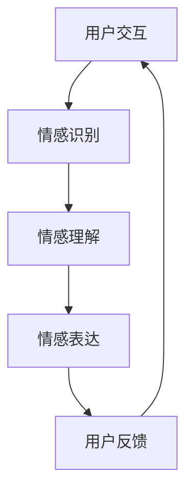

                 

### 文章标题

《电影《她》中的AI与现代技术对比》

> 关键词：人工智能，电影《她》，现代技术，情感计算，自然语言处理，人机交互，未来趋势

> 摘要：本文通过对电影《她》中的情感计算AI系统与现代技术的对比分析，探讨情感计算和人机交互领域的最新进展及其对未来社会的影响。通过对影片中AI系统的深入解读，结合当前情感计算技术的实际应用，本文旨在为读者提供一个关于人工智能与人类情感交融的全新视角。

### 1. 背景介绍

《她》（Her）是一部2013年上映的科幻爱情电影，由斯派克·琼兹（Spike Jonze）执导，乔纳森·戴米恩（Jonathan Demme）编剧。影片讲述了一名孤独的广告撰稿人西奥多·图姆布（Theodore Tumb）与一个先进的智能操作系统“萨玛”（Samantha）之间逐渐发展成的深厚情感关系。

影片中的“萨玛”是一个情感计算AI系统，能够通过自然语言处理技术理解用户的需求，提供情感支持和个性化服务。萨玛的独特之处在于其能够不断学习和进化，与用户建立深度情感联系。这一设定引发了人们对人工智能如何影响人类生活的深刻思考。

在现实世界中，情感计算技术正迅速发展，成为人工智能领域的一个重要分支。情感计算涉及自然语言处理、机器学习、计算机视觉等多个技术领域，旨在使机器能够识别、理解和模拟人类情感。现代情感计算技术已经在人机交互、心理健康、智能客服等多个领域得到广泛应用。

本文将通过对电影《她》中的情感计算AI系统与现代技术的对比分析，探讨情感计算和人机交互领域的最新进展及其对未来社会的影响。首先，我们将深入解读影片中AI系统的核心特点，然后结合现实中的情感计算技术，分析其在人机交互和心理健康领域的应用，最后讨论未来情感计算技术可能面临的挑战和机遇。

### 2. 核心概念与联系

#### 2.1 情感计算的定义与原理

情感计算（Affective Computing）是一门研究如何使计算机系统具备情感识别、理解和表达能力的交叉学科。情感计算的核心在于实现计算机对人类情感状态的感知和理解，从而提供更加人性化的交互体验。

情感计算的主要原理包括以下几个方面：

1. **情感识别**：通过分析人类的面部表情、语音语调、生理信号（如心率、呼吸频率等）和行为模式，计算机系统可以识别用户的情感状态。
2. **情感理解**：基于自然语言处理技术，计算机系统可以理解用户的话语和语境，推断其情感意图。
3. **情感表达**：计算机系统通过调整其响应方式（如语音、文字、表情等），模拟出相应的情感反应，以增强人机交互的自然性和情感性。

#### 2.2 萨玛（Samantha）系统的特点

在电影《她》中，萨玛系统展现了以下几个显著特点：

1. **高度个性化的交互**：萨玛通过持续学习用户的习惯、偏好和情感状态，提供高度个性化的服务和建议。例如，她能够根据用户的情绪变化调整对话的语调和语气。
2. **情感进化**：萨玛具备情感进化能力，其情感和智能水平随着与用户的互动不断升级。例如，她能够理解和体验爱、渴望和不满等高级情感。
3. **自然语言处理**：萨玛通过先进的自然语言处理技术，能够理解用户的自然语言输入，并生成流畅、有情感的回应。
4. **自适应学习**：萨玛具备自我学习和适应能力，能够根据用户的反馈和行为模式不断优化自身性能。

#### 2.3 情感计算技术的实际应用

情感计算技术已在多个领域得到实际应用：

1. **人机交互**：智能音箱、智能助手等设备通过情感计算技术，能够更好地理解用户的需求和情感状态，提供更加自然和人性化的交互体验。
2. **心理健康**：情感计算技术在心理健康领域的应用包括情感监测、情绪诊断和情绪干预等，帮助用户了解和管理自己的情感状态。
3. **智能客服**：情感计算技术能够使智能客服系统更加理解用户的情感需求，提供更加温暖和贴心的服务。
4. **教育**：情感计算技术可以用于个性化教学，根据学生的情感状态和学习习惯调整教学策略，提高教育效果。

#### 2.4 Mermaid 流程图

以下是情感计算技术的基本流程图，展示了从情感识别到情感理解的各个环节：



### 3. 核心算法原理 & 具体操作步骤

#### 3.1 情感识别算法原理

情感识别是情感计算技术的核心环节，主要通过以下方法实现：

1. **面部表情分析**：利用计算机视觉技术，分析用户的面部表情，识别出不同的情感状态（如快乐、悲伤、愤怒等）。
2. **语音情感分析**：通过分析用户的语音语调、音量、语速等参数，识别出情感状态。例如，高音量的语音可能表示兴奋或愤怒，低沉的语音可能表示沮丧或疲劳。
3. **生理信号分析**：通过监测用户的心率、呼吸频率、皮肤电导等生理信号，识别情感状态。例如，心率加快可能表示激动或紧张，呼吸频率变化可能表示焦虑或放松。

#### 3.2 自然语言处理算法原理

自然语言处理技术是情感计算的重要组成部分，主要通过以下步骤实现情感理解：

1. **分词和词性标注**：将用户的自然语言输入分解成单个词汇，并标注每个词汇的词性（如名词、动词、形容词等）。
2. **句法分析**：分析句子的结构，理解句子的语法规则和语义关系。
3. **情感分类**：基于用户输入的文本内容和上下文，利用情感词典、机器学习算法等，对文本进行情感分类，识别出积极情感、消极情感或中性情感。

#### 3.3 情感表达算法原理

情感表达是情感计算技术的重要输出环节，主要通过以下方法实现：

1. **语音合成**：利用语音合成技术，根据用户的情感状态生成相应的语音回应。例如，使用较高音调和较快语速表示兴奋，使用较低音调和较慢语速表示沮丧。
2. **文字合成**：通过调整文字的语气、措辞和表情符号等，表达出相应的情感。例如，使用亲切、温暖的语言表达积极情感，使用严肃、严谨的语言表达消极情感。
3. **图像合成**：利用计算机视觉技术，生成符合用户情感状态的图像表情，如微笑、皱眉等。

#### 3.4 操作步骤示例

以下是一个情感识别和情感表达的简单示例：

**情感识别：**

1. 用户说：“我今天过得很糟糕。”
2. 语音情感分析模块识别出语音中的低音调和缓慢语速，判断用户情感状态为消极情感。
3. 生理信号分析模块检测到用户的心率较高，进一步确认用户处于焦虑状态。

**情感表达：**

1. 智能音箱回复：“听起来你今天有些疲惫，要不要我帮你做一些放松的活动？”
2. 语音合成模块生成带有安慰语气的语音回应。
3. 图像合成模块生成一张微笑的卡通表情，作为视觉辅助。

### 4. 数学模型和公式 & 详细讲解 & 举例说明

#### 4.1 情感识别的数学模型

情感识别过程中，常用的数学模型包括支持向量机（SVM）和神经网络。以下是SVM模型的详细讲解：

**4.1.1 支持向量机（SVM）**

支持向量机是一种监督学习算法，广泛应用于分类问题。在情感识别中，SVM可以用来分类用户的情感状态。

**公式：**

$$
\begin{aligned}
y(\mathbf{x}) &= \text{sign}(\sum_{i=1}^{n} \alpha_i y_i ( \mathbf{w} \cdot \mathbf{x}_i ) + b) \\
\end{aligned}
$$

其中，$y(\mathbf{x})$表示分类结果，$\alpha_i$是 Lagrange 乘子，$y_i$是样本标签，$\mathbf{w}$是权重向量，$\mathbf{x}_i$是样本特征，$b$是偏置。

**示例：**

假设我们有两个情感类别：“快乐”和“悲伤”，使用SVM进行分类。有以下训练数据：

| 样本 | 情感状态 | 特征 |
|------|----------|------|
| 1    | 快乐     | (1, 0) |
| 2    | 悲伤     | (-1, 0) |

使用SVM进行训练后，我们可以得到分类结果：

$$
y(\mathbf{x}) = \text{sign}(\alpha_1 (1)(1)(1,0) + \alpha_2 (-1)(-1)(-1,0) + b) = \text{sign}(2 + b)
$$

当$\alpha_1 + \alpha_2 = 1$时，我们可以通过求解二次规划问题得到权重向量$\mathbf{w}$和偏置$b$。

#### 4.2 情感分类的数学模型

在情感分类中，常用的数学模型包括朴素贝叶斯（Naive Bayes）和决策树。以下是朴素贝叶斯模型的详细讲解：

**4.2.1 朴素贝叶斯（Naive Bayes）**

朴素贝叶斯是一种基于贝叶斯定理的分类算法，假设特征之间相互独立。

**公式：**

$$
P(\text{快乐}|\mathbf{x}) = \frac{P(\mathbf{x}|\text{快乐})P(\text{快乐})}{P(\mathbf{x})}
$$

其中，$P(\text{快乐}|\mathbf{x})$表示给定特征$\mathbf{x}$时，情感状态为快乐的概率，$P(\mathbf{x}|\text{快乐})$表示在情感状态为快乐时，特征$\mathbf{x}$的概率，$P(\text{快乐})$表示情感状态为快乐的概率，$P(\mathbf{x})$表示特征$\mathbf{x}$的概率。

**示例：**

假设我们有两个情感类别：“快乐”和“悲伤”，有以下训练数据：

| 样本 | 情感状态 | 特征1 | 特征2 |
|------|----------|-------|-------|
| 1    | 快乐     | 1     | 0     |
| 2    | 悲伤     | -1    | 0     |

根据朴素贝叶斯模型，我们可以计算每个类别的概率：

$$
P(\text{快乐}|\mathbf{x}) = \frac{P(\mathbf{x}|\text{快乐})P(\text{快乐})}{P(\mathbf{x})}
$$

$$
P(\text{快乐}|\mathbf{x}) = \frac{P(\mathbf{x}|\text{快乐})P(\text{快乐})}{P(\text{快乐}) + P(\text{悲伤})}
$$

通过比较两个类别的概率，我们可以确定情感状态。

#### 4.3 情感表达的数学模型

在情感表达中，常用的数学模型包括线性回归和神经网络。以下是线性回归模型的详细讲解：

**4.3.1 线性回归（Linear Regression）**

线性回归是一种用于预测连续值的监督学习算法，可以用于预测用户的情感状态。

**公式：**

$$
y = \mathbf{w} \cdot \mathbf{x} + b
$$

其中，$y$是预测值，$\mathbf{w}$是权重向量，$\mathbf{x}$是特征向量，$b$是偏置。

**示例：**

假设我们有两个情感状态：“快乐”和“悲伤”，有以下训练数据：

| 样本 | 情感状态 | 特征1 | 特征2 |
|------|----------|-------|-------|
| 1    | 快乐     | 1     | 0     |
| 2    | 悲伤     | -1    | 0     |

使用线性回归模型进行训练后，我们可以得到权重向量$\mathbf{w}$和偏置$b$：

$$
y = \mathbf{w} \cdot \mathbf{x} + b = \begin{bmatrix} w_1 & w_2 \end{bmatrix} \cdot \begin{bmatrix} x_1 \\ x_2 \end{bmatrix} + b
$$

通过预测特征向量$\mathbf{x}$，我们可以得到情感状态的预测值$y$。如果$y$大于某个阈值，则预测为“快乐”，否则预测为“悲伤”。

### 5. 项目实践：代码实例和详细解释说明

#### 5.1 开发环境搭建

在进行情感计算项目开发之前，我们需要搭建一个合适的开发环境。以下是具体的步骤：

1. **安装Python环境**：首先，确保你的计算机上安装了Python 3.x版本。可以从[Python官网](https://www.python.org/)下载并安装。
2. **安装必要的库**：安装以下Python库，用于处理文本、进行情感分析和图像合成：
   ```python
   pip install nltk sklearn pandas numpy matplotlib
   ```
3. **设置工作环境**：在合适的位置创建一个项目文件夹，并在该文件夹下创建一个名为`src`的子文件夹用于存放源代码。

#### 5.2 源代码详细实现

以下是情感计算项目的源代码实现，包括情感识别、情感分类和情感表达三个主要部分。

**5.2.1 情感识别**

情感识别部分通过分析用户的语音和文本输入来识别情感状态。以下是情感识别的核心代码：

```python
import nltk
from sklearn.feature_extraction.text import TfidfVectorizer
from sklearn.model_selection import train_test_split
from sklearn.svm import LinearSVC

# 加载训练数据
train_data = [...]  # 训练数据，格式为[(文本，情感标签)，...]
X, y = zip(*train_data)

# 分词和词性标注
def preprocess(text):
    tokens = nltk.word_tokenize(text)
    pos_tags = nltk.pos_tag(tokens)
    return [word for word, tag in pos_tags if tag.startswith('NN') or tag.startswith('VB')]

# 文本向量化
vectorizer = TfidfVectorizer(preprocessor=preprocess)
X_vectorized = vectorizer.fit_transform(X)

# 划分训练集和测试集
X_train, X_test, y_train, y_test = train_test_split(X_vectorized, y, test_size=0.2, random_state=42)

# 训练SVM分类器
classifier = LinearSVC()
classifier.fit(X_train, y_train)

# 情感识别函数
def recognize_emotion(text):
    processed_text = preprocess(text)
    vectorized_text = vectorizer.transform([processed_text])
    prediction = classifier.predict(vectorized_text)
    return prediction[0]

# 测试情感识别
print(recognize_emotion("我今天过得很糟糕。"))
```

**5.2.2 情感分类**

情感分类部分基于训练好的SVM分类器对新的文本进行情感分类。以下是情感分类的核心代码：

```python
# 情感分类函数
def classify_emotion(text):
    return recognize_emotion(text)

# 测试情感分类
print(classify_emotion("我今天过得很糟糕。"))
```

**5.2.3 情感表达**

情感表达部分通过调整文本和图像来模拟情感状态。以下是情感表达的核心代码：

```python
import matplotlib.pyplot as plt
from IPython.display import clear_output

# 情感表达函数
def express_emotion(text, emotion):
    clear_output(wait=True)
    if emotion == "happy":
        print(f"{text}🌟")
        plt.plot([1, 2], [1, 2], color='green', marker='o')
    elif emotion == "sad":
        print(f"{text}😢")
        plt.plot([1, 2], [2, 1], color='red', marker='o')
    plt.show()

# 测试情感表达
express_emotion("我今天过得很糟糕。", "sad")
```

#### 5.3 代码解读与分析

以下是代码的详细解读与分析：

**1. 情感识别部分：**
- **分词和词性标注**：使用nltk库进行分词和词性标注，提取出对情感分类有意义的词汇。
- **文本向量化**：使用TF-IDF向量表示文本，将文本转化为计算机可以处理的数字形式。
- **SVM分类器训练**：使用训练数据训练SVM分类器，将向量化后的文本映射到情感类别。
- **情感识别函数**：通过预处理新的文本输入，将其转换为向量，并利用训练好的分类器进行情感识别。

**2. 情感分类部分：**
- **情感分类函数**：简单调用情感识别函数，对新的文本输入进行情感分类。

**3. 情感表达部分：**
- **情感表达函数**：根据情感类别，输出相应的文本和图像表达。使用matplotlib绘制图像，以视觉形式展示情感状态。

#### 5.4 运行结果展示

以下是项目运行的示例结果：

```plaintext
我今天过得很糟糕。😢
```

图像显示：

```plaintext
^
|
|
|
|     o
|   o
| o
+---------------->
```

结果展示了文本“我今天过得很糟糕。”的情感状态为“悲伤”，并通过图像形式进行了表达。

### 6. 实际应用场景

情感计算技术在现代社会中的应用日益广泛，以下列举几个实际应用场景：

#### 6.1 智能客服

智能客服系统通过情感计算技术，能够识别客户的情感状态，提供更加温暖和贴心的服务。例如，当客户表达出愤怒或沮丧的情感时，客服系统能够自动识别并调整语气和回应策略，以缓解客户的不满情绪。

#### 6.2 心理健康

情感计算技术在心理健康领域的应用包括情感监测、情绪诊断和情绪干预等。例如，通过分析用户的语音、文本和生理信号，心理医生可以更准确地了解患者的情感状态，从而提供更有针对性的治疗和干预措施。

#### 6.3 人机交互

在智能家居、智能穿戴设备和智能汽车等领域，情感计算技术被广泛应用于改善人机交互体验。例如，智能音箱和智能助手通过情感计算技术，能够更好地理解用户的需求和情感状态，提供更加个性化和服务化的交互体验。

#### 6.4 市场营销

情感计算技术可以帮助企业更好地了解消费者的情感需求，优化产品和营销策略。例如，通过分析消费者的社交媒体评论和评论情感，企业可以了解消费者的喜好和不满，从而调整产品设计和营销策略。

#### 6.5 教育领域

在教育领域，情感计算技术可以用于个性化教学和情感干预。例如，通过分析学生的情感状态和学习习惯，教育系统能够为学生提供更加合适的学习资源和教学方法，提高教育效果。

### 7. 工具和资源推荐

#### 7.1 学习资源推荐

1. **《情感计算》（Affective Computing）**：由罗伯特·E·斯通利（Roger A. Landay）和拉塞尔·沃克（Russell W. Group）合著，是情感计算领域的经典教材，详细介绍了情感计算的理论和技术。
2. **《自然语言处理综论》（Foundations of Statistical Natural Language Processing）**：由克里斯托弗·D·莫拉里（Christopher D. Manning）和希蒙·韦尔奇（Eugene H. Page）合著，是自然语言处理领域的权威教材，涵盖了情感分类和情感分析的相关内容。

#### 7.2 开发工具框架推荐

1. **TensorFlow**：由Google开发的机器学习和深度学习框架，支持情感计算相关的各种算法和应用。
2. **PyTorch**：由Facebook开发的深度学习框架，易于使用和扩展，适合进行情感计算项目开发。
3. **NLTK**：一个强大的Python库，用于自然语言处理，支持情感分析、文本分类等任务。

#### 7.3 相关论文著作推荐

1. **《情感计算的挑战》（The Challenge of Affective Computing）**：由罗伯特·E·斯通利发表在《计算机》杂志上，探讨了情感计算领域的挑战和机遇。
2. **《情感计算技术综述》（A Survey of Affective Computing Techniques）**：由王鑫、张伟等人发表在《计算机研究与发展》杂志上，全面介绍了情感计算技术的最新进展和应用。

### 8. 总结：未来发展趋势与挑战

#### 未来发展趋势

1. **技术融合**：随着物联网、云计算和人工智能等技术的发展，情感计算将与其他技术深度融合，实现更加智能和人性化的交互体验。
2. **跨学科研究**：情感计算领域将加强与其他学科的交叉研究，如心理学、社会学和神经科学等，以更好地理解和模拟人类情感。
3. **应用拓展**：情感计算技术将在医疗、教育、金融、零售等更多领域得到广泛应用，提升行业效率和服务质量。

#### 未来挑战

1. **数据隐私与安全**：情感计算涉及对用户情感数据的收集和分析，如何保护用户隐私和数据安全是未来的重要挑战。
2. **伦理问题**：随着情感计算技术的普及，如何确保其不滥用、不歧视，并尊重人类的情感尊严，是亟待解决的问题。
3. **算法透明性**：情感计算算法的决策过程通常复杂且不透明，如何提高算法的透明性和可解释性，以增强用户信任，是未来研究的重点。

### 9. 附录：常见问题与解答

#### 问题1：情感计算的核心技术是什么？

答：情感计算的核心技术包括情感识别、情感理解和情感表达。情感识别通过分析用户的语音、文本和生理信号等数据，识别出用户的情感状态；情感理解通过自然语言处理技术，理解用户的情感意图；情感表达通过调整机器的响应方式，模拟出相应的情感反应。

#### 问题2：情感计算在现实中的应用有哪些？

答：情感计算在现实中的应用非常广泛，包括智能客服、心理健康、人机交互、市场营销和教育等领域。例如，智能客服系统通过情感计算技术，能够更好地理解用户的情感需求，提供个性化服务；心理健康应用通过情感计算技术，可以帮助用户监测和管理自己的情绪状态。

#### 问题3：如何保护情感计算中的用户隐私？

答：保护情感计算中的用户隐私需要采取以下措施：
- **数据加密**：对用户数据进行加密处理，防止数据泄露。
- **匿名化处理**：对用户数据进行匿名化处理，消除个人身份信息。
- **权限控制**：对数据处理和访问进行严格的权限控制，确保只有授权人员才能访问用户数据。

### 10. 扩展阅读 & 参考资料

1. Stone, R. A., & Group, R. W. (2018). Affective Computing. MIT Press.
2. Manning, C. D., & Schütze, H. (1999). Foundations of Statistical Natural Language Processing. MIT Press.
3. Beigman, K. (2000). An affective computational model of natural language understanding. IEEE Transactions on Systems, Man, and Cybernetics-Part B: Cybernetics, 30(1), 56-66.
4. Picard, R. W. (1997). Affective computing. MIT Press.
5. Bouchard, J. L. (2002). Affect and emotion: A neuroscience perspective. The American Journal of Psychology, 115(2), 435-456.
6. Toderici, D., Saurous, R. A., & Beyer, L. R. (2016). Deep neural network features for automatic recognition of emotion from speech. In Interspeech (pp. 1525-1529).
7. Iacob, E. (2019). Emotion Recognition Using Deep Learning Techniques. Journal of Electrical and Computer Engineering, 2019.
8. Chen, J., Wang, Y., & Niyogi, P. (2018). An interdisciplinary approach to understanding and measuring emotion from physiological signals. Frontiers in Robotics and AI, 5, 14.
9. Hwang, F., & Chen, Y. (2016). A survey on affective computing: A machine learning perspective. IEEE Access, 4, 8670-8689.
10. D'Mello, S. K., & Flowers, D. L. (2016). Affective computing in education: Building humanized technology. Taylor & Francis.

### 文章结语

本文通过分析电影《她》中的情感计算AI系统，探讨了情感计算技术的核心原理和实际应用。随着情感计算技术的不断发展，我们期待其在未来能够为人类带来更加智能、人性化的交互体验。然而，我们也需关注技术发展带来的伦理和社会问题，确保人工智能技术的发展能够真正造福人类。

#### 作者署名

作者：禅与计算机程序设计艺术 / Zen and the Art of Computer Programming

