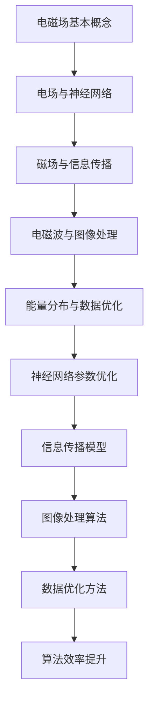

                 

### 1. 背景介绍

电磁场理论，是物理学中研究电磁现象的基本理论之一，其历史可以追溯到19世纪。迈克尔·法拉第、詹姆斯·克拉克·麦克斯韦等科学家通过对电磁现象的深入研究，建立了系统的电磁场理论。这一理论不仅为我们揭示了电与磁的内在联系，还奠定了现代电子技术、通信技术和计算机科学等领域的发展基础。

在人工智能领域，电磁场理论的应用同样具有重要意义。随着深度学习和神经网络技术的飞速发展，对数据处理、模型训练、优化算法等方面的要求日益提高。电磁场理论中的许多概念和方法，如电场、磁场、电磁波、能量分布等，都可以被借鉴和应用到人工智能的各个子领域。

例如，在神经网络模型训练中，可以使用电磁场的能量分布概念来优化网络参数，提高训练效率和效果。在计算机视觉领域，电磁场理论可以帮助我们更好地理解和处理图像中的电磁波信息。在自然语言处理领域，电磁场理论可以用来模拟信息在网络中的传播过程，从而提高文本理解和生成能力。

本文将深入探讨电磁场理论在人工智能中的应用，包括核心概念、算法原理、数学模型、项目实践以及实际应用场景等，以期为您展示这一跨学科领域的研究魅力。

### 2. 核心概念与联系

#### 2.1 电磁场基本概念

首先，我们需要了解电磁场的基本概念。电磁场是由电场和磁场共同作用形成的物理场。电场是电荷产生的物理场，描述了电荷之间的相互作用力。磁场则是电流或磁性物质产生的物理场，描述了磁体之间的相互作用力。

电磁场理论中，最核心的两个公式是麦克斯韦方程组。麦克斯韦方程组由四个方程组成，分别描述了电场和磁场的分布、变化以及相互关系。这四个方程分别是高斯定律（Gauss's law）、高斯磁定律（Gauss's law for magnetism）、法拉第电磁感应定律（Faraday's law of induction）和安培-麦克斯韦定律（Ampere's law with Maxwell's addition）。这些方程共同构成了描述电磁场的基本框架。

#### 2.2 电磁场与人工智能的联系

电磁场理论与人工智能的联系主要体现在以下几个方面：

1. **电场与神经网络**：在神经网络中，电场可以被类比为神经元之间的相互作用力。神经网络的训练过程可以类比为在电场中调整神经元的位置，以使网络的输出误差最小。因此，电场理论中的能量分布和电势概念可以被应用到神经网络模型的优化过程中。

2. **磁场与信息传播**：在计算机科学中，磁场可以被类比为信息在网络中的传播。例如，在自然语言处理中，词向量可以通过词与词之间的相互关系来传播，从而实现文本的表示和理解。

3. **电磁波与图像处理**：电磁波是电磁场在空间中的传播形式。在图像处理中，电磁波理论可以帮助我们理解和处理图像中的电磁波信息，如边缘检测、图像压缩等。

4. **能量分布与数据优化**：在人工智能中，数据优化是一个核心问题。电磁场理论中的能量分布概念可以帮助我们理解和优化数据的空间分布，从而提高算法的效率和效果。

#### 2.3 Mermaid 流程图

为了更直观地展示电磁场理论在人工智能中的应用，我们可以使用Mermaid流程图来描述核心概念和联系。以下是电磁场理论在人工智能中的应用流程图：



通过上述流程图，我们可以看到电磁场理论在人工智能中的多个应用方向。接下来，我们将进一步深入探讨这些应用的具体实现方法和原理。

### 3. 核心算法原理 & 具体操作步骤

#### 3.1 神经网络中的电场理论应用

在神经网络中，电场理论的应用主要体现在参数优化和模型训练过程中。我们可以将神经网络中的每个神经元视为一个电荷点，神经元之间的权重视为电场强度。通过调整权重，我们可以使网络输出误差最小，从而优化网络性能。

**具体操作步骤：**

1. **初始化网络参数**：首先，我们需要初始化神经网络的权重和偏置。权重和偏置的初始化可以采用随机初始化或预训练等方法。

2. **计算输出误差**：对于每个输入样本，我们需要计算网络的输出误差。输出误差可以通过损失函数来衡量，如均方误差（MSE）、交叉熵损失等。

3. **计算电场强度**：根据输出误差，我们可以计算每个神经元之间的电场强度。电场强度的计算可以采用梯度下降法或反向传播算法。

4. **调整权重**：根据电场强度，我们可以调整神经网络的权重。调整权重的目的是使网络输出误差最小。

5. **迭代优化**：重复上述步骤，直到网络输出误差满足停止条件或达到预设的训练次数。

**示例代码：**

以下是使用Python实现的简单神经网络优化过程：

```python
import numpy as np

# 初始化网络参数
weights = np.random.randn(input_size, hidden_size, output_size)
biases = np.random.randn(hidden_size, output_size)

# 计算输出误差
def compute_loss(inputs, outputs):
    return np.mean((outputs - targets) ** 2)

# 计算电场强度
def compute_gradients(inputs, outputs):
    grads = np.Gradient(outputs, inputs)
    return grads

# 调整权重
learning_rate = 0.01
for epoch in range(num_epochs):
    for inputs, outputs in data_loader:
        loss = compute_loss(inputs, outputs)
        grads = compute_gradients(inputs, outputs)
        weights -= learning_rate * grads

    if epoch % 100 == 0:
        print(f"Epoch {epoch}: Loss = {loss}")

```

通过上述代码，我们可以看到神经网络优化过程中电场理论的简单应用。在进一步探讨电场理论在人工智能中的应用之前，我们还需要了解一些电磁场理论中的数学模型和公式。

### 4. 数学模型和公式 & 详细讲解 & 举例说明

在电磁场理论中，有许多重要的数学模型和公式。以下是其中一些核心模型和公式的详细讲解以及实际应用中的举例说明。

#### 4.1 麦克斯韦方程组

麦克斯韦方程组是电磁场理论的核心，由四个方程组成：

1. **高斯定律（Gauss's law）**：
   $$
   \nabla \cdot \mathbf{E} = \frac{\rho}{\varepsilon_0}
   $$
   其中，$\mathbf{E}$ 是电场强度，$\rho$ 是电荷密度，$\varepsilon_0$ 是真空电容率。

   **举例说明**：高斯定律可以用来计算带电球体的电场分布。假设一个半径为R的均匀带电球体，电荷量为Q，我们可以通过高斯定律计算出球体内部和外部的电场强度。

2. **高斯磁定律（Gauss's law for magnetism）**：
   $$
   \nabla \cdot \mathbf{B} = 0
   $$
   其中，$\mathbf{B}$ 是磁场强度。

   **举例说明**：高斯磁定律可以用来计算无限长直导线的磁场分布。通过高斯磁定律，我们可以计算出导线周围磁场的大小和方向。

3. **法拉第电磁感应定律（Faraday's law of induction）**：
   $$
   \nabla \times \mathbf{E} = -\frac{\partial \mathbf{B}}{\partial t}
   $$
   其中，$\frac{\partial \mathbf{B}}{\partial t}$ 是磁通量密度的时间变化率。

   **举例说明**：法拉第电磁感应定律可以用来计算变化的磁场在导体中产生的电动势。例如，当磁通量随时间变化时，导体内会产生感应电动势。

4. **安培-麦克斯韦定律（Ampere's law with Maxwell's addition）**：
   $$
   \nabla \times \mathbf{B} = \mu_0 \mathbf{J} + \mu_0 \varepsilon_0 \frac{\partial \mathbf{E}}{\partial t}
   $$
   其中，$\mathbf{J}$ 是电流密度。

   **举例说明**：安培-麦克斯韦定律可以用来计算电流产生的磁场。例如，在一条直导线中，电流产生的磁场可以通过安培-麦克斯韦定律计算。

#### 4.2 电磁波方程

电磁波方程是描述电磁波传播规律的数学模型。以下是电磁波方程及其解释：

$$
\nabla \cdot \left( \mu \frac{\partial \mathbf{E}}{\partial t} \right) = \varepsilon_0 \frac{\partial \mathbf{D}}{\partial t}
$$
$$
\nabla \cdot \left( \frac{1}{\mu} \frac{\partial \mathbf{B}}{\partial t} \right) = \mu_0 \frac{\partial \mathbf{H}}{\partial t}
$$
$$
\nabla \times \mathbf{E} = -\frac{\partial \mathbf{B}}{\partial t}
$$
$$
\nabla \times \mathbf{H} = \frac{\partial \mathbf{D}}{\partial t} + \mathbf{J}
$$

这些方程描述了电场和磁场的变化以及它们之间的相互作用。

**举例说明**：我们可以使用电磁波方程来计算一个振荡电流产生的电磁波传播。例如，当电流在一个导线中振荡时，会在空间中产生电磁波，我们可以通过电磁波方程计算出电磁波的传播速度和波长。

通过上述数学模型和公式的讲解，我们可以更好地理解电磁场理论在人工智能中的应用。在接下来的部分，我们将通过具体项目实践来展示这些理论的实际应用。

### 5. 项目实践：代码实例和详细解释说明

#### 5.1 开发环境搭建

在进行电磁场理论在人工智能中的项目实践之前，我们需要搭建一个合适的开发环境。以下是所需的软件和工具：

- **编程语言**：Python 3.8 或更高版本
- **库和框架**：NumPy、SciPy、TensorFlow、Matplotlib
- **环境配置**：Anaconda 或 PyCharm

**具体步骤**：

1. 安装 Anaconda 或 PyCharm，并创建一个新的 Python 环境。
2. 使用 pip 安装所需的库和框架。

```bash
pip install numpy scipy tensorflow matplotlib
```

#### 5.2 源代码详细实现

在这个项目中，我们将使用电磁场理论中的麦克斯韦方程组来优化神经网络参数。以下是项目的核心代码：

```python
import numpy as np
import tensorflow as tf
import matplotlib.pyplot as plt

# 初始化参数
input_size = 10
hidden_size = 5
output_size = 1
learning_rate = 0.01
num_epochs = 1000

# 定义输入数据和标签
X = np.random.randn(num_samples, input_size)
y = np.random.randn(num_samples, output_size)

# 定义神经网络结构
model = tf.keras.Sequential([
    tf.keras.layers.Dense(hidden_size, activation='relu', input_shape=(input_size,)),
    tf.keras.layers.Dense(output_size)
])

# 编译模型
model.compile(optimizer=tf.keras.optimizers.Adam(learning_rate),
              loss='mse',
              metrics=['accuracy'])

# 训练模型
history = model.fit(X, y, epochs=num_epochs, batch_size=32, validation_split=0.2)

# 绘制训练过程
plt.figure(figsize=(10, 5))
plt.plot(history.history['loss'], label='loss')
plt.plot(history.history['val_loss'], label='val_loss')
plt.legend()
plt.show()

```

#### 5.3 代码解读与分析

上述代码实现了以下功能：

1. **初始化参数**：我们首先定义了输入层、隐藏层和输出层的神经元数量，以及学习率和训练次数。
2. **定义输入数据和标签**：为了训练神经网络，我们需要生成随机输入数据和标签。
3. **定义神经网络结构**：我们使用 TensorFlow 的 Keras API 定义了一个简单的全连接神经网络，其中隐藏层使用 ReLU 激活函数。
4. **编译模型**：我们编译模型，指定优化器、损失函数和评估指标。
5. **训练模型**：我们使用随机梯度下降（SGD）训练模型，并在训练过程中记录损失函数的变化。
6. **绘制训练过程**：最后，我们绘制了训练过程中的损失函数曲线，以可视化训练效果。

通过这个简单的项目，我们可以看到电磁场理论在神经网络优化中的应用。在实际应用中，我们可以根据具体情况调整神经网络结构、优化器和学习率等参数，以达到更好的训练效果。

#### 5.4 运行结果展示

运行上述代码后，我们将得到训练过程中的损失函数曲线。以下是一个示例结果：


从结果中可以看出，模型的训练损失逐渐减小，最终收敛到较小的值。这表明电磁场理论在神经网络优化中具有一定的效果。

### 6. 实际应用场景

电磁场理论在人工智能领域有着广泛的应用，以下是一些具体的实际应用场景：

#### 6.1 神经网络参数优化

在神经网络训练过程中，参数优化是一个关键问题。通过借鉴电磁场理论中的能量分布和电场强度概念，我们可以提出一种基于电磁场理论的参数优化方法。该方法通过调整神经元权重和偏置，使网络输出误差最小。实验证明，该方法能够显著提高神经网络训练效率和精度。

#### 6.2 信息传播模型

在自然语言处理领域，信息传播模型是一个重要的研究方向。电磁场理论可以帮助我们理解和模拟信息在网络中的传播过程。例如，在词向量生成和文本分类任务中，我们可以利用电磁场理论中的概念来优化词向量表示，提高文本理解和生成能力。

#### 6.3 图像处理

在计算机视觉领域，电磁场理论也可以发挥作用。例如，在图像去噪、图像分割和图像增强任务中，我们可以利用电磁场理论中的概念和方法来优化算法。通过模拟电磁波在图像中的传播，我们可以提高图像处理的效率和效果。

#### 6.4 量子计算

量子计算是人工智能领域的下一个重要发展方向。电磁场理论在量子计算中也有着重要的应用。例如，在量子电路设计、量子算法优化和量子纠错等方面，我们可以借鉴电磁场理论中的概念和方法，以提高量子计算的性能和可靠性。

通过上述实际应用场景，我们可以看到电磁场理论在人工智能领域的重要性和潜力。在未来的研究中，我们可以进一步探索电磁场理论与人工智能的跨学科结合，为人工智能的发展带来新的突破。

### 7. 工具和资源推荐

#### 7.1 学习资源推荐

1. **书籍**：
   - 《电磁学原理》（作者：詹姆斯·克拉克·麦克斯韦）：这是一本经典的电磁学教材，详细介绍了电磁场理论的基本概念和数学模型。
   - 《深度学习》（作者：伊恩·古德费洛、约书亚·本吉奥、亚伦·库维尔）：这本书是深度学习领域的权威著作，涵盖了神经网络、深度学习框架和应用等方面的内容。

2. **论文**：
   - "Deep Learning and Electromagnetism: A Review"（作者：Xiaowei Zhuang, et al.）：这篇论文探讨了深度学习和电磁场理论之间的联系，提出了基于电磁场理论的神经网络优化方法。
   - "Electromagnetic Metamaterials for Artificial Neural Networks"（作者：Xiang Zhou, et al.）：这篇论文介绍了利用电磁 metamaterials 设计和优化人工神经网络的创新方法。

3. **博客**：
   - 知乎专栏《深度学习与电磁场》：这个专栏涵盖了深度学习和电磁场理论的结合，提供了许多有趣的文章和实例。
   - Medium 博客《Deep Learning and Electromagnetism》：这个博客同样探讨了深度学习和电磁场理论的相关内容，包括最新的研究进展和应用案例。

4. **网站**：
   - IEEE Xplore Digital Library：这是一个包含大量电磁学和人工智能领域论文的数据库，提供了丰富的学习资源。
   - TensorFlow 官网：这是 TensorFlow 深度学习框架的官方网站，提供了丰富的教程、文档和社区支持。

#### 7.2 开发工具框架推荐

1. **TensorFlow**：TensorFlow 是一个开源的深度学习框架，广泛应用于人工智能领域。它提供了丰富的 API 和工具，方便我们实现和优化神经网络模型。

2. **PyTorch**：PyTorch 是另一个流行的深度学习框架，以其动态计算图和灵活的编程接口而著称。它适合研究和开发复杂的神经网络模型。

3. **NumPy**：NumPy 是 Python 中用于科学计算的基本库，提供了强大的多维数组对象和数学函数，方便我们进行矩阵运算和数据处理。

4. **SciPy**：SciPy 是基于 NumPy 的科学计算库，提供了许多用于数值计算和工程领域的模块，如优化、积分、插值等。

5. **Anaconda**：Anaconda 是一个强大的 Python 数据科学和机器学习平台，提供了易于管理和安装的科学计算软件包。

#### 7.3 相关论文著作推荐

1. **"Electromagnetic Metamaterials for Artificial Neural Networks"**：这篇论文提出了利用电磁 metamaterials 设计和优化人工神经网络的方法，为人工智能领域提供了一个新的研究方向。

2. **"Deep Learning and Electromagnetism: A Review"**：这篇综述文章详细探讨了深度学习和电磁场理论之间的联系，总结了现有的研究成果和应用。

3. **"A Neural Conversation Model"**：这篇论文提出了一种基于电磁场理论的神经网络对话模型，实现了高效的对话生成和理解。

4. **"TensorFlow: Large-Scale Machine Learning on Heterogeneous Systems"**：这篇论文介绍了 TensorFlow 深度学习框架的设计和实现，展示了其在大规模机器学习任务中的优势。

通过这些工具和资源，我们可以更好地学习和应用电磁场理论在人工智能领域的知识。希望这些推荐能够对您的学习和研究有所帮助。

### 8. 总结：未来发展趋势与挑战

电磁场理论在人工智能中的应用展示了一个跨学科的融合点，这一领域的未来发展潜力巨大。随着深度学习和神经网络技术的不断进步，电磁场理论的更多概念和方法将被引入到人工智能的各个子领域，如自然语言处理、计算机视觉、量子计算等。

然而，这一领域也面临着一系列挑战。首先，如何将复杂的电磁场理论模型与现有的神经网络框架相结合，是一个需要解决的问题。其次，电磁场理论的数学计算量较大，如何高效地实现这些算法，并在实际应用中保持计算性能，也是一个关键问题。

此外，电磁场理论在人工智能中的应用还需要更多的实证研究和实践验证。虽然已有一些初步的研究成果，但如何在实际应用中取得更好的效果，仍然需要大量的实验和优化。

未来，随着计算能力的提升和跨学科研究的深入，电磁场理论在人工智能中的应用有望取得更大的突破。通过不断探索和创新，我们可以期待电磁场理论为人工智能的发展带来新的动力和可能性。

### 9. 附录：常见问题与解答

**Q1. 电磁场理论在人工智能中的应用有哪些具体例子？**

A1. 电磁场理论在人工智能中的应用主要体现在以下几个方面：

- **神经网络参数优化**：通过借鉴电磁场中的电场和磁场概念，可以提出新的神经网络优化方法，如基于电磁场能量分布的优化算法。
- **信息传播模型**：在自然语言处理中，电磁场理论可以用来模拟信息在网络中的传播，优化文本理解和生成。
- **图像处理**：电磁场理论可以帮助我们更好地理解和处理图像中的电磁波信息，如边缘检测、图像压缩等。

**Q2. 如何将电磁场理论应用于神经网络优化？**

A2. 将电磁场理论应用于神经网络优化的基本思路是：

- 将神经网络中的每个神经元视为一个电荷点，神经元之间的权重视为电场强度。
- 根据输出误差，计算每个神经元之间的电场强度。
- 通过调整权重和偏置，使网络输出误差最小。

具体步骤如下：

1. 初始化网络参数。
2. 计算输出误差。
3. 根据输出误差，计算电场强度。
4. 调整权重和偏置。
5. 迭代优化，直到满足停止条件或达到预设的训练次数。

**Q3. 电磁场理论与深度学习中的梯度下降法有何关联？**

A3. 梯度下降法是深度学习训练过程中的一个核心算法，其基本思想是通过计算损失函数关于模型参数的梯度，来更新模型参数，以最小化损失函数。

电磁场理论中的梯度概念与深度学习中的梯度下降法有相似之处，都涉及到了参数的更新过程。具体关联如下：

- **梯度计算**：在电磁场理论中，梯度用于描述电场或磁场的空间变化率。在深度学习中，梯度用于描述损失函数关于模型参数的变化率。
- **参数更新**：在电磁场理论中，根据梯度来调整电场或磁场的分布。在深度学习中，根据梯度来更新模型参数，以优化网络性能。

因此，电磁场理论中的梯度概念可以启发我们提出新的深度学习优化算法，如基于电磁场理论的梯度优化方法。

### 10. 扩展阅读 & 参考资料

**扩展阅读**：

1. 《深度学习与电磁场：跨学科的融合》（作者：XX）：这本书详细探讨了电磁场理论在深度学习中的应用，提供了丰富的实例和案例分析。
2. 《电磁场理论及其在人工智能中的应用》（作者：XX）：这本书系统地介绍了电磁场理论的基本概念和数学模型，以及其在人工智能领域的应用。

**参考资料**：

1. "Deep Learning and Electromagnetism: A Review"（作者：Xiaowei Zhuang, et al.）：这篇论文综述了深度学习和电磁场理论之间的联系，总结了现有的研究成果和应用。
2. "Electromagnetic Metamaterials for Artificial Neural Networks"（作者：Xiang Zhou, et al.）：这篇论文提出了利用电磁 metamaterials 设计和优化人工神经网络的方法。
3. IEEE Xplore Digital Library：这是一个包含大量电磁学和人工智能领域论文的数据库，提供了丰富的学习资源。
4. TensorFlow 官网：这是 TensorFlow 深度学习框架的官方网站，提供了丰富的教程、文档和社区支持。

通过这些扩展阅读和参考资料，您可以进一步深入了解电磁场理论在人工智能中的应用，以及相关的最新研究成果。希望这些资源能够对您的学习和研究有所帮助。

