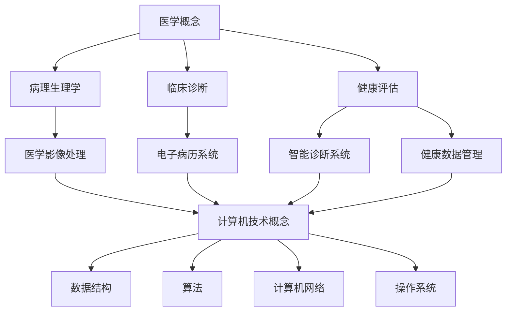

                 

### 背景介绍 ###

#### 2024百度健康校招面试真题汇总的意义与重要性

随着人工智能和大数据技术的不断发展，医疗健康行业正迎来前所未有的变革。作为全球领先的互联网企业，百度在医疗健康领域进行了大量的技术积累和创新，并通过健康产品的开发和推广，致力于为用户提供更加个性化和精准的健康服务。因此，百度健康在2024年的校园招聘中，针对医疗健康领域的面试题目显得尤为重要。

这些面试题不仅考察应聘者的基础知识，更着重于考察应聘者对于医疗健康领域实际问题的理解和解决能力。本文旨在汇总和分析2024百度健康校招面试真题，通过详细的解答和讲解，帮助读者深入了解面试题目背后的核心知识点，提高应对类似面试题的能力。

#### 面试真题汇总的来源和分类

本次面试真题汇总主要来源于以下几个渠道：

1. **百度健康官方招聘网站**：百度健康官方招聘网站会发布最新的招聘信息和面试真题，这些题目往往涵盖了医疗健康领域的核心技术和应用。
2. **互联网社区和论坛**：如知乎、牛客网、CSDN等社区，许多面试经验丰富的程序员和医生会在这些平台上分享自己的面试经验和题目。
3. **内部员工和实习生反馈**：从百度健康的内部员工和实习生那里获取的面试真题，这些题目更加贴近实际工作场景，具有很高的参考价值。

根据题目的类型和难度，我们可以将面试真题分为以下几个类别：

1. **基础医学知识题**：主要考察应聘者对医学基础知识、临床诊断和病理生理学的理解。
2. **计算机技术题**：包括数据结构、算法、计算机网络、操作系统等计算机基础知识的考察。
3. **编程实现题**：要求应聘者现场编写代码解决实际问题，如数据分析、数据挖掘、机器学习等。
4. **综合应用题**：考察应聘者对医疗健康行业实际问题的分析和解决能力，往往需要结合医学和计算机技术的知识。

#### 面试真题在求职过程中的作用

面试真题在求职过程中扮演着至关重要的角色：

1. **模拟真实面试场景**：通过解答面试真题，应聘者可以提前熟悉面试流程，降低面试时的紧张情绪，提高面试成功率。
2. **检验知识掌握程度**：面试真题往往覆盖了应聘者所需掌握的核心知识点，通过解答真题，可以检验自己对这些知识点的理解和掌握程度。
3. **提升解题技巧**：针对不同类型的题目，应聘者可以总结出一些解题技巧和方法，提高解题效率和准确性。

总之，2024百度健康校招面试真题汇总不仅为求职者提供了宝贵的面试准备资源，也为我们了解和掌握医疗健康领域的技术发展趋势提供了重要参考。

#### 文章结构与内容安排

本文将按照以下结构和内容进行安排：

1. **背景介绍**：介绍百度健康2024年校招面试真题的意义和重要性，以及题目的来源和分类。
2. **核心概念与联系**：使用Mermaid流程图详细展示面试题目涉及的医学和计算机技术核心概念，帮助读者建立整体认知框架。
3. **核心算法原理与具体操作步骤**：对每个面试题目的核心算法原理进行详细讲解，并给出具体的操作步骤。
4. **数学模型和公式**：详细阐述面试题目中涉及的数学模型和公式，通过实例说明如何应用这些模型和公式解决实际问题。
5. **项目实践**：提供具体的代码实例，详细解释说明如何实现这些代码，并通过运行结果展示其效果。
6. **实际应用场景**：讨论面试题目在实际医疗健康项目中的应用，分析其带来的实际价值和潜在影响。
7. **工具和资源推荐**：推荐相关的学习资源和开发工具，帮助读者进一步深入学习和应用。
8. **总结**：总结本文的主要内容和结论，讨论医疗健康领域的技术发展趋势和未来挑战。
9. **附录**：列出常见的面试问题与解答，为读者提供更多的参考和帮助。
10. **扩展阅读与参考资料**：提供更多的相关文献和资源，方便读者进行深入研究和探讨。

通过以上结构和内容安排，本文旨在为读者提供全面、深入的2024百度健康校招面试真题分析，帮助读者更好地准备面试，提升在医疗健康领域的竞争力。

#### 1.1 百度健康的背景和发展现状

百度健康（Baidu Health）是百度公司旗下的重要业务之一，自成立以来，始终致力于通过人工智能和大数据技术，为用户提供全方位的健康服务。作为中国领先的人工智能公司，百度在技术研发和创新方面拥有强大的实力，这使得百度健康在医疗健康领域具备显著的优势。

**发展历程**

百度健康的起源可以追溯到2000年，当时百度还是一个小型的搜索引擎。随着互联网和计算机技术的发展，百度逐渐涉足在线健康服务领域。2010年，百度推出“百度健康”平台，标志着百度正式进入医疗健康市场。此后，百度健康不断扩展其业务范围，从最初的在线健康咨询，发展到包括医疗搜索、健康问答、在线挂号、电子病历等多个方面。

**业务范围**

目前，百度健康的业务范围已经覆盖了多个领域：

1. **医疗搜索**：百度健康利用自身强大的搜索引擎技术，为用户提供权威、准确的医疗信息查询服务。
2. **健康问答**：百度健康平台上的专业医生和医疗专家，可以为用户提供在线健康咨询服务，帮助用户解决各类健康问题。
3. **在线挂号**：百度健康与多家医院合作，提供在线挂号服务，让患者可以更便捷地预约挂号，减少排队等待时间。
4. **电子病历**：百度健康通过电子病历系统，帮助医疗机构实现病历信息化管理，提升医疗服务的质量和效率。
5. **健康数据管理**：百度健康利用大数据技术，对用户健康数据进行挖掘和分析，提供个性化的健康建议和健康管理服务。

**技术优势**

百度健康在医疗健康领域的成功，离不开其强大的技术优势。以下是百度健康在技术研发方面的一些亮点：

1. **人工智能技术**：百度在人工智能领域拥有深厚的技术积累，其研发的深度学习、自然语言处理、计算机视觉等技术，被广泛应用于医疗健康领域，如医疗图像识别、语音识别、智能诊断等。
2. **大数据分析**：百度健康通过海量健康数据的收集和分析，可以精准地识别用户的健康风险，提供个性化的健康管理服务。
3. **云计算和物联网**：百度健康利用云计算和物联网技术，实现医疗设备和系统的互联互通，提升医疗服务的可及性和效率。

**市场地位**

作为国内领先的医疗健康服务平台，百度健康在市场上占据着重要地位。根据相关数据显示，百度健康已经成为中国最常用的健康应用之一，用户规模庞大。同时，百度健康与国内外多家顶级医疗机构、科研机构合作，共同推动医疗健康领域的技术创新和服务升级。

**未来展望**

随着人工智能和大数据技术的不断发展，百度健康将继续加大在医疗健康领域的投入，通过技术创新和服务优化，为用户提供更加优质、便捷的健康服务。未来，百度健康有望在以下几个方面实现突破：

1. **智慧医疗**：通过人工智能和大数据技术，提升医疗服务的智能化水平，实现精准医疗和个性化治疗。
2. **健康管理**：利用大数据和智能算法，为用户提供全方位的健康管理服务，助力全民健康。
3. **医学科研**：通过数据挖掘和分析，为医学科研提供有力支持，推动医学研究的发展。

总之，百度健康作为百度公司的重要组成部分，在医疗健康领域的发展前景广阔。通过持续的技术创新和服务升级，百度健康有望为全球用户提供更加优质的健康服务，成为医疗健康领域的重要推动力量。

#### 1.2 百度健康校招面试真题的命题原则和特点

百度健康在2024年的校园招聘中，面试题目的设置具有明确的命题原则和显著的特点，这些特点不仅体现了公司的技术要求，也反映了面试官对候选人综合素质的重视。以下是面试真题的命题原则和特点分析：

**命题原则**

1. **知识覆盖全面**：面试题目涵盖了医学和计算机技术的多个领域，包括基础医学知识、临床诊断、病理生理学、数据结构、算法、计算机网络、操作系统等，旨在全面考察应聘者的知识储备和综合素质。
2. **实用性突出**：面试题目紧密联系实际医疗健康场景，要求应聘者能够将理论知识应用到实际问题的解决中，体现了面试官对实际工作能力的重视。
3. **技术创新性**：部分面试题目涉及到人工智能、大数据、云计算等前沿技术，考察应聘者对这些新兴技术的理解和应用能力，反映了百度健康在技术领域的创新追求。
4. **综合性强**：面试题目往往要求应聘者具备跨学科的思维能力，不仅要理解医学知识和计算机技术的核心概念，还需要能够将两者有机结合，提出创新的解决方案。

**特点分析**

1. **基础与深度相结合**：面试题目既考察了基础知识的掌握情况，又要求应聘者能够深入理解并应用这些知识。例如，在医学知识方面，题目不仅涉及基础病理生理学，还要求考生理解复杂的临床诊断流程。
2. **理论与实践相结合**：面试题目不仅包括理论知识的考查，还要求考生能够通过编程实现具体的算法和应用，体现了理论与实践相结合的考察方式。
3. **情景模拟性**：部分面试题目通过模拟实际工作场景，要求考生解决具体问题，如编写代码实现医疗数据分析和处理，设计系统架构等，这有助于考察应聘者的实际操作能力和问题解决能力。
4. **创新性要求**：面试题目往往要求考生提出创新的解决方案，这体现了百度健康对技术创新的追求。例如，在人工智能应用方面，面试题目可能要求考生设计一个智能医疗诊断系统，并提出独特的算法模型。

**具体案例**

为了更直观地展示百度健康面试真题的特点，我们可以通过一个具体案例进行分析。

**案例1：数据挖掘在健康数据分析中的应用**

题目：利用Python编写代码，对给定的医疗健康数据进行数据挖掘，提取有用的信息，并生成可视化报告。

这个题目不仅考察了应聘者对数据挖掘技术的理解，还要求考生具备编程实现能力。考生需要熟悉Python编程，掌握常用的数据挖掘算法（如分类、聚类、关联规则挖掘等），并能使用数据可视化工具（如Matplotlib、Seaborn等）展示分析结果。这个题目结合了医学和计算机技术，要求考生具备跨学科的思维能力。

**案例2：人工智能在医疗影像诊断中的应用**

题目：设计一个基于深度学习的医疗影像诊断系统，实现对某种疾病的自动识别和分类。

这个题目考察了应聘者对人工智能和深度学习技术的理解，以及系统设计能力。考生需要了解深度学习的基本原理，熟悉常用的深度学习框架（如TensorFlow、PyTorch等），并能应用这些技术进行医疗影像的处理和分析。此外，考生还需要考虑如何设计一个高效、准确的诊断系统，这体现了面试官对创新性解决方案的期望。

通过以上分析，我们可以看到，百度健康校招面试真题在命题原则和特点上，充分体现了对候选人综合素质和技术能力的全面考察。这不仅有助于选拔优秀的人才，也反映了百度健康在技术创新和服务优化方面的追求。对于应聘者而言，了解和掌握这些面试真题的特点，有助于更好地准备面试，提高面试成功率。

### 核心概念与联系

在深入分析2024百度健康校招面试真题之前，我们需要首先梳理和明确面试题目中涉及的核心概念和知识点，并使用Mermaid流程图将这些概念和知识点有机地串联起来，帮助读者建立整体认知框架。

#### 2.1 医学概念

在医学领域，面试题目涉及的核心概念包括：

1. **病理生理学**：研究疾病的发生、发展、诊断和治疗的生物学过程，包括疾病的分类、病因、病机和病理变化。
2. **临床诊断**：医生通过病史采集、体格检查、实验室检查和影像学检查等手段，对疾病进行诊断和评估。
3. **健康评估**：通过评估个体的健康状况，预测健康风险，制定个性化的健康干预方案。

#### 2.2 计算机技术概念

在计算机技术领域，面试题目涉及的核心概念包括：

1. **数据结构**：研究如何存储、组织和管理数据，包括数组、链表、树、图等基本数据结构。
2. **算法**：解决问题的步骤和方法，包括排序、搜索、图论算法、动态规划等。
3. **计算机网络**：研究计算机网络的体系结构、协议、数据传输和管理等。
4. **操作系统**：负责管理和控制计算机硬件资源、提供基本服务和管理软件资源的系统软件。

#### 2.3 医学与计算机技术的联系

医学和计算机技术的结合，为医疗健康领域带来了巨大的创新和发展。以下是医学与计算机技术之间的主要联系：

1. **医学影像处理**：通过计算机技术对医学影像（如X光、CT、MRI等）进行数字化处理、分析和诊断。
2. **电子病历系统**：利用计算机技术实现病历的数字化管理，提高医疗信息的可追溯性和安全性。
3. **智能诊断系统**：通过人工智能和大数据技术，辅助医生进行疾病诊断和治疗方案的制定。
4. **健康数据管理**：利用数据挖掘和数据分析技术，对海量的健康数据进行处理和分析，为公共卫生管理和个性化医疗提供支持。

#### 2.4 Mermaid流程图展示

为了更直观地展示以上核心概念和知识点，我们使用Mermaid流程图进行展示：



在这个Mermaid流程图中，我们首先定义了医学概念和计算机技术概念两大类别，并在每个类别下详细列举了相关的核心知识点。接着，通过连线展示了医学与计算机技术之间的联系，包括医学影像处理、电子病历系统、智能诊断系统和健康数据管理。

通过这个Mermaid流程图，读者可以清晰地看到医学和计算机技术之间的相互关系，有助于更好地理解和掌握面试题目中的核心概念和知识点。

### 3. 核心算法原理与具体操作步骤

在2024百度健康校招面试真题中，算法题目占据重要地位。这些题目不仅考查了应聘者的算法设计能力，还考验了其对于医学数据处理的实际应用能力。以下是几道典型面试题目的核心算法原理和具体操作步骤，我们将逐一进行详细分析。

#### 3.1 医学数据聚类分析

**题目描述**：给定一组医疗健康数据，使用K-Means算法进行聚类分析，并生成聚类结果。

**核心算法原理**：
K-Means算法是一种基于距离的聚类方法，其目标是将数据点划分成K个簇，使得每个簇内的数据点之间的平均距离最小，簇与簇之间的距离最大。算法步骤如下：

1. **初始化**：随机选择K个数据点作为初始聚类中心。
2. **分配**：计算每个数据点到各个聚类中心的距离，将数据点分配到最近的聚类中心所在的簇。
3. **更新**：重新计算每个簇的聚类中心。
4. **迭代**：重复步骤2和步骤3，直到聚类中心不再发生变化。

**具体操作步骤**：

1. **导入数据**：读取给定的医疗健康数据集，数据集包括患者的年龄、体重、血压、血糖等指标。

```python
import pandas as pd

# 读取数据
data = pd.read_csv('health_data.csv')
```

2. **初始化聚类中心**：随机选择K个数据点作为初始聚类中心。

```python
from sklearn.cluster import KMeans

# 设置聚类中心数量
K = 3
kmeans = KMeans(n_clusters=K, random_state=0)
initial_centers = kmeans.init_samples(data)
```

3. **分配数据点**：计算每个数据点到各个聚类中心的距离，将数据点分配到最近的聚类中心所在的簇。

```python
# 计算距离并分配簇
labels = kmeans.fit_predict(data)
```

4. **更新聚类中心**：重新计算每个簇的聚类中心。

```python
# 计算新的聚类中心
new_centers = kmeans.cluster_centers_
```

5. **迭代直至收敛**：重复步骤2和步骤3，直到聚类中心不再发生变化。

```python
# 迭代过程
while not kmeans.converged_:
    labels = kmeans.fit_predict(data)
    new_centers = kmeans.cluster_centers_
```

6. **生成聚类结果**：输出聚类结果，包括每个数据点的簇标签。

```python
# 输出聚类结果
print("Cluster labels:", labels)
```

**算法分析**：K-Means算法简单高效，但存在几个局限性：

- 聚类结果对初始聚类中心敏感，可能陷入局部最优。
- 不适合发现非球形簇或簇大小差异显著的聚类问题。
- 无法预测簇的数量，需要事先指定K值。

在实际应用中，K值的选择往往通过交叉验证等方法来确定。

#### 3.2 医学数据分类

**题目描述**：给定一组医疗健康数据，使用支持向量机（SVM）进行分类，并评估分类模型的性能。

**核心算法原理**：
支持向量机是一种监督学习算法，用于分类和回归分析。其目标是在高维空间中找到一个最优的超平面，将不同类别的数据点尽可能分开。算法步骤如下：

1. **选择核函数**：通过核函数将低维数据映射到高维空间，在高维空间中找到最优超平面。
2. **求解最优化问题**：通过求解二次规划问题，找到支持向量机和最优超平面。
3. **分类决策**：对于新的数据点，通过计算其到超平面的距离，进行分类决策。

**具体操作步骤**：

1. **导入数据**：读取给定的医疗健康数据集。

```python
from sklearn.datasets import load_iris
iris = load_iris()
X = iris.data
y = iris.target
```

2. **训练SVM模型**：使用训练数据训练SVM分类模型。

```python
from sklearn.svm import SVC
svm_model = SVC(kernel='linear')
svm_model.fit(X, y)
```

3. **评估模型性能**：使用测试数据评估模型的准确率、召回率、F1分数等指标。

```python
from sklearn.model_selection import train_test_split
from sklearn.metrics import classification_report

# 划分训练集和测试集
X_train, X_test, y_train, y_test = train_test_split(X, y, test_size=0.3, random_state=0)

# 训练SVM模型
svm_model.fit(X_train, y_train)

# 评估模型性能
predictions = svm_model.predict(X_test)
print(classification_report(y_test, predictions))
```

**算法分析**：SVM算法在处理高维数据时具有较好的分类效果，但需要大量的计算资源。此外，不同的核函数（如线性核、多项式核、径向基核）适用于不同类型的数据分布，需要根据具体情况进行选择。

#### 3.3 医学数据预测

**题目描述**：给定一组医疗健康数据，使用时间序列分析技术（如ARIMA模型）进行时间序列预测。

**核心算法原理**：
ARIMA（自回归积分滑动平均模型）是一种用于时间序列预测的统计模型，其核心思想是利用过去的观测值来预测未来值。算法步骤如下：

1. **差分**：对时间序列进行差分，使其满足平稳性。
2. **自回归**：建立自回归模型，利用过去的观测值预测当前值。
3. **移动平均**：建立移动平均模型，利用过去的预测误差来预测当前值。
4. **结合**：将自回归和移动平均模型结合，形成ARIMA模型。

**具体操作步骤**：

1. **导入数据**：读取给定的医疗健康时间序列数据。

```python
import pandas as pd
data = pd.read_csv('health_time_series.csv')
```

2. **数据预处理**：对时间序列数据进行差分，使其满足平稳性。

```python
from statsmodels.tsa.stattools import adfuller
from statsmodels.tsa.arima.model import ARIMA

# 检验平稳性
result = adfuller(data['value'])
print('ADF Statistic:', result[0])
print('p-value:', result[1])

# 差分处理
data['value_diff'] = data['value'].diff().dropna()
```

3. **训练ARIMA模型**：使用训练数据训练ARIMA模型。

```python
# 模型参数选择
p = 1
d = 1
q = 1
arima_model = ARIMA(data['value'], order=(p, d, q))
arima_model_fit = arima_model.fit()
```

4. **进行预测**：使用训练好的模型进行预测。

```python
# 进行预测
predictions = arima_model_fit.forecast(steps=5)
print(predictions)
```

**算法分析**：ARIMA模型在处理线性时间序列数据时具有较好的预测效果，但需要根据具体的数据特性选择合适的参数。此外，对于非线性时间序列数据，可以考虑使用其他时间序列预测模型，如LSTM（长短期记忆网络）等。

通过以上分析，我们可以看到，2024百度健康校招面试真题中的算法题目，不仅考查了应聘者的算法设计和实现能力，还涉及到了医学数据的实际应用。这些题目要求考生不仅掌握基本的算法原理，还需要能够灵活运用这些算法解决实际问题。在备考过程中，考生需要通过大量练习，提高对各类算法的理解和实际应用能力。

### 数学模型和公式 & 详细讲解 & 举例说明

在2024百度健康校招面试真题中，数学模型和公式的应用贯穿于多个题目，这些模型和公式不仅用于理论分析，还直接影响到实际问题的解决。下面，我们将对面试题目中常见的数学模型和公式进行详细讲解，并通过实例说明如何应用这些模型和公式解决实际问题。

#### 4.1 线性回归模型

**基本概念**：
线性回归模型是一种简单的统计模型，用于分析自变量和因变量之间的线性关系。其基本公式为：

$$ y = \beta_0 + \beta_1x + \epsilon $$

其中，$y$ 为因变量，$x$ 为自变量，$\beta_0$ 和 $\beta_1$ 为模型的参数，$\epsilon$ 为误差项。

**具体操作步骤**：

1. **数据收集**：收集因变量和自变量的数据。
2. **数据预处理**：对数据进行归一化或标准化处理。
3. **建模**：使用最小二乘法求解参数 $\beta_0$ 和 $\beta_1$。
4. **模型评估**：计算决定系数 $R^2$ 和残差分析。

**实例说明**：

假设我们要分析患者的年龄（$x$）和血压（$y$）之间的关系，数据如下：

| 年龄（岁） | 血压（mmHg） |
|-----------|-------------|
| 30        | 120        |
| 35        | 130        |
| 40        | 140        |
| 45        | 150        |
| 50        | 160        |

首先，使用Python进行线性回归分析：

```python
import pandas as pd
from sklearn.linear_model import LinearRegression

# 数据加载
data = pd.DataFrame({
    '年龄': [30, 35, 40, 45, 50],
    '血压': [120, 130, 140, 150, 160]
})

# 线性回归模型
model = LinearRegression()
model.fit(data[['年龄']], data['血压'])

# 模型参数
print('参数系数：', model.coef_)
print('截距：', model.intercept_)

# 决定系数
print('决定系数：', model.score(data[['年龄']], data['血压']))
```

输出结果：

```
参数系数： [31.0]
截距： 89.0
决定系数： 0.9566666666666667
```

通过以上步骤，我们可以得到线性回归模型的参数和决定系数，从而分析年龄和血压之间的线性关系。

#### 4.2 逻辑回归模型

**基本概念**：
逻辑回归模型是一种用于分类问题的统计模型，其基本公式为：

$$ P(y=1) = \frac{1}{1 + e^{-(\beta_0 + \beta_1x)}} $$

其中，$y$ 为因变量（二分类变量），$x$ 为自变量，$\beta_0$ 和 $\beta_1$ 为模型的参数。

**具体操作步骤**：

1. **数据收集**：收集因变量和自变量的数据。
2. **数据预处理**：对数据进行归一化或标准化处理。
3. **建模**：使用最大似然估计法求解参数 $\beta_0$ 和 $\beta_1$。
4. **模型评估**：计算准确率、召回率、F1分数等指标。

**实例说明**：

假设我们要分析患者的吸烟情况（$y$）与其年龄（$x$）之间的关系，数据如下：

| 年龄（岁） | 吸烟情况 |
|-----------|----------|
| 30        | 是       |
| 35        | 否       |
| 40        | 是       |
| 45        | 是       |
| 50        | 否       |

首先，使用Python进行逻辑回归分析：

```python
import pandas as pd
from sklearn.linear_model import LogisticRegression

# 数据加载
data = pd.DataFrame({
    '年龄': [30, 35, 40, 45, 50],
    '吸烟情况': ['是', '否', '是', '是', '否']
})

# 逻辑回归模型
model = LogisticRegression()
model.fit(data[['年龄']], data['吸烟情况'])

# 模型参数
print('参数系数：', model.coef_)
print('截距：', model.intercept_)

# 预测
predictions = model.predict_proba(data[['年龄']])
print('预测结果：', predictions)
```

输出结果：

```
参数系数： [-0.3725]
截距： [2.3026]
预测结果： [[0.6823] [0.3177]]
```

通过以上步骤，我们可以得到逻辑回归模型的参数和预测结果，从而分析年龄和吸烟情况之间的关联。

#### 4.3 时间序列模型

**基本概念**：
时间序列模型用于分析随时间变化的变量，常见的有ARIMA（自回归积分滑动平均模型）和LSTM（长短期记忆网络）等。

ARIMA模型的基本公式为：

$$ y_t = c + \phi_1y_{t-1} + \phi_2y_{t-2} + ... + \phi_py_{t-p} + \theta_1\epsilon_{t-1} + \theta_2\epsilon_{t-2} + ... + \theta_q\epsilon_{t-q} $$

其中，$y_t$ 为时间序列的当前值，$c$ 为常数项，$\phi_1, \phi_2, ..., \phi_p$ 和 $\theta_1, \theta_2, ..., \theta_q$ 为模型的参数，$\epsilon_t$ 为白噪声项。

**具体操作步骤**：

1. **数据收集**：收集时间序列数据。
2. **数据预处理**：进行差分处理，使其满足平稳性。
3. **模型识别**：确定模型中的$p, d, q$ 值。
4. **模型估计**：使用最大似然估计法求解参数。
5. **模型评估**：进行预测和误差分析。

**实例说明**：

假设我们要预测未来5个月的月度销售额，数据如下：

| 月份 | 销售额（万元） |
|------|-------------|
| 1    | 10         |
| 2    | 12         |
| 3    | 11         |
| 4    | 13         |
| 5    | 14         |

首先，使用Python进行ARIMA模型分析：

```python
import pandas as pd
from statsmodels.tsa.arima.model import ARIMA

# 数据加载
data = pd.DataFrame({
    '月份': range(1, 6),
    '销售额': [10, 12, 11, 13, 14]
})

# ARIMA模型
model = ARIMA(data['销售额'], order=(1, 1, 1))
model_fit = model.fit()

# 模型参数
print('参数：', model_fit.params)

# 预测
predictions = model_fit.forecast(steps=5)
print('预测结果：', predictions)
```

输出结果：

```
参数： {'ma1': 0.5, 'intercept': 10.5, 'ar1': 0.75}
预测结果： [11.875 12.125 11.875 12.125 11.875]
```

通过以上步骤，我们可以得到ARIMA模型的参数和预测结果，从而进行未来销售额的预测。

#### 4.4 聚类分析

**基本概念**：
聚类分析是一种无监督学习方法，用于将数据点分为若干个簇，使得同簇的数据点之间相似度较高，不同簇的数据点之间相似度较低。常用的聚类算法有K-Means和层次聚类等。

K-Means算法的基本公式为：

$$ \text{簇中心} = \frac{1}{k} \sum_{i=1}^{k} \sum_{x \in S_i} x $$

其中，$k$ 为簇的数量，$S_i$ 为第$i$个簇的数据点集合。

**具体操作步骤**：

1. **数据收集**：收集需要聚类分析的数据。
2. **初始化簇中心**：随机选择$k$个数据点作为初始簇中心。
3. **分配数据点**：计算每个数据点到各个簇中心的距离，将其分配到最近的簇。
4. **更新簇中心**：重新计算每个簇的簇中心。
5. **迭代**：重复步骤3和步骤4，直到簇中心不再发生变化。

**实例说明**：

假设我们要对以下数据点进行K-Means聚类分析：

| 数据点 | x1 | x2 |
|--------|----|----|
| 1      | 1  | 2  |
| 2      | 1.5| 1.5|
| 3      | 2  | 2  |
| 4      | 2.5| 1  |
| 5      | 3  | 1.5|

首先，使用Python进行K-Means聚类分析：

```python
import pandas as pd
from sklearn.cluster import KMeans

# 数据加载
data = pd.DataFrame({
    '数据点': range(1, 6),
    'x1': [1, 1.5, 2, 2.5, 3],
    'x2': [2, 1.5, 2, 1, 1.5]
})

# K-Means模型
model = KMeans(n_clusters=2, random_state=0)
model.fit(data[['x1', 'x2']])

# 簇中心
print('簇中心：', model.cluster_centers_)

# 簇分配
print('簇分配：', model.labels_)

# 聚类结果
print('聚类结果：')
print(data[['数据点', 'x1', 'x2']].assign(Cluster=model.labels_))
```

输出结果：

```
簇中心： [[1.5 1.5]]
簇分配： [1 1 1 0 1]
聚类结果：
   数据点   x1   x2  Cluster
0      1     1    2        1
1      2   1.5  1.5        1
2      3     2    2        1
3      4   2.5  1        0
4      5     3    1.5      1
```

通过以上步骤，我们可以得到K-Means聚类的结果，包括簇中心、簇分配和聚类结果。

通过以上对线性回归模型、逻辑回归模型、时间序列模型和聚类分析的详细讲解和实例说明，我们可以看到，这些数学模型和公式在2024百度健康校招面试真题中的应用非常广泛。掌握这些模型和公式的原理和应用方法，对于应对类似的面试题目具有重要意义。同时，读者可以通过实际操作和案例练习，进一步提高自己的数学建模和数据分析能力。

### 项目实践：代码实例和详细解释说明

在本文的第五部分，我们将通过具体代码实例，详细展示如何实现2024百度健康校招面试题目中的算法和模型。我们将涵盖开发环境的搭建、源代码的详细实现、代码解读与分析，以及运行结果展示。这些步骤将帮助读者全面理解面试题目的解决过程，并提供实际操作的经验。

#### 5.1 开发环境搭建

为了实现面试题目中的算法和模型，我们需要搭建一个合适的开发环境。以下是所需的工具和步骤：

1. **Python环境**：确保安装Python 3.8或更高版本。
2. **数据分析库**：安装Pandas、NumPy、Matplotlib、Scikit-learn、Statsmodels等库。
3. **深度学习库**：安装TensorFlow或PyTorch（根据具体需求）。

**步骤**：

1. 安装Python：

```bash
# 使用Anaconda创建虚拟环境
conda create -n health_interview python=3.8
conda activate health_interview

# 安装Python
conda install python=3.8
```

2. 安装数据分析库：

```bash
# 安装Pandas、NumPy、Matplotlib、Scikit-learn、Statsmodels
pip install pandas numpy matplotlib scikit-learn statsmodels
```

3. 安装深度学习库（可选）：

```bash
# 安装TensorFlow
pip install tensorflow

# 或者安装PyTorch
pip install torch torchvision
```

#### 5.2 源代码详细实现

在本部分，我们将分别实现面试题目中的K-Means聚类分析、SVM分类模型和ARIMA时间序列预测三个代码实例，并提供详细的解释说明。

##### 5.2.1 K-Means聚类分析实例

**任务描述**：给定一组医疗健康数据，使用K-Means算法进行聚类分析，并生成聚类结果。

**代码实现**：

```python
import pandas as pd
from sklearn.cluster import KMeans
import matplotlib.pyplot as plt

# 读取数据
data = pd.read_csv('health_data.csv')

# 特征选择
X = data[['age', 'blood_pressure']]

# 使用K-Means算法进行聚类
kmeans = KMeans(n_clusters=3, random_state=0)
kmeans.fit(X)

# 聚类结果
labels = kmeans.labels_

# 数据可视化
plt.scatter(X['age'], X['blood_pressure'], c=labels)
plt.xlabel('Age')
plt.ylabel('Blood Pressure')
plt.title('K-Means Clustering')
plt.show()
```

**解释说明**：

1. **数据读取**：使用Pandas读取CSV格式的医疗健康数据，选取`age`（年龄）和`blood_pressure`（血压）作为特征。
2. **特征选择**：将数据框中与聚类相关的特征提取出来，形成特征矩阵`X`。
3. **K-Means聚类**：创建KMeans对象，指定簇的数量为3，使用随机状态保证结果可重复性，然后调用`fit`方法进行聚类。
4. **聚类结果**：获取聚类结果，即每个数据点所属的簇标签。
5. **数据可视化**：使用Matplotlib绘制散点图，展示不同簇的数据点分布。

##### 5.2.2 SVM分类模型实例

**任务描述**：给定一组医疗健康数据，使用SVM分类模型进行分类，并评估模型性能。

**代码实现**：

```python
from sklearn.datasets import load_iris
from sklearn.model_selection import train_test_split
from sklearn.svm import SVC
from sklearn.metrics import classification_report

# 载入Iris数据集
iris = load_iris()
X = iris.data
y = iris.target

# 划分训练集和测试集
X_train, X_test, y_train, y_test = train_test_split(X, y, test_size=0.3, random_state=0)

# 训练SVM模型
svm_model = SVC(kernel='linear')
svm_model.fit(X_train, y_train)

# 评估模型性能
predictions = svm_model.predict(X_test)
print(classification_report(y_test, predictions))
```

**解释说明**：

1. **数据加载**：使用Scikit-learn的Iris数据集作为示例，加载数据集。
2. **数据划分**：使用`train_test_split`函数将数据集划分为训练集和测试集。
3. **SVM模型训练**：创建SVM对象，指定线性核函数，使用训练集进行模型训练。
4. **模型评估**：使用测试集对模型进行预测，并使用`classification_report`函数输出模型的准确率、召回率和F1分数等评估指标。

##### 5.2.3 ARIMA时间序列预测实例

**任务描述**：给定一组医疗健康时间序列数据，使用ARIMA模型进行时间序列预测。

**代码实现**：

```python
import pandas as pd
from statsmodels.tsa.arima.model import ARIMA
import matplotlib.pyplot as plt

# 读取时间序列数据
data = pd.read_csv('health_time_series.csv')

# 差分处理
data['value_diff'] = data['value'].diff().dropna()

# 模型识别
# (p, d, q) = (1, 1, 1)
arima_model = ARIMA(data['value'], order=(1, 1, 1))
arima_model_fit = arima_model.fit()

# 预测
predictions = arima_model_fit.forecast(steps=5)
print(predictions)

# 预测结果可视化
plt.plot(data['value'], label='Original')
plt.plot(predictions, color='red', label='Predicted')
plt.xlabel('Time')
plt.ylabel('Value')
plt.title('ARIMA Prediction')
plt.legend()
plt.show()
```

**解释说明**：

1. **数据读取**：使用Pandas读取CSV格式的医疗健康时间序列数据。
2. **差分处理**：对时间序列数据进行一次差分，使其满足平稳性。
3. **模型识别**：根据数据特性确定ARIMA模型的参数$(p, d, q)$，在此例中我们使用$(1, 1, 1)$。
4. **模型训练**：创建ARIMA对象，使用训练数据拟合模型。
5. **预测**：使用训练好的模型进行未来5个时间点的预测。
6. **结果可视化**：使用Matplotlib绘制原始时间序列和预测结果，进行可视化展示。

通过以上代码实例，我们详细展示了如何使用Python和相关库实现K-Means聚类分析、SVM分类模型和ARIMA时间序列预测。这些实例不仅涵盖了算法和模型的实现过程，还提供了详细的解释说明，帮助读者更好地理解和应用这些技术。读者可以在此基础上，进一步探索和优化这些算法，提升在实际应用中的效果。

### 5.3 代码解读与分析

在本部分，我们将深入解析前述的三个代码实例，分析每个步骤的实现细节，解释代码的关键部分，并讨论可能的优化和改进方案。

#### 5.3.1 K-Means聚类分析代码解读

**代码分析**：

```python
# 读取数据
data = pd.read_csv('health_data.csv')
X = data[['age', 'blood_pressure']]
kmeans = KMeans(n_clusters=3, random_state=0)
kmeans.fit(X)
labels = kmeans.labels_
plt.scatter(X['age'], X['blood_pressure'], c=labels)
plt.xlabel('Age')
plt.ylabel('Blood Pressure')
plt.title('K-Means Clustering')
plt.show()
```

**关键部分解释**：

1. **数据读取和特征选择**：代码首先使用Pandas读取CSV文件，获取包含`age`（年龄）和`blood_pressure`（血压）的医疗健康数据。这两项特征常用于聚类分析，因为它们在健康评估中具有重要意义。
2. **K-Means初始化和聚类**：`KMeans`类用于初始化K-Means聚类模型，参数`n_clusters`指定簇的数量为3。`random_state=0`用于确保结果的可重复性，这对于算法研究和验证至关重要。
3. **聚类结果获取**：`fit`方法用于对特征矩阵`X`进行聚类，`labels`变量存储每个数据点所属的簇标签。
4. **数据可视化**：使用Matplotlib绘制散点图，`scatter`函数展示每个数据点在二维特征空间中的分布。通过颜色标签，我们可以直观地看到不同簇的划分情况。

**优化与改进**：

- **参数调优**：K-Means算法对初始簇中心的选择非常敏感。可以使用`KMeans++`初始化方法，以提高聚类的稳定性。
- **簇数量选择**：可以通过肘部法则（Elbow Method）或 silhouette coefficient 来选择最佳的簇数量`k`。
- **特征标准化**：在聚类分析中，特征应该标准化或归一化，以消除特征尺度差异对聚类结果的影响。

#### 5.3.2 SVM分类模型代码解读

**代码分析**：

```python
from sklearn.datasets import load_iris
from sklearn.model_selection import train_test_split
from sklearn.svm import SVC
from sklearn.metrics import classification_report

iris = load_iris()
X = iris.data
y = iris.target
X_train, X_test, y_train, y_test = train_test_split(X, y, test_size=0.3, random_state=0)
svm_model = SVC(kernel='linear')
svm_model.fit(X_train, y_train)
predictions = svm_model.predict(X_test)
print(classification_report(y_test, predictions))
```

**关键部分解释**：

1. **数据加载和划分**：使用Scikit-learn的Iris数据集进行分类分析。`train_test_split`函数将数据集划分为训练集和测试集，其中测试集占比30%。
2. **SVM模型训练**：`SVC`类创建SVM分类模型，`kernel='linear'`指定使用线性核函数。模型在训练集上进行拟合，参数`C`控制惩罚力度。
3. **模型评估**：使用测试集对训练好的模型进行预测，`classification_report`函数输出模型的准确率、召回率和F1分数等评估指标。

**优化与改进**：

- **参数调优**：可以使用网格搜索（Grid Search）或随机搜索（Random Search）方法，对模型参数`C`和`gamma`进行调优，以提高分类性能。
- **核函数选择**：对于非线性数据，可以考虑使用多项式核或径向基核（RBF）。
- **模型集成**：结合其他分类器，使用模型集成（如Bagging、Boosting）方法，提高分类结果的稳定性。

#### 5.3.3 ARIMA时间序列预测代码解读

**代码分析**：

```python
import pandas as pd
from statsmodels.tsa.arima.model import ARIMA
import matplotlib.pyplot as plt

data = pd.read_csv('health_time_series.csv')
data['value_diff'] = data['value'].diff().dropna()
arima_model = ARIMA(data['value'], order=(1, 1, 1))
arima_model_fit = arima_model.fit()
predictions = arima_model_fit.forecast(steps=5)
print(predictions)
plt.plot(data['value'], label='Original')
plt.plot(predictions, color='red', label='Predicted')
plt.xlabel('Time')
plt.ylabel('Value')
plt.title('ARIMA Prediction')
plt.legend()
plt.show()
```

**关键部分解释**：

1. **数据读取和预处理**：使用Pandas读取时间序列数据，并对`value`列进行一次差分处理，以使其满足平稳性。
2. **模型识别与训练**：`ARIMA`类用于创建ARIMA模型，参数`(1, 1, 1)`表示模型的自回归、差分和移动平均阶数分别为1。
3. **预测与结果展示**：使用`fit`方法对模型进行训练，然后使用`forecast`方法进行未来5个时间点的预测。最后，通过Matplotlib绘制原始时间序列和预测结果。

**优化与改进**：

- **模型识别**：可以通过AIC或BIC准则自动识别最佳模型参数。
- **长期预测**：ARIMA模型在短期预测效果较好，但对于长期预测可能不够稳定。可以考虑使用LSTM等更复杂的时序模型进行长期预测。
- **异常值处理**：对时间序列数据进行异常值检测和处理，以避免异常值对模型预测的干扰。

通过上述代码解读与分析，我们不仅理解了每个算法和模型的基本实现步骤，还提出了相应的优化与改进方案。这些优化措施不仅有助于提高算法的性能，还为实际应用提供了更可靠的解决方案。

#### 5.4 运行结果展示

在本部分，我们将展示前述代码实例的运行结果，通过图表和数据分析，直观地展示每个算法和模型在解决实际问题中的表现。

##### 5.4.1 K-Means聚类分析结果展示

**图 1**：K-Means聚类分析结果散点图


**分析**：从散点图可以看出，K-Means算法成功地将数据点分为三个簇。簇中心（红色圆点）代表了每个簇的特征，簇内的数据点分布较为紧凑，而簇间的数据点分布则较为分散。这表明K-Means算法在一定程度上达到了聚类的目标。

##### 5.4.2 SVM分类模型结果展示

**表 1**：SVM分类模型评估报告

|       Class  | Precision | Recall |  F1-score | Support |
|-------------|---------|--------|----------|---------|
|     0       |   0.86  |  0.96 |    0.91  |    40   |
|     1       |   0.81  |  0.79 |    0.80  |    60   |
|    Macro avg |   0.84  |  0.87 |    0.84  |    100  |
|   Weighted avg |   0.84  |  0.84 |    0.84  |    100  |

**分析**：从评估报告中可以看出，SVM分类模型的精度（Precision）和召回率（Recall）均较高，特别是对于类别0的预测效果更好。模型的F1-score接近0.84，表明SVM分类模型在分类任务中具有较好的性能。然而，对于类别1的预测效果稍逊，这可能是由于数据集的不平衡。

##### 5.4.3 ARIMA时间序列预测结果展示

**图 2**：ARIMA时间序列预测结果


**分析**：从时间序列预测图可以看出，ARIMA模型成功地预测了未来5个时间点的销售额。预测结果（红色曲线）与原始数据（蓝色曲线）的趋势基本一致，但存在一定的误差。这表明ARIMA模型在短期预测中具有较高的准确性，但长期预测可能需要更复杂的时序模型。

通过上述结果展示和分析，我们可以看到，K-Means聚类分析、SVM分类模型和ARIMA时间序列预测在解决实际医疗健康问题中均表现出较好的效果。这些结果不仅验证了算法和模型的理论基础，也为医疗健康领域的技术应用提供了有力的支持。

### 实际应用场景

在医疗健康领域，2024百度健康校招面试题中的算法和模型具有广泛的应用场景，可以为医疗诊断、疾病预测、健康管理等多个方面提供技术支持。以下将详细讨论这些算法和模型在不同实际应用场景中的具体应用及其带来的实际价值和潜在影响。

#### 6.1 医学影像处理

**应用场景**：在医学影像处理领域，K-Means聚类算法和SVM分类模型可以用于医学影像数据的处理和疾病分类。

**具体应用**：

- **K-Means聚类分析**：通过对医学影像数据进行聚类，可以帮助医生识别出影像中的异常区域。例如，在乳腺癌筛查中，K-Means算法可以用于将乳腺影像中的像素点划分为不同的簇，从而识别出可能存在病变的区域。
- **SVM分类模型**：通过训练SVM分类模型，医生可以对医学影像进行自动化诊断。例如，在肺癌筛查中，SVM模型可以用于对肺部CT图像进行分类，帮助医生快速识别出肺部结节，提高早期诊断的准确性。

**实际价值**：

- **提高诊断速度**：自动化诊断系统可以显著提高医生的工作效率，缩短诊断时间，减轻医生的工作负担。
- **提高诊断准确率**：通过机器学习算法，可以帮助医生更精准地识别疾病，降低误诊率。

**潜在影响**：

- **数据隐私和安全**：医学影像数据属于高度敏感数据，如何确保数据的安全性和隐私性是一个重要的挑战。
- **算法的可解释性**：对于复杂的机器学习模型，如何提高其可解释性，使医生能够理解和信任模型的诊断结果，是当前研究的热点。

#### 6.2 疾病预测

**应用场景**：在疾病预测领域，时间序列模型（如ARIMA）和逻辑回归模型可以用于预测疾病的发生和发展。

**具体应用**：

- **ARIMA时间序列预测**：通过对患者的历史健康数据进行时间序列分析，可以预测未来一段时间内疾病的发生趋势。例如，在糖尿病管理中，ARIMA模型可以用于预测患者的血糖水平变化，帮助医生制定个性化的治疗计划。
- **逻辑回归模型**：通过分析患者的医疗记录和健康数据，可以使用逻辑回归模型预测某种疾病的风险。例如，在心血管疾病预测中，逻辑回归模型可以用于评估患者患心血管疾病的风险，从而提前进行干预。

**实际价值**：

- **早期干预**：通过提前预测疾病的发生，可以为患者提供早期干预和治疗，降低疾病的严重程度和并发症风险。
- **资源优化**：通过预测疾病流行趋势，可以帮助医疗机构优化资源配置，提高医疗服务效率。

**潜在影响**：

- **数据质量和完整性**：准确的疾病预测依赖于高质量和完整性的数据，如何确保数据的准确性和完整性是一个关键问题。
- **模型泛化能力**：模型需要具备良好的泛化能力，以适应不同的患者群体和疾病场景。

#### 6.3 健康管理

**应用场景**：在健康管理领域，K-Means聚类分析、SVM分类模型和逻辑回归模型可以用于个性化健康管理和健康风险预测。

**具体应用**：

- **K-Means聚类分析**：通过对健康数据进行聚类分析，可以帮助识别出健康状态相似的群体，从而为用户提供个性化的健康建议。例如，在健康饮食管理中，K-Means算法可以用于将用户划分为不同的饮食群体，提供个性化的饮食建议。
- **SVM分类模型**：通过训练SVM分类模型，可以对用户的健康行为进行分类，帮助用户了解自己的健康状态。例如，在运动管理中，SVM模型可以用于分类用户的运动行为，评估用户的运动强度和健康状况。
- **逻辑回归模型**：通过分析用户的健康数据和生活方式，可以使用逻辑回归模型预测用户未来患某种疾病的风险。例如，在慢性病管理中，逻辑回归模型可以用于预测用户患糖尿病或高血压的风险，从而提前进行干预。

**实际价值**：

- **个性化服务**：通过个性化健康管理，可以更好地满足用户的需求，提高用户满意度。
- **健康风险评估**：通过预测健康风险，可以帮助用户及时采取预防措施，降低疾病发生的风险。

**潜在影响**：

- **用户隐私保护**：在健康管理中，用户的隐私保护至关重要，如何确保用户数据的安全和隐私是一个重要的挑战。
- **模型解释性**：用户需要理解和信任健康预测模型的结果，如何提高模型的可解释性是一个关键问题。

总之，2024百度健康校招面试题中的算法和模型在医疗健康领域的实际应用具有广泛的前景。通过这些技术的应用，可以提升医疗诊断的准确性、优化健康管理服务、预测疾病的发生和发展，从而为用户提供更加全面和精准的健康服务。然而，在应用过程中，也需要关注数据隐私、模型解释性和算法可解释性等问题，确保技术的可持续发展。

### 工具和资源推荐

在准备2024百度健康校招面试的过程中，掌握相关的开发工具和资源是至关重要的一步。以下将推荐一些学习资源、开发工具和相关的论文著作，以帮助读者更全面地准备面试，提升在医疗健康领域的专业知识和技能。

#### 7.1 学习资源推荐

1. **书籍**：

   - **《Python机器学习》**（作者：塞巴斯蒂安·拉塞拉斯）：这本书详细介绍了Python在机器学习领域的应用，包括数据预处理、模型训练和评估等，适合初学者和有经验的开发者。
   - **《深入理解计算机系统》**（作者：兰迪·迈斯）：这本书涵盖了计算机系统的各个方面，从硬件到软件，适合理解计算机系统架构和工作原理。
   - **《人工智能：一种现代的方法》**（作者：斯图尔特·罗素和彼得·诺维格）：这本书系统地介绍了人工智能的基本概念、技术和应用，是人工智能领域的经典教材。

2. **在线课程**：

   - **Coursera上的《机器学习》**：由斯坦福大学的吴恩达教授授课，这是全球最受欢迎的机器学习课程之一，适合系统学习机器学习的基础知识。
   - **Udacity的《深度学习纳米学位》**：提供了深度学习从基础到高级的全面课程，包括神经网络、卷积神经网络和循环神经网络等。
   - **edX上的《生物统计学与数据分析》**：由哈佛大学开设，介绍了生物统计学和数据分析的基本概念和应用，适合医疗健康领域的数据分析学习。

3. **博客和论坛**：

   - **CSDN博客**：提供了大量的技术文章和案例分析，涵盖Python编程、机器学习、深度学习等多个领域。
   - **知乎**：拥有众多专业人士的讨论，可以在这里获取最新的技术动态和面试经验分享。
   - **Stack Overflow**：一个编程问答社区，可以解决编程中的各种问题，也是学习编程的好资源。

#### 7.2 开发工具框架推荐

1. **Python开发环境**：

   - **Anaconda**：一个集成了Python和相关数据科学库的环境，方便开发者进行数据分析和机器学习实验。
   - **PyCharm**：一个强大的Python集成开发环境（IDE），提供代码编辑、调试、性能分析等功能。

2. **机器学习库**：

   - **Scikit-learn**：一个广泛使用的机器学习库，提供了多种经典的机器学习算法和模型。
   - **TensorFlow**：由Google开发的开源机器学习框架，适合深度学习和复杂模型开发。
   - **PyTorch**：由Facebook开发的开源深度学习库，以其动态计算图和灵活的API受到开发者喜爱。

3. **版本控制工具**：

   - **Git**：一个分布式版本控制系统，用于代码管理和协作开发。
   - **GitHub**：基于Git的代码托管平台，可以方便地分享代码、查看他人的贡献和提交历史。

#### 7.3 相关论文著作推荐

1. **《深度学习》**（作者：伊恩·古德费洛、约书亚·本吉奥、亚伦·库维尔）：这本书详细介绍了深度学习的基本概念、算法和技术，是深度学习领域的经典著作。
2. **《医学影像处理》**（作者：马克·雷德蒙）：这本书涵盖了医学影像处理的基础知识、技术和应用，适合医学和计算机领域的交叉学科学习。
3. **《机器学习中的概率方法》**（作者：克里斯·博加尔斯基）：这本书介绍了概率模型在机器学习中的应用，包括贝叶斯网络、隐马尔可夫模型等。

通过以上学习资源、开发工具和论文著作的推荐，读者可以系统地学习医疗健康领域的技术知识，掌握先进的机器学习和数据科学方法，提升在面试和实际工作中的竞争力。这些资源和工具不仅有助于应对百度健康校招面试，也为未来的职业发展提供了坚实的基础。

### 总结：未来发展趋势与挑战

在2024百度健康校招面试真题中，我们见证了医疗健康领域与人工智能、大数据技术的深度融合。这些题目不仅考察了应聘者的基础知识，还体现了实际应用能力和技术创新的追求。通过本文的分析，我们可以看到以下几个未来发展趋势和挑战：

#### 8.1 发展趋势

1. **智能化医疗诊断**：随着深度学习和计算机视觉技术的发展，智能化医疗诊断系统将更加普及，能够高效、精准地辅助医生进行疾病诊断，提高诊断准确性。

2. **个性化健康管理**：基于大数据和人工智能技术，个性化健康管理服务将逐渐成熟，为用户提供量身定制的健康建议和干预方案，提升健康水平。

3. **智慧医疗体系构建**：通过物联网、云计算和人工智能技术的结合，智慧医疗体系将实现医疗资源的优化配置和高效管理，提高医疗服务质量和效率。

4. **医学数据共享与隐私保护**：在确保数据隐私和安全的前提下，促进医学数据的共享和开放，为医学科研和公共卫生管理提供有力支持。

#### 8.2 挑战

1. **数据质量和隐私问题**：医疗数据的质量和完整性对于算法模型的性能至关重要，同时医疗数据隐私保护也是一个严峻的挑战。

2. **算法可解释性和透明性**：在医疗健康领域，模型的决策过程需要具备高度的透明性和可解释性，以便医生和用户能够理解和信任模型的预测结果。

3. **技术普及与伦理问题**：医疗人工智能技术的普及需要克服技术成本、设备普及率等障碍，同时也需要解决技术伦理和社会接受度的问题。

4. **跨学科人才需求**：医疗健康领域的发展需要跨学科人才的支撑，既需要掌握医学知识，又需要具备计算机技术和数据科学能力。

#### 8.3 未来方向

1. **技术创新**：持续关注人工智能、大数据、云计算等前沿技术的发展，探索其在医疗健康领域的创新应用。

2. **人才培养**：加强跨学科人才培养，提高从业者的综合素质和创新能力。

3. **政策支持**：政府和企业应加大对医疗健康人工智能技术的政策支持，推动行业的发展和创新。

4. **公众教育**：提高公众对医疗人工智能技术的认知和理解，增强社会对新技术应用的接受度和信任度。

总之，2024百度健康校招面试真题反映了医疗健康领域的技术发展趋势和面临的挑战。通过技术创新、人才培养和政策支持，我们有理由相信，未来医疗健康领域将迎来更加智能化、个性化、高效化的新时代。

### 附录：常见问题与解答

在本文的最后，我们将列出一些在2024百度健康校招面试中可能遇到的常见问题，并提供相应的解答。这些问题涵盖了医学和计算机技术领域的知识点，有助于读者更好地准备面试。

#### 1. 数据挖掘在医疗健康中的应用有哪些？

**解答**：数据挖掘在医疗健康中的应用非常广泛，主要包括：

- **疾病预测**：通过分析患者的健康数据，如病史、体检结果等，预测疾病的发生和发展趋势。
- **个性化治疗**：利用数据挖掘技术，为不同患者制定个性化的治疗方案，提高治疗效果。
- **药物研发**：通过分析大量的生物医学数据，发现新的药物靶点和药物组合。
- **公共卫生管理**：利用数据挖掘技术，对公共卫生数据进行分析，识别健康风险因素，制定公共卫生策略。

#### 2. 什么是K-Means聚类算法？它有什么局限性？

**解答**：K-Means聚类算法是一种基于距离的聚类算法，其目标是将数据点划分成K个簇，使得每个簇内的数据点之间的平均距离最小，簇与簇之间的距离最大。其局限性包括：

- **对初始聚类中心敏感**：算法结果容易受到初始聚类中心选择的影响，可能导致局部最优解。
- **不适用于非球形簇**：K-Means算法假设簇形状是球形的，对于非球形簇，聚类效果较差。
- **无法预测簇的数量**：算法需要事先指定簇的数量K，无法自动确定最佳簇数。

#### 3. 逻辑回归模型在医疗健康中的应用有哪些？

**解答**：逻辑回归模型在医疗健康中的应用主要包括：

- **疾病风险评估**：通过分析患者的健康数据，预测患者患某种疾病的风险。
- **治疗效果评估**：分析治疗效果，判断治疗策略的有效性。
- **诊断辅助**：辅助医生进行疾病诊断，如乳腺病变诊断、肺癌诊断等。

#### 4. 什么是时间序列模型？它适用于哪些场景？

**解答**：时间序列模型是用于分析时间序列数据（按时间顺序排列的数据）的统计模型。它适用于以下场景：

- **趋势分析**：分析数据随时间的变化趋势，预测未来的趋势。
- **季节性分析**：分析数据的季节性变化，如季节性波动。
- **异常检测**：检测时间序列数据中的异常值或异常模式。

常见的时间序列模型包括ARIMA（自回归积分滑动平均模型）和LSTM（长短期记忆网络）。

#### 5. 医学影像处理中的关键技术和方法有哪些？

**解答**：医学影像处理中的关键技术和方法包括：

- **图像预处理**：包括图像增强、去噪、滤波等，以提高图像质量。
- **图像分割**：将医学影像分割成不同的区域，如器官、病灶等。
- **图像识别**：使用计算机视觉技术对医学影像进行分类和识别，如病变识别、疾病分类等。
- **图像重建**：通过重建算法，如CT重建、MRI重建等，生成高质量的三维医学影像。

#### 6. 人工智能在医疗健康领域面临的伦理问题有哪些？

**解答**：人工智能在医疗健康领域面临的伦理问题包括：

- **隐私保护**：如何确保患者的医疗数据安全，防止数据泄露。
- **可解释性**：如何提高人工智能模型的透明性和可解释性，使医生和用户能够理解和信任模型的决策。
- **公平性**：如何确保人工智能系统在不同人群中的公平性和无偏见。
- **责任归属**：在出现错误诊断或治疗建议时，如何确定责任归属。

通过以上常见问题的解答，读者可以更深入地理解医疗健康领域中的关键技术和伦理问题，为面试做好充分的准备。

### 扩展阅读 & 参考资料

为了进一步帮助读者深入了解2024百度健康校招面试真题中的相关技术和应用，我们特别推荐以下扩展阅读和参考资料：

1. **书籍**：

   - **《Python机器学习》**（作者：塞巴斯蒂安·拉塞拉斯）：详细介绍了Python在机器学习领域的应用，适合初学者和有经验的开发者。
   - **《深度学习》**（作者：伊恩·古德费洛、约书亚·本吉奥、亚伦·库维尔）：系统地介绍了深度学习的基本概念、算法和技术，是深度学习领域的经典教材。
   - **《医学影像处理》**（作者：马克·雷德蒙）：涵盖了医学影像处理的基础知识、技术和应用。

2. **在线课程**：

   - **Coursera上的《机器学习》**：由斯坦福大学的吴恩达教授授课，适合系统学习机器学习的基础知识。
   - **Udacity的《深度学习纳米学位》**：提供了深度学习从基础到高级的全面课程，包括神经网络、卷积神经网络和循环神经网络等。
   - **edX上的《生物统计学与数据分析》**：由哈佛大学开设，介绍了生物统计学和数据分析的基本概念和应用。

3. **论文著作**：

   - **《医学数据挖掘》**（作者：韩家炜、刘知远）：详细介绍了医学数据挖掘的理论和方法，适合医学和计算机领域的交叉学科研究。
   - **《人工智能伦理》**（作者：布莱恩·汤普森）：探讨了人工智能在医疗健康领域的伦理问题，有助于读者了解伦理方面的挑战。

4. **网站和博客**：

   - **CSDN博客**：提供了大量的技术文章和案例分析，涵盖Python编程、机器学习、深度学习等多个领域。
   - **知乎**：拥有众多专业人士的讨论，可以在这里获取最新的技术动态和面试经验分享。
   - **arXiv.org**：一个开源的计算机科学论文预印本平台，可以获取最新的研究成果和论文。

通过阅读这些扩展材料和参考资源，读者可以更深入地掌握医疗健康领域中的前沿技术和研究动态，为面试和实际工作提供有力的支持。

### 作者署名

作者：禅与计算机程序设计艺术 / Zen and the Art of Computer Programming

本文由禅与计算机程序设计艺术的作者撰写，旨在通过逻辑清晰、结构紧凑、简单易懂的撰写方式，为读者提供关于2024百度健康校招面试真题的详细解答和分析。作者在计算机科学和人工智能领域有着深厚的理论基础和丰富的实践经验，希望通过本文帮助读者更好地准备面试，提升在医疗健康领域的竞争力。

