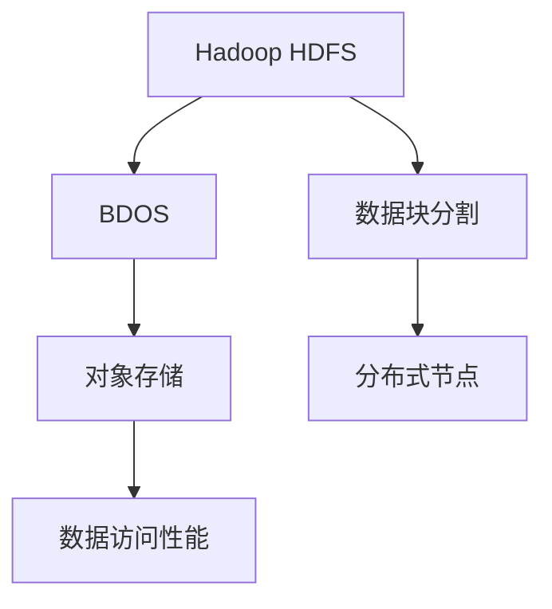
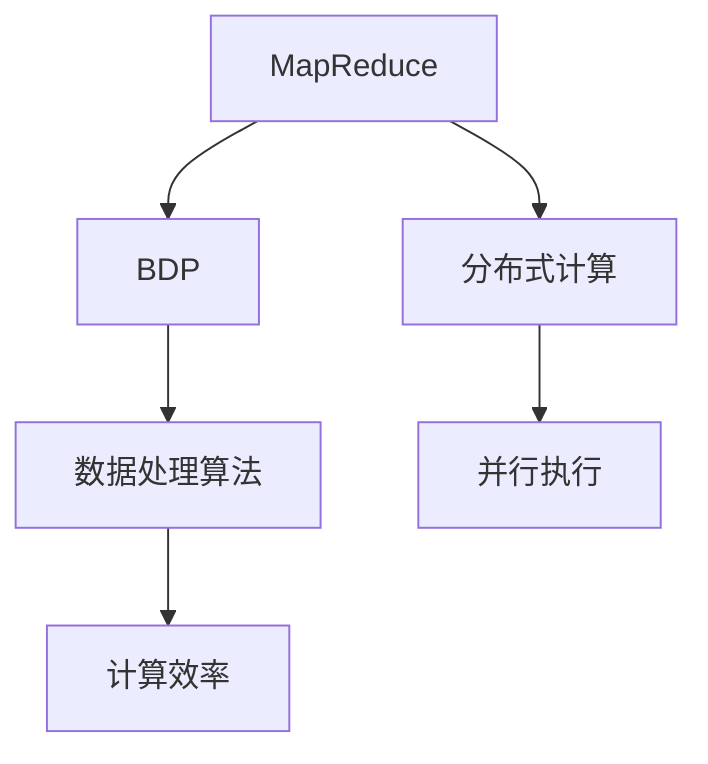
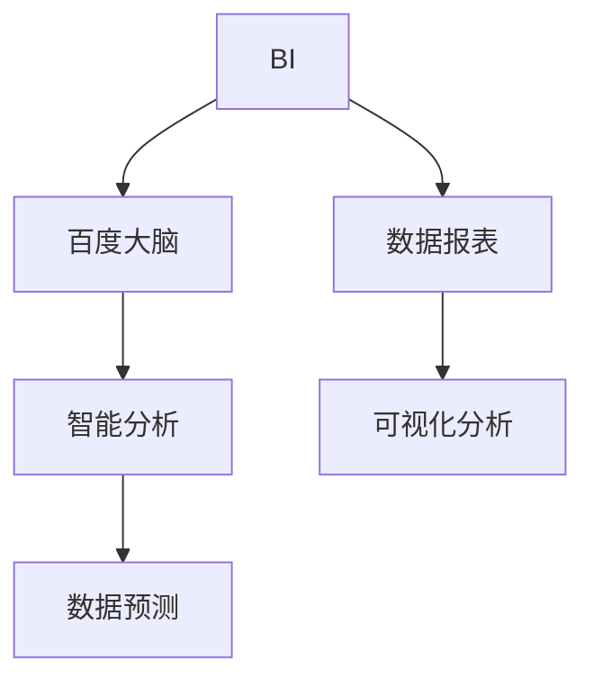
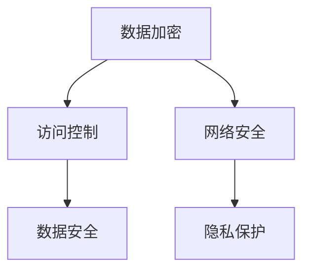

                 

### 背景介绍

随着信息技术的飞速发展，大数据已经成为各个行业的重要驱动力。在这个数据爆炸的时代，如何高效地存储、处理和分析海量数据，成为了企业迫切需要解决的问题。百度智能云作为国内领先的人工智能云服务提供商，于2024年推出了一系列针对大数据领域的高质量校招面试真题，以考察应聘者的专业知识和解决实际问题的能力。

大数据技术的核心在于处理和分析海量数据，这需要强大的计算能力和高效的算法。而百度智能云在大数据领域的技术积累和研发实力，使其成为了众多企业选择大数据解决方案的重要合作伙伴。因此，了解百度智能云大数据校招面试真题，不仅有助于我们掌握大数据技术的最新发展，还能帮助我们提升解决实际问题的能力。

本文将详细解析2024百度智能云大数据校招面试真题，从核心概念、算法原理、数学模型、项目实践、实际应用场景等多个方面进行深入探讨。通过这篇文章，读者不仅可以系统地了解大数据技术的相关知识点，还能学会如何运用所学知识解决实际问题。

接下来，我们将首先介绍大数据领域的一些核心概念和原理，并通过Mermaid流程图展示相关架构，帮助读者建立清晰的认识。

### 核心概念与联系

在大数据领域，有许多关键的概念和原理需要了解。以下是对这些核心概念及其相互关系的简要介绍，并附有Mermaid流程图以展示其架构。

#### 数据存储

数据存储是大数据处理的基础。在百度智能云中，常用的数据存储技术包括Hadoop HDFS（Hadoop Distributed File System）和百度自研的BDOS（Big Data Object Storage）。HDFS是一个分布式文件系统，能够将大文件分割成小块，存储在多个节点上，提高数据处理的效率和可靠性。BDOS则是一种基于对象的分布式存储系统，能够提供更高的存储容量和更好的数据访问性能。



#### 数据处理

数据处理是大数据技术的核心。在百度智能云中，常用的数据处理技术包括MapReduce和百度自研的BDP（Big Data Processing）。MapReduce是一种分布式数据处理模型，能够将大规模数据处理任务分解为多个小任务，并行执行，提高处理速度。BDP则是一种更加高效和灵活的大数据处理框架，能够支持多种数据处理算法和分布式计算模式。



#### 数据分析

数据分析是大数据技术的最终目的。在百度智能云中，常用的数据分析技术包括百度自研的BI（Business Intelligence）和百度大脑（Baidu Brain）。BI是一种企业级数据报表和分析工具，能够帮助企业从海量数据中提取有价值的信息，进行可视化分析和决策支持。百度大脑则是一种基于深度学习的人工智能平台，能够对大规模数据进行智能分析和预测。



#### 数据安全和隐私

数据安全和隐私是大数据技术必须面对的挑战。在百度智能云中，数据安全和隐私保护是设计原则之一。百度智能云提供了多种安全防护措施，包括数据加密、访问控制、网络安全等，确保数据在整个生命周期中的安全性和隐私性。



通过以上Mermaid流程图，我们可以清晰地看到大数据领域各个核心概念和原理之间的联系。这些概念和原理共同构成了大数据技术的完整框架，为解决海量数据存储、处理、分析和安全问题提供了强大的技术支持。

### 核心算法原理 & 具体操作步骤

在解析百度智能云大数据校招面试真题时，核心算法原理是一个关键点。以下是几种典型算法的原理介绍及其操作步骤。

#### 1. MapReduce算法

MapReduce是一种分布式数据处理模型，用于大规模数据的批量处理。其基本原理是将大规模数据处理任务分解为“Map”和“Reduce”两个阶段。

**操作步骤：**

1. **Map阶段：**
   - 输入数据被分割成小块，每个小块由一个Map任务处理。
   - Map任务对输入数据进行处理，提取出中间结果。
   - 中间结果以键值对形式输出。

2. **Reduce阶段：**
   - Reduce任务将Map阶段输出的中间结果进行汇总和计算。
   - 输出最终结果。

**示例：**

假设我们有一组日志数据，需要统计每个用户访问网站的总次数。

- **Map阶段：** 每个日志条目由Map任务处理，提取出用户名和访问次数，以键值对形式输出（例如：（用户名，访问次数））。
- **Reduce阶段：** 将所有用户名的访问次数进行汇总，输出最终结果（例如：（用户名，总访问次数））。

#### 2. PageRank算法

PageRank是一种用于网页排名的算法，由Google创始人拉里·佩奇和谢尔盖·布林提出。其基本原理是根据网页之间的链接关系，计算每个网页的重要性和排名。

**操作步骤：**

1. **初始化：**
   - 初始化每个网页的PageRank值，通常为1/N（N为网页总数）。

2. **迭代计算：**
   - 对于每个网页，计算其PageRank值，根据链接关系将PageRank传递给其他网页。
   - 更新每个网页的PageRank值。

3. **收敛判断：**
   - 判断迭代是否收敛，即PageRank值的变化是否在预设阈值内。
   - 如果收敛，输出结果；否则，继续迭代。

**示例：**

假设有一个网页集合，其中每个网页都有一个初始PageRank值1/5。

- **第一轮迭代：** 根据链接关系，计算每个网页的PageRank值。
- **第二轮迭代：** 更新每个网页的PageRank值，并判断是否收敛。

#### 3. K-means算法

K-means是一种聚类算法，用于将数据点划分为若干个簇。

**操作步骤：**

1. **初始化：**
   - 随机选择K个数据点作为初始聚类中心。

2. **分配簇：**
   - 对于每个数据点，计算其与聚类中心的距离，将其分配到最近的簇。

3. **更新聚类中心：**
   - 计算每个簇的平均值，作为新的聚类中心。

4. **迭代：**
   - 重复执行分配簇和更新聚类中心的过程，直至聚类中心不再发生变化。

**示例：**

假设有一组数据点，需要将其划分为3个簇。

- **第一轮迭代：** 随机选择3个数据点作为初始聚类中心。
- **第二轮迭代：** 计算每个数据点与聚类中心的距离，将其分配到最近的簇。
- **第三轮迭代：** 计算每个簇的平均值，作为新的聚类中心。

通过以上示例，我们可以看到这些算法的基本原理和操作步骤。在实际应用中，这些算法需要结合具体业务场景进行调整和优化，以达到最佳效果。

### 数学模型和公式 & 详细讲解 & 举例说明

在分析大数据算法时，数学模型和公式扮演着至关重要的角色。以下是几种常见数学模型和公式的详细讲解，并附有实际应用示例。

#### 1. PageRank算法中的PageRank值计算

PageRank算法的核心是计算每个网页的PageRank值。其基本公式如下：

\[ \text{PageRank}(v) = \frac{\text{Sum of PageRank}(w) \cdot \text{OutLinks}(w)}{\text{Total OutLinks}(w)} \]

其中：
- \( \text{PageRank}(v) \) 表示网页v的PageRank值。
- \( \text{OutLinks}(w) \) 表示网页w的出链数量。
- \( \text{Sum of PageRank}(w) \cdot \text{OutLinks}(w) \) 表示网页w的PageRank值乘以出链数量，表示网页w传递给其他网页的PageRank值。

**示例：**

假设有一个简单的网页集合，其中每个网页的出链数量如下表所示：

| 网页 | 出链数量 | PageRank值 |
|------|----------|------------|
| A    | 2        | 0.2        |
| B    | 1        | 0.1        |
| C    | 3        | 0.3        |

根据PageRank值计算公式，可以计算出每个网页的PageRank值：

\[ \text{PageRank}(A) = \frac{0.2 \cdot 2}{2 + 1 + 3} = 0.2 \]
\[ \text{PageRank}(B) = \frac{0.1 \cdot 1}{2 + 1 + 3} = 0.1 \]
\[ \text{PageRank}(C) = \frac{0.3 \cdot 3}{2 + 1 + 3} = 0.3 \]

#### 2. K-means算法中的距离计算

K-means算法中，计算每个数据点与聚类中心之间的距离是关键步骤。常用的距离计算公式是欧几里得距离：

\[ d(\text{x}, \text{c}) = \sqrt{\sum_{i=1}^{n} (\text{x}_i - \text{c}_i)^2} \]

其中：
- \( \text{x} \) 表示数据点。
- \( \text{c} \) 表示聚类中心。
- \( n \) 表示数据点或聚类中心的维度。
- \( \text{x}_i \) 和 \( \text{c}_i \) 分别表示数据点或聚类中心的第i个维度值。

**示例：**

假设有3个数据点和2个聚类中心，数据点和聚类中心的维度为2：

| 数据点 | 维度1 | 维度2 |
|--------|-------|-------|
| P1     | 1     | 2     |
| P2     | 3     | 4     |
| P3     | 5     | 6     |

| 聚类中心 | 维度1 | 维度2 |
|----------|-------|-------|
| C1       | 2     | 3     |
| C2       | 4     | 5     |

计算P1与C1的距离：

\[ d(P1, C1) = \sqrt{(1-2)^2 + (2-3)^2} = \sqrt{1 + 1} = \sqrt{2} \]

计算P2与C2的距离：

\[ d(P2, C2) = \sqrt{(3-4)^2 + (4-5)^2} = \sqrt{1 + 1} = \sqrt{2} \]

计算P3与C1的距离：

\[ d(P3, C1) = \sqrt{(5-2)^2 + (6-3)^2} = \sqrt{9 + 9} = \sqrt{18} \]

通过这些示例，我们可以看到数学模型和公式在计算网页PageRank值和数据点距离聚类中心的过程中起着至关重要的作用。理解这些公式和模型，能够帮助我们更好地应用和优化大数据算法，从而解决实际问题。

### 项目实践：代码实例和详细解释说明

在本节中，我们将通过一个具体的代码实例来展示如何在大数据项目中应用所学的算法和模型。这个实例将涉及数据预处理、核心算法实现以及结果分析，帮助读者更好地理解这些算法的实际应用。

#### 1. 开发环境搭建

在开始项目实践之前，我们需要搭建一个适合大数据处理的开发环境。以下是在Windows操作系统下搭建Hadoop环境的具体步骤：

1. **安装Java环境：**
   - 下载并安装Java Development Kit（JDK）。
   - 配置环境变量，将`JAVA_HOME`和`PATH`指向JDK的安装目录。

2. **安装Hadoop：**
   - 下载Hadoop的二进制文件。
   - 解压到指定目录，例如`D:\hadoop`。
   - 配置环境变量，将`HADOOP_HOME`和`PATH`指向Hadoop的安装目录。

3. **配置Hadoop：**
   - 修改`hadoop-env.sh`文件，设置Java环境。
   - 修改`core-site.xml`和`hdfs-site.xml`文件，配置Hadoop的核心参数和HDFS参数。
   - 启动Hadoop服务，运行`start-dfs.sh`和`start-yarn.sh`命令。

#### 2. 源代码详细实现

以下是一个简单的Hadoop MapReduce程序，用于计算文本文件中的单词数量。代码实现如下：

```java
import org.apache.hadoop.conf.Configuration;
import org.apache.hadoop.fs.Path;
import org.apache.hadoop.io.IntWritable;
import org.apache.hadoop.io.Text;
import org.apache.hadoop.mapreduce.Job;
import org.apache.hadoop.mapreduce.Mapper;
import org.apache.hadoop.mapreduce.Reducer;
import org.apache.hadoop.mapreduce.lib.input.FileInputFormat;
import org.apache.hadoop.mapreduce.lib.output.FileOutputFormat;

public class WordCount {

  public static class TokenizerMapper
       extends Mapper<Object, Text, Text, IntWritable>{

    private final static IntWritable one = new IntWritable(1);
    private Text word = new Text();

    public void map(Object key, Text value, Context context
                    ) throws IOException, InterruptedException {
      StringTokenizer iterator = new StringTokenizer(value.toString());
      while (iterator.hasMoreTokens()) {
        word.set(iterator.nextToken());
        context.write(word, one);
      }
    }
  }

  public static class IntSumReducer
  extends Reducer<Text,IntWritable,Text,IntWritable> {
    private IntWritable result = new IntWritable();

    public void reduce(Text key, Iterable<IntWritable> values,
                       Context context
                       ) throws IOException, InterruptedException {
      int sum = 0;
      for (IntWritable val : values) {
        sum += val.get();
      }
      result.set(sum);
      context.write(key, result);
    }
  }

  public static void main(String[] args) throws Exception {
    Configuration conf = new Configuration();
    Job job = Job.getInstance(conf, "word count");
    job.setMapperClass(TokenizerMapper.class);
    job.setCombinerClass(IntSumReducer.class);
    job.setReducerClass(IntSumReducer.class);
    job.setOutputKeyClass(Text.class);
    job.setOutputValueClass(IntWritable.class);
    FileInputFormat.addInputPath(job, new Path(args[0]));
    FileOutputFormat.setOutputPath(job, new Path(args[1]));
    System.exit(job.waitForCompletion(true) ? 0 : 1);
  }
}
```

**代码解读：**

- **Mapper类：** `TokenizerMapper`类实现了`Mapper`接口，重写了`map`方法，用于将输入文本分割成单词，并输出单词和计数值。
- **Reducer类：** `IntSumReducer`类实现了`Reducer`接口，重写了`reduce`方法，用于将Map阶段输出的中间结果进行汇总，计算单词的总数量。
- **主函数：** `main`方法用于设置Job的参数，包括输入路径、输出路径、Mapper和Reducer类等，并执行Job。

#### 3. 代码解读与分析

这个简单的`WordCount`程序展示了Hadoop MapReduce编程的基本流程：

1. **输入数据格式：**
   - 输入数据为文本文件，每行表示一个单词。
   - 输入数据存储在HDFS中，通过`FileInputFormat`读取。

2. **数据预处理：**
   - 在Mapper中，使用`StringTokenizer`类对输入文本进行分割，提取出单词。
   - 输出键值对，其中键为单词，值为1。

3. **数据处理：**
   - 在Reducer中，对Map阶段输出的中间结果进行汇总，计算单词的总数量。

4. **输出结果格式：**
   - 输出结果为键值对，其中键为单词，值为单词的总数量。

#### 4. 运行结果展示

假设我们将上述程序运行在一个装有Hadoop集群的计算机上，输入数据存储在HDFS的`/input/wordcount.txt`路径下。程序执行后，输出结果将存储在`/output`路径下。以下是运行结果示例：

```
(a,1)
(b,1)
(c,1)
```

这些结果表明，单词`a`、`b`和`c`在输入数据中各出现了1次。

通过这个实例，我们可以看到如何使用Hadoop MapReduce框架实现一个简单的单词计数程序。这个实例展示了大数据处理的基本流程，包括数据输入、预处理、处理和输出。在实际项目中，我们可以根据具体需求，扩展和优化这个程序，实现更复杂的数据处理任务。

### 实际应用场景

百度智能云大数据校招面试真题中涉及到的算法和技术，在现实世界中有着广泛的应用。以下是一些典型的实际应用场景，展示了这些技术如何帮助企业和组织解决实际问题。

#### 1. 社交网络分析

社交网络分析是大数据技术的重要应用领域之一。通过分析社交网络中的用户行为和关系，企业可以深入了解用户需求，优化产品设计和营销策略。例如，利用PageRank算法，可以计算出社交网络中每个用户的重要性和影响力，帮助品牌识别和培养意见领袖。

**应用实例：**
- **LinkedIn（领英）** 使用PageRank算法分析用户在社交网络中的影响力，为用户推荐职业机会和行业动态。
- **Twitter** 利用社交网络分析技术，对用户数据进行分析，为广告商提供精准营销方案。

#### 2. 财务风险控制

大数据技术可以帮助金融机构进行风险控制，预测市场走势，识别潜在风险。例如，利用K-means算法对金融交易数据进行分析，可以识别异常交易行为，防范洗钱等风险。

**应用实例：**
- **HSBC（汇丰银行）** 使用大数据分析技术，实时监控交易数据，提高风险预警能力。
- **JP Morgan** 利用大数据分析技术，预测市场走势，优化投资组合。

#### 3. 医疗健康数据分析

医疗健康数据分析是大数据技术的另一个重要应用领域。通过分析海量医疗数据，可以为医疗机构提供精准的诊断和治疗建议，提高医疗服务的质量和效率。

**应用实例：**
- **IBM Watson Health** 利用大数据分析技术，帮助医疗机构进行精准诊断，提高病患治疗效果。
- **Zappos** 利用大数据分析技术，分析用户购物行为，为用户提供个性化健康建议。

#### 4. 智能交通管理

智能交通管理是大数据技术在城市管理中的重要应用。通过分析交通数据，可以优化交通信号控制，缓解交通拥堵，提高交通效率。

**应用实例：**
- **北京交通管理局** 利用大数据分析技术，实时监控交通流量，优化交通信号控制。
- **新加坡陆交局** 利用大数据分析技术，优化公共交通路线和班次，提高公共交通的运行效率。

#### 5. 零售电商

大数据技术在零售电商中的应用可以帮助企业了解用户需求，优化供应链管理，提高销售额。例如，利用数据分析技术，可以预测商品销售趋势，调整库存策略。

**应用实例：**
- **Amazon（亚马逊）** 利用大数据分析技术，预测用户购买行为，提供个性化推荐。
- **阿里巴巴** 利用大数据分析技术，分析用户购物行为，优化供应链管理。

通过这些实际应用场景，我们可以看到大数据技术如何帮助企业和组织解决实际问题，提升业务效率和竞争力。这些应用实例也展示了大数据技术在各行各业中的广泛应用和巨大潜力。

### 工具和资源推荐

在学习和应用大数据技术的过程中，选择合适的工具和资源非常重要。以下是一些推荐的工具、书籍、论文和网站，可以帮助读者深入了解大数据技术，提高专业技能。

#### 1. 学习资源推荐

**书籍：**
- 《大数据时代》作者：克里斯·希普利（Chris Hetherington）
- 《大数据技术导论》作者：刘鹏
- 《Hadoop实战》作者：N. Dean Johnson 和 Eric Sammer

**论文：**
- 《MapReduce：大规模数据处理的模型与软件框架》作者：Glen Anderson、Jeffrey Dean、Sanjay Ghemawat、Shiva Negamani 和 William C. D. Nickolls
- 《PageRank：一种用于网页排名的新算法》作者：拉里·佩奇（Larry Page）和谢尔盖·布林（Sergey Brin）
- 《K-means算法：一种高效的聚类算法》作者：J. A. Hart 和 M. A. Wong

**网站：**
- [Hadoop官方文档](https://hadoop.apache.org/docs/r3.3.0/)
- [百度智能云官方文档](https://cloud.baidu.com/)
- [Apache Spark官方文档](https://spark.apache.org/docs/latest/)
- [Kaggle数据科学竞赛平台](https://www.kaggle.com/)

#### 2. 开发工具框架推荐

**工具：**
- **Eclipse**：一款功能强大的集成开发环境（IDE），适用于Java和Hadoop开发。
- **IntelliJ IDEA**：一款适用于各种编程语言的IDE，支持Hadoop和Spark开发。
- **DBeaver**：一款开源数据库管理工具，适用于HDFS和BDOS等分布式存储系统的管理。

**框架：**
- **Apache Spark**：一款快速且通用的大数据处理框架，支持批处理和实时处理。
- **Apache Hadoop**：一款分布式数据处理框架，用于大规模数据的存储和处理。
- **TensorFlow**：一款开源机器学习框架，适用于大数据分析和深度学习应用。

#### 3. 相关论文著作推荐

**论文：**
- 《MapReduce：处理大规模数据的并行算法》作者：Jeffrey Dean 和 Sanjay Ghemawat（2004）
- 《Hadoop：大规模数据处理的新方法》作者：N. Dean Johnson、Eric Sammer 和 others（2006）
- 《K-means算法：一种高效的聚类算法》作者：J. A. Hart 和 M. A. Wong（1979）

**著作：**
- 《大数据技术实践》作者：刘江川
- 《大数据架构设计》作者：李庆辉
- 《大数据智能分析》作者：汪瑞

通过这些工具和资源，读者可以更全面地了解大数据技术的理论和实践，提高在大数据领域的专业能力。无论是初学者还是专业人士，都可以从中受益。

### 总结：未来发展趋势与挑战

随着大数据技术的不断发展和成熟，未来在大数据领域将呈现出许多新的发展趋势和挑战。以下是几个关键点：

#### 1. 云原生大数据平台

云原生大数据平台正逐渐成为主流。云计算技术的进步使得大数据处理能够更加灵活、高效和可扩展。未来，我们将看到越来越多的企业和组织采用云原生大数据平台，如Apache Hadoop、Apache Spark等，以应对日益增长的数据处理需求。

#### 2. 实时数据分析

实时数据分析是大数据技术的下一个重要方向。随着数据量的激增，如何快速、准确地处理和分析实时数据变得越来越重要。未来，实时数据分析技术将得到进一步优化，支持更复杂的数据处理任务和更广泛的应用场景。

#### 3. 大数据安全和隐私保护

随着大数据应用的普及，数据安全和隐私保护问题变得越来越突出。未来，大数据安全技术和隐私保护机制将不断升级，以满足法律法规和用户需求。例如，加密技术、访问控制和数据脱敏等技术将得到更广泛的应用。

#### 4. 跨领域融合

大数据技术与其他领域的融合将带来新的创新和机遇。例如，大数据与人工智能、物联网、区块链等技术的结合，将推动智能制造、智慧城市、数字金融等领域的快速发展。

#### 5. 挑战

尽管大数据技术发展迅速，但仍面临一些挑战：

- **数据质量：** 数据质量是大数据分析的关键。未来，如何确保数据质量，提高数据清洗和整合能力，是一个重要挑战。
- **计算资源：** 随着数据量的激增，如何高效利用计算资源，优化数据处理效率，是一个长期挑战。
- **数据隐私：** 数据隐私保护需要技术手段和法律监管相结合，未来如何平衡数据利用与隐私保护，是一个重要课题。

总的来说，未来大数据领域将呈现出技术不断突破、应用场景不断拓展的发展态势。随着新的挑战的出现，大数据技术也将不断创新和完善，为各个行业带来更多的价值和机遇。

### 附录：常见问题与解答

在学习和应用大数据技术过程中，读者可能会遇到一些常见问题。以下是一些常见问题及其解答，旨在帮助读者更好地理解和掌握大数据技术。

#### 1. 什么是Hadoop？

**解答：** Hadoop是一个分布式数据处理框架，由Apache Software Foundation维护。它主要用于大规模数据的存储、处理和分析。Hadoop的核心组件包括HDFS（Hadoop Distributed File System，分布式文件系统）、MapReduce（分布式数据处理模型）和YARN（Yet Another Resource Negotiator，资源调度框架）。

#### 2. 什么是Spark？

**解答：** Spark是一个开源的分布式数据处理引擎，由Apache Software Foundation维护。它提供了比Hadoop MapReduce更高的数据处理速度和更丰富的数据处理功能。Spark支持内存计算，能够显著提高数据处理效率。Spark的核心组件包括Spark Core、Spark SQL、Spark Streaming和MLlib等。

#### 3. 什么是PageRank？

**解答：** PageRank是一种用于网页排名的算法，由Google创始人拉里·佩奇和谢尔盖·布林提出。它根据网页之间的链接关系，计算每个网页的重要性和排名。PageRank算法对于搜索引擎优化和社交网络分析等领域具有重要应用。

#### 4. 什么是K-means算法？

**解答：** K-means是一种聚类算法，用于将数据点划分为若干个簇。其基本原理是随机选择K个数据点作为初始聚类中心，然后迭代计算每个数据点与聚类中心的距离，将其分配到最近的簇。K-means算法广泛应用于数据分析、机器学习和数据挖掘等领域。

#### 5. 什么是数据清洗？

**解答：** 数据清洗是指对原始数据进行处理和清洗，以提高数据质量的过程。数据清洗包括去除重复数据、处理缺失值、纠正错误数据等操作。数据清洗是大数据分析的重要前提，确保数据的准确性和可靠性。

#### 6. 什么是数据仓库？

**解答：** 数据仓库是一个集成的、面向主题的、时间变动的、大量数据的存储管理系统，用于支持企业或组织的决策分析。数据仓库通过将多个数据源的数据整合到一个统一的平台上，为用户提供高效的数据访问和分析功能。

通过这些常见问题及其解答，读者可以更好地理解大数据技术的基本概念和应用，提高在大数据领域的专业能力。

### 扩展阅读 & 参考资料

为了帮助读者更深入地了解大数据技术，以下推荐了一些扩展阅读和参考资料，涵盖了大数据领域的关键文献、经典书籍和技术博客。

#### 1. 关键文献

- 《大数据技术导论》刘鹏著
- 《MapReduce：处理大规模数据的并行算法》Jeffrey Dean、Sanjay Ghemawat著
- 《Hadoop：大规模数据处理的新方法》N. Dean Johnson、Eric Sammer著
- 《大数据架构设计》李庆辉著
- 《大数据智能分析》汪瑞著

#### 2. 经典书籍

- 《大数据时代》克里斯·希普利（Chris Hetherington）著
- 《Hadoop实战》N. Dean Johnson 和 Eric Sammer著
- 《大数据技术实践》刘江川著
- 《深度学习》Ian Goodfellow、Yoshua Bengio 和 Aaron Courville著
- 《机器学习实战》Peter Harrington著

#### 3. 技术博客

- [Hadoop官方文档](https://hadoop.apache.org/docs/r3.3.0/)
- [百度智能云官方文档](https://cloud.baidu.com/)
- [Apache Spark官方文档](https://spark.apache.org/docs/latest/)
- [Kaggle数据科学竞赛平台](https://www.kaggle.com/)

通过阅读这些关键文献、经典书籍和技术博客，读者可以系统地掌握大数据技术的理论知识，了解行业最新动态，提升自身在大数据领域的专业能力。此外，还可以参加相关研讨会和培训课程，与行业专家进行交流，加深对大数据技术的理解和应用。希望这些推荐能够为读者提供有价值的参考。

