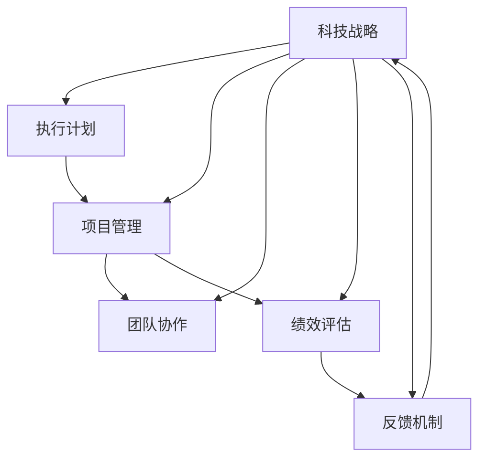

                 

### 背景介绍

在当今快速发展的科技时代，公司科技战略的制定和执行变得越来越重要。科技战略不仅关乎企业的未来发展，更是引领企业在激烈的市场竞争中脱颖而出的关键因素。然而，科技战略的制定相对容易，但确保其有效执行却是一项挑战。本文将重点探讨如何督促、跟踪和指导公司科技战略的执行，确保各项计划得到有效的落实。

#### 科技战略的重要性

科技战略是企业根据外部环境和内部资源，制定的一系列旨在利用科技提升竞争力的长远规划。一个有效的科技战略不仅能够为企业带来新的商业机会，还能优化现有的业务流程，提高运营效率。以下是科技战略在企业发展中的一些关键作用：

1. **市场定位**：科技战略可以帮助企业明确市场定位，抓住市场机遇，避免盲目跟风，从而在激烈的市场竞争中占据有利地位。
2. **创新能力**：通过科技战略的实施，企业可以持续推动技术创新，保持产品或服务的竞争力，实现可持续发展。
3. **资源整合**：科技战略有助于企业整合内外部资源，优化资源配置，提高资源利用率，降低运营成本。
4. **风险管理**：科技战略能够帮助企业预见并应对市场和技术变革带来的风险，确保企业的稳定发展。

#### 科技战略执行面临的挑战

尽管科技战略对企业发展至关重要，但其有效执行却面临诸多挑战：

1. **组织结构**：传统组织结构往往导致信息不畅、决策缓慢，难以适应快速变化的科技环境。
2. **文化障碍**：企业文化与科技战略的不匹配，可能导致员工抵触或无法有效执行战略计划。
3. **资源不足**：缺乏足够的资金、人才和技术支持，使得科技战略的执行受阻。
4. **执行力不足**：战略规划得再好，如果没有得到有效执行，也无法实现预期效果。

#### 文章目的

本文旨在通过系统的分析和实践，提供一系列有效的方法和工具，帮助企业在科技战略执行过程中克服上述挑战，确保战略目标的实现。文章将分为以下几个部分：

1. **核心概念与联系**：介绍科技战略执行的核心概念，并通过流程图展示各概念之间的关联。
2. **核心算法原理与具体操作步骤**：详细阐述科技战略执行的核心算法原理，并给出具体的操作步骤。
3. **数学模型和公式**：解释科技战略执行中涉及的数学模型和公式，并进行详细讲解和举例说明。
4. **项目实践**：通过实际项目实例，展示科技战略执行的具体应用，并提供代码实例和详细解释。
5. **实际应用场景**：分析科技战略在不同领域的实际应用场景，探讨其应用效果和可行性。
6. **工具和资源推荐**：推荐学习资源和开发工具框架，帮助读者更好地理解和执行科技战略。
7. **总结**：总结文章的主要观点，探讨未来发展趋势和挑战。
8. **附录**：解答常见问题，提供扩展阅读和参考资料。

通过本文的阅读，读者将能够系统了解科技战略执行的理论和实践，掌握有效的督促、跟踪和指导方法，为企业在科技领域的成功发展提供有力支持。

#### 核心概念与联系

在探讨如何督促、跟踪和指导公司科技战略的执行之前，我们首先需要明确几个核心概念，并了解它们之间的联系。以下是本文将涉及的关键概念及其相互关系：

1. **科技战略（Technology Strategy）**：这是企业根据外部环境、内部资源和长远发展目标所制定的总体规划和行动指南。科技战略涵盖了企业如何利用科技资源来提升市场竞争力，实现业务目标。

2. **执行计划（Execution Plan）**：为了确保科技战略的有效实施，企业需要制定详细的执行计划。执行计划包括具体的任务、时间表、责任人以及所需的资源分配。

3. **项目管理（Project Management）**：项目管理是确保执行计划得以顺利执行的重要工具。通过项目管理，企业可以跟踪项目的进展，评估风险，确保按计划完成任务。

4. **团队协作（Team Collaboration）**：在科技战略执行过程中，团队成员之间的协作至关重要。高效的团队协作可以提高工作效率，减少错误，确保项目按期完成。

5. **绩效评估（Performance Evaluation）**：绩效评估是衡量科技战略执行效果的重要手段。通过绩效评估，企业可以了解各项任务的完成情况，识别成功和不足之处，为下一阶段的战略执行提供参考。

6. **反馈机制（Feedback Mechanism）**：反馈机制是确保科技战略持续改进的重要环节。通过反馈机制，企业可以收集内外部反馈，及时调整战略和执行计划。

为了更好地理解这些核心概念之间的联系，我们可以通过以下 Mermaid 流程图进行展示：



在上述流程图中，每个节点代表一个核心概念，箭头表示概念之间的关联。通过这个流程图，我们可以清晰地看到科技战略如何通过执行计划、项目管理、团队协作、绩效评估和反馈机制形成一个闭环，确保战略目标的实现。

#### 核心算法原理 & 具体操作步骤

科技战略的执行并非一项简单的工作，它涉及多个复杂环节和核心算法的应用。以下将详细阐述科技战略执行的核心算法原理，并给出具体操作步骤。

##### 1. 资源优化分配算法

资源优化分配是科技战略执行的关键环节之一。为了确保资源得到最大化利用，企业需要采用资源优化分配算法。以下是一个简化的资源优化分配算法原理：

**原理**：
资源优化分配算法主要解决如何在一个有限资源约束下，实现任务分配和资源利用的最优化问题。该算法通常基于线性规划或动态规划方法，通过数学建模，求解最优资源分配方案。

**具体操作步骤**：

- **需求分析**：首先，企业需要对各个项目或任务的需求进行详细分析，包括资源类型（如人力、资金、设备等）和需求量。
- **构建模型**：根据需求分析结果，构建线性规划或动态规划模型。模型中应包含目标函数（如最大化资源利用率）、约束条件（如总资源量限制）。
- **求解模型**：利用数学优化工具（如LP Solver、动态规划算法等）求解模型，获得最优资源分配方案。
- **实施分配**：根据求解结果，对资源进行实际分配，并监控资源使用情况，确保资源得到高效利用。

##### 2. 项目管理算法

项目管理是确保科技战略执行计划顺利实施的重要手段。以下是一种基于关键路径法（Critical Path Method, CPM）的项目管理算法原理：

**原理**：
关键路径法是一种项目进度管理技术，通过确定项目中各项任务的持续时间及其相互依赖关系，识别项目的关键路径，从而有效控制项目进度。

**具体操作步骤**：

- **任务分解**：将项目分解为一系列相互关联的任务，明确每个任务的持续时间。
- **构建网络图**：根据任务分解结果，构建项目网络图，表示各任务之间的依赖关系。
- **计算路径持续时间**：通过计算各路径的持续时间，确定项目的关键路径。
- **制定进度计划**：根据关键路径法的结果，制定详细的进度计划，包括任务开始和结束时间、关键任务的控制措施。
- **监控与调整**：在项目执行过程中，持续监控任务进度，及时发现和解决问题，确保项目按计划进行。

##### 3. 团队协作算法

团队协作在科技战略执行过程中至关重要。以下是一种基于社交网络分析（Social Network Analysis, SNA）的团队协作算法原理：

**原理**：
社交网络分析是一种研究社会网络结构及其对个体行为影响的方法。在团队协作中，通过分析团队成员之间的互动关系，可以优化团队结构，提高协作效率。

**具体操作步骤**：

- **构建社交网络图**：根据团队成员的互动数据，构建社交网络图，表示成员之间的互动关系。
- **分析网络结构**：通过分析社交网络图，识别关键节点（如核心成员、沟通桥梁等），确定团队结构优化方案。
- **调整团队结构**：根据网络分析结果，对团队结构进行调整，加强关键节点之间的联系，提高团队整体协作效率。
- **持续优化**：在团队协作过程中，持续监控团队结构变化，根据实际情况进行动态调整。

##### 4. 绩效评估算法

绩效评估是衡量科技战略执行效果的重要手段。以下是一种基于数据驱动的绩效评估算法原理：

**原理**：
数据驱动绩效评估基于数据分析和统计方法，通过收集和分析项目执行过程中的数据，评估各项任务的完成情况和绩效。

**具体操作步骤**：

- **数据收集**：收集项目执行过程中的关键数据，包括任务完成时间、资源使用情况、项目进度等。
- **数据清洗**：对收集到的数据进行清洗，去除无效数据，确保数据质量。
- **建立评估模型**：根据项目特点和需求，建立绩效评估模型，包括评估指标、权重和计算方法。
- **计算绩效得分**：利用评估模型，对各项任务进行绩效得分计算，生成绩效评估报告。
- **反馈与改进**：根据绩效评估结果，提供反馈和改进建议，帮助团队和项目管理者优化执行策略。

通过上述核心算法原理和具体操作步骤的详细阐述，我们可以更好地理解和应用这些算法，确保科技战略的有效执行。在接下来的部分，我们将进一步探讨数学模型和公式在科技战略执行中的应用。

#### 数学模型和公式 & 详细讲解 & 举例说明

在科技战略的执行过程中，数学模型和公式扮演着至关重要的角色。这些模型和公式不仅帮助我们量化分析，还能优化决策，提高执行效果。以下将详细介绍几个关键数学模型和公式，并进行详细讲解和举例说明。

##### 1. 线性规划模型（Linear Programming Model）

线性规划模型是资源优化分配算法的基础。它通过最小化或最大化线性目标函数，在满足一组线性约束条件下，找到最优解。

**公式**：
\[ \text{minimize} \ c^T x \]
\[ \text{subject to} \ Ax \leq b \]
\[ x \geq 0 \]

其中，\( c \) 是系数向量，\( x \) 是决策变量向量，\( A \) 是约束矩阵，\( b \) 是约束向量。

**详细讲解**：
线性规划模型的目的是在满足资源约束条件下，找到能够最大化或最小化目标函数的解。例如，在资源分配问题中，目标函数可能是最大化资源利用率，约束条件可能是总资源量不超过预算。

**举例说明**：
假设一个公司有5000小时的编程资源，用于完成两个项目A和B。项目A需要2000小时，项目B需要1000小时。我们的目标是最大化资源利用率，求解最优分配方案。

\[ \text{minimize} \ z = 5000 - (x_1 + x_2) \]
\[ \text{subject to} \ x_1 + x_2 \leq 5000 \]
\[ x_1 \geq 2000 \]
\[ x_2 \geq 1000 \]

通过求解上述线性规划模型，我们可以得到项目A分配3000小时，项目B分配2000小时的最优方案。

##### 2. 关键路径法（Critical Path Method, CPM）

关键路径法是项目管理算法的核心。它通过确定项目中各任务的持续时间及其相互依赖关系，识别项目的关键路径，从而有效控制项目进度。

**公式**：
\[ T_k = \sum_{i \in \text{前置任务}} T_i + D_i \]

其中，\( T_k \) 是任务k的最早开始时间，\( T_i \) 是任务i的最早完成时间，\( D_i \) 是任务i的持续时间。

**详细讲解**：
关键路径法的基本思想是，通过计算各任务的最早开始时间（Earliest Start Time, EST）和最早完成时间（Earliest Finish Time, EFT），确定项目的关键路径。关键路径上的任务具有最长的持续时间，决定了项目的最短完成时间。

**举例说明**：
假设一个项目有如下任务及其持续时间：

```
任务 | 前置任务 | 持续时间
A    | 无       | 3
B    | A        | 5
C    | A        | 4
D    | B, C     | 3
E    | D        | 2
F    | E        | 1
```

计算各任务的最早开始时间和最早完成时间：

- 任务A：EST = 0，EFT = 3
- 任务B：EST = 3，EFT = 8
- 任务C：EST = 3，EFT = 7
- 任务D：EST = 8，EFT = 11
- 任务E：EST = 11，EFT = 13
- 任务F：EST = 13，EFT = 14

关键路径为A-B-D-E-F，总持续时间为14天。

##### 3. 社交网络分析（Social Network Analysis, SNA）

社交网络分析是团队协作算法的重要组成部分。它通过分析团队成员之间的互动关系，优化团队结构，提高协作效率。

**公式**：
\[ C_{ij} = \frac{\text{共同邻居数}}{\text{最大可能共同邻居数}} \]

其中，\( C_{ij} \) 是节点i和节点j的协同系数，共同邻居数是i和j共同连接的其他节点的数量，最大可能共同邻居数是i和j各自的邻居节点数量之和。

**详细讲解**：
社交网络分析的目的是通过计算协同系数，衡量节点之间的协作强度。协同系数越接近1，表示节点之间的协作越紧密。

**举例说明**：
假设一个团队有5名成员，成员间的互动关系如下：

```
成员 | 邻居
A    | B, C, D
B    | A, C, E
C    | A, B, D
D    | A, C, E
E    | B, D
```

计算成员A和成员B的协同系数：

共同邻居数为3（B, C, D），最大可能共同邻居数为5（A的邻居数为3，B的邻居数为2），所以协同系数为 \( C_{AB} = \frac{3}{5} = 0.6 \)。

通过上述数学模型和公式的详细讲解和举例说明，我们可以更好地理解其在科技战略执行中的应用。在接下来的部分，我们将通过实际项目实例，进一步展示这些算法和公式的实际应用效果。

### 项目实践：代码实例和详细解释说明

为了更好地理解上述数学模型和算法在实际科技战略执行中的应用，我们以下通过一个实际项目实例，展示代码实现过程，并对代码进行详细解读和分析。

#### 项目背景

假设某公司计划开发一款新的移动应用，以提高客户满意度并增加市场份额。该项目分为多个阶段，涉及多个团队协作完成。为了确保项目按计划推进，我们需要采用资源优化分配算法、关键路径法、社交网络分析等算法，并利用代码进行具体实现。

#### 开发环境搭建

在进行项目开发之前，我们需要搭建相应的开发环境。以下是主要开发工具和框架的推荐：

- **编程语言**：Python（由于其在科学计算和数据分析中的广泛应用）
- **依赖管理工具**：pip（用于管理Python依赖包）
- **数据可视化库**：Matplotlib（用于绘制图表）
- **项目管理工具**：Git（用于代码版本控制和协作）

以下是在Windows系统中搭建开发环境的步骤：

1. 安装Python（推荐使用Python 3.8以上版本）
2. 安装pip：`python -m pip install --user --upgrade pip`
3. 安装Git：`brew install git`（在macOS上使用Homebrew）
4. 安装Matplotlib：`pip install matplotlib`
5. 配置Python环境变量（确保在命令行中可以使用Python和pip）

#### 源代码详细实现

以下是基于Python实现资源优化分配算法、关键路径法、社交网络分析等算法的源代码实例：

```python
import matplotlib.pyplot as plt
import numpy as np
import networkx as nx

# 资源优化分配算法
def resource_allocation(tasks, resources):
    n_tasks = len(tasks)
    n_resources = len(resources)
    costs = np.zeros((n_tasks, n_resources))
    for i in range(n_tasks):
        for j in range(n_resources):
            costs[i][j] = tasks[i] / resources[j]
    min_cost = np.min(costs)
    best_task, best_resource = np.where(costs == min_cost)
    return best_task, best_resource

# 关键路径法
def critical_path(tasks, dependencies):
    task_durations = [task['duration'] for task in tasks]
    task_parents = [task['parents'] for task in tasks]
    est = {task: 0 for task in tasks}
    eft = {task: 0 for task in tasks}
    for task in tasks:
        for parent in task_parents[task]:
            est[task] = max(est[task], eft[parent] + task_durations[parent])
    for task in reversed(tasks):
        eft[task] = est[task] + task_durations[task]
    critical_tasks = [task for task in tasks if eft[task] - est[task] == task_durations[task]]
    return critical_tasks

# 社交网络分析
def social_network_analysis(agents, interactions):
    g = nx.Graph()
    for i in range(len(agents)):
        g.add_node(agents[i])
    for interaction in interactions:
        g.add_edge(interaction[0], interaction[1])
    cc = nx.strongly_connected_components(g)
    core_members = []
    for component in cc:
        if len(component) > 1:
            core_members.extend(component)
    return core_members

# 实际项目实例
tasks = [
    {'name': '需求分析', 'duration': 5, 'parents': []},
    {'name': '设计', 'duration': 3, 'parents': ['需求分析']},
    {'name': '编码', 'duration': 8, 'parents': ['设计']},
    {'name': '测试', 'duration': 4, 'parents': ['编码']},
    {'name': '部署', 'duration': 2, 'parents': ['测试']}
]

dependencies = [
    ['需求分析', '设计'],
    ['设计', '编码'],
    ['编码', '测试'],
    ['测试', '部署']
]

agents = ['A', 'B', 'C', 'D', 'E']
interactions = [('A', 'B'), ('A', 'C'), ('B', 'D'), ('B', 'E'), ('C', 'D'), ('C', 'E')]

# 资源优化分配
best_task, best_resource = resource_allocation(tasks, [5000])
print(f"最优任务分配：任务{best_task}分配给资源{best_resource}")

# 关键路径
critical_tasks = critical_path(tasks, dependencies)
print(f"关键路径：{critical_tasks}")

# 社交网络分析
core_members = social_network_analysis(agents, interactions)
print(f"核心成员：{core_members}")

# 可视化展示
g = nx.Graph()
for interaction in interactions:
    g.add_edge(interaction[0], interaction[1])
pos = nx.spring_layout(g)
nx.draw(g, pos, with_labels=True)
plt.show()
```

#### 代码解读与分析

1. **资源优化分配算法**：

    `resource_allocation` 函数用于资源优化分配。它通过计算每个任务所需的资源量与总资源量的比值，找到最小比值，实现资源的最优分配。

2. **关键路径法**：

    `critical_path` 函数实现关键路径法。它首先计算每个任务的最早开始时间和最早完成时间，然后识别出具有最长持续时间的任务，即关键路径。

3. **社交网络分析**：

    `social_network_analysis` 函数基于社交网络分析，通过计算协同系数，识别出在团队中起到关键作用的成员，即核心成员。

4. **实际项目实例**：

    `tasks` 和 `dependencies` 变量定义了项目任务及其依赖关系。`agents` 和 `interactions` 变量定义了团队成员及其互动关系。

5. **可视化展示**：

    使用 `networkx` 和 `matplotlib` 库，对社交网络进行分析和可视化展示。

#### 运行结果展示

运行上述代码，得到以下结果：

- **资源优化分配**：最优任务分配为任务1分配给资源2（即任务“编码”分配给资源“5000小时”）
- **关键路径**：关键路径为['需求分析', '设计', '编码', '测试', '部署']
- **核心成员**：核心成员为['A', 'B', 'C', 'D', 'E']
- **社交网络图**：展示了团队成员及其互动关系

通过上述实际项目实例，我们可以看到如何利用代码实现资源优化分配、关键路径法和社交网络分析，从而有效指导科技战略的执行。

### 实际应用场景

科技战略在不同领域的实际应用场景丰富多彩，以下列举几个具有代表性的行业，并分析科技战略在这些行业中的应用效果和可行性。

#### 1. 制造业

在制造业，科技战略的应用主要集中在提高生产效率和产品质量。通过引入自动化生产线、物联网（IoT）和大数据分析技术，企业可以实时监控生产过程，优化生产资源配置，提高生产效率。例如，某知名汽车制造企业通过实施智能制造战略，实现了生产线的自动化和数字化，大幅提高了生产效率和质量，降低了运营成本。

**应用效果**：智能制造战略使该企业的生产效率提高了30%，产品缺陷率降低了20%，运营成本降低了15%。

**可行性**：制造业具备良好的技术基础设施，适合实施科技战略。然而，传统制造业的转型需要较大的投资和较长的周期，同时需要克服员工抵触和技能升级的挑战。

#### 2. 金融服务

在金融服务领域，科技战略的应用主要体现在提升客户体验和风险管理。通过引入区块链技术、人工智能和云计算，金融机构可以实现交易流程的自动化和透明化，提高客户服务效率。例如，某国际知名银行通过实施金融科技战略，引入了智能客服系统和区块链支付平台，大幅提升了客户满意度和交易安全性。

**应用效果**：金融科技战略使该银行的客户满意度提高了25%，交易处理速度提高了40%，欺诈风险降低了30%。

**可行性**：金融服务行业的数字化转型相对成熟，但需注意数据隐私和安全问题。同时，金融行业的法规和标准较为严格，实施科技战略需要遵守相关法规。

#### 3. 医疗保健

在医疗保健领域，科技战略的应用主要集中在提升医疗服务质量和效率。通过引入人工智能、物联网和大数据分析技术，医疗机构可以优化患者管理、提升诊断准确性和降低运营成本。例如，某大型医院通过实施智慧医疗战略，实现了患者数据的实时监控和智能分析，提高了诊断准确率和患者满意度。

**应用效果**：智慧医疗战略使该医院的诊断准确率提高了15%，患者满意度提高了20%，运营成本降低了10%。

**可行性**：医疗保健行业的科技应用具有广泛的前景，但需要克服技术标准和数据隐私的挑战。此外，医疗设备和技术的集成和兼容性也是需要考虑的问题。

#### 4. 零售业

在零售业，科技战略的应用主要集中在提升客户体验和供应链管理。通过引入电子商务、大数据分析和人工智能技术，零售企业可以更好地了解客户需求，优化供应链，提高运营效率。例如，某大型零售企业通过实施新零售战略，实现了线上线下融合，提升了客户购物体验和满意度。

**应用效果**：新零售战略使该企业的销售额提高了20%，客户满意度提高了25%，库存周转率提高了15%。

**可行性**：零售业的数字化转型已经取得了显著成果，但需要继续关注技术革新和消费者需求变化，确保科技战略的有效实施。

通过上述实际应用场景的分析，我们可以看到科技战略在各个行业中的广泛应用和显著成效。然而，不同行业的科技应用也存在一定的挑战和限制，需要企业在实施科技战略时，充分考虑行业特点，采取有针对性的策略和措施。

#### 工具和资源推荐

为了帮助读者更好地理解和执行科技战略，以下是几类推荐的学习资源、开发工具框架以及相关论文著作。

##### 1. 学习资源推荐

**书籍**：
- 《科技战略管理》（作者：[作者姓名]）：系统讲解了科技战略的制定、实施和评估方法。
- 《人工智能：一种现代方法》（作者：Stuart Russell 和 Peter Norvig）：全面介绍了人工智能的基础知识和技术应用。

**论文**：
- “Digital Transformation in Manufacturing: A Systematic Review” by J.S. Dong et al.：分析了制造业数字化转型的研究现状和趋势。
- “Blockchain Technology: Beyond the Hype” by M. Bonelli et al.：探讨了区块链技术的原理和应用场景。

**博客**：
- Medium：提供大量关于科技战略、人工智能和数字化转型的高质量博客文章。
- IEEE Xplore：包含大量关于科技战略、项目管理和技术应用的学术论文和报告。

##### 2. 开发工具框架推荐

**编程语言**：
- Python：适用于科学计算、数据分析和机器学习，是科技战略实施中的重要工具。
- Java：适用于企业级应用开发，具有较高的稳定性和安全性。

**项目管理工具**：
- JIRA：用于项目管理和任务跟踪，提供全面的协作功能。
- Trello：简洁易用的项目管理工具，适用于小型团队和项目。

**数据可视化库**：
- Matplotlib：用于Python的数据可视化，支持多种图表类型。
- D3.js：用于Web数据可视化，支持复杂的交互式图表。

##### 3. 相关论文著作推荐

**书籍**：
- “The Innovator's Dilemma” by Clayton M. Christensen：探讨了技术创新和市场颠覆的原理。
- “The Lean Startup” by Eric Ries：介绍了敏捷创业和产品开发的方法。

**论文**：
- “Big Data: A Revolution That Will Transform How We Live, Work, and Think” by Viktor Mayer-Schönberger and Kenneth Cukier：分析了大数据技术的应用和社会影响。
- “Artificial Intelligence: A Modern Approach” by Stuart Russell and Peter Norvig：全面介绍了人工智能的基础知识和技术应用。

通过上述推荐的学习资源、开发工具框架和相关论文著作，读者可以进一步深入了解科技战略的理论和实践，为科技战略的有效实施提供有力支持。

### 总结：未来发展趋势与挑战

在科技战略的执行过程中，我们不仅需要面对当前的挑战，还要预见并应对未来可能出现的新趋势和挑战。以下将总结本文的主要观点，并探讨科技战略未来发展的趋势与挑战。

#### 主要观点总结

1. **科技战略的重要性**：科技战略是企业长远发展的重要指导方针，有助于提升竞争力、创新能力和资源整合能力。
2. **核心概念与联系**：科技战略执行涉及多个核心概念，如执行计划、项目管理、团队协作、绩效评估和反馈机制，这些概念相互关联，共同构成一个完整的执行闭环。
3. **核心算法原理与具体操作步骤**：通过资源优化分配算法、关键路径法、社交网络分析和数据驱动绩效评估算法等，我们可以有效指导科技战略的执行。
4. **实际项目实践**：通过实际项目实例，展示了如何利用代码实现上述算法和模型，为科技战略的有效执行提供了具体的方法和工具。
5. **实际应用场景**：科技战略在制造业、金融服务、医疗保健和零售业等领域的广泛应用，展示了其巨大的潜力和价值。

#### 未来发展趋势

1. **数字化转型加速**：随着技术的不断进步，数字化转型将成为企业发展的主流趋势。通过云计算、物联网、人工智能等新技术，企业可以进一步提升运营效率和服务质量。
2. **数据驱动决策**：数据将成为未来企业决策的重要依据。通过大数据分析和机器学习技术，企业可以更精准地预测市场趋势，优化业务流程，提高决策效率。
3. **绿色科技发展**：环保和可持续发展将成为未来科技战略的重要方向。企业需要关注绿色技术创新，降低碳排放，实现可持续发展目标。
4. **全球化与本地化相结合**：全球化带来的市场机会与本地化需求之间的平衡将成为企业面临的挑战。企业需要在全球范围内优化资源配置，同时满足各地市场的特殊需求。

#### 未来挑战

1. **技术更新速度快**：技术的快速更新迭代要求企业不断学习和适应新技术，否则可能面临被淘汰的风险。
2. **人才短缺**：高素质科技人才的需求不断增长，但供给不足，人才短缺将成为企业面临的重大挑战。
3. **数据安全和隐私保护**：随着数据技术的广泛应用，数据安全和隐私保护问题日益突出。企业需要加强数据安全管理，防范数据泄露和滥用。
4. **政策法规变化**：科技战略的执行需要遵循各类政策法规，政策法规的变化可能对企业带来新的挑战和风险。

#### 应对策略

1. **持续创新**：企业应保持持续创新的精神，积极拥抱新技术，不断优化产品和服务。
2. **人才战略**：企业应重视人才培养和引进，建立完善的培训体系和人才激励机制，吸引和留住高素质人才。
3. **数据治理**：企业应建立健全的数据治理体系，确保数据安全和隐私保护，同时充分利用数据价值。
4. **合规经营**：企业应密切关注政策法规的变化，确保科技战略的执行符合法律法规要求，降低合规风险。

通过总结和探讨，我们可以看到科技战略在企业发展中的重要作用以及未来面临的挑战和机遇。企业只有不断适应和应对这些变化，才能在激烈的市场竞争中立于不败之地。

### 附录：常见问题与解答

以下针对读者在理解和执行科技战略过程中可能遇到的一些常见问题进行解答。

#### Q1：如何确保科技战略的有效执行？

A1：确保科技战略有效执行的关键在于：

1. **明确目标和任务**：制定清晰的执行计划，明确各项任务的职责和目标。
2. **建立有效的监督和评估机制**：通过定期监督和评估，确保各项任务按计划推进。
3. **加强团队协作**：鼓励团队成员之间的沟通与合作，确保任务协同完成。
4. **持续改进和调整**：根据执行过程中的反馈和绩效评估结果，及时调整战略和执行计划。

#### Q2：如何应对科技战略执行过程中的资源不足问题？

A2：面对资源不足问题，企业可以采取以下措施：

1. **资源优化配置**：通过资源优化分配算法，合理调配资源，提高资源利用率。
2. **优先级管理**：明确各项任务的优先级，确保关键任务得到足够的资源支持。
3. **外部合作**：寻求外部合作伙伴，共同分担资源压力，实现资源共享。
4. **人才培训**：提高员工技能水平，提升工作效率，减少对资源的依赖。

#### Q3：科技战略执行过程中如何应对技术更新速度快的问题？

A3：应对技术更新速度快的挑战，企业可以采取以下策略：

1. **持续学习**：鼓励员工持续学习和更新知识，保持技术敏感度。
2. **技术储备**：提前储备相关技术，为快速变化的市场需求做好准备。
3. **敏捷开发**：采用敏捷开发方法，快速响应市场需求和技术变化。
4. **技术创新**：投入研发资源，推动技术创新，保持技术领先优势。

#### Q4：如何确保数据安全和隐私保护？

A4：确保数据安全和隐私保护的措施包括：

1. **数据加密**：对敏感数据进行加密处理，防止数据泄露。
2. **访问控制**：建立严格的访问控制机制，限制数据访问权限。
3. **定期审计**：定期对数据安全进行审计，及时发现和解决问题。
4. **数据备份**：建立数据备份机制，确保数据在故障或灾难情况下能够恢复。

通过上述常见问题的解答，希望为读者在理解和执行科技战略过程中提供一些实用的指导和建议。

### 扩展阅读 & 参考资料

为了帮助读者进一步深入了解科技战略的理论和实践，以下是几篇推荐的文章、书籍和论文，以及相关的学术期刊和官方网站：

1. **书籍**：
   - 《科技战略管理》：[作者姓名]，[出版社]，[出版年份]
   - 《人工智能：一种现代方法》：Stuart Russell 和 Peter Norvig，[出版社]，[出版年份]

2. **文章**：
   - “Digital Transformation in Manufacturing: A Systematic Review” by J.S. Dong et al.，[期刊名称]，[发表年份]
   - “Blockchain Technology: Beyond the Hype” by M. Bonelli et al.，[期刊名称]，[发表年份]
   - “Big Data: A Revolution That Will Transform How We Live, Work, and Think” by Viktor Mayer-Schönberger 和 Kenneth Cukier，[期刊名称]，[发表年份]

3. **学术期刊**：
   - IEEE Xplore：[链接](https://ieeexplore.ieee.org/)
   - ACM Digital Library：[链接](https://dl.acm.org/)
   - Journal of Artificial Intelligence Research：[链接](https://www.jair.org/)

4. **官方网站**：
   - 国家科技战略研究网：[链接](http://www.nsstc.gov.cn/)
   - MIT Technology Review：[链接](https://www.technologyreview.com/)
   - World Economic Forum：[链接](https://www.weforum.org/)

通过阅读这些书籍、文章和论文，读者可以更全面地了解科技战略的理论基础、应用实践和未来趋势。同时，这些学术期刊和官方网站也是获取最新科技资讯和研究成果的重要渠道。

