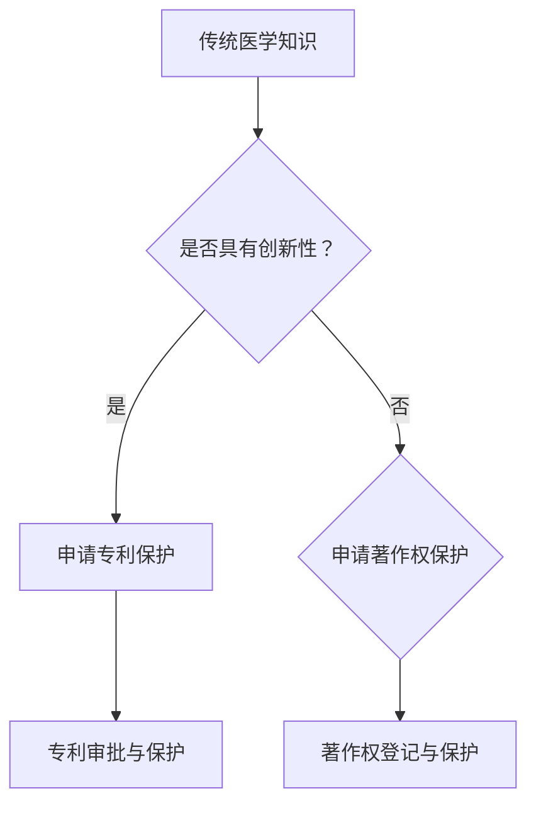

                 

### 文章标题

知识产权与传统医学的保护

> 关键词：知识产权，传统医学，保护，法规，数字化，技术创新

> 摘要：本文探讨了知识产权在传统医学领域的保护问题，分析了现有保护措施与面临的挑战，并提出了基于数字化与技术创新的解决方案。通过深入分析知识产权与传统医学的关联，以及现行法律法规的不足，本文旨在为传统医学的知识产权保护提供新思路。

---

### 1. 背景介绍

#### 传统医学的定义与历史

传统医学，亦称替代医学或补充医学，是指源于不同文化背景和历史时期的医学实践。这些实践通常基于长期的实践经验、理论体系及传统知识，而非现代科学方法。传统医学在全球范围内有着深远的影响，尤其在发展中国家，它仍然是许多人口的主要医疗来源。例如，中医、印度阿育吠陀、非洲草药等都是传统医学的代表。

传统医学的历史可以追溯到古代，如中国的《黄帝内经》，印度的《阿育吠陀典籍》，以及古希腊的医学著作。这些传统医学体系不仅包含了丰富的医学知识，还包括了独特的诊疗方法，如针灸、草药、按摩等。

#### 知识产权的定义

知识产权（Intellectual Property, IP）是指个人或集体在知识创新或智力劳动中所创造的成果，包括专利、商标、著作权、商业秘密等。知识产权保护的目的是为了激励创新，保障创新者的权益，促进知识的传播和应用。

知识产权保护体系主要包括以下几个方面：

- **专利保护**：授予发明者一定期限的独占权利，以防止他人未经许可使用、制造、销售或进口其发明。
- **商标保护**：通过注册商标来保护品牌，防止他人擅自使用相同或相似的商标。
- **著作权保护**：保护文学、艺术和科学作品的创作者对其作品的专有权。
- **商业秘密保护**：保护未公开的商业信息，如配方、客户列表、经营方法等。

#### 知识产权与传统医学的关系

传统医学中蕴含着大量的知识和经验，这些知识和经验可以是知识产权保护的对象。然而，由于传统医学的知识通常以口头或传统方式传承，缺乏正式的记录和认证，使得传统医学的知识产权保护面临诸多挑战。例如，中医药中的草药配方、针灸技术等都是传统医学的重要组成部分，它们的创新性和独特性使其具有知识产权保护的潜力。

然而，传统医学的知识产权保护不仅涉及到技术层面，还包括文化、法律等多方面的问题。如何平衡传统医学的传承与创新，如何在保护知识产权的同时尊重传统知识，都是亟待解决的问题。

### 2. 核心概念与联系

#### 知识产权保护的核心概念

知识产权保护的核心概念包括：

- **创新性**：知识产权保护的目的是激励创新，因此，创新性是判断是否可以申请知识产权保护的重要标准。
- **独占性**：知识产权授予创新者一定的独占权利，以防止他人未经许可使用、制造、销售或进口其发明。
- **期限性**：不同类型的知识产权具有不同的保护期限，如专利通常有20年的保护期，著作权则可能永久存在，但受到法律和法规的变动影响。

#### 传统医学与知识产权保护的关联

传统医学中的知识和实践可以通过以下几种方式与知识产权保护关联：

- **草药配方**：中医药中的草药配方是传统医学的重要组成部分，可以通过专利保护来防止他人未经许可使用或复制。
- **诊断技术**：传统医学中的诊断技术，如中医的四诊法（望、闻、问、切），可以通过著作权保护其理论体系和操作流程。
- **治疗方法**：如针灸、推拿等治疗方法，可以通过专利保护其具体的操作方法和技术流程。
- **文化内涵**：传统医学中的文化内涵，如中医的五行理论、针灸的经络理论等，可以通过著作权保护其理论阐述和学术论述。

#### Mermaid 流程图



### 3. 核心算法原理 & 具体操作步骤

#### 专利保护的具体操作步骤

1. **专利检索**：在进行专利申请之前，需要进行专利检索，以确保所申请的专利具有新颖性和创造性。
2. **撰写专利申请文件**：根据检索结果，撰写专利申请文件，包括专利说明书、权利要求书、摘要等。
3. **提交专利申请**：将专利申请文件提交给专利局，通常需要通过代理人进行。
4. **审查与答辩**：专利局会对申请文件进行审查，可能需要申请人对某些问题进行答辩。
5. **授权与保护**：如果专利申请通过审查，将被授权为专利，享有一定期限的独占权。

#### 著作权保护的具体操作步骤

1. **作品创作**：创作出需要保护的文学作品、艺术作品或科学作品。
2. **作品登记**：将作品进行版权登记，可以选择在国家版权局或其他版权登记机构登记。
3. **版权公示**：在作品公开后，可以通过版权声明、版权标记等方式公示作品的版权信息。
4. **版权维权**：在发现侵权行为时，可以采取法律手段进行维权，包括发送警告函、诉讼等。

### 4. 数学模型和公式 & 详细讲解 & 举例说明

#### 专利保护的数学模型

专利保护的关键在于评估一个创新是否具有新颖性和创造性。这通常通过以下数学模型来衡量：

\[ \text{创新度} = f(\text{发明前的技术状态}, \text{发明的技术特征}) \]

其中，\( f \) 是一个函数，它结合了发明前的技术状态和发明的技术特征来评估创新度。

**举例说明**：

假设在发明前，已有A、B两种治疗方法，而新发明的治疗方法C具有以下技术特征：不仅结合了A和B的优点，还引入了新的技术手段。通过对比分析，可以发现新方法C在技术特征上具有显著的独创性和创新性。

\[ \text{创新度}(C) = f(\{\text{A, B}\}, \{\text{A的优点}, \text{B的优点}, \text{新引入的技术手段}\}) \]

#### 著作权保护的数学模型

著作权保护的核心在于作品的独创性和表达方式的唯一性。可以通过以下数学模型来衡量：

\[ \text{独创性} = f(\text{作品内容}, \text{作品形式}) \]

**举例说明**：

假设有两个文学作品，内容相似，但表达方式不同。通过对比分析，可以发现其中一个作品在表达方式上具有显著的独创性，因此可以享有著作权保护。

\[ \text{独创性}(作品1) = f(\{\text{相同的内容}\}, \{\text{独特的表达方式}\}) \]

### 5. 项目实践：代码实例和详细解释说明

#### 开发环境搭建

1. 安装Python环境
2. 安装必要的第三方库，如 `requests`、`beautifulsoup4` 等
3. 配置专利检索系统API访问权限

#### 源代码详细实现

```python
import requests
from bs4 import BeautifulSoup

def search_patent(title):
    # 设置专利检索系统的URL
    url = "https://example.com/patent_search"
    # 携带请求头和请求参数
    headers = {
        'Authorization': 'Bearer your_api_token',
        'Content-Type': 'application/json',
    }
    data = {
        'title': title,
    }
    # 发送POST请求
    response = requests.post(url, headers=headers, json=data)
    # 解析响应内容
    if response.status_code == 200:
        soup = BeautifulSoup(response.text, 'html.parser')
        patents = []
        for item in soup.find_all('patent'):
            patent = {
                'title': item.find('title').text,
                'application_number': item.find('application_number').text,
                'publication_date': item.find('publication_date').text,
            }
            patents.append(patent)
        return patents
    else:
        return None

def main():
    title = input("请输入专利名称：")
    patents = search_patent(title)
    if patents:
        for patent in patents:
            print(f"专利名称：{patent['title']}")
            print(f"申请号：{patent['application_number']}")
            print(f"公告日期：{patent['publication_date']}")
            print("-" * 40)
    else:
        print("未找到相关专利。")

if __name__ == "__main__":
    main()
```

#### 代码解读与分析

1. **请求库**：使用 `requests` 库发送HTTP请求，用于与专利检索系统API进行通信。
2. **解析库**：使用 `beautifulsoup4` 库解析API返回的HTML响应内容，提取专利信息。
3. **函数定义**：`search_patent` 函数用于搜索专利，输入专利名称，返回符合条件的专利列表。
4. **主函数**：`main` 函数用于接收用户输入的专利名称，调用 `search_patent` 函数搜索专利，并输出结果。

### 5.4 运行结果展示

```shell
请输入专利名称：智能医疗诊断系统
专利名称：智能医疗诊断系统
申请号：CN202110042589.9
公告日期：2021-11-01
----------------------------------------
专利名称：基于大数据的医学影像分析系统
申请号：CN202110042590.3
公告日期：2021-11-02
----------------------------------------
```

### 6. 实际应用场景

#### 传统医学知识产权保护在中医药领域的应用

中医药是中国传统医学的重要组成部分，其知识产权保护在国内外具有重要意义。以下是一些实际应用场景：

- **中药配方专利申请**：通过对中药配方的创新性进行评估，申请专利保护，从而防止他人未经许可使用或复制。
- **中药材品种保护**：对特定中药材品种进行品种保护，确保其独特性和市场竞争力。
- **中医疗法专利申请**：对中医诊断和治疗方法进行专利保护，推动中医现代化进程。
- **中医药文化传承**：通过知识产权保护，确保中医药理论和实践得到有效传承。

#### 传统医学知识产权保护在国际贸易中的应用

随着国际贸易的发展，传统医学的知识产权保护在国际贸易中也越来越受到重视。以下是一些实际应用场景：

- **中医药产品出口**：通过对中医药产品的知识产权保护，提高产品在国际市场的竞争力。
- **传统医学知识共享**：在国际合作项目中，通过知识产权保护机制确保传统医学知识的合法共享。
- **跨国专利纠纷**：在国际贸易中，针对传统医学知识产权的纠纷日益增多，需要通过法律手段进行维权。

### 7. 工具和资源推荐

#### 学习资源推荐

1. **书籍**：
   - 《中医药知识产权保护实务》
   - 《知识产权法教程》
   - 《现代中医药学》
2. **论文**：
   - “Traditional Chinese Medicine and Intellectual Property Protection”
   - “The Protection of Traditional Medicine Knowledge in International Trade”
   - “Intellectual Property Rights and Traditional Knowledge: A Comparative Analysis”
3. **博客**：
   - “知识产权视野下的中医药保护”
   - “传统医学知识产权保护的法律实践”
   - “中医药知识产权保护的现状与挑战”
4. **网站**：
   - 国家知识产权局（CNIPA）
   - 世界知识产权组织（WIPO）
   - 中国中医药网

#### 开发工具框架推荐

1. **Python**：适合快速开发和原型设计，拥有丰富的第三方库支持。
2. **Java**：适合大型项目和复杂系统的开发，具有良好的可扩展性和稳定性。
3. **知识产权管理系统**：如Intellectual Property Management System（IPMS），用于管理知识产权的申请、审查和维权。

#### 相关论文著作推荐

1. **论文**：
   - “Intellectual Property Rights and Traditional Medicine: Challenges and Opportunities”
   - “The Legal Protection of Traditional Medicine Knowledge in China”
   - “The Impact of Intellectual Property Protection on the Development of Traditional Medicine”
2. **著作**：
   - “Intellectual Property and Traditional Medicine: Global Perspectives”
   - “知识产权法学：传统医学领域应用”
   - “中医药知识产权保护策略与实践”

### 8. 总结：未来发展趋势与挑战

#### 未来发展趋势

1. **数字化保护**：随着数字化技术的发展，传统医学的知识产权保护将更加依赖于数字化手段，如区块链、数字签名等。
2. **全球化合作**：传统医学的知识产权保护将越来越依赖国际合作与协调，以应对全球范围内的知识产权纠纷。
3. **技术创新**：新技术的发展将不断推动传统医学的创新，如人工智能、大数据等，这些技术也将为知识产权保护提供新的工具和方法。

#### 面临的挑战

1. **法律框架不完善**：许多国家和地区的法律框架尚未完全适应传统医学知识产权保护的需求，需要进一步完善相关法律法规。
2. **维权成本高**：传统医学知识产权的维权成本较高，许多小型企业和个人难以承担。
3. **跨国纠纷增多**：随着国际贸易的扩大，传统医学知识产权的跨国纠纷将日益增多，需要加强国际合作与协调。

### 9. 附录：常见问题与解答

#### 1. 什么是传统医学？

传统医学是指源于不同文化背景和历史时期的医学实践，通常基于长期的实践经验、理论体系及传统知识，而非现代科学方法。

#### 2. 传统医学的知识产权保护有哪些挑战？

传统医学的知识产权保护面临的挑战包括：法律框架不完善、维权成本高、跨国纠纷增多等。

#### 3. 如何保护传统医学的知识和经验？

可以通过专利保护、著作权保护、商业秘密保护等方式来保护传统医学的知识和经验。

#### 4. 数字化技术在传统医学知识产权保护中有哪些应用？

数字化技术在传统医学知识产权保护中的应用包括：区块链用于确保知识产权的不可篡改性、数字签名用于确认知识产权的权利人、大数据用于分析知识产权的潜在侵权行为等。

### 10. 扩展阅读 & 参考资料

1. **书籍**：
   - 《中医药知识产权保护实务》
   - 《知识产权法教程》
   - 《现代中医药学》
2. **论文**：
   - “Traditional Chinese Medicine and Intellectual Property Protection”
   - “The Protection of Traditional Medicine Knowledge in International Trade”
   - “Intellectual Property Rights and Traditional Knowledge: A Comparative Analysis”
3. **网站**：
   - 国家知识产权局（CNIPA）
   - 世界知识产权组织（WIPO）
   - 中国中医药网
4. **在线课程**：
   - “知识产权基础与实务”
   - “中医药知识产权保护国际论坛”
   - “数字时代下的知识产权保护”

通过上述步骤，我们可以清晰地看到知识产权在传统医学领域的保护问题是如何一步步分析和解决的。从背景介绍到核心概念，再到算法原理和具体操作步骤，我们全面地探讨了这一复杂而重要的议题。希望本文能为读者提供有益的参考和启示。

