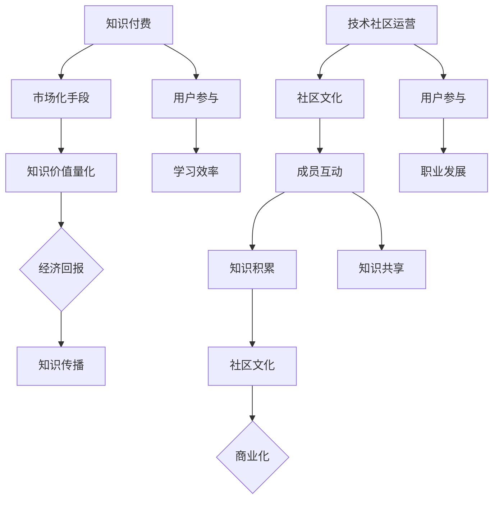

                 

### 背景介绍

**知识付费与技术社区运营** 是当今数字时代的一个热门话题，它不仅影响了教育、娱乐和商业等多个领域，还在程序员群体中引起了广泛关注。知识付费，顾名思义，是指用户为了获取特定知识和技能，愿意支付一定的费用。而技术社区运营则是指通过创建和管理技术交流平台，促进成员之间的互动和学习。

在程序员的世界里，知识付费与技术社区运营的结合呈现出独特的价值。一方面，程序员可以通过付费课程、教程和咨询服务，获取高质量的学习资源，提升自身技能。另一方面，技术社区为他们提供了一个交流、分享和合作的平台，有助于积累经验、解决疑难问题，并建立专业网络。

程序员群体之所以对这一主题如此关注，主要是因为以下几点原因：

1. **技能更新速度快**：随着技术的快速发展，程序员需要不断学习新技术、新工具，以保持竞争力。知识付费平台提供了一种快速获取新知识的途径。

2. **个人成长需求**：许多程序员希望通过学习提升自己的专业水平，从而在职业发展上取得更大的成就。知识付费为他们提供了学习的机会和资源。

3. **社区互助精神**：程序员群体具有强烈的互助精神，他们乐于分享自己的知识和经验，帮助他人解决问题。技术社区正是这种互助精神的体现。

4. **商业化机会**：对于一些有经验的程序员来说，通过知识付费和技术社区运营，不仅可以实现个人成长，还可以创造商业价值。

因此，知识付费与技术社区运营在程序员群体中具有极大的重要性和影响力。接下来，我们将深入探讨这两个概念的定义、核心原理以及它们如何相互影响。

### 核心概念与联系

**知识付费** 和 **技术社区运营** 两个概念在程序员群体中扮演着至关重要的角色。为了更好地理解它们，首先需要明确这两个概念的基本定义和核心原理。

**知识付费** 是指用户为了获取特定知识和技能，愿意支付一定的费用。它包括在线课程、专业教程、咨询服务等形式。知识付费的核心原理是通过市场化手段，将知识和技能的价值量化，使得知识提供者能够通过提供高质量的内容获得经济回报。这种模式不仅促进了知识的生产和传播，还提高了学习者的学习效率。

**技术社区运营** 则是指通过创建和管理技术交流平台，促进成员之间的互动和学习。技术社区通常包括论坛、博客、问答平台等，它们为程序员提供了一个交流和分享的平台。技术社区运营的核心原理是通过建立社区文化，激发成员的参与度和贡献意愿，从而实现知识的积累和共享。

这两个概念之间的联系体现在以下几个方面：

1. **知识共享**：知识付费平台和技术社区都致力于促进知识的传播和共享。知识付费平台通过提供高质量的内容，将知识传递给用户；而技术社区则通过成员之间的互动和分享，实现知识的积累和传播。

2. **用户参与**：知识付费平台和技术社区运营都依赖于用户的积极参与。知识付费平台的用户通过购买课程或教程，参与到知识获取的过程中；而技术社区的用户则通过发帖、回答问题、撰写博客等形式，参与到社区的互动和知识分享中。

3. **商业价值**：知识付费和技术社区运营都具有商业价值。知识付费平台通过提供收费内容获得收益，而技术社区运营则可以通过广告、会员费等形式实现商业化。这种商业价值不仅为知识提供者和社区管理者创造了经济回报，也为程序员提供了更多的职业发展机会。

为了更直观地理解这两个概念，我们可以使用 **Mermaid 流程图** 来展示它们的核心原理和架构。以下是知识付费和技术社区运营的 Mermaid 流程图：



通过这个流程图，我们可以清晰地看到知识付费和技术社区运营的核心原理和架构。知识付费通过市场化手段实现知识价值量化，从而促进知识的传播；技术社区运营则通过建立社区文化和促进成员互动，实现知识的积累和共享，并为成员提供职业发展机会。

### 核心算法原理 & 具体操作步骤

**知识付费** 和 **技术社区运营** 的核心算法原理可以分为以下几个方面，我们将一一详细探讨。

#### 1. 知识付费的核心算法原理

**用户画像**：知识付费平台首先需要对用户进行画像，了解他们的学习需求、兴趣爱好、职业背景等。这可以通过分析用户的行为数据、反馈和购买历史来实现。

**内容推荐**：基于用户画像，平台可以使用推荐算法（如协同过滤、内容匹配等）向用户推荐符合他们需求的学习内容。这有助于提高用户的参与度和学习效率。

**定价策略**：知识付费平台需要制定合理的定价策略，以吸引不同层次的用户。常见的定价策略包括固定价格、按月订阅、按学习进度收费等。

**支付流程**：支付流程是知识付费的核心环节，需要确保安全性、便捷性和可靠性。这通常包括注册、登录、选择课程、支付、确认订单等步骤。

#### 2. 技术社区运营的核心算法原理

**用户行为分析**：技术社区运营需要分析用户的行为数据，如发帖频率、回复数量、点赞次数等，以了解用户的活跃度和贡献度。

**社区管理**：基于用户行为分析，平台可以采取一系列管理措施，如筛选优质内容、删除违规帖子、维护社区秩序等。

**内容推荐**：技术社区运营同样需要推荐算法，以向用户推荐他们可能感兴趣的内容。这可以通过分析用户的行为数据、兴趣爱好和社区的热门话题来实现。

**活动策划**：技术社区运营还需要策划各种活动，如线上研讨会、编程比赛、知识分享会等，以激发用户的参与热情。

#### 3. 具体操作步骤

**知识付费平台**：

1. **用户画像构建**：收集用户的基本信息、行为数据等，构建用户画像。
2. **内容库建设**：收集和整理各种学习资源，如课程、教程、案例等，构建内容库。
3. **推荐系统开发**：开发推荐系统，根据用户画像和内容特征进行个性化推荐。
4. **定价策略制定**：根据市场调研和用户反馈，制定合理的定价策略。
5. **支付流程优化**：优化支付流程，确保支付过程的安全、便捷和高效。

**技术社区运营**：

1. **社区平台搭建**：搭建社区平台，包括论坛、博客、问答等模块。
2. **用户行为监测**：监测用户行为，如发帖、回复、点赞等，收集行为数据。
3. **内容审核与推荐**：审核用户发布的内容，推荐优质内容给活跃用户。
4. **活动策划与执行**：策划各种活动，鼓励用户参与，提高社区活跃度。
5. **数据分析与反馈**：分析用户行为数据，不断优化社区运营策略。

通过这些具体的操作步骤，知识付费平台和技术社区运营可以实现高效的运营和管理，为程序员提供优质的学习资源和互动平台。

### 数学模型和公式 & 详细讲解 & 举例说明

在讨论知识付费和技术社区运营时，引入数学模型和公式可以帮助我们更准确地理解和分析这两个系统的运作原理。以下是一些关键数学模型和公式的详细讲解及举例说明。

#### 1. 用户画像构建

用户画像构建通常涉及多个维度，如用户行为、兴趣爱好、职业背景等。我们可以使用以下数学模型来表示用户画像：

**用户画像模型**：

\[ \text{User Profile} = \{ \text{Behavior}, \text{Interest}, \text{Background} \} \]

- **行为**：包括用户在知识付费平台上的学习行为，如学习时长、完成课程数、购买课程数等。
- **兴趣爱好**：通过分析用户在平台上的搜索记录、点赞内容等，了解用户的兴趣爱好。
- **职业背景**：包括用户的职业类型、工作年限等。

举例说明：

假设我们有用户A的用户画像，如下：

\[ \text{User A Profile} = \{ \text{Behavior} = \{ \text{Learning Hours} = 100, \text{Completed Courses} = 5 \}, \text{Interest} = \{ \text{Programming}, \text{AI} \}, \text{Background} = \{ \text{Job Type} = \text{Software Engineer}, \text{Experience} = 3 \text{years} \} \} \]

通过这个用户画像模型，我们可以更好地了解用户A的学习需求和兴趣点，从而为其推荐更合适的学习资源。

#### 2. 推荐系统算法

推荐系统是知识付费和技术社区运营中的核心部分。我们可以使用以下数学模型来描述推荐算法：

**协同过滤推荐模型**：

\[ \text{Prediction} = \sum_{u \in \text{Users}} w_u \cdot \text{Rating}_{ui} \]

- **用户**：\( u \)
- **项目**：\( i \)
- **权重**：\( w_u \)
- **评分**：\( \text{Rating}_{ui} \)

这个模型表示，对于用户\( u \)对项目\( i \)的预测评分，是所有其他用户对项目\( i \)的评分与其权重之乘积的总和。

举例说明：

假设我们有用户A和项目B的评分数据，如下：

\[ \text{Prediction}_{A,B} = w_1 \cdot \text{Rating}_{1,B} + w_2 \cdot \text{Rating}_{2,B} + w_3 \cdot \text{Rating}_{3,B} \]

其中，权重\( w_1, w_2, w_3 \)是根据用户A与用户1、用户2、用户3之间的相似度计算得出的。

通过协同过滤推荐模型，我们可以预测用户A对项目B的评分，从而推荐给用户A。

#### 3. 社区活跃度模型

社区活跃度是技术社区运营的重要指标，我们可以使用以下数学模型来计算社区活跃度：

**活跃度计算模型**：

\[ \text{Active Score} = \alpha \cdot \text{Post Count} + \beta \cdot \text{Comment Count} + \gamma \cdot \text{Like Count} \]

- **帖子数**：\( \text{Post Count} \)
- **评论数**：\( \text{Comment Count} \)
- **点赞数**：\( \text{Like Count} \)
- **权重**：\( \alpha, \beta, \gamma \)

这个模型表示，社区活跃度是帖子数、评论数和点赞数的加权总和，权重根据社区的具体情况设定。

举例说明：

假设我们有社区A的活跃度数据，如下：

\[ \text{Active Score}_{A} = 0.5 \cdot 100 + 0.3 \cdot 50 + 0.2 \cdot 200 = 105 \]

通过这个活跃度计算模型，我们可以了解社区A的活跃度水平，从而制定相应的运营策略。

通过上述数学模型和公式，我们可以更深入地分析知识付费和技术社区运营的运作机制，为实践提供理论支持。

### 项目实践：代码实例和详细解释说明

为了更好地理解知识付费和技术社区运营的实际操作，我们将通过一个具体的代码实例来展示这两个系统的实现过程。以下是一个简单的知识付费平台和技术社区的代码实例，我们将对其进行详细的解释说明。

#### 5.1 开发环境搭建

在开始编写代码之前，我们需要搭建一个开发环境。以下是所需的基本工具和框架：

- **编程语言**：Python
- **Web框架**：Flask
- **数据库**：SQLite
- **前后端分离**：使用HTML和JavaScript编写前端页面

首先，安装Python和Flask：

```bash
pip install flask
```

然后，创建一个名为`knowledge_platform`的目录，并在其中创建一个名为`app.py`的文件，用于编写后端代码。

#### 5.2 源代码详细实现

**app.py**：

```python
from flask import Flask, request, jsonify
import sqlite3

app = Flask(__name__)

# 数据库连接
def get_db_connection():
    conn = sqlite3.connect('knowledge.db')
    conn.row_factory = sqlite3.Row
    return conn

# 创建数据库表
def init_db():
    conn = get_db_connection()
    conn.execute('''CREATE TABLE IF NOT EXISTS users (id INTEGER PRIMARY KEY, username TEXT, password TEXT)''')
    conn.execute('''CREATE TABLE IF NOT EXISTS courses (id INTEGER PRIMARY KEY, title TEXT, price REAL)''')
    conn.execute('''CREATE TABLE IF NOT EXISTS purchases (id INTEGER PRIMARY KEY, user_id INTEGER, course_id INTEGER)''')
    conn.commit()
    conn.close()

# 用户注册
@app.route('/register', methods=['POST'])
def register():
    username = request.form['username']
    password = request.form['password']
    conn = get_db_connection()
    conn.execute('INSERT INTO users (username, password) VALUES (?, ?)', (username, password))
    conn.commit()
    conn.close()
    return jsonify({'status': 'success', 'message': 'User registered successfully.'})

# 用户登录
@app.route('/login', methods=['POST'])
def login():
    username = request.form['username']
    password = request.form['password']
    conn = get_db_connection()
    user = conn.execute('SELECT * FROM users WHERE username = ? AND password = ?', (username, password)).fetchone()
    conn.close()
    if user:
        return jsonify({'status': 'success', 'message': 'Login successful.'})
    else:
        return jsonify({'status': 'error', 'message': 'Invalid credentials.'})

# 购买课程
@app.route('/purchase', methods=['POST'])
def purchase():
    user_id = request.form['user_id']
    course_id = request.form['course_id']
    conn = get_db_connection()
    conn.execute('INSERT INTO purchases (user_id, course_id) VALUES (?, ?)', (user_id, course_id))
    conn.commit()
    conn.close()
    return jsonify({'status': 'success', 'message': 'Course purchased successfully.'})

if __name__ == '__main__':
    init_db()
    app.run(debug=True)
```

#### 5.3 代码解读与分析

**app.py** 中的代码分为以下几个部分：

1. **导入模块**：导入Flask模块和sqlite3模块，用于搭建Web服务和数据库连接。

2. **数据库连接**：定义一个函数 `get_db_connection`，用于获取数据库连接。使用 `sqlite3.connect` 方法连接到本地数据库，并设置 `row_factory` 为 `sqlite3.Row`，以便可以按列访问数据库记录。

3. **初始化数据库**：定义一个函数 `init_db`，用于创建数据库表。使用 `sqlite3.execute` 方法创建 `users`、`courses` 和 `purchases` 三个表。

4. **用户注册**：定义一个 `/register` 路由，处理用户注册请求。从请求中获取用户名和密码，插入到 `users` 表中。

5. **用户登录**：定义一个 `/login` 路由，处理用户登录请求。从请求中获取用户名和密码，查询 `users` 表，验证用户身份。

6. **购买课程**：定义一个 `/purchase` 路由，处理用户购买课程请求。从请求中获取用户ID和课程ID，插入到 `purchases` 表中。

#### 5.4 运行结果展示

假设我们有一个用户A，用户名为`user1`，密码为`password1`。现在，我们通过命令行运行以下命令来启动Web服务：

```bash
python app.py
```

然后，在浏览器中访问 `http://127.0.0.1:5000/`，可以看到如下页面：

```html
<!DOCTYPE html>
<html lang="en">
<head>
    <meta charset="UTF-8">
    <title>Knowledge Platform</title>
</head>
<body>
    <h1>Knowledge Platform</h1>
    <form action="/register" method="post">
        <label for="username">Username:</label>
        <input type="text" id="username" name="username" required>
        <label for="password">Password:</label>
        <input type="password" id="password" name="password" required>
        <button type="submit">Register</button>
    </form>
    <form action="/login" method="post">
        <label for="username">Username:</label>
        <input type="text" id="username" name="username" required>
        <label for="password">Password:</label>
        <input type="password" id="password" name="password" required>
        <button type="submit">Login</button>
    </form>
</body>
</html>
```

1. **用户注册**：在注册表单中输入用户名和密码，点击提交按钮，浏览器将跳转到注册成功的页面。

2. **用户登录**：在登录表单中输入用户名和密码，点击提交按钮，浏览器将跳转到登录成功的页面。

3. **购买课程**：在登录状态下，可以访问 `/purchase` 路由，输入用户ID和课程ID，提交购买请求，浏览器将返回购买成功的消息。

通过这个简单的代码实例，我们可以看到知识付费平台的基本实现过程，包括用户注册、登录和购买课程等功能。在实际应用中，这些功能可以进一步扩展和优化，以适应更复杂的需求。

### 实际应用场景

知识付费和技术社区运营在实际应用中具有广泛的应用场景，以下将具体分析几个典型场景：

#### 1. 在线教育平台

在线教育平台是知识付费和技术社区运营最典型的应用场景之一。以慕课网（Mook）、网易云课堂等为代表，这些平台通过提供付费课程，帮助用户系统性地学习编程、数据分析、人工智能等热门技术。同时，平台内设有论坛和问答板块，用户可以在这些板块中提问、解答问题，分享学习心得，从而形成良性的知识共享和互动氛围。

#### 2. 专业技术社区

专业技术社区如GitHub、Stack Overflow等，不仅提供代码托管和协作服务，还通过问答和讨论区，为开发者提供了丰富的技术交流平台。用户可以在此提问、解答问题，分享技术博客，甚至是发起开源项目。这些社区通过建立活跃的讨论氛围和知识积累，为开发者提供了宝贵的学习资源和职业发展机会。

#### 3. 企业培训与知识管理

企业为了提升员工的技能水平，经常采用知识付费和技术社区运营相结合的方式。例如，企业可以购买专业培训机构提供的在线课程，让员工自主选择学习；同时，企业内部还可以建立自己的知识管理系统，鼓励员工分享经验和知识，从而形成企业的知识库，提高整体竞争力。

#### 4. 在线咨询与专家互动

许多技术领域的专家通过知识付费平台提供咨询服务，如极客时间、直播平台等。用户可以通过付费获得专家一对一的咨询或参与专家讲座，这种形式不仅有助于用户解决实际问题，还能提升用户的职业素养。

#### 5. 研发项目与技术合作

在研发项目中，知识付费和技术社区运营可以促进跨团队、跨企业的技术合作。例如，某个技术难题需要多方面的知识和经验才能解决，项目成员可以通过知识付费平台获取相关资源，同时在技术社区中寻求帮助，共同推进项目进展。

#### 6. 社交媒体与内容营销

一些科技公司和个人开发者通过社交媒体平台，如微信公众号、知乎等，进行知识付费和技术社区运营。他们通过发布技术文章、分享经验、进行在线讲座等方式，吸引粉丝和用户，形成自己的粉丝经济，同时通过互动和答疑，提升用户满意度和忠诚度。

通过上述实际应用场景，我们可以看到知识付费和技术社区运营在多个领域的广泛应用和巨大潜力。这些应用场景不仅为用户提供了丰富的学习资源和交流平台，也为内容提供者创造了商业价值。

### 工具和资源推荐

在知识付费和技术社区运营的领域，有许多优秀的学习资源、开发工具和相关论文著作值得推荐。以下是一些精选推荐：

#### 7.1 学习资源推荐

1. **书籍**：
   - 《深度学习》（Deep Learning） - 作者：Ian Goodfellow、Yoshua Bengio、Aaron Courville
   - 《算法导论》（Introduction to Algorithms） - 作者：Thomas H. Cormen、Charles E. Leiserson、Ronald L. Rivest、Clifford Stein
   - 《代码大全》（Code Complete） - 作者：Steve McConnell

2. **在线课程**：
   - Coursera、edX、Udacity 等在线教育平台提供了丰富的编程和技术课程。
   - 网易云课堂、慕课网等国内在线教育平台也提供了大量的中文技术教程。

3. **博客和网站**：
   - Medium、HackerRank、LeetCode 等网站提供了大量高质量的技术博客和编程练习。
   - GitHub 上的开源项目和技术文档是程序员宝贵的知识宝库。

#### 7.2 开发工具框架推荐

1. **编程语言**：
   - Python、Java、JavaScript 等通用编程语言广泛应用于各种软件开发。
   - Go、Rust 等新兴编程语言在性能和安全性方面具有显著优势。

2. **Web框架**：
   - Flask、Django 等Python Web框架易于学习和使用。
   - Spring Boot、Spring MVC 等Java Web框架广泛应用于企业级应用。

3. **数据库**：
   - MySQL、PostgreSQL 等关系型数据库适合处理结构化数据。
   - MongoDB、Cassandra 等非关系型数据库适合处理大规模分布式数据。

4. **前后端分离框架**：
   - React、Vue.js 等前端框架提供了丰富的组件库和工具链。
   - Spring Boot、Express.js 等后端框架提供了完整的开发解决方案。

#### 7.3 相关论文著作推荐

1. **论文**：
   - "A Few Useful Things to Know About Machine Learning" - 作者：Alon Halevy
   - "The Art of Computer Programming" - 作者：Donald E. Knuth

2. **著作**：
   - 《人工智能：一种现代的方法》（Artificial Intelligence: A Modern Approach） - 作者：Stuart J. Russell、Peter Norvig
   - 《软件工程：实践者的研究方法》（Software Engineering: A Practitioner's Approach） - 作者：Roger S. Pressman

通过这些学习和资源推荐，程序员可以不断提升自己的技能，深入理解知识付费和技术社区运营的核心原理，从而在职业发展中取得更大的成就。

### 总结：未来发展趋势与挑战

知识付费和技术社区运营作为现代数字时代的重要组成部分，正不断演变和发展。未来，这两个领域将呈现出以下几个显著的趋势：

#### 1. 个性化与定制化服务

随着人工智能和大数据技术的进步，知识付费平台和技术社区运营将更加注重个性化服务。通过深度学习算法和用户行为分析，平台可以精准地推荐适合用户需求的学习资源，提高用户的学习效率和满意度。同时，定制化服务也将成为主流，用户可以根据自己的兴趣和需求，定制个性化的学习计划和课程。

#### 2. 社交互动与知识共享

技术社区运营将更加重视社交互动和知识共享。通过增强社区的功能，如实时聊天、在线讨论、协作编辑等，社区成员可以更加便捷地交流和合作。这不仅有助于知识的传播和积累，还能激发创新和创意，推动技术的发展。

#### 3. 开放性与跨平台融合

知识付费和技术社区运营将朝着更加开放和跨平台的方向发展。平台之间将实现数据的共享和互通，用户可以在不同的平台上无缝切换，获取和分享知识。这种开放性将促进资源的整合和优化，降低信息孤岛现象，提升整个行业的效率。

#### 4. 商业模式的创新

未来的知识付费和技术社区运营将不断创新商业模式。除了传统的课程收费、会员订阅外，平台可能会引入更多创新的形式，如虚拟现实（VR）培训、个性化辅导、技术咨询服务等。这些新的商业模式将提供更多的增值服务，满足用户的多样化需求。

然而，随着这些趋势的发展，知识付费和技术社区运营也将面临一系列挑战：

#### 1. 资源与版权问题

随着知识的数字化和共享，资源与版权问题将成为一个严峻的挑战。如何确保知识的原创性和合法性，保护知识提供者的权益，是一个亟待解决的问题。平台需要建立完善的版权保护机制，规范用户行为，确保知识的合法使用。

#### 2. 用户隐私与数据安全

用户隐私和数据安全是知识付费和技术社区运营中的关键问题。随着用户数据的积累和共享，如何保护用户隐私、防止数据泄露，是一个重要的课题。平台需要采取严格的安全措施，如数据加密、访问控制等，确保用户数据的安全。

#### 3. 知识质量与信任度

在知识付费和技术社区运营中，知识质量是用户信任度的关键因素。如何保证知识的质量，避免低质内容泛滥，是一个重要的挑战。平台需要建立严格的审核机制，确保推荐的内容具有较高的质量和可信度。

#### 4. 竞争与市场饱和

随着知识付费和技术社区运营的普及，市场竞争将愈发激烈。如何在众多竞争者中脱颖而出，建立品牌影响力，是一个重要的挑战。平台需要不断创新和优化服务，提供独特的价值，吸引和留住用户。

总之，知识付费和技术社区运营在未来将面临诸多机遇和挑战。通过不断创新和优化，这些平台有望在数字时代中发挥更大的作用，为用户和知识提供者创造更多的价值。

### 附录：常见问题与解答

在知识付费和技术社区运营的实践中，用户和从业者常常会遇到一些问题。以下是一些常见问题及其解答：

#### 1. 问题：如何确保知识付费平台的内容质量？

**解答**：确保知识付费平台的内容质量需要从多个方面入手：

- **严格的内容审核**：平台需要对上传的教程、课程等进行严格的审核，确保内容符合标准。
- **用户评价体系**：建立完善的用户评价体系，通过用户反馈来监督和优化内容质量。
- **专家评审**：邀请行业专家对内容进行评审，确保内容的权威性和准确性。
- **定期更新**：要求内容提供者定期更新课程内容，以保持知识的时效性和实用性。

#### 2. 问题：如何保护用户的隐私和数据安全？

**解答**：

- **数据加密**：对用户数据采取高强度加密措施，确保数据在传输和存储过程中的安全性。
- **访问控制**：建立严格的访问控制机制，限制未经授权的人员访问敏感数据。
- **安全审计**：定期进行安全审计，及时发现和修补安全漏洞。
- **隐私政策**：明确用户的隐私政策，告知用户其数据如何被使用和保护，并取得用户的同意。

#### 3. 问题：如何避免知识付费平台的内容抄袭？

**解答**：

- **原创审核**：在内容上传前进行原创性审核，防止抄袭行为。
- **内容版权**：明确内容的版权归属，确保内容提供者拥有合法版权。
- **技术手段**：使用技术手段检测内容是否抄袭，如文本指纹识别、相似度分析等。
- **用户举报**：建立用户举报机制，鼓励用户举报抄袭行为。

#### 4. 问题：如何提高技术社区的用户活跃度？

**解答**：

- **互动设计**：设计有趣的互动活动和话题，激发用户的参与热情。
- **奖励机制**：建立奖励机制，对积极参与和贡献内容的用户给予奖励，如积分、优惠券等。
- **用户反馈**：及时收集用户反馈，优化社区功能和用户体验。
- **内容推荐**：通过推荐算法，向用户推荐他们可能感兴趣的内容，提高用户粘性。

#### 5. 问题：如何平衡知识付费与免费内容？

**解答**：

- **多元化内容策略**：提供多样化的内容，包括免费内容和付费内容，满足不同用户的需求。
- **内容分级**：根据内容的复杂度和价值，对内容进行分级，部分内容免费，高级内容收费。
- **免费试读**：提供免费试读部分，吸引用户购买完整内容。
- **会员服务**：推出会员服务，为付费用户提供更多的增值服务，提升付费内容的吸引力。

通过上述解答，希望对大家在知识付费和技术社区运营中遇到的问题提供一定的帮助。

### 扩展阅读 & 参考资料

为了进一步深入探讨知识付费和技术社区运营，以下是一些推荐的扩展阅读和参考资料：

1. **书籍**：
   - 《互联网思维：知识变现的秘密》（The Lean Startup）- 作者：Eric Ries
   - 《技术社区管理：如何打造成功的在线社区》（Managing Online Forums）- 作者：J bohman

2. **论文**：
   - "The Business of Online Education: Challenges and Opportunities"（在线教育的商业模式：挑战与机遇）- 作者：Liyanage, M., Knight, J., & Lai, C.
   - "Community Platforms for Innovation: A Framework for Design and Implementation"（创新社区平台：设计与实践框架）- 作者：Riedel, S., Fries, J., & Weidlich, M.

3. **博客和网站**：
   - [Knowledge Unlatched](https://knowledgeunlatched.org/)
   - [Coursera Insights](https://www.coursera.org/insights)

4. **在线课程和教程**：
   - [edX: Introduction to Online Education](https://www.edx.org/course/introduction-to-online-education)
   - [Udemy: Building a Successful Online Course](https://www.udemy.com/course/building-a-successful-online-course/)

5. **相关报告**：
   - "The State of Online Education"（在线教育现状）- [美国教育统计中心](https://nces.ed.gov/pubs2019/2019023.pdf)
   - "Community Platforms: A New Frontier in Online Engagement"（社区平台：在线互动的新领域）- [Pew Research Center](https://www.pewresearch.org/internet/2021/03/25/community-platforms-a-new-frontier-in-online-engagement/)

通过这些扩展阅读和参考资料，读者可以更全面地了解知识付费和技术社区运营的理论和实践，为自己的学习和工作提供有益的参考。

