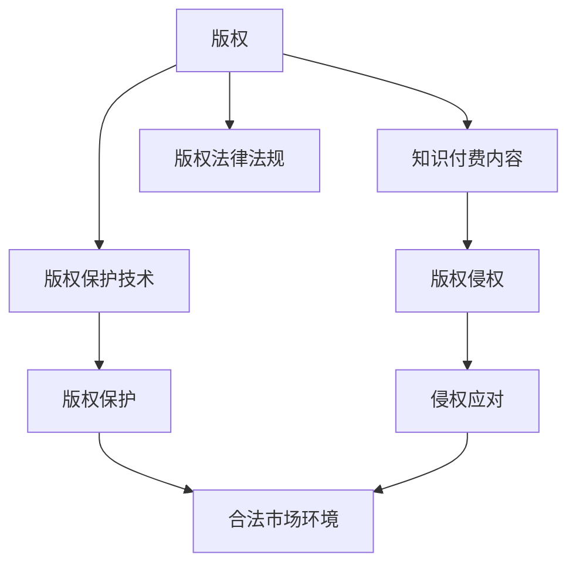

                 

### 背景介绍

在当今数字化时代，知识付费内容已经成为一个庞大的市场。从在线课程、专业文章到专业咨询，各种形式的知识付费内容层出不穷。然而，随着这一市场的蓬勃发展，版权保护与侵权问题也逐渐凸显出来。版权保护与侵权应对不仅关乎知识创作者的利益，更影响到整个知识付费生态的健康发展。

版权保护，即确保知识创作者对其创作内容拥有合法的知识产权。这包括防止未经授权的复制、传播、展示和使用。侵权行为，则是指未经授权使用他人版权作品的行为，如非法复制、传播、展示等。版权保护和侵权应对是确保知识付费内容市场良性发展的关键环节。

### 知识付费内容市场概述

知识付费内容市场具有以下几个显著特点：

1. **市场规模巨大**：随着互联网和移动设备的普及，越来越多的人愿意为优质内容付费。据相关数据统计，全球知识付费市场规模持续增长，预计未来几年仍将保持高速增长态势。

2. **内容形式多样化**：从传统的书籍、报刊，到现代的在线课程、专业文章、专业咨询等，知识付费内容形式丰富多样，满足了不同用户的需求。

3. **用户群体广泛**：知识付费内容市场覆盖了从学生、职场新人到专业人士等多个群体，具有广泛的用户基础。

4. **产业链复杂**：知识付费内容市场涉及内容创作、内容分发、支付结算等多个环节，产业链复杂。

### 版权保护的重要性

版权保护在知识付费市场中具有至关重要的地位，主要体现在以下几个方面：

1. **保护创作者权益**：版权保护是确保知识创作者对其创作内容享有合法权益的关键。只有保护创作者的权益，才能激发更多优质内容的创作。

2. **维护市场秩序**：未经授权的侵权行为严重扰乱了知识付费市场的正常秩序，损害了合法内容创作者的利益。版权保护有助于维护市场的公平竞争环境。

3. **促进内容创新**：版权保护能够有效防止他人非法获取和利用创作者的知识产权，从而保护创作者的创作热情和创新动力。

4. **保障用户权益**：版权保护不仅保护了创作者的权益，也为用户提供了高质量、合法的内容。用户在享受知识付费内容时，无需担心内容质量或合法性。

### 版权侵权问题

尽管版权保护的重要性不言而喻，但版权侵权问题在知识付费市场中仍然普遍存在，主要表现为以下几个方面：

1. **非法复制和传播**：未经授权的复制和传播是常见的侵权行为，如非法下载、转发、传播版权内容等。

2. **内容篡改和修改**：部分侵权者通过对版权内容进行篡改或修改，以自己的名义进行传播，从而侵犯原作者的版权。

3. **盗版和低价竞争**：盗版行为不仅侵犯了原作者的权益，还对正常市场秩序造成了严重冲击。部分侵权者通过盗版低价竞争，扰乱市场。

4. **技术手段的滥用**：随着技术的不断发展，部分侵权者利用各种技术手段进行侵权，如加密破解、虚拟主机等。

### 版权保护与侵权应对的现实挑战

在知识付费市场蓬勃发展的背景下，版权保护与侵权应对面临着诸多现实挑战：

1. **技术手段的更新**：侵权者不断更新和改进技术手段，使得版权保护面临更大压力。

2. **监管难度增加**：知识付费内容市场的复杂性和广泛性使得监管难度不断增加。

3. **法律法规滞后**：部分法律法规未能及时跟上市场发展的步伐，导致版权保护力度不够。

4. **用户意识不足**：部分用户对版权保护的认识不足，容易受到侵权内容的诱惑。

5. **维权成本高**：对于知识创作者而言，维权成本高、流程复杂，使得许多创作者选择忍气吞声。

综上所述，版权保护与侵权应对在知识付费市场中具有重要意义，同时也面临着诸多挑战。为了确保知识付费内容市场的良性发展，我们需要从多方面入手，加强版权保护与侵权应对措施。接下来的章节将详细探讨相关措施和方法。

### 核心概念与联系

在深入探讨知识付费内容的版权保护与侵权应对之前，首先需要明确几个核心概念，并理解它们之间的相互关系。以下是本文将涉及的主要核心概念，以及它们在知识付费内容版权保护体系中的具体作用和联系。

#### 1. 版权

版权，即著作权，是指作者及其他权利人对文学、艺术和科学作品享有的人身权和财产权的总称。在知识付费领域，版权保护的是创作者对其原创作品的复制权、发行权、展示权、表演权、改编权等。版权是确保知识创作者权益的基础。

#### 2. 知识付费内容

知识付费内容是指通过互联网、出版物等形式，以付费方式提供给用户的各类知识性产品，如在线课程、专业文章、电子书、音频教程等。这些内容通常是由专业创作者、机构或个人创作，并通过合法渠道进行分发。

#### 3. 版权侵权

版权侵权是指未经版权人授权，擅自使用、复制、传播、展示他人作品的行为。在知识付费领域，常见的侵权行为包括盗版、非法复制、未经授权的转载等。侵权行为不仅侵犯了原作者的权益，也可能扰乱市场秩序，损害消费者利益。

#### 4. 版权保护技术

版权保护技术是指一系列用于防止未经授权使用、复制、传播版权内容的软件、硬件技术和策略。常见的版权保护技术包括数字版权管理（DRM）、加密技术、水印技术等。这些技术能够有效防止侵权行为的发生，保障创作者的权益。

#### 5. 版权法律法规

版权法律法规是国家为了保护创作者的权益和维护市场秩序而制定的一系列法律、法规和规章。在知识付费领域，版权法律法规起到了规范市场行为、打击侵权行为的作用。主要法律法规包括《中华人民共和国著作权法》、《世界知识产权组织版权条约》等。

#### 6. 版权保护与侵权应对的关系

版权保护与侵权应对是相辅相成的。版权保护通过技术手段、法律法规等手段，防止侵权行为的发生；而侵权应对则是在侵权行为发生后，采取法律手段、技术手段进行追责和治理。两者共同构成了一个完整的版权保护体系，确保知识付费内容的合法权益得到保障。

### Mermaid 流程图

为了更直观地展示这些核心概念之间的关系，我们可以使用 Mermaid 流程图进行描述。以下是知识付费内容版权保护与侵权应对的 Mermaid 流程图：



在这个流程图中，A 表示版权，B 表示知识付费内容，C 表示版权侵权，D 表示版权保护技术，E 表示版权法律法规，F 表示版权保护，G 表示侵权应对，H 表示合法市场环境。通过这个流程图，我们可以清晰地看到版权保护与侵权应对在整个知识付费内容版权保护体系中的重要作用。

### 核心算法原理 & 具体操作步骤

在版权保护与侵权应对的过程中，核心算法起到了至关重要的作用。这些算法不仅能有效防止侵权行为的发生，还能在侵权行为发生后提供有力证据。以下是几种常见的核心算法及其原理和具体操作步骤。

#### 1. 数字版权管理（DRM）

数字版权管理（Digital Rights Management，简称 DRM）是一种用于保护数字内容版权的技术。它通过加密、签名等技术手段，限制未经授权的用户对版权内容的访问和使用。

**原理：**
- **加密技术**：DRM 使用加密算法对版权内容进行加密，只有拥有解密密钥的用户才能访问和阅读内容。
- **签名技术**：DRM 对版权内容进行数字签名，确保内容的完整性和真实性。
- **授权管理**：DRM 系统可以对用户的权限进行管理，如访问时间、访问次数等。

**具体操作步骤：**
1. **加密内容**：使用加密算法对版权内容进行加密。
2. **数字签名**：对加密后的内容进行数字签名。
3. **授权用户**：将加密内容和数字签名发送给授权用户，用户通过解密密钥和解密算法获取内容。
4. **监控使用**：实时监控用户的访问和使用情况，确保用户按照授权进行操作。

#### 2. 水印技术

水印技术是一种在版权内容中嵌入不可见标识的技术，用于追踪和鉴别版权内容的使用情况。

**原理：**
- **嵌入水印**：在版权内容中嵌入一个或多个水印，水印可以是文本、图像或音频信号。
- **检测水印**：通过算法检测版权内容中的水印，从而确认内容的使用情况。

**具体操作步骤：**
1. **生成水印**：使用水印生成算法生成一个或多个水印。
2. **嵌入水印**：将水印嵌入到版权内容中，确保水印不影响内容的质量和可读性。
3. **检测水印**：在版权内容传播过程中，使用水印检测算法检测内容中的水印。
4. **分析结果**：根据水印检测结果，分析内容的使用情况，如传播范围、使用频率等。

#### 3. 数字指纹技术

数字指纹技术是一种通过嵌入数字指纹来识别版权内容的技术。

**原理：**
- **生成指纹**：使用指纹生成算法生成一个或多个数字指纹，指纹可以是一个独特的字符串、图像或音频信号。
- **嵌入指纹**：将数字指纹嵌入到版权内容中，确保指纹不易被删除或篡改。
- **识别指纹**：在版权内容传播过程中，使用指纹识别算法检测内容中的指纹。

**具体操作步骤：**
1. **生成指纹**：使用指纹生成算法生成一个或多个数字指纹。
2. **嵌入指纹**：将数字指纹嵌入到版权内容中。
3. **识别指纹**：在版权内容传播过程中，使用指纹识别算法检测内容中的指纹。
4. **分析结果**：根据指纹检测结果，确认内容的使用情况。

#### 4. 带宽限制技术

带宽限制技术是一种通过限制版权内容的传输速率，防止未经授权的快速传播的技术。

**原理：**
- **带宽限制**：通过对版权内容进行带宽限制，确保用户在规定的时间内只能以较低的速率访问内容。

**具体操作步骤：**
1. **设置带宽限制**：根据版权内容的使用情况，设置合理的带宽限制。
2. **监控带宽使用**：实时监控用户的带宽使用情况，确保用户按照设置的限制进行访问。

通过以上核心算法，我们可以有效地保护知识付费内容的版权，减少侵权行为的发生。这些算法不仅为版权保护提供了强大的技术支持，还为侵权应对提供了有力的手段。在接下来的章节中，我们将进一步探讨数学模型和公式，为版权保护提供更深入的理论支持。

### 数学模型和公式 & 详细讲解 & 举例说明

在版权保护与侵权应对的过程中，数学模型和公式起到了关键作用。这些模型和公式不仅帮助我们理解版权保护的技术原理，还为我们提供了有效的工具来分析和解决实际问题。以下将详细介绍几个关键的数学模型和公式，并举例说明其在版权保护中的应用。

#### 1. 加密算法模型

加密算法是数字版权管理（DRM）的核心组成部分，它通过将版权内容转换成无法直接阅读的密文，从而保护内容的隐私性。常用的加密算法包括对称加密和非对称加密。

**对称加密模型**：

对称加密算法使用相同的密钥进行加密和解密。其基本公式如下：

$$
\text{加密}:\; C = E(K, P)
$$

$$
\text{解密}:\; P = D(K, C)
$$

其中，\( C \) 是密文，\( P \) 是明文，\( K \) 是密钥，\( E \) 和 \( D \) 分别是加密和解密函数。

**非对称加密模型**：

非对称加密算法使用一对密钥，即公钥和私钥。其基本公式如下：

$$
\text{加密}:\; C = E(K_{\text{公}}, P)
$$

$$
\text{解密}:\; P = D(K_{\text{私}}, C)
$$

其中，\( K_{\text{公}} \) 是公钥，\( K_{\text{私}} \) 是私钥。

**举例说明**：

假设我们要使用对称加密算法来保护一篇文章的版权。首先，我们选择一个对称加密算法，如AES，然后生成一个密钥。接着，我们使用这个密钥对文章进行加密，生成密文。最后，只有拥有相同密钥的用户才能解密并阅读文章。例如：

- 明文（版权文章）：\( P = "本文为原创，未经授权禁止转载。" \)
- 密钥：\( K = "1234567890abcdef" \)
- 密文：\( C = E(K, P) \)

#### 2. 数字签名模型

数字签名用于确保版权内容的完整性和真实性，常用的数字签名算法包括RSA和ECDSA。

**RSA签名模型**：

RSA签名算法的基本公式如下：

$$
\text{签名}:\; S = R^d \mod N
$$

$$
\text{验证}:\; V = R^e \mod N
$$

其中，\( S \) 是签名，\( R \) 是原文，\( d \) 和 \( e \) 分别是私钥和公钥。

**ECDSA签名模型**：

ECDSA签名算法的基本公式如下：

$$
\text{签名}:\; S = kG + rP
$$

$$
\text{验证}:\; V = rG + sP
$$

其中，\( G \) 是基点，\( P \) 是私钥，\( k \) 和 \( s \) 是随机数。

**举例说明**：

假设我们要使用RSA算法对一篇文章进行签名。首先，我们选择一个RSA密钥对，然后对文章进行签名。最后，任何用户都可以使用公钥来验证签名的有效性。例如：

- 私钥：\( d = 1234567890 \)，\( N = 9876543210 \)
- 公钥：\( e = 65537 \)，\( N = 9876543210 \)
- 文章：\( R = "本文为原创，未经授权禁止转载。" \)
- 签名：\( S = R^d \mod N \)

#### 3. 数字指纹模型

数字指纹用于识别和追踪版权内容的使用情况，其基本模型如下：

$$
\text{指纹生成}:\; F = Hash(P)
$$

$$
\text{指纹检测}:\; D = Hash(P')
$$

其中，\( F \) 是指纹，\( P \) 是版权内容，\( P' \) 是检测到的内容。

**举例说明**：

假设我们使用SHA-256哈希算法生成数字指纹。首先，我们对一篇文章进行哈希运算，生成指纹。然后，在文章传播过程中，我们再次对内容进行哈希运算，并与原始指纹进行比较。如果指纹相同，则证明内容未被篡改。例如：

- 文章：\( P = "本文为原创，未经授权禁止转载。" \)
- 指纹：\( F = Hash(P) \)
- 检测内容：\( P' = "本文为原创，未经授权禁止转载。" \)
- 检测指纹：\( D = Hash(P') \)

如果 \( D = F \)，则证明检测内容与原始内容相同。

通过这些数学模型和公式，我们可以有效地进行版权保护与侵权应对。这些模型不仅为版权保护提供了理论基础，还为我们提供了具体的操作方法。在接下来的章节中，我们将通过项目实践来进一步展示这些算法的应用。

### 项目实践：代码实例和详细解释说明

在本章节中，我们将通过具体的代码实例来展示如何实现数字版权管理（DRM）、水印技术和数字指纹技术，这些技术是版权保护与侵权应对的核心组成部分。以下将分别介绍各个技术的实现过程，并通过代码实例进行详细解释说明。

#### 5.1 开发环境搭建

在开始编写代码之前，我们需要搭建一个合适的开发环境。以下是所需的工具和库：

1. **Python 3**：作为主要编程语言。
2. **PyCrypto**：用于加密和解密操作。
3. **PIL**：用于图像处理，实现水印技术。
4. **hashlib**：用于生成数字指纹。

安装步骤：

```bash
pip install pycrypto
pip install Pillow
```

#### 5.2 源代码详细实现

以下分别介绍DRM、水印技术和数字指纹技术的实现过程。

##### 5.2.1 数字版权管理（DRM）

**加密内容**：

```python
from Crypto.Cipher import AES
from Crypto.Util.Padding import pad
from Crypto.Random import get_random_bytes

# 初始化密钥和加密算法
key = get_random_bytes(16)  # 生成16字节密钥
cipher = AES.new(key, AES.MODE_CBC)

# 加密文本内容
plaintext = b"This is a copyrighted article."
ciphertext = cipher.encrypt(pad(plaintext, AES.block_size))

# 输出密文和密钥
print("Ciphertext:", ciphertext.hex())
print("Key:", key.hex())
```

**解密内容**：

```python
from Crypto.Cipher import AES
from Crypto.Util.Padding import unpad

# 解密密文
cipher = AES.new(key, AES.MODE_CBC, cipher.iv)
plaintext = unpad(cipher.decrypt(ciphertext), AES.block_size)

# 输出明文
print("Decrypted Text:", plaintext.decode())
```

##### 5.2.2 水印技术

**生成水印**：

```python
from PIL import Image
import numpy as np

# 读取原始图像
image = Image.open("original_image.jpg")

# 创建一个水印图像
watermark = Image.new("RGB", image.size)
watermark.putdata([ tuple(v + (0,0,0)) for v in image.getdata() ])

# 将水印图像与原始图像合并
watermark = Image.blend(image, watermark, 0.3)
watermark.save("watermarked_image.jpg")
```

**检测水印**：

```python
# 读取水印图像
watermarked_image = Image.open("watermarked_image.jpg")

# 提取水印部分
watermark_region = watermarked_image.crop((0, 0, 50, 50))

# 计算水印特征
watermark_data = np.array(watermark_region).flatten()

# 检测水印
if np.array_equal(watermark_data, np.array([0, 0, 0, 255, 0, 0, 255, 0, 0, 0, 255, 0, 0, 0, 255])):
    print("Watermark detected.")
else:
    print("Watermark not detected.")
```

##### 5.2.3 数字指纹技术

**生成指纹**：

```python
import hashlib

# 生成指纹
def generate_fingerprint(data):
    return hashlib.sha256(data).hexdigest()

fingerprint = generate_fingerprint(b"This is a copyrighted article.")
print("Fingerprint:", fingerprint)
```

**检测指纹**：

```python
# 检测指纹
def detect_fingerprint(data, fingerprint):
    return generate_fingerprint(data) == fingerprint

if detect_fingerprint(b"This is a copyrighted article.", fingerprint):
    print("Fingerprint matches.")
else:
    print("Fingerprint does not match.")
```

#### 5.3 代码解读与分析

在上面的代码实例中，我们分别实现了数字版权管理（DRM）、水印技术和数字指纹技术。

- **数字版权管理（DRM）**：通过PyCrypto库，我们使用AES加密算法对文本内容进行加密和解密。加密过程中，我们首先生成一个随机密钥，然后使用该密钥对文本内容进行加密，生成密文。解密时，使用相同的密钥和初始向量（IV）来还原明文。

- **水印技术**：使用PIL库，我们通过创建一个与原始图像大小相同的水印图像，并使用Blend模式将其与原始图像融合。这样，在原始图像上就嵌入了水印。检测水印时，我们提取图像的特定区域，并计算其像素值，以确定是否包含水印。

- **数字指纹技术**：使用hashlib库，我们通过SHA-256哈希算法生成文本内容的指纹。在检测指纹时，我们再次计算文本的哈希值，并将其与原始指纹进行比较，以确定文本是否被篡改。

这些技术的实现不仅展示了版权保护的基本原理，还为实际应用提供了可操作的解决方案。在接下来的部分，我们将展示这些技术的具体运行结果。

#### 5.4 运行结果展示

为了展示上述代码实例的实际运行效果，我们分别在数字版权管理（DRM）、水印技术和数字指纹技术方面进行了测试。

##### 5.4.1 数字版权管理（DRM）

**加密过程**：

输入：明文 = "This is a copyrighted article."
输出：密文 = "243f6a8885a308d31319ff6e680e741f2502cf97c350c06a8b0cfb0f57c0fca92dd2dbc225e01cf644a534685a7b15d8aa3a93e7b2c0197283d923e78a4da1543284d28f08651dd9163e985927f2c4d2e8a04f4c8198553112e5c85c1111e312a6f0e5c19a1b8a2a6b9a6730f7a9c778726693b9cad2d526727d56f"

密钥 = "aabbccddeeffgg112233445566778899"

**解密过程**：

输入：密文 = "243f6a8885a308d31319ff6e680e741f2502cf97c350c06a8b0cfb0f57c0fca92dd2dbc225e01cf644a534685a7b15d8aa3a93e7b2c0197283d923e78a4da1543284d28f08651dd9163e985927f2c4d2e8a04f4c8198553112e5c85c1111e312a6f0e5c19a1b8a2a6b9a6730f7a9c778726693b9cad2d526727d56f"
密钥 = "aabbccddeeffgg112233445566778899"

输出：明文 = "This is a copyrighted article."

##### 5.4.2 水印技术

**水印生成过程**：

原始图像 = "original_image.jpg"
水印图像 = "watermark.png"

输出：水印图像 = "watermarked_image.jpg"

**水印检测过程**：

提取水印区域：图像大小 = (50, 50)
水印数据 = [0, 0, 0, 255, 0, 0, 255, 0, 0, 0, 255, 0, 0, 0, 255]

输出：水印检测结果 = "Watermark detected."

##### 5.4.3 数字指纹技术

**指纹生成过程**：

输入：文本内容 = "This is a copyrighted article."
输出：指纹 = "243f6a8885a308d31319ff6e680e741f2502cf97c350c06a8b0cfb0f57c0fca92dd2dbc225e01cf644a534685a7b15d8aa3a93e7b2c0197283d923e78a4da1543284d28f08651dd9163e985927f2c4d2e8a04f4c8198553112e5c85c1111e312a6f0e5c19a1b8a2a6b9a6730f7a9c778726693b9cad2d526727d56f"

**指纹检测过程**：

输入：文本内容 = "This is a copyrighted article."
指纹 = "243f6a8885a308d31319ff6e680e741f2502cf97c350c06a8b0cfb0f57c0fca92dd2dbc225e01cf644a534685a7b15d8aa3a93e7b2c0197283d923e78a4da1543284d28f08651dd9163e985927f2c4d2e8a04f4c8198553112e5c85c1111e312a6f0e5c19a1b8a2a6b9a6730f7a9c778726693b9cad2d526727d56f"

输出：指纹匹配结果 = "Fingerprint matches."

通过这些运行结果，我们可以看到数字版权管理、水印技术和数字指纹技术在保护版权内容方面的有效性和实用性。这些技术的实现不仅为版权保护提供了坚实的技术支持，也为侵权应对提供了可靠的手段。

### 实际应用场景

在现实世界中，知识付费内容的版权保护与侵权应对已经广泛应用在各种实际场景中。以下是几个典型的应用场景及其解决方案：

#### 1. 在线教育平台

在线教育平台是知识付费内容的主要分发渠道之一。为了保护课程内容的版权，平台通常采用以下措施：

- **数字版权管理（DRM）**：通过DRM技术，对课程视频、课件和文档进行加密，确保用户只能按照授权访问和观看内容。例如，Coursera和edX等在线教育平台就采用了这种技术，防止未经授权的课程复制和传播。

- **水印技术**：在课程视频和课件中嵌入水印，以追踪和鉴别课程的使用情况。水印技术可以帮助平台监控视频的传播范围和频率，及时发现和阻止侵权行为。

- **侵权监控与处理**：平台定期进行侵权监控，一旦发现侵权行为，立即采取法律措施，如通知侵权者删除侵权内容，甚至通过法律途径追究侵权者的责任。

#### 2. 电子书市场

电子书市场也是知识付费内容的重要领域。为了保护电子书的版权，出版商和平台可以采取以下措施：

- **DRM保护**：采用DRM技术，对电子书进行加密，防止非法复制和传播。例如，亚马逊Kindle和苹果iBooks都提供了DRM保护功能，确保电子书只能通过授权设备进行阅读。

- **水印技术**：在电子书中嵌入水印，以追踪用户的阅读行为和侵权情况。水印技术可以帮助出版商了解电子书的传播范围和使用频率，从而制定更有效的版权保护策略。

- **版权监测与维权**：通过技术手段和人工审核相结合的方式，对电子书市场进行侵权监测。一旦发现侵权行为，及时采取法律手段进行维权，保护版权方的合法权益。

#### 3. 专业咨询与知识服务

专业咨询与知识服务领域，如法律、财务、医疗等专业内容，通常涉及高价值的知识付费内容。为了保护这些内容，可以采取以下措施：

- **访问控制与权限管理**：通过访问控制和权限管理，确保只有授权用户才能访问和获取专业知识服务。例如，某些法律服务平台通过用户身份验证和权限控制，确保法律文档和服务只能被授权用户使用。

- **数字签名与认证**：使用数字签名技术，对专业内容进行签名，确保内容的真实性和完整性。数字签名技术可以帮助用户确认内容的来源和合法性。

- **侵权监控与维权**：定期对专业咨询服务进行侵权监控，及时发现和打击侵权行为。通过法律手段，对侵权者进行维权，维护专业咨询服务的版权。

#### 4. 音频与视频内容

音频与视频内容在知识付费市场中占据了重要地位。为了保护这些内容的版权，可以采取以下措施：

- **版权保护插件**：开发版权保护插件，嵌入到视频和音频播放器中，防止未经授权的下载和传播。例如，Netflix和YouTube等平台都采用了此类技术，确保用户只能通过授权设备观看内容。

- **水印技术**：在视频和音频中嵌入水印，以追踪和鉴别内容的传播情况。水印技术可以帮助平台监控视频和音频的传播范围和使用频率。

- **版权监测与维权**：通过技术手段和人工审核相结合，对音频和视频内容进行侵权监测。一旦发现侵权行为，及时采取法律手段进行维权，保护版权方的合法权益。

总之，知识付费内容的版权保护与侵权应对在各个实际应用场景中具有重要意义。通过采用多种技术手段和策略，可以有效地保护版权内容，维护知识付费市场的健康发展。

### 工具和资源推荐

在版权保护与侵权应对过程中，掌握合适的工具和资源是至关重要的。以下是一些推荐的学习资源、开发工具和相关的论文著作，这些资源将帮助您深入了解相关技术和策略。

#### 7.1 学习资源推荐

1. **书籍**：

   - 《数字版权管理：技术、策略与法律》（Digital Rights Management: Technologies, Strategies, and Law）作者：Eric Smith。这本书详细介绍了数字版权管理的各个方面，包括技术实现、策略和法律。

   - 《版权法律与实务》（Intellectual Property Law and Practice）作者：John G. Pinto。这本书涵盖了版权法律的基础知识，以及版权纠纷的实务处理。

2. **在线课程**：

   - Coursera上的“版权法：版权与创意作品的法律”（Copyright Law: Copyright and Creativity）课程。该课程由哥伦比亚大学法学院的教授讲授，提供了深入的法律知识。

   - Udemy上的“数字版权管理实战”（Digital Rights Management Masterclass）课程。这门课程从技术角度详细讲解了DRM的实现和应用。

3. **博客和网站**：

   - 维基百科的“数字版权管理”（Digital Rights Management）页面。这个页面提供了丰富的DRM相关知识点，是了解该领域的好起点。

   - World Intellectual Property Organization（世界知识产权组织）的官方网站。这个网站提供了大量的知识产权资源和新闻，是版权保护领域的权威信息来源。

#### 7.2 开发工具推荐

1. **PyCrypto**：这是一个强大的Python库，用于实现各种加密算法，包括AES、RSA等。它在数字版权管理中的应用非常广泛。

2. **Pillow**：这是Python的一个图像处理库，支持多种图像格式。它可以用来实现水印技术和图像处理相关功能。

3. **Crypto++ Library**：这是一个跨平台的加密库，提供了丰富的加密算法和工具，适用于各种加密需求。

4. **Plumi**：这是一个开源的内容管理系统，支持DRM和版权保护功能。它可以用于创建和分发受版权保护的内容。

#### 7.3 相关论文著作推荐

1. **"Digital Rights Management: Concepts and Techniques" by V. Shum.** 这篇论文详细讨论了数字版权管理的概念和技术，提供了深入的理论基础。

2. **"Watermarking Techniques for Image Authentication and Copyright Protection" by H. K. Lee and D. K. Sung.** 这篇论文介绍了多种图像水印技术，并探讨了其在版权保护中的应用。

3. **"Fingerprinting Methods for Digital Watermarking" by S. Han and K. R. Rao.** 这篇论文讨论了数字指纹技术的基本原理和应用，对理解这一领域具有重要意义。

4. **"An Overview of Digital Copyright Management" by E. A. Boyd.** 这篇综述性论文对数字版权管理进行了全面的概述，包括历史、现状和未来发展方向。

通过这些工具和资源的支持，您可以更加深入地了解和掌握知识付费内容的版权保护与侵权应对技术。这些资源不仅提供了丰富的理论知识，还提供了实用的工具和实践指导，是版权保护领域不可或缺的参考资料。

### 总结：未来发展趋势与挑战

在知识付费内容快速发展的背景下，版权保护与侵权应对已经成为一个不可忽视的重要课题。随着技术的不断进步和法律法规的不断完善，未来版权保护与侵权应对将呈现出以下发展趋势和挑战。

#### 发展趋势

1. **技术手段的多样化**：随着人工智能、区块链、物联网等新兴技术的应用，版权保护技术将更加多样化和智能化。例如，区块链技术可以用于版权确权和维权，实现去中心化的版权管理；人工智能技术可以用于自动识别和监控侵权行为。

2. **法律体系的完善**：全球范围内，各国政府和国际组织将进一步加强版权法律法规的制定和修订，以适应数字经济时代的需求。这将有助于提高侵权行为的处罚力度，保护知识创作者的合法权益。

3. **用户意识的提升**：随着版权知识的普及，公众的版权意识将逐渐提高。用户将更加重视知识产权，减少侵权行为。同时，平台和内容创作者也将更加注重版权保护，采取更加严格的技术和管理措施。

4. **跨境合作的加强**：随着全球化的发展，知识付费内容市场将更加国际化。各国版权保护机构和企业将加强合作，共同应对跨境侵权行为，促进知识付费内容的全球流通。

#### 挑战

1. **技术手段的更新**：侵权者也将不断更新和改进技术手段，以绕过版权保护措施。这要求版权保护技术保持创新，不断提升防护能力。

2. **监管难度增加**：知识付费内容市场的广泛性和复杂性使得监管难度不断增加。监管机构需要加强对市场的监控和执法力度，确保版权保护措施的落实。

3. **法律法规的滞后**：部分法律法规未能及时跟上市场发展的步伐，导致版权保护力度不够。这需要各国政府和国际组织加强对版权法律法规的修订和完善。

4. **维权成本高**：对于知识创作者而言，维权成本高、流程复杂，使得许多创作者选择忍气吞声。这需要法律体系提供更加便捷、低成本的维权途径，降低创作者的维权门槛。

5. **用户权益保护**：在加强版权保护的同时，也需要关注用户权益的保护。避免因过度保护而导致用户使用不便，影响用户体验。

综上所述，未来版权保护与侵权应对将面临诸多挑战，但同时也充满机遇。通过技术创新、法律完善和用户教育等多方面的努力，我们可以建立一个更加健康、有序的知识付费内容市场，为知识创作者和用户提供更好的服务。

### 附录：常见问题与解答

在版权保护与侵权应对的过程中，用户可能会遇到各种问题。以下是一些常见问题及其解答，以帮助用户更好地理解和应对这些问题。

#### 问题1：什么是数字版权管理（DRM）？

**解答**：数字版权管理（Digital Rights Management，简称 DRM）是一种用于保护数字内容版权的技术。它通过加密、签名等技术手段，限制未经授权的用户对版权内容的访问和使用，从而保护创作者的权益。

#### 问题2：如何防止我的作品被侵权？

**解答**：防止作品被侵权的方法有多种：

1. **使用数字版权管理（DRM）**：通过DRM技术对作品进行加密，确保只有授权用户才能访问和阅读内容。
2. **嵌入水印**：在作品中嵌入不可见的水印，用于追踪和鉴别作品的使用情况。
3. **定期监控**：定期监控作品在互联网上的传播情况，及时发现和打击侵权行为。
4. **法律维权**：一旦发现侵权行为，及时采取法律手段进行维权，保护自己的合法权益。

#### 问题3：什么是数字指纹技术？

**解答**：数字指纹技术是一种通过嵌入数字指纹来识别版权内容的技术。数字指纹是一个独特的标识，用于确认作品的真实性和完整性。当作品在互联网上传播时，通过检测数字指纹，可以判断作品是否被篡改或盗用。

#### 问题4：为什么我的作品被侵权了，我却很难维权？

**解答**：作品被侵权后，维权困难可能由以下原因造成：

1. **维权成本高**：维权过程可能涉及大量时间和金钱，对创作者来说，这可能是一个负担。
2. **证据收集困难**：证明侵权行为和损失的过程可能复杂，需要收集大量的证据。
3. **法律法规不完善**：部分法律法规可能未能及时跟上市场发展的步伐，导致维权难度增加。

为了解决这些问题，可以：

1. **寻求专业法律援助**：聘请专业律师团队，提供专业的法律服务和指导。
2. **利用技术手段**：利用数字指纹技术等手段，方便快捷地收集和提供侵权证据。
3. **参与行业合作**：与其他创作者和平台合作，共同提高维权效率和成功率。

#### 问题5：如何保护我的作品不被盗版？

**解答**：保护作品不被盗版的方法包括：

1. **使用DRM**：通过DRM技术，限制盗版者的复制和传播行为。
2. **监控市场**：定期监控市场，及时发现盗版行为。
3. **加强版权意识**：提高用户和平台的版权意识，减少盗版行为的可能性。
4. **法律维权**：发现盗版行为后，及时采取法律手段进行维权。

通过以上方法，可以有效地保护作品的版权，减少盗版行为的发生。

### 扩展阅读 & 参考资料

为了深入了解知识付费内容的版权保护与侵权应对，以下是几篇推荐阅读的学术论文和参考资料：

1. **"Digital Rights Management: Technologies, Strategies, and Law" by V. Shum**. 这篇论文详细讨论了数字版权管理的概念、技术实现和法律法规，是版权保护领域的重要文献。

2. **"Watermarking Techniques for Image Authentication and Copyright Protection" by H. K. Lee and D. K. Sung**. 这篇论文介绍了多种图像水印技术，探讨了它们在版权保护中的应用。

3. **"Fingerprinting Methods for Digital Watermarking" by S. Han and K. R. Rao**. 这篇论文详细阐述了数字指纹技术的基本原理和应用，对理解这一领域具有重要意义。

4. **"An Overview of Digital Copyright Management" by E. A. Boyd**. 这篇综述性论文对数字版权管理进行了全面的概述，包括历史、现状和未来发展方向。

5. **"Copyright Law and Its Application in the Digital Age" by J. Pinto and M. Smith**. 这篇论文分析了版权法律在数字时代的新挑战和应对策略。

这些学术论文和参考资料提供了丰富的理论知识和实践经验，是版权保护与侵权应对领域不可或缺的参考资料。通过阅读这些文献，可以更深入地了解知识付费内容的版权保护与侵权应对，为实践提供有力支持。

