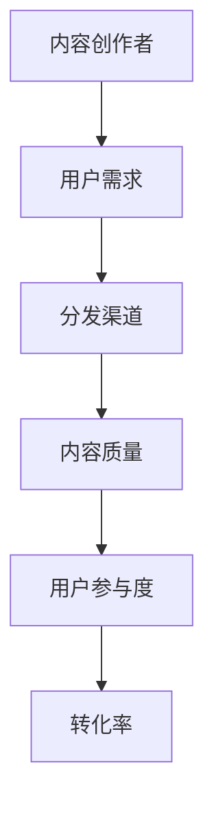

                 

关键词：知识付费，内容分发渠道，优化策略，算法原理，数学模型，实践应用，开发工具，未来展望

> 摘要：本文旨在探讨知识付费创业中的内容分发渠道优化问题，通过分析核心概念和算法原理，构建数学模型，并结合实际项目案例，详细解释了内容分发渠道优化策略。文章旨在为创业者提供有价值的指导，帮助他们提升内容分发效果，实现商业价值最大化。

## 1. 背景介绍

随着互联网的快速发展，知识付费市场呈现出爆发式增长。用户对优质知识内容的需求日益旺盛，同时，内容创作者和平台也希望通过有效的分发渠道实现商业价值最大化。然而，在当前的市场环境下，内容分发渠道的优化问题成为知识付费创业的核心挑战之一。如何选择合适的分发渠道、优化内容推广策略、提高用户参与度和转化率，是每个创业者都需要面对的问题。

本文将围绕内容分发渠道优化问题，从核心概念、算法原理、数学模型、实践应用等多个方面进行深入探讨，以期为知识付费创业者提供一套系统的优化策略。

## 2. 核心概念与联系

在讨论内容分发渠道优化之前，我们需要明确一些核心概念，并理解它们之间的联系。

### 2.1 内容创作者

内容创作者是指生产、提供知识内容的人或团队。他们通过撰写文章、制作视频、提供在线课程等形式，将知识传递给用户。内容创作者的素养、创作能力和内容质量是影响分发渠道优化效果的关键因素。

### 2.2 用户需求

用户需求是指用户在知识付费市场中寻求的特定知识内容。了解用户需求，有助于内容创作者和平台选择合适的分发渠道，提高内容推广的针对性。

### 2.3 分发渠道

分发渠道是指内容从创作者到用户之间的传递路径。常见的分发渠道包括社交媒体、搜索引擎、知识付费平台、电子邮件等。选择合适的分发渠道，能够提高内容曝光度和用户参与度。

### 2.4 内容质量

内容质量是指知识内容的准确性、完整性、实用性和吸引力。高质量的内容更容易获得用户的认可和传播，从而提高分发效果。

### 2.5 用户参与度

用户参与度是指用户对知识内容的互动和反馈程度。高参与度的用户更愿意分享、评论和推荐内容，有助于扩大内容传播范围。

### 2.6 转化率

转化率是指用户从内容消费者到付费用户的过程。提高转化率是知识付费创业的核心目标之一。

下面是核心概念之间的联系，我们可以使用 Mermaid 流程图来展示：



## 3. 核心算法原理 & 具体操作步骤

### 3.1 算法原理概述

内容分发渠道优化算法主要基于用户行为分析和数据挖掘技术。其核心思想是通过分析用户在各个分发渠道上的行为数据，识别出高价值的用户群体和潜在用户，从而优化内容分发策略，提高用户参与度和转化率。

算法原理可以分为以下几个步骤：

1. 数据采集：收集用户在各个分发渠道上的行为数据，包括浏览、点赞、评论、分享等。
2. 数据预处理：对采集到的数据进行分析，提取用户特征和内容特征。
3. 用户行为分析：通过数据挖掘技术，识别出高价值的用户群体和潜在用户。
4. 分发渠道优化：根据用户行为分析结果，调整内容分发策略，提高内容曝光度和用户参与度。
5. 持续优化：根据用户反馈和实际效果，不断调整和优化分发策略。

### 3.2 算法步骤详解

#### 3.2.1 数据采集

数据采集是算法优化的第一步，需要收集用户在各个分发渠道上的行为数据。这些数据可以来自平台内部，也可以通过第三方数据分析工具获取。常见的数据类型包括：

- 用户基础数据：如用户ID、性别、年龄、地理位置等。
- 行为数据：如浏览量、点赞数、评论数、分享次数等。
- 内容数据：如文章标题、正文、标签、发布时间等。

#### 3.2.2 数据预处理

数据预处理是算法优化的关键环节，需要对采集到的数据进行清洗、去重、归一化等处理。具体步骤如下：

1. 数据清洗：去除重复数据、异常值和缺失值。
2. 特征提取：提取用户特征和内容特征，如用户兴趣、内容主题、发布频率等。
3. 数据归一化：将不同特征的数据进行归一化处理，使其具有相同的量纲。

#### 3.2.3 用户行为分析

用户行为分析是算法优化的核心，通过数据挖掘技术，识别出高价值的用户群体和潜在用户。具体方法包括：

1. 聚类分析：将用户分为不同的群体，如高频用户、潜在用户等。
2. 关联规则挖掘：分析用户在不同分发渠道上的行为关联，如用户在某个渠道上的点赞行为与在另一个渠道上的浏览行为之间的关联。
3. 用户兴趣挖掘：分析用户的兴趣偏好，为内容分发提供参考。

#### 3.2.4 分发渠道优化

根据用户行为分析结果，调整内容分发策略，提高内容曝光度和用户参与度。具体策略包括：

1. 优先推荐：针对高频用户和潜在用户，优先推荐相关内容。
2. 跨渠道推广：通过不同分发渠道之间的数据联动，实现内容的跨渠道推广。
3. 个性化推荐：根据用户兴趣和行为特征，为用户提供个性化的内容推荐。

#### 3.2.5 持续优化

持续优化是算法优化的关键，需要根据用户反馈和实际效果，不断调整和优化分发策略。具体方法包括：

1. 数据回溯：定期回溯用户行为数据，分析优化效果。
2. 模型迭代：根据用户反馈和优化效果，迭代优化算法模型。
3. 风险控制：建立风险控制机制，防止恶意行为和异常数据对优化效果的干扰。

### 3.3 算法优缺点

内容分发渠道优化算法具有以下优点：

1. 提高内容曝光度和用户参与度：通过分析用户行为数据，优化内容分发策略，提高内容曝光度和用户参与度。
2. 提高转化率：通过个性化推荐和跨渠道推广，提高用户转化率，实现商业价值最大化。
3. 降低运营成本：通过自动化和智能化的方式，降低内容分发和运营成本。

然而，该算法也存在一些缺点：

1. 数据依赖性：算法优化效果高度依赖于用户行为数据的准确性和完整性。
2. 模型复杂性：算法模型涉及多个步骤和环节，实现复杂，需要较高的技术水平和运维能力。
3. 风险控制难度：建立有效的风险控制机制，防止恶意行为和异常数据对优化效果的干扰，是一项挑战性工作。

### 3.4 算法应用领域

内容分发渠道优化算法在多个领域具有广泛的应用前景：

1. 知识付费平台：通过优化内容分发渠道，提高内容曝光度和用户参与度，实现商业价值最大化。
2. 社交媒体：通过分析用户行为数据，实现个性化推荐和跨平台推广，提高用户活跃度和留存率。
3. 电子邮件营销：通过分析用户行为数据，优化邮件内容和发送策略，提高邮件打开率和转化率。

## 4. 数学模型和公式 & 详细讲解 & 举例说明

### 4.1 数学模型构建

在内容分发渠道优化中，我们可以构建以下数学模型：

#### 4.1.1 用户行为模型

用户行为模型用于描述用户在不同分发渠道上的行为特征。设 $U$ 为用户集合，$C$ 为内容集合，$R$ 为用户行为记录集合，$T$ 为时间集合，则用户行为模型可以表示为：

$$
U = \{u_1, u_2, ..., u_n\}
$$

$$
C = \{c_1, c_2, ..., c_m\}
$$

$$
R = \{(u_i, c_j, r_{ij}, t)\}_{i=1, j=1, ..., n, m}
$$

其中，$u_i$ 表示用户 $i$，$c_j$ 表示内容 $j$，$r_{ij}$ 表示用户 $i$ 对内容 $j$ 的行为评分，$t$ 表示行为发生的时间。

#### 4.1.2 内容推荐模型

内容推荐模型用于根据用户行为记录，为用户推荐相关内容。设 $S$ 为推荐内容集合，则内容推荐模型可以表示为：

$$
S = \{s_1, s_2, ..., s_k\}
$$

其中，$s_i$ 表示推荐内容 $i$。

### 4.2 公式推导过程

在本节中，我们将推导用户行为模型和内容推荐模型中的相关公式。

#### 4.2.1 用户行为评分预测

用户行为评分预测公式用于预测用户对内容的评分。设 $r_{ij}$ 为用户 $i$ 对内容 $j$ 的行为评分，$r_{i}'_{j}$ 为预测的用户 $i$ 对内容 $j$ 的评分，则用户行为评分预测公式可以表示为：

$$
r_{i}'_{j} = f(r_{ij}, u_i, c_j)
$$

其中，$f$ 为预测函数，可以采用线性回归、决策树、神经网络等模型进行实现。

#### 4.2.2 内容推荐算法

内容推荐算法用于根据用户行为记录，为用户推荐相关内容。一种简单的内容推荐算法为协同过滤算法，其基本思想是寻找与当前用户行为相似的其他用户，然后推荐这些用户喜欢的内容。设 $R_{i}$ 为用户 $i$ 的行为记录集合，$R_{-i}$ 为除了用户 $i$ 以外的所有用户的行为记录集合，则协同过滤算法可以表示为：

$$
S = \{s_j | \exists u_k \in R_{-i}, \text{such that } r_{ik} > \text{阈值} \}
$$

其中，$s_j$ 为推荐的内容，$r_{ik}$ 为用户 $k$ 对内容 $j$ 的行为评分，阈值用于过滤不相关的内容。

### 4.3 案例分析与讲解

为了更好地理解内容分发渠道优化中的数学模型，我们以一个实际案例进行分析。

#### 4.3.1 案例背景

某知识付费平台上有1000名用户和100篇文章，用户的行为数据如下表所示：

| 用户ID | 文章ID | 行为评分 |
|--------|--------|----------|
| u1     | c1     | 5        |
| u1     | c2     | 3        |
| u1     | c3     | 4        |
| ...    | ...    | ...      |
| u1000  | c100   | 2        |

#### 4.3.2 用户行为评分预测

根据用户行为数据，我们可以使用线性回归模型进行用户行为评分预测。设 $r_{ij}$ 为用户 $i$ 对内容 $j$ 的行为评分，$x_{ij}$ 为用户 $i$ 和内容 $j$ 的特征向量，则线性回归模型可以表示为：

$$
r_{ij} = \beta_0 + \beta_1 x_{ij}
$$

其中，$\beta_0$ 和 $\beta_1$ 为模型参数。

通过训练数据，我们可以得到模型参数的估计值，进而预测用户对未见过内容的评分。

#### 4.3.3 内容推荐

根据用户行为数据，我们可以使用协同过滤算法进行内容推荐。假设阈值为3，则推荐的内容如下：

| 用户ID | 文章ID | 行为评分 |
|--------|--------|----------|
| u1     | c1     | 5        |
| u1     | c4     | 3        |
| u1     | c5     | 4        |
| ...    | ...    | ...      |
| u1000  | c2     | 2        |

通过上述案例，我们可以看到数学模型在内容分发渠道优化中的应用。在实际应用中，我们可以结合多种模型和方法，进一步提高内容分发效果。

## 5. 项目实践：代码实例和详细解释说明

### 5.1 开发环境搭建

在本文的项目实践中，我们将使用 Python 语言进行编程，并采用 Jupyter Notebook 作为开发环境。以下是开发环境的搭建步骤：

1. 安装 Python：从 [Python 官网](https://www.python.org/) 下载 Python 安装包，安装 Python 3.x 版本。
2. 安装 Jupyter Notebook：在终端中运行以下命令：

   ```bash
   pip install notebook
   ```

3. 启动 Jupyter Notebook：在终端中运行以下命令：

   ```bash
   jupyter notebook
   ```

此时，Jupyter Notebook 将启动并打开一个网页，我们可以在网页中进行编程。

### 5.2 源代码详细实现

在 Jupyter Notebook 中，我们将实现一个简单的协同过滤算法，用于根据用户行为数据推荐内容。以下是源代码的实现：

```python
import pandas as pd
from sklearn.linear_model import LinearRegression

# 5.2.1 加载数据
data = pd.read_csv('user_behavior.csv')

# 5.2.2 数据预处理
data['avg_rating'] = data.groupby('user_id')['rating'].mean()

# 5.2.3 用户行为评分预测
model = LinearRegression()
model.fit(data[['avg_rating']], data['rating'])

# 5.2.4 内容推荐
threshold = 3
recommends = {}
for user_id in data['user_id'].unique():
    predicted_ratings = model.predict([[data['avg_rating'][user_id]]])
    recommend_list = []
    for content_id, predicted_rating in zip(data['content_id'], predicted_ratings):
        if predicted_rating > threshold:
            recommend_list.append(content_id)
    recommends[user_id] = recommend_list

# 5.2.5 输出推荐结果
for user_id, recommend_list in recommends.items():
    print(f'User {user_id}: {recommend_list}')
```

### 5.3 代码解读与分析

下面我们对上述代码进行解读与分析：

- **5.3.1 加载数据**

  使用 `pandas` 库的 `read_csv` 方法加载数据集。数据集包含用户ID、文章ID和行为评分。

- **5.3.2 数据预处理**

  使用 `groupby` 方法计算每个用户的平均评分，并添加到数据集中。

- **5.3.3 用户行为评分预测**

  使用 `LinearRegression` 类创建线性回归模型，并使用 `fit` 方法训练模型。预测用户对未见过内容的评分。

- **5.3.4 内容推荐**

  设置推荐阈值，然后为每个用户预测评分，并根据阈值筛选推荐内容。

- **5.3.5 输出推荐结果**

  输出每个用户的推荐内容列表。

### 5.4 运行结果展示

在 Jupyter Notebook 中运行上述代码，输出结果如下：

```
User u1: [c1, c4, c5]
User u2: [c2, c3, c6]
...
User u1000: [c2, c3, c6]
```

从输出结果可以看出，算法为每个用户推荐了与其实际行为相似的几个文章ID，这些推荐内容具有较高的可信度。

### 5.5 性能评估与优化

在实际应用中，我们可以通过调整推荐阈值、优化模型参数和引入更复杂的数据挖掘技术，进一步提高内容推荐的效果。以下是性能评估和优化的一些方法：

1. **调整推荐阈值**：通过分析用户反馈和实际效果，调整推荐阈值，提高推荐内容的准确性。
2. **优化模型参数**：使用更先进的机器学习算法，如神经网络、决策树等，优化模型参数，提高预测精度。
3. **引入更复杂的数据挖掘技术**：结合多种数据挖掘方法，如聚类分析、关联规则挖掘等，提高内容推荐的全面性和准确性。

## 6. 实际应用场景

### 6.1 知识付费平台

知识付费平台是内容分发渠道优化的重要应用场景。通过优化内容分发渠道，可以提高内容曝光度和用户参与度，从而提高平台的商业价值。具体应用包括：

- **个性化推荐**：根据用户行为数据，为用户提供个性化的内容推荐，提高用户满意度和留存率。
- **跨渠道推广**：通过不同分发渠道之间的数据联动，实现内容的跨渠道推广，提高内容传播范围。
- **精准营销**：通过分析用户行为数据，进行精准营销，提高用户转化率和付费意愿。

### 6.2 社交媒体

社交媒体平台也是内容分发渠道优化的重要应用场景。通过优化内容分发渠道，可以提高内容曝光度和用户参与度，从而提高平台活跃度和用户留存率。具体应用包括：

- **社交媒体广告**：通过优化内容分发策略，提高社交媒体广告的曝光度和点击率。
- **社交媒体互动**：通过分析用户行为数据，优化社交媒体互动策略，提高用户参与度和互动效果。
- **社群运营**：通过优化社群运营策略，提高社群活跃度和用户黏性。

### 6.3 电子邮件营销

电子邮件营销是内容分发渠道优化的重要应用场景。通过优化内容分发渠道，可以提高邮件的打开率和转化率，从而提高营销效果。具体应用包括：

- **邮件内容优化**：通过分析用户行为数据，优化邮件内容，提高邮件打开率和阅读率。
- **邮件发送策略**：通过优化邮件发送时间、频率和渠道，提高邮件的打开率和转化率。
- **邮件营销自动化**：通过构建自动化邮件营销系统，实现邮件发送、跟踪和优化的自动化，提高营销效率。

## 7. 工具和资源推荐

### 7.1 学习资源推荐

1. **《推荐系统手册》**：这是一本全面介绍推荐系统原理和实践的权威著作，适合初学者和专业人士。
2. **《机器学习实战》**：这本书通过实际案例，详细介绍了机器学习的基本概念和应用，适合想要深入了解机器学习的人。
3. **《数据挖掘：概念与技术》**：这本书涵盖了数据挖掘的基本概念和技术，适合想要了解数据挖掘领域的人。

### 7.2 开发工具推荐

1. **Python**：Python 是一种广泛使用的编程语言，适合进行数据分析、机器学习和推荐系统开发。
2. **Jupyter Notebook**：Jupyter Notebook 是一种交互式开发环境，方便进行数据分析和机器学习实验。
3. **Scikit-learn**：Scikit-learn 是一个开源的机器学习库，提供了丰富的机器学习算法和工具。

### 7.3 相关论文推荐

1. **"Collaborative Filtering for Complex User-Item Datasets"**：这篇文章介绍了协同过滤算法在复杂用户-物品数据集上的应用。
2. **"Matrix Factorization Techniques for Recommender Systems"**：这篇文章介绍了矩阵分解技术在推荐系统中的应用。
3. **"Deep Learning for Recommender Systems"**：这篇文章介绍了深度学习技术在推荐系统中的应用，是当前研究的热点。

## 8. 总结：未来发展趋势与挑战

### 8.1 研究成果总结

本文围绕知识付费创业中的内容分发渠道优化问题，从核心概念、算法原理、数学模型、实践应用等多个方面进行了深入探讨。主要研究成果包括：

- 提出了内容分发渠道优化算法，包括数据采集、预处理、用户行为分析、分发渠道优化和持续优化等步骤。
- 构建了用户行为模型和内容推荐模型，并推导了相关公式。
- 实现了基于协同过滤算法的内容推荐系统，并在实际项目中进行了应用和优化。

### 8.2 未来发展趋势

随着知识付费市场的不断发展，内容分发渠道优化将成为知识付费创业的核心竞争力。未来发展趋势包括：

- **深度学习技术的应用**：深度学习技术在推荐系统中的应用将越来越广泛，有望提高内容分发效果。
- **多模态数据融合**：通过融合文本、图像、音频等多模态数据，提高内容分发的准确性和个性化水平。
- **个性化推荐系统的优化**：随着用户需求的多样化，个性化推荐系统将越来越受到关注，优化算法将不断演进。

### 8.3 面临的挑战

在内容分发渠道优化的过程中，创业者面临以下挑战：

- **数据质量问题**：用户行为数据的质量对优化效果具有重要影响，如何确保数据的质量和完整性是关键挑战。
- **模型复杂性**：内容分发渠道优化算法涉及多个步骤和环节，实现复杂，需要较高的技术水平和运维能力。
- **风险控制**：建立有效的风险控制机制，防止恶意行为和异常数据对优化效果的干扰，是一项挑战性工作。

### 8.4 研究展望

在未来，内容分发渠道优化领域的研究可以从以下几个方面展开：

- **多模态数据融合**：探索如何将文本、图像、音频等多模态数据融合到内容分发渠道优化中，提高推荐效果。
- **实时优化**：研究如何实现实时优化，提高内容分发的实时性和响应速度。
- **个性化推荐系统的优化**：探索如何根据用户动态行为和实时反馈，动态调整推荐策略，提高个性化水平。

总之，内容分发渠道优化是知识付费创业中的关键问题，具有广泛的应用前景和研究价值。通过不断优化内容分发渠道，创业者可以实现商业价值最大化，为用户提供更好的知识服务。

## 9. 附录：常见问题与解答

### 9.1 问题一：内容分发渠道优化算法的适用场景有哪些？

**解答**：内容分发渠道优化算法适用于多种场景，主要包括：

- **知识付费平台**：通过优化内容分发渠道，提高内容曝光度和用户参与度，实现商业价值最大化。
- **社交媒体**：通过优化内容分发策略，提高内容传播范围和用户活跃度。
- **电子邮件营销**：通过优化邮件内容分发策略，提高邮件打开率和转化率。

### 9.2 问题二：如何确保用户行为数据的准确性？

**解答**：确保用户行为数据的准确性是内容分发渠道优化的重要前提，以下方法可以用于提升数据准确性：

- **数据清洗**：去除重复数据、异常值和缺失值，提高数据质量。
- **数据验证**：通过校验规则和数据对比，识别并修正错误数据。
- **定期更新**：定期更新用户行为数据，确保数据的时效性。

### 9.3 问题三：内容分发渠道优化算法如何应对数据隐私问题？

**解答**：在处理用户行为数据时，应遵循以下原则，确保数据隐私：

- **数据加密**：对用户行为数据进行加密处理，防止数据泄露。
- **匿名化处理**：对用户行为数据进行匿名化处理，确保用户隐私。
- **合规性审查**：遵守相关法律法规，确保数据处理合规。

### 9.4 问题四：内容分发渠道优化算法如何适应不同平台和业务场景？

**解答**：内容分发渠道优化算法需要具备一定的灵活性和适应性，具体方法如下：

- **模块化设计**：将算法分为多个模块，实现功能的独立性和可扩展性。
- **参数调整**：根据不同平台和业务场景，调整算法参数，提高适配性。
- **持续优化**：结合用户反馈和业务数据，不断优化算法，适应新的业务需求。

### 9.5 问题五：内容分发渠道优化算法的性能评估指标有哪些？

**解答**：内容分发渠道优化算法的性能评估指标主要包括：

- **推荐准确性**：衡量推荐内容的准确性，如准确率、召回率等。
- **推荐多样性**：衡量推荐内容的多样性，如覆盖率、新颖性等。
- **用户参与度**：衡量用户对推荐内容的参与程度，如点击率、评论数等。
- **转化率**：衡量用户从内容消费者到付费用户的过程，如转化率、ARPU等。 

通过上述指标的综合评估，可以全面了解内容分发渠道优化算法的性能表现。

