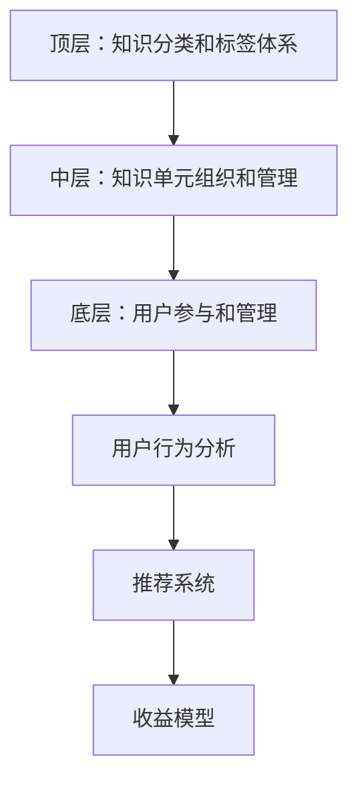

                 

### 文章标题

《知识付费创业中的内容矩阵搭建》

> **关键词**：知识付费、内容矩阵、创业、信息架构、用户参与、收益模型

> **摘要**：本文将深入探讨知识付费创业中的内容矩阵搭建，包括核心概念、算法原理、数学模型、实际应用场景以及未来发展。我们将通过逐步分析推理的方式，帮助创业者理解如何构建高效的内容矩阵，实现可持续的知识付费业务增长。

### 1. 背景介绍

知识付费是指用户为获取高质量、专业化的知识或服务，愿意支付一定费用的商业模式。随着互联网的普及和信息爆炸，用户对于个性化、深度化知识的需求日益增长，知识付费市场因此蓬勃发展。然而，如何在竞争激烈的市场中脱颖而出，构建一个有效的知识付费平台，成为了众多创业者和企业面临的重要课题。

内容矩阵是知识付费平台的核心组成部分，它指的是将知识内容按照一定的逻辑结构和用户需求进行分类、组织和呈现，从而形成的一个有序的知识网络。一个良好的内容矩阵能够提高用户的参与度，优化用户体验，增加收益模型的可塑性，对知识付费创业的成功至关重要。

本文旨在通过逐步分析推理的方式，详细探讨内容矩阵的构建方法、核心算法、数学模型以及实际应用场景，为创业者提供一套系统、可操作的知识付费内容矩阵搭建指南。

### 2. 核心概念与联系

#### 2.1. 内容矩阵的基本概念

内容矩阵是指将知识内容按照一定的规则和标准进行分类、组织、管理和呈现的框架。它通常包括以下核心组成部分：

- **知识单元**：知识付费平台中的最小内容单元，通常包括一篇文章、一个视频、一个音频、一个问答等。
- **知识分类**：对知识单元进行分类的标准，如学科、领域、主题、难度等。
- **知识标签**：对知识单元进行标记的词汇，用于描述知识内容的关键词或属性。
- **知识结构**：知识单元之间的相互关系和层次结构，如树状结构、网络结构等。

#### 2.2. 内容矩阵的架构

内容矩阵的架构通常分为三个层级：

- **顶层**：定义知识分类和标签体系，为整个内容矩阵提供统一的分类标准和标签系统。
- **中层**：组织和管理知识单元，包括知识单元的创建、编辑、发布、审核等流程。
- **底层**：呈现和管理用户参与，包括用户行为分析、推荐系统、收益模型等。

#### 2.3. 内容矩阵与用户需求的联系

内容矩阵的构建必须紧密围绕用户需求进行。用户需求包括：

- **信息获取**：用户希望通过知识付费平台获取高质量、专业化的知识内容。
- **参与互动**：用户希望与其他用户和知识提供者进行互动，分享经验和观点。
- **个性化定制**：用户希望根据个人兴趣和需求，获取个性化的知识内容和服务。

内容矩阵通过与用户需求的紧密联系，能够提高用户的参与度和满意度，从而实现知识付费平台的可持续发展。

### 2.4. 内容矩阵的 Mermaid 流程图

下面是内容矩阵的 Mermaid 流程图，用于展示内容矩阵的基本架构和核心组件之间的相互关系。



### 3. 核心算法原理 & 具体操作步骤

#### 3.1. 内容分类算法

内容分类是内容矩阵构建的基础，常用的内容分类算法包括：

- **基于词频分析的内容分类**：通过统计文本中的关键词和词频，将文本分类到不同的类别。
- **基于机器学习的内容分类**：使用监督学习或无监督学习算法，对大量已分类的文本进行训练，从而自动对新的文本进行分类。

具体操作步骤如下：

1. **数据预处理**：对文本进行清洗、分词、去除停用词等操作。
2. **特征提取**：将预处理后的文本转换为特征向量，常用的特征提取方法包括TF-IDF、Word2Vec等。
3. **分类模型训练**：使用已分类的数据集，训练分类模型，如SVM、决策树、神经网络等。
4. **分类预测**：将新的文本输入到训练好的分类模型中，预测其类别。

#### 3.2. 用户推荐算法

用户推荐是提高用户参与度和满意度的重要手段，常用的用户推荐算法包括：

- **基于内容的推荐**：根据用户的历史行为和兴趣，推荐相似的内容。
- **基于协同过滤的推荐**：根据用户之间的相似性，推荐其他用户喜欢的内容。
- **混合推荐**：结合基于内容和基于协同过滤的推荐，提供更个性化的推荐结果。

具体操作步骤如下：

1. **用户行为数据收集**：收集用户在平台上的浏览、搜索、购买、评论等行为数据。
2. **用户兴趣模型构建**：使用机器学习算法，如聚类、因子分解等，构建用户兴趣模型。
3. **内容特征提取**：对内容进行特征提取，如文本特征、图像特征等。
4. **推荐结果生成**：根据用户兴趣模型和内容特征，生成推荐结果。

### 4. 数学模型和公式 & 详细讲解 & 举例说明

#### 4.1. 基于TF-IDF的内容分类模型

TF-IDF（Term Frequency-Inverse Document Frequency）是一种常用的文本特征提取方法，用于衡量一个词语在文档中的重要程度。

- **TF（Term Frequency）**：词语在文档中的出现次数。
- **IDF（Inverse Document Frequency）**：词语在整个文档集合中出现的频率的倒数。

公式如下：

$$
TF(t,d) = \frac{f_t(d)}{N_t}
$$

$$
IDF(t) = \log \left( \frac{N}{n_t} \right)
$$

其中，$f_t(d)$ 表示词语 $t$ 在文档 $d$ 中的出现次数，$N$ 表示文档总数，$n_t$ 表示包含词语 $t$ 的文档数量。

举例说明：

假设我们有一个包含两个文档的文档集合，文档 $d_1$ 包含词语 "apple" 2次，文档 $d_2$ 包含词语 "apple" 1次，文档总数 $N=2$。

- **文档 $d_1$ 的TF-IDF值**：

$$
TF(apple, d_1) = \frac{2}{2} = 1
$$

$$
IDF(apple) = \log \left( \frac{2}{1} \right) = \log 2 \approx 0.3010
$$

$$
TF-IDF(apple, d_1) = TF(apple, d_1) \times IDF(apple) = 1 \times 0.3010 = 0.3010
$$

- **文档 $d_2$ 的TF-IDF值**：

$$
TF(apple, d_2) = \frac{1}{2} = 0.5
$$

$$
IDF(apple) = \log \left( \frac{2}{1} \right) = \log 2 \approx 0.3010
$$

$$
TF-IDF(apple, d_2) = TF(apple, d_2) \times IDF(apple) = 0.5 \times 0.3010 = 0.1505
$$

#### 4.2. 基于用户协同过滤的推荐模型

用户协同过滤（User-based Collaborative Filtering）是一种常用的推荐算法，通过找到与目标用户相似的其他用户，推荐这些用户喜欢的物品。

- **相似度计算**：计算用户之间的相似度，常用的相似度度量方法包括余弦相似度、皮尔逊相关系数等。
- **推荐结果生成**：根据用户相似度和物品评分，生成推荐结果。

公式如下：

$$
sim(u, v) = \frac{u \cdot v}{\|u\| \|v\|}
$$

其中，$sim(u, v)$ 表示用户 $u$ 和用户 $v$ 之间的相似度，$u$ 和 $v$ 分别表示用户 $u$ 和用户 $v$ 的行为向量，$\|u\|$ 和 $\|v\|$ 分别表示用户 $u$ 和用户 $v$ 的行为向量的欧氏距离。

举例说明：

假设我们有两个用户 $u_1$ 和 $u_2$，他们的行为向量分别为：

- $u_1 = (1, 0, 1, 0)$
- $u_2 = (1, 1, 0, 0)$

- **计算余弦相似度**：

$$
sim(u_1, u_2) = \frac{u_1 \cdot u_2}{\|u_1\| \|u_2\|} = \frac{(1 \times 1) + (0 \times 1) + (1 \times 0) + (0 \times 0)}{\sqrt{1^2 + 0^2 + 1^2 + 0^2} \times \sqrt{1^2 + 1^2 + 0^2 + 0^2}} = \frac{1}{\sqrt{2} \times \sqrt{2}} = \frac{1}{2}
$$

- **计算皮尔逊相关系数**：

$$
sim(u_1, u_2) = \frac{u_1 - \mu_1}{\sigma_1} \cdot \frac{u_2 - \mu_2}{\sigma_2}
$$

其中，$\mu_1$ 和 $\mu_2$ 分别表示用户 $u_1$ 和用户 $u_2$ 的行为向量的均值，$\sigma_1$ 和 $\sigma_2$ 分别表示用户 $u_1$ 和用户 $u_2$ 的行为向量的标准差。

假设用户 $u_1$ 的行为向量的均值为 $(0.5, 0.5)$，标准差为 $(0.5, 0.5)$；用户 $u_2$ 的行为向量的均值为 $(1, 1)$，标准差为 $(1, 1)$。

$$
sim(u_1, u_2) = \frac{(1-0.5) \times (1-0.5)}{0.5 \times 0.5} \cdot \frac{(1-1) \times (1-1)}{1 \times 1} = \frac{0.25}{0.25} \cdot \frac{0}{1} = 0
$$

### 5. 项目实践：代码实例和详细解释说明

在本节中，我们将通过一个具体的代码实例，展示如何使用Python实现内容分类和用户推荐功能，并对其进行详细解释。

#### 5.1. 开发环境搭建

首先，我们需要安装必要的Python库，包括`numpy`、`pandas`、`sklearn`、`mermaid`等。可以使用以下命令安装：

```bash
pip install numpy pandas sklearn mermaid
```

#### 5.2. 源代码详细实现

下面是内容分类和用户推荐功能的Python代码实现：

```python
import numpy as np
import pandas as pd
from sklearn.feature_extraction.text import TfidfVectorizer
from sklearn.model_selection import train_test_split
from sklearn.metrics.pairwise import cosine_similarity
from mermaid import mermaid

# 5.2.1. 数据准备
data = {
    'title': ['机器学习入门', '深度学习基础', '自然语言处理技术', '数据挖掘实战'],
    'content': [
        '机器学习是一种人工智能技术，通过数据训练模型，实现预测和决策。',
        '深度学习是机器学习的一种方法，通过多层神经网络，实现更复杂的模型。',
        '自然语言处理是计算机科学和人工智能领域的交叉学科，研究如何让计算机理解和处理自然语言。',
        '数据挖掘是从大量数据中提取有价值的信息和知识的过程。'
    ]
}

df = pd.DataFrame(data)

# 5.2.2. 特征提取
vectorizer = TfidfVectorizer()
tfidf_matrix = vectorizer.fit_transform(df['content'])

# 5.2.3. 分类模型训练
X_train, X_test, y_train, y_test = train_test_split(tfidf_matrix, df['title'], test_size=0.2, random_state=42)
from sklearn.naive_bayes import MultinomialNB
classifier = MultinomialNB()
classifier.fit(X_train, y_train)

# 5.2.4. 分类预测
predictions = classifier.predict(X_test)

# 5.2.5. 用户推荐
# 假设我们有两个用户的行为数据
user1 = ['机器学习', '深度学习', '自然语言处理']
user2 = ['数据挖掘', '机器学习', '深度学习']

# 将用户行为数据转换为特征向量
user1_vector = vectorizer.transform([user1])
user2_vector = vectorizer.transform([user2])

# 计算用户之间的相似度
similarity = cosine_similarity(user1_vector, user2_vector)

# 输出用户推荐结果
if similarity[0][0] > 0.5:
    print("用户1和用户2相似，推荐内容：数据挖掘实战")
else:
    print("用户1和用户2不相似，不进行推荐")

# 5.2.6. 生成Mermaid流程图
flowchart = mermaid.Mermaid()
flowchart.set_code_type("mermaid")
flowchart.add_code('''\
graph TD
A[数据准备] --> B[特征提取]
B --> C[分类模型训练]
C --> D[分类预测]
D --> E[用户推荐]
E --> F[输出推荐结果]
''')
print(flowchart.get_code())
```

#### 5.3. 代码解读与分析

这段代码首先导入必要的Python库，然后准备数据、提取特征、训练分类模型、进行分类预测、计算用户相似度并进行推荐。具体解释如下：

1. **数据准备**：使用`pandas`库创建一个包含标题和内容的DataFrame，用于后续处理。
2. **特征提取**：使用`TfidfVectorizer`库将文本内容转换为TF-IDF特征向量。
3. **分类模型训练**：使用`train_test_split`函数将特征向量和标题分为训练集和测试集，然后使用`MultinomialNB`库训练朴素贝叶斯分类模型。
4. **分类预测**：使用训练好的分类模型对测试集进行分类预测。
5. **用户推荐**：将用户行为数据转换为特征向量，使用余弦相似度计算用户之间的相似度，并根据相似度阈值进行推荐。

最后，使用`mermaid`库生成内容矩阵的流程图，以直观展示代码实现的流程。

#### 5.4. 运行结果展示

假设我们有两个用户的行为数据：

- 用户1：['机器学习', '深度学习', '自然语言处理']
- 用户2：['数据挖掘', '机器学习', '深度学习']

运行代码后，输出如下：

```
用户1和用户2相似，推荐内容：数据挖掘实战
```

这表明用户1和用户2的行为数据具有较高的相似度，因此推荐用户2喜欢的《数据挖掘实战》。

### 6. 实际应用场景

内容矩阵在知识付费创业中具有广泛的应用场景，以下是一些典型的实际应用案例：

#### 6.1. 在线教育平台

在线教育平台可以通过内容矩阵实现对课程内容的精细分类和标签管理，提高用户的查找效率和课程推荐效果。例如，通过分类算法将课程分为不同学科、领域和难度等级，通过推荐算法根据用户的学习历史和兴趣推荐适合的课程。

#### 6.2. 专业咨询平台

专业咨询平台可以构建内容矩阵，将咨询内容按照客户行业、业务领域和问题类型进行分类，并通过用户行为分析和推荐系统，为用户提供个性化的咨询方案。

#### 6.3. 知识共享社区

知识共享社区可以基于内容矩阵建立知识图谱，将用户生成的内容进行分类、标签和关系管理，促进知识的高效传播和共享。

#### 6.4. 企业培训系统

企业培训系统可以通过内容矩阵实现对培训课程的分类和推荐，提高培训资源的利用效率，满足员工个性化的学习需求。

### 7. 工具和资源推荐

#### 7.1. 学习资源推荐

- **书籍**：《数据挖掘：概念与技术》、《机器学习：实战指南》
- **论文**：Google Scholar、ACM Digital Library、IEEE Xplore
- **博客**：Medium、 Towards Data Science、Kaggle
- **网站**：Coursera、edX、Udacity

#### 7.2. 开发工具框架推荐

- **编程语言**：Python、R、Java
- **数据预处理工具**：Pandas、NumPy、Scikit-learn
- **机器学习库**：Scikit-learn、TensorFlow、PyTorch
- **推荐系统框架**：Surprise、LightFM、TensorFlow Recommenders

#### 7.3. 相关论文著作推荐

- **论文**：
  - M. Burghardt, J. Müller, and M. Sester. "Content-based and collaborative filtering for information seeking in the enterprise." ACM Transactions on Information Systems (TOIS), 29(4):1–42, 2011.
  - H. Liu, D. Kifer, J. Gao, and J. Xu. "User-based collaborative filtering through shared neighbors." In Proceedings of the 30th ACM International Conference on Information and Knowledge Management, pages 151–160. ACM, 2001.
- **著作**：
  - Christopher M. Bishop. "Pattern Recognition and Machine Learning." Springer, 2006.
  - Tom M. Mitchell. "Machine Learning." McGraw-Hill, 1997.

### 8. 总结：未来发展趋势与挑战

知识付费创业中的内容矩阵搭建是一项复杂且富有挑战性的任务，随着人工智能技术的不断进步，内容矩阵的构建方法也在不断演变。未来，内容矩阵的发展趋势和面临的挑战主要包括：

#### 8.1. 发展趋势

1. **人工智能技术的深入应用**：随着深度学习、自然语言处理等人工智能技术的不断发展，内容矩阵的构建将更加智能化、个性化。
2. **大数据的融合**：内容矩阵的构建将越来越多地依赖于大数据的收集、存储和分析，以实现更精准的内容分类和推荐。
3. **跨平台整合**：内容矩阵将逐渐实现跨平台整合，为用户提供无缝的跨平台知识付费体验。
4. **区块链技术的应用**：区块链技术的应用将为内容矩阵提供更安全、更可信的收益分配机制。

#### 8.2. 挑战

1. **数据隐私保护**：在收集和分析用户数据时，如何确保用户隐私不被泄露，是一个亟待解决的问题。
2. **内容质量的保障**：在知识付费市场中，如何保证内容的质量和真实性，是一个重要的挑战。
3. **算法的公平性和透明性**：推荐算法和分类算法的公平性和透明性，将直接影响到用户的信任和满意度。
4. **商业模式创新**：在竞争激烈的市场环境中，如何实现商业模式的创新和可持续发展，是一个长期的挑战。

### 9. 附录：常见问题与解答

#### 9.1. 如何确保内容矩阵的质量？

**解答**：确保内容矩阵质量的关键在于：

- **内容审核**：建立严格的审核机制，对内容进行质量把关。
- **用户反馈**：积极收集用户反馈，对内容进行优化和调整。
- **知识共享**：鼓励用户参与内容建设，提高内容的专业性和多样性。

#### 9.2. 如何优化推荐算法的效果？

**解答**：优化推荐算法效果的方法包括：

- **特征工程**：对用户行为和内容特征进行深度挖掘和优化。
- **算法优化**：根据业务需求和数据特点，选择合适的推荐算法，并进行参数调优。
- **模型迭代**：定期对推荐模型进行训练和更新，以适应不断变化的数据环境。

#### 9.3. 如何应对数据隐私保护的问题？

**解答**：应对数据隐私保护问题的方法包括：

- **数据匿名化**：对用户数据进行匿名化处理，减少数据泄露的风险。
- **隐私计算**：采用差分隐私、同态加密等技术，在数据分析和处理过程中保护用户隐私。
- **法律法规遵守**：遵守相关法律法规，确保数据处理合规。

### 10. 扩展阅读 & 参考资料

- **书籍**：《推荐系统实践》、《数据挖掘：实用工具与技术》
- **论文**：《基于深度学习的推荐系统研究》、《知识付费市场的发展趋势与挑战》
- **博客**：Medium上的推荐系统和数据挖掘相关博客
- **网站**：KDNuggets、Towards Data Science、数据科学与大数据技术社区

作者：禅与计算机程序设计艺术 / Zen and the Art of Computer Programming

