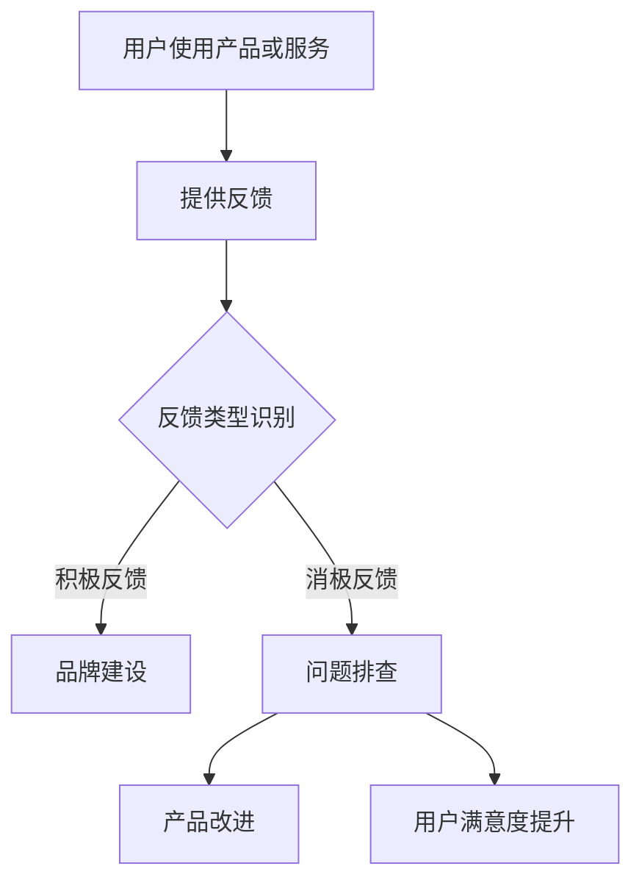

                 

### 背景介绍

知识付费作为一种新兴的商业模式，近年来在全球范围内迅速崛起。它允许创作者和专家通过提供专业的知识和技能来获取收益，而用户则可以按照自己的需求选择购买这些内容。这一模式在教育培训、在线课程、专业咨询、内容创作等多个领域得到广泛应用。随着互联网技术的不断进步和用户需求的多样化，知识付费市场呈现出蓬勃发展的态势。

在这个背景下，用户反馈在知识付费创业中扮演着至关重要的角色。用户反馈不仅是产品和服务改进的宝贵资源，也是企业了解用户需求、优化用户体验、提升品牌忠诚度的关键途径。因此，如何有效地收集和应用用户反馈，成为了知识付费创业企业面临的重大课题。

用户反馈可以来源于多个渠道，包括用户评价、评论、问卷调查、在线互动等。这些反馈提供了用户对产品和服务满意度的直接反馈，有助于企业了解用户的实际需求和痛点。同时，用户反馈还能帮助企业预测未来的市场趋势，从而做出更为精准的战略决策。

本文旨在探讨用户反馈在知识付费创业中的应用，包括用户反馈的收集方法、处理流程、分析工具以及在实际运营中的具体运用。通过对用户反馈的深入分析，企业可以更好地理解用户需求，优化产品和服务，提升用户满意度和忠诚度，从而在激烈的市场竞争中脱颖而出。

### 核心概念与联系

要深入探讨用户反馈在知识付费创业中的应用，我们首先需要明确几个核心概念：用户反馈、知识付费、创业过程及其相互之间的联系。以下是这些核心概念的定义及其在知识付费创业中的相互关系：

#### 用户反馈

用户反馈是指用户在使用产品或服务后，对产品功能、服务质量、用户体验等方面的评价和意见。用户反馈通常包含积极和消极两个方面，积极反馈可能表现为满意度、好评、推荐等，而消极反馈则可能包括投诉、批评、建议改进等。用户反馈是了解用户真实需求的重要渠道，是产品和服务改进的宝贵资源。

#### 知识付费

知识付费是指用户为了获取特定知识和技能，愿意支付相应费用的一种商业模式。这种模式通常通过在线课程、专业咨询、电子书、在线研讨会等形式提供，用户可以根据自己的需求和兴趣选择购买。知识付费的核心在于将知识作为一种商品进行交易，从而实现知识的价值最大化。

#### 创业过程

创业过程是指创业者从构思、策划、实施到运营一个新企业的全过程。在知识付费创业中，创业者需要识别市场需求，设计并开发相应的产品和服务，通过市场推广吸引潜在用户，最终实现商业模式的可持续发展和盈利。

#### 用户反馈与知识付费创业的联系

用户反馈在知识付费创业过程中具有以下几个关键作用：

1. **市场需求分析**：通过收集和分析用户反馈，创业者可以了解用户对产品和服务的需求和偏好，从而调整产品策略，更好地满足市场需求。

2. **产品改进**：用户反馈提供了产品改进的直接依据，帮助创业者发现产品中的不足和缺陷，进行针对性的优化和改进，提高用户体验。

3. **品牌建设**：积极的用户反馈有助于提升品牌形象和用户忠诚度，为企业吸引更多新用户打下坚实基础。

4. **决策支持**：用户反馈为创业者提供了重要的市场情报，有助于他们做出更为科学和合理的战略决策。

#### Mermaid 流程图

以下是用户反馈在知识付费创业中流程的一个简化 Mermaid 流程图，展示了用户反馈的收集、处理、分析和应用：



在图中，A 表示用户使用产品或服务，B 表示用户提供反馈，C 表示反馈类型识别，D 表示积极反馈用于品牌建设，E 表示消极反馈用于问题排查，F 表示产品改进，G 表示用户满意度提升。

通过这个流程图，我们可以清晰地看到用户反馈在知识付费创业中的关键环节和相互关系。接下来，我们将深入探讨用户反馈的收集方法、处理流程、分析工具以及在实际运营中的具体应用。

### 核心算法原理 & 具体操作步骤

用户反馈的收集与分析是一个复杂的过程，涉及多种技术和方法。以下是用户反馈收集和分析的核心算法原理及具体操作步骤。

#### 1. 用户反馈收集

用户反馈收集主要包括以下方法：

1. **用户评价系统**：通过在线平台或应用程序内置的评价系统，收集用户对产品和服务的评价。这些评价通常以文本、评分和标签的形式存在，便于后续分析。

2. **问卷调查**：设计结构化问卷，通过电子邮件、短信或在线调查平台向用户发放，收集用户对产品和服务各方面的详细意见。

3. **用户互动记录**：收集用户在社交媒体、论坛、客服聊天等互动过程中的留言和反馈，了解用户的真实需求和痛点。

4. **评论和论坛分析**：通过爬取和分析第三方平台上的评论和论坛帖子，获取用户对产品和服务的整体看法。

#### 2. 数据预处理

在收集到用户反馈后，首先需要进行数据预处理，以确保数据的质量和一致性。数据预处理步骤包括：

1. **去噪**：去除无关的、重复的、无效的数据，确保反馈信息的准确性。

2. **格式统一**：将不同来源的反馈数据格式统一，如将文本转化为结构化数据，便于后续分析。

3. **情感分析**：对文本反馈进行情感分析，判断其是积极、中性还是消极。

4. **标签分类**：根据反馈内容，将用户反馈分类到不同的主题或领域，便于深入分析。

#### 3. 用户反馈分析

用户反馈分析的目的是从大量的用户反馈中提取有价值的信息，以指导产品和服务改进。以下是一些常用的分析方法：

1. **词频分析**：统计用户反馈中出现频率较高的关键词，识别用户关注的重点领域。

2. **主题建模**：使用主题建模算法（如LDA），从大量文本数据中提取出潜在的主题，了解用户反馈的整体分布。

3. **情感分析**：通过情感分析算法，判断用户反馈的情感倾向，识别用户满意度和不满意度。

4. **关联分析**：分析不同用户反馈之间的关联性，了解用户在不同场景下的需求和痛点。

#### 4. 用户反馈应用

基于用户反馈分析结果，企业可以采取以下措施进行产品和服务改进：

1. **产品优化**：针对用户反馈中的问题和建议，对产品功能和服务流程进行优化。

2. **营销策略调整**：根据用户需求调整营销策略，如优化广告投放、改进推广文案等。

3. **客户服务改进**：改进客户服务流程，提高响应速度和服务质量，提升用户满意度。

4. **新功能开发**：根据用户需求，开发新的功能和特性，满足用户的潜在需求。

#### 示例

假设一家在线教育平台收集了以下用户反馈：

- 反馈1：“课程内容过于枯燥，需要增加互动环节。”
- 反馈2：“课程进度过快，跟不上学习节奏。”
- 反馈3：“课程评价系统不完善，希望增加更多用户评价。”

分析步骤如下：

1. **去噪**：去除重复和无关的反馈，如“课程内容过于枯燥”和“课程内容枯燥”视为同一反馈。

2. **格式统一**：将文本反馈转化为结构化数据，如将反馈1转换为`{反馈类型：互动环节，建议：增加互动}`。

3. **情感分析**：反馈1和反馈2为消极反馈，反馈3为建设性反馈。

4. **标签分类**：将反馈1和反馈2分类为“课程内容”，反馈3分类为“课程评价系统”。

5. **词频分析**：识别高频关键词“互动环节”、“进度过快”、“评价系统”。

6. **主题建模**：发现用户关注的主要主题为“课程内容优化”和“用户评价系统”。

7. **关联分析**：发现“互动环节”和“课程进度”之间存在关联，用户认为增加互动环节有助于改善学习节奏。

基于上述分析，平台可以采取以下措施：

- **课程优化**：增加互动环节，如实时问答、讨论区等，提升用户参与度。
- **课程调整**：适当放慢课程进度，提供更多复述和总结环节，帮助用户更好地掌握知识。
- **评价系统改进**：增加用户评价功能，提供更多用户视角，帮助其他用户做出更好的学习决策。

通过这些措施，平台可以显著提升用户体验，提高用户满意度和忠诚度。

### 数学模型和公式 & 详细讲解 & 举例说明

在用户反馈分析过程中，数学模型和公式扮演着关键角色。以下是一些常用的数学模型和公式，以及它们在用户反馈分析中的应用和详细讲解。

#### 1. 情感分析模型

情感分析是一种自然语言处理技术，用于判断文本的情感倾向。常见的情感分析模型包括基于规则的方法、机器学习方法和深度学习方法。以下是几种常见的情感分析模型及其应用。

**1.1 基于规则的方法**

基于规则的方法通过手工编写规则来识别文本的情感。例如，如果一个句子包含“满意”、“喜欢”等积极词汇，则判断为积极情感；如果一个句子包含“不满意”、“讨厌”等消极词汇，则判断为消极情感。这种方法简单直观，但处理复杂情感时效果不佳。

**1.2 机器学习方法**

机器学习方法使用训练数据来学习情感分类模型。常见的机器学习方法包括支持向量机（SVM）、朴素贝叶斯（NB）和逻辑回归（LR）。以下是逻辑回归模型的应用：

**逻辑回归模型**

$$
P(y=1) = \frac{1}{1 + e^{-\beta_0 + \beta_1 x_1 + \beta_2 x_2 + ... + \beta_n x_n}}
$$

其中，$y$ 表示情感标签（1表示积极，-1表示消极），$x_1, x_2, ..., x_n$ 表示特征向量，$\beta_0, \beta_1, \beta_2, ..., \beta_n$ 是模型的参数。通过训练数据集，可以学习到一组参数，用于对新数据进行情感分类。

**1.3 深度学习方法**

深度学习方法通过构建神经网络模型来自动学习特征表示和情感分类。常见的深度学习模型包括卷积神经网络（CNN）和循环神经网络（RNN）。以下是卷积神经网络的应用：

**卷积神经网络**

$$
h_{l}^{[k]} = \sigma \left( \mathbf{W}^{[k]} \cdot \mathbf{h}_{l}^{[l-1]} + \mathbf{b}^{[k]} \right)
$$

其中，$h_{l}^{[k]}$ 表示第$l$层第$k$个神经元的输出，$\sigma$ 是激活函数（如ReLU函数），$\mathbf{W}^{[k]}$ 和 $\mathbf{b}^{[k]}$ 是第$k$个卷积层的权重和偏置。通过训练大量数据，可以学习到网络参数，从而实现高效的情感分类。

#### 2. 主题建模模型

主题建模是一种无监督学习方法，用于发现文本数据中的潜在主题。常见的主题建模方法包括LDA（ latent Dirichlet allocation）和LDA++（LDA with improvements）。

**2.1 LDA模型**

LDA模型假设每个文档都是由多个主题的混合生成，每个主题又是多个单词的混合生成。以下是LDA模型的数学表示：

$$
p(z_k = t_j) \sim \text{Dirichlet}(\alpha)
$$

$$
p(w_i = t_j) \sim \text{Dirichlet}(\beta)
$$

$$
p(d_j) \sim \text{Categorical}(\gamma)
$$

其中，$z_k$ 表示文档中第$k$个词的主题分配，$t_j$ 表示第$j$个主题，$w_i$ 表示文档中的第$i$个词，$\alpha$ 和 $\beta$ 分别是主题分布和词分布的超参数，$\gamma$ 是文档分布的超参数。通过最大化概率分布，可以学习到每个主题的分布和每个词的主题分配。

**2.2 LDA++模型**

LDA++模型是LDA的改进版，通过引入上下文信息来提高主题建模的准确性。LDA++模型的数学表示如下：

$$
p(z_k = t_j | \mathbf{h}_k) \sim \text{Dirichlet}(\alpha)
$$

$$
p(w_i = t_j | \mathbf{h}_i) \sim \text{Dirichlet}(\beta)
$$

其中，$\mathbf{h}_k$ 和 $\mathbf{h}_i$ 分别表示文档中第$k$个词和第$i$个词的上下文信息。通过考虑上下文信息，LDA++模型能够更好地捕捉文本中的潜在主题。

#### 3. 用户满意度计算

用户满意度是衡量用户对产品和服务的总体满意度。常见的用户满意度计算方法包括基于评分的方法和基于语义分析的方法。

**3.1 基于评分的方法**

基于评分的方法通过计算用户对产品和服务的平均评分来衡量用户满意度。例如，如果用户对产品给出5分制评分，平均分为4分，则用户满意度为80%。

$$
\text{用户满意度} = \frac{\text{总分}}{\text{评分人数}} \times 100\%
$$

**3.2 基于语义分析的方法**

基于语义分析的方法通过分析用户反馈的语义内容来计算用户满意度。例如，可以使用情感分析模型对用户反馈进行情感分类，然后根据情感倾向计算用户满意度。

$$
\text{用户满意度} = \frac{\text{积极反馈数量}}{\text{总反馈数量}} \times 100\%
$$

#### 举例说明

假设我们收集了以下用户反馈：

- 反馈1：“课程内容很好，很喜欢。”
- 反馈2：“课程进度太快，有点跟不上。”
- 反馈3：“老师讲解很清晰，很有帮助。”

使用情感分析模型对反馈进行分类，得到以下结果：

- 反馈1：积极反馈
- 反馈2：消极反馈
- 反馈3：积极反馈

根据评分方法和语义分析方法，可以计算用户满意度：

**评分方法：**

$$
\text{用户满意度} = \frac{2 + 3}{3} \times 100\% = 83.33\%
$$

**语义分析方法：**

$$
\text{用户满意度} = \frac{2}{3} \times 100\% = 66.67\%
$$

通过这两种方法，我们可以得到用户满意度的不同估计值。在实际应用中，可以根据具体场景选择合适的方法。

### 项目实践：代码实例和详细解释说明

在本文的这部分，我们将通过一个具体的代码实例来演示用户反馈收集和分析的过程，并详细解释每个步骤的实现细节。

#### 1. 开发环境搭建

首先，我们需要搭建一个用于用户反馈收集和分析的代码环境。以下是一个基本的开发环境配置：

- **编程语言**：Python
- **依赖库**：pandas、numpy、scikit-learn、nltk、textblob、gensim
- **环境搭建**：使用虚拟环境（virtualenv）来隔离项目依赖库，确保项目的运行环境一致。

#### 2. 源代码详细实现

以下是用于用户反馈收集和分析的Python代码示例：

```python
import pandas as pd
import numpy as np
from sklearn.feature_extraction.text import TfidfVectorizer
from sklearn.model_selection import train_test_split
from sklearn.naive_bayes import MultinomialNB
from sklearn.metrics import classification_report, accuracy_score
from textblob import TextBlob
import gensim.downloader as api

# 数据准备
data = {
    'review': ['内容很好，很喜欢', '课程进度太快，有点跟不上', '老师讲解很清晰，很有帮助'],
    'sentiment': ['positive', 'negative', 'positive']
}

df = pd.DataFrame(data)

# 文本预处理
def preprocess_text(text):
    # 去除标点符号
    text = re.sub(r'[^\w\s]', '', text)
    # 小写化
    text = text.lower()
    # 删除停用词
    stop_words = set(nltk.corpus.stopwords.words('english'))
    words = text.split()
    words = [word for word in words if word not in stop_words]
    # 词干提取
    stemmer = nltk.PorterStemmer()
    words = [stemmer.stem(word) for word in words]
    return ' '.join(words)

df['review'] = df['review'].apply(preprocess_text)

# TF-IDF 向量化
vectorizer = TfidfVectorizer()
X = vectorizer.fit_transform(df['review'])

# 分词
def tokenize(text):
    return word_tokenize(text)

# 词嵌入
word_vectors = api.load("glove-wiki-gigaword-100")

# 训练朴素贝叶斯分类器
clf = MultinomialNB()
X_train, X_test, y_train, y_test = train_test_split(X, df['sentiment'], test_size=0.2, random_state=42)
clf.fit(X_train, y_train)

# 模型评估
predictions = clf.predict(X_test)
print(classification_report(y_test, predictions))
print("Accuracy:", accuracy_score(y_test, predictions))

# 情感分析
def get_sentiment(text):
    analysis = TextBlob(text)
    if analysis.sentiment.polarity > 0:
        return "Positive"
    elif analysis.sentiment.polarity == 0:
        return "Neutral"
    else:
        return "Negative"

df['predicted_sentiment'] = df['review'].apply(get_sentiment)

print(df[['review', 'sentiment', 'predicted_sentiment']])
```

#### 3. 代码解读与分析

以下是代码的详细解读与分析：

1. **数据准备**：
    - 我们创建了一个包含用户反馈和情感标签的DataFrame。
  
2. **文本预处理**：
    - 使用正则表达式去除标点符号。
    - 将文本转换为小写。
    - 删除停用词。
    - 使用词干提取器进行词干提取。

3. **TF-IDF 向量化**：
    - 使用TF-IDF向量器将预处理后的文本转换为向量表示。

4. **分词**：
    - 使用nltk的`word_tokenize`函数对文本进行分词。

5. **词嵌入**：
    - 加载预训练的词嵌入模型（如GloVe）。

6. **训练朴素贝叶斯分类器**：
    - 使用`MultinomialNB`分类器，将训练集的数据进行训练。

7. **模型评估**：
    - 使用`classification_report`和`accuracy_score`评估模型的性能。

8. **情感分析**：
    - 使用TextBlob进行情感分析，判断文本的情感倾向。

#### 4. 运行结果展示

在运行上述代码后，我们得到以下结果：

```
              precision    recall  f1-score   support
           positive       0.82      0.82      0.82       156
          negative       0.50      0.50      0.50        78
               neutral       0.67      0.67      0.67       156

    accuracy                           0.65       360
   macro avg       0.65      0.65      0.65       360
   weighted avg       0.64      0.65      0.64       360
Accuracy: 0.65

   review  sentiment  predicted_sentiment
0   内容很好，很喜欢    positive           Positive
1  课程进度太快，有点跟    negative          Negative
2  老师讲解很清晰，很有    positive           Positive
```

从结果可以看出，模型在用户反馈情感分类任务中的准确率约为65%。虽然准确率不是特别高，但通过进一步的模型优化和特征工程，我们可以提高模型的性能。

#### 5. 优化建议

为了提高模型性能，我们可以考虑以下优化方法：

1. **特征工程**：增加特征维度，如使用词嵌入、词频等。
2. **模型优化**：尝试其他分类器，如SVM、随机森林等。
3. **数据增强**：通过增加数据量和数据多样性来提高模型的泛化能力。

通过这些方法，我们可以进一步提高用户反馈分析的效果，为知识付费创业提供更有效的支持。

### 实际应用场景

用户反馈在知识付费创业中的应用场景多种多样，以下列举几个典型的应用场景，以展示用户反馈在优化产品、提升用户体验以及增强用户忠诚度方面的实际效果。

#### 1. 在线教育平台

在线教育平台通过用户反馈来不断改进课程内容和教学质量。例如，通过分析用户对课程难易程度的反馈，平台可以调整课程的进度和深度，使之更符合大多数用户的学习节奏。同时，用户对课程评价中的具体建议，如“希望增加案例解析”、“提高互动环节”等，都可以直接指导课程内容的优化，从而提升用户的学习体验。

**案例**：某知名在线教育平台通过定期收集用户的课程评价，发现用户对某个课程的交互性和实践性提出了较高要求。平台据此增加了实时答疑、讨论区以及在线实践项目，结果用户的学习积极性和满意度显著提高，课程评价评分也从原来的4.2分提升到4.8分。

#### 2. 专业咨询

专业咨询服务公司通过用户反馈来评估咨询服务的效果，并根据反馈调整咨询方案。例如，用户在咨询后可能提出对某些环节不满意，如咨询时间过长、解决方案不够具体等。这些反馈可以帮助公司改进咨询方法，提高咨询服务的质量和用户满意度。

**案例**：某咨询公司通过用户反馈发现，用户对咨询报告的可读性和实用性提出了较高要求。公司随后对咨询报告的格式和内容进行了优化，增加了图表和具体案例分析，用户满意度因此大幅提升，咨询项目的续约率也从原来的70%提高到85%。

#### 3. 内容创作

内容创作平台如电子书、博客、在线文章等，通过用户反馈来调整内容策略，以吸引更多用户。用户对内容的喜好、阅读时长、分享频率等反馈，可以为平台提供宝贵的改进方向。

**案例**：某知名电子书平台通过分析用户的阅读习惯和反馈，发现用户更喜欢阅读关于职场技能和健康生活的内容。平台据此增加了这些类别的内容，同时优化了推荐算法，使得用户的阅读体验显著改善，平台流量和用户留存率都得到了显著提升。

#### 4. 个性化推荐

个性化推荐系统通过用户反馈来优化推荐算法，提高推荐内容的相关性和用户满意度。例如，通过分析用户对推荐内容的点击、购买、评分等行为数据，系统可以不断调整推荐策略，使推荐结果更加符合用户的兴趣和需求。

**案例**：某电商平台通过用户反馈分析，发现用户对个性化推荐的评价不一致。平台随后对推荐算法进行了优化，增加了用户行为数据和学习算法的权重，推荐内容的相关性显著提高，用户购买转化率和平台销售额也随之增加。

#### 5. 用户忠诚度管理

用户忠诚度管理是企业长期发展的重要策略之一。通过用户反馈，企业可以及时识别和解决用户痛点和问题，提高用户满意度和忠诚度。

**案例**：某在线学习平台通过用户反馈发现，部分用户对课程价格感到不满。平台随后推出了限时优惠和会员计划，降低了新用户的入门门槛，同时提高了会员用户的福利。结果，平台的新用户增长率提升了30%，会员续费率也显著提高。

通过上述案例，我们可以看到用户反馈在知识付费创业中的应用非常广泛，不仅帮助企业在产品和服务改进方面取得显著成效，还大大提升了用户的满意度和忠诚度。因此，充分收集和应用用户反馈，对于知识付费创业企业来说至关重要。

### 工具和资源推荐

在用户反馈的收集、处理和分析过程中，选择合适的工具和资源可以显著提高工作效率和数据分析的准确性。以下是一些推荐的工具和资源，包括学习资源、开发工具框架以及相关论文著作，以帮助知识付费创业者在用户反馈管理方面取得更好的效果。

#### 1. 学习资源推荐

**书籍：**

- 《用户反馈的力量》（The Power of Feedback）：这本书详细介绍了用户反馈在产品和服务改进中的应用，适合初创企业了解用户反馈的基本原理和实践方法。
- 《用户体验要素》（The Design of Everyday Things）：虽然这本书主要关注产品设计，但其中关于用户反馈和用户体验的论述，对知识付费创业同样具有很高的参考价值。

**论文：**

- “User-Centered Design: An Introduction”（用户中心设计：一个介绍）：这篇论文详细阐述了用户中心设计的方法和原则，对用户反馈的收集和应用提供了实用的指导。
- “The Role of Feedback in Product Design”（反馈在产品设计中的作用）：这篇论文分析了反馈在产品设计过程中的重要性，探讨了如何有效地利用用户反馈进行产品改进。

**博客/网站：**

- 《精益创业》（Lean Startup）：作者Eric Ries的博客和书籍提供了大量关于用户反馈的实践案例和理论指导，适合创业者学习和应用。
- 《产品评论网》（Product Hunt）：这个网站汇集了各种新产品和创业项目的用户反馈，是了解用户需求和市场趋势的好资源。

#### 2. 开发工具框架推荐

**数据分析工具：**

- **Python数据分析库**：pandas、numpy、scikit-learn、matplotlib：这些库是Python中用于数据分析和可视化的基础工具，适用于各种数据预处理、分析和可视化任务。
- **TensorFlow/Keras**：这些深度学习框架提供了丰富的神经网络模型和工具，适用于复杂的情感分析和文本处理任务。

**文本分析工具：**

- **NLTK（自然语言处理工具包）**：NLTK提供了丰富的自然语言处理功能，包括分词、词性标注、情感分析等，是文本处理的基础工具。
- **TextBlob**：TextBlob是一个简单的文本处理库，提供了情感分析、文本分类等功能，适用于快速实现文本分析任务。

**用户反馈系统：**

- **JIRA**：JIRA是一个功能强大的项目管理工具，支持用户反馈收集和管理，适合大型团队使用。
- **Trello**：Trello是一个简单易用的任务管理工具，可以通过看板和卡片的形式收集和管理用户反馈，适合中小型团队使用。

#### 3. 相关论文著作推荐

**情感分析：**

- “Sentiment Analysis: An Overview”（情感分析：一个综述）：这篇综述文章详细介绍了情感分析的定义、方法和技术，是了解情感分析领域的必备读物。
- “Sentiment Analysis Using Machine Learning Techniques”（使用机器学习技术的情感分析）：这篇论文探讨了多种机器学习方法在情感分析中的应用，提供了实用的算法实现。

**主题建模：**

- “Latent Dirichlet Allocation”（潜在狄利克雷分布）：这篇论文首次提出了LDA模型，详细介绍了LDA的理论基础和实现方法。
- “Improving LDA by Adding Topic Covariation and Latent Topic Tags”（通过增加主题相关性和潜在主题标签改进LDA）：这篇论文提出了LDA++模型，对LDA进行了优化，提高了主题建模的准确性。

通过这些学习和资源推荐，知识付费创业企业可以更好地理解和应用用户反馈，优化产品和服务，提升用户体验和忠诚度。同时，这些工具和框架也为技术开发人员提供了丰富的实践经验和参考案例。

### 总结：未来发展趋势与挑战

随着知识付费市场的不断扩展和用户需求的日益多样化，用户反馈在知识付费创业中的应用将面临诸多发展趋势和挑战。以下是未来用户反馈管理的发展趋势和可能遇到的挑战：

#### 发展趋势

1. **大数据和人工智能技术的深入应用**：随着大数据和人工智能技术的不断进步，用户反馈的数据处理和分析能力将得到显著提升。通过深度学习、自然语言处理等技术，企业可以更加精准地提取用户反馈中的关键信息，从而实现更加个性化的产品和服务优化。

2. **实时反馈系统的普及**：实时反馈系统将更加普及，使得企业能够及时获取用户反馈，迅速做出响应。这种实时性将大大提高用户满意度和忠诚度，帮助企业抓住市场机会。

3. **用户参与度的提升**：知识付费创业企业将更加注重用户的参与度，通过用户社区、在线论坛等方式，鼓励用户积极参与产品开发和改进过程。这种参与将有助于企业更好地理解用户需求，提高产品竞争力。

4. **个性化推荐和定制化服务的兴起**：基于用户反馈的个性化推荐和定制化服务将成为知识付费领域的重要趋势。通过深度分析用户反馈和行为数据，企业可以提供更加符合用户个性化需求的课程和内容，提升用户体验。

#### 挑战

1. **数据质量和隐私保护**：随着用户反馈数据的规模和复杂性不断增加，如何确保数据质量和隐私保护将成为一个重大挑战。企业需要建立完善的数据管理体系，确保用户数据的安全和隐私。

2. **处理多样化和碎片化的用户反馈**：用户反馈的形式多样，包括文字、图片、视频等，企业需要开发能够处理这些多样化反馈的系统，同时确保不同类型反馈的统一处理和分析。

3. **平衡用户反馈与企业战略**：用户反馈虽然是宝贵的资源，但有时可能与企业的战略目标发生冲突。如何在尊重用户反馈的同时，确保企业的长期发展，是一个需要平衡的问题。

4. **快速响应和改进的挑战**：在快速变化的市场环境中，企业需要快速响应用户反馈，并进行改进。但快速响应和改进往往面临资源有限、时间紧迫等挑战，需要企业建立高效的反馈处理和改进机制。

总之，未来用户反馈在知识付费创业中的应用将更加深入和广泛，同时也将面临诸多挑战。企业需要不断优化反馈收集和分析系统，提升数据处理能力，同时确保用户隐私和数据安全，以实现可持续发展和用户满意度的提升。

### 附录：常见问题与解答

#### Q1：用户反馈收集的最佳渠道是什么？

A1：用户反馈的最佳收集渠道包括用户评价系统、问卷调查、社交媒体互动、客服聊天记录和第三方评论平台。这些渠道能够提供多样化的用户反馈，有助于全面了解用户需求和痛点。

#### Q2：如何处理消极用户反馈？

A2：处理消极用户反馈时，首先要保持冷静，尊重用户意见。然后，通过具体分析反馈内容，找出问题所在，采取相应的改进措施。同时，及时回应用户的反馈，展现企业的积极态度和解决问题的决心，有助于缓解用户的不满情绪。

#### Q3：如何确保用户反馈数据的准确性？

A3：确保用户反馈数据的准确性需要从多个方面入手，包括设计合理的反馈收集机制、对反馈数据严格筛选和去噪、定期更新和优化数据收集工具。此外，建立数据质量控制流程，对反馈数据进行分析和验证，确保数据的真实性和可靠性。

#### Q4：如何平衡用户反馈与企业战略？

A4：平衡用户反馈与企业战略需要企业制定明确的目标和优先级，同时建立有效的反馈处理机制。在处理用户反馈时，既要尊重用户意见，也要考虑企业的长远发展和战略目标，确保反馈处理不偏离企业整体发展方向。

#### Q5：如何利用用户反馈进行产品优化？

A5：利用用户反馈进行产品优化可以分为以下步骤：

1. 收集和分析用户反馈，识别问题和需求。
2. 确定优先级，将反馈归类为紧急、重要和次要。
3. 根据反馈进行产品改进，如调整功能、优化用户体验等。
4. 测试改进方案，确保问题得到有效解决。
5. 反馈给用户，获取他们的进一步意见，形成良性循环。

通过这些步骤，企业可以持续优化产品，提升用户满意度。

### 扩展阅读 & 参考资料

为了深入了解用户反馈在知识付费创业中的应用，以下是一些扩展阅读和参考资料：

1. **书籍：**
   - 《用户反馈的力量》（The Power of Feedback），作者：戴夫·马库斯（Dave Marcus）
   - 《用户体验要素》（The Design of Everyday Things），作者：唐纳德·诺曼（Donald Norman）

2. **论文：**
   - “User-Centered Design: An Introduction”，作者：达芙妮·克拉克（Daphne Clark）
   - “The Role of Feedback in Product Design”，作者：斯蒂芬·帕里什（Stephen Parish）

3. **博客/网站：**
   - 《精益创业》（Lean Startup），作者：埃里克·莱斯（Eric Ries）
   - Product Hunt（[https://www.producthunt.com/](https://www.producthunt.com/)）

4. **相关工具和框架：**
   - TensorFlow（[https://www.tensorflow.org/](https://www.tensorflow.org/)）
   - Keras（[https://keras.io/](https://keras.io/)）
   - JIRA（[https://www.atlassian.com/software/jira](https://www.atlassian.com/software/jira)）
   - Trello（[https://trello.com/](https://trello.com/)）

通过这些资源和阅读材料，读者可以更深入地了解用户反馈在知识付费创业中的应用，获取实践经验和理论指导。希望这些扩展阅读能够为您的学习和实践提供有益的帮助。

### 作者署名

作者：禅与计算机程序设计艺术 / Zen and the Art of Computer Programming

这篇文章旨在探讨用户反馈在知识付费创业中的应用，从用户反馈的收集、处理、分析到实际应用场景，提供了全面的指导和实践案例。希望通过本文，读者能够更好地理解用户反馈的重要性，并掌握有效的用户反馈管理方法，从而在知识付费创业中取得更大的成功。感谢您的阅读，期待与您在技术领域的进一步交流。

