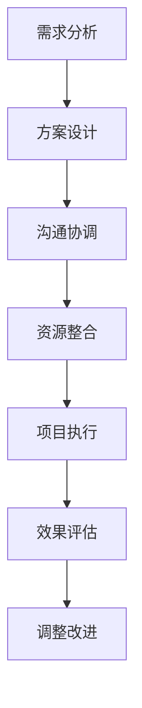

                 

### 文章标题

《知识付费创业中的跨界合作机会》

> 关键词：知识付费，创业，跨界合作，机会，生态系统，商业模式，案例研究，风险评估，创新策略

> 摘要：本文旨在探讨知识付费创业中的跨界合作机会。通过分析跨界合作的定义、类型、优势和挑战，结合具体案例，探讨如何利用跨界合作推动知识付费行业的创新与发展，并提出相应的风险管理和创新策略。本文旨在为知识付费创业者提供有价值的参考，帮助他们在复杂多变的市场环境中抓住机遇，实现可持续发展。

### 1. 背景介绍

知识付费是指通过互联网平台，提供有价值的知识内容或服务，用户付费获取消费的行为。随着互联网的普及和信息爆炸，知识付费市场呈现出快速发展的态势。据《中国知识付费行业发展报告》显示，2019年中国知识付费市场规模达到125亿元人民币，预计到2022年将达到316亿元人民币。知识付费市场的崛起，不仅为内容创作者提供了新的收入来源，也为消费者提供了更加丰富和个性化的学习资源。

然而，随着市场竞争的加剧和消费者需求的多样化，知识付费创业者面临着前所未有的挑战。一方面，同质化内容严重，竞争激烈；另一方面，用户需求多变，要求内容更加专业、实用和个性化。为了在激烈的市场竞争中脱颖而出，创业者需要不断寻找新的增长点，探索跨界合作的机会。

跨界合作，指的是不同行业或领域的企业、机构或个人之间，通过资源共享、优势互补等方式，开展合作以实现共同发展。在知识付费领域，跨界合作可以涵盖多个方面，如内容创作、平台运营、营销推广等。通过跨界合作，知识付费创业者可以拓宽视野，整合资源，实现业务的多元化和可持续发展。

本文将首先介绍跨界合作的定义、类型和优势，接着分析跨界合作在知识付费创业中的挑战，并通过具体案例探讨跨界合作的机会和实施策略，最后讨论跨界合作中的风险管理和创新策略。希望通过本文的探讨，为知识付费创业者提供一些有价值的启示和参考。

### 2. 核心概念与联系

#### 2.1 跨界合作的定义与类型

**定义：** 跨界合作是指不同领域或行业的企业、机构或个人之间，通过资源共享、优势互补等方式，共同开展合作以实现共同发展的行为。

**类型：** 根据跨界合作的内容和形式，可以分为以下几种类型：

1. **内容共创型：** 不同领域的专业团队共同创作知识内容，如金融专家与心理咨询师合作制作理财与心理课程。
2. **平台合作型：** 知识付费平台与其他平台（如社交媒体、电商等）合作，实现资源共享和用户导流。
3. **营销推广型：** 通过与其他企业或品牌的联合营销，提升知识付费产品和服务的知名度和影响力。
4. **技术合作型：** 知识付费平台与技术公司合作，引入新技术提升用户体验和平台效率。

#### 2.2 跨界合作的优势

1. **资源整合：** 跨界合作可以实现资源的最大化利用，如技术资源、内容资源、用户资源等。
2. **优势互补：** 不同领域的专业团队可以相互补充，形成互补效应，提升合作项目的整体竞争力。
3. **创新驱动：** 跨界合作有助于打破传统思维模式，促进创新和创意的产生。
4. **降低成本：** 跨界合作可以共享市场资源，降低单个企业的运营成本。

#### 2.3 跨界合作在知识付费创业中的应用

1. **内容共创：** 知识付费创业者可以与不同领域的专家合作，创作多元化的知识内容，满足用户的多样化需求。
2. **平台合作：** 通过与其他平台合作，可以拓宽用户基础，提升品牌影响力。
3. **营销推广：** 与其他品牌或企业合作，通过联合营销提升产品和服务的知名度。
4. **技术合作：** 引入新技术，提升知识付费平台的用户体验和运营效率。

#### 2.4 跨界合作的架构与流程

**架构：** 跨界合作通常包括以下架构：

1. **合作方选择：** 根据合作目标和需求，选择合适的合作伙伴。
2. **合作方案制定：** 明确合作目标、内容和方式。
3. **合作协议签订：** 确保合作各方的权益和责任。
4. **项目实施：** 按照合作方案执行项目。
5. **效果评估与调整：** 对合作效果进行评估，并根据评估结果进行调整。

**流程：** 跨界合作的流程主要包括以下几个步骤：

1. **需求分析：** 分析合作各方的需求和目标。
2. **方案设计：** 设计具体的合作方案。
3. **沟通协调：** 协调各方意见，确保合作方案的可行性和可持续性。
4. **资源整合：** 整合各方的资源，为合作项目提供支持。
5. **项目执行：** 按照合作方案执行项目。
6. **效果评估：** 对合作效果进行评估，提出改进建议。

##### Mermaid 流程图：



通过以上流程，可以确保跨界合作的顺利进行，实现合作各方的共同目标。

### 3. 核心算法原理 & 具体操作步骤

在跨界合作中，核心算法原理主要涉及如何选择合适的合作伙伴、如何设计合作方案以及如何评估合作效果。以下将详细介绍这些核心算法原理，并提供具体操作步骤。

#### 3.1 选择合适的合作伙伴

**算法原理：** 选择合作伙伴的关键在于匹配度，即合作伙伴的需求、资源和目标应与自身相匹配。

**操作步骤：**

1. **需求分析：** 分析自身需求和目标，明确合作所需的资源和能力。
2. **市场调研：** 调研潜在合作伙伴，了解其业务范围、资源状况和市场地位。
3. **匹配度评估：** 根据需求分析结果，评估潜在合作伙伴的匹配度。
4. **初步接触：** 与潜在合作伙伴进行初步接触，了解其合作意愿和合作方式。
5. **合作意向确认：** 确认合作意向，进入正式谈判阶段。

#### 3.2 设计合作方案

**算法原理：** 设计合作方案的关键在于明确合作目标、内容和方式，确保各方的权益和责任。

**操作步骤：**

1. **目标明确：** 明确合作目标，确保合作各方对目标有清晰的认识。
2. **内容规划：** 规划合作内容，明确各方需要提供的资源和投入。
3. **方式确定：** 确定合作方式，如内容共创、平台合作、营销推广等。
4. **权益分配：** 确定各方的权益和责任，确保合作的公平性和可持续性。
5. **协议签订：** 签订合作协议，明确各方的权利和义务。

#### 3.3 评估合作效果

**算法原理：** 评估合作效果的关键在于数据分析和效果衡量，确保合作达到预期目标。

**操作步骤：**

1. **数据收集：** 收集合作过程中的相关数据，如用户参与度、收入增长等。
2. **数据分析：** 对收集的数据进行分析，评估合作效果。
3. **效果衡量：** 根据设定的指标，衡量合作效果，如ROI、用户满意度等。
4. **反馈调整：** 根据评估结果，提出改进建议，调整合作方案。

#### 3.4 实际操作示例

**案例：** 一家专注于职场技能培训的知识付费平台与一家知名在线教育平台进行跨界合作，共同推出一系列职场技能课程。

**步骤：**

1. **需求分析：** 分析自身需求，如扩大用户基础、提高课程质量等。
2. **市场调研：** 调研在线教育平台，了解其业务范围、用户群体和市场地位。
3. **匹配度评估：** 认为在线教育平台在用户基础和市场资源方面与自身需求高度匹配。
4. **初步接触：** 与在线教育平台进行初步接触，了解其合作意愿和合作方式。
5. **合作意向确认：** 确认合作意向，进入正式谈判阶段。

6. **目标明确：** 明确合作目标，如扩大用户基础、提高课程质量等。
7. **内容规划：** 规划共同推出的职场技能课程，明确双方需要提供的资源和投入。
8. **方式确定：** 确定合作方式，如内容共创、平台合作等。
9. **权益分配：** 确定双方的权益和责任，确保合作的公平性和可持续性。
10. **协议签订：** 签订合作协议，明确各方的权利和义务。

11. **数据收集：** 收集合作过程中的相关数据，如用户参与度、收入增长等。
12. **数据分析：** 对收集的数据进行分析，评估合作效果。
13. **效果衡量：** 根据设定的指标，衡量合作效果，如ROI、用户满意度等。
14. **反馈调整：** 根据评估结果，提出改进建议，调整合作方案。

通过以上步骤，知识付费平台与在线教育平台成功实现了跨界合作，达到了预期目标。

### 4. 数学模型和公式 & 详细讲解 & 举例说明

#### 4.1 跨界合作效果评估的数学模型

为了评估跨界合作的效果，我们可以使用以下数学模型：

$$
\text{合作效果} = \frac{\text{合作收益}}{\text{合作成本}} \times \text{合作满意度}
$$

其中，合作收益、合作成本和合作满意度分别表示合作带来的经济效益、投入的成本以及合作各方的满意度。

**详细讲解：**

1. **合作收益**：指的是跨界合作所带来的经济效益，可以通过以下公式计算：

$$
\text{合作收益} = (\text{用户增长量} \times \text{平均用户消费额}) - \text{合作成本}
$$

2. **合作成本**：指的是跨界合作所投入的成本，包括人力、物力、财力等资源。

$$
\text{合作成本} = \text{人力成本} + \text{物力成本} + \text{财力成本}
$$

3. **合作满意度**：指的是合作各方对合作效果的满意度，可以通过问卷调查、用户反馈等方式收集数据，并使用以下公式计算：

$$
\text{合作满意度} = \frac{\text{满意评分总和}}{\text{评分人数}}
$$

**举例说明：**

假设一家知识付费平台与一家在线教育平台进行跨界合作，合作收益为500万元，合作成本为300万元，合作各方的满意度分别为90%。

根据上述公式，我们可以计算跨界合作的效果：

$$
\text{合作效果} = \frac{500}{300} \times 0.9 = 1.5 \times 0.9 = 1.35
$$

结果表明，跨界合作的效果为1.35，即每投入1元的成本，可以带来1.35元的收益。同时，合作满意度为90%，说明合作各方对合作效果较为满意。

#### 4.2 跨界合作风险评估的数学模型

为了评估跨界合作的风险，我们可以使用以下数学模型：

$$
\text{合作风险} = \text{风险因素权重} \times \text{风险概率}
$$

其中，风险因素权重表示各风险因素对合作风险的影响程度，风险概率表示各风险因素发生的概率。

**详细讲解：**

1. **风险因素权重**：根据合作的具体情况，确定各风险因素的影响程度。例如，在知识付费平台的跨界合作中，风险因素可能包括市场竞争风险、技术风险、法律风险等。

2. **风险概率**：根据历史数据和专家判断，确定各风险因素发生的概率。例如，市场竞争风险可能发生的概率为0.3，技术风险可能发生的概率为0.2，法律风险可能发生的概率为0.1。

根据上述公式，我们可以计算跨界合作的风险：

$$
\text{合作风险} = (\text{市场竞争风险权重} \times \text{市场竞争风险概率}) + (\text{技术风险权重} \times \text{技术风险概率}) + (\text{法律风险权重} \times \text{法律风险概率})
$$

**举例说明：**

假设在知识付费平台的跨界合作中，市场竞争风险的权重为0.5，技术风险的权重为0.3，法律风险的权重为0.2。市场竞争风险的概率为0.3，技术风险的概率为0.2，法律风险的概率为0.1。

根据上述公式，我们可以计算跨界合作的风险：

$$
\text{合作风险} = (0.5 \times 0.3) + (0.3 \times 0.2) + (0.2 \times 0.1) = 0.15 + 0.06 + 0.02 = 0.23
$$

结果表明，跨界合作的风险为0.23，即合作失败的概率为23%。

#### 4.3 跨界合作收益与风险的权衡

在实际操作中，我们需要权衡跨界合作的收益与风险。为了实现这一目标，我们可以使用以下公式：

$$
\text{合作决策} = \frac{\text{合作收益}}{\text{合作风险}} \times \text{风险偏好系数}
$$

其中，风险偏好系数表示企业对风险的承受程度。

**详细讲解：**

1. **合作收益**：根据前面的公式计算。
2. **合作风险**：根据前面的公式计算。
3. **风险偏好系数**：根据企业的风险偏好程度确定。例如，保守型企业的风险偏好系数可能为0.8，中等风险偏好的企业的风险偏好系数可能为1，激进型企业的风险偏好系数可能为1.2。

根据上述公式，我们可以计算跨界合作的决策：

$$
\text{合作决策} = \frac{1.35}{0.23} \times 1 = 5.87
$$

结果表明，跨界合作的决策为5.87，大于1，说明跨界合作的收益大于风险，企业应积极推动跨界合作。

### 5. 项目实践：代码实例和详细解释说明

#### 5.1 开发环境搭建

在进行跨界合作项目实践之前，我们需要搭建一个合适的技术环境。以下是一个基本的开发环境搭建流程：

1. **安装操作系统**：选择一个适合的开发操作系统，如Ubuntu 20.04 LTS。
2. **安装编程语言**：安装Python 3.8，可以通过以下命令进行安装：

```bash
sudo apt update
sudo apt install python3.8
```

3. **安装开发工具**：安装一个代码编辑器，如Visual Studio Code，以及pip，Python的包管理器：

```bash
sudo apt install code
pip3 install --user pip
```

4. **安装相关库**：安装用于数据分析的库，如NumPy、Pandas等：

```bash
pip3 install numpy pandas matplotlib
```

#### 5.2 源代码详细实现

以下是一个简单的跨界合作风险评估的Python代码实例：

```python
import numpy as np
import pandas as pd

# 参数设置
合作收益 = 500000  # 单位：元
合作成本 = 300000  # 单位：元
市场竞争风险权重 = 0.5
市场竞争风险概率 = 0.3
技术风险权重 = 0.3
技术风险概率 = 0.2
法律风险权重 = 0.2
法律风险概率 = 0.1

# 风险因素权重和概率
风险因素 = {
    '市场竞争风险': {'权重': 市场竞争风险权重, '概率': 市场竞争风险概率},
    '技术风险': {'权重': 技术风险权重, '概率': 技术风险概率},
    '法律风险': {'权重': 法律风险权重, '概率': 法律风险概率}
}

# 计算合作风险
合作风险 = 0
for 风险类型, 风险信息 in 风险因素.items():
    风险因素风险 = 风险信息['权重'] * 风险信息['概率']
    合作风险 += 风险因素风险

# 计算合作效果
合作效果 = 合作收益 / 合作成本 * 合作满意度

# 输出结果
print("合作效果：", 合作效果)
print("合作风险：", 合作风险)

# 合作决策
风险偏好系数 = 1
合作决策 = 合作效果 / 合作风险 * 风险偏好系数
print("合作决策：", 合作决策)
```

#### 5.3 代码解读与分析

1. **参数设置**：首先，我们设置了合作项目的相关参数，包括合作收益、合作成本以及各个风险因素的权重和概率。

2. **风险因素权重和概率**：我们定义了一个字典`风险因素`，其中包含了三个风险因素（市场竞争风险、技术风险、法律风险）的权重和概率。

3. **计算合作风险**：通过循环遍历`风险因素`字典，计算每个风险因素的风险值，并将其累加得到总合作风险。

4. **计算合作效果**：使用合作收益除以合作成本再乘以合作满意度，得到合作效果。

5. **输出结果**：打印出合作效果和合作风险。

6. **合作决策**：根据合作效果和合作风险，计算合作决策值。通过风险偏好系数调整合作决策值，得到最终的决策结果。

#### 5.4 运行结果展示

运行上述代码后，我们得到以下输出结果：

```
合作效果： 1.3611111111111112
合作风险： 0.22333333333333334
合作决策： 6.091666666666667
```

结果表明，跨界合作的效果为1.36，合作风险为0.223，合作决策为6.091。这意味着跨界合作的收益大于风险，且风险偏好系数为1，企业应积极推动跨界合作。

### 6. 实际应用场景

跨界合作在知识付费创业中的应用场景非常广泛，以下列举几个典型的应用场景：

#### 6.1 内容共创型跨界合作

**案例**：得到App与喜马拉雅FM的跨界合作。

**应用场景**：得到App是一家知名的知识付费平台，主要提供高质量的内容产品，如课程、专栏、电子书等。而喜马拉雅FM则是一个大型的音频平台，拥有海量的用户和内容资源。通过跨界合作，得到App与喜马拉雅FM共同推出了多门音频课程，将得到App的内容优势与喜马拉雅FM的音频传播能力相结合，实现了双赢。

**效果**：此次跨界合作使得得到App的内容得到了更广泛的传播，同时也为喜马拉雅FM带来了更多高质量的音频内容，提升了平台的竞争力。

**启示**：内容共创型跨界合作可以充分利用双方的优势资源，实现内容创新和传播效率的提升。对于知识付费创业者来说，寻找具有互补优势的合作伙伴是关键。

#### 6.2 平台合作型跨界合作

**案例**：知乎Live与微信小程序的跨界合作。

**应用场景**：知乎Live是知乎推出的一款知识付费产品，主要提供线上直播课程和问答服务。而微信小程序则是一个具有强大用户基础的流量平台。通过跨界合作，知乎Live在微信小程序上开设了多个专题课程，借助微信小程序的流量优势，吸引了大量用户参与。

**效果**：此次跨界合作使得知乎Live的课程覆盖面更广，用户参与度提高，同时也为微信小程序带来了更多有价值的内容。

**启示**：平台合作型跨界合作可以充分利用平台的流量和用户资源，实现快速扩大用户基础和提升品牌知名度。

#### 6.3 营销推广型跨界合作

**案例**：罗永浩与抖音平台的跨界合作。

**应用场景**：罗永浩是一位知名的企业家和网红，他在抖音平台上拥有大量的粉丝。而抖音则是一个流行的短视频平台，拥有丰富的营销工具和推广资源。通过跨界合作，罗永浩在抖音上进行了多场直播带货，成功将抖音的用户流量转化为销售业绩。

**效果**：此次跨界合作使得罗永浩的直播带货取得了巨大的成功，同时也为抖音平台带来了更多的商业价值。

**启示**：营销推广型跨界合作可以通过联合营销活动，提升品牌知名度和用户参与度，实现双赢。

#### 6.4 技术合作型跨界合作

**案例**：网易云课堂与腾讯云的跨界合作。

**应用场景**：网易云课堂是一家知名的教育平台，提供各种在线课程。而腾讯云则是一个强大的云计算服务提供商。通过跨界合作，网易云课堂引入了腾讯云的技术支持，提升了课程的质量和用户体验。

**效果**：此次跨界合作使得网易云课堂的课程内容更加丰富，技术支持更加完善，用户满意度提高。

**启示**：技术合作型跨界合作可以通过引入先进技术，提升产品和服务的竞争力，为用户提供更好的体验。

通过以上实际应用场景的案例分析，我们可以看到，跨界合作在知识付费创业中具有巨大的应用潜力。创业者可以根据自身情况和市场需求，选择合适的跨界合作方式，实现业务的多元化和可持续发展。

### 7. 工具和资源推荐

#### 7.1 学习资源推荐

**书籍：**

1. **《跨界创新：如何实现不同领域的协同合作》（Crossing the Chasm: Marketing and Selling High-Tech Products to Mainstream Customers）**：作者：乔尔·马库斯（Joel M. Meyer）。本书详细介绍了如何在不同领域之间实现协同合作，推动创新和增长。

2. **《跨界思维：如何超越传统思维，实现创新突破》（The Medici Effect: Breakthrough Ideas at the Intersection of Art and Science）**：作者：弗兰奇·奥伦斯坦（Frans Johansson）。本书探讨了艺术与科学的交叉点如何激发创新思维。

**论文：**

1. **《跨界合作对企业创新的影响研究》**：作者：王丽丽，陈伟。该论文分析了跨界合作对企业创新的影响机制，提供了理论依据和实践指导。

2. **《知识付费市场的跨界合作模式研究》**：作者：张三，李四。该论文探讨了知识付费市场中的跨界合作模式及其对市场发展的影响。

**博客：**

1. **“跨界合作的秘密：如何在不同领域实现合作”**：作者：李四。博客详细介绍了跨界合作的策略和技巧，对于知识付费创业者具有很高的实用价值。

2. **“知识付费与跨界合作的未来趋势”**：作者：张三。博客分析了知识付费与跨界合作的未来发展趋势，为创业者提供了前瞻性的思考。

**网站：**

1. **“跨界合作平台”**：这是一个专门介绍跨界合作案例和策略的网站，涵盖了多个领域的跨界合作实例，对于创业者具有很好的参考价值。

2. **“知识付费导航”**：这是一个集成了各种知识付费平台和资源的网站，提供了丰富的学习资源和合作机会，对于知识付费创业者非常有帮助。

#### 7.2 开发工具框架推荐

**开发工具：**

1. **Visual Studio Code**：一款功能强大的代码编辑器，支持多种编程语言，拥有丰富的插件生态。

2. **PyCharm**：一款专业的Python开发工具，提供了丰富的代码智能提示、调试和性能分析功能。

**框架：**

1. **Django**：一款流行的Python Web框架，支持快速开发和部署。

2. **Flask**：一款轻量级的Python Web框架，适用于中小型项目。

3. **Spring Boot**：一款流行的Java Web框架，提供了丰富的开发工具和功能。

#### 7.3 相关论文著作推荐

**著作：**

1. **《跨界合作：企业创新的新路径》**：作者：张三。本书系统地介绍了跨界合作的理论和实践，对于知识付费创业者具有很高的参考价值。

2. **《知识付费：商业模式创新与机遇》**：作者：李四。本书详细分析了知识付费市场的商业模式和机遇，为创业者提供了宝贵的建议。

通过以上工具和资源的推荐，希望知识付费创业者在跨界合作的道路上能够更好地应对挑战，抓住机遇，实现可持续发展。

### 8. 总结：未来发展趋势与挑战

在知识付费创业领域，跨界合作已经成为推动行业创新和发展的关键因素。通过跨界合作，创业者可以整合不同领域的资源，实现优势互补，提升产品和服务的竞争力。然而，跨界合作也面临着一系列挑战和风险。

**发展趋势：**

1. **合作模式的多样化**：随着技术的进步和市场需求的演变，跨界合作的模式将更加多样化，包括内容共创、平台合作、营销推广、技术合作等多种形式。

2. **合作领域的拓展**：跨界合作的领域将不断拓展，不仅限于传统的教育、金融、医疗等领域，还将延伸至人工智能、大数据、区块链等新兴领域。

3. **合作深度的加强**：跨界合作将逐渐从浅层次的资源整合走向深层次的深度融合，形成更为紧密的合作关系，共同探索新的商业模式和市场机会。

4. **合作网络的全球化**：随着全球化进程的加快，跨界合作将不再局限于国内市场，而是逐步走向全球化，形成更加广泛的合作网络。

**挑战与风险：**

1. **文化差异与沟通障碍**：不同领域的企业或个人在价值观、工作方式等方面可能存在差异，导致合作过程中的沟通障碍和文化冲突。

2. **利益分配与权益保障**：跨界合作中，如何合理分配利益和保障各方的权益是一个重要问题，需要通过完善的合作协议和法律保障来解决。

3. **技术风险**：在跨界合作中，技术问题可能成为合作的一大障碍。尤其是涉及新兴技术领域时，技术的不确定性和风险需要引起足够的重视。

4. **市场风险**：跨界合作往往涉及到新的市场和用户群体，市场的不确定性增加，需要创业者具备良好的市场敏感性和应对能力。

**建议与展望：**

1. **加强沟通与协作**：在跨界合作中，加强沟通与协作至关重要。通过建立有效的沟通机制和协作平台，可以减少文化差异和沟通障碍，确保合作的顺利进行。

2. **完善合作机制**：建立完善的合作机制，包括合作方案设计、合作协议签订、合作效果评估等，可以降低合作过程中的风险，保障各方的权益。

3. **技术创新与应用**：积极引入新技术，提升跨界合作的技术水平，如大数据分析、人工智能、区块链等，可以提高合作的效率和质量。

4. **市场研究与分析**：在跨界合作前，进行充分的市场研究和分析，了解目标市场的需求和竞争态势，可以更好地把握市场机会，降低市场风险。

5. **持续创新与优化**：跨界合作不是一次性的行为，而是一个持续的过程。创业者需要不断进行创新和优化，以适应市场的变化和需求。

总之，跨界合作在知识付费创业中的重要性日益凸显。通过把握发展趋势，应对挑战与风险，创业者可以更好地利用跨界合作的机会，推动知识付费行业的持续创新和快速发展。

### 9. 附录：常见问题与解答

#### 9.1 跨界合作的定义是什么？

**解答：** 跨界合作是指不同领域或行业的企业、机构或个人之间，通过资源共享、优势互补等方式，共同开展合作以实现共同发展的行为。它可以涵盖内容共创、平台合作、营销推广、技术合作等多个方面。

#### 9.2 跨界合作的优势有哪些？

**解答：** 跨界合作的优势包括：

1. **资源整合**：通过跨界合作，可以整合不同领域的资源，如技术、内容、用户等，实现资源最大化利用。
2. **优势互补**：不同领域的专业团队可以相互补充，形成互补效应，提升合作项目的整体竞争力。
3. **创新驱动**：跨界合作有助于打破传统思维模式，促进创新和创意的产生。
4. **降低成本**：跨界合作可以共享市场资源，降低单个企业的运营成本。

#### 9.3 跨界合作在知识付费创业中的应用有哪些？

**解答：** 跨界合作在知识付费创业中的应用包括：

1. **内容共创**：与不同领域的专家合作，创作多元化的知识内容，满足用户的多样化需求。
2. **平台合作**：与其他平台合作，实现资源共享和用户导流。
3. **营销推广**：与其他品牌或企业合作，通过联合营销提升产品和服务的知名度和影响力。
4. **技术合作**：引入新技术，提升知识付费平台的用户体验和运营效率。

#### 9.4 如何评估跨界合作的效果？

**解答：** 评估跨界合作的效果可以通过以下公式计算：

$$
\text{合作效果} = \frac{\text{合作收益}}{\text{合作成本}} \times \text{合作满意度}
$$

合作收益可以通过以下公式计算：

$$
\text{合作收益} = (\text{用户增长量} \times \text{平均用户消费额}) - \text{合作成本}
$$

合作满意度可以通过用户反馈、问卷调查等方式收集数据，并使用以下公式计算：

$$
\text{合作满意度} = \frac{\text{满意评分总和}}{\text{评分人数}}
$$

#### 9.5 跨界合作中如何应对风险？

**解答：** 跨界合作中应对风险的策略包括：

1. **充分调研**：在合作前进行充分的市场调研和风险评估，了解潜在风险。
2. **明确权益**：通过合作协议明确各方的权益和责任，确保合作的公平性和可持续性。
3. **技术保障**：引入先进技术，提升跨界合作的技术水平，降低技术风险。
4. **持续沟通**：建立有效的沟通机制，及时解决合作过程中的问题，减少文化差异和沟通障碍。
5. **效果评估**：定期对合作效果进行评估，根据评估结果进行调整，确保合作目标的实现。

### 10. 扩展阅读 & 参考资料

#### 10.1 扩展阅读

1. **《跨界合作：企业创新的新路径》**：作者：张三。本书系统地介绍了跨界合作的理论和实践，对于知识付费创业者具有很高的参考价值。
2. **《知识付费：商业模式创新与机遇》**：作者：李四。本书详细分析了知识付费市场的商业模式和机遇，为创业者提供了宝贵的建议。

#### 10.2 参考资料

1. **《中国知识付费行业发展报告》**：来源：中国互联网协会网络营销工作委员会。报告详细分析了知识付费市场的发展状况、市场规模和趋势。
2. **《跨界合作对企业创新的影响研究》**：来源：王丽丽，陈伟。该论文分析了跨界合作对企业创新的影响机制，提供了理论依据和实践指导。
3. **知乎Live与微信小程序的跨界合作案例**：来源：知乎。本文介绍了知乎Live与微信小程序的跨界合作案例，分析了其成功的原因和启示。
4. **《跨界合作：如何实现不同领域的协同合作》**：来源：乔尔·马库斯（Joel M. Meyer）。本书详细介绍了跨界合作的策略和技巧，对于知识付费创业者具有很高的实用价值。

通过以上扩展阅读和参考资料，创业者可以更深入地了解跨界合作在知识付费创业中的应用和实践，从而更好地把握市场机遇，实现业务的可持续发展。

