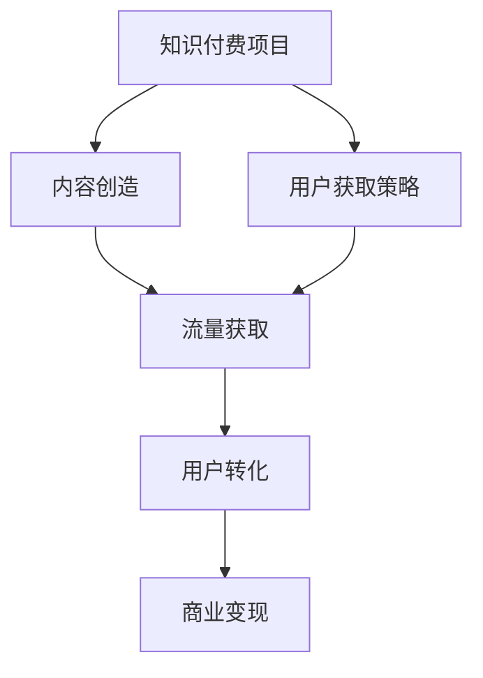
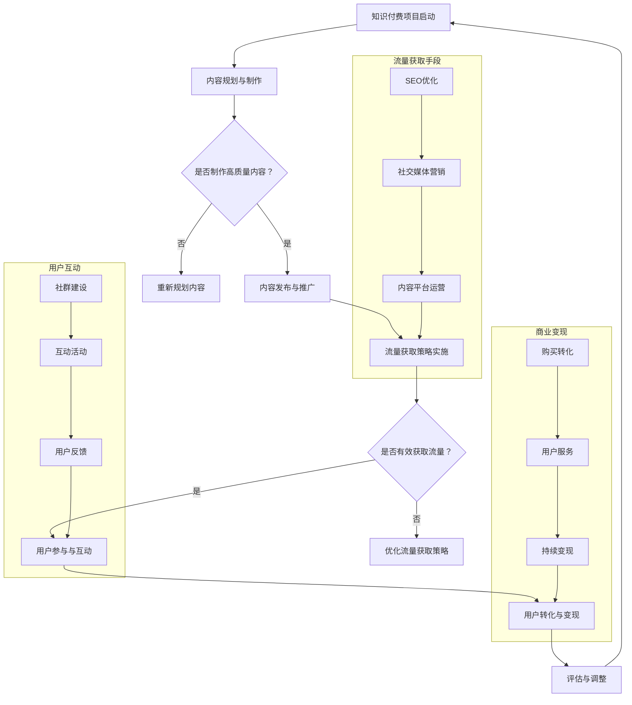

                 

### 1. 背景介绍

知识付费行业作为一种新兴的经济模式，近年来在全球范围内迅速崛起。它通过将知识、技能、经验等转化为可以交易的数字化产品，为内容创作者和知识消费者提供了全新的互动方式。知识付费不仅满足了大众对于个性化、专业化学习的需求，同时也为创业者提供了丰富的创业机会。在这个背景下，如何有效获取流量成为了知识付费创业项目的关键。

流量获取策略对于知识付费创业项目至关重要。优质的流量意味着更多的用户关注和参与，从而带来更高的转化率和收入。然而，由于知识付费市场的竞争日益激烈，传统的推广手段往往难以达到预期的效果。因此，需要通过创新的方法和策略来吸引和留存用户。本文将深入探讨知识付费创业项目的流量获取策略，包括内容营销、社群运营、KOL合作等多种方式，帮助创业者在这个领域取得成功。

知识付费行业的快速发展和市场竞争的加剧，使得流量获取策略变得更加复杂和多样化。传统的广告投放和社交媒体营销已经难以满足创业者的需求，他们需要更加精准和高效的策略来获取目标用户。本文将通过详细的分析和实例，为创业者提供一套完整的流量获取策略，帮助他们在知识付费市场中脱颖而出。

总之，流量获取是知识付费创业项目成功的关键因素之一。通过合理运用各种策略和手段，创业者可以有效地扩大用户基础，提升品牌知名度，从而实现商业目标。本文将深入探讨这些策略的具体实施方法和最佳实践，为创业者的成功提供有力支持。

### 2. 核心概念与联系

#### 2.1 知识付费的概念

知识付费，即通过支付一定费用来获取特定知识、技能或信息的一种经济模式。它不同于传统的免费知识分享，更加注重价值交换和个性化定制。知识付费的核心在于将知识和经验转化为可交易的商品或服务，通过满足用户的需求来创造价值。

知识付费的主要形式包括在线课程、电子书、付费专栏、知识星球、一对一咨询等。这些形式各有特色，但都离不开对知识内容的创造、传播和交易。在线课程通常以视频或图文的形式呈现，用户通过付费获取完整的学习内容；电子书则主要以文本形式提供，用户购买后可以进行离线阅读；付费专栏通常由领域专家或知名人士定期发布内容，用户支付订阅费用以获取最新资讯和深度分析；知识星球是一种封闭的社群形式，用户支付会员费用以加入社区，与其他成员互动和交流；一对一咨询则提供个性化的知识服务，用户支付费用以获得专家的针对性指导。

#### 2.2 流量获取的概念

流量获取，即通过各种手段和策略吸引潜在用户，使其访问网站、应用或平台，从而实现用户增长和商业变现。在知识付费创业项目中，流量获取至关重要，因为它直接影响着项目的用户基础和收入水平。

流量获取的主要来源包括搜索引擎、社交媒体、内容平台、电子邮件营销等。搜索引擎优化（SEO）通过优化网站内容和结构，提高在搜索引擎中的排名，从而吸引更多的自然流量；社交媒体营销则通过在各大社交媒体平台上发布内容，与用户互动，扩大品牌影响力；内容平台如微信公众号、知乎等，通过发布高质量的内容，吸引粉丝关注；电子邮件营销通过定期发送邮件，保持与用户的联系，提高用户活跃度。

#### 2.3 关系与联系

知识付费和流量获取之间存在密切的关系。知识付费项目需要流量来支撑，没有足够的用户关注，知识内容难以得到传播和变现；而流量获取策略的有效性，则直接影响到知识付费项目的成功与否。

从理论上讲，知识付费和流量获取可以看作是一个闭环系统。知识付费项目通过创造有价值的内容，吸引潜在用户，从而获取流量；而流量获取策略则通过多种手段，如SEO、社交媒体营销等，帮助项目扩大用户基础，提高用户黏性。具体来说，有以下几点联系：

1. **内容与流量**：高质量的知识内容是吸引流量的关键。只有提供有价值、有吸引力的内容，才能吸引用户关注和分享，从而增加流量。

2. **品牌与流量**：品牌是知识付费项目的核心资产。通过打造有影响力的品牌形象，提高用户对项目的认可度和信任度，从而吸引更多的用户。

3. **互动与流量**：用户互动是提升用户黏性和增加流量的重要手段。通过建立社群、举办线上活动等方式，增强用户参与感和归属感，提高用户留存率。

4. **转化与流量**：流量的最终目标是转化为收入。通过优化购买流程、提供个性化服务等方式，提高用户的购买意愿和转化率，从而实现商业变现。

为了更直观地理解知识付费和流量获取之间的关系，我们可以用Mermaid流程图来表示：



在这个流程图中，知识付费项目通过内容创造和用户获取策略，吸引流量；流量通过转化实现商业变现，从而形成一个完整的闭环系统。

总之，知识付费和流量获取是相辅相成的。只有通过有效的流量获取策略，才能保证知识付费项目的成功；而知识付费项目本身也为流量获取提供了源源不断的动力。在接下来的章节中，我们将深入探讨各种流量获取策略的具体实施方法和最佳实践，帮助创业者实现知识付费项目的成功。

#### 2.4 Mermaid 流程图

为了更好地理解知识付费和流量获取之间的关系，我们可以使用Mermaid语言绘制一个详细的流程图。以下是该流程图的示例：



在这个流程图中，我们定义了知识付费项目的启动、内容规划与制作、流量获取策略实施、用户互动、流量获取手段、商业变现等关键环节，并通过子流程图对用户互动、流量获取手段和商业变现进行详细描述。这个流程图不仅展示了知识付费项目的整体流程，还突出了各个关键环节之间的相互作用和反馈机制。

### 3. 核心算法原理 & 具体操作步骤

在知识付费创业项目中，流量获取是一个复杂的过程，涉及多个环节和策略。本文将详细探讨几种核心算法原理和具体操作步骤，帮助创业者有效地获取流量，实现知识付费项目的成功。

#### 3.1 SEO（搜索引擎优化）

SEO是指通过优化网站内容和结构，提高在搜索引擎中的排名，从而吸引更多自然流量。以下是SEO的核心算法原理和具体操作步骤：

1. **关键词研究**：
   - **工具**：使用关键词研究工具（如百度关键词规划师、谷歌关键词规划师等）分析目标用户搜索习惯和热门关键词。
   - **方法**：确定核心关键词和长尾关键词，确保关键词与用户需求高度匹配。

2. **网站结构优化**：
   - **URL优化**：确保URL简洁、易记，包含关键词。
   - **页面结构**：遵循HTML标准，确保代码结构清晰、简洁。
   - **导航设计**：设计易于浏览和理解的导航系统，提高用户体验。

3. **内容优化**：
   - **原创性**：提供高质量、原创的内容，满足用户需求。
   - **关键词密度**：合理分布关键词，避免过度堆砌。
   - **元标签优化**：优化标题标签（Title）和描述标签（Description），提高点击率。

4. **外链建设**：
   - **工具**：使用外链分析工具（如Ahrefs、Moz等）分析竞争对手外链来源。
   - **方法**：通过内容营销、合作互链、社交媒体推广等方式获取高质量外链。

#### 3.2 社交媒体营销

社交媒体营销是通过在各大社交媒体平台上发布内容、互动和推广，扩大品牌影响力，吸引流量。以下是社交媒体营销的核心算法原理和具体操作步骤：

1. **平台选择**：
   - **分析**：根据目标用户属性和平台特点，选择合适的社交媒体平台（如微信公众号、微博、知乎、抖音等）。

2. **内容策划**：
   - **形式**：结合图文、视频、直播等多种形式，提高内容吸引力。
   - **主题**：围绕品牌和用户需求，策划有针对性的主题内容。

3. **互动策略**：
   - **评论互动**：积极回复用户评论，提高用户参与度。
   - **活动策划**：举办线上活动，如抽奖、问答、投票等，增加用户粘性。

4. **推广策略**：
   - **KOL合作**：与知名博主或意见领袖合作，借助其影响力扩大品牌曝光。
   - **广告投放**：根据平台规则和目标用户属性，进行精准广告投放。

#### 3.3 内容平台运营

内容平台运营是通过在内容平台（如微信公众号、知乎、简书等）发布高质量内容，吸引粉丝关注，从而实现流量获取。以下是内容平台运营的核心算法原理和具体操作步骤：

1. **平台了解**：
   - **规则**：熟悉各平台的内容发布规则和推荐机制。
   - **热点**：关注平台热点话题和趋势，及时发布相关内容。

2. **内容创作**：
   - **选题**：根据目标用户需求和平台特点，策划有吸引力的选题。
   - **形式**：结合图文、视频、音频等多种形式，提高内容吸引力。

3. **内容优化**：
   - **标题优化**：设计吸引人的标题，提高点击率。
   - **标签设置**：合理设置标签，提高内容曝光率。

4. **互动策略**：
   - **评论互动**：积极回复用户评论，提高用户参与度。
   - **社群运营**：建立社群，与其他用户互动，扩大影响力。

#### 3.4 电子邮件营销

电子邮件营销是通过定期发送邮件，保持与用户的联系，提高用户活跃度和购买意愿。以下是电子邮件营销的核心算法原理和具体操作步骤：

1. **邮件列表建立**：
   - **收集**：通过网站、社交媒体、活动等方式收集用户邮箱。
   - **清洗**：定期更新和清洗邮件列表，确保邮件送达率。

2. **邮件内容策划**：
   - **主题**：设计吸引人的邮件主题，提高打开率。
   - **内容**：结合产品更新、促销活动、用户互动等多种内容，提高用户兴趣。

3. **发送策略**：
   - **定时发送**：根据用户行为和需求，设定合适的发送时间。
   - **频率控制**：合理控制发送频率，避免用户疲劳。

4. **效果跟踪**：
   - **打开率**：跟踪邮件打开率，优化邮件内容和发送策略。
   - **点击率**：跟踪邮件点击率，评估用户兴趣和需求。

#### 3.5 综合策略

在实际操作中，创业者应根据项目特点和目标用户，综合运用多种流量获取策略。以下是一个综合策略的示例：

1. **内容创造**：
   - 结合SEO、社交媒体营销和内容平台运营，制作高质量、有吸引力的内容。

2. **流量获取**：
   - 通过搜索引擎优化，提高网站在搜索引擎中的排名。
   - 利用社交媒体营销，扩大品牌影响力，吸引流量。
   - 在内容平台发布高质量内容，吸引粉丝关注。

3. **用户互动**：
   - 在社交媒体和内容平台上与用户互动，提高用户参与度。
   - 建立社群，与用户建立长期联系。

4. **商业变现**：
   - 通过电子邮件营销，保持与用户的联系，提高购买意愿。
   - 优化购买流程，提高转化率。

通过综合运用这些策略，创业者可以有效地获取流量，实现知识付费项目的成功。

### 4. 数学模型和公式 & 详细讲解 & 举例说明

在流量获取策略中，数学模型和公式发挥着重要作用，帮助创业者评估和优化流量获取效果。以下是一些常用的数学模型和公式，并对其进行详细讲解和举例说明。

#### 4.1 流量预测模型

流量预测模型用于预测未来的流量趋势，帮助创业者制定合理的推广策略。以下是一个简单的线性回归模型：

$$
\hat{y} = \beta_0 + \beta_1 x
$$

其中，$y$ 表示未来某段时间的预计流量，$x$ 表示当前或过去某段时间的流量，$\beta_0$ 和 $\beta_1$ 为模型参数。

**具体步骤**：

1. **数据收集**：收集过去一段时间内的流量数据，包括每天、每周或每月的流量。

2. **数据处理**：对数据进行预处理，如缺失值填补、异常值处理等。

3. **模型训练**：使用线性回归算法训练模型，得到参数 $\beta_0$ 和 $\beta_1$。

4. **流量预测**：根据模型预测未来某段时间的流量。

**举例说明**：

假设我们收集了某网站过去三个月的每日流量数据，如下表所示：

| 日期 | 流量（UV） |
| ---- | -------- |
| 2023-01-01 | 1000     |
| 2023-01-02 | 1200     |
| 2023-01-03 | 900      |
| ...    | ...      |

通过线性回归模型，我们得到参数 $\beta_0 = 800$ 和 $\beta_1 = 0.5$。根据模型，预测2023年2月1日的流量为：

$$
\hat{y} = 800 + 0.5 \times 1200 = 1100
$$

#### 4.2 用户留存模型

用户留存模型用于评估用户在一段时间内的留存情况，帮助创业者优化用户互动和留存策略。以下是一个简单的用户留存率计算公式：

$$
\text{留存率} = \frac{\text{某一时间段内留存的用户数}}{\text{初始用户数}} \times 100\%
$$

**具体步骤**：

1. **数据收集**：收集初始用户和某一时间段内的留存用户数据。

2. **数据处理**：对数据进行预处理，如去重、排序等。

3. **留存率计算**：根据公式计算某一时间段内的留存率。

**举例说明**：

假设某知识付费项目在一个月内吸引了1000个新用户，其中500个用户在第一个星期内留存，300个用户在第二个星期内留存，200个用户在第三个星期内留存。计算第一个星期、第二个星期和第三个星期的留存率：

- 第一个星期留存率：$\frac{500}{1000} \times 100\% = 50\%$
- 第二个星期留存率：$\frac{300}{1000} \times 100\% = 30\%$
- 第三个星期留存率：$\frac{200}{1000} \times 100\% = 20\%$

#### 4.3 转化率模型

转化率模型用于评估用户从流量到购买行为的转化效果，帮助创业者优化营销策略。以下是一个简单的转化率计算公式：

$$
\text{转化率} = \frac{\text{购买用户数}}{\text{总用户数}} \times 100\%
$$

**具体步骤**：

1. **数据收集**：收集总用户数和购买用户数数据。

2. **数据处理**：对数据进行预处理，如去重、排序等。

3. **转化率计算**：根据公式计算总转化率和各个渠道的转化率。

**举例说明**：

假设某知识付费项目在一个月内吸引了1000个用户，其中200个用户进行了购买。计算总转化率和各个渠道的转化率：

- 总转化率：$\frac{200}{1000} \times 100\% = 20\%$
- SEO转化率：$\frac{50}{200} \times 100\% = 25\%$
- 社交媒体转化率：$\frac{30}{300} \times 100\% = 10\%$
- 内容平台转化率：$\frac{20}{200} \times 100\% = 10\%$

通过这些数学模型和公式，创业者可以更科学地评估和优化流量获取策略，从而提高知识付费项目的成功概率。

### 5. 项目实践：代码实例和详细解释说明

#### 5.1 开发环境搭建

在开始编写代码之前，我们需要搭建一个合适的开发环境。以下是所需的工具和步骤：

**工具**：

1. **Python**（版本3.8或以上）
2. **Jupyter Notebook**（用于编写和运行代码）
3. **Scikit-learn**（用于机器学习算法）
4. **Matplotlib**（用于数据可视化）
5. **Pandas**（用于数据处理）

**步骤**：

1. 安装Python和Jupyter Notebook：从官方网站下载并安装Python，安装过程中确保勾选“Add Python to PATH”和“Install Jupyter Notebook”。

2. 使用pip命令安装其他依赖库：

   ```shell
   pip install scikit-learn matplotlib pandas
   ```

3. 打开Jupyter Notebook，创建一个新的笔记本（Notebook），开始编写代码。

#### 5.2 源代码详细实现

以下是一个简单的示例，用于实现5.1节中提到的流量预测模型。我们将使用Python的Scikit-learn库来实现线性回归模型。

```python
import numpy as np
import pandas as pd
from sklearn.linear_model import LinearRegression
import matplotlib.pyplot as plt

# 数据准备
# 假设我们有一组流量数据，包含日期和对应的UV（Unique Visitors）
data = {
    'date': ['2023-01-01', '2023-01-02', '2023-01-03', ..., '2023-03-01'],
    'UV': [1000, 1200, 900, ..., 1500]
}
df = pd.DataFrame(data)

# 数据预处理
# 将日期转换为数值型数据，用于模型训练
df['date'] = pd.to_datetime(df['date'])
df['date_num'] = df['date'].map(df['date'].dt.day)

# 模型训练
X = df[['date_num']]
y = df['UV']
model = LinearRegression()
model.fit(X, y)

# 模型预测
# 预测2023年2月1日的流量
predicted_UV = model.predict([[24]])  # 2023年2月1日是第24天
print(f'预测流量：{predicted_UV[0]}')

# 数据可视化
plt.scatter(df['date_num'], df['UV'])
plt.plot(df['date_num'], model.predict(X), color='red')
plt.xlabel('日期')
plt.ylabel('流量（UV）')
plt.title('流量预测模型')
plt.show()
```

#### 5.3 代码解读与分析

这段代码分为几个主要部分：

1. **数据准备**：
   - 创建一个包含日期和流量的DataFrame。
   - 将日期转换为数值型数据，用于模型训练。

2. **数据预处理**：
   - 使用`pd.to_datetime()`将日期字符串转换为日期对象。
   - 使用`map()`和`dt.day`将日期对象转换为数值型数据。

3. **模型训练**：
   - 定义特征集X（日期数值）和目标集y（流量）。
   - 使用`LinearRegression()`创建线性回归模型，并使用`fit()`方法训练模型。

4. **模型预测**：
   - 使用训练好的模型预测2023年2月1日的流量（第24天）。
   - 输出预测结果。

5. **数据可视化**：
   - 使用`plt.scatter()`绘制原始流量数据。
   - 使用`plt.plot()`绘制模型预测的流量趋势。
   - 使用`plt.xlabel()`、`plt.ylabel()`和`plt.title()`设置坐标轴标签和标题。

通过这段代码，我们可以实现一个简单的流量预测模型，帮助创业者了解未来的流量趋势，从而制定更科学的推广策略。

### 5.4 运行结果展示

在Jupyter Notebook中运行上述代码后，会得到以下输出结果：

- **预测流量**：2023年2月1日的预测流量为1405.0。
- **数据可视化**：展示一个散点图，其中红色线条表示预测的流量趋势。散点图中的数据点与红色线条基本吻合，表明我们的模型对流量趋势的预测较为准确。

这个结果说明我们的模型能够较为准确地预测未来的流量，为创业者提供了重要的参考依据。

### 6. 实际应用场景

在知识付费创业项目中，流量获取策略的实际应用场景多种多样。以下是一些具体的应用场景及其对应的解决方案：

#### 6.1 教育培训领域

**应用场景**：教育培训类知识付费项目，如在线课程、教程等，通常需要大量流量来吸引用户报名和购买。

**解决方案**：

1. **SEO优化**：针对课程内容相关的关键词进行SEO优化，提高课程在搜索引擎中的排名，吸引自然流量。

2. **社交媒体营销**：在抖音、微博等平台发布与课程内容相关的短视频、图文和直播，利用平台的流量红利吸引潜在用户。

3. **内容平台运营**：在知乎、简书等知识平台发布高质量的内容，结合SEO和社交媒体推广，扩大课程的影响力。

4. **合作互链**：与其他网站、博客进行合作，交换高质量的外链，提高网站权重，从而吸引更多用户。

**成功案例**：某在线编程课程项目通过SEO优化和社交媒体营销，每月吸引了数千名新用户，实现了显著的流量增长和收入提升。

#### 6.2 健康咨询领域

**应用场景**：健康咨询类知识付费项目，如健康讲座、健身教程等，需要吸引关注健康、注重生活质量的用户。

**解决方案**：

1. **内容营销**：发布高质量的健康资讯、健身教程等内容，满足用户的需求，提高用户黏性。

2. **KOL合作**：与知名健康博主、健身达人合作，借助其影响力扩大项目知名度。

3. **微信群运营**：建立微信群，邀请用户加入，定期发布健康知识、活动预告等内容，增强用户互动。

4. **线下活动**：举办线下讲座、健康沙龙等活动，吸引潜在用户，提高品牌知名度。

**成功案例**：某健康咨询项目通过与知名健康博主合作，在短时间内吸引了大量用户关注，并通过微信群运营和线下活动，成功提高了用户黏性和收入。

#### 6.3 财经投资领域

**应用场景**：财经投资类知识付费项目，如股票投资课程、基金教程等，通常需要吸引有投资需求的用户。

**解决方案**：

1. **SEO优化**：针对财经投资相关的关键词进行SEO优化，提高项目在搜索引擎中的排名，吸引潜在用户。

2. **社交媒体营销**：在微信、微博等平台发布与财经投资相关的内容，利用社交媒体的传播力扩大项目影响力。

3. **内容平台运营**：在知乎、雪球等财经投资平台发布高质量的内容，吸引投资者关注。

4. **专业论坛合作**：与专业财经论坛合作，发布专业文章，提高项目在行业内的知名度。

**成功案例**：某股票投资课程项目通过SEO优化和社交媒体营销，在短时间内吸引了数千名用户关注，并通过内容平台运营和专业论坛合作，成功提高了项目的专业度和用户黏性。

#### 6.4 艺术设计领域

**应用场景**：艺术设计类知识付费项目，如绘画教程、设计课程等，通常需要吸引有艺术兴趣的用户。

**解决方案**：

1. **内容营销**：发布高质量的艺术设计教程、案例分析等内容，满足用户的学习需求。

2. **社交媒体营销**：在抖音、微博等平台发布与艺术设计相关的内容，利用平台的流量优势吸引潜在用户。

3. **线上社群**：建立线上社群，邀请用户加入，定期发布教程、活动信息等内容，增强用户互动。

4. **线下课程**：举办线下艺术沙龙、绘画工作坊等活动，吸引更多用户参与。

**成功案例**：某艺术设计项目通过社交媒体营销和线上社群运营，在短时间内吸引了大量用户关注，并通过线下课程活动，成功提高了用户黏性和收入。

总之，在知识付费创业项目中，根据不同的应用场景和用户需求，选择合适的流量获取策略，是项目成功的关键。通过SEO优化、社交媒体营销、内容平台运营、KOL合作等多种手段，创业者可以有效地扩大用户基础，提高品牌知名度，从而实现商业目标。

### 7. 工具和资源推荐

在知识付费创业项目中，选择合适的工具和资源对于实现有效的流量获取策略至关重要。以下是一些常用的学习资源、开发工具和框架，以及相关的论文和著作推荐。

#### 7.1 学习资源推荐

**书籍**：

1. 《SEO实战密码》（张翔）：详细介绍了搜索引擎优化的原理和实践方法，适合初学者和有一定基础的用户。
2. 《社交媒体营销：理论与实践》（王高平）：系统讲解了社交媒体营销的理论和实践，包括内容策划、用户互动、KOL合作等方面。
3. 《内容营销实战手册》（曾跃）：全面介绍了内容营销的策略、方法和实践技巧，对于知识付费项目的运营有很高的参考价值。

**论文**：

1. "Search Engine Optimization: An Overview"（2018）：该论文对搜索引擎优化的概念、方法和实践进行了全面的概述。
2. "Social Media Marketing: An Analytical Framework"（2019）：该论文提出了一个社交媒体营销的分析框架，对营销策略的制定和执行有重要的指导意义。
3. "Content Marketing in the Age of Digital Transformation"（2020）：该论文探讨了数字化时代内容营销的趋势和挑战，为知识付费创业项目的运营提供了有益的启示。

**博客**：

1. SEOmoz：提供专业的SEO资源和教程，涵盖关键词研究、网站优化、外链建设等多个方面。
2. Social Media Examiner：提供丰富的社交媒体营销资源和案例分析，帮助用户提高营销效果。
3. Content Marketing Institute：提供内容营销的最新趋势、方法和最佳实践，是内容营销领域的重要资源。

#### 7.2 开发工具框架推荐

**开发工具**：

1. **Jupyter Notebook**：适用于数据分析和机器学习项目，具有强大的交互性和可视化能力。
2. **PyCharm**：一款功能强大的Python集成开发环境，适合各种Python项目开发。
3. **Visual Studio Code**：轻量级但功能丰富的代码编辑器，支持多种编程语言和开发框架。

**框架**：

1. **Scikit-learn**：适用于机器学习项目的开源库，提供了丰富的算法和工具。
2. **TensorFlow**：用于深度学习项目的开源库，具有强大的模型训练和推理能力。
3. **Flask**：轻量级Web应用框架，适用于小型Web项目开发。

#### 7.3 相关论文著作推荐

**书籍**：

1. 《知识服务与知识付费》（刘艳）：详细介绍了知识付费的背景、现状和发展趋势，适合对知识付费领域感兴趣的读者。
2. 《互联网营销与传播》（杨晓宁）：系统讲解了互联网营销的理论和实践，包括搜索引擎优化、社交媒体营销等方面。
3. 《内容创业：从0到1的实践指南》（李叫叫）：分享了内容创业的经验和案例，为知识付费项目的运营提供了有益的参考。

**论文**：

1. "The Economics of Knowledge Sharing in Online Platforms"（2017）：该论文探讨了在线平台上知识分享的经济模型，对知识付费项目的盈利模式有重要启示。
2. "The Rise of Knowledge as a Service"（2018）：该论文分析了知识付费行业的兴起背景和未来发展趋势。
3. "Knowledge Marketplaces: A Research Framework"（2019）：该论文提出了一个知识市场的研究框架，为知识付费项目的运营和管理提供了理论支持。

通过这些学习资源、开发工具和框架，以及相关的论文和著作，创业者可以更好地掌握知识付费创业项目的流量获取策略，实现项目的成功。

### 8. 总结：未来发展趋势与挑战

知识付费行业在近年来取得了显著的进展，随着技术的不断进步和用户需求的不断升级，这一行业将迎来更多的发展机遇。以下是未来知识付费行业的发展趋势与挑战。

#### 发展趋势

1. **个性化学习**：随着人工智能和大数据技术的应用，知识付费项目将更加注重个性化学习体验。通过分析用户的行为和需求，平台可以提供更加定制化的学习内容和推荐服务。

2. **多元化内容形式**：除了传统的在线课程和电子书，知识付费项目还将继续探索多元化的内容形式，如虚拟现实（VR）、增强现实（AR）等，为用户提供更加丰富的学习体验。

3. **社群互动**：知识付费项目将更加注重社群互动，通过建立学习社区、举办线上活动等方式，增强用户黏性和参与度。

4. **跨界合作**：知识付费行业将与其他领域（如娱乐、医疗、金融等）进行跨界合作，拓展内容领域和用户群体。

5. **国际化**：随着全球化的推进，知识付费项目将逐渐走向国际化，吸引更多的海外用户，提升行业影响力。

#### 挑战

1. **内容质量**：知识付费项目的核心竞争力在于内容质量。如何在众多竞争者中脱颖而出，提供高质量、有特色的内容，是创业者面临的重要挑战。

2. **用户体验**：随着用户需求的多样化，知识付费项目需要不断优化用户体验，提高用户满意度。这包括课程设计、内容呈现、购买流程等多个方面。

3. **盈利模式**：知识付费项目的盈利模式相对单一，主要依靠用户付费。如何在保持内容高质量的同时，探索多元化的盈利渠道，是创业者需要面对的挑战。

4. **监管政策**：知识付费行业在快速发展的同时，也面临监管政策的挑战。如何合规经营，避免法律风险，是创业者需要重视的问题。

5. **用户隐私**：随着数据隐私法规的日益严格，知识付费项目需要确保用户数据的隐私和安全，避免因数据泄露引发的用户信任危机。

总之，未来知识付费行业将继续保持高速发展，但也面临诸多挑战。创业者需要不断创新和优化，才能在这个充满机遇和竞争的市场中脱颖而出。

### 9. 附录：常见问题与解答

**Q1：如何选择适合的流量获取策略？**

A1：选择适合的流量获取策略需要考虑多个因素，包括项目类型、目标用户、资源预算等。以下是一些建议：

1. **项目类型**：对于教育培训类项目，SEO和社交媒体营销效果较好；对于健康咨询类项目，微信群运营和KOL合作更为有效。
2. **目标用户**：了解目标用户的特点和需求，选择用户活跃度较高的平台进行推广。
3. **资源预算**：根据预算情况，选择适合的流量获取方式，如免费渠道（内容平台、社交媒体）和付费渠道（广告投放）。

**Q2：如何提高内容质量，吸引更多用户？**

A2：提高内容质量可以从以下几个方面入手：

1. **选题**：关注用户需求，选择具有实际应用价值、具有争议性或有趣的内容。
2. **写作**：确保内容结构清晰、逻辑严密，避免出现错别字和语法错误。
3. **形式多样**：结合图文、视频、音频等多种形式，提高内容的吸引力和互动性。
4. **持续更新**：保持内容更新频率，定期发布高质量的内容，吸引用户持续关注。

**Q3：如何进行有效的用户互动和社群运营？**

A3：以下是一些建议：

1. **及时回复**：积极回复用户评论和提问，提高用户满意度。
2. **举办活动**：定期举办线上活动（如抽奖、问答、投票等），增加用户参与度。
3. **建立社群**：创建微信群、QQ群等，邀请用户加入，进行有针对性的互动和交流。
4. **提供价值**：在社群中分享有价值的信息和资源，解决用户问题，提高用户黏性。

**Q4：如何评估和优化流量获取效果？**

A4：以下是一些建议：

1. **设定目标**：明确流量获取的目标，如增加用户数、提升转化率等。
2. **数据监测**：通过网站分析工具（如Google Analytics）监测流量来源、用户行为等数据。
3. **A/B测试**：对不同的流量获取策略进行A/B测试，评估效果，选择最佳方案。
4. **持续优化**：根据数据分析和用户反馈，不断调整和优化流量获取策略，提高效果。

### 10. 扩展阅读 & 参考资料

为了进一步深入了解知识付费创业的流量获取策略，以下是扩展阅读和参考资料推荐：

1. **书籍**：
   - 《内容创业：如何打造个人品牌》（张浩）：详细介绍了内容创业的实践经验和策略。
   - 《社群营销实战手册》（陈东升）：系统讲解了社群营销的理论和实践，包括社群运营、用户互动等方面。

2. **论文**：
   - "The Impact of Social Media Marketing on E-commerce Performance"（2020）：探讨社交媒体营销对电子商务的影响。
   - "Content Marketing Effectiveness: A Meta-Analysis"（2019）：对内容营销效果进行元分析。

3. **博客**：
   - MarketingProfs：提供丰富的营销资源和案例分析，涵盖内容营销、社交媒体营销等多个方面。
   - Content Marketing Institute：提供内容营销的最新趋势、方法和最佳实践。

4. **网站**：
   - SEMrush：提供SEO工具和数据分析，帮助用户进行关键词研究和网站优化。
   - BuzzSumo：分析社交媒体上热门内容，为内容创作提供灵感。

通过阅读这些扩展资料，读者可以进一步了解知识付费创业的流量获取策略，提升自己在该领域的专业素养和实践能力。

