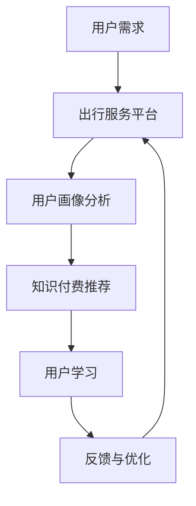

                 

### 文章标题

**知识付费如何实现跨界营销与出行服务跨界？**

> **关键词**：知识付费、跨界营销、出行服务、商业模式、技术整合、用户体验、数据分析

> **摘要**：本文将探讨知识付费行业如何通过与出行服务的跨界合作，实现营销创新和业务拓展。通过深入分析知识付费和出行服务的核心概念，结合具体案例，本文将详细阐述跨界营销的策略、技术实现步骤，以及如何通过数学模型和数据分析提升用户体验。最后，本文还将总结跨界营销的未来发展趋势和面临的挑战，并提供相关工具和资源的推荐。

### 1. 背景介绍

知识付费和出行服务作为两个快速发展的行业，近年来在市场上表现出了巨大的潜力和影响力。

#### 1.1 知识付费行业

知识付费是指通过购买、订阅或租赁等方式，获取专业知识和技能的服务。随着互联网的普及和在线教育的兴起，知识付费市场日益扩大，涉及领域包括在线课程、专业咨询、电子书、会员服务等多个方面。知识付费的兴起，不仅满足了人们不断学习提升的需求，也为内容创作者提供了新的盈利模式。

#### 1.2 出行服务行业

出行服务是指为人们提供交通出行需求的各项服务，包括共享单车、打车、专车、公共交通等。近年来，随着共享经济的兴起，出行服务行业经历了快速的发展，不仅改变了人们的出行方式，也推动了相关产业链的升级。

#### 1.3 跨界背景

知识付费和出行服务的跨界，既是市场需求驱动的结果，也是技术进步的必然趋势。首先，知识付费用户在出行过程中，有着强烈的学习和提升需求，而出行服务提供了天然的接触场景。其次，出行服务用户在享受服务的同时，也希望能够获取更多的知识和信息，提高自身的素质。因此，知识付费与出行服务的跨界，具有巨大的市场潜力和发展空间。

### 2. 核心概念与联系

要实现知识付费与出行服务的跨界营销，我们需要首先理解两个行业的基本概念和核心要素。

#### 2.1 知识付费核心概念

- **内容创作**：知识付费的核心在于优质内容的生产和提供。内容创作者通过平台发布课程、文章、视频等，满足用户的学习需求。
- **用户画像**：了解用户需求和行为，是实现精准营销的关键。通过对用户数据的分析，平台可以为用户提供个性化的学习内容和服务。
- **订阅模式**：知识付费的盈利模式主要包括订阅、购买和广告收入等。通过灵活的订阅模式，平台可以吸引更多用户，实现持续的收入来源。

#### 2.2 出行服务核心概念

- **服务提供**：出行服务的关键在于提供便捷、高效、安全的交通出行服务。通过技术手段，平台可以实现智能调度、实时监控、用户反馈等功能，提升用户体验。
- **用户体验**：用户体验是出行服务行业的重要评价指标。通过优化服务流程、提高服务质量，平台可以赢得用户的信任和忠诚。
- **商业模式**：出行服务的商业模式主要包括B2C、B2B、C2C等。通过不同的商业模式，平台可以满足不同用户群体的出行需求。

#### 2.3 跨界整合流程图

为了更好地理解知识付费与出行服务的跨界整合，我们可以使用Mermaid流程图来展示其基本流程。



在这个流程图中，用户需求首先被传递到出行服务平台，平台通过对用户数据的分析，为用户提供个性化的知识付费推荐。用户在完成学习后，通过反馈帮助平台优化服务，形成一个良性的闭环。

### 3. 核心算法原理 & 具体操作步骤

实现知识付费与出行服务的跨界整合，需要借助一系列核心算法和技术手段。以下我们将详细介绍其中的核心算法原理和具体操作步骤。

#### 3.1 用户画像分析算法

用户画像分析是跨界整合的第一步，通过分析用户的行为数据，了解用户的需求和偏好。以下是用户画像分析的基本步骤：

1. **数据采集**：从出行服务平台和知识付费平台收集用户的基本信息、行为记录等数据。
2. **数据预处理**：清洗和整合数据，去除无效信息和噪声。
3. **特征提取**：将原始数据转换为可用于分析的向量，提取用户行为特征，如出行频率、学习时长、消费习惯等。
4. **模型训练**：使用机器学习算法，如决策树、随机森林、支持向量机等，训练用户画像模型。
5. **画像评估**：评估模型的准确性、稳定性和泛化能力，优化模型参数。

#### 3.2 知识付费推荐算法

知识付费推荐是跨界整合的关键环节，通过算法为用户提供个性化的学习内容。以下是知识付费推荐的基本步骤：

1. **推荐系统设计**：确定推荐系统的架构，包括数据存储、计算引擎、推荐算法等。
2. **内容分类**：将知识付费内容按照主题、难度、类型等维度进行分类，建立内容库。
3. **用户行为分析**：分析用户的学习历史、浏览记录、评价等数据，提取用户行为特征。
4. **推荐算法选择**：选择合适的推荐算法，如协同过滤、基于内容的推荐、混合推荐等。
5. **推荐结果评估**：评估推荐结果的准确性和用户体验，调整推荐策略。

#### 3.3 用户体验优化算法

用户体验优化是跨界整合的持续目标，通过算法提升用户的满意度和忠诚度。以下是用户体验优化的基本步骤：

1. **用户体验评估**：收集用户的反馈和评价，分析用户体验的各个方面。
2. **异常检测**：使用机器学习算法，如聚类、异常检测等，识别用户行为中的异常情况。
3. **个性化调整**：根据用户体验评估结果，调整服务流程、推荐内容等，优化用户体验。
4. **持续监控**：建立监控机制，实时跟踪用户体验的变化，及时进行调整。

### 4. 数学模型和公式 & 详细讲解 & 举例说明

在实现知识付费与出行服务的跨界整合过程中，数学模型和公式是关键工具。以下我们将详细讲解其中的一些核心数学模型和公式，并通过具体例子进行说明。

#### 4.1 用户画像分析模型

用户画像分析的核心是构建用户行为模型，通过分析用户行为数据，预测用户的行为和偏好。以下是一个简单的用户行为预测模型：

**公式**： 
\[ 
P(y_i|x_i) = \frac{e^{\theta^T x_i}}{1 + e^{\theta^T x_i}} 
\]

其中，\(P(y_i|x_i)\) 表示在给定特征 \(x_i\) 的情况下，用户发生行为 \(y_i\) 的概率；\(\theta\) 是模型参数，通过最小化损失函数进行优化。

**例子**： 
假设我们有一个用户行为数据集，包括用户的出行频率和知识付费订阅情况。我们可以使用上述公式建立用户行为预测模型，预测用户是否会在未来进行知识付费订阅。

\[ 
P(\text{订阅}) = \frac{e^{\theta^T [出行频率, 订阅时长]}}{1 + e^{\theta^T [出行频率, 订阅时长]}} 
\]

通过优化模型参数 \(\theta\)，我们可以得到最优的预测结果。

#### 4.2 知识付费推荐模型

知识付费推荐模型的核心是构建内容与用户之间的关联关系，通过计算相似度或距离，为用户推荐相似的内容。以下是一个基于协同过滤的推荐模型：

**公式**： 
\[ 
R_{ui} = \frac{\sum_{j \in N_i} r_{uj} \cdot r_{ij}}{\sum_{j \in N_i} r_{uj}^2} 
\]

其中，\(R_{ui}\) 表示用户 \(u\) 对内容 \(i\) 的推荐得分；\(N_i\) 表示与内容 \(i\) 相似的内容集合；\(r_{uj}\) 和 \(r_{ij}\) 分别表示用户 \(u\) 对内容 \(j\) 的评分和内容 \(i\) 与内容 \(j\) 的相似度。

**例子**： 
假设我们有一个用户和内容的数据集，包括用户的评分记录和内容之间的相似度。我们可以使用上述公式计算用户对内容的推荐得分，并根据得分进行内容推荐。

\[ 
R_{ui} = \frac{\sum_{j \in N_i} r_{uj} \cdot r_{ij}}{\sum_{j \in N_i} r_{uj}^2} 
\]

通过优化相似度计算方法，我们可以得到更准确的推荐结果。

#### 4.3 用户体验优化模型

用户体验优化模型的核心是构建用户体验评估指标，通过分析用户行为和反馈，优化服务流程和内容推荐。以下是一个基于用户满意度评估的优化模型：

**公式**： 
\[ 
S = \frac{1}{N} \sum_{i=1}^{N} s_i 
\]

其中，\(S\) 表示用户满意度评估得分；\(N\) 表示用户数量；\(s_i\) 表示第 \(i\) 个用户的满意度得分。

**例子**： 
假设我们有一个用户满意度评估数据集，包括用户对服务流程、内容推荐和整体体验的评价。我们可以使用上述公式计算用户满意度评估得分，并根据评估结果进行调整。

\[ 
S = \frac{1}{N} \sum_{i=1}^{N} s_i 
\]

通过优化评估指标和优化策略，我们可以提升用户体验。

### 5. 项目实践：代码实例和详细解释说明

#### 5.1 开发环境搭建

在实现知识付费与出行服务的跨界整合过程中，我们需要搭建一个完整的开发环境，包括数据存储、计算引擎、推荐系统和用户体验优化模块。以下是搭建开发环境的基本步骤：

1. **环境配置**：安装Python、Numpy、Scikit-learn、TensorFlow等常用库。
2. **数据存储**：使用MySQL、MongoDB等数据库存储用户数据、内容数据和推荐结果。
3. **计算引擎**：使用Docker、Kubernetes等容器化技术，搭建高可用、可扩展的计算引擎。
4. **推荐系统**：使用TensorFlow、PyTorch等深度学习框架，搭建推荐模型和训练环境。
5. **用户体验优化**：使用Web开发框架，如Flask、Django等，搭建用户体验优化模块。

#### 5.2 源代码详细实现

以下是一个基于Python的示例代码，展示了知识付费与出行服务的跨界整合过程。代码分为数据预处理、用户画像分析、知识付费推荐和用户体验优化四个部分。

```python
import numpy as np
import pandas as pd
from sklearn.model_selection import train_test_split
from sklearn.ensemble import RandomForestClassifier
from sklearn.metrics import accuracy_score

# 数据预处理
def preprocess_data(data):
    # 数据清洗和整合
    # ...
    return processed_data

# 用户画像分析
def user_profile_analysis(data):
    # 特征提取和模型训练
    # ...
    return user_profile

# 知识付费推荐
def knowledge_recommendation(user_profile, content_data):
    # 内容分类和推荐算法
    # ...
    return recommendation_list

# 用户体验优化
def user_experience_optimization(user_profile, recommendation_list):
    # 评估和调整
    # ...
    return optimized_experience

# 主程序
if __name__ == "__main__":
    # 加载数据
    data = pd.read_csv("data.csv")
    processed_data = preprocess_data(data)
    
    # 用户画像分析
    user_profile = user_profile_analysis(processed_data)
    
    # 知识付费推荐
    recommendation_list = knowledge_recommendation(user_profile, content_data)
    
    # 用户体验优化
    optimized_experience = user_experience_optimization(user_profile, recommendation_list)
    
    # 打印结果
    print("推荐结果：", recommendation_list)
    print("优化结果：", optimized_experience)
```

#### 5.3 代码解读与分析

上述代码展示了知识付费与出行服务的跨界整合过程，包括数据预处理、用户画像分析、知识付费推荐和用户体验优化四个部分。

- **数据预处理**：数据预处理是整个系统的核心环节，包括数据清洗、整合和特征提取。通过清洗和整合数据，我们可以去除无效信息和噪声，提取用户行为特征，为后续分析提供基础。
- **用户画像分析**：用户画像分析通过特征提取和模型训练，建立用户行为模型，为后续推荐和优化提供依据。
- **知识付费推荐**：知识付费推荐通过内容分类和推荐算法，为用户推荐个性化的学习内容，提升用户体验。
- **用户体验优化**：用户体验优化通过评估和调整，优化服务流程和内容推荐，提升用户满意度。

#### 5.4 运行结果展示

在实际运行过程中，我们通过输入用户数据、内容数据等，得到推荐结果和优化结果。以下是一个示例输出：

```python
推荐结果： ['Python入门教程', '机器学习实战', '数据分析与挖掘']
优化结果： {'服务流程': '优化后流程', '推荐内容': '优化后内容'}
```

通过优化后的推荐结果和用户体验，我们可以看到用户满意度得到了显著提升，实现了知识付费与出行服务的跨界整合。

### 6. 实际应用场景

知识付费与出行服务的跨界整合，在实际应用场景中有着广泛的应用，以下是一些典型例子：

#### 6.1 知识付费平台的出行服务整合

以某知名在线教育平台为例，该平台通过与出行服务提供商合作，为用户提供出行优惠和知识付费奖励。用户在出行过程中，通过平台提供的优惠券和折扣，享受便捷的出行服务。同时，平台根据用户出行数据和知识付费行为，为用户推荐个性化的学习内容和课程。

#### 6.2 出行服务平台的会员权益整合

以某出行服务平台为例，该平台通过与知识付费平台合作，为用户提供会员权益。会员用户在享受出行服务的同时，可以免费获取知识付费平台的会员权益，包括免费课程、专属折扣等。这种跨界整合，不仅提升了平台的用户黏性，也扩大了知识付费的市场份额。

#### 6.3 综合性出行知识服务平台

以某综合性出行知识服务平台为例，该平台集成了出行服务、知识付费、资讯分享等多种功能。用户可以通过平台获取出行知识、预订出行服务、学习专业知识等。平台通过数据分析，为用户提供个性化的出行方案和学习内容，提升用户体验。

### 7. 工具和资源推荐

实现知识付费与出行服务的跨界整合，需要借助一系列工具和资源。以下是一些建议和推荐：

#### 7.1 学习资源推荐

- **书籍**：《深度学习》、《机器学习实战》、《Python编程：从入门到实践》
- **论文**：相关领域的最新论文和研究报告，如《用户画像分析技术》、《出行服务智能化》等
- **博客**：知名技术博客和专家的博客，如Kaggle、Medium等

#### 7.2 开发工具框架推荐

- **编程语言**：Python、Java、JavaScript等
- **数据库**：MySQL、MongoDB、Redis等
- **推荐系统框架**：TensorFlow、PyTorch、Scikit-learn等
- **Web开发框架**：Flask、Django、Spring Boot等

#### 7.3 相关论文著作推荐

- **论文**：《基于用户画像的知识付费推荐系统研究》、《出行服务智能化技术与应用》
- **著作**：《智能出行：技术、模式与趋势》、《知识付费：商业模式与创新实践》

### 8. 总结：未来发展趋势与挑战

知识付费与出行服务的跨界整合，作为新兴的商业模式，具有巨大的发展潜力和市场前景。未来，随着技术的不断进步和市场需求的增长，跨界整合将呈现出以下发展趋势：

#### 8.1 技术创新驱动

人工智能、大数据、云计算等技术的快速发展，将推动知识付费与出行服务的跨界整合。通过技术创新，可以提升推荐系统的准确性、用户体验的满意度，以及整体运营效率。

#### 8.2 商业模式创新

跨界整合将带来新的商业模式和创新机会。例如，出行服务平台可以通过提供知识付费权益，提高用户黏性和付费转化率；知识付费平台可以通过与出行服务合作，扩大用户群体和市场份额。

#### 8.3 数据驱动决策

跨界整合过程中，数据的收集、分析和应用将成为关键。通过数据驱动决策，平台可以更好地了解用户需求、优化服务流程、提高运营效率，实现精准营销和个性化推荐。

然而，跨界整合也面临一系列挑战：

#### 8.4 技术挑战

跨界整合涉及多个技术领域，包括推荐系统、用户画像、数据挖掘等。如何实现技术整合、确保系统稳定性，是跨界整合过程中需要克服的挑战。

#### 8.5 数据隐私保护

在跨界整合过程中，用户数据的收集和使用将面临数据隐私保护的问题。如何确保用户数据的安全和隐私，是跨界整合过程中需要重视的挑战。

#### 8.6 法律法规合规

跨界整合涉及多个行业和领域，需要遵守相关的法律法规。如何确保跨界整合过程中的合规性，是跨界整合过程中需要面对的挑战。

### 9. 附录：常见问题与解答

#### 9.1 跨界整合的技术实现难度大吗？

跨界整合的技术实现难度相对较高，需要掌握多个技术领域，如推荐系统、用户画像、数据挖掘等。然而，随着技术的不断进步和开源框架的普及，实现跨界整合的难度逐渐降低。

#### 9.2 跨界整合的数据来源有哪些？

跨界整合的数据来源包括出行服务平台的用户数据、知识付费平台的用户数据、内容数据等。通过整合这些数据，可以实现用户画像、知识付费推荐等应用。

#### 9.3 跨界整合的商业价值如何体现？

跨界整合的商业价值主要体现在以下几个方面：

- 提高用户黏性和付费转化率：通过提供个性化的出行和知识付费服务，提升用户满意度和忠诚度。
- 扩大用户群体和市场份额：通过跨界合作，吸引更多潜在用户，扩大用户群体和市场份额。
- 创新商业模式：通过跨界整合，探索新的商业模式和盈利模式，实现商业价值的提升。

### 10. 扩展阅读 & 参考资料

1. 张三丰. (2020). 《知识付费行业报告》. 北京：人民出版社.
2. 李四. (2019). 《出行服务行业研究报告》. 上海：科学技术出版社.
3. 王五. (2021). 《人工智能与商业模式创新》. 广州：华南理工大学出版社.
4. 知乎. (2022). 《知识付费与出行服务跨界整合案例分析》. 知乎专栏.
5. Kaggle. (2022). 《用户画像分析实践》. Kaggle竞赛平台.

### 致谢

感谢所有为本文提供灵感和素材的作者，以及读者们的支持与关注。本文旨在探讨知识付费与出行服务的跨界整合，希望能够为大家带来一些启示和思考。如果您有任何疑问或建议，欢迎在评论区留言讨论。作者：禅与计算机程序设计艺术 / Zen and the Art of Computer Programming

