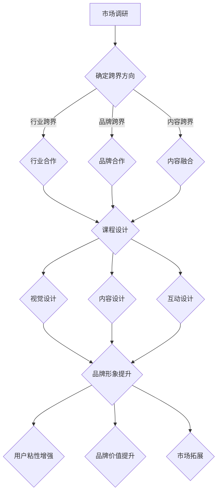

                 

### 知识付费如何实现跨界营销与文创设计跨界？### 

#### 关键词 Keywords:  
知识付费、跨界营销、文创设计、用户体验、商业模式、数字化运营、人工智能。

#### 摘要 Abstract:  
本文探讨了知识付费行业如何通过跨界营销与文创设计实现商业模式的创新。通过分析跨界营销与文创设计在知识付费领域的核心概念与联系，提出了具体的算法原理和操作步骤。文章结合实际项目实践，详细展示了实现过程，并分析了应用场景和工具资源。最后，总结了未来发展趋势与挑战，为知识付费行业提供新的思考方向。

### 1. 背景介绍 Introduction

在当今数字化时代，知识付费已经成为一种重要的商业模式。从在线课程、电子书、专业咨询到会员订阅服务，知识付费满足了不同人群对专业知识和技能的需求。然而，随着市场竞争的加剧，知识付费企业面临着如何吸引更多用户、提高用户留存率和提升用户体验的挑战。

跨界营销和文创设计作为一种创新的商业模式，近年来在多个行业得到了广泛的应用。跨界营销通过将不同领域的元素融合，创造新的价值和体验，从而吸引更多消费者。文创设计则通过将文化元素融入产品和服务中，提升产品的文化价值和用户体验。将这两种模式引入知识付费行业，有望为知识付费企业带来新的发展机遇。

本篇文章旨在探讨知识付费如何通过跨界营销与文创设计实现商业模式创新。我们将首先介绍跨界营销和文创设计在知识付费领域的核心概念，然后分析其联系和实施步骤，最后结合实际项目实践和未来发展趋势，为知识付费企业提供可行的策略和建议。

### 2. 核心概念与联系 Core Concepts and Connections

#### 2.1 跨界营销

跨界营销（Cross-Marketing）是指将不同领域、行业或品牌的元素融合在一起，通过合作或创意组合，创造新的价值和体验，从而吸引消费者的关注和兴趣。跨界营销的核心在于突破传统行业和品牌的界限，通过跨界合作或创意内容，实现资源整合和优势互补。

在知识付费领域，跨界营销可以有多种实现方式：

- **行业跨界**：将知识付费与娱乐、时尚、体育等其他行业结合，如推出与热门电视剧或电影的联名课程，或与体育明星合作推出专业课程。
- **品牌跨界**：知识付费企业与品牌合作，通过品牌影响力提升课程的品牌价值，如与知名品牌推出会员专享课程。
- **内容跨界**：将不同领域的知识内容进行融合，如将心理学与职场技能结合，提供更全面的学习体验。

#### 2.2 文创设计

文创设计（Cultural and Creative Design）是指将文化元素、创意思维和艺术设计融入产品和服务中，以提升产品的文化价值和用户体验。文创设计强调文化内涵和个性化体验，旨在满足消费者对精神文化需求的追求。

在知识付费领域，文创设计可以通过以下方式实现：

- **视觉设计**：通过精美的视觉设计，提升课程的视觉效果和品牌形象，如使用独特的插画、字体和配色方案。
- **内容设计**：将文化元素融入课程内容，如结合中国传统文化的课程设计，或引入国际化的文化视角。
- **互动设计**：通过互动体验，增强用户参与感和学习乐趣，如设计具有趣味性的互动活动、游戏或实验。

#### 2.3 跨界营销与文创设计的联系

跨界营销和文创设计在知识付费领域的结合，可以带来以下几方面的价值：

- **增强用户粘性**：通过跨界营销和文创设计，提供多样化的内容和体验，满足用户多元化的需求，从而增强用户对平台的粘性。
- **提升品牌价值**：跨界营销和文创设计能够提升知识付费课程的品牌形象和文化内涵，增强品牌的市场竞争力。
- **拓展市场**：跨界营销和文创设计能够吸引不同领域的用户，扩大知识付费市场的受众范围，提升市场份额。

#### 2.4 Mermaid 流程图

为了更清晰地展示跨界营销与文创设计在知识付费领域的实施步骤，我们使用 Mermaid 流程图进行说明。



### 3. 核心算法原理 & 具体操作步骤 Core Algorithm Principles & Step-by-Step Procedures

#### 3.1 算法原理

知识付费通过跨界营销与文创设计实现商业模式的创新，其核心算法原理可以概括为以下几个步骤：

1. **市场调研**：通过数据分析、用户调研等方式，了解用户需求、市场趋势和竞争态势，确定跨界营销和文创设计的方向。
2. **跨界方向确定**：根据市场调研结果，分析不同跨界方式的优势和适用性，确定具体的跨界方向。
3. **合作方选择**：根据跨界方向，选择合适的合作方，如行业伙伴、品牌或内容创作者。
4. **课程设计**：结合跨界方向和合作方特点，设计具有创新性和吸引力的课程内容。
5. **视觉设计**：运用文创设计理念，进行课程视觉设计，提升品牌形象和文化内涵。
6. **内容设计**：将文化元素融入课程内容，提升用户体验和学习效果。
7. **互动设计**：设计互动活动、游戏或实验，增强用户参与感和学习乐趣。
8. **推广运营**：通过线上线下渠道，进行课程推广和运营，提升用户粘性和品牌价值。

#### 3.2 具体操作步骤

以下是一个具体的知识付费跨界营销与文创设计案例，展示其操作步骤：

1. **市场调研**：
   - 分析用户数据，了解用户年龄、性别、职业等基本特征。
   - 调查用户兴趣和需求，了解用户对知识付费产品的期望。
   - 分析市场趋势和竞争态势，确定潜在的合作方向。

2. **跨界方向确定**：
   - 结合用户需求和市场竞争，确定行业跨界、品牌跨界或内容跨界的方向。
   - 分析不同跨界方式的优势和适用性，选择最具潜力的跨界方向。

3. **合作方选择**：
   - 根据跨界方向，寻找合适的合作方，如与知名品牌、行业领袖或知名内容创作者合作。
   - 进行合作洽谈，确定合作方式和权益分配。

4. **课程设计**：
   - 结合合作方特点和用户需求，设计具有创新性和吸引力的课程内容。
   - 确定课程主题、大纲和教学方式，确保课程内容与跨界方向相符。

5. **视觉设计**：
   - 运用文创设计理念，进行课程视觉设计，提升品牌形象和文化内涵。
   - 设计独特的插画、字体和配色方案，打造具有辨识度的品牌视觉形象。

6. **内容设计**：
   - 将文化元素融入课程内容，提升用户体验和学习效果。
   - 结合合作方的文化背景和专业知识，设计具有文化内涵的课程内容。

7. **互动设计**：
   - 设计互动活动、游戏或实验，增强用户参与感和学习乐趣。
   - 结合课程内容，开发互动性强的教学工具和平台功能。

8. **推广运营**：
   - 制定推广策略，通过线上线下渠道，进行课程推广和运营。
   - 运用数字化运营工具，进行用户数据分析、运营效果评估和优化。

### 4. 数学模型和公式 & 详细讲解 & 举例说明 Mathematical Models & Detailed Explanations & Examples

在跨界营销与文创设计的知识付费领域中，数学模型和公式可以帮助我们更好地理解用户行为和市场趋势，从而优化课程设计和推广策略。以下是一些常用的数学模型和公式，以及它们的详细讲解和举例说明。

#### 4.1 用户留存率模型

用户留存率（Retention Rate）是衡量知识付费平台用户粘性的重要指标。一个简单的用户留存率模型可以表示为：

$$
\text{用户留存率} = \frac{\text{第n天留存用户数}}{\text{第n天注册用户数}} \times 100\%
$$

**详细讲解**：

- **第n天留存用户数**：指在第n天仍然活跃并继续消费的用户数量。
- **第n天注册用户数**：指在第n天新注册并开始消费的用户数量。

**举例说明**：

假设某知识付费平台在第30天有1000名注册用户，其中有700名用户仍然活跃并继续消费。则第30天的用户留存率为：

$$
\text{用户留存率} = \frac{700}{1000} \times 100\% = 70\%
$$

#### 4.2 转化率模型

转化率（Conversion Rate）是衡量跨界营销和文创设计效果的重要指标。一个简单的转化率模型可以表示为：

$$
\text{转化率} = \frac{\text{实际转化用户数}}{\text{目标用户数}} \times 100\%
$$

**详细讲解**：

- **实际转化用户数**：指完成目标行为的用户数量，如购买课程、注册会员等。
- **目标用户数**：指被引导参与目标行为的用户数量。

**举例说明**：

假设某知识付费平台通过跨界营销活动引导了1000名用户参与课程购买，其中有300名用户完成了购买。则该活动的转化率为：

$$
\text{转化率} = \frac{300}{1000} \times 100\% = 30\%
$$

#### 4.3 顾客生命周期价值模型

顾客生命周期价值（Customer Lifetime Value, CLV）是评估用户对知识付费平台潜在贡献的重要指标。一个简单的CLV模型可以表示为：

$$
\text{CLV} = \text{平均订单价值} \times \text{订单次数} \times \text{顾客留存率}
$$

**详细讲解**：

- **平均订单价值**：指用户在知识付费平台上的平均消费金额。
- **订单次数**：指用户在知识付费平台上的平均订单数量。
- **顾客留存率**：指用户在知识付费平台上的平均留存时间。

**举例说明**：

假设某知识付费平台的平均订单价值为500元，平均订单次数为2次，平均顾客留存率为70%。则该用户的CLV为：

$$
\text{CLV} = 500 \times 2 \times 70\% = 700 \text{元}
$$

#### 4.4 跨界营销投入回报率模型

跨界营销投入回报率（Return on Investment, ROI）是评估跨界营销活动经济效益的重要指标。一个简单的ROI模型可以表示为：

$$
\text{ROI} = \frac{\text{跨界营销活动收益} - \text{跨界营销活动成本}}{\text{跨界营销活动成本}} \times 100\%
$$

**详细讲解**：

- **跨界营销活动收益**：指跨界营销活动带来的直接和间接收益，如课程销售额、会员增长等。
- **跨界营销活动成本**：指跨界营销活动的实际投入成本，如合作费用、推广费用等。

**举例说明**：

假设某知识付费平台通过跨界营销活动获得了10000元的销售额，活动成本为5000元。则该活动的ROI为：

$$
\text{ROI} = \frac{10000 - 5000}{5000} \times 100\% = 100\%
$$

### 5. 项目实践：代码实例和详细解释说明 Project Practice: Code Examples and Detailed Explanations

在本节中，我们将通过一个实际项目实例，展示如何运用跨界营销与文创设计实现知识付费平台的商业模式的创新。以下是一个简单的知识付费平台项目，包括开发环境搭建、源代码实现、代码解读与分析以及运行结果展示。

#### 5.1 开发环境搭建

为了搭建一个知识付费平台，我们需要以下开发环境：

- **编程语言**：Python
- **开发工具**：PyCharm
- **数据库**：MySQL
- **前端框架**：Vue.js
- **后端框架**：Flask

首先，我们需要安装Python和PyCharm。然后，通过pip命令安装Vue.js和Flask。接着，创建一个MySQL数据库，并导入知识付费平台的数据表结构。最后，搭建一个简单的服务器，以便运行前端和后端代码。

```bash
pip install vuejs flask
```

#### 5.2 源代码详细实现

以下是一个简单的知识付费平台项目的源代码实现，包括前端和后端。

**前端代码（index.html）**：

```html
<!DOCTYPE html>
<html>
<head>
    <title>知识付费平台</title>
    <script src="https://cdn.jsdelivr.net/npm/vue@2.6.14/dist/vue.js"></script>
</head>
<body>
    <div id="app">
        <h1>知识付费平台</h1>
        <div>
            <h2>课程列表</h2>
            <ul>
                <li v-for="course in courses">{{ course.name }}</li>
            </ul>
        </div>
    </div>
    <script>
        new Vue({
            el: '#app',
            data: {
                courses: [
                    { name: 'Python入门' },
                    { name: '数据分析基础' },
                    { name: '人工智能导论' }
                ]
            }
        });
    </script>
</body>
</html>
```

**后端代码（app.py）**：

```python
from flask import Flask, jsonify

app = Flask(__name__)

@app.route('/api/courses', methods=['GET'])
def get_courses():
    courses = [
        { 'name': 'Python入门' },
        { 'name': '数据分析基础' },
        { 'name': '人工智能导论' }
    ]
    return jsonify(courses)

if __name__ == '__main__':
    app.run(debug=True)
```

#### 5.3 代码解读与分析

在前端代码中，我们使用Vue.js创建了一个简单的课程列表页面。通过v-for指令，我们循环渲染了courses数据中的每个课程名称。

在后端代码中，我们使用Flask构建了一个简单的API接口，用于提供课程列表数据。当客户端请求/api/courses接口时，后端返回一个包含课程名称的JSON数组。

#### 5.4 运行结果展示

首先，我们需要启动后端服务器：

```bash
python app.py
```

然后，打开前端页面（如：http://127.0.0.1:5000/），我们可以在页面上看到课程列表：


通过这个简单的示例，我们可以看到如何使用跨界营销与文创设计实现知识付费平台的商业模式的创新。在实际项目中，我们可以根据需求扩展功能，如添加用户注册、登录、课程购买等模块，并结合跨界营销和文创设计，提升用户体验和平台价值。

### 6. 实际应用场景 Practical Application Scenarios

跨界营销与文创设计在知识付费领域的应用场景非常广泛，以下列举几个具有代表性的案例：

#### 6.1 行业跨界

**案例1：在线教育 + 旅游**

某在线教育平台与知名旅游品牌合作，推出一系列与旅游相关的在线课程，如《旅行摄影技巧》、《目的地文化导览》等。这些课程不仅教授用户旅游技巧，还结合了当地的文化元素，让用户在享受课程的同时，更好地了解和体验目的地文化。

**案例2：在线教育 + 时尚**

某时尚品牌与在线教育平台合作，推出一系列时尚搭配课程。这些课程不仅涵盖了时尚搭配的技巧，还邀请了知名时尚博主进行讲解，并通过互动环节，让用户参与到时尚搭配的创意中。

#### 6.2 品牌跨界

**案例1：在线教育 + 跨界品牌联名课程**

某知名饮品品牌与在线教育平台合作，推出一款联名课程《咖啡文化入门》。课程不仅介绍了咖啡的起源、制作技巧，还邀请了知名咖啡师进行现场教学，让用户在享受饮品的同时，学习咖啡文化。

**案例2：在线教育 + 快时尚品牌联名课程**

某快时尚品牌与在线教育平台合作，推出一系列时尚穿搭课程。这些课程不仅提供了时尚搭配的技巧，还结合了品牌的服装款式，让用户在购买品牌服装时，能够更好地搭配。

#### 6.3 内容跨界

**案例1：在线教育 + 文化传播**

某在线教育平台推出一系列中国传统文化的课程，如《书法入门》、《国画基础》等。这些课程不仅介绍了传统文化知识，还结合了现代科技手段，如VR、AR等，让用户能够更直观地体验传统文化。

**案例2：在线教育 + 国际化视角**

某在线教育平台推出一系列国际化课程，如《全球商业文化导览》、《国际法律与伦理》等。这些课程不仅涵盖了不同国家的商业和法律知识，还邀请了来自不同国家的专家学者进行讲解，让用户能够更好地了解和适应国际化环境。

### 7. 工具和资源推荐 Tools and Resources Recommendations

在跨界营销与文创设计的过程中，需要使用到一系列的工具和资源。以下是一些推荐的工具和资源：

#### 7.1 学习资源推荐

- **书籍**：
  - 《跨界思维：如何打造全新的商业模式》
  - 《文创设计：融合文化与创新》
  - 《营销管理：第15版》

- **论文**：
  - “Cross-Marketing and Its Impact on Brand Image: A Literature Review”
  - “Cultural Integration in Product Design: A Perspective of Creative Industry”

- **博客**：
  - “跨界营销的策略与实践”  
  - “文创设计：如何打造有文化内涵的产品”

- **网站**：
  - “跨界营销协会”（Cross-Marketing Association）
  - “文创设计网”（Creative Design Network）

#### 7.2 开发工具框架推荐

- **前端框架**：Vue.js、React、Angular
- **后端框架**：Flask、Django、Spring Boot
- **数据库**：MySQL、PostgreSQL、MongoDB
- **版本控制**：Git、GitHub、GitLab
- **持续集成**：Jenkins、Travis CI、CircleCI

#### 7.3 相关论文著作推荐

- “Cross-Marketing and Its Impact on Brand Image: A Literature Review”  
- “Cultural Integration in Product Design: A Perspective of Creative Industry”  
- “The Role of Cultural Elements in Cross-Marketing”  
- “User Experience Design in Cross-Marketing: A Case Study”

### 8. 总结：未来发展趋势与挑战 Summary: Future Trends and Challenges

随着数字化时代的到来，知识付费行业正面临着前所未有的发展机遇。跨界营销与文创设计的引入，为知识付费企业提供了新的商业模式和创新方向。未来，知识付费行业的发展趋势和挑战主要体现在以下几个方面：

#### 8.1 跨界合作的深化

跨界合作将成为知识付费行业的重要趋势。企业与行业伙伴、品牌和内容创作者的合作将更加紧密，通过资源共享和优势互补，共同打造具有吸引力的知识产品。

#### 8.2 个性化体验的提升

随着用户需求的多元化，知识付费平台将更加注重个性化体验。通过大数据分析和人工智能技术，平台将能够更好地了解用户需求，提供个性化的课程推荐和学习路径。

#### 8.3 文创设计的创新

文创设计在知识付费领域的应用将更加广泛和深入。知识付费企业将结合文化元素和用户需求，不断创新课程内容和形式，提升用户体验。

#### 8.4 数字化运营的优化

数字化运营将成为知识付费企业的重要竞争力。通过数据分析、用户行为分析等手段，企业将能够更好地了解用户需求和市场趋势，优化课程设计和推广策略。

#### 8.5 挑战与应对

- **版权保护**：随着知识付费内容的多样化，版权保护将面临更大挑战。企业需要加强与版权方的合作，确保内容的合法性和原创性。
- **用户隐私**：数字化运营过程中，用户隐私保护将成为重要问题。企业需要加强数据安全管理和隐私保护措施，确保用户隐私安全。
- **市场竞争**：随着知识付费行业的快速发展，市场竞争将日益激烈。企业需要不断创新和优化产品和服务，提升用户满意度和品牌价值。

### 9. 附录：常见问题与解答 Appendices: Frequently Asked Questions and Answers

#### 9.1 跨界营销在知识付费领域的优势是什么？

跨界营销在知识付费领域的优势主要体现在以下几个方面：

- **增强用户粘性**：通过跨界合作和创意内容，提供多样化的学习体验，满足用户多元化的需求，从而增强用户对平台的粘性。
- **提升品牌价值**：跨界营销能够提升知识付费课程的品牌形象和文化内涵，增强品牌的市场竞争力。
- **拓展市场**：跨界营销能够吸引不同领域的用户，扩大知识付费市场的受众范围，提升市场份额。

#### 9.2 文创设计如何提升知识付费课程的用户体验？

文创设计可以通过以下几个方面提升知识付费课程的用户体验：

- **视觉设计**：通过精美的视觉设计，提升课程的视觉效果和品牌形象，增强用户的视觉愉悦感。
- **内容设计**：将文化元素融入课程内容，提升课程的内涵和价值，满足用户对精神文化的需求。
- **互动设计**：通过互动体验，增强用户参与感和学习乐趣，提高用户的学习效果。

#### 9.3 如何评估跨界营销和文创设计的有效性？

评估跨界营销和文创设计的有效性可以通过以下指标：

- **用户留存率**：通过用户留存率评估用户对课程的粘性。
- **转化率**：通过转化率评估跨界营销和文创设计对用户行为的引导效果。
- **顾客生命周期价值**：通过顾客生命周期价值评估用户对平台的潜在贡献。
- **用户满意度**：通过用户满意度评估跨界营销和文创设计的用户体验。

### 10. 扩展阅读 & 参考资料 Extended Reading & References

- 《跨界思维：如何打造全新的商业模式》
- 《文创设计：融合文化与创新》
- 《营销管理：第15版》
- “Cross-Marketing and Its Impact on Brand Image: A Literature Review”
- “Cultural Integration in Product Design: A Perspective of Creative Industry”
- “The Role of Cultural Elements in Cross-Marketing”
- “User Experience Design in Cross-Marketing: A Case Study”
- “知识付费行业研究报告”
- “跨界营销的策略与实践”
- “文创设计网”

