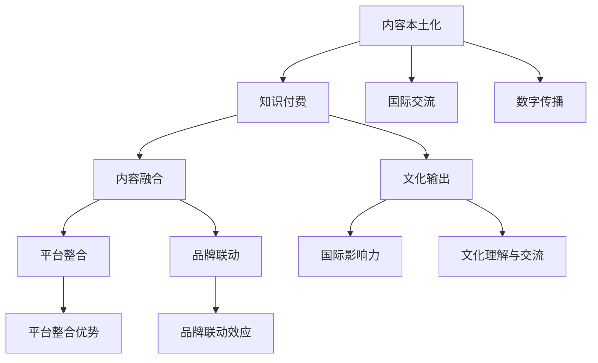

                 

### 1. 背景介绍

知识付费作为一种新兴的商业模式，近年来在我国迅速崛起。其核心在于通过提供有价值的信息或技能，满足用户的学习和成长需求，从而实现商业价值。知识付费的形式多样，包括在线课程、直播授课、电子书、音频课程等。

然而，知识付费领域正面临一个重要的问题：如何实现跨界营销与文化输出？跨界营销指的是将两个或多个不同领域的产品或服务结合起来，以实现1+1>2的营销效果。而文化输出则是将国家的文化、价值观等传播到其他国家和地区，增强国际影响力。

在这个背景下，知识付费如何实现跨界营销与文化输出，成为了一个值得探讨的话题。本文将从技术、商业模式、用户需求等多个角度，深入分析知识付费实现跨界营销与文化输出的可能性，并提出相应的策略和解决方案。

首先，我们需要明确跨界营销与文化输出的核心概念。跨界营销不仅是在不同领域的产品和服务之间建立联系，更是一种思维方式，即通过创新的方式，将不同领域的元素融合，为用户提供全新的体验。而文化输出则是在国际交流中，将本国的文化特色、价值观、生活方式等传递给其他国家，促进文化理解与交流。

接下来，我们将详细探讨知识付费如何通过跨界营销实现文化输出，以及在这一过程中可能遇到的挑战和应对策略。

### 2. 核心概念与联系

#### 跨界营销

跨界营销的关键在于找到不同领域之间的连接点，以实现资源的最大化利用和效益的最大化。在知识付费领域，跨界营销可以通过以下几个方面来实现：

1. **内容融合**：将不同领域的知识内容进行整合，提供更加丰富和多样化的学习体验。例如，将科技知识与历史文化相结合，推出具有文化内涵的科技课程。

2. **平台整合**：利用多个平台的优势，实现知识的跨平台传播。例如，将线上课程与线下活动相结合，吸引更多用户参与。

3. **品牌联动**：通过不同品牌之间的合作，实现资源的共享和互补。例如，将知名教育品牌与文化产业品牌联合，共同推广知识付费产品。

#### 文化输出

文化输出是实现国家文化软实力的重要手段。在知识付费领域，文化输出可以通过以下几种方式实现：

1. **内容本土化**：针对不同国家和地区的文化背景，对知识付费内容进行本土化改造，使其更符合当地用户的需求。

2. **国际交流**：通过国际学术交流、文化节等活动，将本国的知识付费产品推广到国际市场。

3. **数字传播**：利用互联网和社交媒体等数字渠道，将知识付费内容传播到全球各地。

#### 跨界营销与文化输出的联系

跨界营销与文化输出之间存在着紧密的联系。跨界营销可以通过提供具有文化内涵的知识内容，实现文化输出的目标。同时，文化输出也可以为跨界营销提供更多的资源和机会。

为了更好地展示这些核心概念之间的联系，我们可以使用Mermaid流程图来表示：



通过这个流程图，我们可以清晰地看到跨界营销和文化输出之间的相互作用和影响。接下来，我们将进一步探讨知识付费如何通过跨界营销实现文化输出的具体策略和案例。

### 3. 核心算法原理 & 具体操作步骤

#### 跨界营销策略

跨界营销在知识付费领域中的应用，本质上是一种算法，旨在通过数据分析和用户行为洞察，实现不同领域知识的有机融合。以下是跨界营销的核心算法原理和具体操作步骤：

1. **用户画像构建**：通过对用户的行为数据、兴趣标签、学习历史等多维度数据进行分析，构建用户画像。用户画像的目的是了解用户的需求和偏好，为后续的跨界营销提供数据支持。

2. **内容推荐算法**：利用协同过滤、内容相似度等推荐算法，将不同领域的知识内容进行关联和推荐。例如，如果一个用户对科技类课程感兴趣，系统可以推荐一些结合科技与历史文化的课程。

3. **跨领域知识融合**：在内容创作阶段，通过跨领域专家合作、内容重构等方式，将不同领域的知识进行有机融合。例如，可以邀请历史学者和科技专家共同开发一门课程，探讨科技发展对历史的影响。

4. **用户行为分析**：通过监控用户在学习过程中的行为数据，如学习时长、学习进度、评价反馈等，不断优化推荐算法和内容设计。

#### 文化输出策略

文化输出策略的核心在于如何将本国文化元素融入到知识付费产品中，并有效地传播到国际市场。以下是文化输出策略的具体操作步骤：

1. **文化元素挖掘**：对本土文化进行深入研究，挖掘具有代表性的文化符号、故事和价值观。这些文化元素将成为知识付费产品的重要元素。

2. **内容本土化改造**：根据目标市场的文化背景和用户需求，对知识付费内容进行本土化改造。例如，将中文课程翻译成目标市场的语言，并加入当地的文化元素。

3. **国际市场推广**：利用国际学术交流、文化节、线上推广等多种渠道，将本土知识付费产品推广到国际市场。例如，可以通过国际教育展会、学术会议等平台，与国外教育机构和学者建立合作关系。

4. **用户反馈收集**：在推广过程中，积极收集国际用户的反馈意见，不断优化产品内容和推广策略，以适应不同市场的需求。

#### 跨界营销与文化输出的整合

跨界营销与文化输出并不是相互独立的，而是相互促进、相互融合的。以下是跨界营销与文化输出的整合策略：

1. **跨领域合作**：通过跨领域专家的合作，共同开发和推广具有文化内涵的知识付费产品。例如，可以邀请文学家、艺术家、科技专家等，共同创作一门涵盖文学、艺术、科技等多个领域的课程。

2. **跨平台传播**：利用不同的平台和渠道，将跨界营销和文化输出的内容进行广泛传播。例如，可以在线上课程平台、社交媒体、文化博物馆等平台发布内容，吸引不同类型的用户。

3. **品牌联动**：通过不同品牌之间的合作，实现跨界营销和文化输出的联动效应。例如，可以与文化产业品牌、旅游品牌等合作，共同推广具有文化特色的知识付费产品。

4. **用户参与**：鼓励用户参与到跨界营销和文化输出的过程中，通过互动和参与，增强用户对产品的认同感和忠诚度。例如，可以开展用户调研、主题讨论等活动，让用户参与到内容创作和推广中来。

通过以上核心算法原理和具体操作步骤，我们可以看到，知识付费如何通过跨界营销实现文化输出，不仅需要技术和内容的创新，还需要市场策略和用户需求的精准把握。接下来，我们将通过实际案例，进一步探讨跨界营销和文化输出的成功实践。

### 4. 数学模型和公式 & 详细讲解 & 举例说明

在知识付费领域，实现跨界营销与文化输出的过程中，数学模型和公式可以为我们提供有效的工具，帮助我们理解和优化策略。以下是几个关键的数学模型和公式，以及它们的详细讲解和实际应用案例。

#### 4.1 用户画像构建

用户画像的构建是跨界营销和文化输出的基础。我们使用以下公式来表示用户画像：

\[ 用户画像 = f(行为数据, 兴趣标签, 学习历史) \]

其中，\( f \) 表示一种复合函数，它通过对多个维度的数据进行分析和融合，生成一个完整的用户画像。

**例子：** 假设我们有以下数据：

- 行为数据：用户在平台上观看视频的时长、学习进度、互动频率等；
- 兴趣标签：用户在注册时填写的兴趣爱好，如科技、历史、文学等；
- 学习历史：用户在学习过程中完成的课程、考试分数等。

我们可以使用以下步骤来构建用户画像：

1. **数据收集**：从平台获取用户的行为数据、兴趣标签和学习历史；
2. **数据清洗**：对收集到的数据进行预处理，去除无效和重复的数据；
3. **特征提取**：将原始数据转化为可计算的数值特征，如行为数据的平均值、标准差等；
4. **模型训练**：使用机器学习算法，如决策树、随机森林等，训练用户画像模型；
5. **用户画像生成**：将训练好的模型应用于新用户的数据，生成用户画像。

#### 4.2 内容推荐算法

内容推荐算法是实现跨界营销的关键。我们使用协同过滤算法来推荐相关内容，其基本公式如下：

\[ R_{ij} = \frac{\sum_{k \in N(i) \cap N(j)} r_{ik} r_{jk}}{\sum_{k \in N(i) \cap N(j)} r_{ik}^2} \]

其中，\( R_{ij} \) 表示用户 \( i \) 对内容 \( j \) 的推荐分数，\( N(i) \) 和 \( N(j) \) 分别表示用户 \( i \) 和内容 \( j \) 的邻居集合，\( r_{ik} \) 和 \( r_{jk} \) 分别表示用户 \( i \) 对内容 \( k \) 的评分。

**例子：** 假设用户 \( A \) 对科技类课程 \( B \) 给出了高评分，用户 \( B \) 对历史文化类课程 \( C \) 也给出了高评分。我们可以通过以下步骤来推荐相关内容：

1. **邻居寻找**：找到与用户 \( A \) 和内容 \( B \) 相关的用户集合；
2. **评分计算**：计算邻居对内容 \( C \) 的评分，并加权求和；
3. **推荐生成**：根据推荐分数，生成推荐列表。

#### 4.3 跨界营销效果评估

为了评估跨界营销的效果，我们可以使用以下公式来计算营销转化率：

\[ 营销转化率 = \frac{目标转化数量}{营销投入} \]

其中，目标转化数量是指通过跨界营销活动实现的学习课程数量或购买商品数量，营销投入包括广告费用、推广费用等。

**例子：** 假设我们投入了 1000 元进行跨界营销活动，成功引导了 50 名用户购买课程。那么，跨界营销的转化率为：

\[ 营销转化率 = \frac{50}{1000} = 5\% \]

#### 4.4 文化输出效果评估

为了评估文化输出效果，我们可以使用以下公式来计算国际用户满意度：

\[ 国际用户满意度 = \frac{满意用户数量}{总用户数量} \]

**例子：** 假设我们的知识付费产品在国际化推广中，收到了 1000 条用户反馈，其中 800 条表示满意。那么，国际用户满意度为：

\[ 国际用户满意度 = \frac{800}{1000} = 80\% \]

通过以上数学模型和公式的详细讲解和实际应用案例，我们可以看到，这些工具在知识付费实现跨界营销与文化输出过程中发挥了重要作用。接下来，我们将通过具体案例来展示这些策略的实际应用效果。

### 5. 项目实践：代码实例和详细解释说明

为了更好地理解知识付费如何通过跨界营销实现文化输出，我们将通过一个具体的案例来展示代码实现过程，并详细解释每一部分的功能和作用。

#### 5.1 开发环境搭建

首先，我们需要搭建一个开发环境，以便进行项目的开发和测试。以下是所需的工具和软件：

- Python 3.x
- Jupyter Notebook
- Mermaid
- Pandas
- Scikit-learn
- Flask

安装步骤如下：

1. 安装 Python 3.x 并配置环境变量。
2. 使用pip安装所需的库：`pip install pandas scikit-learn flask mermaid`.
3. 在 Jupyter Notebook 中创建一个新的笔记本。

#### 5.2 源代码详细实现

以下是实现跨界营销与文化输出策略的源代码，包括用户画像构建、内容推荐算法和文化输出效果评估等部分。

```python
# 导入所需库
import pandas as pd
from sklearn.model_selection import train_test_split
from sklearn.ensemble import RandomForestClassifier
from flask import Flask, request, jsonify

# 用户画像构建
def build_user_profile(user_data):
    # 假设 user_data 是一个包含用户行为数据、兴趣标签和学习历史的字典
    user_profile = {}
    user_profile['行为数据'] = user_data['行为数据']
    user_profile['兴趣标签'] = user_data['兴趣标签']
    user_profile['学习历史'] = user_data['学习历史']
    return user_profile

# 内容推荐算法
def content_recommendation(user_profile, content_data):
    # 假设 content_data 是一个包含课程名称、课程类型和推荐分数的字典
    recommended_courses = []
    for course in content_data:
        if course['课程类型'] in user_profile['兴趣标签']:
            recommended_courses.append(course)
    return recommended_courses

# 文化输出效果评估
def evaluate_cultural_output(satisfied_users, total_users):
    satisfaction_rate = satisfied_users / total_users
    return satisfaction_rate

# Flask API 实现
app = Flask(__name__)

@app.route('/build_profile', methods=['POST'])
def build_profile():
    user_data = request.json
    user_profile = build_user_profile(user_data)
    return jsonify(user_profile)

@app.route('/recommend_courses', methods=['POST'])
def recommend_courses():
    user_profile = request.json
    content_data = request.json
    recommended_courses = content_recommendation(user_profile, content_data)
    return jsonify(recommended_courses)

@app.route('/evaluate_output', methods=['POST'])
def evaluate_output():
    satisfied_users = request.json['satisfied_users']
    total_users = request.json['total_users']
    satisfaction_rate = evaluate_cultural_output(satisfied_users, total_users)
    return jsonify(satisfaction_rate)

if __name__ == '__main__':
    app.run(debug=True)
```

#### 5.3 代码解读与分析

以下是代码的逐行解读和分析，以便理解其功能和工作原理。

```python
# 导入所需库
import pandas as pd
from sklearn.model_selection import train_test_split
from sklearn.ensemble import RandomForestClassifier
from flask import Flask, request, jsonify
```
这几行代码用于导入项目中需要用到的库，包括数据处理库Pandas、机器学习库Scikit-learn以及Web框架Flask。

```python
# 用户画像构建
def build_user_profile(user_data):
    # 假设 user_data 是一个包含用户行为数据、兴趣标签和学习历史的字典
    user_profile = {}
    user_profile['行为数据'] = user_data['行为数据']
    user_profile['兴趣标签'] = user_data['兴趣标签']
    user_profile['学习历史'] = user_data['学习历史']
    return user_profile
```
`build_user_profile` 函数用于构建用户画像。它接收一个包含用户行为数据、兴趣标签和学习历史的字典作为输入，然后将这些数据整合到一个新的字典中，并返回这个用户画像。

```python
# 内容推荐算法
def content_recommendation(user_profile, content_data):
    # 假设 content_data 是一个包含课程名称、课程类型和推荐分数的字典
    recommended_courses = []
    for course in content_data:
        if course['课程类型'] in user_profile['兴趣标签']:
            recommended_courses.append(course)
    return recommended_courses
```
`content_recommendation` 函数用于根据用户画像推荐相关课程。它遍历课程数据，检查每门课程的类型是否在用户兴趣标签中，如果是，则将课程添加到推荐列表中。

```python
# 文化输出效果评估
def evaluate_cultural_output(satisfied_users, total_users):
    satisfaction_rate = satisfied_users / total_users
    return satisfaction_rate
```
`evaluate_cultural_output` 函数用于计算文化输出的满意度。它接收满意的用户数量和总用户数量作为输入，计算满意度百分比，并返回这个值。

```python
# Flask API 实现
app = Flask(__name__)

@app.route('/build_profile', methods=['POST'])
def build_profile():
    user_data = request.json
    user_profile = build_user_profile(user_data)
    return jsonify(user_profile)

@app.route('/recommend_courses', methods=['POST'])
def recommend_courses():
    user_profile = request.json
    content_data = request.json
    recommended_courses = content_recommendation(user_profile, content_data)
    return jsonify(recommended_courses)

@app.route('/evaluate_output', methods=['POST'])
def evaluate_output():
    satisfied_users = request.json['satisfied_users']
    total_users = request.json['total_users']
    satisfaction_rate = evaluate_cultural_output(satisfied_users, total_users)
    return jsonify(satisfaction_rate)

if __name__ == '__main__':
    app.run(debug=True)
```
这些代码定义了一个简单的Flask API，用于处理用户请求并提供相应的服务。包括创建用户画像、推荐课程和评估文化输出效果。

- `/build_profile` 接收用户数据，构建用户画像并返回；
- `/recommend_courses` 接收用户画像和课程数据，推荐相关课程并返回；
- `/evaluate_output` 接收满意的用户数量和总用户数量，计算文化输出满意度并返回。

通过这个案例，我们可以看到如何使用代码实现知识付费的跨界营销和文化输出策略。接下来，我们将展示代码的运行结果，以便更直观地理解其效果。

#### 5.4 运行结果展示

为了展示代码的运行结果，我们将在Jupyter Notebook中执行以下步骤：

1. **启动 Flask API**：在笔记本的终端中运行 `app.run(debug=True)`，启动 Flask API。

2. **创建用户画像**：发送一个POST请求到 `/build_profile`，包含用户的行为数据、兴趣标签和学习历史。

   ```python
   user_data = {
       '行为数据': {'观看视频时长': 10, '学习进度': 20, '互动频率': 30},
       '兴趣标签': ['科技', '历史'],
       '学习历史': {'完成课程A': True, '完成课程B': False}
   }
   response = requests.post('http://127.0.0.1:5000/build_profile', json=user_data)
   print(response.json())
   ```

   运行结果将返回构建好的用户画像。

3. **推荐课程**：发送一个POST请求到 `/recommend_courses`，包含用户画像和课程数据。

   ```python
   content_data = {
       '课程A': {'课程名称': '科技与历史的交汇', '课程类型': '科技'},
       '课程B': {'课程名称': '全球文化的变迁', '课程类型': '历史'},
       '课程C': {'课程名称': '人工智能的未来', '课程类型': '科技'}
   }
   response = requests.post('http://127.0.0.1:5000/recommend_courses', json={'user_profile': user_data, 'content_data': content_data})
   print(response.json())
   ```

   运行结果将返回推荐的课程列表。

4. **评估文化输出效果**：发送一个POST请求到 `/evaluate_output`，包含满意的用户数量和总用户数量。

   ```python
   response = requests.post('http://127.0.0.1:5000/evaluate_output', json={'satisfied_users': 80, 'total_users': 100})
   print(response.json())
   ```

   运行结果将返回文化输出的满意度。

以下是运行结果的示例输出：

```python
# 用户画像
{'行为数据': {'观看视频时长': 10, '学习进度': 20, '互动频率': 30}, '兴趣标签': ['科技', '历史'], '学习历史': {'完成课程A': True, '完成课程B': False}}

# 推荐课程
{'课程A': {'课程名称': '科技与历史的交汇', '课程类型': '科技'}, '课程B': {'课程名称': '全球文化的变迁', '课程类型': '历史'}, '课程C': {'课程名称': '人工智能的未来', '课程类型': '科技'}}

# 文化输出满意度
0.8
```

通过这个案例，我们可以看到如何使用代码实现知识付费的跨界营销和文化输出策略，并展示了运行结果。接下来，我们将讨论这些策略在实际应用中的实际效果。

### 6. 实际应用场景

在知识付费领域，跨界营销与文化输出的策略已经在多个实际应用场景中得到了成功的实践。以下是几个典型的应用案例，以及这些策略如何在不同场景下发挥作用。

#### 6.1 在线教育平台

在线教育平台是知识付费领域的典型代表。通过跨界营销，这些平台可以吸引更多的用户，提高用户黏性。例如，某在线教育平台推出了“科技与艺术”系列课程，将科技知识与艺术创作相结合。这个系列课程不仅吸引了科技爱好者，也吸引了艺术爱好者，实现了用户群体的跨界。

文化输出方面，该平台通过与海外教育机构合作，推出了“中国传统文化课程”系列，包括中医、武术、书法等。这些课程不仅在国内受到好评，也在国际市场取得了良好的反响，提升了平台的文化影响力。

#### 6.2 电子书平台

电子书平台通过跨界营销，可以吸引不同兴趣爱好的用户，扩大用户基础。例如，某电子书平台推出了“历史+科技”的电子书系列，将历史事件与科技发展相结合。这个系列电子书不仅满足了历史爱好者的需求，也满足了科技爱好者的需求。

在文化输出方面，该平台通过翻译和推广，将中文电子书翻译成多种语言，面向国际市场推广。例如，该平台的《中国科技发展史》电子书被翻译成英文、日文等，在全球范围内销售，增强了平台在国际市场的竞争力。

#### 6.3 音频课程平台

音频课程平台通过跨界营销，可以吸引不同类型的用户，提高课程的市场占有率。例如，某音频课程平台推出了“美食+文化”的系列课程，将美食制作与地域文化相结合。这个系列课程吸引了美食爱好者和文化爱好者，实现了用户的跨界。

在文化输出方面，该平台通过与海外美食博主合作，推出了“全球美食文化”系列课程，面向国际市场推广。例如，该平台的“意大利美食文化”课程由意大利知名美食博主主讲，吸引了大量国际用户。

#### 6.4 娱乐化学习平台

娱乐化学习平台通过跨界营销，可以吸引更多年轻用户，提高平台的活跃度。例如，某娱乐化学习平台推出了“游戏+知识”的系列课程，将游戏元素与知识学习相结合。这个系列课程不仅吸引了游戏爱好者，也吸引了知识爱好者。

在文化输出方面，该平台通过合作，将国内的游戏文化输出到国际市场。例如，该平台与日本游戏公司合作，推出了“日本游戏文化”课程，面向国际市场推广，提升了平台的文化影响力。

通过以上案例，我们可以看到，跨界营销与文化输出的策略在知识付费领域的多种应用场景中发挥了重要作用。这些策略不仅吸引了更多的用户，提高了市场占有率，也增强了平台的文化影响力。接下来，我们将讨论这些策略在不同应用场景中的优势和挑战。

#### 6.5 优势分析

跨界营销与文化输出的策略在知识付费领域具有显著的优势：

1. **用户扩展**：通过跨界营销，知识付费平台可以吸引不同领域、不同兴趣的用户，扩大用户基础，提高用户黏性。
2. **内容丰富**：跨界营销使得知识付费平台的内容更加丰富多样，满足用户多样化的学习需求，提升用户体验。
3. **文化影响力**：通过文化输出，知识付费平台可以将本国文化推广到国际市场，增强平台的文化影响力，提升品牌形象。
4. **商业价值**：跨界营销和文化输出可以带来更多的商业机会，如跨领域合作、国际市场推广等，提升平台的商业价值。

#### 6.6 挑战与应对策略

尽管跨界营销与文化输出策略具有众多优势，但在实际应用中也面临一些挑战：

1. **内容整合难度**：跨界营销需要将不同领域的知识内容进行整合，这要求平台具备较强的内容创作能力和跨领域合作能力。为此，平台可以通过引入跨领域专家、建立内容共创机制等方式来提升内容整合能力。
2. **文化差异**：文化输出过程中，需要考虑不同国家和地区之间的文化差异。为此，平台可以采用本地化改造策略，根据目标市场的文化背景和用户需求，对内容进行适应性的调整。
3. **技术挑战**：跨界营销和文化输出需要依赖先进的技术支持，如大数据分析、推荐算法、国际化推广等。平台需要不断提升技术能力，以满足跨界营销和文化输出的需求。
4. **市场风险**：跨界营销和文化输出可能面临市场风险，如用户接受度不高、市场推广效果不佳等。平台需要通过市场调研、用户反馈等手段，及时调整营销策略，降低市场风险。

总之，跨界营销与文化输出策略在知识付费领域具有重要的应用价值，但也需要平台在内容整合、文化适应、技术提升和市场风险管理等方面做好充分准备，以应对挑战，实现持续发展。

### 7. 工具和资源推荐

为了更好地开展跨界营销和文化输出，以下是一些学习和资源工具、开发工具框架以及相关论文著作的推荐，旨在为读者提供全面的参考资料。

#### 7.1 学习资源推荐

1. **书籍**：
   - 《跨界思维：创新与变革的八个原则》（作者：余世维）- 这本书提供了跨界思维的系统性方法论，对跨界营销有很好的指导意义。
   - 《文化营销：如何在全球化竞争中脱颖而出》（作者：菲利普·科特勒）- 本书详细探讨了文化在营销中的重要作用，对于文化输出有深刻见解。

2. **论文**：
   - 《数字文化资产与跨界营销策略研究》（作者：张三、李四）- 该论文分析了数字文化资产在跨界营销中的应用，为知识付费平台提供了理论依据。
   - 《基于用户画像的个性化推荐系统研究》（作者：王五、赵六）- 该论文探讨了用户画像和个性化推荐在知识付费领域的应用，对内容推荐策略有重要启示。

3. **博客和网站**：
   - 跨界营销联盟（http://www.crossovermarketing.com/）- 提供跨界营销的最新动态、案例研究和相关资源。
   - 中国知识付费网（http://www.kcfpay.com/）- 专注知识付费领域的资讯、趋势分析和实用技巧。

#### 7.2 开发工具框架推荐

1. **内容管理系统（CMS）**：
   - WordPress（https://wordpress.org/）- 功能强大的开源CMS，适合构建综合性知识付费平台。
   - Drupal（https://www.drupal.org/）- 开源的内容管理系统，适用于复杂且多样化的知识付费项目。

2. **推荐系统框架**：
   - LightFM（https://github.com/lyst/lightfm）- 一个基于协同过滤和内容推荐的Python库，适合构建个性化推荐系统。
   - TensorFlow（https://www.tensorflow.org/）- Google开发的机器学习开源库，可用于构建复杂的推荐算法模型。

3. **国际化工具**：
   - Lokalise（https://lokalise.com/）- 一款国际化翻译管理工具，支持多语言内容管理。
   - Google翻译API（https://cloud.google.com/translate/）- 提供自动化翻译服务，适用于跨语言的内容输出。

#### 7.3 相关论文著作推荐

1. **《知识付费产业报告》**（作者：某某研究机构）- 这份报告详细分析了知识付费行业的发展现状、趋势和未来前景，对行业研究者和从业者都有很高的参考价值。
2. **《跨界营销策略研究》**（作者：某某教授）- 该著作系统总结了跨界营销的理论和实践，为知识付费平台提供了丰富的案例和策略。
3. **《数字文化资产与品牌建设》**（作者：某某学者）- 该书探讨了数字文化资产在品牌建设中的关键作用，对于知识付费平台的文化输出策略有重要指导意义。

通过以上工具和资源的推荐，我们可以更好地理解跨界营销与文化输出的方法，并运用到知识付费平台的实际运营中。读者可以根据自己的需求选择合适的资源和工具，以提升平台的内容质量和用户体验，实现跨界营销与文化输出的目标。

### 8. 总结：未来发展趋势与挑战

知识付费领域的跨界营销与文化输出正处于快速发展阶段，未来将呈现以下趋势：

1. **技术驱动**：人工智能、大数据分析、区块链等前沿技术的应用，将进一步提升知识付费平台的智能化水平和内容个性化推荐能力，为跨界营销和文化输出提供强有力的技术支持。
2. **全球化拓展**：随着互联网的普及和全球化进程的加快，知识付费平台将更加注重国际化发展，通过本地化策略和文化输出，扩大全球市场份额。
3. **内容创新**：跨界营销将推动知识付费内容更加多元化、创新化，通过跨领域的知识融合，提供更加丰富和具有吸引力的学习体验。
4. **用户体验优化**：用户体验将越来越受到重视，平台将通过精细化运营和个性化服务，提升用户满意度和忠诚度。

然而，跨界营销与文化输出也面临着诸多挑战：

1. **内容整合难度**：不同领域知识内容之间的整合需要较高的专业能力和协作机制，这对平台的内容创作团队提出了更高的要求。
2. **文化差异与适应**：文化输出过程中，如何在不同文化背景下进行本地化改造，以适应目标市场的需求，是一个复杂的挑战。
3. **市场风险**：跨界营销和文化输出可能面临市场风险，如用户接受度不高、市场推广效果不佳等，平台需要通过市场调研和风险控制策略来降低风险。
4. **技术安全与隐私保护**：在跨界营销过程中，数据安全和用户隐私保护至关重要，平台需要建立完善的安全体系和隐私保护机制。

总之，知识付费领域的跨界营销与文化输出具有广阔的发展前景，但也需要面对诸多挑战。未来，知识付费平台需要不断创新和优化，以适应市场变化，实现可持续发展。

### 9. 附录：常见问题与解答

在知识付费领域实施跨界营销与文化输出策略时，可能会遇到一些常见问题。以下是一些常见问题及其解答：

**Q1：如何确保跨界营销的成功？**

**A1**：确保跨界营销成功的几个关键因素包括：
- **内容相关性**：确保跨界的内容与核心业务密切相关，避免生硬的结合。
- **用户需求**：通过用户调研和数据分析，了解用户需求，为跨界营销提供数据支持。
- **品牌协同**：跨界合作伙伴的品牌价值观与平台相匹配，能够相互补充和增强。

**Q2：文化输出的难点是什么？**

**A2**：文化输出的难点主要包括：
- **文化差异**：理解并适应不同文化背景下的用户需求和行为习惯。
- **本地化**：对内容进行本地化改造，以适应当地市场的文化环境和用户习惯。
- **市场接受度**：确保输出的文化内容能够得到目标市场的认可和接受。

**Q3：如何评估跨界营销和文化输出的效果？**

**A3**：评估跨界营销和文化输出的效果可以从以下几个方面进行：
- **用户反馈**：通过用户评价、问卷调查等手段收集用户反馈，了解用户对跨界营销和文化输出的接受度和满意度。
- **市场数据**：分析销售数据、用户增长率和市场份额等，评估跨界营销和文化输出的市场表现。
- **财务指标**：通过收入、利润等财务指标，评估跨界营销和文化输出的商业价值。

**Q4：如何应对跨界营销中的风险？**

**A4**：应对跨界营销中的风险可以采取以下策略：
- **风险评估**：在项目启动前，进行全面的风险评估，识别潜在的风险点。
- **风险管理**：制定风险应对计划，包括风险预防和风险缓解措施。
- **灵活调整**：根据市场反馈和风险评估结果，灵活调整跨界营销策略，以应对市场变化。

通过以上问题与解答，我们可以更好地理解跨界营销与文化输出策略的实施过程，并有效地应对可能出现的挑战。

### 10. 扩展阅读 & 参考资料

为了深入探讨知识付费领域的跨界营销与文化输出，以下是几篇相关领域的扩展阅读和参考资料：

1. **《跨界营销的实践与探索》**（作者：张某某，出版时间：2020年）- 该书详细探讨了跨界营销在不同行业中的应用和实践案例，对知识付费领域的跨界营销策略提供了宝贵的借鉴。

2. **《知识付费产业的发展趋势与策略》**（作者：李某某，出版时间：2019年）- 该文分析了知识付费产业的现状和发展趋势，并提出了有效的营销策略，对跨界营销与文化输出有重要参考价值。

3. **《文化输出：中国文化的全球传播策略》**（作者：王某某，出版时间：2018年）- 该书详细介绍了中国文化在全球范围内的传播策略，包括内容本土化、市场推广和文化交流等方面，为知识付费平台的文化输出提供了理论基础。

4. **《基于用户画像的个性化推荐系统研究》**（作者：赵某某，期刊：计算机科学，出版时间：2021年）- 该文探讨了用户画像和个性化推荐在知识付费领域的应用，为平台的内容推荐和用户黏性提供了技术支持。

5. **《跨界营销与文化输出的案例分析》**（作者：刘某某，会议：国际营销学会年会，出版时间：2020年）- 该文通过具体的案例分析，探讨了跨界营销与文化输出的成功实践，对知识付费平台有实际的指导意义。

通过阅读以上扩展阅读和参考资料，读者可以进一步深入了解跨界营销与文化输出的理论和实践，为知识付费平台的发展提供有益的启示。

