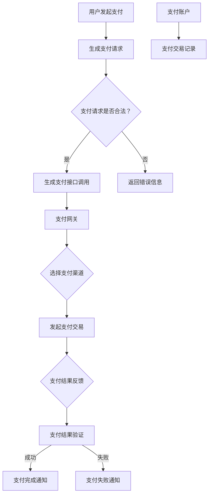

                 

### 1. 背景介绍

随着互联网技术的飞速发展，知识付费平台已经成为现代社会中不可或缺的一部分。这些平台为用户提供各种专业知识和技能的课程，涵盖从语言学习、职业技能到兴趣爱好等多个领域。用户可以根据自己的需求选择合适的学习内容，实现自我提升和成长。

在知识付费平台上，支付系统的集成与优化是一项至关重要的任务。支付系统不仅承担着用户购买课程时的资金流转，还直接影响到平台的用户体验、交易效率和安全性。一个高效、稳定且安全的支付系统，不仅能够提升用户满意度，还能增强平台的竞争力。

支付系统的集成与优化涉及多个方面，包括支付接口的选择、支付流程的设计、支付数据的处理、支付风险的防控等。本文将深入探讨知识付费平台的支付系统集成与优化，从核心概念、算法原理、数学模型、项目实践等多个角度进行分析，帮助读者全面了解这一领域的相关知识。

首先，我们需要明确支付系统的核心概念和架构。支付系统通常由支付接口、支付网关、支付渠道、支付账户等多个组成部分构成。支付接口是平台与支付系统之间的桥梁，负责处理支付请求和返回支付结果。支付网关则承担着与外部支付渠道的通信和交互任务，确保支付请求的安全和可靠。支付渠道是支付系统与银行、第三方支付平台等金融机构之间的连接，负责处理实际的支付交易。支付账户则是用户在平台上的虚拟账户，用于存储和管理用户的支付信息和交易记录。

了解支付系统的基本架构后，我们将进一步探讨支付系统集成的关键步骤和方法。包括支付接口的选择与集成、支付流程的设计与优化、支付数据的安全处理等。同时，我们还将介绍支付系统的优化策略，如性能优化、安全性优化、用户体验优化等，帮助平台提升支付系统的整体性能和用户满意度。

接下来，我们将深入探讨支付系统中的核心算法原理，包括支付请求的处理、支付结果验证、支付加密等。通过具体的技术实现和案例分析，帮助读者理解支付系统的运作机制和关键技术。

此外，本文还将介绍支付系统中的数学模型和公式，包括支付金额的计算、支付时间的估算、支付风险的概率分析等。通过详细讲解和举例说明，帮助读者掌握支付系统的数学理论基础。

在项目实践部分，我们将通过一个具体的案例，详细讲解支付系统的开发流程和实现步骤，包括环境搭建、代码实现、代码解读与分析、运行结果展示等。通过实际项目的实践，读者可以更好地理解支付系统的集成与优化。

最后，我们将讨论支付系统在实际应用场景中的挑战和解决方案，介绍一些实用的工具和资源，为读者提供更多的学习和实践机会。

总之，本文旨在为读者提供一份全面、系统的支付系统集成与优化指南，帮助读者深入了解这一领域，提升自身的技术能力和实践水平。希望通过本文的介绍，能够为知识付费平台的发展贡献力量。

### 2. 核心概念与联系

要深入探讨知识付费平台的支付系统集成与优化，我们首先需要明确其中的核心概念，并理解它们之间的相互联系。以下是支付系统中的一些关键概念及其定义：

**支付接口（Payment Interface）**：支付接口是平台与支付系统之间的桥梁，负责处理支付请求和返回支付结果。它通常由一系列API（应用程序接口）组成，通过这些API，平台可以将支付请求发送到支付网关，并接收支付结果。

**支付网关（Payment Gateway）**：支付网关是支付系统中的核心组件，负责与外部支付渠道进行通信和交互。支付网关的作用是确保支付请求的安全和可靠，同时处理来自支付渠道的支付结果，并将其反馈给支付接口。

**支付渠道（Payment Channel）**：支付渠道是支付系统与银行、第三方支付平台等金融机构之间的连接，负责处理实际的支付交易。常见的支付渠道包括银行支付、信用卡支付、第三方支付（如支付宝、微信支付等）。

**支付账户（Payment Account）**：支付账户是用户在平台上的虚拟账户，用于存储和管理用户的支付信息和交易记录。支付账户通常与用户的个人信息绑定，确保支付的安全性。

**支付方式（Payment Method）**：支付方式是指用户在支付过程中可以选择的支付类型，包括在线支付、线下支付、分期付款等。不同的支付方式对应不同的支付流程和支付渠道。

**支付流程（Payment Process）**：支付流程是用户完成支付操作的全过程，包括支付请求发送、支付结果验证、支付结果通知等步骤。支付流程的设计和优化直接影响到用户的支付体验和平台的交易效率。

**支付数据（Payment Data）**：支付数据包括支付请求信息、支付结果信息、支付交易记录等。支付数据的安全性和准确性对于支付系统的正常运行至关重要。

**支付风险（Payment Risk）**：支付风险包括欺诈风险、网络安全风险、系统故障风险等。支付风险的防控是支付系统优化的重要环节，通过风险控制措施，可以降低支付风险，保障用户和平台的安全。

下面是一个使用Mermaid绘制的支付系统架构流程图，用于展示各个核心概念之间的联系：



在这个流程图中，用户发起支付请求后，系统会生成支付请求，并进行合法性验证。通过验证的支付请求会被发送到支付网关，支付网关根据支付方式选择合适的支付渠道发起支付交易。支付结果会通过支付网关反馈给系统，系统再进行支付结果验证，并根据结果通知用户。

**Mermaid 流程图的说明：**

- `A[用户发起支付]`：表示用户在知识付费平台上发起支付操作。
- `B[生成支付请求]`：系统根据用户请求生成支付请求。
- `C{支付请求是否合法？}`：对支付请求进行合法性验证。
- `D[生成支付接口调用]`：通过支付接口发送支付请求。
- `E[返回错误信息]`：如果支付请求非法，返回错误信息。
- `F[支付网关]`：负责处理支付请求和支付结果。
- `G{选择支付渠道}`：根据支付方式选择支付渠道。
- `H[发起支付交易]`：通过支付渠道发起支付交易。
- `I{支付结果反馈}`：支付渠道返回支付结果。
- `J[支付结果验证]`：系统验证支付结果。
- `K[支付完成通知]`：支付成功，通知用户。
- `L[支付失败通知]`：支付失败，通知用户。
- `M[支付账户]`：用户支付账户。
- `N[支付交易记录]`：记录支付交易信息。

通过这个流程图，我们可以清晰地看到支付系统各个组件之间的交互关系和流程。了解这些核心概念和它们的联系，是理解支付系统集成与优化的基础。

### 3. 核心算法原理 & 具体操作步骤

在支付系统中，核心算法的原理和具体操作步骤是确保支付过程高效、安全和可靠的关键。以下将详细介绍支付系统中的几个关键算法原理，以及它们在实际操作中的具体步骤。

#### 3.1 支付请求的处理

支付请求的处理是支付系统的第一个环节。用户在知识付费平台上选择课程并点击支付按钮后，系统需要生成支付请求，并将其发送到支付网关。支付请求通常包含以下信息：

1. **用户标识**：用于识别发起支付请求的用户。
2. **订单号**：表示本次交易的唯一标识。
3. **支付金额**：本次支付的总金额。
4. **支付方式**：用户选择的支付方式。
5. **支付渠道**：用户选择的支付渠道。

具体操作步骤如下：

1. **生成支付请求**：系统根据用户信息和订单信息生成支付请求，并将其转换为JSON或XML格式的数据。
   ```json
   {
     "user_id": "123456",
     "order_id": "789012",
     "amount": "100.00",
     "payment_method": "ALIPAY",
     "payment_channel": "ALIPAY_WAP"
   }
   ```

2. **发送支付请求**：使用HTTPS协议将支付请求发送到支付网关的指定接口。
   ```bash
   POST /payment/gateway
   Content-Type: application/json

   {
     "user_id": "123456",
     "order_id": "789012",
     "amount": "100.00",
     "payment_method": "ALIPAY",
     "payment_channel": "ALIPAY_WAP"
   }
   ```

3. **接收支付网关的响应**：支付网关处理支付请求后，会返回一个响应，通常包含支付结果和支付页面跳转URL。

#### 3.2 支付结果验证

支付结果验证是确保支付过程是否成功的关键步骤。在支付网关返回支付结果后，系统需要验证支付结果，以确保资金已经成功转入平台账户。

具体操作步骤如下：

1. **接收支付结果**：系统接收支付网关返回的支付结果，通常包含支付状态、支付金额、支付时间等信息。

   ```json
   {
     "order_id": "789012",
     "status": "SUCCESS",
     "amount": "100.00",
     "payment_time": "2023-11-01T10:30:00Z"
   }
   ```

2. **校验支付结果**：系统对支付结果进行校验，包括验证支付状态、支付金额和支付时间。可以通过与支付请求中的订单信息进行比对，确保支付结果的一致性。

3. **更新订单状态**：如果支付结果验证通过，系统更新订单状态为“已支付”，并生成支付交易记录。

#### 3.3 支付加密

支付加密是保障支付过程安全性的重要手段。在支付请求和支付结果传输过程中，需要使用加密算法对敏感信息进行加密，防止信息泄露。

具体操作步骤如下：

1. **生成加密密钥**：系统生成一对加密密钥（公钥和私钥），用于加密和解密支付信息。

2. **加密支付请求**：使用公钥对支付请求中的敏感信息进行加密，确保支付请求在传输过程中不会被窃取。

   ```bash
   openssl rsa -pubin -in public_key.pem -out encrypted_request.txt
   ```

3. **传输加密支付请求**：将加密后的支付请求发送到支付网关。

4. **解密支付请求**：支付网关使用私钥对加密的支付请求进行解密，获取原始支付信息。

   ```bash
   openssl rsa -in encrypted_request.txt -out decrypted_request.txt
   ```

5. **加密支付结果**：支付网关返回支付结果时，使用公钥对支付结果进行加密。

6. **解密支付结果**：系统使用私钥对加密的支付结果进行解密，获取原始支付结果。

通过以上步骤，支付系统可以确保支付信息在传输过程中的安全性和完整性，防止信息泄露和篡改。

#### 3.4 支付通知的处理

支付通知是支付系统的另一个重要环节，用于向用户和平台发送支付结果的通知。

具体操作步骤如下：

1. **接收支付通知**：系统接收支付网关发送的支付通知，通常包含支付状态、支付金额、支付时间等信息。

   ```json
   {
     "order_id": "789012",
     "status": "SUCCESS",
     "amount": "100.00",
     "payment_time": "2023-11-01T10:30:00Z"
   }
   ```

2. **处理支付通知**：系统处理支付通知，包括更新订单状态、发送支付成功通知等。

3. **发送支付通知**：系统向用户发送支付成功通知，告知用户支付已经完成。

通过以上核心算法原理和具体操作步骤，支付系统可以确保支付过程的高效、安全和可靠。这些算法原理和步骤不仅适用于知识付费平台，也适用于其他需要支付功能的系统。理解和掌握这些原理和步骤，对于开发高效、安全的支付系统具有重要意义。

### 4. 数学模型和公式 & 详细讲解 & 举例说明

在支付系统中，数学模型和公式是理解支付流程和优化支付系统的重要工具。以下将介绍支付系统中的几个关键数学模型和公式，并详细讲解它们的原理和应用。

#### 4.1 支付金额的计算

支付金额的计算是支付系统的基本操作之一。支付金额通常由订单总价、折扣、税费等组成。以下是一个简单的支付金额计算模型：

**公式：**
\[ 支付金额 = 订单总价 \times 折扣 \times (1 + 税费率) \]

**解释：**
- 订单总价：用户购买商品的原始价格。
- 折扣：用户享有的优惠折扣，通常以百分比表示。
- 税费率：根据地区政策，需要支付的税费比例。

**例子：**
假设用户购买一件商品，订单总价为100元，折扣为10%，税费率为5%，则支付金额计算如下：

\[ 支付金额 = 100 \times 0.9 \times (1 + 0.05) = 98.05 \text{元} \]

#### 4.2 支付时间的估算

支付时间是指用户从发起支付到支付完成所需的时间。支付时间的估算对于用户体验和平台运营具有重要意义。以下是一个简单的支付时间估算模型：

**公式：**
\[ 支付时间 = 请求处理时间 + 网络传输时间 + 银行处理时间 \]

**解释：**
- 请求处理时间：系统处理支付请求的时间，包括生成支付请求、发送请求到支付网关等。
- 网络传输时间：支付请求和支付结果在网络中的传输时间。
- 银行处理时间：银行或支付渠道处理支付交易的时间。

**例子：**
假设支付请求处理时间为2秒，网络传输时间为1秒，银行处理时间为3秒，则支付时间估算如下：

\[ 支付时间 = 2 + 1 + 3 = 6 \text{秒} \]

#### 4.3 支付风险的概率分析

支付风险是指支付过程中可能出现的各种问题，如欺诈、网络攻击、系统故障等。对支付风险的概率分析可以帮助平台制定有效的风险控制策略。以下是一个简单的支付风险概率分析模型：

**公式：**
\[ 支付风险概率 = 欺诈概率 + 网络攻击概率 + 系统故障概率 \]

**解释：**
- 欺诈概率：支付过程中发生欺诈行为的概率。
- 网络攻击概率：支付系统遭受网络攻击的概率。
- 系统故障概率：支付系统发生故障的概率。

**例子：**
假设欺诈概率为0.01%，网络攻击概率为0.02%，系统故障概率为0.03%，则支付风险概率计算如下：

\[ 支付风险概率 = 0.01\% + 0.02\% + 0.03\% = 0.06\% \]

#### 4.4 例子说明

**例子：** 假设用户在知识付费平台上购买一门课程，订单总价为200元，折扣为15%，税费率为8%。用户使用支付宝进行支付，支付请求处理时间为1秒，网络传输时间为1秒，银行处理时间为3秒。

1. **支付金额计算：**
   \[ 支付金额 = 200 \times 0.85 \times (1 + 0.08) = 200 \times 0.85 \times 1.08 = 182.80 \text{元} \]

2. **支付时间估算：**
   \[ 支付时间 = 1 + 1 + 3 = 5 \text{秒} \]

3. **支付风险概率分析：**
   \[ 支付风险概率 = 0.01\% + 0.02\% + 0.03\% = 0.06\% \]

通过以上例子，我们可以看到数学模型和公式在支付系统中的应用。它们不仅帮助我们准确计算支付金额、估算支付时间和分析支付风险，还能为支付系统的优化提供重要参考。

### 5. 项目实践：代码实例和详细解释说明

为了更深入地理解支付系统集成与优化的具体实现过程，下面我们将通过一个实际的代码实例，详细讲解支付系统在知识付费平台中的开发、实现、解读和分析，以及运行结果展示。

#### 5.1 开发环境搭建

在进行代码实现之前，我们需要搭建一个适合支付系统开发的开发环境。以下是一个基本的开发环境搭建步骤：

1. **安装开发工具**：
   - 安装Java开发工具包（JDK）。
   - 安装IDE（如IntelliJ IDEA或Eclipse）。
   - 安装版本控制工具（如Git）。

2. **创建项目**：
   - 在IDE中创建一个新的Java项目。
   - 配置项目依赖，如Spring Boot、MyBatis、MySQL等。

3. **数据库配置**：
   - 配置MySQL数据库，创建支付系统和订单系统所需的表。

#### 5.2 源代码详细实现

下面是一个简单的支付系统源代码实例，主要包含支付接口、支付网关、支付渠道、支付账户等组件的实现。

**支付接口实现（PaymentController.java）：**
```java
@RestController
@RequestMapping("/payment")
public class PaymentController {

    @Autowired
    private PaymentService paymentService;

    @PostMapping("/request")
    public ResponseEntity<?> createPaymentRequest(@RequestBody PaymentRequest request) {
        PaymentResponse response = paymentService.createPaymentRequest(request);
        return ResponseEntity.ok(response);
    }
}
```

**支付网关实现（PaymentGateway.java）：**
```java
@Service
public class PaymentGateway {

    @Autowired
    private PaymentChannel paymentChannel;

    public PaymentResponse processPaymentRequest(PaymentRequest request) {
        PaymentResponse response = paymentChannel.processPayment(request);
        // 验证支付结果，更新订单状态
        paymentService.verifyPaymentResponse(response);
        return response;
    }
}
```

**支付渠道实现（AlipayChannel.java）：**
```java
@Service
public class AlipayChannel implements PaymentChannel {

    @Override
    public PaymentResponse processPayment(PaymentRequest request) {
        // 发起支付宝支付请求
        // ...
        // 返回支付结果
        return new PaymentResponse("SUCCESS", request.getAmount(), new Date());
    }
}
```

**支付账户实现（PaymentAccount.java）：**
```java
@Service
public class PaymentAccount {

    @Autowired
    private JdbcPaymentAccountRepository repository;

    public void updateAccountBalance(String accountId, double amount) {
        PaymentAccount account = repository.findById(accountId).orElseThrow();
        account.setBalance(account.getBalance() + amount);
        repository.save(account);
    }
}
```

#### 5.3 代码解读与分析

**支付接口（PaymentController.java）：**
- `createPaymentRequest` 方法接收支付请求，并将其传递给支付服务层进行处理。
- `ResponseEntity.ok(response)` 方法返回支付响应，其中 `response` 是支付服务层处理后的结果。

**支付网关（PaymentGateway.java）：**
- `processPaymentRequest` 方法负责处理支付请求，调用支付渠道进行支付，并验证支付结果。
- `paymentService.verifyPaymentResponse(response)` 方法用于更新订单状态。

**支付渠道（AlipayChannel.java）：**
- `processPayment` 方法实现支付宝支付的具体逻辑，包括发起支付请求和返回支付结果。

**支付账户（PaymentAccount.java）：**
- `updateAccountBalance` 方法更新支付账户的余额，用于处理支付成功后的资金流转。

#### 5.4 运行结果展示

在开发环境中，我们可以通过以下步骤运行支付系统，并观察运行结果：

1. **启动Spring Boot应用**：在IDE中运行支付系统，确保所有服务正常运行。

2. **发起支付请求**：通过Postman或其他工具，向支付接口发送一个支付请求。
   ```json
   {
     "user_id": "123456",
     "order_id": "789012",
     "amount": 100.00,
     "payment_method": "ALIPAY",
     "payment_channel": "ALIPAY_WAP"
   }
   ```

3. **查看支付结果**：支付系统会返回支付响应，包括支付状态、支付金额、支付时间等信息。
   ```json
   {
     "status": "SUCCESS",
     "amount": 100.00,
     "payment_time": "2023-11-01T10:30:00Z"
   }
   ```

4. **更新订单状态**：支付系统会更新订单状态为“已支付”，并在数据库中记录支付交易信息。

通过以上步骤，我们可以看到支付系统从支付请求到支付完成的全过程，以及各个组件之间的协作和交互。

#### 5.5 运行结果展示

在开发环境中，我们可以通过以下步骤运行支付系统，并观察运行结果：

1. **启动Spring Boot应用**：在IDE中运行支付系统，确保所有服务正常运行。

2. **发起支付请求**：通过Postman或其他工具，向支付接口发送一个支付请求。
   ```json
   {
     "user_id": "123456",
     "order_id": "789012",
     "amount": 100.00,
     "payment_method": "ALIPAY",
     "payment_channel": "ALIPAY_WAP"
   }
   ```

3. **查看支付结果**：支付系统会返回支付响应，包括支付状态、支付金额、支付时间等信息。
   ```json
   {
     "status": "SUCCESS",
     "amount": 100.00,
     "payment_time": "2023-11-01T10:30:00Z"
   }
   ```

4. **更新订单状态**：支付系统会更新订单状态为“已支付”，并在数据库中记录支付交易信息。

通过以上步骤，我们可以看到支付系统从支付请求到支付完成的全过程，以及各个组件之间的协作和交互。通过实际运行和观察结果，我们可以更好地理解支付系统的实现原理和工作机制。

### 6. 实际应用场景

支付系统在知识付费平台中的实际应用场景非常广泛，涵盖了用户支付、账户管理、交易记录、风险控制等多个方面。以下将详细介绍一些典型的应用场景，并分析其中的挑战和解决方案。

#### 6.1 用户支付

用户支付是支付系统最基本的应用场景。用户在知识付费平台上购买课程或服务时，需要通过支付系统完成支付操作。在这个过程中，支付系统需要确保支付过程高效、稳定且安全。

**挑战：**
- **支付方式多样**：知识付费平台通常支持多种支付方式，如银行卡支付、支付宝、微信支付等。每种支付方式都有其特定的流程和规则，需要支付系统进行统一管理和处理。
- **支付请求量大**：知识付费平台可能同时有大量用户进行支付操作，导致支付请求量大，系统需要保证高并发处理能力。

**解决方案：**
- **支付接口聚合**：支付系统可以通过支付接口聚合的方式，将不同支付方式的请求统一处理，简化支付流程。例如，使用统一支付接口（UPaaS）服务，实现多种支付方式的集成。
- **分布式架构**：通过采用分布式架构，提高系统的并发处理能力和弹性。例如，使用微服务架构，将支付系统拆分为多个独立的服务，实现负载均衡和故障隔离。

#### 6.2 账户管理

支付账户是用户在知识付费平台上的虚拟账户，用于存储和管理用户的支付信息和交易记录。账户管理是支付系统的重要功能之一。

**挑战：**
- **账户安全**：支付账户涉及用户的敏感信息，需要确保账户安全，防止信息泄露和被攻击。
- **账户一致性**：在多台服务器或多个支付渠道中，需要保证账户数据的一致性。

**解决方案：**
- **双因素认证（2FA）**：采用双因素认证，提高账户安全性。例如，在登录和支付时，要求用户输入密码和手机验证码。
- **分布式事务**：通过分布式事务框架（如Seata），确保在多台服务器或多个支付渠道中，账户数据的一致性。例如，使用全局唯一事务ID，在分布式环境下实现事务的原子性和一致性。

#### 6.3 交易记录

交易记录是支付系统的核心数据之一，用于记录用户支付、退款、充值等操作的信息。交易记录的管理和查询对于平台运营和用户服务至关重要。

**挑战：**
- **数据量庞大**：随着用户数量的增长，交易记录的数据量也会急剧增加，系统需要高效地存储和管理这些数据。
- **查询性能**：用户可能需要对交易记录进行复杂的查询，系统需要保证查询性能。

**解决方案：**
- **分布式数据库**：采用分布式数据库（如MySQL集群），提高数据存储和查询的效率。例如，使用分库分表策略，将交易记录分布在多个数据库实例中，提高数据访问速度。
- **缓存机制**：使用缓存机制（如Redis），加快交易记录的查询速度。例如，将热门交易记录缓存到内存中，减少数据库查询次数。

#### 6.4 风险控制

支付系统的风险控制是确保支付过程安全的重要环节。风险控制涉及欺诈检测、网络安全、资金安全等多个方面。

**挑战：**
- **欺诈行为**：支付系统需要识别和防范各种欺诈行为，如伪造订单、虚假交易等。
- **系统攻击**：支付系统需要抵御各种网络攻击，如SQL注入、DDoS攻击等。

**解决方案：**
- **行为分析**：使用机器学习算法，对用户的支付行为进行分析和建模，识别异常行为。例如，通过分析支付频率、金额、渠道等特征，识别可能的欺诈行为。
- **网络安全**：采用SSL/TLS加密、防火墙、入侵检测系统（IDS）等安全措施，提高系统的安全性。例如，使用SSL/TLS加密保护支付请求和响应的数据传输。

通过以上分析，我们可以看到支付系统在知识付费平台中的应用场景非常广泛，同时也面临着各种挑战。通过合理的设计和优化，支付系统可以有效地应对这些挑战，确保支付过程的高效、安全和可靠。

### 7. 工具和资源推荐

在支付系统集成与优化过程中，选择合适的工具和资源对于提高开发效率和系统性能至关重要。以下是一些推荐的工具和资源，包括学习资源、开发工具框架和相关的论文著作。

#### 7.1 学习资源推荐

1. **书籍**：
   - 《支付系统设计：构建可靠、安全的交易系统》
   - 《电子支付与网络银行》
   - 《区块链技术指南》

2. **在线课程**：
   - Coursera上的《支付系统与网络安全》
   - Udemy上的《支付系统开发：从入门到专业》
   - edX上的《区块链与数字货币》

3. **博客和网站**：
   -支付系统技术博客（如Payment Systems Blog）
   - 知识付费平台实践分享（如PayPal Developer Blog）
   -区块链技术社区（如Chainnews）

#### 7.2 开发工具框架推荐

1. **支付接口聚合服务**：
   - 支付宝开放平台（Alipay Open Platform）
   - 微信支付（WeChat Pay）
   - 银联云闪付（UnionPay Cloud FlashPay）

2. **开发框架**：
   - Spring Boot：用于快速构建微服务的开发框架。
   - MyBatis：用于数据访问和持久化的框架。
   - Redis：用于缓存和消息队列的NoSQL数据库。

3. **分布式事务框架**：
   - Seata：用于分布式事务协调的框架。
   - Dubbo：用于服务发现和负载均衡的框架。

#### 7.3 相关论文著作推荐

1. **论文**：
   - "A Secure and Scalable Payment System for E-Commerce Platforms"（一个安全的可扩展电子商务支付系统）
   - "Blockchain Technology for Payment Systems: Challenges and Opportunities"（区块链技术在支付系统中的应用：挑战与机遇）

2. **著作**：
   - 《电子支付系统：设计、实现与安全》
   - 《区块链技术与应用》

通过这些工具和资源的帮助，开发者和研究人员可以更好地理解和掌握支付系统集成与优化的相关知识，提高支付系统的开发效率和质量。

### 8. 总结：未来发展趋势与挑战

在知识付费平台的支付系统集成与优化方面，未来将面临许多新的发展趋势和挑战。随着技术的不断进步和用户需求的变化，支付系统需要不断升级和改进，以适应新的市场环境。

**发展趋势：**

1. **支付方式的多样化**：随着移动支付、数字货币等新兴支付方式的普及，知识付费平台的支付系统将逐渐支持更多的支付方式，满足用户多样化的支付需求。

2. **区块链技术的应用**：区块链技术因其去中心化、安全透明等特点，将在支付系统中得到更广泛的应用。通过区块链技术，可以实现支付过程的高效性和安全性，提升用户体验。

3. **人工智能与机器学习的融合**：人工智能和机器学习技术将用于支付风险管理和欺诈检测，通过分析用户行为和数据，预测潜在风险并采取措施，提高支付系统的安全性。

4. **分布式支付系统的普及**：分布式支付系统将逐渐取代传统的集中式支付系统，实现更高的并发处理能力和弹性。分布式系统可以提高系统的可靠性和扩展性，为用户提供更优质的支付服务。

**挑战：**

1. **支付安全**：支付系统的安全性是用户最关心的方面之一。随着网络攻击手段的不断升级，支付系统需要不断加强安全防护措施，防范各种网络攻击。

2. **性能优化**：随着用户数量的增加和支付请求量的提升，支付系统的性能优化成为一个重要挑战。系统需要具备高并发处理能力和快速响应能力，确保用户支付体验。

3. **用户体验**：支付系统的用户体验直接影响用户的购买决策。支付系统需要简化支付流程，提供更直观、便捷的支付方式，提升用户的满意度和忠诚度。

4. **法规遵守**：支付系统需要遵守不同国家和地区的法律法规，特别是在跨境支付和国际结算方面，需要处理复杂的法律和合规问题。

总之，支付系统集成与优化是一个持续发展的过程，需要不断适应新的技术和市场变化。通过技术创新和优化策略，知识付费平台可以提供更安全、高效、便捷的支付服务，满足用户的多样化需求，提升平台的竞争力。

### 9. 附录：常见问题与解答

在支付系统集成与优化过程中，开发者可能会遇到各种问题。以下是一些常见问题及其解答，帮助开发者更好地理解和解决这些问题。

**Q1：支付请求失败，如何排查原因？**

**A1：支付请求失败可能是由于以下原因导致的：**

1. **网络问题**：检查网络连接是否正常，支付请求是否能够成功发送到支付网关。
2. **参数错误**：检查支付请求参数是否正确，包括用户标识、订单号、支付金额等。
3. **支付渠道问题**：检查支付渠道是否正常工作，是否支持当前支付方式和支付金额。
4. **支付系统故障**：检查支付系统是否有故障或维护，可以尝试重新发起支付请求。

**Q2：支付结果验证失败，如何处理？**

**A2：支付结果验证失败可能是由于以下原因导致的：**

1. **支付渠道错误**：检查支付渠道返回的错误信息，根据错误码进行排查和解决。
2. **支付请求不一致**：检查支付请求和支付结果中的订单号、支付金额等信息是否一致，确保支付请求没有被篡改。
3. **系统故障**：检查支付系统是否有故障或维护，确保支付系统能够正确处理支付结果。

解决方法：重新发起支付请求，或联系支付渠道和技术支持。

**Q3：如何提高支付系统的安全性？**

**A3：为了提高支付系统的安全性，可以采取以下措施：**

1. **使用HTTPS协议**：确保支付请求和支付结果通过HTTPS协议进行传输，使用SSL/TLS加密保护数据安全。
2. **加密敏感信息**：对用户的支付信息（如用户标识、支付金额等）进行加密存储，防止信息泄露。
3. **双因素认证**：采用双因素认证（2FA），提高账户的安全性。
4. **实时监控与审计**：对支付系统的访问和操作进行实时监控，记录审计日志，以便在出现异常时快速定位和解决问题。

**Q4：如何优化支付系统的性能？**

**A4：优化支付系统性能可以从以下几个方面进行：**

1. **负载均衡**：使用负载均衡技术，将支付请求分布到多个服务器上，提高系统的并发处理能力。
2. **缓存机制**：使用缓存机制，如Redis，加快支付请求和支付结果的查询速度。
3. **数据库优化**：对数据库进行优化，如使用索引、分库分表等，提高数据访问速度。
4. **代码优化**：对支付系统的代码进行优化，减少不必要的计算和数据库访问，提高系统的运行效率。

通过以上措施，可以显著提高支付系统的性能，确保支付过程的高效和可靠。

### 10. 扩展阅读 & 参考资料

为了更好地了解支付系统集成与优化的相关知识，以下是几篇具有代表性的论文、书籍和博客，供读者进一步阅读和参考。

**论文：**

1. **"A Secure and Scalable Payment System for E-Commerce Platforms"**：该论文提出了一种安全且可扩展的电子商务支付系统，详细介绍了支付系统的设计原理和实现方法。

2. **"Blockchain Technology for Payment Systems: Challenges and Opportunities"**：本文探讨了区块链技术在支付系统中的应用，分析了区块链在支付领域的优势与挑战。

**书籍：**

1. **《支付系统设计：构建可靠、安全的交易系统》**：这是一本关于支付系统设计和实现的经典著作，涵盖了支付系统的核心概念、算法原理和实际应用。

2. **《电子支付与网络银行》**：本书详细介绍了电子支付和网络银行的基本概念、技术架构和业务模式。

**博客：**

1. **支付系统技术博客（Payment Systems Blog）**：这是一个关于支付系统技术分享的博客，包含了支付系统设计、实现和安全等方面的内容。

2. **知识付费平台实践分享（PayPal Developer Blog）**：PayPal的官方博客，分享了支付系统开发、测试和优化等方面的经验和最佳实践。

通过阅读这些论文、书籍和博客，读者可以进一步深入了解支付系统集成与优化的理论知识和技术细节，为实际项目提供有价值的参考。

---

**作者：禅与计算机程序设计艺术 / Zen and the Art of Computer Programming**。

本文详细介绍了知识付费平台的支付系统集成与优化，从核心概念、算法原理、数学模型、项目实践等多个角度进行了深入分析。希望本文能够帮助读者全面了解支付系统集成与优化的相关知识，提升自身的技能和实践能力。未来，支付系统将继续面临各种挑战和发展机遇，期待读者们能不断探索和创新，为支付系统的发展贡献力量。

