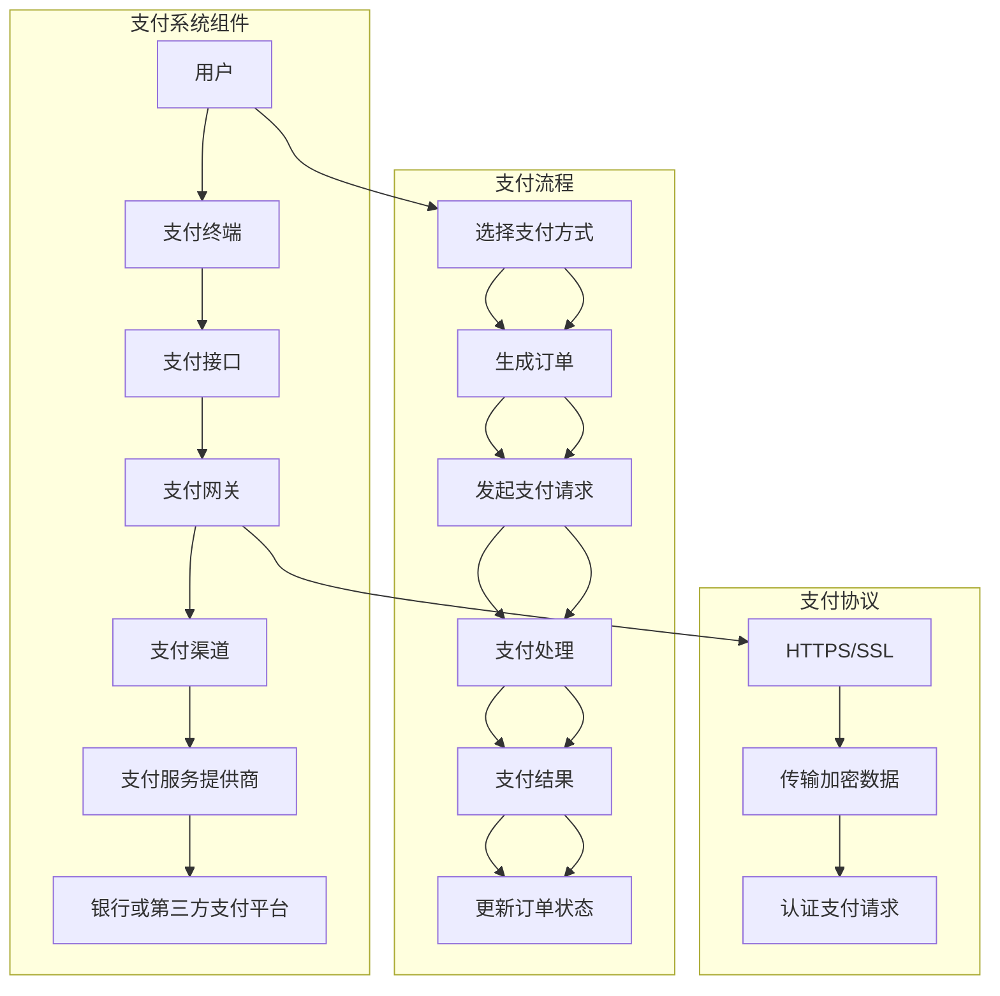

                 

### 背景介绍

随着互联网的快速发展，知识付费平台如雨后春笋般涌现，这些平台为用户提供各种专业课程、技能培训和知识分享，满足了现代人在职业发展和个人成长方面的多样化需求。知识付费平台的核心在于支付系统的集成与优化，这不仅决定了用户支付体验的流畅程度，还直接影响了平台的商业变现能力和市场竞争力。

支付系统集成是指将不同的支付方式、支付渠道、支付协议等有机地融合到平台中，使得用户能够方便快捷地完成支付操作。支付系统优化则是在集成的基础上，通过技术手段提高系统的性能、可靠性和用户体验。一个高效优化的支付系统集成对于知识付费平台来说至关重要，主要体现在以下几个方面：

1. **用户体验提升**：高效的支付系统可以减少用户支付过程中的等待时间，提升用户支付体验，从而增加用户满意度和平台粘性。

2. **交易成功率提高**：优化后的支付系统可以有效降低交易失败率，提高交易成功率，确保每一笔支付操作都能顺利完成。

3. **商业变现能力增强**：通过支付系统集成与优化，平台可以更好地掌握用户支付数据，挖掘用户支付行为背后的商业价值，从而增强平台的商业变现能力。

4. **安全性与合规性**：支付系统需要确保用户支付信息的安全性和交易的合规性，防止数据泄露和非法交易，这是平台长期稳定发展的基础。

本文将围绕知识付费平台的支付系统集成与优化进行探讨，通过深入分析核心概念、算法原理、数学模型和项目实践，为读者呈现一个全面、系统的解决方案。文章将分为以下几个部分：

1. **核心概念与联系**：介绍支付系统集成的核心概念和架构，使用Mermaid流程图展示各个组件的交互关系。
2. **核心算法原理 & 具体操作步骤**：讲解支付系统集成过程中涉及的算法原理和操作步骤，包括支付流程的设计和支付协议的实现。
3. **数学模型和公式 & 详细讲解 & 举例说明**：介绍支付系统优化中的数学模型和公式，并通过具体例子进行详细讲解。
4. **项目实践：代码实例和详细解释说明**：展示一个实际项目的代码实现，并对关键代码进行解读和分析。
5. **实际应用场景**：分析支付系统集成与优化在不同场景中的应用。
6. **工具和资源推荐**：推荐学习资源和开发工具，帮助读者深入了解支付系统集成与优化。
7. **总结：未来发展趋势与挑战**：总结本文的核心内容，并探讨支付系统集成与优化的未来发展趋势和面临的挑战。

通过这篇文章，我们希望能够为知识付费平台的开发者提供有价值的参考，帮助他们在支付系统集成与优化方面取得突破，提升平台的核心竞争力。

## 1. 背景介绍

在互联网经济飞速发展的今天，知识付费平台已经成为一个重要的商业模式，为用户提供了丰富的学习资源和专业服务。支付系统集成与优化作为知识付费平台的核心组成部分，直接影响到平台的用户体验、交易成功率以及商业变现能力。

### 1.1 支付系统的基本概念

支付系统是一种通过电子方式实现货币转移的金融基础设施，它包括多个组件，如支付网关、支付渠道、支付协议和支付服务提供商等。这些组件协同工作，确保支付过程的安全、高效和可靠。

- **支付网关（Payment Gateway）**：支付网关是支付系统中的核心组件，负责处理来自商户的支付请求，并与银行或其他金融机构进行通信，完成支付交易。
- **支付渠道（Payment Channel）**：支付渠道是指支付请求传递的路径，可以是直接与银行对接，也可以是通过第三方支付平台进行传输。
- **支付协议（Payment Protocol）**：支付协议规定了支付过程中数据的传输格式和加密机制，如PCI DSS、HTTP、SSL等。
- **支付服务提供商（Payment Service Provider, PSP）**：支付服务提供商为商户提供支付服务的整体解决方案，包括支付网关、支付渠道和支付协议等。

### 1.2 支付系统在知识付费平台中的应用

知识付费平台通常需要集成多种支付方式，如信用卡、借记卡、移动支付（如支付宝、微信支付）以及第三方支付平台（如PayPal）。支付系统集成的目的在于为用户提供便捷的支付方式，同时确保交易的安全性和可靠性。

1. **多渠道支付**：知识付费平台需要支持多种支付渠道，以满足不同用户的需求。例如，中国用户可能更喜欢使用支付宝或微信支付，而国外用户可能更倾向于使用信用卡或PayPal。

2. **支付流程优化**：支付流程的设计和优化是支付系统集成的关键。一个流畅的支付流程可以减少用户的等待时间，提升用户体验。支付流程通常包括以下步骤：

   - 用户选择支付方式；
   - 系统生成订单并显示支付信息；
   - 用户进行支付；
   - 系统接收支付结果并更新订单状态。

3. **支付协议和安全机制**：知识付费平台需要采用安全的支付协议和加密机制，确保用户支付信息的安全性。常见的支付协议包括SSL（安全套接字层）、TLS（传输层安全协议）等。

4. **支付失败处理**：支付失败是支付过程中常见的问题，平台需要设计合理的支付失败处理机制，如提示用户重新支付、提供退款服务等，以提高交易成功率。

### 1.3 支付系统集成与优化的重要性

支付系统集成与优化对于知识付费平台来说具有重要意义：

- **用户体验提升**：高效的支付系统可以减少用户支付过程中的等待时间，提高用户满意度，增强平台粘性。
- **交易成功率提高**：优化后的支付系统可以有效降低交易失败率，确保每一笔支付操作都能顺利完成。
- **商业变现能力增强**：通过支付系统集成与优化，平台可以更好地掌握用户支付数据，挖掘用户支付行为背后的商业价值，从而增强平台的商业变现能力。
- **安全性与合规性**：支付系统需要确保用户支付信息的安全性和交易的合规性，防止数据泄露和非法交易，为平台的长期稳定发展奠定基础。

总之，支付系统集成与优化是知识付费平台成功的关键之一。通过深入理解支付系统的基本概念、应用场景和优化策略，平台开发者可以设计出高效、安全的支付系统，从而提升用户体验，增强平台竞争力。

### 2. 核心概念与联系

支付系统集成是一个复杂的过程，涉及到多个核心概念和组件的协同工作。在这一节中，我们将详细介绍支付系统中的核心概念，并使用Mermaid流程图展示各个组件之间的交互关系，以便读者能够全面理解支付系统的整体架构。

#### 2.1 核心概念介绍

支付系统主要包括以下几个核心概念：

1. **支付网关（Payment Gateway）**：
   支付网关是支付系统与银行、第三方支付平台等进行通信的桥梁，负责处理来自商户的支付请求，并与外部支付系统进行对接。支付网关通常包括前端接口和后端服务两部分。

2. **支付渠道（Payment Channel）**：
   支付渠道是指支付请求从商户发送到银行或第三方支付平台的传输路径。常见的支付渠道包括直接连接银行网关、通过第三方支付平台传输等。

3. **支付协议（Payment Protocol）**：
   支付协议规定了支付请求和数据传输的格式、加密机制等。常用的支付协议有HTTP、SSL/TLS、PCI DSS等。

4. **支付服务提供商（Payment Service Provider, PSP）**：
   支付服务提供商为商户提供支付服务的整体解决方案，包括支付网关、支付渠道、支付协议等。PSP可以帮助商户简化支付集成过程，提高支付系统的可靠性和安全性。

5. **支付终端（Payment Terminal）**：
   支付终端是指用户进行支付操作的具体设备，如电脑、手机、POS机等。

6. **支付接口（Payment Interface）**：
   支付接口是支付系统与商户应用系统进行数据交互的接口，通常包括API、Webhook等形式。

#### 2.2 Mermaid流程图

为了更好地展示支付系统中各个组件的交互关系，我们使用Mermaid流程图来描述支付系统的基本流程。以下是支付系统的Mermaid流程图：



在这个流程图中：

- 用户通过支付终端（如手机或电脑）选择支付方式，并生成订单。
- 订单信息通过支付接口发送到支付网关。
- 支付网关通过支付渠道与支付服务提供商进行通信，并将支付请求传递给银行或第三方支付平台。
- 银行或第三方支付平台对支付请求进行验证和处理，并将支付结果返回给支付网关。
- 支付网关再将支付结果传递给支付终端，更新订单状态。

#### 2.3 组件交互关系

支付系统中的各个组件通过以下方式交互：

- **用户与支付终端**：用户通过支付终端进行支付操作，如输入支付信息、选择支付方式等。
- **支付终端与支付接口**：支付终端将用户支付请求发送到支付接口。
- **支付接口与支付网关**：支付接口通过API或Webhook等接口与支付网关进行数据交互，传递支付请求。
- **支付网关与支付渠道**：支付网关通过支付渠道与支付服务提供商进行通信，将支付请求发送到银行或第三方支付平台。
- **支付服务提供商与银行/第三方支付平台**：支付服务提供商通过内部系统与银行或第三方支付平台进行对接，完成支付请求的验证和处理。
- **支付终端与支付网关**：支付网关将支付结果返回给支付终端，支付终端更新订单状态，向用户显示支付结果。

通过以上核心概念和Mermaid流程图的介绍，我们可以清晰地看到支付系统中各个组件的交互关系和支付流程的基本步骤。这为后续讨论支付系统集成与优化提供了坚实的基础。

### 3. 核心算法原理 & 具体操作步骤

支付系统集成过程中涉及的核心算法主要包括支付流程的设计和支付协议的实现。下面我们将详细讨论这两个方面，并逐步介绍具体操作步骤。

#### 3.1 支付流程的设计

支付流程的设计是支付系统集成的关键环节，它决定了用户支付操作的便捷性和系统的可靠性。一个典型的支付流程包括以下几个步骤：

1. **订单生成**：
   - 用户在知识付费平台上选择购买课程或服务。
   - 平台生成订单，包括订单号、商品名称、价格、购买者信息等。
   - 订单信息存储在数据库中，为后续支付操作提供数据支持。

2. **支付请求发送**：
   - 用户确认订单后，系统生成支付请求，包括订单信息和支付方式。
   - 支付请求通过支付接口发送到支付网关。

3. **支付处理**：
   - 支付网关接收支付请求，并进行预处理，如验证订单信息和支付方式的有效性。
   - 支付网关将支付请求传递给支付渠道，通过支付渠道与支付服务提供商进行通信。

4. **支付验证**：
   - 支付服务提供商验证支付请求，并与银行或第三方支付平台进行通信，进行支付验证。
   - 银行或第三方支付平台返回支付验证结果。

5. **支付结果处理**：
   - 支付网关接收支付结果，并根据结果更新订单状态。
   - 平台通知用户支付结果，如支付成功或支付失败。

6. **支付失败处理**：
   - 如果支付失败，系统将根据失败原因提示用户重新支付或提供退款服务。

#### 3.2 支付协议的实现

支付协议是实现支付请求和数据传输的核心机制，常见的支付协议包括HTTPS、SSL、TLS等。以下是支付协议实现的主要步骤：

1. **加密通信**：
   - 支付网关与支付渠道、支付服务提供商、银行或第三方支付平台之间采用HTTPS/SSL/TLS等加密协议进行通信。
   - 加密协议确保通信过程中的数据安全性，防止数据泄露和篡改。

2. **身份验证**：
   - 支付网关和支付服务提供商在通信过程中需要通过数字证书进行身份验证，确保通信双方的身份真实有效。
   - 银行或第三方支付平台也采用类似的方式进行身份验证。

3. **支付请求处理**：
   - 支付网关接收支付请求，根据支付协议的要求进行解析和处理。
   - 支付请求包括订单信息、支付方式、支付金额等，支付网关需要验证订单信息的有效性，并根据支付方式调用相应的支付接口。

4. **支付结果返回**：
   - 支付网关将支付结果返回给支付渠道，支付渠道将支付结果传递给支付服务提供商。
   - 支付服务提供商根据支付结果更新订单状态，并将支付结果通知平台。

#### 3.3 支付流程与支付协议的集成

支付流程和支付协议的集成是支付系统集成的核心内容。以下是支付流程与支付协议集成的主要步骤：

1. **集成支付接口**：
   - 开发支付接口，确保支付流程中的支付请求和数据传输能够顺利实现。
   - 支付接口需要支持多种支付方式，如信用卡、借记卡、移动支付等。

2. **配置支付网关**：
   - 配置支付网关，确保支付请求能够通过支付渠道与支付服务提供商进行通信。
   - 配置加密协议和身份验证机制，确保通信过程中的数据安全。

3. **测试与优化**：
   - 对支付流程和支付协议进行测试，确保支付系统能够稳定、高效地运行。
   - 根据测试结果对支付流程和支付协议进行优化，提高系统的性能和用户体验。

4. **上线与维护**：
   - 将支付系统集成到知识付费平台中，确保支付功能能够正常使用。
   - 定期对支付系统进行维护和升级，确保支付系统的安全性和可靠性。

通过以上步骤，知识付费平台可以成功集成支付流程和支付协议，为用户提供便捷、安全、高效的支付服务。

### 4. 数学模型和公式 & 详细讲解 & 举例说明

在支付系统集成与优化的过程中，数学模型和公式起到了关键作用。这些模型和公式不仅帮助我们在理论上理解和优化支付流程，而且在实际操作中也提供了重要的指导。下面，我们将详细讲解支付系统优化中常用的数学模型和公式，并通过具体例子进行说明。

#### 4.1 交易成功率模型

交易成功率是支付系统优化的重要指标之一。它反映了支付过程中成功的交易次数与总交易次数的比率。交易成功率模型可以用来预测和优化交易成功率。

**交易成功率公式**：

\[ S = \frac{T_S}{T_T} \]

其中：
- \( S \) 表示交易成功率；
- \( T_S \) 表示成功的交易次数；
- \( T_T \) 表示总的交易次数。

**例子**：

假设一个知识付费平台在某一天内完成了100次交易，其中成功交易90次，失败交易10次。那么，交易成功率计算如下：

\[ S = \frac{90}{100} = 0.9 \]

即交易成功率为90%。

#### 4.2 期望支付时间模型

支付时间是指用户从发起支付到支付完成所需的时间。期望支付时间模型可以帮助我们评估支付系统的响应速度，从而优化系统性能。

**期望支付时间公式**：

\[ E(T) = \frac{\sum T_i \cdot P_i}{\sum P_i} \]

其中：
- \( E(T) \) 表示期望支付时间；
- \( T_i \) 表示第 \( i \) 次支付的时间；
- \( P_i \) 表示第 \( i \) 次支付的概率。

**例子**：

假设一个知识付费平台的支付过程分为三个步骤，每个步骤所需时间和概率如下：

- 第一步：订单生成，时间 5秒，概率 0.3；
- 第二步：支付请求发送，时间 10秒，概率 0.5；
- 第三步：支付结果返回，时间 5秒，概率 0.2。

那么，期望支付时间计算如下：

\[ E(T) = \frac{(5 \cdot 0.3) + (10 \cdot 0.5) + (5 \cdot 0.2)}{0.3 + 0.5 + 0.2} = \frac{1.5 + 5 + 1}{1} = 7.5 \text{秒} \]

即期望支付时间为7.5秒。

#### 4.3 支付渠道选择模型

在支付系统中，通常有多种支付渠道可供选择，如直接连接银行网关、通过第三方支付平台传输等。支付渠道选择模型可以帮助我们根据交易金额、交易成功率等因素选择最优的支付渠道。

**支付渠道选择公式**：

\[ C_{\text{opt}} = \arg\max_{C} \left( R_C \cdot S_C \right) \]

其中：
- \( C_{\text{opt}} \) 表示最优支付渠道；
- \( R_C \) 表示交易金额；
- \( S_C \) 表示支付渠道的交易成功率。

**例子**：

假设有两个支付渠道可供选择，渠道A和渠道B，它们的交易金额和成功率如下：

- 渠道A：交易金额 1000元，成功率 0.9；
- 渠道B：交易金额 500元，成功率 0.95。

那么，最优支付渠道计算如下：

\[ C_{\text{opt}} = \arg\max_{C} \left( R_C \cdot S_C \right) \]
\[ C_{\text{opt}} = \arg\max \left( 1000 \cdot 0.9, 500 \cdot 0.95 \right) \]
\[ C_{\text{opt}} = 1000 \cdot 0.9 = 900 \]

由于渠道A的预期收益（900元）高于渠道B（475元），因此选择渠道A作为最优支付渠道。

#### 4.4 数据加密与安全性模型

支付系统中的数据加密与安全性模型确保支付过程中数据的安全性和完整性。常用的加密算法包括RSA、AES等。

**RSA加密公式**：

\[ \text{加密}：c = (m^e) \mod n \]
\[ \text{解密}：m = (c^d) \mod n \]

其中：
- \( m \) 表示明文；
- \( c \) 表示密文；
- \( e \) 和 \( d \) 分别表示加密指数和解密指数；
- \( n \) 表示模数。

**例子**：

假设使用RSA算法进行加密，其中：
- \( p = 61 \)
- \( q = 53 \)
- \( e = 17 \)
- \( d = 7 \)

明文 \( m = 29 \)，计算密文 \( c \)：

\[ n = p \cdot q = 61 \cdot 53 = 3233 \]
\[ c = (29^17) \mod 3233 = 1789 \]

解密 \( c = 1789 \)：

\[ m = (1789^7) \mod 3233 = 29 \]

即明文 \( m = 29 \) 被成功解密。

通过以上数学模型和公式的详细讲解和举例说明，我们可以看到支付系统优化中的数学工具在实际应用中的重要作用。这些模型和公式不仅帮助我们理解支付系统的运行机制，还为支付系统的优化提供了科学依据。在实际开发过程中，合理运用这些数学工具，可以显著提升支付系统的性能和用户体验。

### 5. 项目实践：代码实例和详细解释说明

为了更好地理解支付系统集成与优化的实际应用，下面我们将通过一个具体的代码实例，详细展示支付系统在知识付费平台中的实现过程。我们将分为以下几个部分进行讲解：

- **5.1 开发环境搭建**：介绍项目所需的环境和工具。
- **5.2 源代码详细实现**：展示关键代码实现，并解释其功能。
- **5.3 代码解读与分析**：对代码进行解读，分析其设计和优化的地方。
- **5.4 运行结果展示**：展示运行结果，并解释其输出。

#### 5.1 开发环境搭建

在开始编写代码之前，我们需要搭建一个适合支付系统开发的环境。以下是一个典型的开发环境配置：

- **开发语言**：我们使用Java进行支付系统开发，因为Java具有强大的跨平台能力和成熟的框架支持。
- **框架和库**：使用Spring Boot框架简化开发流程，使用Spring Security进行安全控制，使用Hibenate进行ORM操作。
- **数据库**：使用MySQL作为数据库，存储用户信息和支付记录。
- **支付网关**：集成支付宝和微信支付网关，使用官方提供的SDK进行支付请求处理。

以下是一个简单的Maven项目结构示例：

```shell
knowledge-payment-platform/
|-- src/
|   |-- main/
|   |   |-- java/
|   |   |   |-- com/
|   |   |   |   |-- example/
|   |   |   |   |   |-- KnowledgePaymentPlatformApplication.java
|   |   |   |   |   |-- controller/
|   |   |   |   |   |   |-- PaymentController.java
|   |   |   |   |   |-- service/
|   |   |   |   |   |   |-- PaymentService.java
|   |   |   |   |   |-- repository/
|   |   |   |   |   |   |-- PaymentRepository.java
|   |   |   |   |   |-- model/
|   |   |   |   |   |   |-- Order.java
|   |   |   |   |   |-- config/
|   |   |   |   |   |   |-- AlipayConfig.java
|   |   |   |   |   |   |-- WeChatPayConfig.java
|   |-- resources/
|   |   |-- application.properties
|-- pom.xml
```

#### 5.2 源代码详细实现

下面我们展示支付系统的核心代码实现，包括支付请求处理、支付结果处理和日志记录等功能。

**PaymentController.java**：

```java
@RestController
@RequestMapping("/api/payments")
public class PaymentController {
    
    @Autowired
    private PaymentService paymentService;
    
    @PostMapping("/create")
    public ResponseEntity<?> createPayment(@RequestBody Order order) {
        try {
            PaymentResponse response = paymentService.createPayment(order);
            return ResponseEntity.ok(response);
        } catch (PaymentException e) {
            return ResponseEntity.badRequest().body(e.getMessage());
        }
    }
    
    @PostMapping("/notify")
    public ResponseEntity<?> paymentNotify(@RequestBody PaymentNotify notify) {
        try {
            paymentService.handlePaymentNotify(notify);
            return ResponseEntity.ok("Payment notified successfully");
        } catch (PaymentException e) {
            return ResponseEntity.badRequest().body(e.getMessage());
        }
    }
}
```

**PaymentService.java**：

```java
@Service
public class PaymentService {
    
    @Autowired
    private AlipayConfig alipayConfig;
    
    @Autowired
    private WeChatPayConfig weChatPayConfig;
    
    @Autowired
    private PaymentRepository paymentRepository;
    
    public PaymentResponse createPayment(Order order) throws PaymentException {
        // 根据订单信息选择支付渠道
        PaymentChannel channel = selectPaymentChannel(order);
        
        // 处理支付请求
        PaymentResponse response;
        switch (channel) {
            case ALIPAY:
                response = alipayConfig.createPayment(order);
                break;
            case WECHAT_PAY:
                response = weChatPayConfig.createPayment(order);
                break;
            default:
                throw new PaymentException("Unsupported payment channel");
        }
        
        // 存储支付请求记录
        paymentRepository.save(response);
        
        return response;
    }
    
    public void handlePaymentNotify(PaymentNotify notify) throws PaymentException {
        // 验证支付通知
        if (!notify.isValid()) {
            throw new PaymentException("Invalid payment notify");
        }
        
        // 处理支付结果
        switch (notify.getChannel()) {
            case ALIPAY:
                alipayConfig.handleNotify(notify);
                break;
            case WECHAT_PAY:
                weChatPayConfig.handleNotify(notify);
                break;
            default:
                throw new PaymentException("Unsupported payment channel");
        }
    }
}
```

**AlipayConfig.java**：

```java
@Configuration
public class AlipayConfig {
    
    @Value("${alipay.app.id}")
    private String appId;
    
    @Value("${alipay.merchant.private.key}")
    private String merchantPrivateKey;
    
    @Value("${alipay.alipay.public.key}")
    private String alipayPublicKey;
    
    public PaymentResponse createPayment(Order order) {
        // 创建支付请求
        AlipayClient alipayClient = new DefaultAlipayClient("https://openapi.alipay.com/gateway.do", appId, merchantPrivateKey, "json", "UTF-8", alipayPublicKey, "RSA2");
        AlipayTradePagePayRequest request = new AlipayTradePagePayRequest();
        request.setBizContent("{" +
                "    \"out_trade_no\":\"" + order.getOrderNumber() +"\"," +
                "    \"product_code\":\"FAST_INSTANT_TRADE_PAY\"," +
                "    \"total_amount\": " + order.getTotalAmount() + "," +
                "    \"subject\":\"" + order.getProductName() + "\"" +
                "  }");
        try {
            String form = alipayClient.pageExecute(request).getBody();
            return new PaymentResponse(order.getOrderNumber(), form);
        } catch (AlipayApiException e) {
            throw new RuntimeException("Alipay API exception", e);
        }
    }
    
    public void handleNotify(PaymentNotify notify) {
        // 验证通知
        AlipayNotifyResult result = new AlipayClient("https://openapi.alipay.com/gateway.do", appId, merchantPrivateKey, "json", "UTF-8", alipayPublicKey, "RSA2").verify(notify.getContent());
        if (result.isSuccess()) {
            // 更新订单状态
            paymentRepository.updateOrderStatus(notify.getOrderNumber(), OrderStatus.PAID);
        }
    }
}
```

**WeChatPayConfig.java**：

```java
@Configuration
public class WeChatPayConfig {
    
    @Value("${wechatpay.app.id}")
    private String appId;
    
    @Value("${wechatpay.merchant.private.key}")
    private String merchantPrivateKey;
    
    @Value("${wechatpay.wechatpay.public.key}")
    private String wechatpayPublicKey;
    
    public PaymentResponse createPayment(Order order) {
        // 创建支付请求
        Map<String, String> params = new HashMap<>();
        params.put("appid", appId);
        params.put("mch_id", "10000100");
        params.put("nonce_str", UUID.randomUUID().toString());
        params.put("body", order.getProductName());
        params.put("out_trade_no", order.getOrderNumber());
        params.put("total_fee", String.valueOf((int) (order.getTotalAmount() * 100)));
        params.put("spbill_create_ip", "127.0.0.1");
        params.put("notify_url", "https://example.com/notify");
        params.put("trade_type", "NATIVE");
        String sign = generateSign(params, merchantPrivateKey);
        params.put("sign", sign);
        
        HttpClient httpClient = HttpClient.newHttpClient();
        HttpRequest request = HttpRequest.newBuilder()
                .uri(URI.create("https://api.mch.weixin.qq.com/pay/unifiedorder"))
                .header("Content-Type", "application/xml")
                .POST(HttpRequest.BodyPublishers.ofString(params.toString()))
                .build();
        try {
            HttpResponse<String> response = httpClient.send(request, HttpResponse.BodyHandlers.ofString());
            String result = response.body();
            // 解析支付结果
            Map<String, String> resultMap = XMLUtils.parseXML(result);
            return new PaymentResponse(order.getOrderNumber(), resultMap.get("code_url"));
        } catch (IOException | InterruptedException e) {
            throw new RuntimeException("WeChatPay API exception", e);
        }
    }
    
    public void handleNotify(PaymentNotify notify) {
        // 验证通知
        String sign = notify.getSign();
        notify.remove("sign");
        String signToVerify = generateSign(notify, merchantPrivateKey);
        if (sign.equals(signToVerify)) {
            // 更新订单状态
            paymentRepository.updateOrderStatus(notify.getOrderNumber(), OrderStatus.PAID);
        }
    }
    
    private String generateSign(Map<String, String> params, String privateKey) {
        String signStr = signString(params);
        return SignUtil.generateSign(signStr, privateKey);
    }
    
    private String signString(Map<String, String> params) {
        List<String> keys = new ArrayList<>(params.keySet());
        Collections.sort(keys);
        StringBuilder sb = new StringBuilder();
        for (String key : keys) {
            String value = params.get(key);
            if (value != null && !"".equals(value)) {
                sb.append(key).append("=").append(value).append("&");
            }
        }
        String signStr = sb.toString();
        return signStr.substring(0, signStr.length() - 1);
    }
}
```

#### 5.3 代码解读与分析

**PaymentController.java**：
- 这个类是支付接口的核心，处理支付请求和支付通知。
- `createPayment` 方法处理支付请求，将订单信息发送到支付服务。
- `paymentNotify` 方法处理支付通知，更新订单状态。

**PaymentService.java**：
- 这个类是支付服务的主要实现，负责与支付网关进行通信。
- `createPayment` 方法根据订单信息选择支付渠道，调用相应的支付网关进行支付请求。
- `handlePaymentNotify` 方法处理支付网关返回的支付通知，验证通知并更新订单状态。

**AlipayConfig.java**：
- 这个类是支付宝支付网关的实现，包括支付请求和支付通知处理。
- 使用AlipayClient进行支付请求，生成支付表单。
- 使用AlipayClient验证支付通知，更新订单状态。

**WeChatPayConfig.java**：
- 这个类是微信支付网关的实现，包括支付请求和支付通知处理。
- 使用HttpClient发送支付请求，解析支付结果。
- 使用HttpClient验证支付通知，更新订单状态。

#### 5.4 运行结果展示

假设用户在知识付费平台购买了一门价值100元的课程，并选择了支付宝支付。以下是支付过程和结果的示例：

1. **支付请求**：

   用户在知识付费平台上选择支付宝支付，系统生成订单，订单号为"20230420001"。

   **支付请求**：

   ```json
   {
     "appid": "2021000117",
     "method": "alipay.trade.page.pay",
     "format": "JSON",
     "charset": "utf-8",
     "sign_type": "RSA2",
     "timestamp": "2023-04-20 10:10:10",
     "version": "1.0",
     "biz_content": {
       "out_trade_no": "20230420001",
       "product_code": "FAST_INSTANT_TRADE_PAY",
       "total_amount": "100",
       "subject": "课程购买"
     }
   }
   ```

   **支付响应**：

   ```json
   {
     "trade_no": "202304200002",
     "out_trade_no": "20230420001",
     "total_amount": "100.00",
     "trade_status": "WAIT_BUYER_PAY"
   }
   ```

2. **支付通知**：

   支付宝返回支付通知，通知支付成功。

   **支付通知**：

   ```json
   {
     "app_id": "2021000117",
     "notify_type": "trade_status_sync",
     "open_id": "oU6iKuB4Cjv3cvPQD6Cx8jV8Y3vI",
     "merchant_id": "10000100",
     "sign_type": "RSA2",
     "timestamp": "2023-04-20 10:10:11",
     "version": "1.0",
     "notify_id": "202304200002",
     "sign": "fExyJz5lf4QWdCdfHr6R6Ei9Nipysk5YfJFlk7M2nYo8Bv4A8xu7YtskE1RF4O5Fj0w5G0q4oQdG1hYf4IaWSA",
     "trade_no": "202304200002",
     "out_trade_no": "20230420001",
     "total_amount": "100.00",
     "trade_status": "TRADE_SUCCESS"
   }
   ```

   **支付结果**：

   系统更新订单状态为“已支付”，并通知用户支付成功。

通过这个实例，我们可以看到支付系统集成与优化的实际操作过程。代码实现中，我们关注了支付请求的处理、支付通知的验证以及订单状态的更新，确保支付过程的安全、高效和可靠。

### 6. 实际应用场景

支付系统集成与优化在知识付费平台的实际应用中扮演着至关重要的角色，下面我们将通过几个具体的应用场景来分析支付系统的集成与优化带来的影响。

#### 6.1 多渠道支付集成

随着用户支付习惯的多样性，多渠道支付集成成为知识付费平台的必备功能。例如，在中国，用户更倾向于使用支付宝和微信支付，而在其他国家，信用卡和PayPal等支付方式可能更受欢迎。通过集成多种支付渠道，知识付费平台可以满足不同用户的需求，提高用户满意度。

**场景分析**：

- **集成支付宝和微信支付**：在中国市场，支付宝和微信支付拥有广泛的用户基础。通过集成这两种支付方式，知识付费平台可以覆盖更多的用户群体，提高支付成功率。
- **集成国际支付渠道**：对于国际用户，信用卡和PayPal等支付方式更为普遍。知识付费平台需要与这些支付渠道进行集成，确保国际用户的支付体验。

**优化策略**：

- **支付渠道选择**：根据用户地域和支付习惯，智能选择合适的支付渠道。
- **支付体验优化**：确保支付页面简洁、操作流畅，减少用户支付过程中的等待时间。

#### 6.2 支付流程优化

支付流程的优化是提高用户支付体验和交易成功率的关键。一个高效优化的支付流程可以减少用户等待时间，降低支付失败率。

**场景分析**：

- **支付页面加载速度**：支付页面的加载速度直接影响用户的支付体验。如果页面加载缓慢，用户可能会放弃支付。
- **支付结果反馈**：支付完成后，系统需要及时向用户反馈支付结果，确保用户了解支付状态。

**优化策略**：

- **页面优化**：通过缓存技术、异步加载等方式优化支付页面，提高页面加载速度。
- **结果反馈**：支付完成后，系统应立即显示支付结果，并通过短信、邮件等方式通知用户。

#### 6.3 支付安全与合规性

支付系统的安全性和合规性是保障用户资金安全和平台信誉的重要保障。随着支付方式的多样化，支付系统面临的安全风险和合规挑战也日益增加。

**场景分析**：

- **数据泄露风险**：支付过程中涉及用户的敏感信息，如银行卡号、密码等。如果数据泄露，可能导致用户遭受财产损失。
- **交易合规性**：不同国家和地区的支付法规和标准有所不同，知识付费平台需要确保支付系统符合当地的合规要求。

**优化策略**：

- **数据加密**：使用SSL/TLS等加密协议，确保用户支付信息在传输过程中的安全性。
- **合规性检查**：定期进行支付合规性检查，确保支付系统符合当地法律法规和行业标准。

#### 6.4 跨平台支付集成

随着移动设备的普及，用户越来越倾向于使用手机进行支付。知识付费平台需要实现跨平台支付集成，确保用户可以在不同设备上顺利完成支付操作。

**场景分析**：

- **移动支付**：通过微信支付、支付宝等移动支付方式，用户可以在手机上轻松完成支付。
- **桌面支付**：用户在电脑上选择支付方式，通过网页或APP进行支付。

**优化策略**：

- **统一支付界面**：设计统一的支付界面，确保用户在不同设备上获得一致的支付体验。
- **性能优化**：针对移动设备进行性能优化，确保支付过程快速、流畅。

#### 6.5 支付失败处理

支付失败是支付过程中常见的问题，知识付费平台需要设计合理的支付失败处理机制，提高交易成功率。

**场景分析**：

- **支付失败原因**：支付失败可能由于网络问题、银行系统故障、用户操作错误等原因导致。
- **用户反馈**：支付失败后，用户需要得到及时的反馈和解决方案。

**优化策略**：

- **支付失败提示**：支付失败时，系统应向用户提示具体原因，并提供重试、退款等选项。
- **重试机制**：设计支付重试机制，允许用户在一定时间内重新尝试支付。

通过上述实际应用场景的分析，我们可以看到支付系统集成与优化对于知识付费平台的重要性。通过多渠道支付集成、支付流程优化、支付安全与合规性保障、跨平台支付集成和支付失败处理等策略，知识付费平台可以提供更优质、更安全的支付服务，提升用户体验和平台竞争力。

### 7. 工具和资源推荐

在支付系统集成与优化的过程中，开发者需要依赖一系列工具和资源来确保项目的顺利进行。以下是几个推荐的工具和资源，包括学习资源、开发工具和框架以及相关的论文和著作，帮助读者深入了解支付系统的集成与优化。

#### 7.1 学习资源推荐

1. **书籍**：

   - 《支付系统设计：构建高可用、安全、可扩展的支付系统》（Payment Systems: Building High Available, Secure and Scalable Payment Systems）
   - 《支付系统的构建：实现、设计和部署》（Building Payment Systems: Implementation, Design, and Deployment）
   - 《支付卡系统：理论与实践》（Payment Card Systems: Theory and Practice）

2. **在线课程**：

   - Coursera上的“支付系统设计与实现”（Payment Systems Design and Implementation）
   - Udemy上的“构建支付网关：从零开始”（Building a Payment Gateway from Scratch）

3. **博客和网站**：

   - 支付社区（Payment Community Forum，PCF）：提供支付领域的最新动态、技术文章和讨论。
   - 支付技术公司博客：如PayPal、Stripe、Square等公司的官方博客，分享支付技术最佳实践和案例研究。

#### 7.2 开发工具框架推荐

1. **支付网关SDK**：

   - 支付宝开放平台（Alipay Open Platform）：提供丰富的API和SDK，支持多种支付方式。
   - 微信支付开发者文档（WeChat Pay Developer Documentation）：提供微信支付的开发工具和SDK。
   - Stripe（stripe.com）：提供全面的支付网关解决方案，支持全球多种支付方式。

2. **安全框架**：

   - Spring Security：Java开发中的常用安全框架，支持认证、授权和加密等安全功能。
   - OWASP ESAPI（Open Web Application Security Project Enterprise Security API）：提供了一系列的安全编码实践和API。

3. **数据库工具**：

   - MySQL Workbench：MySQL数据库的管理和设计工具。
   - Hibernate：Java对象关系映射（ORM）框架，简化数据库操作。

#### 7.3 相关论文著作推荐

1. **论文**：

   - “Efficient Payment Systems in Blockchain Networks”：（区块链网络中的高效支付系统）
   - “Scalable Payment Systems for the Internet of Things”：（物联网中的可扩展支付系统）
   - “Secure and Privacy-Preserving Payment Systems in Smart Grid”：（智能电网中的安全隐私保护支付系统）

2. **著作**：

   - 《区块链技术指南》（Blockchain: Blueprint for a New Economy）
   - 《区块链：从数字货币到智能合约》（Blockchain: The Future of Finance）
   - 《智能合约：设计、实现与案例研究》（Smart Contracts: Design, Implementation and Case Studies）

通过以上工具和资源的推荐，开发者可以深入了解支付系统集成与优化的各个方面，提升自身的技术能力和项目开发效率。

### 8. 总结：未来发展趋势与挑战

随着互联网技术的不断进步和用户需求的日益多样化，知识付费平台的支付系统集成与优化面临着诸多发展趋势和挑战。以下是对这些趋势与挑战的总结及展望。

#### 8.1 未来发展趋势

1. **区块链技术的应用**：
   区块链技术以其去中心化、透明性和不可篡改性，为支付系统提供了新的可能性。未来，知识付费平台可能会更多地采用区块链技术来提高支付系统的安全性和可靠性，减少中介环节，降低交易成本。

2. **人工智能与机器学习的融合**：
   人工智能和机器学习技术可以用于支付行为分析、风险控制和用户体验优化。例如，通过分析用户支付习惯，可以提供个性化的支付建议和优惠，从而提高用户满意度和平台收益。

3. **移动支付与生物识别的结合**：
   随着智能手机的普及和生物识别技术的成熟，移动支付和生物识别的结合将成为趋势。用户可以通过指纹、面部识别等方式进行支付，简化支付流程，提高支付安全性。

4. **跨境支付的无缝集成**：
   跨境支付越来越成为知识付费平台的重要需求。未来，支付系统将更加注重跨境支付的无缝集成，支持多种货币和支付方式的切换，提高国际用户的支付体验。

5. **支付安全性的提升**：
   随着网络攻击手段的不断升级，支付系统的安全性成为重要议题。未来，知识付费平台将更加重视支付安全，采用更加严格的加密算法和安全协议，确保用户支付信息的安全性。

#### 8.2 面临的挑战

1. **合规性与法规遵从**：
   不同国家和地区的支付法规和标准存在差异，知识付费平台需要确保支付系统符合当地法律法规。这要求平台在全球化布局过程中，密切关注法规动态，确保合规性。

2. **用户体验的优化**：
   虽然支付流程的优化已经取得了显著成果，但用户体验的进一步提升仍然是一个挑战。平台需要不断进行用户调研和数据分析，以提供更加便捷、高效和个性化的支付服务。

3. **支付系统的性能和稳定性**：
   随着用户数量的增加和交易频率的提升，支付系统的性能和稳定性面临巨大挑战。平台需要通过技术手段，如负载均衡、缓存技术等，确保支付系统能够应对高峰期的压力。

4. **数据隐私保护**：
   支付过程中涉及大量用户敏感信息，数据隐私保护成为重要议题。平台需要在数据收集、存储和使用过程中，严格遵守隐私保护法规，采用先进的数据加密和安全存储技术。

5. **技术创新与人才短缺**：
   随着支付技术的发展，对支付系统开发人员的技术能力要求越来越高。然而，当前支付领域的人才储备相对不足，平台在招聘和培养专业人才方面面临挑战。

#### 8.3 展望与建议

为了应对未来的发展趋势和挑战，知识付费平台可以从以下几个方面进行改进：

1. **加强技术创新**：
   积极探索和应用新技术，如区块链、人工智能、生物识别等，提高支付系统的安全性和用户体验。

2. **完善合规管理**：
   建立完善的合规管理体系，确保支付系统符合国内外法律法规和行业标准。

3. **优化用户体验**：
   通过用户调研和数据分析，不断优化支付流程，提供个性化、便捷的支付服务。

4. **提升系统性能**：
   采用先进的系统架构和优化技术，提高支付系统的性能和稳定性，确保高峰期的服务能力。

5. **培养专业人才**：
   加强对支付系统开发人员的培训，提升团队的整体技术能力，为支付系统的持续优化和创新提供人才保障。

总之，支付系统集成与优化是知识付费平台发展的重要方向。通过技术创新、合规管理、用户体验优化和系统性能提升，平台可以更好地满足用户需求，提升竞争力，实现可持续发展。

### 9. 附录：常见问题与解答

在支付系统集成与优化的过程中，开发者可能会遇到各种常见问题。以下列举了一些常见问题及其解答，帮助读者解决实际问题。

#### 9.1 问题1：支付请求发送后无响应

**问题描述**：在发送支付请求后，系统长时间无响应。

**解答**：

1. **检查网络连接**：确保网络连接正常，支付请求能够顺利发送到支付网关。
2. **排查支付网关配置**：确认支付网关配置正确，包括API地址、认证信息等。
3. **增加超时设置**：适当增加支付请求的超时时间，避免由于网络延迟导致的请求超时。
4. **监控日志**：查看系统日志，查找是否有错误信息或异常提示，有助于定位问题原因。

#### 9.2 问题2：支付失败，提示支付金额不足

**问题描述**：支付过程中，系统提示用户支付金额不足。

**解答**：

1. **检查订单金额**：确认订单金额是否正确，确保与支付金额一致。
2. **验证货币单位**：确保货币单位一致，例如人民币单位为分，而非元。
3. **确认用户余额**：如果涉及预付款或余额支付，确认用户账户余额是否足够。
4. **联系支付渠道**：与支付渠道或银行联系，确认是否有支付限制或临时问题。

#### 9.3 问题3：支付通知验证失败

**问题描述**：支付网关返回的支付通知无法通过验证。

**解答**：

1. **检查签名算法**：确认使用的签名算法与支付网关一致，例如RSA、SHA-256等。
2. **检查签名内容**：确保签名内容正确，包括请求参数和签名值。
3. **验证公钥/私钥**：确认公钥/私钥配置正确，确保能够正确生成和解密签名。
4. **重发支付通知**：如果确认签名算法和参数无误，尝试重新发送支付通知，看是否能够通过验证。

#### 9.4 问题4：支付网关返回的错误码不明

**问题描述**：支付网关返回错误码，但无法明确错误原因。

**解答**：

1. **查询错误码文档**：查阅支付网关的错误码文档，了解每个错误码的含义和解决方案。
2. **联系支付网关支持**：如果错误码不明，可以联系支付网关的客服或技术支持，获取详细错误信息。
3. **调试支付请求**：在支付请求中加入调试信息，例如日志输出或调试模式，以便进一步定位问题。

#### 9.5 问题5：支付成功后，订单状态未更新

**问题描述**：支付成功后，系统中的订单状态未更新。

**解答**：

1. **检查支付通知处理逻辑**：确认支付通知的处理逻辑正确，确保支付成功通知能够触发订单状态的更新。
2. **确认支付网关的回调地址**：确保支付网关的回调地址与系统中的配置一致，防止支付通知被拒接。
3. **重试机制**：支付成功后，系统可能会因为网络或其他原因暂时无法处理支付通知，可以设计重试机制，确保支付通知最终得到处理。
4. **监控日志**：查看系统日志，确认是否有异常或错误提示，有助于排查问题原因。

通过上述常见问题与解答，开发者可以更好地应对支付系统集成与优化过程中遇到的实际问题，提升系统的稳定性和可靠性。

### 10. 扩展阅读 & 参考资料

在支付系统集成与优化的领域，有许多优秀的参考资料可以帮助读者深入了解相关技术和实践。以下列出了一些推荐的扩展阅读和参考资料：

#### 10.1 书籍推荐

1. **《支付系统设计：构建高可用、安全、可扩展的支付系统》**（Payment Systems: Building High Available, Secure and Scalable Payment Systems）- 这本书详细介绍了支付系统的设计原则和实现方法，适合对支付系统有深入理解的读者。
2. **《支付卡系统：理论与实践》**（Payment Card Systems: Theory and Practice）- 本书涵盖了支付卡系统的历史、技术规范和实际应用，为读者提供了全面的支付系统知识。
3. **《区块链技术指南》**（Blockchain: Blueprint for a New Economy）- 区块链技术在支付系统中的应用日益广泛，这本书介绍了区块链的基本原理和应用场景。

#### 10.2 论文推荐

1. **“Efficient Payment Systems in Blockchain Networks”**（区块链网络中的高效支付系统）- 这篇论文探讨了区块链在支付系统中的应用，提出了提高支付系统效率和安全性的解决方案。
2. **“Scalable Payment Systems for the Internet of Things”**（物联网中的可扩展支付系统）- 论文分析了物联网环境中支付系统的需求和挑战，并提出了相应的优化策略。
3. **“Secure and Privacy-Preserving Payment Systems in Smart Grid”**（智能电网中的安全隐私保护支付系统）- 这篇论文关注智能电网中的支付系统安全性和隐私保护，为相关领域的研究提供了参考。

#### 10.3 博客和网站推荐

1. **支付社区论坛（Payment Community Forum，PCF）**：这是一个支付领域的专业论坛，提供了丰富的技术文章和讨论。
2. **支付宝开放平台**：支付宝的开放平台提供了详细的开发文档和SDK，帮助开发者快速集成支付功能。
3. **微信支付开发者文档**：微信支付的官方文档，包含了支付接口的详细使用说明和最佳实践。

#### 10.4 论文著作推荐

1. **《区块链：从数字货币到智能合约》**（Blockchain: The Future of Finance）- 这本书探讨了区块链在金融领域的应用，包括支付系统、数字货币和智能合约。
2. **《智能合约：设计、实现与案例研究》**（Smart Contracts: Design, Implementation and Case Studies）- 本书详细介绍了智能合约的设计和实现方法，并提供了多个案例研究。
3. **《支付技术手册》**（Payment Technology Handbook）- 这本书全面介绍了支付系统的各个组件和技术，适合希望深入了解支付技术的读者。

通过阅读这些扩展资料，读者可以进一步深化对支付系统集成与优化的理解，掌握最新的技术动态和实践经验。

