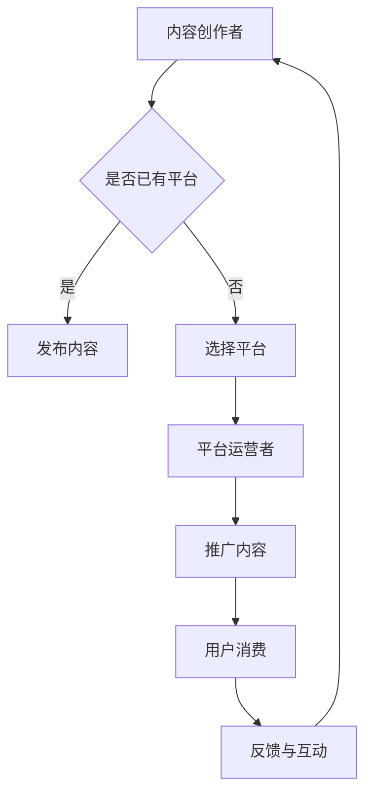

                 

### 1. 背景介绍

在数字时代，知识付费已经成为一种主流的经济模式，特别是在信息技术行业。随着互联网的普及和在线教育资源的丰富，越来越多的程序员开始意识到，通过提供知识付费服务，不仅可以提升个人品牌价值，还可以创造额外的收入来源。

近年来，知识付费市场的快速增长为程序员们提供了广阔的机遇。程序员们可以通过撰写技术博客、制作教程视频、编写电子书籍或者开设在线课程等方式，将自己的专业知识转化为实际收益。这种模式不仅满足了学习者对高质量技术内容的渴望，也为程序员们提供了一种更加灵活和可持续的职业生涯发展路径。

此外，随着人工智能和大数据技术的发展，数据分析、机器学习等高级技能的需求日益增加。这使得程序员们能够通过更深入的技术研究和知识付费服务，更好地适应市场需求，提高自身的竞争力。

本文将深入探讨知识付费时代程序员的致富之道与机遇。首先，我们将了解当前知识付费市场的现状和趋势；接着，分析程序员如何利用自己的专业技能在市场中找到定位和机会；最后，探讨未来知识付费领域的发展趋势以及程序员面临的挑战和应对策略。

通过本文的阅读，希望读者能够对知识付费市场的机会有更深入的理解，并找到适合自己的致富之路。

### 2. 核心概念与联系

#### 2.1 知识付费的定义和特点

知识付费是指用户为了获取特定知识或技能，愿意支付一定费用的一种经济模式。这种模式在互联网时代得以迅速发展，主要得益于以下几个特点：

1. **个性化需求**：知识付费服务通常针对特定用户群体的个性化需求，提供定制化的内容和解决方案。
2. **高质量内容**：付费内容往往由行业专家、资深人士或知名机构提供，具有较高的专业性和权威性。
3. **互动性和灵活性**：知识付费平台通常提供在线互动讨论、实时答疑等功能，使得用户能够更好地消化和运用所学知识。
4. **经济性**：对于用户而言，付费获取的知识或技能可以带来直接的经济回报，如提升工作效率、增加收入等。

#### 2.2 程序员在知识付费市场中的角色

程序员在知识付费市场中扮演着重要角色，他们既是知识的生产者，也是知识的消费者。具体来说，程序员可以从以下几个方面参与到知识付费活动中：

1. **内容创作者**：程序员可以通过撰写技术博客、编写技术书籍、制作教程视频等方式，将自己的技术知识转化为付费内容。
2. **在线教育讲师**：许多程序员在平台上开设在线课程，通过直播或录播的形式教授编程语言、开发框架、算法等课程。
3. **技术咨询专家**：一些具有丰富经验的程序员为企业提供技术咨询服务，帮助他们解决技术难题，优化系统性能。
4. **代码和工具开发者**：程序员可以开发各种编程工具、插件、库等，通过开源或商业化渠道进行推广和销售。

#### 2.3 知识付费市场的架构

知识付费市场通常包括以下几个核心组成部分：

1. **内容生产者**：这些通常是行业专家、技术大咖、学者等，他们提供各种形式的知识内容。
2. **平台运营者**：如知识星球、知乎Live、慕课网等，这些平台提供内容发布、推广、支付、互动等功能。
3. **内容消费者**：即用户，他们通过平台购买和获取知识内容。
4. **技术支持**：包括服务器、网络、数据存储、支付系统等，这些技术支持确保了平台的稳定运行和用户数据的安全。

#### 2.4 知识付费与程序员的关联

知识付费与程序员的关联可以从以下几个方面进行理解：

1. **技能提升**：程序员通过不断学习和分享知识，可以提升自己的技术水平，增强市场竞争力。
2. **品牌建设**：通过知识付费，程序员可以建立个人品牌，提升知名度，吸引更多的商业机会。
3. **经济收益**：程序员通过提供知识付费服务，可以获得额外的经济收入，实现职业发展的多元化。
4. **社区互动**：知识付费平台为程序员提供了一个交流和互动的社区，促进了技术知识的传播和创新。

#### 2.5 Mermaid 流程图

为了更好地展示程序员在知识付费市场中的角色和运作流程，我们使用 Mermaid 工具绘制了一个简化的流程图。



在这个流程图中，A 表示内容创作者（程序员），B 判断他们是否有自己的平台，如果是，则直接发布内容；如果不是，则需要选择一个平台运营者（如知识星球、知乎Live等）。然后，平台运营者负责推广内容，用户通过平台进行消费，并在消费后进行反馈和互动，最终再次促进内容创作者的知识更新和创作。

通过这个流程图，我们可以清晰地看到程序员在知识付费市场中的各个环节和角色，以及他们与平台运营者和用户之间的互动关系。

### 3. 核心算法原理 & 具体操作步骤

在知识付费市场中，程序员如何通过自己的专业技能获得成功，核心在于对内容创造和推广策略的理解与应用。以下，我们将探讨几个关键的算法原理和具体操作步骤。

#### 3.1 内容定位与市场调研

**算法原理**：在信息爆炸的时代，精准的内容定位是吸引用户的关键。市场调研则是获取用户需求和行业趋势的重要手段。

**具体操作步骤**：

1. **确定目标用户群体**：通过分析用户年龄、职业、兴趣等特征，确定你的内容面向的用户群体。
2. **分析市场需求**：通过在线调查、访谈等方式，了解用户对知识内容的需求和偏好。
3. **研究竞争对手**：分析市场上的成功案例和竞争内容，了解他们是如何定位用户和制作内容的。

**数学模型**：用户需求分析可以使用回归分析模型，通过对用户行为的分析，预测用户对某一知识内容的兴趣度。

$$
Y = \beta_0 + \beta_1X_1 + \beta_2X_2 + \ldots + \beta_nX_n
$$

其中，$Y$表示用户兴趣度，$X_1, X_2, \ldots, X_n$表示用户特征变量，$\beta_0, \beta_1, \beta_2, \ldots, \beta_n$为模型参数。

#### 3.2 内容创作与优化

**算法原理**：高质量的内容是知识付费成功的关键。内容创作和优化需要结合用户需求和市场趋势，确保内容的专业性和吸引力。

**具体操作步骤**：

1. **选题**：根据市场调研结果，选择用户感兴趣且你擅长的话题。
2. **内容策划**：制定详细的内容提纲，确保内容结构清晰，逻辑严密。
3. **撰写和编辑**：撰写内容并多次修改，确保语言简洁、专业，无错误。
4. **优化**：通过SEO（搜索引擎优化）等技术，提高内容的可见性和吸引力。

**数学模型**：内容质量评估可以使用TF-IDF（词频-逆文档频率）模型，通过对关键词的重要性和分布进行计算，评估内容的整体质量。

$$
TF(t,d) = \frac{f(t,d)}{N_d} \quad \text{和} \quad IDF(t) = \log\left(\frac{N}{n_t}\right)
$$

其中，$f(t,d)$表示词$t$在文档$d$中的频率，$N_d$表示文档$d$中的词总数，$N$表示整个语料库中的文档总数，$n_t$表示包含词$t$的文档数。

#### 3.3 内容推广与营销

**算法原理**：有效的推广和营销策略可以快速提升内容的知名度和用户转化率。

**具体操作步骤**：

1. **社交媒体推广**：利用微博、微信、知乎等社交媒体平台，发布内容链接和吸引人的摘要。
2. **合作伙伴推广**：与其他网站、博客或社交媒体账号合作，进行内容互换或联合推广。
3. **付费广告**：在百度、谷歌等搜索引擎上投放广告，提高内容的曝光率。
4. **用户互动**：通过问答、评论等方式，与用户进行互动，提升用户粘性和品牌认知度。

**数学模型**：广告投放效果评估可以使用转化率模型，通过计算点击率（CTR）和转化率（CR），评估广告的投资回报率（ROI）。

$$
ROI = \frac{\text{转化价值}}{\text{广告花费}}
$$

其中，转化价值可以通过用户购买课程、订阅服务等行为进行计算。

#### 3.4 用户反馈与迭代优化

**算法原理**：用户反馈是内容优化和改进的重要依据。

**具体操作步骤**：

1. **收集用户反馈**：通过问卷调查、用户访谈、评论分析等方式，收集用户对内容的意见和建议。
2. **分析反馈**：对反馈进行分析，识别用户的主要需求和不满点。
3. **优化内容**：根据反馈结果，对内容进行相应的修改和改进。
4. **持续迭代**：不断收集反馈，持续优化内容，提高用户满意度。

**数学模型**：用户满意度评估可以使用净推荐值（NPS）模型，通过用户对内容的满意度评分，评估用户对内容的整体满意程度。

$$
NPS = \% \text{推荐者} - \% \text{批评者}
$$

其中，推荐者表示对内容非常满意并愿意推荐的用户比例，批评者表示对内容不满意并可能进行负面评价的用户比例。

通过以上算法原理和具体操作步骤，程序员可以系统地构建和优化自己的知识付费内容，提高在市场中的竞争力。这不仅有助于实现个人财富的增值，还能为整个编程社区贡献高质量的知识和经验。

### 4. 数学模型和公式 & 详细讲解 & 举例说明

#### 4.1 经济收益模型

在知识付费领域，一个重要的数学模型是经济收益模型，该模型帮助我们计算通过知识付费服务获得的经济回报。以下是一个简单但实用的经济收益模型。

**基本公式**：

$$
\text{Economic Return} = \text{Revenue} - \text{Cost}
$$

其中：
- **Revenue**（收入）是指通过知识付费服务获得的实际收入。
- **Cost**（成本）是指提供知识付费服务所需的全部成本，包括但不限于内容制作成本、平台使用费用、营销费用等。

**具体公式**：

$$
\text{Revenue} = \text{Price} \times \text{Quantity Sold}
$$

$$
\text{Cost} = \text{Fixed Cost} + \text{Variable Cost}
$$

其中：
- **Price**（价格）是知识付费内容的销售价格。
- **Quantity Sold**（销售数量）是通过知识付费服务销售的内容数量。
- **Fixed Cost**（固定成本）是不随销售数量变化的成本，如设备购买费、平台使用费等。
- **Variable Cost**（可变成本）是随销售数量变化的成本，如内容制作费、广告费等。

**举例说明**：

假设程序员小明开设了一门关于Python编程的在线课程，课程定价为100元，他已经销售了1000门课程。同时，他的固定成本为2000元，可变成本为每销售一门课程增加5元。

1. **计算收入**：

$$
\text{Revenue} = 100 \text{元/门} \times 1000 \text{门} = 100,000 \text{元}
$$

2. **计算成本**：

$$
\text{Cost} = 2000 \text{元（固定成本）} + (5 \text{元/门} \times 1000 \text{门}) = 7000 \text{元}
$$

3. **计算经济收益**：

$$
\text{Economic Return} = \text{Revenue} - \text{Cost} = 100,000 \text{元} - 7000 \text{元} = 93,000 \text{元}
$$

因此，小明通过这门在线课程获得了93,000元的经济收益。

#### 4.2 用户留存模型

在知识付费领域，用户留存率是一个关键的指标，它反映了用户对付费内容的满意度和忠诚度。以下是一个简单的用户留存模型。

**基本公式**：

$$
\text{Retention Rate} = \frac{\text{期末留存用户数}}{\text{期初用户数}} \times 100\%
$$

其中：
- **期末留存用户数**是指在特定时间点仍然使用付费内容的用户数量。
- **期初用户数**是指在特定时间点开始使用付费内容的用户总数。

**具体公式**：

$$
\text{Retention Rate} = \frac{\text{期末留存用户数}}{\text{期初用户数}} \times 100\%
$$

**举例说明**：

假设一个在线课程平台在一个月内吸引了1000名新用户，其中800名用户在一个月后仍然活跃使用平台。

$$
\text{Retention Rate} = \frac{800}{1000} \times 100\% = 80\%
$$

这意味着该平台的用户留存率为80%。

#### 4.3 转化率模型

在营销和推广过程中，转化率模型帮助程序员评估营销活动的效果。以下是一个简单的转化率模型。

**基本公式**：

$$
\text{Conversion Rate} = \frac{\text{完成转化的用户数}}{\text{访问用户数}} \times 100\%
$$

其中：
- **完成转化的用户数**是指在营销活动中完成预定目标（如购买课程、注册账户等）的用户数量。
- **访问用户数**是指参与营销活动的总用户数量。

**具体公式**：

$$
\text{Conversion Rate} = \frac{\text{完成转化的用户数}}{\text{访问用户数}} \times 100\%
$$

**举例说明**：

假设一个程序员通过线上广告推广一门编程课程，吸引了1000名用户访问，其中200名用户最终购买了课程。

$$
\text{Conversion Rate} = \frac{200}{1000} \times 100\% = 20\%
$$

这意味着该广告的转化率为20%。

通过上述数学模型和公式，程序员可以更科学地评估自己的知识付费业务的经济效益、用户留存率和营销活动效果，从而进行优化和改进。这不仅有助于提高个人收入，还能提升整个知识付费服务的质量和用户体验。

### 5. 项目实践：代码实例和详细解释说明

为了更好地理解知识付费在程序员中的实际应用，我们将通过一个具体的代码实例来展示如何创建一个简单的在线课程销售系统。这个项目将包括以下几个关键步骤：

1. **开发环境搭建**：选择适合的开发工具和环境。
2. **源代码详细实现**：编写关键代码，实现系统的核心功能。
3. **代码解读与分析**：详细解释代码的逻辑和功能。
4. **运行结果展示**：展示系统的实际运行效果。

#### 5.1 开发环境搭建

在这个项目中，我们将使用Python语言，结合Flask框架进行开发。以下是具体的开发环境搭建步骤：

1. **安装Python**：确保你的系统上已经安装了Python 3.8或更高版本。
2. **安装Flask**：通过pip命令安装Flask框架。

```bash
pip install Flask
```

3. **创建虚拟环境**：为了保持项目依赖的独立性，我们创建一个虚拟环境。

```bash
python -m venv venv
source venv/bin/activate  # 在Windows上使用 `venv\Scripts\activate`
```

4. **安装其他依赖**：根据项目需要，安装其他依赖，如SQLAlchemy、Flask-Migrate等。

```bash
pip install Flask-SQLAlchemy Flask-Migrate
```

#### 5.2 源代码详细实现

下面是系统的核心代码实现，包括数据库模型、路由和视图函数等。

**app.py**：

```python
from flask import Flask, render_template, request, redirect, url_for
from flask_sqlalchemy import SQLAlchemy

app = Flask(__name__)
app.config['SQLALCHEMY_DATABASE_URI'] = 'sqlite:///courses.db'
db = SQLAlchemy(app)

class Course(db.Model):
    id = db.Column(db.Integer, primary_key=True)
    title = db.Column(db.String(100), nullable=False)
    description = db.Column(db.Text, nullable=False)
    price = db.Column(db.Float, nullable=False)

@app.route('/')
def index():
    courses = Course.query.all()
    return render_template('index.html', courses=courses)

@app.route('/course/<int:course_id>/')
def course_detail(course_id):
    course = Course.query.get_or_404(course_id)
    return render_template('course_detail.html', course=course)

@app.route('/course/<int:course_id>/enroll', methods=['POST'])
def enroll_course(course_id):
    course = Course.query.get_or_404(course_id)
    # 在这里添加用户身份验证逻辑
    # ...
    return redirect(url_for('course_detail', course_id=course_id))

if __name__ == '__main__':
    db.create_all()
    app.run(debug=True)
```

**templates/index.html**：

```html
<!DOCTYPE html>
<html lang="en">
<head>
    <meta charset="UTF-8">
    <title>在线课程平台</title>
</head>
<body>
    <h1>在线课程平台</h1>
    <ul>
        
            <li>
                <a href="{{ url_for('course_detail', course_id=course.id) }}">
                    {{ course.title }}
                </a>
            </li>
        
    </ul>
</body>
</html>
```

**templates/course_detail.html**：

```html
<!DOCTYPE html>
<html lang="en">
<head>
    <meta charset="UTF-8">
    <title>{{ course.title }}</title>
</head>
<body>
    <h1>{{ course.title }}</h1>
    <p>{{ course.description }}</p>
    <p>价格：{{ course.price }}元</p>
    <form action="{{ url_for('enroll_course', course_id=course.id) }}" method="post">
        <input type="submit" value="报名">
    </form>
</body>
</html>
```

#### 5.3 代码解读与分析

**数据库模型**：`Course` 类定义了课程的基本信息，包括课程ID、标题、描述和价格。使用 SQLAlchemy 模型，我们可以方便地在数据库中创建、查询和更新课程记录。

**路由和视图函数**：`index()` 函数处理首页的渲染，展示所有课程的信息。`course_detail()` 函数处理课程详情页面的渲染，展示单个课程的详细信息。`enroll_course()` 函数用于处理用户报名课程的操作。

**模板**：`index.html` 和 `course_detail.html` 是两个主要的HTML模板，用于渲染首页和课程详情页面。通过Jinja2模板引擎，我们可以动态地渲染课程列表和课程信息。

#### 5.4 运行结果展示

1. **启动服务器**：在终端中运行以下命令启动服务器。

```bash
python app.py
```

2. **访问网站**：在浏览器中访问 `http://127.0.0.1:5000/`，可以看到网站的首页，展示所有课程的列表。

3. **查看课程详情**：点击某个课程，可以查看该课程的详细信息。

4. **报名课程**：在课程详情页面中，用户可以通过点击“报名”按钮进行报名。

这个简单的在线课程销售系统展示了如何通过Python和Flask框架快速搭建一个知识付费平台。在实际应用中，我们还需要添加用户身份验证、支付系统、课程管理等功能，以提升系统的完整性和用户体验。

### 6. 实际应用场景

在知识付费时代，程序员的致富之道与机遇不仅局限于个人品牌的建立和在线课程的开设，还体现在多个实际应用场景中。以下是一些典型的应用场景，以及程序员如何利用自己的专业技能在这些场景中取得成功。

#### 6.1 技术咨询与解决方案

**应用场景**：许多中小型企业缺乏专业的技术团队，他们在开发过程中会遇到各种技术难题，如性能优化、系统架构设计、安全防护等。

**如何操作**：程序员可以利用自己在某一技术领域的专业知识和经验，为企业提供咨询服务。可以通过线上咨询、远程协助或现场指导等方式，帮助企业解决技术问题，提升系统的稳定性和性能。

**成功案例**：某小型互联网公司因系统性能不佳，影响了用户体验。一位具有丰富性能优化经验的程序员通过远程协助，帮助企业进行了数据库优化、缓存策略改进和服务器调优，最终大幅提升了系统性能，赢得了客户的信任和好评。

#### 6.2 软件开发和定制

**应用场景**：很多企业有特定的软件开发需求，但缺乏内部开发团队或现有团队无法满足这些需求。

**如何操作**：程序员可以组建团队，或以个体顾问的身份，为企业提供软件定制服务。从需求分析、系统设计到开发、测试和部署，全程参与，确保软件质量和按时交付。

**成功案例**：一家初创公司需要开发一个基于大数据分析的平台。一位具有大数据开发经验的程序员带领团队完成了整个项目，从数据采集、存储、处理到可视化，为企业提供了完整的数据分析解决方案，得到了客户的高度认可。

#### 6.3 开源项目和社区贡献

**应用场景**：开源社区是程序员展示技术能力的重要平台，许多程序员通过贡献开源项目，获得了广泛的认可和机会。

**如何操作**：程序员可以积极参与开源项目的开发，通过高质量的代码和文档，提升项目的知名度。同时，可以创建自己的开源项目，分享技术心得，吸引其他开发者参与。

**成功案例**：某程序员在GitHub上创建了一个高性能的分布式数据库项目，通过不断优化和更新，该项目在开源社区中获得了极高的评价，吸引了众多企业用户和贡献者，为该程序员带来了丰厚的经济回报。

#### 6.4 技术写作与出版

**应用场景**：随着知识付费的兴起，许多程序员开始撰写技术博客、电子书籍或教程视频，将自己的专业知识分享给更广泛的读者。

**如何操作**：程序员可以通过撰写高质量的博客文章，分享开发经验和技术心得。在积累了一定的读者基础后，可以进一步拓展到电子书籍或教程视频的制作，通过平台进行销售或推广。

**成功案例**：一位程序员通过在多个技术博客平台上发表高质量的文章，逐渐积累了大量粉丝。在此基础上，他出版了多本技术书籍，不仅实现了财务自由，还提升了个人品牌价值。

#### 6.5 技术培训与教育

**应用场景**：随着人工智能、大数据等技术的发展，企业对技术人才的需求不断增加。许多程序员通过开设线上或线下的培训课程，为企业或个人提供技术培训服务。

**如何操作**：程序员可以结合自己的专业优势和教学经验，设计适合不同层次学员的课程。通过线上直播、录播或面授等方式，教授编程语言、开发框架、算法等知识。

**成功案例**：一位在机器学习领域有丰富经验的程序员，通过在线平台开设了多门机器学习课程。这些课程不仅满足了学员的学习需求，还为该程序员带来了可观的收入。

通过以上实际应用场景，我们可以看到，程序员在知识付费时代有诸多致富之道和机遇。只要发挥自身的专业技能，不断学习和创新，就能够在市场中找到自己的定位，实现财富的增长和职业的发展。

### 7. 工具和资源推荐

在知识付费时代，程序员要想在市场中脱颖而出，不仅需要扎实的专业技能，还需要借助各种工具和资源来提升内容创作、推广和营销的效果。以下是一些推荐的工具和资源，涵盖了学习资源、开发工具和框架、相关论文和著作等，帮助程序员更好地抓住知识付费的机遇。

#### 7.1 学习资源推荐

1. **书籍**：

   - 《深入理解计算机系统》（深入理解计算机系统）：作者Randal E. Bryant和David R. O’Hallaron。这本书详细介绍了计算机系统的组成和工作原理，适合计算机科学专业的学生和程序员深入理解计算机系统。

   - 《编程珠玑》（The Art of Computer Programming）：作者Donald E. Knuth。这是一部经典的编程指南，包含了大量的编程技巧和算法策略，对提高编程能力有极高的参考价值。

2. **在线课程**：

   - Coursera：提供各种领域的在线课程，包括计算机科学、数据科学、人工智能等。许多课程由顶尖大学和专业机构提供，有助于提升专业知识和技能。

   - Udemy：提供了大量的编程课程，涵盖了各种编程语言和开发框架。许多课程由经验丰富的讲师讲授，适合不同层次的程序员学习。

3. **博客和网站**：

   - Medium：许多技术大牛在Medium上发布技术博客，涵盖了各种编程语言、开发框架和算法。通过阅读这些博客，可以了解最新的技术动态和最佳实践。

   - GitHub：GitHub不仅是程序员存放代码的平台，也是学习代码和交流技术的地方。通过阅读和参与开源项目，可以提升自己的编程能力和团队协作能力。

#### 7.2 开发工具和框架推荐

1. **集成开发环境（IDE）**：

   - Visual Studio Code：一款开源的跨平台IDE，功能强大，支持多种编程语言，是程序员常用的开发工具之一。

   - IntelliJ IDEA：由JetBrains开发的IDE，适合Java和JavaScript开发，提供了丰富的插件和工具，提高了开发效率。

2. **版本控制系统**：

   - Git：分布式版本控制系统，广泛应用于开源项目和团队协作中。掌握Git的使用对于程序员来说至关重要。

   - GitHub Actions：GitHub提供的一套持续集成和持续部署（CI/CD）工具，可以自动化构建、测试和部署代码。

3. **前端框架**：

   - React：由Facebook开发的前端框架，广泛用于构建用户界面，具有组件化、响应式和高效的特点。

   - Vue.js：轻量级的前端框架，易于学习和使用，适合快速开发单页面应用程序。

4. **后端框架**：

   - Flask：轻量级的Python Web框架，适合快速开发Web应用程序。

   - Django：全栈的Python Web框架，提供了丰富的内置功能和工具，适合开发大型Web应用。

#### 7.3 相关论文著作推荐

1. **论文**：

   - "The Unix Programming Environment"：作者Brian Kernighan和Rob Pike。这篇论文详细介绍了Unix系统的编程环境和最佳实践，对理解Unix系统的设计和思想非常有帮助。

   - "A Note on the Data Locking Problem in a Shared Data Base"：作者E. W. Dijkstra。这篇论文提出了Dijkstra算法，是解决共享数据库中的锁定问题的重要方法。

2. **著作**：

   - 《代码大全》（Code Complete）：作者Steve McConnell。这是一本关于软件开发的经典著作，涵盖了编程、设计和测试等多个方面，对提高编程能力和软件开发效率有重要参考价值。

   - 《设计模式：可复用面向对象软件的基础》（Design Patterns: Elements of Reusable Object-Oriented Software）：作者Erich Gamma、Richard Helm、Ralph Johnson和John Vlissides。这本书介绍了23种经典的设计模式，是面向对象编程的重要指南。

通过上述工具和资源的推荐，程序员可以不断提升自己的技术水平，拓展知识面，为自己的知识付费之路奠定坚实的基础。

### 8. 总结：未来发展趋势与挑战

在知识付费时代的浪潮中，程序员迎来了前所未有的发展机遇。然而，随着市场的不断成熟和技术的快速进步，程序员也将面临一系列新的发展趋势和挑战。

**发展趋势**：

1. **技术专业化与垂直化**：随着人工智能、大数据、区块链等新兴技术的快速发展，程序员需要不断更新自己的知识体系，才能在特定领域内保持竞争优势。技术专业化与垂直化将成为未来程序员发展的重要趋势。

2. **内容形式多样化**：除了传统的博客文章和教程视频，程序员还可以通过短视频、直播、互动课程等多种形式来分享知识，满足用户多样化的学习需求。这种多样化的内容形式将提高知识付费的覆盖面和用户粘性。

3. **平台生态完善**：随着知识付费平台的不断成熟，平台生态将变得更加完善，为程序员提供更丰富的工具和服务，如内容管理系统、数据分析工具、用户互动系统等。这将进一步降低知识付费的门槛，吸引更多程序员参与。

**挑战**：

1. **竞争加剧**：随着越来越多的人进入知识付费市场，竞争将愈发激烈。程序员需要不断提高自己的专业能力和内容创作水平，才能在激烈的市场中脱颖而出。

2. **版权保护**：知识付费内容很容易被复制和盗用，这对内容创作者的权益保护提出了严峻挑战。程序员需要了解和掌握相关的版权保护法律和技巧，确保自己的原创内容得到有效保护。

3. **用户信任度**：用户对知识付费内容的信任度是影响其购买决策的重要因素。程序员需要通过高质量的内容和良好的用户体验，赢得用户的信任和口碑。

4. **技术更新速度**：技术的快速更新使得程序员需要不断学习和适应新技术，这给他们的个人发展带来了压力。同时，技术更新也给知识付费内容的时效性和准确性提出了更高要求。

**应对策略**：

1. **持续学习与技能提升**：程序员需要保持学习的热情，不断更新自己的知识体系，提升专业技能。通过参加培训课程、阅读专业书籍、参与开源项目等方式，提高自己的竞争力。

2. **内容创新与优化**：在内容创作方面，程序员应注重创新，提供独特且有价值的内容。同时，不断优化内容质量和用户体验，提高用户的满意度和忠诚度。

3. **版权保护**：了解并掌握版权保护法律和技巧，确保自己的内容不受侵犯。可以采用数字签名、版权声明等技术手段，保护自己的原创内容。

4. **平台合作与多元化发展**：与知识付费平台建立良好的合作关系，利用平台提供的服务和资源，拓展自己的业务。同时，可以考虑多元化发展，如结合线下培训、技术咨询等服务，提高收入来源。

总之，知识付费时代为程序员提供了广阔的发展空间和机遇，但也带来了新的挑战。程序员需要积极应对这些挑战，不断学习和创新，才能在这个市场中取得成功。

### 9. 附录：常见问题与解答

在知识付费市场中，程序员可能会遇到各种问题和困惑。以下是一些常见问题及其解答，希望能为读者提供一些实用的指导。

#### 9.1 如何选择知识付费平台？

**解答**：选择知识付费平台时，应考虑以下几个因素：

1. **用户基础**：选择用户数量多的平台，有利于内容推广和用户互动。
2. **平台规则**：了解平台的运营规则，如内容审核标准、分成比例等。
3. **服务支持**：平台是否提供技术支持、数据分析等增值服务。
4. **口碑**：参考其他用户的评价和反馈，了解平台的口碑和信誉。
5. **收费模式**：比较不同平台的收费模式，选择适合自己的方案。

#### 9.2 如何确保内容质量？

**解答**：确保内容质量是知识付费成功的关键，可以从以下几个方面入手：

1. **选题与策划**：选择用户感兴趣且自己擅长的主题，制定详细的内容提纲。
2. **撰写与编辑**：撰写内容时注意语言表达清晰、逻辑严谨，避免错误和遗漏。多次修改和审稿，确保内容质量。
3. **互动与反馈**：与用户保持互动，收集反馈意见，及时优化内容。
4. **专业认证**：如果内容涉及特定领域，可以获取相关认证，提高内容的权威性。

#### 9.3 如何进行有效营销？

**解答**：有效营销是提高知识付费内容知名度和用户转化率的关键，可以从以下几个方面入手：

1. **社交媒体推广**：利用微博、微信、知乎等社交媒体平台，发布内容摘要和链接，吸引潜在用户。
2. **合作伙伴推广**：与其他网站、博客或社交媒体账号合作，进行内容互换或联合推广。
3. **付费广告**：在搜索引擎、社交媒体等平台投放广告，提高内容的曝光率。
4. **用户互动**：通过问答、评论等方式，与用户互动，提升用户粘性和品牌认知度。

#### 9.4 如何保护个人品牌和版权？

**解答**：保护个人品牌和版权是知识付费过程中的重要环节，可以从以下几个方面入手：

1. **版权声明**：在内容发布时，明确版权声明，告知用户内容归属权。
2. **数字签名**：采用数字签名技术，确保内容的完整性和原创性。
3. **法律咨询**：如果遇到侵权问题，及时咨询法律专业人士，采取法律手段保护自己的权益。
4. **平台合作**：与知识付费平台建立良好的合作关系，利用平台提供的版权保护机制。

通过上述常见问题与解答，希望读者能够对知识付费市场中的关键问题有更深入的理解，并找到适合自己的解决方案。

### 10. 扩展阅读 & 参考资料

为了帮助读者进一步深入理解和探索知识付费时代程序员的致富之道与机遇，我们推荐以下扩展阅读和参考资料：

1. **书籍**：
   - 《精益创业》（The Lean Startup）：作者Eric Ries。这本书提供了关于如何快速迭代和验证商业模式的实用方法，适用于知识付费项目。
   - 《增长黑客》（Growth Hacker Marketing）：作者Ryan Holiday。这本书探讨了如何利用创新思维和科技手段实现快速增长，对知识付费营销有很好的参考价值。

2. **在线课程**：
   - Coursera上的《产品管理》课程：由斯坦福大学提供，涵盖产品从构思到发布的全过程，对知识付费项目的管理有很大帮助。
   - Udemy上的《数字营销基础》课程：介绍了数字营销的基础知识和策略，有助于提高知识付费内容的市场推广效果。

3. **博客和文章**：
   - 知乎专栏《程序员的财富自由之路》：作者李笑来。这篇文章分享了程序员的财富自由之路，包括投资、学习和创业等多个方面。
   - Medium上的《知识付费：如何通过内容创作赚钱？》：作者Sammiguel。这篇文章详细介绍了如何通过知识付费实现收入增长。

4. **论文和报告**：
   - 《知识付费报告2019》：该报告分析了知识付费市场的现状、用户行为和未来趋势，对知识付费行业有重要参考价值。
   - 《2019中国知识付费行业年度报告》：该报告从用户规模、内容形式、市场规模等多个维度分析了知识付费行业的发展态势。

通过阅读这些扩展阅读和参考资料，读者可以进一步了解知识付费市场的最新动态和最佳实践，为自己的知识付费项目提供有力的支持和指导。

