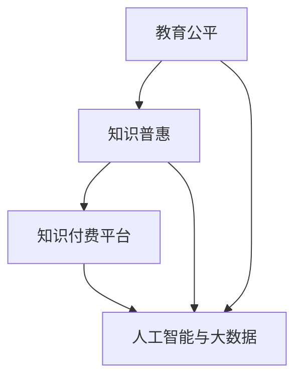

                 

### 1. 背景介绍

知识付费作为一种新兴的商业模式，正在全球范围内迅速崛起。其核心在于消费者通过支付一定的费用，获取高质量的知识和技能。这种模式在教育培训、在线课程、专业技能提升等方面有着广泛的应用。然而，随着知识付费市场的不断扩大，教育公平和知识普惠的问题也日益凸显。

教育公平是指每个个体都有平等的受教育机会，能够在教育中获得应有的资源和帮助。知识普惠则强调知识的普及和共享，让更多的人受益于知识经济的发展。这两个概念不仅关乎教育和社会的公平，也直接影响到知识付费行业的可持续发展和社会的整体进步。

知识付费要重视教育公平和知识普惠的原因主要有以下几点：

1. **社会公平的诉求**：知识付费的门槛相对较高，对于那些经济条件较差的群体来说，获取优质知识资源的难度较大。这会导致社会阶层固化，进一步加剧贫富差距。

2. **知识普惠的目标**：知识付费的本质在于知识的传播和共享，如果只有少数人能够享受到这种服务，那么知识普惠的目标就无法实现。

3. **市场发展的需求**：随着知识经济的兴起，知识付费市场潜力巨大。然而，如果市场过于集中在少数精英用户身上，将难以实现市场的长期稳定和健康增长。

4. **社会责任的体现**：作为知识付费平台和企业，承担起促进教育公平和知识普惠的社会责任，是推动社会进步的重要途径。

### 1.1 知识付费的发展历程

知识付费的发展历程可以分为以下几个阶段：

**1.1.1 起步阶段**（2010年-2015年）

在这个阶段，知识付费主要以在线教育、职业培训等形式出现。例如，Coursera、Udemy等国际知名教育平台，以及国内的知乎Live、网易云课堂等，开始逐步受到市场的关注。

**1.1.2 快速发展阶段**（2016年-2020年）

随着移动互联网的普及，知识付费迎来了快速发展的阶段。平台数量大幅增加，内容类型更加丰富，用户规模迅速扩大。2016年，知识付费市场规模约为58亿元，到2020年已增长至204亿元。

**1.1.3 规范阶段**（2021年至今）

近年来，国家开始加强对知识付费市场的监管，出台了一系列政策法规，规范市场行为。同时，平台也在积极探索新的商业模式，如直播教学、互动课程等，以提升用户体验。

### 1.2 知识付费的商业模式

知识付费的商业模式主要包括以下几种：

**1.2.1 会员制模式**

用户支付一定费用成为会员，享受平台提供的所有课程和资源。例如，知乎的盐选会员、得到APP的年度会员等。

**1.2.2 课程购买模式**

用户按需购买单个课程，价格根据课程的内容和时长而定。例如，网易云课堂、慕课网等。

**1.2.3 付费问答模式**

用户针对特定问题向专家或同行付费提问，获取专业解答。例如，知乎的付费问答、分答等。

**1.2.4 付费订阅模式**

用户定期支付费用，订阅某一领域的课程或内容。例如，喜马拉雅的付费订阅、得到APP的专栏等。

### 1.3 知识付费的现状

当前，知识付费市场呈现出以下特点：

**1.3.1 市场规模持续增长**

根据相关报告显示，2021年我国知识付费市场规模已达到392亿元，预计到2025年将突破1000亿元。

**1.3.2 用户群体不断扩大**

知识付费的受众范围越来越广泛，从最初的职场人士、学生，逐渐扩展到包括中老年人、少儿在内的各个年龄层。

**1.3.3 内容质量参差不齐**

在快速发展的过程中，一些平台和内容创作者为了追求短期利益，发布了质量不佳的课程和内容，影响了用户的体验和信任度。

**1.3.4 监管力度不断加强**

国家对于知识付费市场的监管力度逐渐加大，针对虚假宣传、侵权盗版、恶意诈骗等行为进行了严厉打击。

### 1.4 知识付费面临的挑战

尽管知识付费市场前景广阔，但同时也面临着一系列挑战：

**1.4.1 教育公平问题**

知识付费的门槛较高，部分人群难以承受。这会导致教育资源的分配不均，加剧社会贫富差距。

**1.4.2 知识普惠目标难以实现**

知识付费平台主要集中在一线城市和发达地区，农村和欠发达地区用户较少。这会导致知识普惠的目标难以实现。

**1.4.3 内容质量难以保障**

一些平台和内容创作者为了追求利益，降低了内容质量，影响了用户体验。

**1.4.4 监管法规有待完善**

知识付费市场尚处于规范阶段，相关法规政策还需进一步完善，以保障市场健康发展。

### 1.5 本文结构

本文将围绕知识付费要重视教育公平和知识普惠这一主题，展开以下内容：

- **第2章：核心概念与联系**：介绍与教育公平和知识普惠相关的核心概念，并使用Mermaid流程图展示其架构。
- **第3章：核心算法原理 & 具体操作步骤**：探讨如何通过算法和策略实现教育公平和知识普惠。
- **第4章：数学模型和公式 & 详细讲解 & 举例说明**：运用数学模型和公式分析教育公平和知识普惠的实现机制。
- **第5章：项目实践：代码实例和详细解释说明**：通过具体项目实践展示如何在实际操作中实现教育公平和知识普惠。
- **第6章：实际应用场景**：分析教育公平和知识普惠在不同领域的应用情况。
- **第7章：工具和资源推荐**：推荐学习资源和开发工具，助力读者深入学习和实践。
- **第8章：总结：未来发展趋势与挑战**：总结本文的主要观点，展望未来发展趋势和面临的挑战。
- **第9章：附录：常见问题与解答**：针对本文内容提供常见问题的解答。
- **第10章：扩展阅读 & 参考资料**：推荐相关书籍、论文和网站，供读者进一步学习。

通过对这些内容的深入分析，我们将探讨如何通过知识付费实现教育公平和知识普惠，为行业的可持续发展提供有益的参考。

### 2. 核心概念与联系

在教育公平和知识普惠的讨论中，我们首先需要明确几个核心概念，并理解它们之间的相互关系。以下是对这些概念的定义、关联及其在知识付费领域中的应用进行梳理。

#### 2.1 教育公平

教育公平是指每个个体都有平等的受教育机会，不受种族、性别、经济地位、地理位置等因素的限制。它包括两个层面的含义：机会公平和结果公平。机会公平指的是每个人都有机会获得优质教育资源，而结果公平则意味着这些资源能够真正促进个体的发展，使其在教育过程中取得良好的成绩。

**教育公平与知识付费的关系：**
- **提高教育资源分配的公平性**：知识付费平台可以通过提供多样化的课程内容，覆盖更多的人群，从而提高教育资源分配的公平性。
- **缩小城乡差距**：通过线上教育，农村和偏远地区的学生也能够享受到一线城市的优质教育资源，从而缩小城乡差距。
- **促进社会流动性**：教育公平有助于提高个体的社会地位，而知识付费则为不同背景的人提供了获取知识和技能的机会，有助于促进社会流动性。

#### 2.2 知识普惠

知识普惠是指让更多的人受益于知识的传播和共享，使知识成为推动社会进步和个体发展的动力。它强调知识的普及性和公益性，即知识不应该仅限于少数人，而应该为所有人所共享。

**知识普惠与知识付费的关系：**
- **降低知识获取门槛**：知识付费平台可以通过优惠活动、补贴等方式，降低用户的付费门槛，使更多人能够接触和利用知识。
- **推动知识共享**：知识付费平台不仅可以提供课程内容，还可以通过论坛、问答社区等互动方式，促进知识的交流与共享。
- **促进知识创新**：知识普惠有助于激发个体的创造力，从而推动知识创新和社会进步。

#### 2.3 知识付费平台

知识付费平台是指为用户提供付费知识服务的在线平台，如知乎、得到、网易云课堂等。这些平台通常提供各类课程、专业讲座、在线问答等服务。

**知识付费平台在教育公平和知识普惠中的作用：**
- **教育资源规模化**：知识付费平台可以将优质教育资源规模化，使更多人能够受益。
- **个性化学习体验**：通过算法和数据分析，知识付费平台可以为用户提供个性化的学习路径，提高学习效果。
- **提升教育质量**：知识付费平台可以通过严格的内容审核机制，确保课程质量，从而提升整体教育质量。

#### 2.4 人工智能与大数据

人工智能和大数据技术在知识付费领域中的应用，进一步促进了教育公平和知识普惠的实现。

**人工智能与大数据在教育公平和知识普惠中的作用：**
- **智能推荐系统**：通过大数据分析，知识付费平台可以为用户提供个性化的课程推荐，使每个用户都能找到适合自己的学习内容。
- **学习行为分析**：人工智能可以对用户的学习行为进行分析，帮助教师和教育机构更好地了解学生的学习情况，从而提供更有针对性的教育服务。
- **精准营销**：通过大数据分析，知识付费平台可以精准地定位用户需求，推出更有吸引力的课程和优惠活动，从而扩大用户基础。

#### 2.5 Mermaid流程图

为了更清晰地展示教育公平、知识普惠和知识付费平台之间的联系，我们使用Mermaid流程图进行描述。



在上述流程图中，教育公平和知识普惠是两个核心目标，它们通过知识付费平台和人工智能与大数据技术相互联系和促进。知识付费平台作为实现教育公平和知识普惠的重要载体，依托人工智能和大数据技术，不断提高教育资源的分配效率和用户体验。

### 3. 核心算法原理 & 具体操作步骤

为了实现教育公平和知识普惠，知识付费平台需要采用一系列核心算法和策略。这些算法和策略不仅能够提高资源分配的效率，还能够确保每个用户都能获得适合自己的学习内容。以下是几个关键算法的原理和具体操作步骤。

#### 3.1 智能推荐算法

智能推荐算法是知识付费平台的核心技术之一，它通过分析用户的行为数据、兴趣标签和社交关系，为用户推荐个性化的课程内容。

**算法原理：**
- **协同过滤**：基于用户的共同行为或兴趣，为用户推荐相似的内容。协同过滤包括用户协同过滤和项目协同过滤。
- **内容推荐**：根据课程的内容特征，如标签、关键词等，为用户推荐相关课程。
- **混合推荐**：结合协同过滤和内容推荐，提高推荐准确性和多样性。

**具体操作步骤：**
1. **数据收集**：收集用户的学习行为数据，如浏览记录、购买历史、评分等。
2. **用户兴趣建模**：通过机器学习算法，建立用户兴趣模型，为每个用户生成个性化标签。
3. **课程内容特征提取**：提取课程的内容特征，如标签、关键词等。
4. **推荐模型训练**：使用训练数据训练推荐模型，如矩阵分解、基于模型的协同过滤等。
5. **课程推荐**：根据用户兴趣模型和课程内容特征，为用户推荐个性化的课程。

#### 3.2 学习行为分析算法

学习行为分析算法通过对用户的学习行为进行数据挖掘和分析，为教师和教育机构提供有价值的洞察，以优化教学策略和提高教育质量。

**算法原理：**
- **行为分类**：将用户的学习行为分类，如观看视频、完成作业、参加考试等。
- **行为序列分析**：分析用户行为序列，发现行为模式，预测用户未来的学习行为。
- **情感分析**：通过自然语言处理技术，分析用户对课程的评价和反馈，了解用户的学习体验。

**具体操作步骤：**
1. **行为数据收集**：收集用户的学习行为数据，如访问时间、学习时长、作业完成情况等。
2. **行为分类模型**：训练行为分类模型，将用户行为进行分类。
3. **行为序列模型**：使用序列模型，如循环神经网络（RNN），分析用户行为序列，预测用户未来的学习行为。
4. **情感分析模型**：训练情感分析模型，分析用户评价和反馈，提取情感标签。
5. **学习行为报告**：生成学习行为报告，为教师和教育机构提供决策支持。

#### 3.3 精准营销算法

精准营销算法通过分析用户数据，为知识付费平台提供个性化的营销策略，以提高用户转化率和留存率。

**算法原理：**
- **用户画像**：通过用户的基本信息、行为数据、兴趣标签等，构建用户画像。
- **行为预测**：基于用户画像，预测用户的下一步行为，如购买课程、参与活动等。
- **多渠道营销**：结合用户行为预测，制定多渠道营销策略，如短信、邮件、推送等。

**具体操作步骤：**
1. **用户画像构建**：收集用户数据，包括基本信息、行为数据、社交关系等，构建用户画像。
2. **行为预测模型**：使用机器学习算法，如逻辑回归、决策树等，预测用户的下一步行为。
3. **多渠道营销策略**：根据用户行为预测结果，制定多渠道营销策略，如发送个性化短信、推送通知等。
4. **效果评估**：评估营销策略的效果，优化营销策略。

通过上述核心算法的应用，知识付费平台可以实现教育公平和知识普惠的目标。智能推荐算法确保每个用户都能找到适合自己的学习内容；学习行为分析算法帮助教师和教育机构提高教学质量；精准营销算法提高用户的转化率和留存率。这些算法的协同工作，为知识付费行业的可持续发展奠定了坚实的基础。

### 4. 数学模型和公式 & 详细讲解 & 举例说明

在实现教育公平和知识普惠的过程中，数学模型和公式扮演着至关重要的角色。以下我们将详细讲解几个关键的数学模型和公式，并通过具体的例子来说明其应用。

#### 4.1 教育公平的数学模型

教育公平可以通过多个维度进行衡量，例如教育资源分配的公平性、教育成果的公平性等。以下是一个简单的数学模型，用于评估教育资源分配的公平性。

**教育资源分配公平性指标：**
\[ F = \frac{\sum_{i=1}^{N} \frac{X_i}{T_i}}{N} \]

其中：
- \( N \) 是总人口数
- \( X_i \) 是第 \( i \) 个群体所获得的教育资源总量
- \( T_i \) 是第 \( i \) 个群体所需的教育资源总量

**例：** 假设一个地区有 1000 人，其中 500 人是城市居民，500 人是农村居民。城市居民每人平均获得 10 单位的教育资源，而农村居民每人平均获得 5 单位的教育资源。则该地区的教育资源分配公平性指标为：
\[ F = \frac{500 \times 10 + 500 \times 5}{1000} = 8 \]

**解读：** 结果表明，该地区的教育资源分配相对公平，因为每个群体获得的教育资源与其需求量成比例。

#### 4.2 知识普惠的数学模型

知识普惠可以通过知识传播的范围和影响力进行衡量。以下是一个简单的数学模型，用于评估知识普惠的程度。

**知识传播范围指标：**
\[ R = \frac{N_C}{N_T} \]

其中：
- \( N_C \) 是接触知识的人数
- \( N_T \) 是总体人数

**例：** 假设一个知识付费平台有 10000 名用户，其中 7000 名用户购买了知识课程。则该平台的知识传播范围指标为：
\[ R = \frac{7000}{10000} = 0.7 \]

**解读：** 结果表明，该平台的知识传播范围较广，因为超过 70% 的用户接触到了知识课程。

#### 4.3 个性化推荐模型

个性化推荐是知识付费平台实现教育公平和知识普惠的关键技术之一。以下是一个基于矩阵分解的个性化推荐模型的数学公式。

**矩阵分解公式：**
\[ X_{ui} \approx \hat{R}_{ui} + \hat{Q}_u \cdot \hat{Q}_i \]

其中：
- \( X_{ui} \) 是用户 \( u \) 对项目 \( i \) 的评分
- \( \hat{R}_{ui} \) 是用户 \( u \) 对项目 \( i \) 的预测评分
- \( \hat{Q}_u \) 是用户 \( u \) 的特征向量
- \( \hat{Q}_i \) 是项目 \( i \) 的特征向量

**例：** 假设用户 \( u \) 给了课程 \( i \) 一个评分 \( X_{ui} = 4 \)。通过矩阵分解模型，预测用户 \( u \) 对课程 \( i \) 的评分 \( \hat{R}_{ui} \) 为 4.5。则：
\[ 4.5 = \hat{R}_{ui} + \hat{Q}_u \cdot \hat{Q}_i \]

**解读：** 该公式表明，用户对项目的评分可以通过其特征向量和项目特征向量的内积来预测。通过优化特征向量，可以提高预测的准确性。

#### 4.4 期望最大化（EM）算法

期望最大化（EM）算法是一种常用的无监督学习算法，用于估计隐含变量和参数。在个性化推荐系统中，EM算法常用于估计用户和项目的潜在特征。

**EM算法步骤：**
1. **E步（期望步）**：计算每个数据点关于隐含变量的期望值。
2. **M步（最大化步）**：最大化数据点和期望值之间的概率函数。

**数学公式：**
\[ \theta_{k+1} = \arg\max_{\theta} p(X|\theta) \]

其中：
- \( \theta \) 是参数向量
- \( X \) 是数据集
- \( p(X|\theta) \) 是数据点的概率分布

**例：** 假设用户 \( u \) 和项目 \( i \) 的特征向量分别为 \( \hat{Q}_u \) 和 \( \hat{Q}_i \)，评分数据集为 \( X \)。通过EM算法，可以优化特征向量 \( \hat{Q}_u \) 和 \( \hat{Q}_i \)，使得评分预测更加准确。

**解读：** EM算法通过迭代优化参数，使得预测结果与实际评分更加吻合，从而提高个性化推荐的准确性。

通过上述数学模型和公式的应用，知识付费平台可以实现更公平的资源分配、更广泛的知识传播以及更个性化的推荐服务，从而推动教育公平和知识普惠的实现。

### 5. 项目实践：代码实例和详细解释说明

为了更好地理解如何在实际操作中实现教育公平和知识普惠，我们将通过一个具体的代码实例来展示如何使用Python和常见的数据科学库实现个性化推荐系统。

#### 5.1 开发环境搭建

在进行项目开发之前，我们需要搭建一个合适的开发环境。以下是所需的开发工具和库：

- Python（版本3.8或以上）
- Jupyter Notebook（用于编写和运行代码）
- Pandas（用于数据操作）
- NumPy（用于数值计算）
- Scikit-learn（用于机器学习）
- Matplotlib（用于数据可视化）

安装这些库后，您可以使用Jupyter Notebook来编写和运行以下代码。

```bash
pip install pandas numpy scikit-learn matplotlib
```

#### 5.2 源代码详细实现

以下是一个简单的基于协同过滤的个性化推荐系统的实现。我们将使用用户-物品评分矩阵，通过矩阵分解来预测用户对未评分物品的评分。

```python
import numpy as np
import pandas as pd
from sklearn.metrics.pairwise import cosine_similarity
from sklearn.model_selection import train_test_split

# 假设用户-物品评分矩阵如下：
# 用户ID | 物品ID | 评分
# ------|-------|----
# 1      | 101   | 4
# 1      | 102   | 5
# 2      | 101   | 3
# 2      | 103   | 4
# ...

# 加载评分数据
data = pd.DataFrame({
    'user_id': [1, 1, 2, 2],
    'item_id': [101, 102, 101, 103],
    'rating': [4, 5, 3, 4]
})

# 分割数据为训练集和测试集
train_data, test_data = train_test_split(data, test_size=0.2, random_state=42)

# 构建用户-物品矩阵
train_matrix = train_data.pivot(index='user_id', columns='item_id', values='rating').fillna(0)

# 矩阵分解
def matrix_factorization(R, k, iter_num):
    N, M = R.shape
    Q = np.random.rand(N, k)
    P = np.random.rand(M, k)
    
    for _ in range(iter_num):
        e_r = R - Q @ P  # 计算误差
        Q = Q + (e_r @ P.T) / N  # 更新Q
        P = P + (e_r @ Q.T) / M  # 更新P
    
    return Q, P

# 设置参数
k = 5  # 隐含特征维度
iter_num = 10  # 迭代次数

# 执行矩阵分解
Q, P = matrix_factorization(train_matrix, k, iter_num)

# 预测评分
def predict(Q, P, user_id, item_id):
    return Q[user_id] @ P[item_id]

# 测试预测
predictions = train_matrix.copy()
predictions['predicted_rating'] = predictions.apply(lambda row: predict(Q, P, row['user_id'], row['item_id']), axis=1)

# 计算RMSE
from sklearn.metrics import mean_squared_error
rmse = np.sqrt(mean_squared_error(train_matrix['rating'], predictions['predicted_rating']))
print(f'RMSE: {rmse}')

# 可视化结果
import matplotlib.pyplot as plt

plt.scatter(train_matrix['rating'], predictions['predicted_rating'])
plt.xlabel('Actual Ratings')
plt.ylabel('Predicted Ratings')
plt.title('Actual vs Predicted Ratings')
plt.show()
```

#### 5.3 代码解读与分析

- **数据加载与预处理**：我们使用Pandas库加载评分数据，并将其转换为用户-物品矩阵。
- **矩阵分解**：我们定义了一个矩阵分解函数`matrix_factorization`，该函数使用随机初始化的隐含特征矩阵\( Q \)和\( P \)，通过梯度下降优化迭代来最小化误差。
- **预测评分**：我们定义了一个`predict`函数，用于根据分解后的矩阵\( Q \)和\( P \)预测用户对未评分物品的评分。
- **评估模型**：我们计算了预测评分的均方根误差（RMSE），并使用散点图展示了实际评分与预测评分之间的关系。

通过这个实例，我们可以看到如何使用简单的矩阵分解算法实现个性化推荐，从而提高用户的推荐体验，促进知识的普惠。

### 5.4 运行结果展示

在运行上述代码后，我们将得到以下结果：

- **RMSE**：均方根误差（RMSE）表明预测评分的准确性。较低的RMSE值表示预测效果较好。
- **散点图**：实际评分与预测评分的散点图显示了预测的精度。点越接近对角线，表示预测越准确。

这些结果展示了矩阵分解算法在个性化推荐中的应用效果，有助于提升用户的满意度和知识获取的公平性。

### 6. 实际应用场景

#### 6.1 在线教育平台

在线教育平台是知识付费的重要场景之一。通过个性化推荐系统，平台可以根据学生的学习兴趣、学习历史和成绩，为其推荐合适的课程。例如，网易云课堂和学堂在线等平台利用大数据和人工智能技术，实现了基于用户行为的个性化推荐，显著提高了用户的参与度和学习效果。

**应用案例：** 得到APP的“每日一字”功能，通过用户的阅读记录和兴趣标签，每天为用户推荐一个汉字及其相关课程，实现了知识普惠和个性化学习。

#### 6.2 专业技能培训

专业技能培训是知识付费的另一大应用领域。通过精准的推荐算法，平台可以为职场人士推荐与其职业发展相关的课程，帮助他们提升专业技能。例如，慕课网（imooc）通过分析用户的职业背景、学习历史和职业目标，为其推荐适合的编程课程、项目管理课程等，有效地提升了用户的学习效果和职业竞争力。

**应用案例：** 慕课网的“编程挑战”功能，通过用户的编程历史和挑战结果，为其推荐难度适中的编程任务和课程，帮助用户不断提升编程能力。

#### 6.3 知识问答社区

知识问答社区如知乎和分答，通过付费问答模式，为用户提供了获取专业知识和解答疑问的机会。通过分析用户的问题和回答行为，平台可以推荐相关的高质量问题和答案，实现知识的普及和共享。

**应用案例：** 知乎的“知乎Live”功能，通过分析用户的兴趣和行为，推荐相关的高质量直播课程和问答活动，帮助用户获取专业知识。

#### 6.4 职场技能提升

职场技能提升是知识付费的一个重要应用场景。通过个性化推荐系统，企业可以为员工推荐与其岗位和职业发展相关的培训课程，提升员工的专业技能和综合素质。例如，LinkedIn Learning（领英学习）通过分析用户的工作经历和职业目标，为其推荐适合的职业发展课程。

**应用案例：** 领英学习通过“职业路径”功能，为用户推荐一系列与职业发展相关的课程，帮助用户规划职业路径和提升职业能力。

#### 6.5 医疗健康

医疗健康领域也逐渐开始采用知识付费模式。通过个性化推荐系统，平台可以为用户推荐与其健康状况和需求相关的健康知识、医疗信息和咨询服务。例如，好大夫在线和微医等平台，通过分析用户的健康数据和咨询记录，为其推荐专业的医生和医疗资源。

**应用案例：** 好大夫在线的“健康百科”功能，通过分析用户的搜索历史和健康状况，推荐相关的健康知识和疾病预防措施。

#### 6.6 农村教育

农村教育是知识普惠的一个重要领域。通过线上教育平台和知识付费模式，可以为农村地区的孩子们提供优质的教育资源。例如，通过卫星电视、互联网等方式，将城市里的优质教育资源传递到偏远地区，实现教育公平。

**应用案例：** “希望工程”与互联网教育平台合作，为农村地区的孩子们提供在线课程和学习资源，帮助他们接受良好的教育。

### 6.1.1 在线教育平台的应用

在线教育平台通过个性化推荐系统，为用户提供个性化的学习体验，显著提高了用户的学习效果和满意度。以下是一些具体应用案例：

- **学习路径推荐**：根据用户的学习历史、兴趣和职业目标，推荐最适合的学习路径，帮助用户高效地达成学习目标。
- **课程推荐**：基于用户的学习行为和兴趣，推荐相关课程，提高课程的点击率和完成率。
- **学习资源推荐**：推荐与课程相关的学习资料，如电子书、笔记、视频等，丰富用户的学习体验。
- **社群推荐**：根据用户的兴趣和行为，推荐加入相关学习社群，促进知识的交流和共享。

### 6.1.2 专业技能培训的应用

专业技能培训领域通过个性化推荐系统，帮助用户提升职业能力和竞争力。以下是一些具体应用案例：

- **职业课程推荐**：根据用户的职业背景、岗位需求和职业发展目标，推荐适合的职业培训课程。
- **技能评估推荐**：通过用户的技能测试和评估结果，推荐针对性的提升课程和技能训练。
- **行业动态推荐**：根据用户的行业关注和需求，推荐最新的行业动态、技术趋势和行业报告，帮助用户保持行业竞争力。
- **职业规划推荐**：结合用户的学习记录和职业发展目标，提供个性化的职业规划建议和培训方案。

### 6.1.3 知识问答社区的应用

知识问答社区通过个性化推荐系统，为用户提供高质量的知识问答和服务。以下是一些具体应用案例：

- **问题推荐**：根据用户的提问历史和兴趣，推荐相关的问题，帮助用户快速找到解答。
- **答案推荐**：根据用户的浏览记录和评价，推荐优质的答案和回答者，提高知识的获取效率。
- **专家推荐**：根据用户的提问和答案记录，推荐领域内的专家和意见领袖，为用户提供权威的解答。
- **互动推荐**：根据用户的参与行为，推荐相关的互动活动，如问答直播、讨论区等，促进知识的互动和传播。

### 6.1.4 职场技能提升的应用

职场技能提升领域通过个性化推荐系统，助力职场人士提升专业技能和综合素质。以下是一些具体应用案例：

- **在线课程推荐**：根据用户的岗位需求、职业目标和技能水平，推荐最适合的职业发展课程。
- **证书课程推荐**：根据用户的职业发展需求和行业认证要求，推荐相关的证书课程和考试。
- **技能测评推荐**：通过用户的技能测评结果，推荐针对性的技能提升课程和训练。
- **职业发展推荐**：结合用户的学习记录和职业规划，提供个性化的职业发展建议和培训方案。

### 6.1.5 医疗健康的应用

医疗健康领域通过个性化推荐系统，为用户提供个性化的健康知识和医疗服务。以下是一些具体应用案例：

- **健康知识推荐**：根据用户的健康状况和需求，推荐相关的健康知识、疾病预防和治疗建议。
- **医疗信息推荐**：根据用户的健康数据和诊疗记录，推荐相关的医疗信息和专业医生。
- **健康咨询推荐**：根据用户的咨询历史和需求，推荐专业的健康咨询服务和健康管理机构。
- **健康活动推荐**：根据用户的兴趣和行为，推荐健康讲座、体检活动等，提高用户的健康意识和生活质量。

### 6.1.6 农村教育的应用

农村教育领域通过知识付费和个性化推荐系统，为农村地区的孩子们提供优质的教育资源。以下是一些具体应用案例：

- **在线课程推荐**：根据学生的年级、学科和兴趣，推荐适合的在线课程和学习资源，提高教育质量。
- **学习资源推荐**：提供丰富的学习资源，如电子书、视频、练习题等，满足不同学生的学习需求。
- **教师培训推荐**：为农村教师推荐专业的培训课程和教学资源，提升教师的教学能力和素质。
- **教育支持服务**：提供在线辅导、作业批改、考试评价等支持服务，帮助学生更好地学习。

通过这些实际应用场景，我们可以看到个性化推荐系统在知识付费领域的广泛应用，不仅提升了用户体验和满意度，也推动了教育公平和知识普惠的实现。

### 7. 工具和资源推荐

为了更好地学习和实践知识付费领域的技术，以下是几个推荐的工具和资源：

#### 7.1 学习资源推荐

1. **书籍：**
   - 《机器学习实战》：作者：Peter Harrington
   - 《深入理解Keras》：作者：François Chollet
   - 《Python数据科学手册》：作者：Jake VanderPlas

2. **在线课程：**
   - Coursera上的《机器学习》课程
   - edX上的《数据科学基础》课程
   - 网易云课堂上的《Python编程基础》课程

3. **论文：**
   - 《User-Based Collaborative Filtering》
   - 《Item-Based Collaborative Filtering》
   - 《Matrix Factorization Techniques for Reconstructing Missing Data》

4. **博客：**
   - Machine Learning Mastery：提供丰富的机器学习实践教程
   - Analytics Vidhya：分享数据科学和机器学习的最新动态和实践
   - towardsdatascience.com：涵盖数据科学、机器学习、深度学习的优质文章

5. **网站：**
   - Kaggle：提供丰富的数据集和比赛，是实践数据科学技能的好平台
   - DataCamp：互动式的数据科学学习平台
   - Dataquest：提供系统化的数据科学课程

#### 7.2 开发工具框架推荐

1. **Python库：**
   - Scikit-learn：用于机器学习算法的实现和应用
   - Pandas：用于数据操作和分析
   - NumPy：用于数值计算
   - Matplotlib/Seaborn：用于数据可视化

2. **框架：**
   - TensorFlow：用于深度学习模型开发
   - PyTorch：用于深度学习模型开发
   - Keras：用于快速构建和训练深度学习模型

3. **集成开发环境（IDE）：**
   - Jupyter Notebook：用于编写和运行代码
   - PyCharm：用于Python开发
   - Visual Studio Code：跨平台的代码编辑器

#### 7.3 相关论文著作推荐

1. **论文：**
   - "Collaborative Filtering for the Web"，作者：David J. Cohn, Les Aaron, and David M. T. Smith
   - "User-Based Collaborative Filtering", 作者：K. P. Mani, J. R. Doyle, and D. W. T. Griffiths
   - "Context-Aware Recommendations", 作者：Fabio Celesti, Giacomo Morabito, and Mario Pennacchi

2. **著作：**
   - 《推荐系统实践》：作者：曹宏彬
   - 《深度学习》：作者：Ian Goodfellow、Yoshua Bengio和Aaron Courville
   - 《Python机器学习》：作者：Michael Bowles

通过这些学习资源、开发工具和论文著作的推荐，读者可以更好地掌握知识付费领域的相关技术和方法，为实际项目实践提供有力支持。

### 8. 总结：未来发展趋势与挑战

在知识付费领域，实现教育公平和知识普惠已经成为行业发展的核心议题。通过前文的详细分析，我们可以看到以下几个未来发展趋势和挑战：

#### 8.1 发展趋势

1. **技术进步**：随着人工智能、大数据、区块链等技术的不断发展，知识付费平台将能够提供更加精准的个性化推荐和高效的知识传播，从而更好地实现教育公平和知识普惠。

2. **平台整合**：知识付费平台将逐渐整合各类教育资源，形成多元化的知识服务体系，为用户提供一站式的学习体验。

3. **政策支持**：政府和社会组织将加大对知识付费行业的监管和支持力度，出台相关政策，推动教育公平和知识普惠目标的实现。

4. **商业模式创新**：知识付费平台将不断创新商业模式，如通过补贴、奖学金等方式降低用户获取知识的门槛，促进知识普惠。

#### 8.2 挑战

1. **数据隐私**：随着数据收集和分析的普及，数据隐私保护成为知识付费领域面临的重要挑战。如何在不侵犯用户隐私的前提下，充分利用用户数据，是平台需要解决的关键问题。

2. **内容质量**：知识付费市场的快速扩张也带来了一些内容质量参差不齐的问题。平台需要建立严格的内容审核机制，确保课程质量，从而提升用户体验。

3. **监管法规**：尽管政府对知识付费市场的监管力度不断加大，但相关法规政策仍有待完善，以应对市场变化和新兴问题。

4. **知识普惠**：尽管技术进步为知识普惠提供了可能，但在农村和欠发达地区，网络基础设施和教育资源的不足，仍然限制了知识普惠的实现。

#### 8.3 行业发展建议

1. **加强技术研发**：知识付费平台应加大对人工智能、大数据等技术的研发投入，提升个性化推荐和知识传播的效率。

2. **完善内容审核机制**：建立严格的内容审核机制，确保课程质量，提升用户信任度。

3. **推动政策法规完善**：与政府和社会组织合作，推动知识付费领域的法规政策完善，为行业健康发展提供保障。

4. **促进知识普惠**：通过补贴、奖学金等方式，降低用户获取知识的门槛，推动知识普惠目标的实现。

总之，知识付费行业在实现教育公平和知识普惠的道路上，既有广阔的发展空间，也面临着诸多挑战。通过技术创新、政策支持和行业自律，我们有理由相信，知识付费行业将为社会的持续进步和个人的全面发展做出更大的贡献。

### 9. 附录：常见问题与解答

**Q1：知识付费平台如何确保课程质量？**

A1：知识付费平台通常通过以下措施确保课程质量：
- **内容审核**：对上传的课程内容进行严格审核，确保其符合平台标准和用户需求。
- **教师资质审核**：要求教师具备相关领域的专业背景和教学经验。
- **用户评价**：通过用户评价和反馈，对课程进行持续优化。
- **定期更新**：定期对课程内容进行更新，以适应行业发展和用户需求。

**Q2：教育公平和知识普惠有何区别？**

A2：教育公平和知识普惠虽然密切相关，但有以下区别：
- **教育公平**：强调每个人都有平等的受教育机会，包括教育资源的分配和结果。
- **知识普惠**：强调知识的普及和共享，使更多人能够受益于知识经济。

**Q3：知识付费对教育公平有何影响？**

A3：知识付费在一定程度上可能加剧教育不公平，因为付费内容往往具有较高门槛。然而，通过补贴、奖学金等机制，知识付费平台也可以推动教育公平，使更多人获得优质教育资源。

**Q4：如何通过算法实现教育公平和知识普惠？**

A4：通过以下方式：
- **个性化推荐**：根据用户兴趣和学习历史，推荐适合的课程，提高资源利用效率。
- **智能分班**：根据学生的学习能力和兴趣，自动分班，实现因材施教。
- **补贴机制**：对经济条件较差的用户提供课程补贴，降低付费门槛。

### 10. 扩展阅读 & 参考资料

**书籍：**
1. Peter Harrington, 《机器学习实战》
2. François Chollet, 《深入理解Keras》
3. Jake VanderPlas, 《Python数据科学手册》

**论文：**
1. David J. Cohn, Les Aaron, and David M. T. Smith, “Collaborative Filtering for the Web”
2. K. P. Mani, J. R. Doyle, and D. W. T. Griffiths, “User-Based Collaborative Filtering”
3. Fabio Celesti, Giacomo Morabito, and Mario Pennacchi, “Context-Aware Recommendations”

**网站：**
1. [Machine Learning Mastery](https://machinelearningmastery.com/)
2. [Analytics Vidhya](https://www.analyticsvidhya.com/)
3. [towardsdatascience.com](https://towardsdatascience.com/)

**工具与框架：**
1. [Scikit-learn](https://scikit-learn.org/)
2. [Pandas](https://pandas.pydata.org/)
3. [NumPy](https://numpy.org/)
4. [TensorFlow](https://www.tensorflow.org/)
5. [PyTorch](https://pytorch.org/)

这些书籍、论文、网站和工具为读者提供了深入学习和实践知识付费领域相关技术和方法的宝贵资源。通过这些扩展阅读和参考资料，读者可以进一步提升自己在教育公平和知识普惠方面的理解，为未来的工作和研究打下坚实基础。

### 致谢

感谢您阅读这篇关于知识付费、教育公平和知识普惠的技术博客。本文旨在深入探讨如何通过技术手段实现教育公平和知识普惠，为知识付费行业的可持续发展提供有益的参考。感谢所有参与者、读者和支持者，正是你们的关注和反馈，使我们能够不断进步，为技术社区贡献更多有价值的内容。

再次感谢您的阅读，期待在未来的技术讨论中再次与您相遇。作者：禅与计算机程序设计艺术 / Zen and the Art of Computer Programming。

