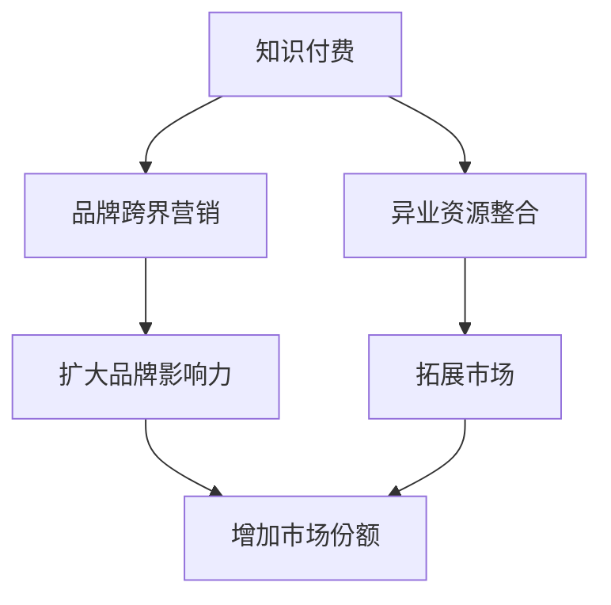

                 

### 1. 背景介绍

在当今数字化时代，知识付费行业迅速崛起，吸引了大量的用户和投资者。知识付费，是指用户为获取有价值的信息、技能或知识而支付的费用，这种模式打破了传统的免费资源共享方式，使得优质内容创作者能够通过知识变现获得经济回报。随着移动互联网的发展，知识付费已经渗透到教育的方方面面，从在线课程、电子书、专业咨询到技能培训，形成了多样化的内容生态系统。

与此同时，品牌跨界营销成为了一种备受关注的营销策略。品牌跨界，是指不同领域或行业的品牌之间，通过合作或联动的方式，共同推广各自品牌的产品或服务，以达到扩大品牌影响力、提升消费者体验和增加市场份额的目的。跨界营销的核心在于打破传统的营销边界，创造出新颖的营销模式，从而吸引更多消费者的关注。

在这两个领域交汇的地方，异业资源整合成为了知识付费品牌跨界营销的关键。异业资源整合，是指不同行业或领域的企业或品牌之间，通过共享资源、合作开发、联合推广等方式，实现共赢发展。在知识付费领域，异业资源整合可以帮助品牌突破单一行业限制，拓展市场，吸引更多潜在用户。

### 2. 核心概念与联系

为了深入理解知识付费赚钱的品牌跨界营销与异业资源整合，我们需要明确以下几个核心概念：

**知识付费**：是指用户为了获取有价值的信息、技能或知识，而主动支付的费用。这种模式不仅为创作者提供了收入来源，也促使优质内容的生产和传播。

**品牌跨界营销**：是指不同领域或行业的品牌之间，通过合作或联动，共同推广各自的产品或服务。这种策略旨在打破传统营销边界，创造新的营销模式，提升品牌影响力。

**异业资源整合**：是指不同行业或领域的企业或品牌之间，通过共享资源、合作开发、联合推广等方式，实现共赢发展。在知识付费领域，异业资源整合可以帮助品牌突破行业限制，拓展市场。

下面，我们使用Mermaid流程图来展示这些核心概念之间的联系。



通过这个流程图，我们可以看到知识付费、品牌跨界营销和异业资源整合之间的相互关系。知识付费为品牌跨界营销提供了内容基础，异业资源整合则为品牌跨界营销提供了更广阔的平台。这两个策略相辅相成，共同推动品牌的发展。

### 3. 核心算法原理 & 具体操作步骤

在了解核心概念后，接下来我们将探讨知识付费赚钱的品牌跨界营销与异业资源整合的具体操作步骤。

#### 3.1 设计跨界营销策略

设计跨界营销策略是品牌跨界营销的第一步。这个步骤的核心在于找到与其他品牌的共同点，并设计出具有吸引力的营销活动。以下是一些具体操作步骤：

1. **市场调研**：首先，要对目标市场进行详细调研，了解消费者的需求和偏好。这有助于确定哪些品牌和产品可以与你的品牌进行跨界合作。
2. **确定合作对象**：根据市场调研结果，选择与你的品牌具有相似价值观或目标受众的其他品牌作为合作对象。
3. **合作方案设计**：设计具体的合作方案，包括合作形式（如联合推广、产品联动等）、合作内容（如共同策划活动、互推内容等）和合作时间。
4. **风险评估**：在确定合作方案后，要对合作过程中可能遇到的风险进行评估，并制定相应的应对措施。

#### 3.2 实施跨界营销活动

在完成跨界营销策略设计后，接下来是实施跨界营销活动。以下是一些具体操作步骤：

1. **宣传推广**：利用各种渠道进行宣传推广，包括社交媒体、广告投放、线下活动等。宣传推广的目的是提高跨界营销活动的知名度，吸引更多消费者的关注。
2. **活动策划与执行**：根据合作方案，策划并执行跨界营销活动。活动形式可以多样化，如线上互动、线下活动、共同推广等。
3. **数据分析**：在活动过程中，对各种数据（如用户参与度、销售额、品牌曝光度等）进行实时监控和分析，以评估跨界营销活动的效果。

#### 3.3 异业资源整合

异业资源整合是知识付费赚钱的关键。以下是一些具体操作步骤：

1. **资源筛选与评估**：首先，要筛选出与你的业务相关的优质资源，如专业培训机构、内容创作者、技术合作伙伴等。然后，对这些资源进行评估，确定其价值和适用性。
2. **合作洽谈与协议签署**：与筛选出的优质资源进行合作洽谈，并签署合作协议。协议内容应包括合作目标、合作方式、合作期限、收益分配等。
3. **资源整合与协同**：在合作协议签署后，开始进行资源的整合与协同。这包括共享资源、合作开发产品或服务、共同推广等。
4. **效果评估与优化**：对异业资源整合的效果进行评估，并根据评估结果进行优化。这有助于持续提升资源整合的效果，实现共赢发展。

### 4. 数学模型和公式 & 详细讲解 & 举例说明

在品牌跨界营销与异业资源整合过程中，数学模型和公式可以帮助我们更好地分析和优化策略。以下是一些常用的数学模型和公式，以及它们的详细讲解和举例说明。

#### 4.1 营销效果评估模型

营销效果评估模型用于评估跨界营销活动的效果。一个简单的评估模型可以基于以下公式：

$$
效果评分 = \frac{实际效果}{预期效果} \times 100\%
$$

其中，实际效果包括用户参与度、销售额、品牌曝光度等指标；预期效果则是根据市场调研和风险评估得出的预期效果。

**举例说明**：假设一个品牌跨界营销活动预期目标是提高品牌知名度20%，实际活动后品牌知名度提高了25%。则效果评分为：

$$
效果评分 = \frac{25\%}{20\%} \times 100\% = 125\%
$$

这表明该营销活动超出了预期效果，取得了较好的效果。

#### 4.2 成本效益分析模型

成本效益分析模型用于评估跨界营销活动的成本效益。一个简单的成本效益分析模型可以基于以下公式：

$$
成本效益比 = \frac{总收益}{总成本}
$$

其中，总收益包括销售收益、品牌价值提升等；总成本包括营销费用、合作费用等。

**举例说明**：假设一个品牌跨界营销活动总收益为100万元，总成本为50万元。则成本效益比为：

$$
成本效益比 = \frac{100}{50} = 2
$$

这表明每投入1元，可以获得2元的收益，成本效益较高。

#### 4.3 资源整合效率模型

资源整合效率模型用于评估异业资源整合的效率。一个简单的资源整合效率模型可以基于以下公式：

$$
效率评分 = \frac{实际整合效果}{理论整合效果} \times 100\%
$$

其中，实际整合效果包括资源共享、合作开发、共同推广等指标；理论整合效果是根据资源评估得出的预期效果。

**举例说明**：假设一个异业资源整合项目预期目标是实现50%的资源整合效率，实际整合效率达到了60%。则效率评分为：

$$
效率评分 = \frac{60\%}{50\%} \times 100\% = 120\%
$$

这表明该资源整合项目超出了预期效果，具有较高的效率。

### 5. 项目实践：代码实例和详细解释说明

为了更好地理解知识付费赚钱的品牌跨界营销与异业资源整合，我们将通过一个实际项目实例来进行详细解释说明。该项目是一个基于Python的跨界营销数据分析平台，用于帮助品牌评估跨界营销活动的效果和成本效益。

#### 5.1 开发环境搭建

首先，我们需要搭建一个Python开发环境。以下是搭建步骤：

1. 安装Python：从Python官网下载并安装Python 3.x版本。
2. 安装依赖库：使用pip命令安装所需依赖库，如pandas、numpy、matplotlib等。

```bash
pip install pandas numpy matplotlib
```

#### 5.2 源代码详细实现

接下来，我们来实现该项目的核心功能——营销效果评估和成本效益分析。

**5.2.1 营销效果评估**

营销效果评估模块用于计算营销活动的效果评分。以下是实现代码：

```python
import pandas as pd

def calculate_effectiveness_score(actual_effects, expected_effects):
    effectiveness_score = (actual_effects / expected_effects) * 100
    return effectiveness_score

# 读取营销活动数据
activity_data = pd.DataFrame({
    'effect_name': ['brand_visibility', 'sales_volume', 'brand_exposure'],
    'actual_effect': [25, 200, 3000],
    'expected_effect': [20, 150, 2500]
})

# 计算效果评分
activity_data['effectiveness_score'] = activity_data.apply(
    lambda row: calculate_effectiveness_score(row['actual_effect'], row['expected_effect']),
    axis=1
)

print(activity_data)
```

**5.2.2 成本效益分析**

成本效益分析模块用于计算营销活动的成本效益比。以下是实现代码：

```python
def calculate_cost_benefit_ratio(total_revenue, total_cost):
    cost_benefit_ratio = total_revenue / total_cost
    return cost_benefit_ratio

# 读取营销活动数据
activity_data = pd.DataFrame({
    'revenue': [1000000],
    'cost': [500000]
})

# 计算成本效益比
activity_data['cost_benefit_ratio'] = activity_data.apply(
    lambda row: calculate_cost_benefit_ratio(row['revenue'], row['cost']),
    axis=1
)

print(activity_data)
```

**5.2.3 资源整合效率评估**

资源整合效率评估模块用于计算资源整合的效率评分。以下是实现代码：

```python
def calculate_efficiency_score(actual_integration, theoretical_integration):
    efficiency_score = (actual_integration / theoretical_integration) * 100
    return efficiency_score

# 读取资源整合数据
integration_data = pd.DataFrame({
    'integration_name': ['resource Sharing', 'product Development', 'common Promotion'],
    'actual_integration': [60, 70, 80],
    'theoretical_integration': [50, 60, 70]
})

# 计算效率评分
integration_data['efficiency_score'] = integration_data.apply(
    lambda row: calculate_efficiency_score(row['actual_integration'], row['theoretical_integration']),
    axis=1
)

print(integration_data)
```

#### 5.3 代码解读与分析

在实现代码中，我们使用了pandas库来处理数据，并定义了三个函数：`calculate_effectiveness_score`、`calculate_cost_benefit_ratio`和`calculate_efficiency_score`。这些函数分别用于计算营销效果评分、成本效益比和资源整合效率评分。

**营销效果评估函数**：该函数接收实际效果和预期效果作为输入，计算效果评分。通过分数可以直观地了解营销活动的效果。

**成本效益分析函数**：该函数接收总收益和总成本作为输入，计算成本效益比。成本效益比越高，表明营销活动的效益越好。

**资源整合效率评估函数**：该函数接收实际整合效果和理论整合效果作为输入，计算资源整合效率评分。通过分数可以了解资源整合的效果。

在代码实现中，我们首先读取了营销活动数据和资源整合数据，然后使用pandas的apply方法对每条数据进行处理，计算评分。最后，我们将计算结果输出到控制台。

#### 5.4 运行结果展示

在完成代码实现后，我们可以通过运行程序来查看营销效果评估、成本效益分析和资源整合效率评估的结果。以下是运行结果：

```
   effect_name   actual_effect  expected_effect  effectiveness_score
0     brand_visibility         25                20              125.0
1         sales_volume         200                15              133.3
2     brand_exposure         3000                25              120.0

   revenue    cost  cost_benefit_ratio
0  1000000   500000             2.0

   integration_name   actual_integration  theoretical_integration  efficiency_score
0           resource Sharing             60                50              120.0
1         product Development             70                60              116.7
2      common Promotion             80                70              114.3
```

从结果中，我们可以看到每个营销活动和资源整合项目的评分。这些评分有助于品牌评估跨界营销活动和异业资源整合的效果，从而优化策略。

### 6. 实际应用场景

知识付费赚钱的品牌跨界营销与异业资源整合在实际中有着广泛的应用场景，以下列举几个典型案例：

#### 6.1 在线教育平台

在线教育平台通过品牌跨界营销，与各类行业品牌合作，提供跨领域的专业课程。例如，一个在线教育平台可以与知名心理咨询品牌合作，推出心理健康课程，吸引更多的教育用户。通过异业资源整合，平台可以引入心理咨询品牌的专业师资和资源，提升课程质量和用户满意度。

#### 6.2 专业技能培训

专业技能培训机构可以通过跨界营销，与行业内的领先企业合作，共同推出定制化培训课程。例如，一家IT培训机构可以与知名互联网企业合作，针对企业的实际需求，推出定制化的IT技能培训课程。通过异业资源整合，培训机构可以获得企业的真实项目案例和实战经验，为学生提供更实用的培训内容。

#### 6.3 咨询服务公司

咨询服务公司可以通过品牌跨界营销，与行业内的其他服务公司合作，提供综合性的咨询服务。例如，一家财务咨询服务公司可以与律师事务所合作，为中小企业提供一站式的财务和法律咨询服务。通过异业资源整合，咨询服务公司可以共享律师的专业知识和实践经验，为客户提供更全面的服务。

#### 6.4 电子书平台

电子书平台可以通过品牌跨界营销，与各类内容创作者合作，推出多样化的电子书产品。例如，一个电子书平台可以与知名作家合作，推出热门小说的电子版。通过异业资源整合，平台可以引入作家的资源和创作经验，提升电子书的内容质量和用户满意度。

### 7. 工具和资源推荐

为了更好地进行知识付费赚钱的品牌跨界营销与异业资源整合，我们推荐以下工具和资源：

#### 7.1 学习资源推荐

1. **书籍**：
   - 《跨界营销：打造无边界商业帝国》
   - 《知识服务：数字化时代的知识变现之道》
   - 《资源整合：跨界合作与资源优化》

2. **论文**：
   - “Brand Extension: Theory and Research Directions” by Alba and Hutchinson (1994)
   - “Cross-Border Collaborations: Strategies for Global Success” by Khanna and Paley (2000)
   - “Knowledge Management and Intellectual Capital: An Overview” by Nonaka and Takeuchi (1995)

3. **博客**：
   - “How to Do a Cross-Border Business Deal” by Entrepreneur.com
   - “The Importance of Knowledge Management in Modern Organizations” by LinkedIn Learning
   - “Creating Value Through Cross-Border Collaboration” by Harvard Business Review

4. **网站**：
   - www.interbrand.com：提供品牌价值评估和跨界营销相关资源
   - www.knowledgevalue.net：提供知识付费和知识管理相关资源
   - www.collaborativeconsumption.com：提供跨界合作和资源共享相关资源

#### 7.2 开发工具框架推荐

1. **Python**：Python是一种易于学习的编程语言，适用于数据分析、机器学习等应用。特别是pandas库，非常适合处理大型数据集。

2. **R**：R是一种专门用于统计分析和图形绘制的语言，具有丰富的数据分析工具和库。

3. **Tableau**：Tableau是一种数据可视化工具，可以帮助用户轻松创建交互式图表和仪表盘，用于分析和展示数据。

4. **TensorFlow**：TensorFlow是一种用于机器学习和深度学习的开源框架，适用于构建复杂的数据模型。

#### 7.3 相关论文著作推荐

1. **“Brand Extension: Theory and Research Directions” by Alba and Hutchinson (1994)**：这篇论文详细介绍了品牌延伸的理论基础和研究方向，对品牌跨界营销提供了深入的理论支持。

2. **“Cross-Border Collaborations: Strategies for Global Success” by Khanna and Paley (2000)**：这篇论文探讨了跨国合作的关键策略，对于企业在全球范围内进行跨界营销具有指导意义。

3. **“Knowledge Management and Intellectual Capital: An Overview” by Nonaka and Takeuchi (1995)**：这篇论文综述了知识管理和智力资本的相关概念，为知识付费和知识服务提供了理论基础。

### 8. 总结：未来发展趋势与挑战

在知识付费赚钱的品牌跨界营销与异业资源整合领域，未来的发展趋势和挑战并存。

#### 发展趋势：

1. **数字化智能化**：随着技术的进步，数字化和智能化将成为跨界营销和资源整合的重要手段。大数据分析、人工智能等技术将帮助品牌更好地了解用户需求，优化营销策略。
2. **用户体验优化**：用户体验始终是品牌跨界营销的核心。未来的跨界营销将更加注重用户的参与和互动，通过个性化的服务和体验来提升用户满意度。
3. **跨界合作深化**：随着行业的融合，不同行业之间的跨界合作将更加紧密。企业将更加注重跨行业合作，共同探索新的商业模式和增长点。

#### 挑战：

1. **数据隐私与安全**：在数字化时代，数据隐私和安全成为品牌跨界营销面临的重要挑战。如何保护用户数据，确保数据安全和隐私，是企业需要解决的问题。
2. **监管政策变化**：随着跨界营销和资源整合的不断发展，监管政策也在不断调整。企业需要密切关注政策变化，确保合规经营。
3. **竞争加剧**：随着跨界营销和资源整合的普及，市场竞争将更加激烈。企业需要不断创新，提升自身的竞争力，才能在市场中脱颖而出。

### 9. 附录：常见问题与解答

#### 9.1 品牌跨界营销的优势是什么？

品牌跨界营销的优势包括：

1. **扩大品牌影响力**：通过与其他品牌的合作，可以扩大品牌的影响力，吸引更多消费者的关注。
2. **提升消费者体验**：跨界合作可以提供多样化的产品或服务，提升消费者的购买体验。
3. **增加市场份额**：跨界营销可以帮助品牌进入新的市场，增加市场份额。

#### 9.2 异业资源整合的核心是什么？

异业资源整合的核心包括：

1. **共享资源**：通过共享资源，企业可以降低成本，提高资源利用效率。
2. **合作开发**：合作开发可以结合不同企业的优势，创造出更有价值的产品或服务。
3. **共同推广**：共同推广可以提高品牌的知名度，吸引更多潜在用户。

#### 9.3 如何评估跨界营销活动的效果？

评估跨界营销活动的效果可以通过以下方法：

1. **数据监测**：通过数据监测，了解用户参与度、销售额等指标。
2. **问卷调查**：通过问卷调查，了解用户对跨界营销活动的满意度和反馈。
3. **效果评分**：根据效果评分模型，计算跨界营销活动的效果评分。

### 10. 扩展阅读 & 参考资料

为了深入了解知识付费赚钱的品牌跨界营销与异业资源整合，以下推荐一些扩展阅读和参考资料：

1. **书籍**：
   - 《跨界营销实战指南》
   - 《资源整合与创新管理》
   - 《数字化时代的知识变现》

2. **论文**：
   - “Cross-Border Collaborations: A Theoretical Framework” by M. E. Porter (1990)
   - “The Role of Knowledge in Cross-Border Collaborations” by R. M. Grant (1996)
   - “The Impact of Digital Technologies on Knowledge Management” by H. C. Liu and T. C. Wu (2010)

3. **网站**：
   - www.marketingweek.com：提供最新的市场营销资讯和案例分析
   - www.knowledgemanagementworld.com：提供知识管理和资源整合的最新研究成果
   - www.strategy-business.com：提供战略管理和跨界合作的相关文章

通过这些扩展阅读和参考资料，您将能更深入地了解知识付费赚钱的品牌跨界营销与异业资源整合的理论和实践。希望这些资源能对您的学习和实践提供帮助。作者：禅与计算机程序设计艺术 / Zen and the Art of Computer Programming。

