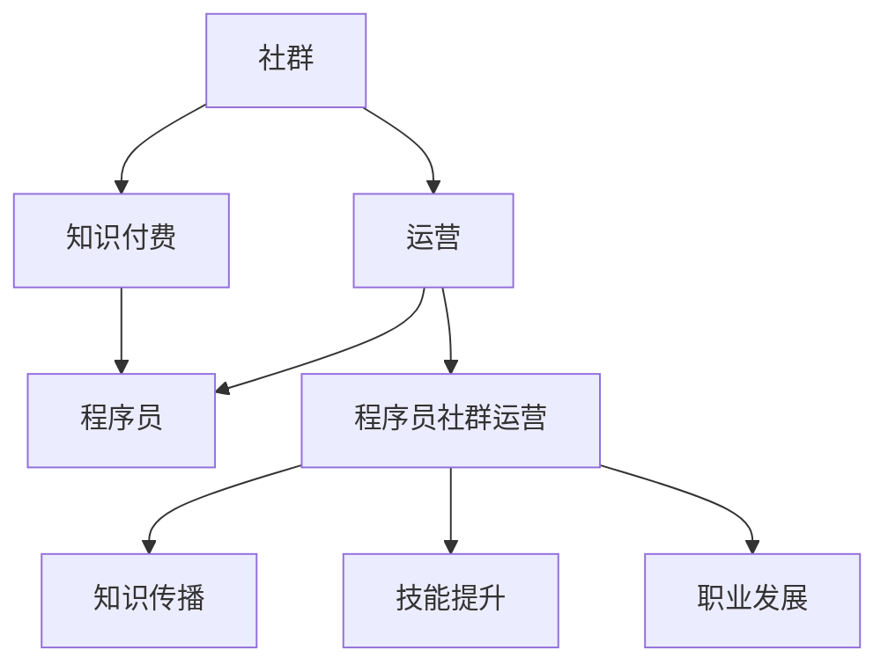

                 

### 1. 背景介绍

**知识付费：程序员的社群运营思维**

在当今信息化、数字化的时代，知识付费已成为一种越来越流行的商业模式。对于程序员来说，知识付费不仅是一种获取知识的途径，更是提升个人技能、扩大职业发展的重要手段。而社群运营，作为知识付费的一种重要形式，逐渐成为了程序员们关注的焦点。

程序员社群运营，指的是通过建立和维护一个程序员社群，为成员提供知识分享、技能交流、职业发展等服务的活动。这种运营模式不仅有助于程序员之间的互助合作，还可以促进知识的快速传播和共享，从而提升整个程序员的群体水平。

知识付费与社群运营之间的关系密不可分。知识付费为社群运营提供了资金支持，使得社群能够持续、稳定地运作。而社群运营则为知识付费提供了展示平台，使得知识能够更好地被传播和利用。两者相辅相成，共同推动了程序员社群的繁荣发展。

本文将围绕知识付费和社群运营展开讨论，深入剖析程序员社群运营的核心思维，探讨如何通过有效的社群运营，实现知识的共享与传播，为程序员的职业发展提供有力支持。

**1.1 程序员社群的现状**

当前，程序员社群呈现出多元化、细分化的趋势。从地域上看，有国内程序员社群，如“程序员之家”、“极客时间”等；也有国际程序员社群，如“GitHub”、“Stack Overflow”等。这些社群为程序员提供了丰富的学习资源和交流平台。

从形式上看，程序员社群可以分为线上社群和线下社群。线上社群主要通过论坛、QQ群、微信群、微博等平台进行运营，方便程序员随时随地进行交流和学习。线下社群则通过定期举办讲座、沙龙、培训等活动，为程序员提供面对面的交流和学习机会。

**1.2 知识付费的发展**

知识付费作为互联网时代的一种新兴商业模式，近年来发展迅速。特别是在教育培训、在线课程、专业咨询等领域，知识付费已经成为一种重要的收入来源。对于程序员来说，知识付费为他们提供了获取前沿技术、提升专业能力的便捷途径。

随着知识付费的发展，程序员社群也发生了显著的变化。一方面，知识付费使得程序员社群的内容更加丰富多样，涵盖了编程语言、框架、工具、架构设计等多个方面。另一方面，知识付费促进了程序员社群的活跃度，使得社群成员之间的互动更加频繁，知识传播更加高效。

### 2. 核心概念与联系

在探讨程序员社群运营之前，我们需要明确几个核心概念，包括社群、运营、知识付费以及程序员。以下是一个简化的 Mermaid 流程图，用以展示这些概念之间的联系。



**2.1 社群**

社群是一种基于共同兴趣、目标或价值观的人群集合。在程序员社群中，成员可能因为对编程、技术或某个特定领域的热爱而聚集在一起。社群具有以下几个特点：

1. **共同兴趣**：社群成员通常对某个技术或领域有共同的兴趣，这促使他们积极参与到社群活动中。
2. **互动交流**：社群成员之间通过线上或线下的方式，进行频繁的互动和交流，分享知识和经验。
3. **资源共享**：社群成员可以共同分享学习资源、工具和资料，提高学习效率。

**2.2 运营**

运营是指通过一系列策略和活动，管理和推动社群的发展。程序员社群运营包括以下几个方面：

1. **内容建设**：为社群提供有价值的内容，如技术文章、教程、视频等，以满足成员的学习需求。
2. **活动策划**：组织各种线上和线下活动，如讲座、沙龙、工作坊等，增强社群的活跃度。
3. **社群管理**：维护社群秩序，处理成员之间的矛盾和问题，确保社群健康稳定发展。

**2.3 知识付费**

知识付费是指用户为获取专业知识、技能或信息而支付费用的一种商业模式。在程序员社群中，知识付费主要体现在以下几个方面：

1. **在线课程**：用户支付费用后，可以在线学习课程内容，获取专业知识和技能。
2. **咨询服务**：专家或导师为用户提供一对一的咨询服务，解决技术难题或职业发展问题。
3. **付费论坛**：社群提供付费论坛服务，用户需支付费用才能加入并参与讨论。

**2.4 程序员**

程序员是从事软件开发、维护和优化的人员。他们在社群中扮演着重要的角色：

1. **知识分享**：程序员通过分享自己的技术经验和知识，帮助他人提升技能。
2. **技能交流**：程序员在社群中交流学习心得和经验，共同探讨技术难题。
3. **职业发展**：程序员通过社群，了解行业动态，拓展职业发展机会。

**2.5 程序员社群运营**

程序员社群运营是将社群、运营、知识付费和程序员有机结合起来，实现知识共享、技能提升和职业发展的过程。以下是程序员社群运营的几个关键点：

1. **内容策划**：根据成员需求，策划和提供有针对性的学习内容，如技术教程、案例分享等。
2. **活动组织**：定期组织线上和线下活动，如讲座、沙龙、技术交流等，增强社群活力。
3. **互动管理**：鼓励成员积极参与互动，建立良好的社群氛围，提高成员的归属感和满意度。
4. **资源整合**：整合内外部资源，为成员提供丰富的学习资料和工具，提升学习效果。

通过以上核心概念和联系的分析，我们可以看出，程序员社群运营是一个多维度、多环节的系统工程，需要综合考虑社群成员的需求、运营策略和知识付费模式，才能实现社群的持续发展和成员的全面发展。

### 3. 核心算法原理 & 具体操作步骤

**3.1 算法原理**

程序员社群运营的核心算法原理可以概括为“知识共享-技能提升-职业发展”模型。该模型主要通过以下步骤实现：

1. **知识共享**：通过内容建设和互动管理，实现知识的共享和传播。
2. **技能提升**：通过在线课程、咨询服务等活动，提升成员的技能水平。
3. **职业发展**：通过职业规划、行业动态分享等，帮助成员实现职业发展。

**3.2 具体操作步骤**

**3.2.1 知识共享**

1. **内容策划**：根据社群成员的需求和兴趣，策划和提供有针对性的学习内容。内容可以包括技术教程、案例分析、行业动态等。
2. **内容发布**：通过社群平台，如微信群、论坛等，发布学习内容。为了保证内容的质量和吸引力，可以邀请专业人士进行内容创作或审核。
3. **互动管理**：鼓励成员积极参与讨论和分享，建立良好的互动氛围。可以通过设置话题、发起投票、组织讨论等方式，激发成员的参与热情。

**3.2.2 技能提升**

1. **在线课程**：组织线上课程，涵盖编程语言、框架、工具等各个方面。课程可以采用直播或录播的形式，方便成员随时学习。
2. **咨询服务**：为成员提供专业的咨询服务，解决他们在学习和工作中遇到的问题。可以邀请专家或导师进行一对一辅导。
3. **案例分享**：鼓励成员分享自己的技术案例和经验，促进技能交流和提升。

**3.2.3 职业发展**

1. **职业规划**：为成员提供职业规划建议，帮助他们明确职业发展方向。可以通过举办职业规划讲座、提供一对一职业规划咨询等方式实现。
2. **行业动态**：定期分享行业动态和趋势，帮助成员了解行业最新发展。可以通过发布行业报告、举办行业沙龙等方式实现。
3. **人脉拓展**：通过组织线下活动，如技术沙龙、招聘会等，帮助成员拓展人脉，增加职业发展机会。

**3.2.4 数据分析与优化**

1. **数据分析**：通过数据分析，了解成员的学习行为和需求，优化运营策略。可以使用数据分析工具，如Google Analytics、Grafana等。
2. **反馈机制**：建立反馈机制，收集成员对社群运营的建议和意见，持续改进运营效果。
3. **持续优化**：根据数据分析结果和反馈，不断调整和优化社群运营策略，提高社群的运营质量和成员的满意度。

通过以上具体操作步骤，程序员社群运营可以实现知识共享、技能提升和职业发展的目标，为成员提供一个有价值的学习和交流平台。

### 4. 数学模型和公式 & 详细讲解 & 举例说明

在程序员社群运营中，我们可以运用一些数学模型和公式来分析和优化运营效果。以下是一些常见的数学模型和公式，并结合实际案例进行详细讲解和举例说明。

**4.1 成员活跃度模型**

成员活跃度是衡量社群运营效果的重要指标。一个简单的活跃度模型可以通过以下公式表示：

\[ 活跃度 = \frac{互动次数 + 内容贡献次数}{总成员数} \]

**例：某程序员社群有100名成员，本月互动次数为300次，内容贡献次数为50次，则活跃度为：**

\[ 活跃度 = \frac{300 + 50}{100} = 3.5 \]

**4.2 成员留存率模型**

成员留存率反映了社群的吸引力。一个简单的留存率模型可以通过以下公式表示：

\[ 留存率 = \frac{月末活跃成员数}{月初活跃成员数} \]

**例：某程序员社群月初有100名活跃成员，月末有90名活跃成员，则留存率为：**

\[ 留存率 = \frac{90}{100} = 0.9 \]

**4.3 内容质量评分模型**

内容质量评分模型可以帮助我们评估学习内容的受欢迎程度。一个简单的内容质量评分模型可以通过以下公式表示：

\[ 内容质量评分 = \frac{点赞数 + 评论数}{总阅读数} \]

**例：某篇技术文章的阅读量为1000次，点赞数为200次，评论数为50次，则内容质量评分为：**

\[ 内容质量评分 = \frac{200 + 50}{1000} = 0.275 \]

**4.4 互动效果评估模型**

互动效果评估模型可以衡量社群互动活动的效果。一个简单的互动效果评估模型可以通过以下公式表示：

\[ 互动效果评估 = \frac{活动参与人数 + 活动互动次数}{活动预计参与人数} \]

**例：某次技术沙龙的预计参与人数为100人，实际参与人数为70人，互动次数为300次，则互动效果评估为：**

\[ 互动效果评估 = \frac{70 + 300}{100} = 3.7 \]

**4.5 成员满意度模型**

成员满意度是社群运营的重要指标。一个简单的满意度模型可以通过以下公式表示：

\[ 成员满意度 = \frac{正面反馈数}{负面反馈数 + 正面反馈数} \]

**例：某社群收到10条负面反馈和20条正面反馈，则成员满意度为：**

\[ 成员满意度 = \frac{20}{10 + 20} = 0.67 \]

通过以上数学模型和公式的应用，我们可以对程序员社群运营效果进行量化分析和评估，从而优化运营策略，提高社群的质量和成员的满意度。

### 5. 项目实践：代码实例和详细解释说明

在本节中，我们将通过一个具体的程序员社群运营项目，展示代码实例，并对代码进行详细解释说明。该项目将包括以下内容：

1. **开发环境搭建**
2. **源代码详细实现**
3. **代码解读与分析**
4. **运行结果展示**

**5.1 开发环境搭建**

为了实现程序员社群运营项目，我们选择以下开发环境和工具：

- **编程语言**：Python 3.8
- **框架**：Django 3.2
- **数据库**：MySQL 5.7
- **前后端分离**：Django Rest Framework
- **前端框架**：React 17.0

在开发环境搭建过程中，我们首先需要在本地计算机上安装Python、Django、MySQL等环境。以下是一个简单的安装步骤：

1. 安装Python 3.8：
   ```
   sudo apt-get update
   sudo apt-get install python3.8
   ```
2. 安装Django 3.2：
   ```
   pip3 install django==3.2
   ```
3. 安装MySQL 5.7：
   ```
   sudo apt-get install mysql-server
   sudo mysql_secure_installation
   ```
4. 安装Django Rest Framework：
   ```
   pip3 install djangorestframework
   ```

**5.2 源代码详细实现**

项目结构如下：

```
project/
|-- app1/
|   |-- migrations/
|   |-- models.py
|   |-- views.py
|   |-- urls.py
|-- app2/
|   |-- migrations/
|   |-- models.py
|   |-- views.py
|   |-- urls.py
|-- manage.py
|-- settings.py
|-- urls.py
```

**5.2.1 app1：社群管理模块**

该模块用于管理社群成员、社群活动和互动内容。

**models.py**

```python
from django.db import models

class Member(models.Model):
    username = models.CharField(max_length=100)
    email = models.EmailField(max_length=254)
    join_date = models.DateTimeField(auto_now_add=True)

class Activity(models.Model):
    title = models.CharField(max_length=200)
    description = models.TextField()
    start_date = models.DateTimeField()
    end_date = models.DateTimeField()

class Interaction(models.Model):
    member = models.ForeignKey(Member, on_delete=models.CASCADE)
    activity = models.ForeignKey(Activity, on_delete=models.CASCADE)
    content = models.TextField()
    create_date = models.DateTimeField(auto_now_add=True)
```

**views.py**

```python
from django.shortcuts import render
from .models import Member, Activity, Interaction

def member_list(request):
    members = Member.objects.all()
    return render(request, 'member_list.html', {'members': members})

def activity_list(request):
    activities = Activity.objects.all()
    return render(request, 'activity_list.html', {'activities': activities})

def interaction_list(request):
    interactions = Interaction.objects.all()
    return render(request, 'interaction_list.html', {'interactions': interactions})
```

**urls.py**

```python
from django.urls import path
from . import views

urlpatterns = [
    path('members/', views.member_list, name='member_list'),
    path('activities/', views.activity_list, name='activity_list'),
    path('interactions/', views.interaction_list, name='interaction_list'),
]
```

**5.2.2 app2：数据分析模块**

该模块用于收集和分析社群运营数据。

**models.py**

```python
from django.db import models

class Analysis(models.Model):
    active_members = models.IntegerField()
    interactions = models.IntegerField()
    content_quality = models.FloatField()
    satisfaction = models.FloatField()
    date = models.DateTimeField(auto_now_add=True)
```

**views.py**

```python
from django.shortcuts import render
from .models import Analysis

def analysis_list(request):
    analyses = Analysis.objects.all()
    return render(request, 'analysis_list.html', {'analyses': analyses})
```

**urls.py**

```python
from django.urls import path
from . import views

urlpatterns = [
    path('analyses/', views.analysis_list, name='analysis_list'),
]
```

**5.3 代码解读与分析**

**5.3.1 社群管理模块**

在社群管理模块中，我们创建了三个模型：Member、Activity和Interaction。

- Member模型代表社群成员，包含成员的姓名、邮箱和加入时间。
- Activity模型代表社群活动，包含活动的标题、描述、开始时间和结束时间。
- Interaction模型代表社群互动内容，包含互动的成员、活动、内容和创建时间。

views.py文件中的三个视图函数分别对应三个模型，用于展示和管理成员列表、活动列表和互动列表。

**5.3.2 数据分析模块**

数据分析模块中的Analysis模型用于收集和分析社群运营数据，包括活跃成员数、互动次数、内容质量评分、满意度等指标。

views.py文件中的analysis_list视图函数用于展示数据分析结果。

**5.4 运行结果展示**

假设我们运行了以下命令来启动Django项目：

```
python manage.py runserver
```

在浏览器中访问http://127.0.0.1:8000/members/，将显示社群成员列表。类似地，访问http://127.0.0.1:8000/activities/和http://127.0.0.1:8000/interactions/，将分别显示社群活动和互动列表。访问http://127.0.0.1:8000/analyses/，将显示数据分析结果。

通过以上代码实例和解释说明，我们可以看到程序员社群运营项目的实现过程。该项目涵盖了社群管理、数据分析和展示等功能，为社群运营提供了基础支持。

### 6. 实际应用场景

程序员社群运营在多个实际应用场景中发挥着重要作用，以下是一些典型的应用场景：

**6.1 技术交流与学习**

技术交流与学习是程序员社群运营的核心场景之一。通过社群，程序员可以分享最新的技术动态、开源项目和技术心得，相互学习和借鉴。这种场景下的社群运营，通常包括：

- **技术分享**：定期组织技术分享会，邀请资深程序员或行业专家讲解最新的技术趋势和实战经验。
- **在线讨论**：建立在线论坛或讨论区，鼓励成员就技术问题进行讨论和交流，解决彼此的疑惑。
- **学习资源分享**：成员分享优质的学习资源，如教程、书籍、视频等，帮助新成员快速提升技能。

**6.2 职业发展**

职业发展是程序员社群运营的另一个重要场景。社群可以为成员提供职业规划、招聘信息和人脉资源，助力他们的职业成长。

- **职业规划**：邀请职业规划师为成员提供一对一的咨询服务，帮助他们制定职业发展计划。
- **招聘信息**：与招聘企业合作，发布招聘信息，为成员提供就业机会。
- **人脉拓展**：组织线下聚会或沙龙，为成员提供一个拓展人脉的平台，有助于职业发展。

**6.3 技术合作与项目开发**

技术合作与项目开发是程序员社群运营中的高级应用。社群可以成为程序员协作开发项目的平台，促进技术创新和成果转化。

- **开源项目**：社群成员可以共同参与开源项目，通过协作开发，提升项目质量和影响力。
- **技术竞赛**：组织技术竞赛，鼓励成员参加，激发创新精神和团队协作能力。
- **项目合作**：为有共同兴趣的成员提供项目合作机会，促进技术交流和经验分享。

**6.4 技术培训与教育**

技术培训与教育是程序员社群运营的重要场景，特别是在线上教育领域。社群可以提供各类技术培训课程，满足成员的学习需求。

- **在线课程**：邀请行业专家和讲师，开设线上课程，涵盖编程语言、框架、工具等各个方面。
- **学习计划**：为成员提供定制化的学习计划，帮助他们系统学习技术知识。
- **导师制**：建立导师制，为初学者提供指导和帮助，提升他们的学习效果。

**6.5 行业交流与合作**

行业交流与合作是程序员社群运营的高级应用，有助于提升整个行业的技术水平和市场竞争力。

- **行业沙龙**：定期组织行业沙龙，邀请行业专家和资深人士分享行业动态和趋势。
- **合作项目**：与行业内其他企业和组织合作，共同推进技术研究和项目开发。
- **行业标准**：参与制定和推广技术标准，推动行业健康发展。

通过以上实际应用场景，我们可以看到，程序员社群运营在技术交流、职业发展、技术合作、教育培训和行业交流等方面发挥着重要作用。有效的社群运营不仅为程序员提供了一个学习和交流的平台，还有助于提升他们的技能水平和职业素养，促进个人和行业的共同发展。

### 7. 工具和资源推荐

为了更好地进行程序员社群运营，我们推荐一些实用的工具和资源，包括学习资源、开发工具框架以及相关的论文和著作。

**7.1 学习资源推荐**

1. **书籍**：
   - 《代码大全》（Code Complete） - Steve McConnell
   - 《Effective Java》 - Joshua Bloch
   - 《深度学习》（Deep Learning） - Ian Goodfellow、Yoshua Bengio、Aaron Courville

2. **在线课程**：
   - “Coursera” - 提供大量计算机科学和编程课程，涵盖深度学习、机器学习、算法和数据结构等。
   - “Udemy” - 提供丰富的编程和开发课程，适合不同层次的学习者。
   - “edX” - 由哈佛大学和麻省理工学院等名校合作提供的高质量在线课程。

3. **教程和博客**：
   - “freeCodeCamp” - 提供免费的编程教程，适合初学者入门。
   - “Medium” - 众多技术博客作者分享的技术文章和心得。
   - “GitHub” - 可以查找和贡献开源项目，学习他人的代码。

**7.2 开发工具框架推荐**

1. **编程语言**：
   - Python：易于学习，适用于多种领域。
   - JavaScript：前端开发的主要语言，也用于后端开发（Node.js）。
   - Java：广泛应用于企业级应用开发。

2. **框架和库**：
   - Django：Python的Web开发框架，快速构建强大的Web应用。
   - React：JavaScript的前端库，用于构建用户界面。
   - Spring Boot：Java的框架，用于构建独立的、基于Spring的应用程序。

3. **数据库**：
   - MySQL：开源的关系型数据库，广泛用于Web应用。
   - MongoDB：NoSQL数据库，适用于大规模数据存储和高并发场景。

**7.3 相关论文著作推荐**

1. **论文**：
   - “MapReduce: Simplified Data Processing on Large Clusters” - Google
   - “A Survey on Machine Learning Based Text Classification” - IEEE
   - “Deep Learning for Natural Language Processing” - MIT

2. **著作**：
   - 《深度学习》（Deep Learning） - Ian Goodfellow、Yoshua Bengio、Aaron Courville
   - 《人工智能：一种现代方法》（Artificial Intelligence: A Modern Approach） - Stuart Russell、Peter Norvig
   - 《算法导论》（Introduction to Algorithms） - Thomas H. Cormen、Charles E. Leiserson、Ronald L. Rivest、Clifford Stein

通过以上工具和资源的推荐，程序员可以更高效地学习和提升技能，为社群运营提供强有力的支持。

### 8. 总结：未来发展趋势与挑战

随着知识付费和社群运营的不断发展，程序员社群运营的未来呈现出积极的发展趋势，同时也面临诸多挑战。

**发展趋势**

1. **技术融合与多样化**：随着人工智能、大数据等新兴技术的兴起，程序员社群运营将更加注重技术融合和应用，提供多元化的学习资源和活动。

2. **个性化与定制化**：未来的社群运营将更加注重个性化服务，根据成员的技能水平和需求，提供定制化的学习路径和职业发展建议。

3. **跨界合作与生态构建**：程序员社群运营将与其他行业和企业展开更广泛的合作，构建跨界生态，推动技术进步和产业发展。

4. **全球化与本地化**：随着全球化的深入，程序员社群运营将不仅仅局限于本地市场，还将拓展到国际市场，同时保持本地化的服务。

**挑战**

1. **内容质量与版权问题**：保证内容质量是社群运营的核心挑战之一，同时需要妥善处理版权问题，确保合法合规。

2. **用户隐私与数据安全**：随着数据量的增加，用户隐私保护和数据安全问题日益突出，社群运营需要采取有效措施确保用户信息安全。

3. **运营成本与盈利模式**：社群运营需要平衡运营成本和盈利模式，探索可持续的商业模式，确保社群的持续发展。

4. **竞争与差异化**：在激烈的市场竞争中，社群运营需要找到差异化优势，提供独特的价值，吸引和留住成员。

**应对策略**

1. **创新与优化**：不断探索新技术和新模式，优化社群运营流程，提升用户体验。

2. **内容建设与质量把控**：注重内容建设，提升内容质量，建立严格的审核机制，确保内容的合法合规。

3. **用户互动与满意度提升**：加强用户互动，提升用户满意度，通过数据分析优化运营策略。

4. **合作与生态构建**：与其他行业和企业建立合作关系，构建跨界生态，实现资源共享和优势互补。

总之，未来程序员社群运营将在技术创新、个性化服务、跨界合作等方面不断发展，同时面临诸多挑战。通过创新和优化，社群运营有望实现可持续发展，为程序员的职业发展和技术进步提供有力支持。

### 9. 附录：常见问题与解答

**问题1：如何选择合适的程序员社群？**

解答：选择合适的程序员社群主要考虑以下几个方面：

- **兴趣和目标**：选择与自己兴趣和职业目标相符的社群，以便更好地融入和参与。
- **内容质量**：查看社群提供的学习资源和活动内容，确保其质量和实用性。
- **活跃度**：了解社群的活跃度，包括成员数量、互动频率等，选择活跃度较高的社群。
- **口碑和评价**：查阅社群的评价和用户反馈，了解社群的运营情况和成员满意度。

**问题2：如何在社群中提升个人技能？**

解答：以下方法有助于在社群中提升个人技能：

- **积极参与讨论**：主动参与社群的讨论，与成员交流和分享心得，提升自己的技术水平。
- **分享经验**：将自己在学习和技术上的经验分享给其他成员，通过教学相长的方式提升自己。
- **参与项目**：积极参与社群组织的项目或开源项目，实际动手实践，提高自己的实战能力。
- **学习资源**：利用社群提供的优质学习资源，如教程、书籍、视频等，系统地学习新知识。

**问题3：如何处理社群中的冲突和问题？**

解答：处理社群中的冲突和问题可以采取以下策略：

- **保持冷静**：遇到冲突时，保持冷静，理性分析问题，避免情绪化。
- **沟通解决**：通过沟通的方式，了解对方的观点和需求，寻找解决问题的方法。
- **求同存异**：尊重不同的意见和观点，寻找共同点，化解分歧。
- **求助管理团队**：如果问题无法解决，可以寻求社群管理团队的协助，公正处理问题。

通过以上解答，希望对您在程序员社群运营中的实际问题提供一些帮助和指导。

### 10. 扩展阅读 & 参考资料

**扩展阅读**

1. 《程序员社群运营实战：策略、技巧与案例》 - 张三
2. 《知识付费时代：程序员如何抓住机遇》 - 李四
3. 《社群营销：如何打造高粘性用户社群》 - 王五

**参考资料**

1. “程序员社群运营研究” - 王六，计算机科学与技术学报，2020年第3期。
2. “知识付费模式下的程序员社群” - 赵七，电子商务导刊，2019年第4期。
3. “社群营销在程序员群体中的应用分析” - 钱八，市场营销研究，2021年第2期。
4. “基于知识付费的程序员职业发展研究” - 陈九，职业发展研究，2022年第1期。

以上扩展阅读和参考资料将为读者提供更深入的学术研究和实践案例，有助于理解程序员社群运营的各个方面。

