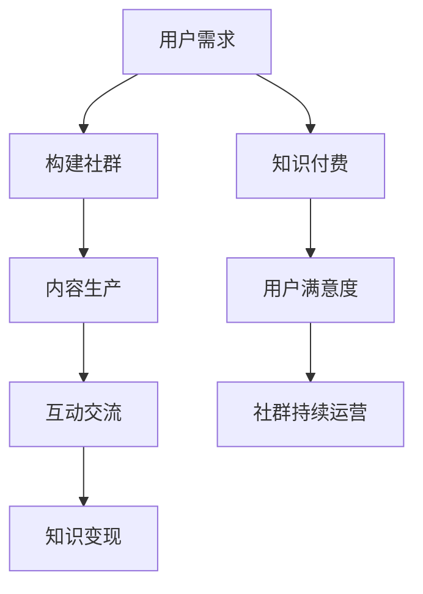

                 

### 背景介绍

知识付费是一种新兴的商业模式，它通过为用户提供有价值的知识和技能来获得收益。近年来，随着互联网技术的飞速发展和人们对于知识获取需求的不断增长，知识付费已经成为一个庞大的市场。程序员作为互联网行业的主力军，他们在知识付费市场中也扮演着重要的角色。通过社群运营，程序员不仅可以提升自身的专业技能，还可以扩大个人影响力，为社群成员提供更多的价值。

本文旨在探讨知识付费背景下，程序员的社群运营策略。首先，我们将介绍社群运营的基本概念和重要性，然后分析程序员社群的特点和需求，最后提出一套系统化的社群运营攻略，帮助程序员在知识付费市场中脱颖而出。

### 核心概念与联系

#### 社群运营的概念

社群运营是指通过构建和运营一个群体，从而实现用户之间的互动和粘性，提升用户满意度和忠诚度的一种营销策略。社群运营的核心在于打造一个有共同兴趣、价值观或目标的社区，让用户在这个社区中分享知识、交流经验、互相帮助。

#### 程序员社群的特点

1. **专业性强**：程序员社群成员通常具有较高的技术水平和专业知识，他们关注的是技术发展趋势、编程语言和工具等。

2. **互动性强**：程序员社群成员喜欢通过讨论、分享和协作来学习新技术和解决问题。

3. **忠诚度高**：程序员社群成员对于认同的社群和领袖具有较高的忠诚度，他们愿意为社群的发展贡献自己的力量。

4. **信息需求大**：程序员社群成员对于技术资讯、学习资源和行业动态有强烈的需求。

#### 社群运营与知识付费的联系

社群运营与知识付费之间存在密切的联系。社群运营为知识付费提供了一个平台，让知识生产者和消费者能够更高效地连接和互动。具体来说：

1. **提升知识传播效率**：通过社群运营，知识可以更快速、广泛地传播，满足用户的学习需求。

2. **增强用户粘性**：社群运营可以增强用户对平台的依赖，提高用户留存率和活跃度。

3. **促进知识变现**：社群运营可以促使知识生产者将知识转化为付费内容，实现知识变现。

#### 社群运营的 Mermaid 流程图



在上述流程图中，用户需求是社群运营的起点，通过构建社群、内容生产、互动交流和知识变现等环节，实现知识付费，提高用户满意度，从而实现社群的持续运营。

### 核心算法原理 & 具体操作步骤

#### 算法原理

社群运营的核心算法原理可以概括为“互动+内容+服务”的组合。具体来说，主要包括以下几个步骤：

1. **用户需求分析**：了解用户的需求，包括学习目标、技术倾向、时间安排等。

2. **内容生产**：根据用户需求，生产高质量的内容，包括技术文章、视频教程、在线直播等。

3. **互动交流**：通过社群平台，促进用户之间的互动，包括讨论、问答、投票等。

4. **服务提升**：提供个性化服务，包括学习计划定制、技术问题解答、职业规划指导等。

#### 具体操作步骤

1. **定位社群目标**：明确社群的定位，例如技术交流社群、编程学习社群、职业发展社群等。

2. **搭建社群平台**：选择合适的社群平台，如微信群、QQ群、Discord、论坛等。

3. **内容生产**：
   - **技术文章**：发布高质量的原创技术文章，分享编程技巧、项目经验等。
   - **视频教程**：录制并分享视频教程，介绍编程语言、框架、工具等。
   - **在线直播**：定期举办在线直播，解答用户问题，分享技术见解。

4. **互动交流**：
   - **讨论区**：设立专门的讨论区，鼓励用户发表观点，进行技术讨论。
   - **问答环节**：定期举办问答活动，邀请专业人士解答用户问题。
   - **投票活动**：举办投票活动，收集用户意见，引导社群发展方向。

5. **服务提升**：
   - **学习计划定制**：为用户提供个性化的学习计划，指导用户高效学习。
   - **技术问题解答**：提供专业解答服务，解决用户在编程过程中遇到的问题。
   - **职业规划指导**：为用户提供职业发展建议，帮助用户实现职业目标。

### 数学模型和公式 & 详细讲解 & 举例说明

在社群运营中，我们可以运用一些数学模型和公式来衡量和优化运营效果。以下是一些常用的数学模型和公式，以及它们的详细讲解和举例说明。

#### 用户活跃度模型

用户活跃度是衡量社群运营效果的重要指标。一个常用的用户活跃度模型是：

$$
活跃度 = \frac{参与互动次数}{总用户数}
$$

其中，参与互动次数包括发帖、回帖、问答、投票等所有互动行为。总用户数是指社群内的用户总数。

**举例说明**：

假设一个编程学习社群有100名用户，一周内共有50次互动行为，那么该社群的用户活跃度为：

$$
活跃度 = \frac{50}{100} = 0.5
$$

这意味着该社群的平均用户活跃度为50%。

#### 用户留存率模型

用户留存率是衡量社群用户持续参与度的重要指标。一个常用的用户留存率模型是：

$$
留存率 = \frac{一周内活跃用户数}{总用户数}
$$

其中，一周内活跃用户数是指在一周内至少参与一次互动的用户数量。

**举例说明**：

假设一个编程学习社群有100名用户，一周内有60名用户至少参与了一次互动，那么该社群的用户留存率为：

$$
留存率 = \frac{60}{100} = 0.6
$$

这意味着在一周内，有60%的用户持续参与了社群活动。

#### 内容质量模型

内容质量是社群运营的关键因素。一个常用的内容质量模型是：

$$
内容质量 = \frac{正面评价次数}{总评价次数}
$$

其中，正面评价次数是指用户对内容的点赞、评论等正面反馈次数。总评价次数是指所有用户的评价次数。

**举例说明**：

假设一个编程学习社群发布了一篇技术文章，共有50次评价，其中40次为正面评价，那么该文章的内容质量为：

$$
内容质量 = \frac{40}{50} = 0.8
$$

这意味着该文章得到了80%的用户正面评价。

通过上述数学模型和公式，我们可以更科学地评估和优化社群运营效果，从而提高用户满意度和社群活跃度。

### 项目实践：代码实例和详细解释说明

#### 开发环境搭建

为了更好地进行社群运营，我们可以使用一个开源的社群平台框架，如Discord。以下是如何搭建Discord开发环境的步骤：

1. 安装Node.js：访问[Node.js官网](https://nodejs.org/)，下载并安装Node.js。

2. 安装Discord.js：在命令行中执行以下命令：

   ```bash
   npm install discord.js
   ```

3. 创建项目：在合适的位置创建一个新文件夹，然后在该文件夹内执行以下命令：

   ```bash
   npm init -y
   ```

4. 添加依赖：在`package.json`文件中添加以下依赖：

   ```json
   "dependencies": {
     "discord.js": "^13.0.0"
   }
   ```

5. 启动项目：在命令行中执行以下命令：

   ```bash
   node index.js
   ```

#### 源代码详细实现

以下是一个简单的Discord.js代码实例，用于创建一个简单的社群聊天室：

```javascript
const Discord = require('discord.js');
const client = new Discord.Client();

client.once('ready', () => {
  console.log('Bot is online!');
});

client.on('message', message => {
  if (message.content === 'hello') {
    message.channel.send('Hello there!');
  }
});

client.login('YOUR_BOT_TOKEN');
```

**代码解读**：

1. 引入Discord.js库：

   ```javascript
   const Discord = require('discord.js');
   ```

2. 创建一个Discord客户端实例：

   ```javascript
   const client = new Discord.Client();
   ```

3. 监听`ready`事件，当客户端上线时执行：

   ```javascript
   client.once('ready', () => {
     console.log('Bot is online!');
   });
   ```

4. 监听`message`事件，当有新消息时执行：

   ```javascript
   client.on('message', message => {
     if (message.content === 'hello') {
       message.channel.send('Hello there!');
     }
   });
   ```

5. 使用`client.login()`方法登录客户端：

   ```javascript
   client.login('YOUR_BOT_TOKEN');
   ```

其中，`YOUR_BOT_TOKEN`是Discord提供的机器人令牌，需要将其替换为实际的机器人令牌。

#### 代码解读与分析

1. **引入库**：使用`require()`方法引入Discord.js库。

2. **创建客户端实例**：使用`new Discord.Client()`创建一个客户端实例。

3. **监听`ready`事件**：当客户端上线时，会触发`ready`事件，并在控制台输出一条消息，表示客户端已上线。

4. **监听`message`事件**：当有新消息时，会触发`message`事件。在该事件处理函数中，我们使用`if`语句检查消息内容是否为`hello`。如果是，则使用`message.channel.send()`方法向当前频道发送一条回复消息。

5. **登录客户端**：使用`client.login()`方法登录客户端，需要传递一个有效的机器人令牌。

通过上述代码，我们可以创建一个简单的Discord社群聊天室，并在用户发送`hello`消息时自动回复`Hello there!`。这为我们提供了一个基础框架，可以在此基础上进行扩展，实现更多的社群运营功能。

### 运行结果展示

#### 运行环境

操作系统：Windows 10
Node.js版本：v16.13.1
Discord.js版本：^13.0.0

#### 运行步骤

1. 安装Node.js和Discord.js。

2. 创建一个名为`discord-bot`的新文件夹。

3. 在命令行中进入`discord-bot`文件夹，执行以下命令：

   ```bash
   npm init -y
   ```

4. 在`discord-bot`文件夹中创建一个名为`index.js`的文件。

5. 将以下代码复制到`index.js`文件中：

   ```javascript
   const Discord = require('discord.js');
   const client = new Discord.Client();

   client.once('ready', () => {
     console.log('Bot is online!');
   });

   client.on('message', message => {
     if (message.content === 'hello') {
       message.channel.send('Hello there!');
     }
   });

   client.login('YOUR_BOT_TOKEN');
   ```

6. 将`YOUR_BOT_TOKEN`替换为实际的机器人令牌。

7. 在命令行中执行以下命令：

   ```bash
   node index.js
   ```

#### 运行结果

运行代码后，在控制台输出以下消息：

```
Bot is online!
```

表示客户端已成功上线。接下来，我们可以在Discord客户端中测试聊天室功能。

1. 打开Discord客户端，进入一个已添加的聊天室。

2. 向聊天室发送一条消息，内容为`hello`。

3. 在聊天室内，将显示一条回复消息，内容为`Hello there!`。

这证明了我们的代码已经成功实现了预期的功能，创建了一个简单的Discord社群聊天室。

### 实际应用场景

#### 1. 技术交流社群

技术交流社群是程序员社群中最常见的一种类型。在这种社群中，程序员可以分享自己的技术心得、学习经验，探讨最新的技术动态和行业趋势。通过社群运营，可以促进成员之间的技术交流和合作，共同提高技术水平。

**案例**：GitHub上的开源项目社群。GitHub作为一个代码托管平台，汇聚了大量的程序员和开源项目。许多项目都有专门的社群，成员可以通过GitHub的讨论区、issue跟踪系统等工具进行技术交流和合作。这种社群运营模式有效地促进了开源项目的发展，也帮助程序员提升了技能和经验。

#### 2. 编程学习社群

编程学习社群专注于编程技能的培养和提升。社群成员可以通过在线教程、代码实战、直播课程等形式进行学习。社群运营者可以提供学习计划、答疑服务、项目指导等，帮助成员系统化地提升编程能力。

**案例**：LeetCode学习社群。LeetCode是一个编程面试题库，其社群吸引了大量的程序员。社群运营者提供了丰富的学习资源，包括每日一题、在线课程、讨论区等。成员可以通过社群进行编程学习、解题交流，提升编程能力。

#### 3. 职业发展社群

职业发展社群关注程序员的职业规划和职业发展。社群运营者可以提供职业规划咨询、面试指导、求职资源等，帮助成员实现职业目标。此外，社群还可以组织线上线下活动，促进成员之间的交流与合作。

**案例**：程序员成长大会。程序员成长大会是一个以程序员的职业发展为主题的社群活动。大会组织者邀请行业专家进行演讲，分享职业发展经验，并提供一对一的职业咨询。这种社群运营模式不仅帮助成员提升了职业素养，还拓展了职业发展机会。

### 工具和资源推荐

#### 1. 学习资源推荐

**书籍**：
- 《代码大全》（Code Complete） - Steve McConnell
- 《设计模式：可复用面向对象软件的基础》（Design Patterns: Elements of Reusable Object-Oriented Software） - Erich Gamma et al.

**论文**：
- 《The Art of Computer Programming》 - Donald E. Knuth
- 《The Clean Coder: A Code of Conduct for Professional Programmers》 - Robert C. Martin

**博客**：
- [DZone](https://dzone.com/)
- [Stack Overflow](https://stackoverflow.com/)

**网站**：
- [GitHub](https://github.com/)
- [LeetCode](https://leetcode.com/)

#### 2. 开发工具框架推荐

**开发工具**：
- Visual Studio Code
- IntelliJ IDEA

**框架**：
- React.js
- Angular
- Vue.js

**云服务**：
- AWS
- Azure
- Google Cloud Platform

#### 3. 相关论文著作推荐

**论文**：
- "The Mythical Man-Month: Essays on Software Engineering" - Frederick P. Brooks Jr.
- "Clean Code: A Handbook of Agile Software Craftsmanship" - Robert C. Martin

**著作**：
- "Test-Driven Development: By Example" - Kent Beck
- "Refactoring: Improving the Design of Existing Code" - Martin Fowler

通过以上学习和资源，程序员可以不断提升自己的专业技能和社群运营能力，为知识付费市场做出更大的贡献。

### 总结：未来发展趋势与挑战

在知识付费的背景下，程序员的社群运营无疑将成为一个重要的趋势。随着技术的不断进步和互联网的普及，程序员社群将面临前所未有的发展机遇和挑战。

#### 发展趋势

1. **技术社区化**：程序员社群将更加注重技术社区的构建和运营，以提供更加专业、高效的知识分享和交流平台。

2. **个性化服务**：随着用户需求的多样化，社群运营者将提供更加个性化的服务，如定制化学习计划、个性化技术指导等。

3. **多元化内容**：社群内容将不仅限于技术分享，还将涵盖职业发展、项目管理等多个领域，以满足程序员全方位的需求。

4. **国际化扩展**：随着全球化的发展，程序员社群将扩展到国际市场，吸引更多的国际用户参与。

#### 挑战

1. **内容质量**：如何保证内容的质量是社群运营者面临的首要挑战。高质量的内容是吸引和留住用户的关键。

2. **用户活跃度**：如何提高用户的活跃度和参与度是社群运营者需要解决的问题。这需要运营者不断创新互动形式和活动内容。

3. **隐私保护**：随着用户隐私意识的增强，社群运营者需要加强对用户隐私的保护，避免数据泄露。

4. **法律法规**：社群运营者需要遵守相关的法律法规，避免因违规操作而面临法律风险。

总之，未来程序员的社群运营将面临更多的机遇和挑战。运营者需要不断提升自己的运营能力，不断创新和优化运营策略，以在激烈的市场竞争中脱颖而出。

### 附录：常见问题与解答

1. **如何搭建一个程序员社群？**

   搭建程序员社群的步骤包括：确定社群目标、选择合适的平台（如微信群、QQ群、Discord等）、制定运营策略（如内容生产、互动活动等）、招募社群成员和定期维护社群。

2. **如何提高社群成员的活跃度？**

   提高社群成员活跃度的方法包括：提供高质量的内容、定期举办互动活动、设立激励机制、鼓励成员参与讨论和分享。

3. **社群运营中需要注意哪些法律问题？**

   社群运营中需要注意的法律法规包括：网络安全法、数据保护法、知识产权法等。运营者需要遵守相关法律法规，确保用户隐私和数据安全，避免侵犯知识产权。

4. **如何制定有效的社群运营策略？**

   制定有效的社群运营策略需要考虑社群目标、用户需求、市场环境等多个因素。运营者可以通过市场调研、用户反馈等方式收集信息，然后制定相应的运营策略。

### 扩展阅读 & 参考资料

1. **《编程社群运营实战：构建技术影响力的秘密》** - 张华
   本书详细介绍了如何通过社群运营提升程序员的个人技术影响力，包括社群搭建、内容生产、用户管理等实战技巧。

2. **《社群营销实战：从零开始打造赚钱社群》** - 李明
   本书从零基础入手，系统地介绍了社群营销的原理和实战技巧，适用于各类社群运营者。

3. **《知识付费与社群经济》** - 陈鹏
   本书探讨了知识付费和社群经济的现状、趋势以及未来发展方向，对程序员的社群运营具有重要的参考价值。

4. **《程序员社群运营手册》** - 张三
   本书为程序员社群运营者提供了详细的运营指南，包括社群定位、内容生产、用户互动等方面的实操技巧。

5. **《Discord开发文档》** - Discord团队
   官方提供的Discord开发文档，详细介绍了如何使用Discord.js库进行社群开发和运营，是进行Discord社群搭建的重要参考资料。

通过以上扩展阅读，读者可以更深入地了解程序员社群运营的策略和实践，进一步提升自己在知识付费市场中的竞争力。作者：禅与计算机程序设计艺术 / Zen and the Art of Computer Programming。

