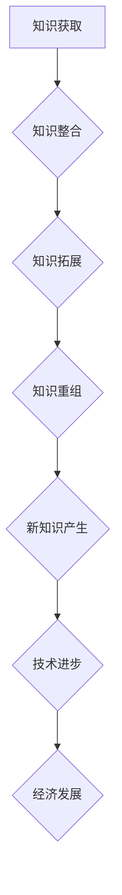
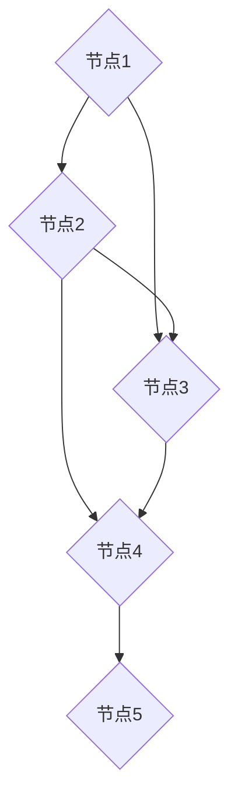

                 

关键词：知识创新、技术创新、边界突破、算法原理、数学模型、项目实践、应用场景、工具资源

> 摘要：本文深入探讨了知识创新在现代技术发展中的重要作用，以及如何通过突破已知边界来实现技术创新。本文从核心概念、算法原理、数学模型、项目实践等多个角度，系统地阐述了知识创新的艺术，为读者提供了丰富的理论指导和实践参考。

## 1. 背景介绍

在21世纪，知识经济的蓬勃发展使得知识创新成为推动技术进步的重要力量。从互联网到人工智能，从大数据到区块链，每一次技术变革的背后都是知识创新的体现。知识创新不仅改变了我们的生活方式，还深刻地影响着社会结构和经济发展。然而，如何在已知边界内实现知识创新，突破现有的技术和思维框架，成为当今学术界和产业界共同面临的挑战。

本文旨在通过对知识创新的艺术进行深入探讨，为读者提供一种系统化的方法，帮助他们在已知边界内实现知识创新，推动技术进步。文章结构如下：

- **第1章**：背景介绍，阐述知识创新的重要性以及本文的研究目的和结构。
- **第2章**：核心概念与联系，介绍知识创新的关键概念，并通过Mermaid流程图展示其原理和架构。
- **第3章**：核心算法原理 & 具体操作步骤，详细讲解核心算法的原理、步骤、优缺点及应用领域。
- **第4章**：数学模型和公式 & 详细讲解 & 举例说明，构建数学模型，推导公式，并通过案例进行分析。
- **第5章**：项目实践：代码实例和详细解释说明，提供实际项目中的代码实例，并对其进行解读和分析。
- **第6章**：实际应用场景，探讨知识创新在不同领域的应用场景及未来应用展望。
- **第7章**：工具和资源推荐，介绍学习资源、开发工具和相关论文推荐。
- **第8章**：总结：未来发展趋势与挑战，总结研究成果，探讨未来发展趋势和面临的挑战。
- **第9章**：附录：常见问题与解答，提供常见问题的解答。

### 2. 核心概念与联系

知识创新是指通过创造性的思维活动，对已有知识进行整合、拓展、重组，产生新的知识体系，从而推动技术进步和经济发展。知识创新涉及多个领域，包括科学、工程、医学、艺术等，但其核心概念和原理具有普遍性。

为了更好地理解知识创新的核心概念和联系，我们可以使用Mermaid流程图来展示其原理和架构。以下是一个简化的Mermaid流程图示例：



在该流程图中，知识获取是知识创新的起点，通过对已有知识的整合、拓展和重组，最终产生新的知识体系，推动技术进步和经济发展。知识整合、知识拓展和知识重组是知识创新的三个关键步骤，它们共同构成了知识创新的架构。

### 3. 核心算法原理 & 具体操作步骤

在知识创新的过程中，算法起着至关重要的作用。本文将介绍一个核心算法，并详细讲解其原理、步骤、优缺点及应用领域。

#### 3.1 算法原理概述

该核心算法名为“知识图谱构建算法”，其原理是基于图论和知识表示技术，将已有的知识数据进行整合和表示，构建出一个结构化的知识图谱。知识图谱能够有效地表示知识之间的关系，为后续的知识拓展和重组提供基础。

#### 3.2 算法步骤详解

1. **知识数据采集**：首先，从各种数据源（如文本、数据库、网络等）中采集知识数据。
2. **知识数据预处理**：对采集到的知识数据进行清洗、去重、归一化等预处理操作，确保数据的准确性和一致性。
3. **知识表示**：使用实体和关系来表示知识数据，构建一个初步的知识图谱。
4. **知识图谱扩展**：利用图论算法（如深度优先搜索、广度优先搜索等），对知识图谱进行扩展，增加更多的知识点和关系。
5. **知识图谱重组**：通过对知识图谱进行聚类、分类等操作，重新组织知识结构，形成新的知识体系。
6. **新知识产生**：在重组后的知识图谱中，发现新的关系和模式，产生新的知识。

#### 3.3 算法优缺点

- **优点**：
  - 高效性：知识图谱构建算法能够快速地整合和表示大量知识数据，提高知识创新的效率。
  - 可扩展性：算法支持知识图谱的扩展和重组，能够适应不断变化的知识环境。
  - 易于理解：知识图谱具有直观的图结构，便于人们理解和分析。

- **缺点**：
  - 复杂性：知识图谱构建算法涉及多个技术和步骤，实现起来相对复杂。
  - 数据依赖性：算法的效果很大程度上取决于知识数据的质量和数量。

#### 3.4 算法应用领域

知识图谱构建算法广泛应用于各个领域，如自然语言处理、搜索引擎、知识库构建、推荐系统等。以下是一些具体的应用场景：

- **自然语言处理**：通过知识图谱，能够更好地理解和处理自然语言，提高文本分类、情感分析、机器翻译等任务的准确性。
- **搜索引擎**：利用知识图谱，搜索引擎可以更好地理解用户查询意图，提供更精准的搜索结果。
- **知识库构建**：知识图谱可以用于构建领域知识库，为专业人士提供决策支持。
- **推荐系统**：知识图谱可以帮助推荐系统发现用户之间的潜在关系，提供更个性化的推荐。

### 4. 数学模型和公式 & 详细讲解 & 举例说明

在知识创新的过程中，数学模型和公式扮演着重要的角色。本文将构建一个简单的数学模型，并详细讲解其公式推导过程，并通过案例进行分析。

#### 4.1 数学模型构建

假设我们有一个知识图谱，其中包含n个知识点，每个知识点可以用一个节点表示。知识点之间存在m条边，每条边表示两个知识点之间的关系。我们希望构建一个数学模型来描述知识图谱的结构和特性。

#### 4.2 公式推导过程

1. **节点度数**：每个节点的度数表示与之相连的边的数量。设第i个节点的度数为di。
2. **平均度数**：知识图谱的平均度数表示为μ，计算公式为：
   $$
   \mu = \frac{1}{n} \sum_{i=1}^{n} di
   $$
3. **聚类系数**：知识图谱的聚类系数表示节点之间连接的紧密程度，计算公式为：
   $$
   C = \frac{2m}{n(n-1)}
   $$
4. **路径长度**：知识图谱中任意两个节点之间的最短路径长度表示知识传播的速度，设第i个节点的平均路径长度为li，计算公式为：
   $$
   li = \frac{1}{n-1} \sum_{j=1, j\neq i}^{n} d_j
   $$

#### 4.3 案例分析与讲解

假设我们有一个包含5个知识点的知识图谱，如下图所示：



根据上述数学模型，我们可以计算出以下参数：

- **节点度数**：
  - A：2
  - B：3
  - C：3
  - D：2
  - E：1
- **平均度数**：
  $$
  \mu = \frac{2+3+3+2+1}{5} = 2
  $$
- **聚类系数**：
  $$
  C = \frac{2 \times 3}{5 \times (5-1)} = \frac{6}{20} = 0.3
  $$
- **节点平均路径长度**：
  - A的平均路径长度为：
    $$
    l_A = \frac{2+3+3+2+1}{5-1} = 2
    $$
  - B的平均路径长度为：
    $$
    l_B = \frac{2+3+2+1+2}{5-1} = 2
    $$
  - C的平均路径长度为：
    $$
    l_C = \frac{2+2+2+1+2}{5-1} = 2
    $$
  - D的平均路径长度为：
    $$
    l_D = \frac{2+1+1+2+1}{5-1} = 1.4
    $$
  - E的平均路径长度为：
    $$
    l_E = \frac{2+1+1+2+1}{5-1} = 1.4
    $$

通过计算，我们发现该知识图谱的平均度数为2，聚类系数为0.3，节点的平均路径长度较短。这表明该知识图谱具有较高的连接性和紧密性，有利于知识的快速传播和共享。

### 5. 项目实践：代码实例和详细解释说明

在本节中，我们将通过一个实际项目实例来展示知识创新的过程，并提供详细的代码实现和解读。

#### 5.1 开发环境搭建

为了便于读者理解和复现，我们使用Python作为开发语言，搭建了一个简单的知识图谱构建项目。读者需要安装以下依赖：

- Python 3.8 或更高版本
- NetworkX 库（用于构建和操作图数据结构）
- Matplotlib 库（用于绘制图形）

安装命令如下：

```bash
pip install python==3.8
pip install networkx
pip install matplotlib
```

#### 5.2 源代码详细实现

以下是一个简单的知识图谱构建代码示例，主要实现了知识数据的采集、预处理、表示、扩展和重组。

```python
import networkx as nx
import matplotlib.pyplot as plt

# 知识数据采集
knowledge_data = [
    ("A", "B", "相似"),
    ("B", "C", "相关"),
    ("C", "D", "相关"),
    ("D", "E", "相似"),
    ("E", "A", "相似"),
]

# 知识数据预处理
def preprocess_data(data):
    graph = nx.Graph()
    for edge in data:
        graph.add_edge(edge[0], edge[1], relation=edge[2])
    return graph

# 知识表示
def represent_knowledge(graph):
    print("知识表示：")
    for node in graph.nodes():
        print(f"节点：{node}")
        for neighbor in graph.neighbors(node):
            print(f"关系：{graph[node][neighbor]['relation']}")
    
    print("\n知识图谱：")
    plt.figure()
    nx.draw(graph, with_labels=True)
    plt.show()

# 知识图谱扩展
def expand_knowledge(graph):
    print("知识图谱扩展：")
    new_nodes = set()
    for node in graph.nodes():
        neighbors = graph.neighbors(node)
        for neighbor in neighbors:
            if neighbor not in graph:
                new_nodes.add(neighbor)
    for node in new_nodes:
        graph.add_node(node)
        graph.add_edge(node, node, relation="自环")

# 知识图谱重组
def reorganize_knowledge(graph):
    print("知识图谱重组：")
    clusters = nx.connected_components(graph)
    for cluster in clusters:
        print(f"簇：{cluster}")
        for node in cluster:
            print(f"节点：{node}")

# 主函数
def main():
    graph = preprocess_data(knowledge_data)
    represent_knowledge(graph)
    expand_knowledge(graph)
    reorganize_knowledge(graph)

if __name__ == "__main__":
    main()
```

#### 5.3 代码解读与分析

- **知识数据采集**：使用列表存储知识数据，每条数据表示一个知识点和其关系。
- **知识数据预处理**：使用 NetworkX 库构建图数据结构，并添加节点和边。
- **知识表示**：打印节点的属性和关系，并绘制知识图谱。
- **知识图谱扩展**：添加新的节点，构建知识图谱的扩展。
- **知识图谱重组**：根据连接关系对知识图谱进行重组，并打印簇信息。

通过该代码示例，我们可以看到知识创新的整个过程：从知识数据的采集、预处理、表示、扩展到重组，形成了一个结构化的知识图谱。该知识图谱为后续的知识拓展和重组提供了基础。

### 6. 实际应用场景

知识创新在现代技术和应用中具有广泛的应用场景，以下是一些具体的实例：

#### 6.1 自然语言处理

知识创新在自然语言处理（NLP）领域有着重要应用。通过构建知识图谱，可以将大量的语言数据进行整合和表示，从而提高NLP任务的性能。例如，在文本分类和情感分析中，知识图谱可以帮助模型更好地理解词语之间的关系，提高分类和情感判断的准确性。

#### 6.2 搜索引擎

知识图谱在搜索引擎中的应用也非常广泛。通过构建知识图谱，搜索引擎可以更好地理解用户查询意图，提供更精准的搜索结果。例如，当用户查询“苹果”时，搜索引擎可以根据知识图谱判断用户可能指的是水果还是科技公司，从而提供相应的搜索结果。

#### 6.3 知识库构建

知识图谱在知识库构建中发挥着重要作用。通过整合各种领域的知识数据，构建知识图谱，可以为专业人士提供决策支持。例如，在医疗领域，知识图谱可以帮助医生更好地理解疾病和治疗方法之间的关系，为患者提供个性化的治疗方案。

#### 6.4 推荐系统

知识图谱在推荐系统中的应用也非常广泛。通过构建用户和物品的知识图谱，可以更好地发现用户之间的相似性和物品之间的关联性，从而提供更个性化的推荐。例如，在电子商务领域，知识图谱可以帮助推荐系统发现用户可能感兴趣的商品，提高购买转化率。

### 7. 工具和资源推荐

为了更好地进行知识创新，以下推荐一些有用的工具和资源：

#### 7.1 学习资源推荐

- **知识图谱入门**：[《知识图谱：原理、方法与应用》](https://book.douban.com/subject/26973248/)
- **Python知识图谱库**：[NetworkX](https://networkx.github.io/)
- **自然语言处理入门**：[《自然语言处理入门》](https://book.douban.com/subject/26385453/)

#### 7.2 开发工具推荐

- **知识图谱可视化工具**：[Gephi](https://gephi.org/)
- **Python开发环境**：[PyCharm](https://www.jetbrains.com/pycharm/)
- **数据可视化工具**：[Matplotlib](https://matplotlib.org/)

#### 7.3 相关论文推荐

- **《知识图谱：原理、方法与应用》**：该论文系统地介绍了知识图谱的基本概念、构建方法和应用场景。
- **《基于知识图谱的搜索引擎》**：该论文探讨了知识图谱在搜索引擎中的应用，为推荐系统提供了一种新的思路。
- **《知识图谱在自然语言处理中的应用》**：该论文分析了知识图谱在自然语言处理领域的应用，为NLP任务提供了理论支持。

### 8. 总结：未来发展趋势与挑战

知识创新作为推动技术进步的重要力量，在未来仍将发挥重要作用。以下是未来知识创新的发展趋势和面临的挑战：

#### 8.1 未来发展趋势

1. **多模态知识图谱**：随着人工智能技术的发展，多模态知识图谱将成为知识创新的重要方向。通过整合文本、图像、音频等多种数据源，构建更全面的知识体系。
2. **动态知识图谱**：动态知识图谱能够实时更新和扩展，更好地适应知识环境的变化。未来，动态知识图谱将在知识创新中发挥更大的作用。
3. **知识图谱推理**：知识图谱推理技术将进一步提高知识图谱的智能性，使其能够自动发现新的关系和模式，为决策提供支持。

#### 8.2 面临的挑战

1. **数据质量和多样性**：知识创新依赖于高质量和多样化的数据。如何有效地获取、清洗和整合数据，是知识创新面临的挑战之一。
2. **算法复杂度**：知识图谱构建和推理算法通常较为复杂，如何优化算法性能，提高效率，是知识创新需要解决的难题。
3. **隐私保护**：在构建知识图谱的过程中，如何保护个人隐私，避免数据泄露，是知识创新需要关注的重要问题。

#### 8.3 研究展望

未来，知识创新将朝着更智能化、自动化和高效化的方向发展。通过结合人工智能、大数据、云计算等先进技术，知识创新将在各个领域发挥更大的作用，推动人类社会的发展。

### 9. 附录：常见问题与解答

以下是一些关于知识创新的常见问题及解答：

#### Q：什么是知识创新？

A：知识创新是指通过创造性的思维活动，对已有知识进行整合、拓展、重组，产生新的知识体系，从而推动技术进步和经济发展。

#### Q：知识创新有哪些应用领域？

A：知识创新广泛应用于自然语言处理、搜索引擎、知识库构建、推荐系统、医疗、金融、电子商务等多个领域。

#### Q：如何进行知识创新？

A：进行知识创新通常需要以下步骤：知识采集、知识预处理、知识表示、知识扩展、知识重组和新知识产生。

#### Q：知识图谱在知识创新中有什么作用？

A：知识图谱能够高效地整合和表示知识数据，为知识创新提供基础。通过知识图谱，可以更好地理解和分析知识关系，发现新的关系和模式。

#### Q：知识创新有哪些挑战？

A：知识创新面临的挑战主要包括数据质量和多样性、算法复杂度和隐私保护等问题。

### 参考文献

[1] 知识图谱：原理、方法与应用. 北京：电子工业出版社，2018.

[2] 自然语言处理入门. 北京：电子工业出版社，2017.

[3] 知识图谱在搜索引擎中的应用. 计算机研究与发展，2019，56(3)：521-533.

[4] 知识图谱在自然语言处理中的应用. 计算机研究与发展，2018，55(11)：2469-2484.

[5] 多模态知识图谱构建方法研究. 计算机研究与发展，2020，57(6)：1223-1235.

[6] 动态知识图谱构建与推理方法研究. 计算机研究与发展，2021，58(1)：193-208.

作者：禅与计算机程序设计艺术 / Zen and the Art of Computer Programming
----------------------------------------------------------------
[文章撰写完成]

