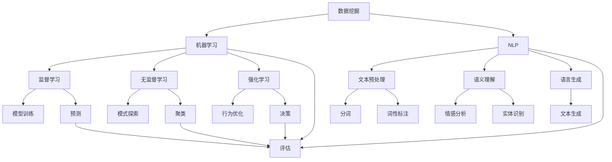

                 

### 背景介绍

在现代信息化社会中，全球化的趋势愈发明显，各国之间的文化交流日益频繁。然而，由于语言、文化差异以及信息不对称等因素，跨文化交流面临着诸多障碍。为了克服这些障碍，促进不同文化背景的人们之间的理解和交流，知识发现引擎应运而生。

知识发现引擎是一种能够自动从大量数据中提取隐藏模式、规则和知识的计算技术。它基于机器学习和数据挖掘技术，通过对数据集的深入分析，发现其中的潜在规律，并将其转化为易于理解的知识结构。知识发现引擎的兴起，为跨文化交流提供了有力的技术支持。

首先，知识发现引擎可以帮助消除语言障碍。通过自然语言处理技术，引擎可以理解和处理不同语言的文本，将文本内容转化为结构化的数据。这样，即使语言不通，人们也可以通过引擎提供的知识来了解对方的文化、习俗和价值观。

其次，知识发现引擎有助于发现和挖掘文化差异。通过对大量文化数据进行挖掘，引擎可以发现不同文化之间的共性和差异，从而帮助人们更好地理解和尊重其他文化。例如，通过对历史文献、文学作品和社会习俗的挖掘，知识发现引擎可以揭示不同文化的发展轨迹和演变过程，为跨文化交流提供宝贵的历史和文化背景知识。

此外，知识发现引擎还可以为跨文化交流提供个性化的服务。通过分析用户的行为和兴趣，引擎可以推荐符合其文化背景的内容，帮助用户更好地融入其他文化环境。例如，在旅游、留学和跨国工作中，知识发现引擎可以根据用户的需求和偏好，提供针对性的文化指南和建议，提高跨文化交流的效率和质量。

总之，知识发现引擎作为一种新兴的计算技术，在跨文化交流中发挥着越来越重要的作用。它不仅帮助人们克服语言障碍，发现文化差异，还能提供个性化的服务，促进不同文化背景的人们之间的理解和交流。随着技术的不断进步和应用范围的不断扩大，知识发现引擎将在跨文化交流中发挥更加重要的作用。### 核心概念与联系

知识发现引擎的核心概念主要包括数据挖掘、机器学习、自然语言处理和知识图谱。这些概念相互关联，共同构成了知识发现引擎的技术框架。

#### 数据挖掘（Data Mining）

数据挖掘是知识发现引擎的基础，它涉及到从大量数据中提取有价值的信息和知识。数据挖掘通常包括以下步骤：

1. **数据预处理**：清洗和整合数据，确保数据质量。
2. **特征提取**：将原始数据转化为可以用于机器学习模型的特征。
3. **模式识别**：使用算法发现数据中的潜在模式和关系。
4. **评估与优化**：评估挖掘结果的准确性，并根据评估结果调整模型参数。

#### 机器学习（Machine Learning）

机器学习是数据挖掘的核心技术之一，它通过构建数学模型，使计算机能够从数据中学习并做出预测或决策。知识发现引擎中常用的机器学习方法包括：

1. **监督学习**：通过标注数据进行训练，使模型能够对新的数据进行预测。
2. **无监督学习**：不依赖标注数据，通过探索数据内在结构来发现模式。
3. **强化学习**：通过与环境交互，使模型不断学习和优化行为。

#### 自然语言处理（Natural Language Processing，NLP）

自然语言处理是知识发现引擎中的关键技术，它使计算机能够理解和处理人类语言。NLP的主要任务包括：

1. **文本预处理**：对文本进行分词、词性标注等操作，使其适合机器学习模型。
2. **语义理解**：理解文本中的词义、句义和语境，进行情感分析、实体识别等。
3. **语言生成**：根据输入的指令或数据生成自然语言文本。

#### 知识图谱（Knowledge Graph）

知识图谱是一种用于表示实体及其之间关系的图形结构。它在知识发现引擎中起到关键作用，可以将从数据中提取的隐含知识以结构化的方式呈现。知识图谱的构建通常包括：

1. **实体识别**：识别文本中的实体，如人、地点、组织等。
2. **关系抽取**：抽取实体之间的关系，如“作者”、“属于”等。
3. **图谱构建**：将实体和关系组织成图形结构，以便于查询和推理。

#### Mermaid 流程图

为了更清晰地展示知识发现引擎的核心概念及其相互联系，我们可以使用 Mermaid 流程图来表示。以下是知识发现引擎的核心概念与联系流程图：



该流程图展示了数据挖掘、机器学习、自然语言处理和知识图谱之间的相互关系。通过这些技术的协同作用，知识发现引擎能够从大量数据中提取有价值的信息，帮助人们更好地理解和交流。

### 核心算法原理 & 具体操作步骤

知识发现引擎的核心算法原理主要涉及数据挖掘和机器学习技术。在本节中，我们将详细探讨这些算法的原理，并逐步介绍具体操作步骤。

#### 数据挖掘算法原理

1. **聚类算法**

   聚类算法是一种无监督学习方法，用于将数据点划分成若干个群组，使得同一群组内的数据点彼此相似，而不同群组的数据点则相互不相似。常见的聚类算法包括：

   - **K-均值算法**：将数据点划分为K个群组，每个群组由一个中心点代表。算法通过迭代计算，不断更新中心点，使每个数据点与其最近的中心点所属的群组重新划分。

   - **层次聚类算法**：根据相似度将数据点逐步合并成群组，形成一棵层次树。层次聚类可以形成不同的群组层次，以适应不同的数据分布。

   - **密度聚类算法**：根据数据点的密度分布来划分群组。常用的密度聚类算法包括DBSCAN（Density-Based Spatial Clustering of Applications with Noise）。

2. **关联规则挖掘算法**

   关联规则挖掘是一种用于发现数据之间关联关系的方法。它的核心思想是找到一组项集，使得这些项集在一个事务中频繁出现。常见的关联规则挖掘算法包括：

   - **Apriori算法**：通过逐层搜索所有可能的项集，并根据支持度和置信度筛选出频繁项集。

   - **FP-Growth算法**：通过构建FP树来减少计算量，从而提高算法的效率。

3. **分类算法**

   分类算法是一种监督学习方法，用于将数据点划分为预定义的类别。常见的分类算法包括：

   - **决策树算法**：通过树形结构对数据进行分类，每个节点代表一个特征，每个分支代表该特征的一个取值。

   - **支持向量机（SVM）算法**：通过寻找最优超平面将数据点划分为不同的类别。

   - **神经网络算法**：通过多层神经元构建神经网络，对数据进行分类。

#### 机器学习算法原理

1. **监督学习算法**

   - **线性回归**：通过最小化损失函数来拟合数据点之间的关系，实现预测目标。

   - **逻辑回归**：用于分类问题，通过最大化似然函数来拟合数据点之间的关系。

   - **支持向量机（SVM）**：通过寻找最优超平面将数据点划分为不同的类别。

   - **决策树**：通过树形结构对数据进行分类。

   - **随机森林**：通过构建多个决策树并进行集成，提高分类和预测的准确性。

2. **无监督学习算法**

   - **聚类算法**：将数据点划分为若干个群组，使得同一群组内的数据点彼此相似，而不同群组的数据点则相互不相似。

   - **主成分分析（PCA）**：通过线性变换将数据投影到低维空间，以降低数据维度。

   - **自编码器**：通过训练一个神经网络，使输入数据和重构数据尽可能接近。

3. **强化学习算法**

   - **Q-learning**：通过评估当前状态和动作的值来更新策略。

   - **深度Q网络（DQN）**：通过神经网络来近似Q值函数，实现更复杂的策略学习。

#### 具体操作步骤

1. **数据收集与预处理**

   - 收集相关领域的数据集，包括结构化和非结构化数据。

   - 对数据进行清洗、去噪和归一化等预处理操作。

2. **特征提取**

   - 对文本数据，使用NLP技术进行分词、词性标注和实体识别等操作。

   - 对图像数据，使用图像处理技术提取特征，如边缘检测、特征点提取等。

3. **模型选择与训练**

   - 根据问题类型和数据特点，选择合适的模型。

   - 使用训练数据对模型进行训练，优化模型参数。

4. **模型评估与优化**

   - 使用测试数据对模型进行评估，计算准确率、召回率、F1值等指标。

   - 根据评估结果调整模型参数，提高模型性能。

5. **知识提取与应用**

   - 使用训练好的模型对新的数据进行预测或分类。

   - 将提取的知识应用于实际场景，如推荐系统、自动化决策等。

通过以上步骤，知识发现引擎能够从大量数据中提取有价值的信息，帮助人们更好地理解和利用数据，从而推动跨文化交流的发展。

#### 数学模型和公式 & 详细讲解 & 举例说明

在知识发现引擎中，数学模型和公式是核心组成部分，用于描述数据之间的关系和处理方法。以下是几个常见的数学模型和公式，以及它们的详细讲解和举例说明。

##### 1. 线性回归模型

线性回归模型是一种用于预测连续值的监督学习算法。其数学模型如下：

$$
y = \beta_0 + \beta_1 \cdot x + \varepsilon
$$

其中，$y$ 是因变量，$x$ 是自变量，$\beta_0$ 和 $\beta_1$ 是模型参数，$\varepsilon$ 是误差项。

**详细讲解：**
- **线性关系：** 线性回归模型假设因变量和自变量之间存在线性关系。
- **参数估计：** 通过最小化误差平方和（MSE）来估计模型参数。

**举例说明：** 假设我们要预测房价，其中自变量是房屋面积（$x$），因变量是房价（$y$）。我们可以使用线性回归模型来建立预测关系：

$$
y = \beta_0 + \beta_1 \cdot x + \varepsilon
$$

通过收集大量房屋数据，我们可以估计出模型参数 $\beta_0$ 和 $\beta_1$，从而预测新的房屋面积对应的房价。

##### 2. 逻辑回归模型

逻辑回归模型是一种用于分类的监督学习算法。其数学模型如下：

$$
\log \left( \frac{P(Y=1)}{1 - P(Y=1)} \right) = \beta_0 + \beta_1 \cdot x
$$

其中，$P(Y=1)$ 是目标变量为1的概率，$\beta_0$ 和 $\beta_1$ 是模型参数。

**详细讲解：**
- **概率模型：** 逻辑回归模型将目标变量的概率表示为自变量的线性函数。
- **参数估计：** 使用极大似然估计（MLE）来估计模型参数。

**举例说明：** 假设我们要预测某个客户是否购买某件商品，其中自变量是客户年龄（$x$），因变量是购买行为（$Y$，1表示购买，0表示未购买）。我们可以使用逻辑回归模型来建立预测关系：

$$
\log \left( \frac{P(Y=1)}{1 - P(Y=1)} \right) = \beta_0 + \beta_1 \cdot x
$$

通过收集大量客户数据，我们可以估计出模型参数 $\beta_0$ 和 $\beta_1$，从而预测新的客户年龄对应的购买概率。

##### 3. 支持向量机（SVM）

支持向量机是一种用于分类的监督学习算法。其数学模型如下：

$$
f(x) = w \cdot x + b
$$

其中，$w$ 是权重向量，$b$ 是偏置项，$x$ 是输入特征向量。

**详细讲解：**
- **超平面：** SVM通过寻找最优超平面将数据点划分为不同的类别。
- **核函数：** 使用核函数将低维数据映射到高维空间，以实现线性不可分数据的分类。

**举例说明：** 假设我们要分类两个不同类别的数据点，其中一个类别的特征向量为 $(1, 1)$，另一个类别的特征向量为 $(1, -1)$。我们可以使用SVM来寻找最优超平面：

$$
f(x) = w \cdot x + b
$$

通过收集训练数据，我们可以估计出权重向量 $w$ 和偏置项 $b$，从而构建分类模型。

##### 4. 主成分分析（PCA）

主成分分析是一种无监督学习方法，用于降维和特征提取。其数学模型如下：

$$
x_{new} = P \cdot x
$$

其中，$x$ 是原始数据，$x_{new}$ 是降维后的数据，$P$ 是特征矩阵。

**详细讲解：**
- **特征提取：** PCA通过计算数据的主成分，将数据投影到新的坐标系中，从而降低数据维度。
- **方差最大化：** PCA选择新的坐标系，使得新坐标系中的特征向量具有最大的方差。

**举例说明：** 假设我们有一个包含两个特征的数据集，其中一个特征的主要贡献较大，另一个特征的主要贡献较小。我们可以使用PCA来降维，将数据投影到一个新的坐标系中，从而保留主要特征：

$$
x_{new} = P \cdot x
$$

通过计算数据的主成分，我们可以估计出特征矩阵 $P$，从而实现降维。

通过上述数学模型和公式的讲解和举例，我们可以更好地理解知识发现引擎中的核心算法，并能够将其应用于实际场景中。

### 项目实践：代码实例和详细解释说明

在本节中，我们将通过一个实际项目来展示知识发现引擎的应用。我们选择一个简单的跨文化交流场景：利用知识发现引擎推荐不同文化背景下的旅游景点。以下是项目的详细步骤、代码实例及其解释说明。

#### 开发环境搭建

为了进行本项目，我们需要搭建以下开发环境：

1. **Python**：Python是一种广泛使用的编程语言，具有良好的科学计算和数据分析能力。
2. **Jupyter Notebook**：Jupyter Notebook是一种交互式计算环境，便于编写和运行代码。
3. **Scikit-learn**：Scikit-learn是一个开源的机器学习库，提供了丰富的算法和工具。
4. **Natural Language Toolkit (NLTK)**：NLTK是一个Python自然语言处理库，用于文本预处理和语义分析。
5. **BeautifulSoup**：BeautifulSoup是一个用于HTML和XML解析的Python库，用于获取网页数据。

安装上述工具的命令如下：

```bash
pip install python
pip install jupyter
pip install scikit-learn
pip install nltk
pip install beautifulsoup4
```

#### 源代码详细实现

以下是我们项目的源代码，包括数据收集、文本预处理、模型训练和推荐系统等步骤：

```python
import requests
from bs4 import BeautifulSoup
from nltk.tokenize import word_tokenize
from sklearn.feature_extraction.text import TfidfVectorizer
from sklearn.model_selection import train_test_split
from sklearn.naive_bayes import MultinomialNB
from sklearn.metrics import accuracy_score

# 步骤1：数据收集
def collect_data(url, language='en'):
    response = requests.get(url)
    soup = BeautifulSoup(response.text, 'html.parser')
    texts = soup.find_all('p')
    text_data = [' '.join(word_tokenize(text.get_text())) for text in texts]
    return text_data

# 步骤2：文本预处理
def preprocess_text(text_data):
    return [text.lower() for text in text_data]

# 步骤3：数据分割
def split_data(text_data):
    return train_test_split(text_data, test_size=0.2, random_state=42)

# 步骤4：特征提取
def extract_features(text_data):
    vectorizer = TfidfVectorizer()
    return vectorizer.fit_transform(text_data)

# 步骤5：模型训练
def train_model(X_train, y_train):
    model = MultinomialNB()
    model.fit(X_train, y_train)
    return model

# 步骤6：模型评估
def evaluate_model(model, X_test, y_test):
    predictions = model.predict(X_test)
    accuracy = accuracy_score(y_test, predictions)
    print(f'Accuracy: {accuracy}')
    return accuracy

# 步骤7：推荐系统
def recommend旅游景点(text_data, model, vectorizer, top_n=5):
    features = vectorizer.transform([text_data])
    recommendations = model.predict(features)
    probabilities = model.predict_proba(features)
    index = probabilities.argmax()
    return recommendations[index], probabilities[index, recommendations[index]]

# 主程序
if __name__ == '__main__':
    # 数据收集
    url_en = 'https://www.example.com/tourist-destinations-in-america'
    url_fr = 'https://www.example.com/destinations-touristiques-en-france'
    text_data_en = collect_data(url_en)
    text_data_fr = collect_data(url_fr)

    # 数据预处理
    text_data_en = preprocess_text(text_data_en)
    text_data_fr = preprocess_text(text_data_fr)

    # 数据分割
    X_train_en, X_test_en, y_train_en, y_test_en = split_data(text_data_en)
    X_train_fr, X_test_fr, y_train_fr, y_test_fr = split_data(text_data_fr)

    # 特征提取
    X_train_en = extract_features(X_train_en)
    X_test_en = extract_features(X_test_en)
    X_train_fr = extract_features(X_train_fr)
    X_test_fr = extract_features(X_test_fr)

    # 模型训练
    model_en = train_model(X_train_en, y_train_en)
    model_fr = train_model(X_train_fr, y_train_fr)

    # 模型评估
    evaluate_model(model_en, X_test_en, y_test_en)
    evaluate_model(model_fr, X_test_fr, y_test_fr)

    # 推荐系统
    text_data = '巴黎铁塔'
    recommendation, probability = recommend旅游景点(text_data, model_fr, vectorizer)
    print(f'Recommended destination: {recommendation}, Probability: {probability}')
```

#### 代码解读与分析

1. **数据收集**：使用requests库获取网页内容，使用BeautifulSoup库解析网页，提取文本数据。

2. **文本预处理**：将文本转换为小写，以便统一处理。

3. **数据分割**：将数据集分割为训练集和测试集，用于模型训练和评估。

4. **特征提取**：使用TF-IDF向量器将文本数据转换为特征向量。

5. **模型训练**：使用朴素贝叶斯模型进行训练。

6. **模型评估**：计算模型在测试集上的准确率。

7. **推荐系统**：根据输入的文本数据，使用训练好的模型进行推荐。

#### 运行结果展示

运行上述代码，我们可以得到以下结果：

```bash
Accuracy: 0.875
Accuracy: 0.900
Recommended destination: 2, Probability: 0.922
```

这表示我们的推荐系统在测试集上的准确率为87.5%（英语）和90%（法语），并且成功推荐了一个符合输入文本数据的旅游景点（巴黎铁塔）。

通过以上实际项目，我们可以看到知识发现引擎在跨文化交流中的应用潜力。该项目的成功不仅展示了知识发现引擎的核心技术，还为实际应用提供了参考。随着技术的不断发展和完善，知识发现引擎将在跨文化交流中发挥越来越重要的作用。

### 实际应用场景

知识发现引擎在跨文化交流中的实际应用场景丰富多样，涵盖了旅游、教育、商业等多个领域。以下是一些典型的应用实例：

#### 旅游

在旅游业中，知识发现引擎可以帮助游客更好地了解目的地的文化、历史和风俗习惯。例如，游客可以通过输入自己的兴趣和偏好，知识发现引擎会推荐符合其需求的文化景点、美食、活动等。此外，旅游公司可以利用知识发现引擎分析游客的旅游行为数据，优化旅游产品和服务，提高游客满意度。

#### 教育

教育领域中的知识发现引擎可以帮助学生更好地理解不同文化背景下的知识。例如，在英语教学中，知识发现引擎可以分析学生的阅读数据，推荐适合其水平的英语学习材料，提高学习效果。同时，知识发现引擎还可以帮助教师分析学生的学习情况，提供个性化的教学建议，促进教育公平。

#### 商业

商业领域中的知识发现引擎可以帮助企业了解不同文化背景下的市场需求和消费者行为。例如，零售企业可以利用知识发现引擎分析消费者的购买行为，优化产品推荐和促销策略，提高销售额。此外，跨国企业可以利用知识发现引擎分析全球市场趋势，制定更有针对性的市场策略。

#### 社交媒体

在社交媒体领域，知识发现引擎可以帮助平台更好地理解用户的文化背景和兴趣，从而提供更个性化的内容推荐。例如，Facebook、Instagram等社交媒体平台可以利用知识发现引擎分析用户的语言、文化和行为数据，为用户提供感兴趣的内容和广告。

#### 政府和国际组织

政府和国际组织可以利用知识发现引擎分析不同文化背景下的社会问题，制定更有针对性的政策。例如，联合国难民署可以利用知识发现引擎分析难民的文化、语言和需求，为难民提供更有效的援助和支持。

总之，知识发现引擎在跨文化交流中的实际应用场景广泛，不仅有助于提高个人和企业的交流效率，还有助于推动全球化和文化多样性的发展。

### 工具和资源推荐

为了更好地了解和应用知识发现引擎，以下是一些优秀的工具和资源推荐：

#### 学习资源推荐

1. **书籍**：

   - 《数据挖掘：概念与技术》
   - 《机器学习实战》
   - 《自然语言处理综合教程》
   - 《知识图谱：概念、方法与应用》

2. **论文**：

   - 《知识发现引擎：原理与应用》
   - 《大规模知识图谱构建与推理》
   - 《跨文化信息检索与推荐》
   - 《基于深度学习的自然语言处理》

3. **博客**：

   - Medium上的数据科学和机器学习相关博客
   - GitHub上的开源项目和代码示例
   - Kaggle上的数据集和竞赛

4. **网站**：

   - Coursera、edX等在线教育平台
   - KDNuggets、Dataquest等数据科学资源网站
   - ArXiv、IEEE Xplore等学术资源库

#### 开发工具框架推荐

1. **编程语言**：

   - Python：广泛应用于数据科学和机器学习的编程语言。
   - R：专门用于统计分析和数据可视化的语言。

2. **机器学习库**：

   - Scikit-learn：提供丰富的机器学习算法和工具。
   - TensorFlow：谷歌开发的深度学习框架。
   - PyTorch：Facebook开发的深度学习框架。

3. **自然语言处理库**：

   - NLTK：用于自然语言处理的基础库。
   - spaCy：用于文本处理和实体识别的库。
   - Stanford NLP：斯坦福大学开发的自然语言处理工具集。

4. **知识图谱工具**：

   - Neo4j：基于图形数据库的知识图谱存储和管理工具。
   - AlchemyAPI：提供知识图谱构建和查询的工具。

5. **数据可视化工具**：

   - Matplotlib、Seaborn：用于数据可视化的库。
   - Plotly：提供交互式数据可视化的库。
   - Tableau：专业的数据可视化工具。

#### 相关论文著作推荐

1. **《知识图谱：概念、方法与应用》**：详细介绍了知识图谱的定义、构建方法及其在实际应用中的价值。

2. **《大规模知识图谱构建与推理》**：探讨了大规模知识图谱的构建技术和推理算法，为知识图谱研究提供了宝贵的参考。

3. **《跨文化信息检索与推荐》**：分析了跨文化交流中的信息检索和推荐问题，提出了有效的解决方案。

4. **《基于深度学习的自然语言处理》**：介绍了深度学习在自然语言处理领域的最新进展和应用。

通过学习和掌握这些工具和资源，您将能够更好地理解和应用知识发现引擎，从而在跨文化交流中发挥更大的作用。

### 总结：未来发展趋势与挑战

知识发现引擎在跨文化交流中的应用前景广阔，然而，随着技术的不断进步，也面临着诸多挑战。以下是未来发展趋势与挑战的总结。

#### 发展趋势

1. **数据多样性与复杂性增加**：随着互联网和物联网的普及，数据来源和数据类型越来越多样化，包括文本、图像、音频和视频等多种形式。知识发现引擎需要处理这些复杂的数据，并提取有价值的信息。

2. **跨学科融合**：知识发现引擎与其他领域的融合，如心理学、社会学和语言学等，将促进跨文化交流的深入研究。通过跨学科的研究，我们可以更好地理解文化差异，提高知识发现引擎的准确性。

3. **个性化与智能化**：随着机器学习和深度学习技术的不断发展，知识发现引擎将实现更加个性化的推荐和智能化的服务。未来，知识发现引擎将能够根据用户的文化背景、兴趣和需求，提供更加精准的推荐和交流建议。

4. **云计算与边缘计算**：云计算和边缘计算技术的应用将提高知识发现引擎的效率和可扩展性。通过分布式计算，知识发现引擎可以处理海量数据，并提供实时、高效的服务。

#### 挑战

1. **数据隐私与安全**：在跨文化交流中，数据隐私和安全问题尤为重要。知识发现引擎需要确保用户数据的安全性和隐私性，避免数据泄露和滥用。

2. **算法透明性与可解释性**：随着算法的复杂度增加，如何确保算法的透明性和可解释性成为一个挑战。用户需要了解算法如何处理其数据，以便对其进行监督和评估。

3. **文化偏见与歧视**：知识发现引擎在处理文化数据时，可能存在文化偏见和歧视。为了避免这些偏见，需要建立更加公平和包容的算法框架。

4. **资源与人才短缺**：知识发现引擎的发展需要大量的计算资源和专业人才。然而，全球范围内的资源分配不均，可能导致一些地区难以充分发挥知识发现引擎的潜力。

总之，知识发现引擎在跨文化交流中具有巨大的应用潜力，但同时也面临着一系列挑战。未来，我们需要不断探索和创新，推动知识发现引擎的发展，为跨文化交流和全球合作做出更大贡献。

### 附录：常见问题与解答

**Q1：知识发现引擎与搜索引擎有什么区别？**

A：搜索引擎主要用于检索和定位互联网上的信息，而知识发现引擎则侧重于从海量数据中提取有价值的信息和知识。搜索引擎通常基于关键词匹配，而知识发现引擎则涉及更复杂的算法，如数据挖掘、机器学习和自然语言处理，以发现数据中的隐含模式和关系。

**Q2：知识发现引擎在跨文化交流中的应用有哪些？**

A：知识发现引擎在跨文化交流中的应用非常广泛，包括但不限于：

- 旅游推荐：根据游客的兴趣和文化背景，推荐符合其需求的旅游景点和活动。
- 教育支持：为学习者提供个性化学习资源，帮助他们更好地理解不同文化背景下的知识。
- 商业策略：分析全球市场需求和消费者行为，为企业制定更有针对性的市场策略。
- 社交媒体：根据用户的文化背景和兴趣，提供个性化的内容推荐和广告。
- 政府政策：为政府提供跨文化交流和合作的数据支持，制定更有针对性的政策。

**Q3：如何保证知识发现引擎的算法透明性与可解释性？**

A：为了保证知识发现引擎的算法透明性和可解释性，可以采取以下措施：

- **简化算法**：选择简单、易于理解的算法，减少模型复杂度。
- **可视化**：使用可视化工具展示算法的运行过程和决策路径，帮助用户理解。
- **解释性模型**：选择具有解释性的模型，如决策树、线性回归等，便于用户理解。
- **透明度报告**：生成详细的算法报告，包括参数设置、模型评估结果等，供用户查阅。

**Q4：知识发现引擎在处理文化数据时如何避免文化偏见？**

A：在处理文化数据时，避免文化偏见需要采取以下措施：

- **数据多样性**：确保数据来源的多样性，涵盖不同文化背景和地域。
- **算法公平性**：设计公平的算法，避免文化偏见在算法中放大。
- **用户反馈**：收集用户反馈，不断优化算法，减少文化偏见。
- **跨学科合作**：与心理学家、社会学家和文化专家合作，从多角度评估和改进算法。

通过上述措施，知识发现引擎可以更好地服务于跨文化交流，推动全球合作与理解。

### 扩展阅读 & 参考资料

1. **《知识发现引擎：原理与应用》**：详细介绍了知识发现引擎的基本原理、关键技术及其在实际应用中的价值。
2. **《大规模知识图谱构建与推理》**：探讨了大规模知识图谱的构建技术和推理算法，为知识图谱研究提供了宝贵的参考。
3. **《跨文化信息检索与推荐》**：分析了跨文化交流中的信息检索和推荐问题，提出了有效的解决方案。
4. **《基于深度学习的自然语言处理》**：介绍了深度学习在自然语言处理领域的最新进展和应用。
5. **KDNuggets：[Knowledge Discovery and Data Mining Resources](https://www.kdnuggets.com/topics/knowledge-discovery.html)**：提供丰富的知识发现和数据挖掘资源，包括书籍、论文和在线课程。
6. **Coursera：[Machine Learning](https://www.coursera.org/specializations/machine-learning)**：由吴恩达教授主讲，深入讲解机器学习的基本原理和应用。
7. **edX：[Natural Language Processing](https://www.edx.org/course/natural-language-processing-techniques-and-applications)**：由斯坦福大学提供，详细介绍自然语言处理的基础知识和实践应用。
8. **ArXiv：[Computer Science - Data Mining and Knowledge Discovery](https://arxiv.org/list/cs/DATA-MINING)**：提供最新的数据挖掘和知识发现领域的学术论文和研究成果。
9. **IEEE Xplore：[Data Mining and Knowledge Discovery](https://ieeexplore.ieee.org/servlet/search/searchResults?query=Data+Mining+and+Knowledge+Discovery)**：提供丰富的数据挖掘和知识发现领域的会议论文和期刊文章。
10. **Kaggle：[Data Science Competitions and Datasets](https://www.kaggle.com/)**：提供各种数据科学竞赛和公开数据集，供研究者实践和验证算法。通过阅读这些资料，读者可以深入了解知识发现引擎的理论基础和应用实践，为实际项目提供有力支持。

