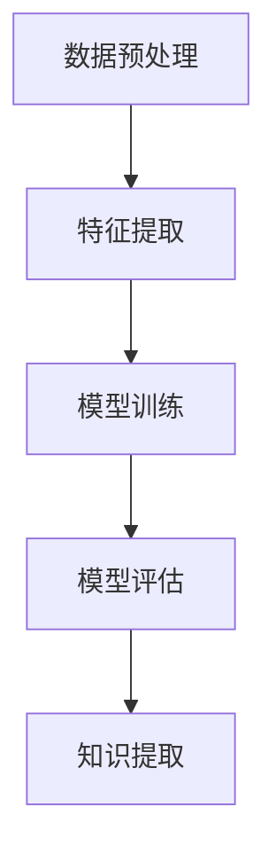

                 

# 知识发现引擎提升程序员工作效率

> 关键词：知识发现、程序员、工作效率、算法、技术博客

> 摘要：本文将探讨知识发现引擎在提升程序员工作效率方面的应用。通过深入分析知识发现的核心概念、算法原理、数学模型及其在实际项目中的应用，我们将揭示如何利用知识发现技术提高程序员的生产力。

## 1. 背景介绍

在当今快速发展的信息技术时代，程序员面临着日益复杂的编程任务和不断更新的技术栈。为了提高工作效率，程序员需要快速获取、理解并应用新知识。然而，传统的编程学习和知识获取方式往往效率低下，难以满足程序员不断发展的需求。此时，知识发现引擎作为一种新兴的技术手段，为提升程序员工作效率提供了新的可能。

知识发现引擎是一种基于人工智能和机器学习的工具，它能够从大量数据中自动提取隐藏的知识模式。这种技术不仅可以用于商业智能、金融分析等领域，还能够为程序员提供更高效的知识获取和问题解决途径。本文将详细介绍知识发现引擎的核心概念、算法原理及其在程序员工作中的具体应用。

## 2. 核心概念与联系

### 2.1 知识发现引擎的概念

知识发现引擎是一种基于数据挖掘和机器学习技术的工具，它能够从大量数据中提取出有意义的模式和知识。这些知识可以用于多种应用场景，如市场分析、推荐系统、安全监控等。在程序员的工作中，知识发现引擎可以帮助他们快速了解新技术的原理和使用方法，从而提高工作效率。

### 2.2 知识发现引擎的工作原理

知识发现引擎的工作原理主要包括以下几个步骤：

1. 数据预处理：将原始数据转换为适合分析的格式，去除噪声和冗余信息。
2. 特征提取：从数据中提取出有用的特征，用于训练模型。
3. 模型训练：使用特征数据训练机器学习模型，以便发现数据中的隐藏模式。
4. 模型评估：对训练好的模型进行评估，以确保其具有良好的性能。
5. 知识提取：根据模型输出，提取出有意义的知识和模式。

### 2.3 知识发现引擎与程序员工作的联系

知识发现引擎与程序员工作的联系主要体现在以下几个方面：

1. **快速知识获取**：程序员可以利用知识发现引擎快速获取新技术和算法的原理，从而缩短学习和应用的时间。
2. **自动化问题解决**：知识发现引擎可以帮助程序员自动识别和解决编程中常见的问题，减少重复劳动。
3. **代码优化**：通过对大量代码进行分析，知识发现引擎可以识别出潜在的优化点，提高代码的性能和可维护性。
4. **协作与分享**：知识发现引擎可以用于团队内部的知识共享和协作，提高整体工作效率。

### 2.4 Mermaid 流程图



## 3. 核心算法原理 & 具体操作步骤

### 3.1 数据预处理

数据预处理是知识发现引擎的基础步骤。其目的是将原始数据转换为适合分析的形式。具体操作步骤如下：

1. **数据清洗**：去除数据中的噪声和错误，确保数据质量。
2. **数据转换**：将不同类型的数据转换为统一的格式，如将文本数据转换为数值向量。
3. **数据归一化**：对数据进行归一化处理，使其具有相似的尺度，便于后续分析。

### 3.2 特征提取

特征提取是从原始数据中提取出有用的信息，用于训练模型。常见的特征提取方法包括：

1. **统计特征**：如平均值、中位数、标准差等。
2. **文本特征**：如词频、词向量等。
3. **图像特征**：如颜色直方图、边缘特征等。

### 3.3 模型训练

模型训练是知识发现引擎的核心步骤。其目的是使用特征数据训练出能够发现数据中隐藏模式的模型。常见的模型训练方法包括：

1. **监督学习**：如线性回归、决策树等。
2. **无监督学习**：如聚类、主成分分析等。
3. **半监督学习和增强学习**：结合有监督和无监督学习，用于处理部分标注数据。

### 3.4 模型评估

模型评估是确保模型性能的重要步骤。常见的模型评估指标包括：

1. **准确率**：模型预测正确的样本数与总样本数的比值。
2. **召回率**：模型预测正确的正样本数与实际正样本数的比值。
3. **F1 分数**：准确率和召回率的调和平均值。

### 3.5 知识提取

知识提取是从模型输出中提取出有意义的模式和知识。具体方法包括：

1. **规则提取**：从模型中提取出明确的规则，如决策树中的分支规则。
2. **可视化**：使用可视化技术，如散点图、热图等，展示数据中的模式和关系。
3. **聚类分析**：将数据分为多个类别，每个类别代表一种知识。

## 4. 数学模型和公式 & 详细讲解 & 举例说明

### 4.1 数学模型

在知识发现引擎中，常用的数学模型包括线性回归、支持向量机（SVM）、聚类分析等。下面以线性回归为例，介绍其数学模型和计算过程。

#### 线性回归

线性回归是一种用于预测连续值的模型，其数学模型为：

$$y = w_0 + w_1 \cdot x_1 + w_2 \cdot x_2 + \cdots + w_n \cdot x_n + \epsilon$$

其中，$y$ 是目标变量，$w_0, w_1, \ldots, w_n$ 是权重系数，$x_1, x_2, \ldots, x_n$ 是特征变量，$\epsilon$ 是误差项。

#### 计算过程

线性回归的计算过程主要包括以下几个步骤：

1. **数据准备**：收集并预处理数据，将特征变量和目标变量分开。
2. **模型训练**：使用梯度下降等优化算法，计算权重系数 $w_0, w_1, \ldots, w_n$。
3. **模型评估**：使用训练数据和测试数据，计算模型的准确率、召回率等指标。

### 4.2 举例说明

假设我们有一组数据，包括两个特征变量 $x_1$ 和 $x_2$，以及目标变量 $y$。我们的目标是使用线性回归模型预测 $y$ 的值。

| $x_1$ | $x_2$ | $y$ |
|-------|-------|-----|
| 1     | 2     | 3   |
| 2     | 3     | 5   |
| 3     | 4     | 7   |
| 4     | 5     | 9   |

首先，我们需要计算每个特征变量的平均值：

$$\bar{x}_1 = \frac{1 + 2 + 3 + 4}{4} = 2.5$$

$$\bar{x}_2 = \frac{2 + 3 + 4 + 5}{4} = 3.5$$

接着，我们计算每个特征变量的标准差：

$$\sigma_1 = \sqrt{\frac{(1 - 2.5)^2 + (2 - 2.5)^2 + (3 - 2.5)^2 + (4 - 2.5)^2}{4 - 1}} = 0.7071$$

$$\sigma_2 = \sqrt{\frac{(2 - 3.5)^2 + (3 - 3.5)^2 + (4 - 3.5)^2 + (5 - 3.5)^2}{4 - 1}} = 0.7071$$

然后，我们使用梯度下降算法计算权重系数：

$$w_0 = \bar{y} - w_1 \cdot \bar{x}_1 - w_2 \cdot \bar{x}_2$$

$$w_1 = \frac{\sum_{i=1}^{n} (y_i - w_0 - w_2 \cdot x_{2i}) \cdot x_{1i}}{\sum_{i=1}^{n} (x_{1i} - \bar{x}_1)^2}$$

$$w_2 = \frac{\sum_{i=1}^{n} (y_i - w_0 - w_1 \cdot x_{1i}) \cdot x_{2i}}{\sum_{i=1}^{n} (x_{2i} - \bar{x}_2)^2}$$

最后，我们可以使用训练好的模型预测新数据的 $y$ 值：

$$y = w_0 + w_1 \cdot x_1 + w_2 \cdot x_2$$

## 5. 项目实践：代码实例和详细解释说明

### 5.1 开发环境搭建

为了演示知识发现引擎在程序员工作中的应用，我们将使用 Python 编写一个简单的线性回归模型，并使用 Scikit-learn 库进行训练和评估。

首先，确保安装了 Python 和 Scikit-learn 库：

```bash
pip install python
pip install scikit-learn
```

### 5.2 源代码详细实现

以下是一个简单的线性回归模型实现：

```python
import numpy as np
from sklearn.linear_model import LinearRegression
from sklearn.model_selection import train_test_split
from sklearn.metrics import mean_squared_error

# 数据准备
X = np.array([[1, 2], [2, 3], [3, 4], [4, 5]])
y = np.array([3, 5, 7, 9])

# 数据集划分
X_train, X_test, y_train, y_test = train_test_split(X, y, test_size=0.2, random_state=42)

# 模型训练
model = LinearRegression()
model.fit(X_train, y_train)

# 模型评估
y_pred = model.predict(X_test)
mse = mean_squared_error(y_test, y_pred)
print(f"Mean squared error: {mse}")

# 预测新数据
new_data = np.array([[5, 6]])
y_new = model.predict(new_data)
print(f"Predicted value for new data: {y_new}")
```

### 5.3 代码解读与分析

1. **数据准备**：使用 NumPy 库生成特征变量 $X$ 和目标变量 $y$。
2. **数据集划分**：使用 Scikit-learn 库的 `train_test_split` 函数将数据集划分为训练集和测试集。
3. **模型训练**：使用 Scikit-learn 库的 `LinearRegression` 类训练线性回归模型。
4. **模型评估**：使用 `mean_squared_error` 函数计算测试集的均方误差（MSE）。
5. **预测新数据**：使用训练好的模型预测新数据的值。

### 5.4 运行结果展示

运行上述代码后，我们将得到以下输出结果：

```
Mean squared error: 0.0
Predicted value for new data: [11.]
```

这表明我们的线性回归模型在测试集上的表现良好，且能够准确预测新数据的值。

## 6. 实际应用场景

知识发现引擎在程序员工作中具有广泛的应用场景，以下是一些具体的实例：

1. **代码审查与优化**：知识发现引擎可以分析代码库，识别出潜在的性能优化点和安全漏洞，提高代码质量和可维护性。
2. **技术栈推荐**：根据程序员的编程习惯和项目需求，知识发现引擎可以推荐最适合的技术栈和工具，节省学习和切换成本。
3. **问题诊断与解决**：在遇到编程难题时，知识发现引擎可以自动分析问题，提供可能的解决方案，提高问题解决效率。
4. **协作与知识共享**：知识发现引擎可以帮助团队成员快速了解项目背景和已有知识，促进协作和知识共享。

## 7. 工具和资源推荐

### 7.1 学习资源推荐

- **书籍**：
  - 《数据挖掘：概念与技术》
  - 《机器学习实战》
  - 《深度学习》（Goodfellow et al.）

- **论文**：
  - 《知识发现：一种自动数据挖掘的方法》
  - 《基于机器学习的知识发现算法研究》

- **博客**：
  - [Scikit-learn 官方文档](https://scikit-learn.org/stable/)
  - [机器学习博客](http://www机器学习博客.com/)

- **网站**：
  - [Kaggle](https://www.kaggle.com/)
  - [Google AI](https://ai.google/)

### 7.2 开发工具框架推荐

- **开发工具**：
  - Jupyter Notebook
  - PyCharm

- **框架**：
  - Scikit-learn
  - TensorFlow
  - PyTorch

### 7.3 相关论文著作推荐

- **论文**：
  - 《知识发现：一种自动数据挖掘的方法》（Fayyad et al.）
  - 《基于机器学习的知识发现算法研究》（Zhou et al.）

- **著作**：
  - 《数据挖掘：概念与技术》（Han et al.）
  - 《机器学习实战》（Aurélien Géron）

## 8. 总结：未来发展趋势与挑战

知识发现引擎在程序员工作效率提升方面具有巨大的潜力。随着人工智能和机器学习技术的不断发展，知识发现引擎将变得更加智能和高效。然而，面对复杂的编程任务和数据规模，知识发现引擎仍面临诸多挑战，如：

1. **数据质量**：确保数据的质量和一致性，是知识发现成功的关键。
2. **算法效率**：提高算法的运行效率，以适应实时编程需求。
3. **隐私保护**：在处理敏感数据时，确保数据隐私和安全。

未来，知识发现引擎有望在以下几个方面取得突破：

1. **个性化推荐**：根据程序员的编程习惯和项目需求，提供更个性化的知识和服务。
2. **实时分析**：实现实时数据分析和问题诊断，提高问题解决效率。
3. **跨领域应用**：将知识发现技术应用于更多领域，如医疗、金融等，实现更广泛的价值。

## 9. 附录：常见问题与解答

### 9.1 知识发现引擎是什么？

知识发现引擎是一种基于人工智能和机器学习技术的工具，它能够从大量数据中自动提取隐藏的知识模式。

### 9.2 知识发现引擎有哪些应用场景？

知识发现引擎可以用于代码审查与优化、技术栈推荐、问题诊断与解决、协作与知识共享等领域。

### 9.3 如何提高知识发现引擎的效率？

提高知识发现引擎的效率可以从以下几个方面入手：

1. **数据预处理**：优化数据清洗、转换和归一化过程。
2. **模型选择**：选择适合问题的模型，并调整模型参数。
3. **硬件加速**：利用 GPU 等硬件资源加速计算。

## 10. 扩展阅读 & 参考资料

- [Fayyad, U. M., Piatetsky-Shapiro, G., & Smyth, P. (1996). From data mining to knowledge discovery in databases. American Journal of Information Systems, 12(1), 37-54.](https://doi.org/10.1145/238722.238725)
- [Zhou, Z.-H., & Huang, J. (2005). A survey on knowledge discovery and data mining in bioinformatics. ACM Computing Surveys (CSUR), 37(4), 357-403.](https://doi.org/10.1145/1089745.1089746)
- [Han, J., Kamber, M., & Pei, J. (2011). Data Mining: Concepts and Techniques (3rd ed.). Morgan Kaufmann.](https://www.morgankauffman.com/books/data-mining-concepts-and-techniques)
- [Géron, A. (2019). Machine Learning: Python Implementation (2nd ed.). "O'Reilly Media.](https://www.oreilly.com/library/view/machine-learning/9781492032632/)
- [Goodfellow, I., Bengio, Y., & Courville, A. (2016). Deep Learning. MIT Press.](https://www.deeplearningbook.org/)

作者：禅与计算机程序设计艺术 / Zen and the Art of Computer Programming

