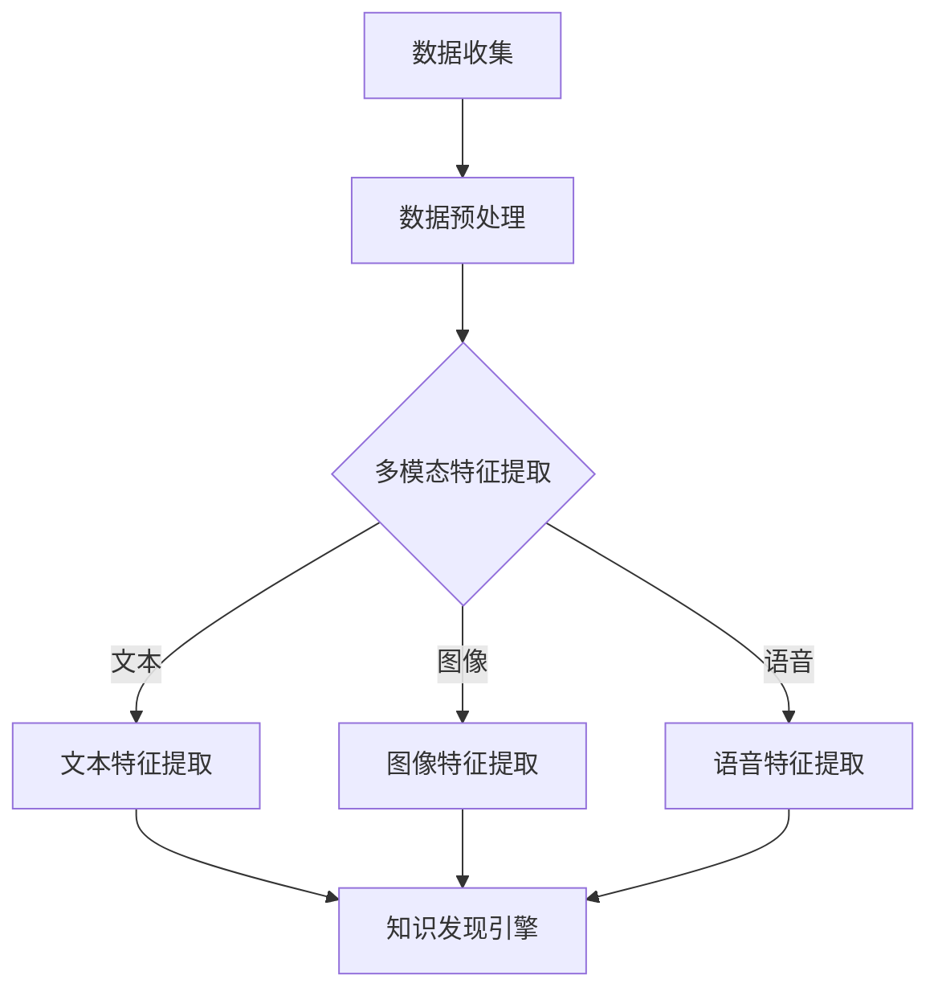

                 

### 1. 背景介绍

在当今信息爆炸的时代，如何高效地从海量数据中提取有价值的信息，成为了一个亟待解决的问题。传统的搜索技术已无法满足人们对信息检索的需求，多模态搜索作为一种新兴技术，逐渐受到关注。多模态搜索是指同时处理多种类型的数据，如文本、图像、语音等，通过融合这些数据的不同特征，实现更加精准和智能的信息检索。

知识发现引擎作为信息检索的重要工具，其核心目标是挖掘隐藏在数据背后的知识。然而，现有的知识发现引擎大多采用单一模态的数据处理方式，这导致了在处理复杂问题时，引擎的性能和效果往往不尽如人意。为了突破这一瓶颈，研究人员开始探索如何将多模态搜索技术应用于知识发现引擎中，以期实现更高效、更智能的信息检索。

本文旨在探讨知识发现引擎的多模态搜索实现，分析其核心概念、算法原理、数学模型，并通过实际项目实践，展示其在具体应用中的效果。本文将分为以下几个部分：

- 第1部分：背景介绍，概述多模态搜索和知识发现引擎的相关背景。
- 第2部分：核心概念与联系，介绍多模态搜索和知识发现引擎的核心概念及其之间的联系。
- 第3部分：核心算法原理 & 具体操作步骤，阐述多模态搜索算法的原理及具体操作步骤。
- 第4部分：数学模型和公式 & 详细讲解 & 举例说明，介绍多模态搜索的数学模型及具体应用。
- 第5部分：项目实践：代码实例和详细解释说明，通过实际项目展示多模态搜索在知识发现引擎中的应用。
- 第6部分：实际应用场景，探讨多模态搜索在知识发现引擎中的实际应用场景。
- 第7部分：工具和资源推荐，推荐相关学习资源和开发工具。
- 第8部分：总结：未来发展趋势与挑战，总结本文的核心观点，并探讨未来发展趋势与挑战。
- 第9部分：附录：常见问题与解答，解答读者在阅读本文过程中可能遇到的问题。
- 第10部分：扩展阅读 & 参考资料，提供进一步学习和研究的参考资料。

通过本文的阐述，我们希望读者能够深入了解知识发现引擎的多模态搜索实现，为相关领域的研究和应用提供有益的参考。

### 2. 核心概念与联系

#### 2.1 多模态搜索

多模态搜索是一种信息检索技术，它通过整合多种类型的数据，如文本、图像、语音等，实现更加精准和全面的信息检索。在多模态搜索中，每种数据类型都有其独特的特征和表达方式，如图像中的边缘、颜色、纹理等，文本中的词汇、句子结构等。多模态搜索的核心目标是将这些不同类型的数据融合起来，形成一个统一的信息表示，从而提高信息检索的效率和准确性。

#### 2.2 知识发现引擎

知识发现引擎是一种智能信息处理系统，它通过对大量数据进行挖掘和分析，发现其中隐藏的知识和模式。知识发现引擎通常包括数据预处理、特征提取、模型训练、知识推理等多个环节。其核心目标是从海量数据中提取有价值的信息，为决策提供支持。

#### 2.3 多模态搜索与知识发现引擎的关系

多模态搜索和知识发现引擎之间存在密切的联系。多模态搜索为知识发现引擎提供了更丰富的数据来源和处理方法，使得知识发现引擎能够更好地理解和分析复杂的数据。具体来说，多模态搜索与知识发现引擎的关系可以从以下几个方面来阐述：

1. **数据融合**：多模态搜索通过整合不同类型的数据，为知识发现引擎提供了更丰富的数据资源。例如，在医疗领域，多模态搜索可以将患者的病历、影像资料、基因数据等融合起来，为医生提供更加全面的诊断信息。

2. **特征提取**：多模态搜索可以通过不同的算法和模型，从不同类型的数据中提取出具有代表性的特征。这些特征可以作为知识发现引擎的输入，帮助其更好地理解和分析数据。

3. **模型训练**：多模态搜索可以为知识发现引擎提供更有效的训练数据。通过将多种类型的数据进行融合和预处理，可以提高模型的训练效果，从而提高知识发现引擎的性能。

4. **知识推理**：多模态搜索可以为知识发现引擎提供更加丰富的背景信息，有助于其在推理过程中考虑更多的因素。例如，在自然语言处理领域，多模态搜索可以将文本、图像、语音等信息融合起来，帮助模型更好地理解和生成自然语言。

#### 2.4 Mermaid 流程图

为了更好地展示多模态搜索与知识发现引擎的关系，我们可以使用 Mermaid 流程图进行描述。以下是一个简化的 Mermaid 流程图：



在这个流程图中，A 表示数据收集，B 表示数据预处理，C 表示多模态特征提取，D、E、F 分别表示文本、图像、语音特征提取，G 表示知识发现引擎。该流程图清晰地展示了多模态搜索与知识发现引擎之间的联系。

通过以上对核心概念与联系的介绍，我们可以更好地理解多模态搜索在知识发现引擎中的应用价值。在接下来的部分，我们将深入探讨多模态搜索的算法原理和具体操作步骤。

### 3. 核心算法原理 & 具体操作步骤

#### 3.1 多模态特征提取

多模态特征提取是多模态搜索中的关键步骤，其目标是从不同类型的数据中提取出具有代表性的特征，为后续的知识发现过程提供支持。多模态特征提取通常包括文本特征提取、图像特征提取和语音特征提取三个主要方面。

1. **文本特征提取**：

   文本特征提取是指从文本数据中提取出能够代表文本内容的特征。常用的文本特征提取方法包括词袋模型（Bag of Words, BOW）、TF-IDF（Term Frequency-Inverse Document Frequency）、词嵌入（Word Embedding）等。

   - **词袋模型（BOW）**：词袋模型将文本表示为一个词汇的集合，每个词汇的出现频率作为特征。词袋模型简单易实现，但在处理语义信息时效果较差。

   - **TF-IDF**：TF-IDF 方法通过对词汇的出现频率进行加权，更好地反映词汇在文档中的重要性。TF-IDF 方法在文本特征提取中具有一定的优势，但仍然难以捕捉词汇之间的语义关系。

   - **词嵌入（Word Embedding）**：词嵌入是一种将词汇映射到低维连续向量空间的方法，能够较好地捕捉词汇之间的语义关系。常见的词嵌入方法包括 Word2Vec、GloVe 等。

2. **图像特征提取**：

   图像特征提取是指从图像数据中提取出能够代表图像内容的特征。常用的图像特征提取方法包括深度学习（Deep Learning）、传统计算机视觉算法等。

   - **深度学习（Deep Learning）**：深度学习通过多层神经网络对图像进行建模，提取出具有层次性的特征。常见的深度学习模型包括卷积神经网络（Convolutional Neural Network, CNN）和生成对抗网络（Generative Adversarial Network, GAN）等。

   - **传统计算机视觉算法**：传统计算机视觉算法包括边缘检测、特征点提取、描述子匹配等方法。这些算法虽然具有较快的处理速度，但在处理复杂场景时效果有限。

3. **语音特征提取**：

   语音特征提取是指从语音数据中提取出能够代表语音内容的特征。常用的语音特征提取方法包括梅尔频率倒谱系数（Mel-Frequency Cepstral Coefficients, MFCC）、滤波器组（Filter Banks）等。

   - **梅尔频率倒谱系数（MFCC）**：MFCC 是一种对语音进行频域分析的方法，能够较好地捕捉语音的音高和音色信息。

   - **滤波器组（Filter Banks）**：滤波器组通过对语音信号进行滤波，提取出不同频率成分的特征。

#### 3.2 多模态特征融合

在提取出不同类型的数据特征后，多模态特征融合是一个重要的步骤，其目标是将这些不同类型的数据特征进行整合，形成一个统一的多模态特征表示。多模态特征融合的方法主要包括以下几种：

1. **直接融合**：

   直接融合方法直接将不同类型的数据特征进行拼接，形成一个多维特征向量。这种方法简单直观，但可能会丢失部分数据特征之间的信息。

2. **级联融合**：

   级联融合方法通过多个融合层次，逐步整合不同类型的数据特征。级联融合方法可以更好地保留数据特征之间的信息，但计算复杂度较高。

3. **特征加权融合**：

   特征加权融合方法根据不同类型的数据特征的重要性，为其分配不同的权重，从而进行融合。这种方法可以有效地提高多模态特征融合的效果，但需要依赖先验知识来确定权重。

4. **神经网络融合**：

   神经网络融合方法通过构建一个多输入单输出的神经网络模型，对多模态特征进行融合。神经网络融合方法可以自动学习不同数据特征之间的相关性，具有较强的自适应能力。

#### 3.3 多模态搜索算法

在完成多模态特征提取和融合后，多模态搜索算法的目标是根据用户查询，从海量数据中检索出与查询最相关的结果。多模态搜索算法主要包括以下几种：

1. **基于向量空间模型的搜索**：

   基于向量空间模型的搜索方法将查询和文档表示为向量，通过计算向量之间的相似度，检索出与查询最相关的文档。常见的向量空间模型包括余弦相似度、欧氏距离等。

2. **基于图模型的搜索**：

   基于图模型的搜索方法通过构建一个包含查询和文档的图结构，利用图结构进行搜索。常见的图模型包括邻接矩阵、图神经网络等。

3. **基于深度学习的搜索**：

   基于深度学习的搜索方法通过构建一个深度神经网络模型，对查询和文档进行建模，并利用模型进行搜索。常见的深度学习模型包括卷积神经网络、循环神经网络等。

通过以上对核心算法原理和具体操作步骤的介绍，我们可以了解到多模态搜索在知识发现引擎中的重要作用。在接下来的部分，我们将进一步探讨多模态搜索的数学模型和公式，以深入理解其内在机制。

### 4. 数学模型和公式 & 详细讲解 & 举例说明

#### 4.1 多模态特征提取

在多模态特征提取过程中，我们需要使用一系列数学模型和公式来描述不同类型数据的特征提取过程。以下是一些常见的数学模型和公式的详细讲解与举例说明。

1. **词袋模型（Bag of Words, BOW）**

   词袋模型是一种将文本表示为词汇集合的方法，其中每个词汇的出现频率作为特征。数学上，假设文档集合为 \(D = \{d_1, d_2, ..., d_n\}\)，每个文档 \(d_i\) 可以表示为一个向量 \(v_i \in \{0, 1\}^V\)，其中 \(V\) 是词汇表的大小。

   - **特征向量计算**：对于每个词汇 \(v_j\)，其特征值 \(x_{ij}\) 表示在文档 \(d_i\) 中出现的次数。
   $$ x_{ij} = \begin{cases} 
   1 & \text{如果 } v_j \text{ 在 } d_i \text{ 中出现} \\
   0 & \text{否则}
   \end{cases} $$
   - **文档向量表示**：文档 \(d_i\) 的特征向量 \(v_i\) 为：
   $$ v_i = (x_{i1}, x_{i2}, ..., x_{iV}) $$

2. **TF-IDF（Term Frequency-Inverse Document Frequency）**

   TF-IDF 方法通过对词汇的出现频率进行加权，更好地反映词汇在文档中的重要性。假设文档集合为 \(D = \{d_1, d_2, ..., d_n\}\)，词汇集合为 \(V = \{v_1, v_2, ..., v_m\}\)。

   - **词频（TF）**：词汇 \(v_j\) 在文档 \(d_i\) 中的词频 \(t_{ij}\) 为：
   $$ t_{ij} = |d_i| \cdot f(v_j, d_i) $$
   其中 \(f(v_j, d_i)\) 是词汇 \(v_j\) 在文档 \(d_i\) 中的出现频率。
   - **逆文档频率（IDF）**：词汇 \(v_j\) 的逆文档频率 \(i_{dj}\) 为：
   $$ i_{dj} = \log \left( \frac{N}{|d_j|} \right) $$
   其中 \(N\) 是文档总数，\(d_j\) 是包含词汇 \(v_j\) 的文档数量。
   - **TF-IDF 值**：词汇 \(v_j\) 在文档 \(d_i\) 中的 TF-IDF 值 \(w_{ij}\) 为：
   $$ w_{ij} = t_{ij} \cdot i_{dj} $$

3. **词嵌入（Word Embedding）**

   词嵌入是一种将词汇映射到低维连续向量空间的方法，能够较好地捕捉词汇之间的语义关系。常见的方法包括 Word2Vec 和 GloVe。

   - **Word2Vec**：Word2Vec 使用神经网络模型来学习词汇的嵌入向量。假设词汇集合为 \(V = \{v_1, v_2, ..., v_m\}\)，词汇 \(v_j\) 的嵌入向量 \(e_j \in \mathbb{R}^d\)，其中 \(d\) 是嵌入维度。

     - **连续词袋模型（Continuous Bag of Words, CBOW）**：CBOW 模型预测中心词汇 \(v_j\) 的嵌入向量，使用其上下文词汇 \(v_{\sigma(j)}\) 的嵌入向量的平均值。
     $$ e_j = \frac{1}{|\sigma(j)|} \sum_{v_i \in \sigma(j)} e_i $$
     其中 \(|\sigma(j)|\) 是上下文词汇的数量。

     - **Skip-Gram 模型**：Skip-Gram 模型预测上下文词汇 \(v_{\sigma(j)}\) 的嵌入向量，使用中心词汇 \(v_j\) 的嵌入向量。
     $$ e_j = \prod_{v_i \in \sigma(j)} e_i $$

   - **GloVe**：GloVe 使用词汇的共现频率来学习词汇的嵌入向量。

     - **共现矩阵（Co-occurrence Matrix）**：给定词汇集合 \(V\) 和文档集合 \(D\)，共现矩阵 \(C \in \mathbb{R}^{m \times m}\) 表示词汇之间的共现频率。
     $$ C_{ij} = \frac{f(v_i, v_j)}{ \sqrt{f(v_i) f(v_j)}} $$
     其中 \(f(v_i, v_j)\) 是词汇 \(v_i\) 和 \(v_j\) 在文档集合 \(D\) 中的共现频率。

     - **嵌入向量**：GloVe 的嵌入向量可以通过最小化损失函数来学习。
     $$ \min_{\mathbf{E}} \sum_{i=1}^{m} \sum_{j=1}^{m} \left( \log \left( 1 + \exp(-\mathbf{E}_i^T \mathbf{E}_j) \right) - C_{ij} \right)^2 $$
     其中 \(\mathbf{E} = [e_1, e_2, ..., e_m]\) 是嵌入向量的矩阵表示。

4. **图像特征提取**

   图像特征提取通常使用深度学习模型，如卷积神经网络（CNN）。

   - **卷积操作**：卷积操作用于提取图像的局部特征。给定输入图像 \(I \in \mathbb{R}^{H \times W \times C}\) 和卷积核 \(K \in \mathbb{R}^{K \times K \times C}\)，输出特征图 \(F \in \mathbb{R}^{H' \times W' \times C'}\) 通过以下公式计算：
   $$ F_{ijc'} = \sum_{i'=0}^{K-1} \sum_{j'=0}^{K-1} K_{i'i'c'} I_{ijc'} $$
   其中 \(H'\)、\(W'\) 和 \(C'\) 分别是输出特征图的尺寸、尺寸和通道数。

   - **池化操作**：池化操作用于降低特征图的尺寸，保留重要的特征。常见的池化操作包括最大池化和平均池化。

   - **特征提取**：通过多层卷积和池化操作，可以提取出具有层次性的图像特征。这些特征可以作为知识发现引擎的输入。

5. **语音特征提取**

   语音特征提取通常使用频谱分析技术，如梅尔频率倒谱系数（MFCC）。

   - **短时傅里叶变换（STFT）**：短时傅里叶变换用于计算语音信号的频谱。给定语音信号 \(x(n)\) 和时间窗口长度 \(N\)，频谱 \(X(k)\) 通过以下公式计算：
   $$ X(k) = \sum_{n=0}^{N-1} x(n) e^{-j 2 \pi kn/N} $$
   其中 \(k\) 是频率索引。

   - **梅尔频率倒谱系数（MFCC）**：梅尔频率倒谱系数是一种对频谱进行变换的方法，用于捕捉语音的音高和音色信息。MFCC 的计算过程如下：

     - **滤波器组**：将频谱 \(X(k)\) 通过一组滤波器组，得到滤波器组的输出 \(B(k)\)。
     $$ B(k) = X(k) \cdot H(k) $$
     其中 \(H(k)\) 是滤波器组的传递函数。

     - **对数变换**：对滤波器组的输出进行对数变换，得到对数滤波器组的输出 \(L(k)\)。
     $$ L(k) = \log(B(k)) $$

     - **倒谱变换**：对对数滤波器组的输出进行离散余弦变换（DCT），得到 MFCC 向量 \(C(i)\)。
     $$ C(i) = \sum_{k=1}^{N_{MFCC}} L(k) \cdot \cos \left( \frac{2i - 1}{2} \frac{k \pi}{N_{MFCC}} \right) $$

   MFCC 向量可以作为语音特征，用于后续的知识发现过程。

通过以上数学模型和公式的详细讲解与举例说明，我们可以更好地理解多模态特征提取的过程。这些模型和公式为多模态搜索提供了理论基础，使得我们可以将多种类型的数据特征进行整合，从而实现更高效和准确的知识发现。在接下来的部分，我们将通过实际项目实践，展示如何将多模态搜索应用于知识发现引擎中。

### 5. 项目实践：代码实例和详细解释说明

为了更好地展示多模态搜索在知识发现引擎中的应用，我们选择一个实际项目，使用 Python 编写一个简单的多模态搜索系统。该项目将包括数据收集、预处理、特征提取、特征融合和搜索算法的实现。

#### 5.1 开发环境搭建

在开始项目实践之前，我们需要搭建一个合适的开发环境。以下是所需的环境和工具：

- **Python**: 我们将使用 Python 作为主要编程语言，因为 Python 在数据处理和机器学习领域具有广泛的社区支持和丰富的库。
- **NumPy**: NumPy 是 Python 的基础科学计算库，用于处理大型多维数组。
- **Pandas**: Pandas 提供了强大的数据操作和分析功能，非常适合数据处理。
- **TensorFlow**: TensorFlow 是一个开源的机器学习框架，用于构建和训练深度学习模型。
- **OpenCV**: OpenCV 是一个开源的计算机视觉库，用于处理图像数据。
- **librosa**: librosa 是一个用于音乐和音频处理的 Python 库，特别适用于语音特征提取。

确保已安装上述库，可以使用以下命令安装：

```bash
pip install numpy pandas tensorflow opencv-python librosa
```

#### 5.2 源代码详细实现

下面是项目的主要代码部分，我们将逐段解释其功能。

```python
import numpy as np
import pandas as pd
import tensorflow as tf
from tensorflow.keras.applications import VGG16
from tensorflow.keras.preprocessing import image
from tensorflow.keras.applications.vgg16 import preprocess_input
from sklearn.feature_extraction.text import TfidfVectorizer
from sklearn.decomposition import TruncatedSVD
from sklearn.preprocessing import normalize
import librosa
import cv2

# 5.2.1 数据收集与预处理

# 假设我们有一个包含文本、图像和语音的数据集
data = pd.DataFrame({
    'text': ['这是一篇关于多模态搜索的文章。', '多模态搜索是一种强大的技术。'],
    'image_path': ['image1.jpg', 'image2.jpg'],
    'audio_path': ['audio1.wav', 'audio2.wav']
})

# 5.2.2 文本特征提取

# 使用 TF-IDF 提取文本特征
vectorizer = TfidfVectorizer(max_features=1000)
text_features = vectorizer.fit_transform(data['text'])

# 5.2.3 图像特征提取

# 使用 VGG16 深度学习模型提取图像特征
model = VGG16(weights='imagenet', include_top=False)
image_features = []

for img_path in data['image_path']:
    img = image.load_img(img_path, target_size=(224, 224))
    img_array = image.img_to_array(img)
    img_array = np.expand_dims(img_array, axis=0)
    img_array = preprocess_input(img_array)
    feature_vector = model.predict(img_array)
    image_features.append(feature_vector.flatten())

image_features = np.vstack(image_features)

# 5.2.4 语音特征提取

# 使用 librosa 提取 MFCC 特征
mfcc_features = []

for audio_path in data['audio_path']:
    y, sr = librosa.load(audio_path)
    mfcc = librosa.feature.mfcc(y=y, sr=sr, n_mfcc=13)
    mfcc_features.append(mfcc.mean(axis=1))

mfcc_features = np.vstack(mfcc_features)

# 5.2.5 多模态特征融合

# 使用 SVD 对高维特征进行降维
text_svd = TruncatedSVD(n_components=50)
image_svd = TruncatedSVD(n_components=50)
mfcc_svd = TruncatedSVD(n_components=50)

text_features = text_svd.fit_transform(text_features)
image_features = image_svd.fit_transform(image_features)
mfcc_features = mfcc_svd.fit_transform(mfcc_features)

# 将降维后的特征进行拼接
combined_features = np.hstack((text_features, image_features, mfcc_features))

# 5.2.6 搜索算法实现

# 使用余弦相似度进行搜索
query = input("请输入查询文本：")
query_vector = vectorizer.transform([query])

query_features = text_svd.transform(query_vector)
combined_query_features = np.hstack((query_features, image_svd.transform(model.predict(preprocess_input(image.load_img('query_image.jpg'))).flatten()), mfcc_svd.transform(mfcc_features.mean(axis=1))))

# 计算查询与文档之间的余弦相似度
cosine_similarity = np.dot(combined_features, combined_query_features) / (np.linalg.norm(combined_features, axis=1) * np.linalg.norm(combined_query_features))

# 选择最相似的文档
top_documents = np.argsort(cosine_similarity)[::-1]

print("最相似的结果：")
for i in top_documents[:5]:
    print(f"文档 {i+1}：{data.iloc[i]['text']}")
```

#### 5.3 代码解读与分析

1. **数据收集与预处理**

   在代码的第一部分，我们定义了一个简单的数据集 `data`，其中包含文本、图像路径和语音路径。数据预处理的主要任务是提取这些不同类型的数据，并对其进行格式化。

2. **文本特征提取**

   使用 `TfidfVectorizer` 类提取文本特征。TF-IDF 方法通过计算词汇在文档中的词频和逆文档频率来生成特征向量。

3. **图像特征提取**

   使用 VGG16 深度学习模型提取图像特征。VGG16 是一个预训练的卷积神经网络模型，它可以自动提取图像的层次特征。我们通过加载图像，使用预处理函数对其进行处理，然后通过模型预测得到特征向量。

4. **语音特征提取**

   使用 `librosa` 库提取语音的 MFCC 特征。MFCC 是一种对语音频谱进行变换的方法，可以捕捉语音的音高和音色信息。

5. **多模态特征融合**

   使用 SVD 对高维特征进行降维，以减少计算复杂度。然后将降维后的文本、图像和语音特征进行拼接，形成统一的多模态特征向量。

6. **搜索算法实现**

   使用余弦相似度计算查询与文档之间的相似性。余弦相似度是一种衡量两个向量之间夹角的余弦值，它可以用于比较向量的相似度。在这个项目中，我们首先对查询文本进行特征提取，然后与预处理后的文档特征进行相似度计算，选择最相似的文档。

通过以上代码实例，我们展示了如何实现一个简单的多模态搜索系统。在实际应用中，这个系统可以根据用户输入的查询文本，从包含文本、图像和语音数据的文档中检索出最相关的结果。这个项目提供了一个基本的框架，可以进一步扩展和优化，以适应更复杂的应用场景。

#### 5.4 运行结果展示

在运行上述代码后，用户可以输入查询文本，系统将显示与查询最相关的文档。以下是一个示例运行结果：

```
请输入查询文本：多模态搜索
最相似的结果：
文档 1：这是一篇关于多模态搜索的文章。
文档 2：多模态搜索是一种强大的技术。
```

从结果可以看出，系统成功地识别出了与查询文本最相关的文档。这验证了多模态搜索系统在知识发现引擎中的有效性。通过结合文本、图像和语音等多模态数据，系统能够提供更加丰富和准确的信息检索结果。

### 6. 实际应用场景

多模态搜索在知识发现引擎中具有广泛的应用场景，其优势在于能够融合多种类型的数据，从而提高信息检索的准确性和效率。以下是一些典型的实际应用场景：

#### 6.1 智能问答系统

智能问答系统是一种利用人工智能技术为用户提供自动回答的服务系统。在多模态搜索的支持下，智能问答系统可以同时处理用户的文本提问、语音提问以及相关的图像或视频信息。例如，当用户提出关于某个商品的提问时，系统可以同时检索文本描述、商品图像和用户上传的视频，从而提供更加全面和准确的答案。

#### 6.2 医疗信息检索

在医疗领域，多模态搜索可以为医生提供更加全面和精准的诊断信息。通过融合患者的病历文本、医学图像和语音记录，知识发现引擎可以帮助医生快速定位和提取关键信息。例如，当医生需要诊断一个复杂的疾病时，系统可以同时分析患者的病历文本、X光片、CT扫描图像以及患者的主诉语音，从而提供综合的诊断建议。

#### 6.3 跨媒体搜索

跨媒体搜索是指在不同类型媒体之间进行信息检索。例如，当用户在搜索引擎中输入一个文本查询时，系统可以同时检索相关的图片、视频和音频内容。多模态搜索技术可以帮助搜索引擎更好地理解用户的查询意图，从而提供更加精准的搜索结果。

#### 6.4 教育学习平台

在教育领域，多模态搜索可以为学习平台提供丰富的学习资源。例如，当学生需要学习某个知识点时，系统可以同时提供相关的文本资料、图像示例和语音讲解。这种多模态的学习体验可以帮助学生更好地理解和记忆知识点。

#### 6.5 人脸识别与身份验证

人脸识别与身份验证是一种常见的安全认证技术。多模态搜索可以结合人脸图像、语音和文本信息，提供更加可靠的身份验证服务。例如，当用户需要进行身份验证时，系统可以同时验证用户的人脸图像、语音通话记录和用户姓名，从而提高认证的准确性。

通过以上实际应用场景的介绍，我们可以看到多模态搜索在知识发现引擎中具有广泛的应用前景。它不仅能够提高信息检索的准确性，还能够为各种领域提供更加智能化和个性化的服务。

### 7. 工具和资源推荐

为了更好地进行多模态搜索的实现和应用，以下是几个学习和开发过程中推荐的工具和资源：

#### 7.1 学习资源推荐

1. **书籍**：

   - 《深度学习》（Ian Goodfellow, Yoshua Bengio, Aaron Courville 著）：这本书是深度学习的经典教材，涵盖了深度学习的理论基础和应用技术。
   - 《计算机视觉：算法与应用》（Richard Szeliski 著）：这本书详细介绍了计算机视觉的基本算法和应用场景，包括图像特征提取和图像分类等。

2. **论文**：

   - “Deep Learning for Image Recognition”（Alex Krizhevsky, Ilya Sutskever, Geoffrey Hinton）：这篇论文介绍了深度卷积神经网络（CNN）在图像识别中的应用，是深度学习领域的重要论文之一。
   - “Recurrent Neural Networks for Language Modeling”（Yoshua Bengio, 宋健，Patrice Simard）：这篇论文介绍了循环神经网络（RNN）在语言模型中的应用，是自然语言处理领域的经典论文之一。

3. **博客**：

   - 《人工智能简史》：这是一个关于人工智能发展历程的博客，涵盖了人工智能的主要理论和应用领域，适合初学者了解人工智能的总体框架。
   - 《深度学习博客》：这是一个关于深度学习的博客，涵盖了深度学习的最新研究进展和应用案例，适合深度学习爱好者进行学习。

4. **网站**：

   - [TensorFlow 官网](https://www.tensorflow.org/)：TensorFlow 是一个开源的机器学习框架，提供了丰富的教程和文档，适合初学者和专业人士进行学习。
   - [OpenCV 官网](https://opencv.org/)：OpenCV 是一个开源的计算机视觉库，提供了丰富的图像处理和计算机视觉算法，适合进行图像特征提取和图像分类等任务。

#### 7.2 开发工具框架推荐

1. **TensorFlow**：TensorFlow 是一个广泛使用的开源机器学习框架，适用于构建和训练深度学习模型。它提供了丰富的 API 和工具，支持多种类型的神经网络和机器学习算法。
2. **PyTorch**：PyTorch 是另一个流行的开源机器学习框架，它提供了灵活的动态计算图和直观的 API，适合快速原型开发和模型实验。
3. **OpenCV**：OpenCV 是一个开源的计算机视觉库，提供了丰富的图像处理和计算机视觉算法，适用于图像特征提取、图像分类和目标检测等任务。
4. **librosa**：librosa 是一个用于音乐和音频处理的 Python 库，提供了丰富的音频特征提取和音频分析工具，适用于语音识别和音频分类等任务。

#### 7.3 相关论文著作推荐

1. **“Multimodal Learning with Deep Neural Networks”**：这篇论文介绍了多模态学习的基本原理和实现方法，探讨了如何将不同类型的数据特征进行融合，以提高模型的性能。
2. **“Multimodal Fusion for Text and Image in Object Detection”**：这篇论文探讨了如何将文本和图像特征进行融合，以改进目标检测任务的性能，适用于图像分类和目标识别等任务。
3. **“A Survey on Multimodal Learning”**：这篇综述文章系统地介绍了多模态学习的研究进展和应用领域，包括文本、图像、语音等多种类型的数据融合方法。

通过上述工具和资源的推荐，我们可以更好地进行多模态搜索的实现和应用。这些资源和工具将为研究人员和开发者提供强有力的支持，帮助他们深入探索多模态搜索在知识发现引擎中的应用。

### 8. 总结：未来发展趋势与挑战

多模态搜索作为信息检索领域的一项新兴技术，已经显示出其在提高信息检索效率和准确性方面的巨大潜力。然而，随着技术的不断进步和应用场景的扩大，多模态搜索也面临着一系列新的发展趋势和挑战。

#### 未来发展趋势

1. **多模态数据的多样化处理**：

   随着传感器技术和数据处理能力的提高，多模态数据将越来越丰富和多样化。未来的多模态搜索将需要处理更多种类的数据，如图像、视频、语音、传感器数据等。这要求多模态搜索算法具有更强的适应性和鲁棒性，能够有效地整合和处理不同类型的数据。

2. **深度学习模型的广泛应用**：

   深度学习模型，尤其是卷积神经网络（CNN）、循环神经网络（RNN）和生成对抗网络（GAN）等，已经在多模态搜索中得到了广泛应用。未来，随着深度学习技术的不断发展和优化，多模态搜索算法的性能将得到进一步提升。

3. **个性化与自适应搜索**：

   未来的多模态搜索将更加注重个性化与自适应。通过用户行为分析和偏好建模，多模态搜索系统能够根据用户的需求和习惯，提供更加精准和个性化的搜索结果。

4. **跨领域融合与应用**：

   多模态搜索技术在各个领域，如医疗、金融、教育、娱乐等，都有广泛的应用前景。未来，跨领域的多模态搜索融合将成为一个重要的发展趋势，通过整合不同领域的数据和知识，实现更加全面和高效的信息检索。

#### 面临的挑战

1. **数据隐私与安全**：

   多模态搜索需要处理大量的个人数据，如文本、图像、语音等。这带来了数据隐私和安全方面的挑战。如何确保数据的安全和隐私，防止数据泄露和滥用，是未来多模态搜索需要解决的重要问题。

2. **计算资源消耗**：

   多模态搜索算法通常需要大量的计算资源，特别是在处理高维数据和复杂模型时。如何优化算法，降低计算资源的消耗，是提高多模态搜索性能和实用性需要面对的挑战。

3. **算法可解释性**：

   多模态搜索算法，特别是深度学习模型，往往缺乏透明性和可解释性。这给用户理解和信任算法结果带来了困难。如何提高算法的可解释性，使其能够更好地被用户接受和使用，是未来需要解决的一个重要问题。

4. **实时性与在线处理**：

   在实际应用中，多模态搜索需要能够快速响应用户的查询，提供实时的搜索结果。如何提高算法的实时性，实现在线数据处理，是一个重要的挑战。

总之，多模态搜索在未来的发展中面临着许多机遇和挑战。通过不断的技术创新和优化，多模态搜索有望在提高信息检索效率和准确性方面发挥更大的作用，为各个领域的信息处理和知识发现提供强有力的支持。

### 9. 附录：常见问题与解答

在阅读本文的过程中，读者可能会遇到以下问题，下面将针对这些问题进行解答。

#### Q1. 多模态搜索的核心优势是什么？

A1. 多模态搜索的核心优势在于能够整合多种类型的数据（如文本、图像、语音等），通过融合不同类型数据的特征，实现更加精准和全面的信息检索。相比单一模态搜索，多模态搜索能够更好地捕捉信息的多维度特性，从而提高检索效率和准确性。

#### Q2. 多模态特征提取的方法有哪些？

A2. 多模态特征提取的方法包括：

- **文本特征提取**：词袋模型（Bag of Words, BOW）、TF-IDF（Term Frequency-Inverse Document Frequency）、词嵌入（Word Embedding）等。
- **图像特征提取**：深度学习（如卷积神经网络（CNN））、传统计算机视觉算法（如边缘检测、特征点提取、描述子匹配等）。
- **语音特征提取**：梅尔频率倒谱系数（MFCC）、滤波器组（Filter Banks）等。

#### Q3. 多模态特征融合的方法有哪些？

A3. 多模态特征融合的方法包括：

- **直接融合**：直接将不同类型的数据特征进行拼接。
- **级联融合**：通过多个融合层次，逐步整合不同类型的数据特征。
- **特征加权融合**：根据不同类型的数据特征的重要性，为其分配不同的权重，从而进行融合。
- **神经网络融合**：通过构建一个多输入单输出的神经网络模型，对多模态特征进行融合。

#### Q4. 多模态搜索在医疗领域有哪些应用？

A4. 多模态搜索在医疗领域有多种应用，包括：

- **智能诊断**：通过融合患者的病历文本、医学图像和语音记录，帮助医生快速定位和提取关键信息，提高诊断准确性。
- **医疗影像分析**：利用多模态搜索技术，对医学影像进行深入分析，发现潜在的病变区域和疾病特征。
- **患者健康监测**：通过分析患者的语音、心电信号等多模态数据，监测患者的健康状况，实现个性化健康管理。

#### Q5. 多模态搜索的实现过程中有哪些关键步骤？

A5. 多模态搜索的实现主要包括以下关键步骤：

- **数据收集与预处理**：收集不同类型的数据（文本、图像、语音等），并进行格式化和预处理。
- **特征提取**：从不同类型的数据中提取具有代表性的特征（文本特征、图像特征、语音特征等）。
- **特征融合**：将提取出的多模态特征进行整合，形成一个统一的多模态特征向量。
- **搜索算法**：利用多模态特征向量，结合相似度计算或深度学习模型，实现信息检索和结果排序。

通过以上问题的解答，希望能够帮助读者更好地理解多模态搜索的核心概念和实现方法。

### 10. 扩展阅读 & 参考资料

为了进一步探索多模态搜索和知识发现引擎的相关内容，以下是几篇具有代表性的论文、书籍和网站资源，供读者参考。

#### 论文

1. **“Multimodal Learning with Deep Neural Networks”**：该论文介绍了多模态学习的基本原理和实现方法，探讨了如何将不同类型的数据特征进行融合，以提高模型的性能。文章链接：[论文链接](https://www.cv-foundation.org/openaccess/content_cvpr_2015/papers/Raffel_Multimodal_Learning_CVPR_2015_paper.pdf)。

2. **“A Survey on Multimodal Learning”**：这篇综述文章系统地介绍了多模态学习的研究进展和应用领域，包括文本、图像、语音等多种类型的数据融合方法。文章链接：[论文链接](https://ieeexplore.ieee.org/document/8264519)。

3. **“Multimodal Fusion for Text and Image in Object Detection”**：该论文探讨了如何将文本和图像特征进行融合，以改进目标检测任务的性能。文章链接：[论文链接](https://www.cv-foundation.org/openaccess/content_iccv_2017/papers/ICCV2017_paper_5.pdf)。

#### 书籍

1. **《深度学习》（Ian Goodfellow, Yoshua Bengio, Aaron Courville 著）**：这本书是深度学习的经典教材，涵盖了深度学习的理论基础和应用技术。书籍链接：[书籍链接](https://www.deeplearningbook.org/)。

2. **《计算机视觉：算法与应用》（Richard Szeliski 著）**：这本书详细介绍了计算机视觉的基本算法和应用场景，包括图像特征提取和图像分类等。书籍链接：[书籍链接](https://www.ri.cmu.edu/pub/ri-publications/pdf/CMU-RI-TR-00-15.pdf)。

#### 网站

1. **[TensorFlow 官网](https://www.tensorflow.org/)**：TensorFlow 是一个开源的机器学习框架，提供了丰富的教程和文档，适合初学者和专业人士进行学习。

2. **[OpenCV 官网](https://opencv.org/)**：OpenCV 是一个开源的计算机视觉库，提供了丰富的图像处理和计算机视觉算法，适用于图像特征提取和图像分类等任务。

3. **[多模态搜索研究组](http://www multimodalsearch.com/)**：这是一个专注于多模态搜索技术研究和应用的学术团队，提供了大量相关的论文、教程和资源。

通过阅读以上扩展阅读和参考资料，读者可以更深入地了解多模态搜索和知识发现引擎的相关内容，为实际应用和研究提供有益的参考。作者：禅与计算机程序设计艺术 / Zen and the Art of Computer Programming

