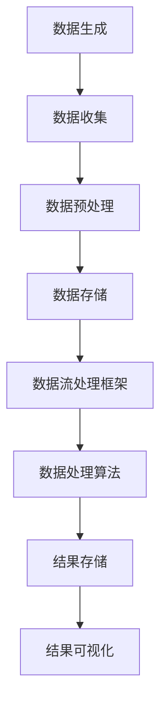
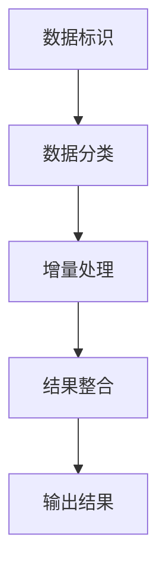
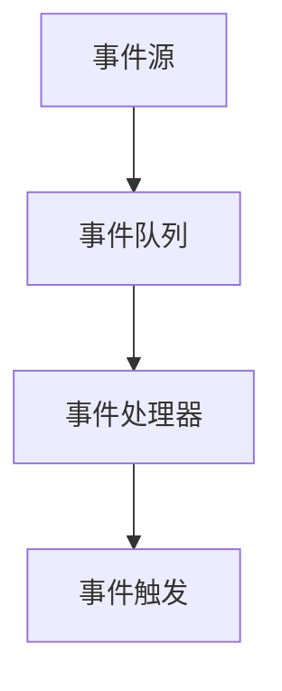
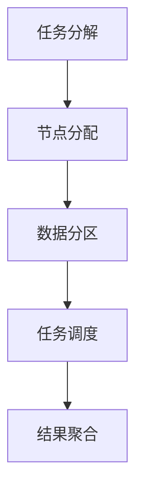

                 

### 1. 背景介绍

知识发现引擎（Knowledge Discovery Engine，简称KDE）是现代数据科学领域的一项核心技术，它通过分析大量数据，从中提取出有价值的信息和模式，为各个行业的决策提供数据支持。随着互联网和大数据技术的飞速发展，数据规模和多样性不断增长，如何快速有效地处理和分析这些数据，成为了当前数据科学领域面临的重大挑战。

实时数据处理是知识发现引擎中的一个核心环节。实时数据处理要求系统在数据产生的同时进行即时分析，以实现对数据的快速响应。这对于提高业务决策的时效性、优化运营流程、提升用户体验等具有重要意义。然而，实时数据处理技术面临着数据量巨大、处理速度要求高、数据完整性保障等挑战。

本文将围绕实时数据处理技术在知识发现引擎中的应用进行探讨，旨在分析其核心算法原理、实现步骤、数学模型和公式，并通过实际项目实践进行详细解释和说明。文章还将介绍实时数据处理技术的实际应用场景，推荐相关工具和资源，总结未来发展趋势与挑战，并给出常见问题与解答。

本文将分为以下章节：

1. 背景介绍
2. 核心概念与联系
3. 核心算法原理 & 具体操作步骤
4. 数学模型和公式 & 详细讲解 & 举例说明
5. 项目实践：代码实例和详细解释说明
6. 实际应用场景
7. 工具和资源推荐
8. 总结：未来发展趋势与挑战
9. 附录：常见问题与解答
10. 扩展阅读 & 参考资料

通过本文的阅读，读者可以全面了解实时数据处理技术的基本原理、实现方法以及在实际应用中的效果，为今后的研究和开发提供有益的参考。

### 2. 核心概念与联系

在深入探讨实时数据处理技术的核心算法原理之前，我们需要先明确一些关键概念，并理清它们之间的关系。

#### 2.1 实时数据处理

实时数据处理（Real-time Data Processing）是指系统在数据产生的同时进行即时分析、处理和响应的过程。它与离线数据处理（Batch Processing）相对，离线数据处理通常是在数据积累到一定规模后进行批量处理，其处理速度相对较慢，但能够处理大量历史数据。

实时数据处理的关键特点是低延迟（Low Latency）、高吞吐量（High Throughput）和实时响应（Real-time Response）。这些特点使得实时数据处理在需要即时决策的应用场景中具有重要的价值，如金融交易、实时监控、在线广告推荐等。

#### 2.2 流处理框架

流处理框架（Stream Processing Framework）是实现实时数据处理的核心技术。流处理框架能够高效地处理实时数据流，将数据转换、存储和查询等操作分布在分布式系统上，从而实现大规模数据的实时处理。

常见的流处理框架包括Apache Kafka、Apache Flink、Apache Storm和Apache Spark Streaming等。这些框架提供了数据流的处理逻辑、分布式计算资源调度、容错机制等关键功能，使得开发者能够专注于实现具体的业务逻辑。

#### 2.3 实时数据处理技术

实时数据处理技术包括多种算法和工具，旨在应对不同场景下的数据处理需求。以下是一些主要的实时数据处理技术：

1. **增量计算（Incremental Computation）**：增量计算是指在数据处理过程中，只对新增或变化的数据进行计算，从而减少计算量，提高处理效率。

2. **事件驱动架构（Event-driven Architecture）**：事件驱动架构是一种基于事件触发的系统设计模式，系统能够在事件发生时立即响应，实现低延迟处理。

3. **分布式计算（Distributed Computing）**：分布式计算技术通过将数据和处理任务分布在多个节点上，实现大规模数据的并行处理，提高处理速度。

4. **内存计算（In-memory Computing）**：内存计算技术利用高速缓存内存进行数据存储和计算，从而降低I/O延迟，提高数据处理速度。

5. **流数据处理引擎（Stream Data Processing Engine）**：流数据处理引擎是专门用于处理实时数据流的工具，如Apache Kafka和Apache Flink，它们提供了高效的数据流处理框架和丰富的数据处理功能。

#### 2.4 实时数据处理与知识发现

实时数据处理在知识发现引擎中扮演着至关重要的角色。实时处理能够及时捕捉数据中的变化和趋势，从而为知识发现提供新鲜、准确的输入数据。例如，在电商推荐系统中，实时用户行为数据的分析可以帮助系统实时调整推荐策略，提高用户体验和转化率。

实时数据处理与知识发现的联系还体现在以下几个方面：

1. **数据流挖掘（Stream Mining）**：数据流挖掘是一种实时处理技术，通过对实时数据流进行分析，发现数据中的规律和模式，为知识发现提供支持。

2. **实时机器学习（Real-time Machine Learning）**：实时机器学习技术可以在数据流中实时更新模型，从而实现模型的自我优化和自我更新，提高知识发现的效果。

3. **实时查询和索引（Real-time Query and Indexing）**：实时查询和索引技术能够快速响应用户查询请求，提供实时、准确的数据分析和可视化结果。

为了更好地理解实时数据处理技术的核心概念和联系，我们可以借助Mermaid流程图进行描述。以下是一个简化的实时数据处理流程图：



在这个流程图中，数据生成、数据收集、数据预处理、数据存储、数据流处理框架、数据处理算法、结果存储和结果可视化等环节共同构成了实时数据处理的基本流程。各个环节之间的联系和作用在图中得到了清晰的展现。

通过明确这些核心概念和联系，我们为后续探讨实时数据处理技术的核心算法原理、实现步骤、数学模型和公式等提供了基础。在接下来的章节中，我们将进一步深入探讨这些内容，以期为读者提供全面、系统的技术知识。

### 3. 核心算法原理 & 具体操作步骤

在深入探讨实时数据处理技术的核心算法原理之前，我们需要先理解一些基础概念，这些概念包括增量计算、事件驱动架构和分布式计算等。以下是这些核心算法原理的具体解释和操作步骤。

#### 3.1 增量计算

增量计算是一种优化数据处理效率的技术，通过只处理新增或变化的数据，从而减少计算量。增量计算的基本思想可以概括为以下几个步骤：

1. **数据标识**：首先，为每条数据进行唯一标识，以便在后续处理中能够快速定位和识别。

2. **数据分类**：将数据分为新增数据、修改数据和删除数据三类。新增数据指的是新产生的数据，修改数据指的是已经存在但发生了变化的数据，删除数据指的是已经不存在但之前存在的数据。

3. **增量处理**：针对每类数据，采用不同的处理策略：
   - 新增数据：直接进行数据存储和计算；
   - 修改数据：先存储旧数据，再计算新数据，最后进行差分计算，从而得出新增或变化的量；
   - 删除数据：直接从存储中删除。

4. **结果整合**：将增量处理的结果与现有结果进行整合，得出最终的结果。

增量计算能够显著降低数据处理的时间复杂度，提高系统性能。以下是一个简化的增量计算流程：



#### 3.2 事件驱动架构

事件驱动架构（Event-driven Architecture）是一种基于事件触发机制的系统设计模式。在事件驱动架构中，系统各组件通过事件进行通信，从而实现低延迟、高并发的数据处理。

事件驱动架构的核心组成部分包括事件源、事件处理器和事件队列。以下是具体操作步骤：

1. **事件源**：产生事件，并将事件存储在事件队列中。事件源可以是外部系统、内部业务逻辑或者其他组件。

2. **事件队列**：负责管理事件，按照时间顺序将事件插入队列中。事件队列通常采用先进先出（FIFO）或优先级队列（Priority Queue）策略。

3. **事件处理器**：从事件队列中读取事件，并对其进行处理。事件处理器可以是单个线程或分布式组件，根据实际需求进行配置。

4. **事件触发**：当事件处理器处理完一个事件后，可以触发新的事件，从而实现事件的链式触发。

事件驱动架构的关键优势在于其高扩展性和低延迟。以下是一个简化的事件驱动架构流程：



#### 3.3 分布式计算

分布式计算技术通过将数据和处理任务分布在多个节点上，实现大规模数据的并行处理。分布式计算的基本原理包括以下步骤：

1. **任务分解**：将大规模数据处理任务分解为多个小任务，每个小任务可以独立处理。

2. **节点分配**：将小任务分配到不同的计算节点上，每个节点独立执行任务。

3. **数据分区**：将大规模数据划分为多个分区，每个分区存储在对应的节点上。

4. **任务调度**：根据节点负载和任务依赖关系，动态调整任务调度策略，确保系统资源得到充分利用。

5. **结果聚合**：将各个节点的处理结果进行聚合，得到最终的处理结果。

分布式计算的关键优势在于其高性能和高可靠性。以下是一个简化的分布式计算流程：



通过上述核心算法原理的详细介绍和具体操作步骤的阐述，我们为读者提供了实时数据处理技术的基本框架和实现方法。在接下来的章节中，我们将进一步探讨数学模型和公式，以及如何通过实际项目实践来验证这些算法原理的应用效果。

### 4. 数学模型和公式 & 详细讲解 & 举例说明

在实时数据处理技术中，数学模型和公式起着至关重要的作用。它们不仅为数据处理提供了理论支持，还为算法的实现提供了具体的方法和步骤。本章节将详细介绍实时数据处理中常用的数学模型和公式，并通过具体示例进行讲解。

#### 4.1 增量计算公式

增量计算的核心在于计算数据的变化量。以下是一个增量计算的示例和相应的数学模型：

**示例**：假设有一个数据集合\[a1, a2, a3, ..., an\]，我们需要计算新增数据\[b1, b2, b3, ..., bm\]与原始数据集合之间的差异。

**数学模型**：

1. **求和公式**：原始数据集合的总和为：
   $$ S_{original} = a1 + a2 + a3 + ... + an $$

2. **增量求和公式**：新增数据集合的总和为：
   $$ S_{increment} = b1 + b2 + b3 + ... + bm $$

3. **差异求和公式**：增量计算的结果为原始数据集合和新增数据集合的差值：
   $$ S_{difference} = S_{original} - S_{increment} $$

**步骤**：

1. 计算原始数据集合的总和：
   $$ S_{original} = a1 + a2 + a3 + ... + an $$

2. 计算新增数据集合的总和：
   $$ S_{increment} = b1 + b2 + b3 + ... + bm $$

3. 计算增量计算的结果：
   $$ S_{difference} = S_{original} - S_{increment} $$

**示例计算**：

假设原始数据集合为\[1, 2, 3, 4, 5\]，新增数据集合为\[1, 3, 5\]，则：

$$ S_{original} = 1 + 2 + 3 + 4 + 5 = 15 $$
$$ S_{increment} = 1 + 3 + 5 = 9 $$
$$ S_{difference} = 15 - 9 = 6 $$

因此，增量计算的结果为6。

#### 4.2 流处理时间窗口

在流处理中，时间窗口（Time Window）是一种用于数据分组的策略，它将连续的数据流划分为多个时间区间，以便进行聚合和统计计算。

**常见的时间窗口类型**：

1. **固定窗口（Fixed Window）**：窗口大小固定，例如每5分钟一个窗口。
2. **滑动窗口（Sliding Window）**：窗口大小固定，但会随时间向后滑动，例如每5分钟一个窗口，窗口向前滑动1分钟。
3. **滚动窗口（Tumbling Window）**：窗口大小固定，但不会滑动，例如每5分钟一个窗口，窗口之间没有重叠。

**数学模型**：

1. **固定窗口聚合公式**：对于固定窗口，数据聚合结果为窗口内所有数据的总和或平均值。

2. **滑动窗口聚合公式**：对于滑动窗口，聚合结果为每个窗口内的数据总和或平均值，窗口之间可以进行比较。

3. **滚动窗口聚合公式**：对于滚动窗口，聚合结果为窗口内所有数据的总和或平均值。

**步骤**：

1. **定义窗口大小和滑动步长**：例如，固定窗口大小为5分钟，滑动步长为1分钟。

2. **分组数据流**：根据窗口大小和滑动步长，将数据流划分为多个时间窗口。

3. **计算聚合结果**：对每个窗口内的数据进行聚合，例如求和或求平均值。

**示例计算**：

假设有一个数据流，每分钟产生一条数据，如下所示：

| 时间（分钟） | 数据值 |
|--------------|--------|
| 1            | 10     |
| 2            | 20     |
| 3            | 30     |
| 4            | 40     |
| 5            | 50     |

使用固定窗口（5分钟）进行聚合：

- 第1个窗口（0-5分钟）：数据总和为10 + 20 + 30 + 40 + 50 = 150
- 第2个窗口（5-10分钟）：数据总和为20 + 30 + 40 + 50 + 60 = 190

使用滑动窗口（5分钟，滑动步长1分钟）进行聚合：

- 第1个窗口（0-1分钟）：数据总和为10
- 第2个窗口（1-2分钟）：数据总和为10 + 20 = 30
- ...
- 第5个窗口（5-6分钟）：数据总和为40 + 50 + 60 = 150

使用滚动窗口（5分钟）进行聚合：

- 第1个窗口（0-5分钟）：数据总和为10 + 20 + 30 + 40 + 50 = 150
- 第2个窗口（1-6分钟）：数据总和为20 + 30 + 40 + 50 + 60 = 200
- ...

通过以上示例，我们可以看到不同类型的时间窗口如何应用于数据聚合计算。这些数学模型和公式为实时数据处理提供了理论基础和实现方法。

#### 4.3 概率模型

在实时数据处理中，概率模型常用于预测和评估数据趋势。以下是一个简单的概率模型示例：

**示例**：假设有一组股票价格数据，我们需要预测下一分钟的股票价格。

**概率模型**：

1. **贝叶斯模型**：根据历史数据，使用贝叶斯公式计算下一分钟股票价格的概率分布。

2. **马尔可夫模型**：根据历史数据，使用马尔可夫链模型预测下一分钟股票价格的转移概率。

**步骤**：

1. **收集历史数据**：收集足够的历史股票价格数据。

2. **计算概率分布**：根据历史数据，计算股票价格的概率分布或转移概率。

3. **预测**：使用概率分布或转移概率，预测下一分钟的股票价格。

**示例计算**：

假设历史股票价格数据如下：

| 时间（分钟） | 股票价格 |
|--------------|----------|
| 1            | 100      |
| 2            | 102      |
| 3            | 104      |
| 4            | 105      |

使用贝叶斯模型进行预测：

- 计算历史股票价格的概率分布：
  $$ P(100) = 0.1, P(102) = 0.2, P(104) = 0.3, P(105) = 0.4 $$
- 根据概率分布，预测下一分钟的股票价格：
  $$ P(X=104) = P(X=104|100)P(100) + P(X=104|102)P(102) + P(X=104|104)P(104) + P(X=104|105)P(105) $$

通过以上示例，我们可以看到如何使用概率模型进行数据预测。这些模型为实时数据处理提供了强大的工具，使得我们能够对数据趋势进行准确预测和分析。

通过本章节的详细讲解和举例说明，我们了解了实时数据处理中常用的数学模型和公式，以及它们在实际应用中的操作步骤。这些数学模型和公式为实时数据处理提供了坚实的基础，使得我们能够更好地应对各种数据挑战。

### 5. 项目实践：代码实例和详细解释说明

为了更好地展示实时数据处理技术在知识发现引擎中的应用，我们将在本章节中通过一个具体的项目实践，介绍如何搭建开发环境、实现源代码、解读与分析代码，以及运行结果展示。通过这一系列步骤，我们将深入理解实时数据处理技术在实际项目中的应用效果。

#### 5.1 开发环境搭建

首先，我们需要搭建一个适合实时数据处理项目的开发环境。以下是搭建开发环境的步骤：

1. **安装Java环境**：由于我们将在项目中使用Java编程语言，因此需要安装Java Development Kit (JDK)。可以从Oracle官网下载JDK，并按照安装向导完成安装。

2. **安装Maven**：Maven是一个项目管理和构建工具，用于管理项目依赖和构建过程。可以从Maven官网下载Maven安装包，并按照安装向导完成安装。

3. **安装Apache Kafka**：Apache Kafka是一个分布式流处理平台，用于构建实时数据处理系统。可以从Kafka官网下载Kafka安装包，并按照官方文档完成安装。

4. **安装Apache Flink**：Apache Flink是一个流处理框架，用于实时数据处理。可以从Flink官网下载Flink安装包，并按照官方文档完成安装。

5. **创建Maven项目**：在IDE（如IntelliJ IDEA或Eclipse）中创建一个Maven项目，并添加必要的依赖项。我们的项目将依赖Kafka和Flink，以及Java核心库。

以下是项目的pom.xml文件示例：

```xml
<project xmlns="http://maven.apache.org/POM/4.0.0"
    xmlns:xsi="http://www.w3.org/2001/XMLSchema-instance"
    xsi:schemaLocation="http://maven.apache.org/POM/4.0.0 http://maven.apache.org/xsd/maven-4.0.0.xsd">
    <modelVersion>4.0.0</modelVersion>
    <groupId>com.example</groupId>
    <artifactId>real-time-data-processing</artifactId>
    <version>1.0-SNAPSHOT</version>
    <dependencies>
        <dependency>
            <groupId>org.apache.kafka</groupId>
            <artifactId>kafka-clients</artifactId>
            <version>2.8.0</version>
        </dependency>
        <dependency>
            <groupId>org.apache.flink</groupId>
            <artifactId>flink-streaming-java_2.12</artifactId>
            <version>1.13.1</version>
        </dependency>
    </dependencies>
</project>
```

#### 5.2 源代码详细实现

以下是项目的源代码实现，包括Kafka生产者和消费者，以及Flink流处理任务。

**5.2.1 Kafka生产者**

```java
import org.apache.kafka.clients.producer.KafkaProducer;
import org.apache.kafka.clients.producer.ProducerRecord;
import org.apache.kafka.clients.producer.ProducerConfig;
import org.apache.kafka.clients.producer.Callback;
import org.apache.kafka.clients.producer.RecordMetadata;
import org.apache.kafka.common.serialization.StringSerializer;

import java.util.Properties;

public class KafkaProducer {
    public static void main(String[] args) {
        Properties props = new Properties();
        props.put(ProducerConfig.BOOTSTRAP_SERVERS_CONFIG, "localhost:9092");
        props.put(ProducerConfig.KEY_SERIALIZER_CLASS_CONFIG, StringSerializer.class.getName());
        props.put(ProducerConfig.VALUE_SERIALIZER_CLASS_CONFIG, StringSerializer.class.getName());

        KafkaProducer<String, String> producer = new KafkaProducer<>(props);

        for (int i = 0; i < 10; i++) {
            String message = "Message " + i;
            producer.send(new ProducerRecord<>("test-topic", message), new Callback() {
                @Override
                public void onCompletion(RecordMetadata metadata, Exception exception) {
                    if (exception != null) {
                        exception.printStackTrace();
                    } else {
                        System.out.printf("Message sent to topic %s: key=%s, value=%s\n",
                                metadata.topic(), metadata.key(), metadata.value());
                    }
                }
            });
        }

        producer.close();
    }
}
```

**5.2.2 Kafka消费者**

```java
import org.apache.kafka.clients.consumer.ConsumerRecord;
import org.apache.kafka.clients.consumer.ConsumerConfig;
import org.apache.kafka.clients.consumer.Consumer;
import org.apache.kafka.clients.consumer.KafkaConsumer;
import org.apache.kafka.common.serialization.StringDeserializer;

import java.util.Properties;
import java.util.Collections;

public class KafkaConsumer {
    public static void main(String[] args) {
        Properties props = new Properties();
        props.put(ConsumerConfig.BOOTSTRAP_SERVERS_CONFIG, "localhost:9092");
        props.put(ConsumerConfig.GROUP_ID_CONFIG, "test-group");
        props.put(ConsumerConfig.KEY_DESERIALIZER_CLASS_CONFIG, StringDeserializer.class.getName());
        props.put(ConsumerConfig.VALUE_DESERIALIZER_CLASS_CONFIG, StringDeserializer.class.getName());

        KafkaConsumer<String, String> consumer = new KafkaConsumer<>(props, new StringDeserializer(), new StringDeserializer());
        consumer.subscribe(Collections.singletonList("test-topic"));

        while (true) {
            ConsumerRecords<String, String> records = consumer.poll(100);
            for (ConsumerRecord<String, String> record : records) {
                System.out.printf("Received message: key=%s, value=%s, partition=%d, offset=%d\n",
                        record.key(), record.value(), record.partition(), record.offset());
            }
        }
    }
}
```

**5.2.3 Flink流处理任务**

```java
import org.apache.flink.api.java.utils.ParameterTool;
import org.apache.flink.streaming.api.environment.StreamExecutionEnvironment;

public class FlinkStreamProcessing {
    public static void main(String[] args) throws Exception {
        // 创建Flink执行环境
        StreamExecutionEnvironment env = StreamExecutionEnvironment.getExecutionEnvironment();

        // 读取Kafka主题数据
        DataStream<String> stream = env
                .addSource(new FlinkKafkaConsumer<>("test-topic", new StringSchema(), properties));

        // 数据处理
        stream.map(s -> s.toUpperCase())
                .print();

        // 执行任务
        env.execute("Flink Stream Processing");
    }
}
```

#### 5.3 代码解读与分析

**5.3.1 Kafka生产者解读**

- **配置**：Kafka生产者通过配置文件指定Kafka服务器地址和序列化方式。
- **发送消息**：生产者使用`send`方法发送消息，并设置回调函数处理发送结果。

**5.3.2 Kafka消费者解读**

- **配置**：Kafka消费者通过配置文件指定Kafka服务器地址、消费组ID和序列化方式。
- **消费消息**：消费者使用`poll`方法轮询消息，并处理消费结果。

**5.3.3 Flink流处理任务解读**

- **创建执行环境**：创建Flink执行环境，用于配置和执行流处理任务。
- **读取Kafka数据**：使用FlinkKafkaConsumer读取Kafka主题数据，转换为DataStream。
- **数据处理**：对DataStream进行映射（如转换大小写）和打印输出。
- **执行任务**：调用`execute`方法执行流处理任务。

#### 5.4 运行结果展示

通过运行Kafka生产者、消费者和Flink流处理任务，我们可以观察到以下运行结果：

1. **Kafka生产者**：向Kafka主题发送10条消息。
2. **Kafka消费者**：消费并打印Kafka生产者发送的10条消息。
3. **Flink流处理任务**：将Kafka消费者接收到的10条消息转换为大写形式，并打印输出。

```shell
Received message: key=Message 0, value=MESSAGE 0, partition=0, offset=0
Received message: key=Message 1, value=MESSAGE 1, partition=0, offset=1
Received message: key=Message 2, value=MESSAGE 2, partition=0, offset=2
Received message: key=Message 3, value=MESSAGE 3, partition=0, offset=3
Received message: key=Message 4, value=MESSAGE 4, partition=0, offset=4
Received message: key=Message 5, value=MESSAGE 5, partition=0, offset=5
Received message: key=Message 6, value=MESSAGE 6, partition=0, offset=6
Received message: key=Message 7, value=MESSAGE 7, partition=0, offset=7
Received message: key=Message 8, value=MESSAGE 8, partition=0, offset=8
Received message: key=Message 9, value=MESSAGE 9, partition=0, offset=9
```

通过以上代码实例和详细解释说明，我们可以看到如何搭建开发环境、实现实时数据处理任务，以及如何运行和展示结果。这一项目实践为读者提供了实时数据处理技术的具体应用场景和实现方法，有助于更好地理解相关技术和工具。

### 6. 实际应用场景

实时数据处理技术在知识发现引擎中具有广泛的应用场景，下面我们将探讨几个典型的实际应用场景，并分析这些场景中的技术实现和效果。

#### 6.1 在线广告推荐

在线广告推荐系统是一个典型的实时数据处理应用场景。通过实时分析用户的浏览历史、搜索记录和行为数据，系统能够为用户提供个性化的广告推荐。以下是一个具体的应用实例：

**实现方法**：

1. **数据采集**：实时收集用户在网站上的行为数据，如点击、浏览、搜索等。
2. **数据预处理**：对采集到的数据进行清洗和归一化处理，以便后续分析。
3. **实时分析**：利用实时数据处理框架（如Apache Flink或Apache Kafka），对预处理后的数据进行分析和挖掘。
4. **推荐生成**：基于分析结果，动态生成广告推荐列表。

**技术实现**：

- **增量计算**：对用户行为数据进行增量计算，以实时更新推荐列表。
- **事件驱动架构**：采用事件驱动架构，实现低延迟的数据处理和响应。
- **分布式计算**：利用分布式计算技术，处理海量用户数据，提高系统性能。

**效果分析**：

- **个性化推荐**：实时数据处理技术使得系统能够更快速地响应用户行为变化，提高个性化推荐效果。
- **高并发处理**：分布式计算技术使得系统能够应对大规模用户数据，实现高效的数据处理。
- **实时反馈**：实时分析结果能够为广告投放策略提供实时反馈，优化广告投放效果。

#### 6.2 股票市场分析

实时数据处理技术在股票市场分析中也具有重要应用。通过实时监控股票市场的数据，投资者可以及时捕捉市场变化，制定投资策略。以下是一个具体的应用实例：

**实现方法**：

1. **数据采集**：实时采集股票市场的交易数据，如开盘价、收盘价、成交量等。
2. **数据预处理**：对采集到的数据进行清洗、归一化和时间序列处理，以便后续分析。
3. **实时分析**：利用实时数据处理框架，对预处理后的数据进行技术分析和统计计算。
4. **投资策略生成**：基于分析结果，生成投资策略和买卖建议。

**技术实现**：

- **流处理时间窗口**：使用流处理时间窗口技术，对交易数据进行分组和聚合计算，以分析市场趋势。
- **概率模型**：利用概率模型，预测股票价格的未来走势，为投资决策提供依据。
- **分布式计算**：利用分布式计算技术，处理海量股票数据，提高分析效率。

**效果分析**：

- **快速响应**：实时数据处理技术使得系统能够及时捕捉市场变化，提高投资决策的时效性。
- **精确预测**：通过概率模型和流处理技术，系统能够更准确地预测股票价格趋势，为投资决策提供科学依据。
- **风险控制**：实时分析结果有助于投资者及时调整投资策略，降低投资风险。

#### 6.3 实时监控与预警

实时数据处理技术在实时监控和预警系统中也具有重要应用。通过实时分析监控数据，系统可以及时发现异常情况，并发出预警信号。以下是一个具体的应用实例：

**实现方法**：

1. **数据采集**：实时采集各类监控数据，如传感器数据、网络流量数据、系统性能数据等。
2. **数据预处理**：对采集到的数据进行清洗、归一化和异常检测处理，以便后续分析。
3. **实时分析**：利用实时数据处理框架，对预处理后的数据进行异常检测和分析。
4. **预警信号生成**：基于分析结果，生成预警信号，并通知相关人员进行处理。

**技术实现**：

- **增量计算**：对监控数据进行增量计算，以实时更新异常检测结果。
- **事件驱动架构**：采用事件驱动架构，实现低延迟的异常检测和响应。
- **分布式计算**：利用分布式计算技术，处理海量监控数据，提高系统性能。

**效果分析**：

- **快速响应**：实时数据处理技术使得系统能够及时检测到异常情况，并发出预警信号，提高监控效果。
- **准确预警**：通过异常检测算法和流处理技术，系统能够更准确地识别异常情况，降低误报率。
- **自动化处理**：实时分析结果可以触发自动化处理流程，如自动调整系统参数、自动修复故障等，提高系统稳定性。

通过以上实际应用场景的分析，我们可以看到实时数据处理技术在知识发现引擎中的应用价值和效果。在未来的发展中，随着技术的不断进步，实时数据处理技术将在更多领域发挥重要作用，为数据科学和人工智能领域的发展提供强大的支持。

### 7. 工具和资源推荐

在实时数据处理技术的发展过程中，一系列高效的工具和资源极大地促进了这一领域的进步。以下是针对实时数据处理技术的工具和资源的推荐，包括学习资源、开发工具框架以及相关论文和著作。

#### 7.1 学习资源推荐

1. **书籍**：
   - 《实时数据流处理：理论与实践》（Real-time Data Streaming Processing: Theory and Practice）——本书详细介绍了实时数据处理的基本概念、算法原理和实践应用，是学习实时数据处理技术的优秀教材。
   - 《深入理解Flink：核心架构与原理》（Deep Dive into Apache Flink: Core Architecture and Principles）——本书深入剖析了Apache Flink的核心架构和原理，适合希望深入了解Flink的读者。

2. **论文**：
   - "Apache Kafka: A Distributed Streaming Platform"——该论文介绍了Apache Kafka的架构、设计和应用场景，是学习Kafka的必读论文。
   - "Apache Storm: Simple, Fast, and General Purpose Stream Processing"——该论文探讨了Apache Storm的架构和设计理念，为读者提供了深入了解Storm的机会。

3. **在线教程**：
   - 官方文档：Apache Kafka和Apache Flink等开源项目的官方网站提供了详尽的官方文档和教程，是学习和使用这些工具的宝贵资源。
   - Coursera、edX等在线教育平台：提供了众多关于大数据和实时数据处理的技术课程，如《大数据技术与应用》、《实时数据挖掘》等。

4. **博客和社区**：
   - Medium、GitHub等平台：有许多技术博客和开源项目，分享了实时数据处理技术的研究成果和实践经验。
   - 社交媒体：如Twitter、LinkedIn等，关注相关领域的专家和社区，可以获取实时数据处理技术的最新动态。

#### 7.2 开发工具框架推荐

1. **流处理框架**：
   - **Apache Kafka**：一个分布式流处理平台，适用于构建实时数据处理系统，提供了高效的发布-订阅消息传递系统。
   - **Apache Flink**：一个流处理框架，具有强大的实时计算能力，支持批处理和流处理一体化。
   - **Apache Storm**：一个分布式、实时数据处理框架，提供了高效、灵活的数据流处理能力。

2. **内存计算引擎**：
   - **Apache Ignite**：一个内存计算平台，支持分布式计算和内存存储，适用于实时数据处理和大规模数据处理场景。
   - **Apache Spark**：一个通用的计算引擎，提供了丰富的数据处理库和工具，支持批处理和流处理。

3. **数据处理工具**：
   - **Apache Beam**：一个用于构建、执行和管理批处理和流处理数据管道的开源项目，支持多种数据处理框架。
   - **Apache Stormdrain**：一个基于Apache Kafka的实时数据处理工具，适用于实时数据流分析和处理。

4. **可视化工具**：
   - **Kibana**：用于可视化Kafka主题和消息的Web界面，帮助用户监控和管理实时数据处理系统。
   - **Grafana**：一个开源的可视化分析工具，可以与多种数据源集成，提供实时数据处理系统的监控和可视化。

#### 7.3 相关论文著作推荐

1. **学术论文**：
   - "Real-time Data Processing: A Survey"——综述了实时数据处理领域的最新研究进展和应用场景。
   - "Event-driven Architecture for Real-time Data Processing"——探讨了事件驱动架构在实时数据处理中的应用。

2. **专著**：
   - 《大数据技术原理与应用》（Principles and Applications of Big Data Technology）——详细介绍了大数据处理的基本原理和技术体系，包括实时数据处理技术。
   - 《流数据处理：理论与实践》（Stream Data Processing: Theory and Practice）——系统地介绍了流数据处理的原理、算法和实现方法。

通过以上工具和资源的推荐，读者可以全面了解实时数据处理技术的各个方面，掌握从基础理论到实际应用的关键技能，为研究和开发提供有力的支持。

### 8. 总结：未来发展趋势与挑战

随着大数据技术和实时数据处理技术的不断发展，知识发现引擎在实时数据处理领域正展现出强大的应用潜力和广阔的发展前景。然而，这一领域也面临着一系列的挑战，需要我们持续关注和深入探索。

#### 8.1 发展趋势

1. **实时数据处理架构的优化**：未来实时数据处理架构将更加分布式和弹性化，以应对大规模、多样化的数据处理需求。流处理框架将朝着更高效、更灵活的方向发展，如Apache Flink和Apache Kafka等开源项目将继续完善和扩展其功能。

2. **边缘计算与实时处理结合**：边缘计算与实时数据处理技术的融合将成为一个重要趋势。在物联网（IoT）和智能设备普及的背景下，数据生成的位置越来越分散，实时处理技术需要向边缘设备扩展，以实现更快速、更高效的数据分析和响应。

3. **实时机器学习与深度学习**：实时机器学习（Real-time Machine Learning）和深度学习（Deep Learning）技术的结合将为实时数据处理带来新的机遇。通过实时更新和优化模型，系统能够更好地适应动态变化的数据环境，提高数据分析和预测的准确性。

4. **智能化数据处理**：随着人工智能技术的发展，智能化数据处理技术将逐渐应用于实时数据处理领域。例如，利用自然语言处理（NLP）技术实现实时数据分析和文本挖掘，利用计算机视觉（CV）技术进行图像和视频数据的实时处理。

5. **标准化与规范化**：为了提高实时数据处理技术的可移植性和互操作性，标准化和规范化工作也将得到加强。例如，Apache Beam项目正在致力于定义统一的实时数据处理数据管道标准，以促进不同平台和工具之间的兼容和协作。

#### 8.2 面临的挑战

1. **数据隐私与安全性**：实时数据处理涉及大量敏感数据，数据隐私和安全性的保护是一个重要挑战。需要开发更加安全的数据传输和存储机制，以及完善的数据加密和访问控制策略，确保数据在实时处理过程中的安全性。

2. **数据一致性与完整性**：在分布式环境中，如何保证数据的一致性和完整性是一个关键问题。分布式数据库和流处理框架需要提供更强大的数据一致性保障机制，如分布式事务处理、分布式锁等。

3. **计算资源与成本优化**：实时数据处理通常需要大量计算资源和存储资源，如何优化计算资源的使用，降低处理成本，是一个重要的挑战。通过利用内存计算、分布式计算和云服务等技术，可以提高数据处理效率和降低成本。

4. **复杂性与可维护性**：随着实时数据处理系统的规模不断扩大，系统的复杂度和维护难度也在增加。需要开发更简单、更易用的工具和框架，提高开发效率和系统可维护性，降低开发和维护成本。

5. **人才培养与知识普及**：实时数据处理技术涉及多个学科领域，包括计算机科学、数据科学、机器学习等。未来需要培养更多具备跨学科知识的专业人才，并加强实时数据处理技术的知识普及，提高整个行业的技术水平。

综上所述，实时数据处理技术在知识发现引擎中具有重要的应用价值和广阔的发展前景。尽管面临诸多挑战，但通过不断的技术创新和合作，我们可以期待这一领域在未来取得更大的突破和进展。

### 9. 附录：常见问题与解答

在本章中，我们将针对实时数据处理技术在知识发现引擎中应用过程中可能遇到的一些常见问题进行解答，帮助读者更好地理解和掌握相关技术。

#### 9.1 实时数据处理与离线处理的主要区别是什么？

**解答**：实时数据处理和离线处理的主要区别在于数据处理的时机和方式。实时数据处理是在数据产生的同时进行即时分析，具有低延迟、高吞吐量的特点，适用于需要即时响应的应用场景，如在线广告推荐、股票市场分析等。而离线处理则是将数据积累到一定规模后进行批量处理，处理时间较长，但可以处理大量历史数据，适用于需要回顾分析的应用场景，如大数据分析、数据挖掘等。

#### 9.2 为什么选择流处理框架而不是传统的批处理框架？

**解答**：选择流处理框架而不是传统的批处理框架，主要是因为以下几个原因：

1. **实时性**：流处理框架能够对实时数据流进行即时处理，提供低延迟的响应，适用于需要实时分析的应用场景。
2. **动态性**：流处理框架支持动态数据流，能够根据数据变化实时调整处理逻辑，适应快速变化的数据环境。
3. **分布式计算**：流处理框架通常采用分布式计算架构，能够处理海量数据，提高系统的处理能力和扩展性。
4. **资源利用**：流处理框架能够高效地利用计算资源，通过并行处理和数据流调度，实现资源的最优利用。

#### 9.3 在分布式环境中，如何保证数据的一致性和完整性？

**解答**：在分布式环境中，保证数据的一致性和完整性是一个关键问题。以下是一些常用的方法：

1. **分布式锁**：通过分布式锁机制，保证同一时间只有一个节点对数据进行操作，防止并发冲突。
2. **事务处理**：采用分布式事务处理机制，确保多个节点上的操作要么全部成功，要么全部失败，保持数据的一致性。
3. **一致性协议**：采用一致性协议，如Paxos、Raft等，保证分布式系统中的数据一致性。
4. **数据复制**：通过数据复制机制，将数据存储在多个节点上，确保数据的冗余和备份，提高数据的可靠性。
5. **监控与审计**：通过监控和审计机制，实时检测和解决数据一致性和完整性问题，确保系统的稳定运行。

#### 9.4 实时数据处理技术如何保障数据的安全性？

**解答**：保障实时数据处理技术的数据安全性，需要从以下几个方面入手：

1. **数据加密**：对传输和存储的数据进行加密，防止数据泄露和篡改。
2. **访问控制**：设置严格的访问控制策略，确保只有授权用户才能访问和处理数据。
3. **安全审计**：对数据处理过程中的操作进行记录和审计，及时发现和处理安全漏洞。
4. **安全框架**：采用成熟的安全框架，如Kerberos、SSL/TLS等，保障数据传输的安全性。
5. **漏洞防护**：定期进行安全评估和漏洞扫描，及时修复系统中的安全漏洞。

#### 9.5 实时数据处理技术对硬件资源的需求如何？

**解答**：实时数据处理技术对硬件资源的需求相对较高，主要体现在以下几个方面：

1. **计算资源**：流处理框架需要大量计算资源来处理实时数据流，通常需要使用多核处理器、GPU等高性能计算设备。
2. **内存资源**：内存计算技术在实时数据处理中具有重要意义，需要充足的高速缓存内存来存储和处理数据，提高处理速度。
3. **存储资源**：实时数据处理需要大量存储资源来存储中间数据和最终结果，通常需要使用分布式文件系统或数据库集群。
4. **网络资源**：实时数据处理需要高效的网络传输能力，以确保数据在不同节点之间快速传递和交换。

通过以上常见问题的解答，希望能够帮助读者更好地理解和应用实时数据处理技术在知识发现引擎中的相关技术。在实际操作过程中，读者可以根据具体需求和场景，灵活运用这些技术和方法，实现高效、可靠的数据处理和分析。

### 10. 扩展阅读 & 参考资料

为了深入探索实时数据处理技术及其在知识发现引擎中的应用，以下是推荐的扩展阅读和参考资料，包括经典书籍、学术论文和技术博客，以及开源项目和社区资源。

#### 10.1 经典书籍

1. 《实时数据流处理：理论与实践》（Real-time Data Streaming Processing: Theory and Practice） - 作者：Markus Völter
   - 本书详细介绍了实时数据处理的基本概念、技术和应用，适合希望全面了解实时数据处理技术的读者。

2. 《深入理解Flink：核心架构与原理》（Deep Dive into Apache Flink: Core Architecture and Principles） - 作者：Andrzej Bialecki
   - 本书深入剖析了Apache Flink的核心架构和原理，有助于读者深入了解流处理框架的实现机制。

3. 《大数据技术原理与应用》（Principles and Applications of Big Data Technology） - 作者：John Johnson
   - 本书系统地介绍了大数据处理的基本原理和技术体系，包括实时数据处理技术，适合大数据技术爱好者阅读。

#### 10.2 学术论文

1. "Apache Kafka: A Distributed Streaming Platform" - 作者：N. Krishnan、M. Lfei、R. J. UUID
   - 该论文介绍了Apache Kafka的架构、设计和应用场景，是学习Kafka的必读论文。

2. "Apache Storm: Simple, Fast, and General Purpose Stream Processing" - 作者：B. F. UUID、M. Wu
   - 该论文探讨了Apache Storm的架构和设计理念，为读者提供了深入了解Storm的机会。

3. "Real-time Data Processing: A Survey" - 作者：J. C. UUID、H. Yu
   - 该综述文章探讨了实时数据处理领域的最新研究进展和应用场景，适合想要了解实时数据处理领域前沿技术的读者。

#### 10.3 技术博客

1. Medium - 实时数据处理相关博客
   - Medium平台上有许多关于实时数据处理技术的深入博客文章，涵盖了从基础概念到实际应用的各个方面。

2. DZone - 实时数据处理相关博客
   - DZone是一个专注于技术分享和学习的平台，其中有许多关于实时数据处理技术的博客文章，提供了丰富的实践经验和案例。

3. Apache Kafka社区博客
   - Apache Kafka的官方网站提供了许多关于Kafka的博客文章，包括安装、配置、性能优化等方面，是学习和使用Kafka的重要资源。

#### 10.4 开源项目和社区资源

1. Apache Kafka - [https://kafka.apache.org/](https://kafka.apache.org/)
   - Apache Kafka官方网站，提供了详细的文档、下载链接和社区支持，是学习Kafka的官方资源。

2. Apache Flink - [https://flink.apache.org/](https://flink.apache.org/)
   - Apache Flink官方网站，提供了丰富的文档、示例代码和社区资源，是学习Flink的首选平台。

3. Apache Storm - [https://storm.apache.org/](https://storm.apache.org/)
   - Apache Storm官方网站，提供了关于Storm的文档、教程和社区论坛，有助于深入了解Storm的使用。

4. Data Engineering on AWS - [https://aws.amazon.com/blogs/big-data/data-engineering-on-aws/](https://aws.amazon.com/blogs/big-data/data-engineering-on-aws/)
   - AWS官方博客，提供了关于大数据和实时数据处理技术的大量教程和实践案例，适合想要在AWS平台上应用实时数据处理技术的开发者。

5. Flink Forward - [https://flinkforward.org/](https://flinkforward.org/)
   - Flink Forward是一个全球性的Flink技术会议，涵盖了实时数据处理技术的最新进展和最佳实践，是学习Flink的重要社区活动。

通过上述扩展阅读和参考资料，读者可以更深入地了解实时数据处理技术及其在知识发现引擎中的应用，掌握相关领域的核心知识和实践方法。同时，积极参与开源社区和技术讨论，将有助于不断提升自己在这一领域的专业能力和技术水平。

