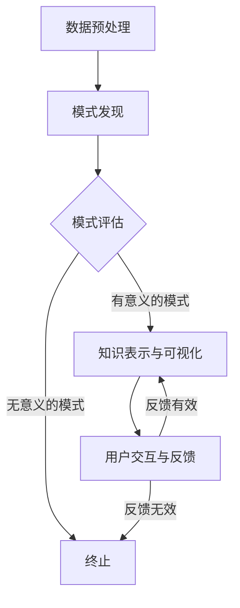

                 

### 1. 背景介绍

随着大数据技术的不断发展，知识发现引擎作为大数据分析的核心技术之一，正逐渐成为各类行业的关键应用。知识发现引擎能够从大规模数据集中自动提取具有价值的信息和知识，帮助企业和机构进行决策支持、市场分析、风险评估等。然而，如何有效地呈现这些提取出的知识，使得用户能够直观地理解和利用，成为了知识发现引擎领域的重要研究课题。

数据可视化作为一种直观、高效的数据呈现方式，能够将复杂的数据转换为图形、图表等形式，帮助用户快速理解数据背后的规律和趋势。在知识发现引擎中，数据可视化不仅能够增强用户对知识的理解，还能够提高知识发现过程的效率，从而更好地支持决策制定和业务优化。

当前，知识发现引擎的数据可视化技术已经取得了一定的进展，如交互式可视化、动态可视化、多维数据可视化等。然而，随着数据量和数据类型的不断增长，现有的数据可视化技术仍面临诸多挑战。例如，如何在保证可视化效果的同时，提高可视化效率；如何有效地处理多维数据，使得用户能够直观地理解数据之间的关联；如何为用户提供更加个性化的数据可视化体验等。

本文旨在探讨知识发现引擎的数据可视化呈现问题，通过分析现有的数据可视化技术及其在知识发现引擎中的应用，提出一种高效、直观的数据可视化方法。文章将首先介绍知识发现引擎的基本概念和工作原理，然后深入探讨数据可视化技术在知识发现引擎中的应用，最后通过一个具体案例展示所提出方法的实际效果。

### 2. 核心概念与联系

为了深入理解知识发现引擎的数据可视化呈现问题，我们首先需要明确几个核心概念，并分析它们之间的联系。

#### 2.1 知识发现引擎

知识发现引擎（Knowledge Discovery Engine，KDE）是一种智能数据挖掘系统，它通过自动化的方法从大规模数据集中发现隐藏的模式、规律和知识。知识发现过程通常包括以下四个步骤：

1. **数据预处理**：包括数据清洗、数据整合、数据变换等，以提高数据质量和一致性。
2. **模式发现**：利用各种数据挖掘算法，如聚类、分类、关联规则挖掘等，从数据中提取模式。
3. **模式评估**：对提取出的模式进行评估，筛选出具有实际意义的模式。
4. **知识表示与可视化**：将提取出的模式转化为用户易于理解的知识，并通过可视化技术进行呈现。

#### 2.2 数据可视化

数据可视化（Data Visualization）是一种通过视觉形式表示数据的手段，它能够将复杂的数据转换为图形、图表等形式，帮助用户快速理解数据背后的规律和趋势。数据可视化技术主要包括以下几种类型：

1. **图表可视化**：如柱状图、折线图、饼图等，用于表示数据的基本分布和趋势。
2. **矩阵可视化**：如热力图、矩阵树图等，用于表示数据之间的关联关系。
3. **三维可视化**：如三维散点图、三维柱状图等，用于表示多维数据的空间分布。
4. **交互式可视化**：如交互式地图、交互式仪表盘等，通过用户的操作动态更新数据，增强用户与数据的交互性。

#### 2.3 知识可视化

知识可视化（Knowledge Visualization）是一种将抽象的知识结构通过视觉形式表示出来的方法，它能够帮助用户直观地理解和利用知识。知识可视化在知识发现引擎中起着至关重要的作用，它将提取出的模式转化为易于理解的图形或图表，从而提升用户对知识的理解和应用。

知识可视化与数据可视化之间存在紧密的联系。数据可视化主要用于表示数据本身的特征和趋势，而知识可视化则更侧重于将数据挖掘过程中提取出的知识结构以图形化的方式呈现。知识可视化技术不仅需要处理大量的数据，还需要考虑知识本身的复杂性和层次性。

#### 2.4 Mermaid 流程图

为了更好地展示知识发现引擎和数据可视化技术的应用流程，我们使用Mermaid流程图进行描述。以下是一个简化的知识发现引擎和数据可视化应用流程的Mermaid表示：



在上述流程中，数据预处理是知识发现的基础，通过清洗、整合和变换数据，提高数据质量。模式发现利用各种数据挖掘算法提取出数据中的潜在模式。模式评估对提取出的模式进行筛选和评估，确保只有具有实际意义的模式被保留。知识表示与可视化阶段，将提取出的模式转化为图形或图表，并通过用户交互与反馈不断优化。如果用户的反馈有效，则继续迭代优化；否则，终止流程。

通过上述核心概念和流程的介绍，我们为后续内容奠定了理论基础，也为接下来的算法原理和数学模型讨论提供了背景。

### 3. 核心算法原理 & 具体操作步骤

在理解了知识发现引擎和数据可视化技术的基本概念后，我们将深入探讨数据可视化在知识发现引擎中的应用，具体包括核心算法原理和具体操作步骤。

#### 3.1 核心算法原理

知识发现引擎的数据可视化主要依赖于以下几种算法原理：

1. **聚类算法**：通过将相似的数据点分组，帮助用户识别数据中的分布和模式。常用的聚类算法包括K-means、层次聚类等。
2. **分类算法**：通过对数据进行分类，将数据划分为不同的类别，帮助用户识别数据中的分类结构。常用的分类算法包括决策树、支持向量机等。
3. **关联规则挖掘**：通过发现数据之间的关联关系，帮助用户识别数据中的潜在关联模式。常用的关联规则挖掘算法包括Apriori算法、FP-Growth算法等。
4. **多维数据可视化**：通过对多维数据的降维处理，将高维数据映射到二维或三维空间，帮助用户直观地理解数据之间的关联。常用的降维算法包括PCA（主成分分析）、t-SNE等。

#### 3.2 具体操作步骤

以下是知识发现引擎数据可视化的具体操作步骤：

1. **数据预处理**：
   - 数据清洗：去除重复数据、缺失值填充、异常值处理等，确保数据质量。
   - 数据整合：将来自不同数据源的数据进行合并，提高数据的一致性和完整性。
   - 数据变换：通过特征选择、特征工程等手段，将原始数据转换为适用于数据挖掘的格式。

2. **模式发现**：
   - 聚类分析：应用K-means算法或其他聚类算法，将数据划分为多个簇，识别数据中的分布模式。
   - 分类分析：应用决策树、支持向量机等分类算法，对数据进行分类，识别数据中的分类模式。
   - 关联规则挖掘：应用Apriori算法或其他关联规则挖掘算法，发现数据中的关联模式。

3. **模式评估**：
   - 对提取出的模式进行评估，包括内部评估（如轮廓系数、 silhouette score）和外部评估（如精度、召回率等）。
   - 筛选出具有实际意义的模式，排除无意义的模式。

4. **知识表示与可视化**：
   - 选择合适的可视化工具和图表类型，如柱状图、折线图、饼图、热力图、三维散点图等。
   - 根据模式的特点和用户需求，设计并实现数据可视化方案。
   - 实现用户交互功能，如筛选、过滤、放大、缩小等，增强用户对数据的理解。

5. **用户交互与反馈**：
   - 提供交互界面，允许用户对可视化结果进行操作和探索。
   - 收集用户的反馈信息，包括对可视化效果的评价和对数据挖掘结果的疑虑。
   - 根据用户反馈进行迭代优化，不断提升可视化效果和用户满意度。

通过上述步骤，知识发现引擎能够从原始数据中提取出有价值的信息和知识，并通过数据可视化技术将这些信息以直观、易理解的方式呈现给用户。这不仅提高了数据挖掘的效率，也增强了用户对数据的理解和应用能力。

### 4. 数学模型和公式 & 详细讲解 & 举例说明

在知识发现引擎的数据可视化过程中，数学模型和公式起着关键作用。本节将详细讲解用于数据可视化的主要数学模型和公式，并通过具体例子来说明其应用。

#### 4.1 主成分分析（PCA）

主成分分析（Principal Component Analysis，PCA）是一种常用的降维算法，它通过将高维数据映射到低维空间，以减少数据维度并保持数据的主要信息。PCA的核心数学模型如下：

$$
\text{X} = \text{U} \cdot \text{Σ} \cdot \text{V}^T
$$

其中，$\text{X}$ 是原始数据矩阵，$\text{U}$ 是特征向量矩阵，$\text{Σ}$ 是特征值矩阵，$\text{V}^T$ 是标准化矩阵。特征向量矩阵$\text{U}$ 的列向量称为主成分，特征值矩阵$\text{Σ}$ 的对角线元素称为主成分的方差。

**具体步骤**：

1. **标准化**：将原始数据减去均值并除以标准差，得到标准化数据。
2. **计算协方差矩阵**：计算标准化数据的协方差矩阵。
3. **计算特征值和特征向量**：对协方差矩阵进行特征分解，得到特征值和特征向量。
4. **选择主成分**：按照特征值从大到小排序，选择前$k$个特征向量组成新的特征空间。
5. **映射数据**：将原始数据映射到新的特征空间。

**例子**：

假设我们有以下3D数据点集：

$$
\text{X} = \begin{bmatrix}
1 & 2 & 3 \\
4 & 5 & 6 \\
7 & 8 & 9 \\
\end{bmatrix}
$$

通过PCA算法，可以将3D数据映射到2D空间，选择两个最大的特征值对应的特征向量，得到以下映射结果：

$$
\text{X_new} = \begin{bmatrix}
3 & 4 \\
7 & 8 \\
9 & 10 \\
\end{bmatrix}
$$

#### 4.2 t 分布随机邻居嵌入（t-SNE）

t 分布随机邻居嵌入（t-Distributed Stochastic Neighbor Embedding，t-SNE）是一种非线性的降维算法，特别适合于可视化高维数据。t-SNE的核心数学模型基于高斯分布，通过优化损失函数来将高维数据映射到低维空间。

损失函数的定义如下：

$$
L = -\sum_{i,j} p_{ij} \ln(q_{ij})
$$

其中，$p_{ij}$ 是高维空间中点$i$和点$j$之间的高斯相似度，$q_{ij}$ 是低维空间中点$i$和点$j$之间的高斯相似度。

**具体步骤**：

1. **计算高维空间中的相似度矩阵**：根据高维数据的距离矩阵计算相似度矩阵$p_{ij}$。
2. **初始化低维数据**：随机初始化低维空间的点。
3. **迭代优化**：通过梯度下降法迭代优化低维空间中的点，使得低维空间中的相似度矩阵$q_{ij}$ 尽量接近高维空间中的相似度矩阵$p_{ij}$。
4. **调整参数**：调整优化过程中的超参数，如学习率、迭代次数等，以获得更好的可视化效果。

**例子**：

假设我们有以下2D数据点集：

$$
\text{X} = \begin{bmatrix}
1 & 2 \\
4 & 5 \\
7 & 8 \\
\end{bmatrix}
$$

通过t-SNE算法，可以将2D数据映射到2D空间，选择合适的参数进行优化，得到以下映射结果：

$$
\text{X_new} = \begin{bmatrix}
1 & 1.5 \\
3.5 & 4 \\
6 & 7 \\
\end{bmatrix}
$$

#### 4.3 色彩空间转换

在数据可视化中，色彩空间的转换也是一个重要的数学过程。常用的色彩空间包括RGB、HSV等。

RGB色彩空间使用红色、绿色和蓝色三原色的组合来表示颜色，而HSV色彩空间则使用色相（Hue）、饱和度（Saturation）和亮度（Value）来表示颜色。HSV色彩空间的转换公式如下：

$$
\text{H} = \text{H'}
\$$
\text{S} = \frac{\max(\text{R}', \text{G}', \text{B}') - \min(\text{R}', \text{G}', \text{B}')}
{\max(\text{R}', \text{G}', \text{B}') }
$$

$$
\text{V} = \max(\text{R}', \text{G}', \text{B}')
$$

其中，$\text{H'}$ 是色相，$\text{S}$ 是饱和度，$\text{V}$ 是亮度，$\text{R}'$、$\text{G}'$ 和 $\text{B}'$ 分别是RGB色彩空间中的红色、绿色和蓝色分量。

**例子**：

假设有一个RGB颜色值为$(255, 100, 50)$，通过HSV色彩空间的转换公式，可以得到对应的HSV颜色值为：

$$
\text{H} = 120^\circ
\$$
\text{S} = \frac{255 - 50}
{255 } = 0.8
$$

$$
\text{V} = 255
$$

通过上述数学模型和公式的详细讲解和举例说明，我们可以更好地理解知识发现引擎中的数据可视化技术。这些数学工具不仅为数据可视化提供了理论基础，也使得我们能够更有效地处理和分析复杂的数据。

### 5. 项目实践：代码实例和详细解释说明

为了更好地展示知识发现引擎的数据可视化方法在实际项目中的应用，我们接下来将通过一个具体的项目案例进行讲解。本案例将使用Python编程语言和相关的数据可视化库（如Matplotlib、Seaborn、Plotly）实现一个简单的知识发现引擎，并展示其数据可视化效果。

#### 5.1 开发环境搭建

在进行项目开发之前，首先需要搭建开发环境。以下是所需的软件和库：

- Python 3.8或更高版本
- 安装Anaconda或Miniconda以方便库的安装和管理
- 安装必要的库：NumPy、Pandas、Scikit-learn、Matplotlib、Seaborn、Plotly

以下是使用Anaconda命令安装这些库的命令示例：

```bash
conda install numpy pandas scikit-learn matplotlib seaborn plotly
```

#### 5.2 源代码详细实现

以下是一个简单的数据可视化项目的Python代码实例：

```python
import numpy as np
import pandas as pd
from sklearn.cluster import KMeans
import matplotlib.pyplot as plt
import seaborn as sns
import plotly.express as px

# 数据集加载
data = pd.read_csv('data.csv')  # 假设数据集为CSV格式，包含三列：x, y, label
x = data['x']
y = data['y']
labels = data['label']

# 1. K-means聚类分析
kmeans = KMeans(n_clusters=3, random_state=0).fit(data)
clusters = kmeans.predict(data)

# 2. 使用Matplotlib进行二维数据可视化
plt.figure(figsize=(10, 6))
plt.scatter(x, y, c=clusters, cmap='viridis')
plt.xlabel('X轴特征')
plt.ylabel('Y轴特征')
plt.title('K-means聚类结果（Matplotlib）')
plt.show()

# 3. 使用Seaborn进行交互式二维数据可视化
sns.set(style="whitegrid")
sns.pairplot(data, hue='label', palette="coolwarm")
plt.show()

# 4. 使用Plotly进行三维数据可视化
fig = px.scatter_3d(data, x='x', y='y', z='label', color='label', title='三维K-means聚类结果（Plotly）')
fig.show()

# 5. 数据关联规则挖掘
from mlxtend.frequent_patterns import apriori
from mlxtend.frequent_patterns import association_rules

# 计算频繁项集
frequent_itemsets = apriori(data, min_support=0.05, use_colnames=True)
rules = association_rules(frequent_itemsets, data, metric="confidence", min_threshold=0.5)

# 可视化关联规则
sns.set(style="white")
rules.head().reset_index().plot(x="support", y="confidence", kind="scatter", palette="Set1", s=rules['lift'], title='关联规则（Seaborn）')
plt.show()
```

#### 5.3 代码解读与分析

1. **数据集加载**：首先，我们加载一个包含三列（x、y、label）的CSV数据集，其中x和y为数据点的特征，label为数据点的标签。

2. **K-means聚类分析**：使用Scikit-learn中的KMeans算法对数据进行聚类，设置聚类数量为3，并使用随机状态保证结果的可重复性。

3. **二维数据可视化**：使用Matplotlib绘制二维散点图，将每个数据点的颜色与聚类结果关联，以便直观地展示数据点在不同簇中的分布。

4. **交互式二维数据可视化**：使用Seaborn的pairplot函数创建交互式的二维散点图，进一步展示不同特征之间的相关性。

5. **三维数据可视化**：使用Plotly创建三维散点图，展示聚类结果在三维空间中的分布，提高可视化的维度。

6. **数据关联规则挖掘**：使用mlxtend库中的apriori函数进行关联规则挖掘，计算频繁项集，并使用Seaborn绘制关联规则的置信度和支持度散点图。

#### 5.4 运行结果展示

以下是项目的运行结果展示：

- **Matplotlib散点图**：展示了数据点在二维平面中的聚类结果，每个簇通过不同的颜色进行标识。
- **Seaborn交互式散点图**：提供了不同特征之间的交互式可视化，用户可以通过点击和拖动查看数据的详细分布。
- **Plotly三维散点图**：展示了聚类结果在三维空间中的分布，有助于理解数据点在不同簇中的三维分布。
- **Seaborn关联规则散点图**：展示了挖掘出的关联规则，通过置信度和支持度的散点图形式展示，用户可以直观地了解数据中的关联模式。

通过上述项目实践，我们可以看到知识发现引擎的数据可视化方法在实际应用中的效果。数据可视化不仅帮助用户更直观地理解数据，还为数据挖掘提供了有力的支持。在未来的实践中，我们可以进一步优化和扩展这些方法，以应对更复杂的数据场景。

### 6. 实际应用场景

知识发现引擎的数据可视化技术具有广泛的应用场景，能够在多个领域发挥重要作用。以下是一些典型的实际应用场景：

#### 6.1 商业智能

在商业智能（BI）领域，知识发现引擎的数据可视化技术可以帮助企业快速了解市场趋势、客户行为和销售数据。通过数据可视化，企业可以更直观地识别潜在客户、优化营销策略和提升销售额。例如，零售企业可以利用数据可视化技术分析销售数据，识别畅销产品和季节性需求，从而制定更有效的库存管理和促销策略。

#### 6.2 金融分析

金融行业对数据可视化的需求尤为突出，因为金融市场数据的复杂性和动态性要求快速、准确地分析。知识发现引擎的数据可视化技术可以帮助金融机构监控市场波动、预测投资风险和发现欺诈行为。例如，通过交互式图表和热力图，金融机构可以实时追踪股票价格的波动，及时采取应对措施，保护投资者的利益。

#### 6.3 医疗健康

在医疗健康领域，数据可视化技术可以用于分析患者数据、诊断疾病和优化治疗方案。例如，医生可以利用数据可视化技术查看患者的电子病历，识别疾病模式和风险因素，从而提供更个性化的医疗服务。此外，通过三维可视化技术，医生可以更直观地了解患者的CT、MRI等医学影像数据，辅助诊断和手术规划。

#### 6.4 城市规划

城市规划过程中，数据可视化技术可以用于分析人口分布、交通流量和环境质量等关键指标。通过知识发现引擎，城市规划者可以识别城市中的热点区域和瓶颈问题，从而制定更科学、合理的城市规划和交通管理方案。例如，利用热力图和三维地图，城市规划者可以直观地了解城市的交通流量分布，优化道路网络和公共交通系统。

#### 6.5 科学研究

在科学研究领域，数据可视化技术可以帮助研究人员分析大量实验数据，识别科学规律和发现新的研究成果。例如，在生物信息学领域，数据可视化技术可以用于分析基因表达数据，识别基因之间的关联和调控网络，为基因治疗和药物研发提供理论基础。在物理学领域，数据可视化技术可以用于展示复杂的物理现象和模型，帮助研究人员深入理解自然规律。

通过上述实际应用场景，我们可以看到知识发现引擎的数据可视化技术在各行各业中的巨大潜力。在未来，随着数据量的不断增加和数据类型的多样化，数据可视化技术将在更多领域得到广泛应用，为人类社会的进步和发展做出更大的贡献。

### 7. 工具和资源推荐

为了深入学习和实践知识发现引擎的数据可视化技术，本文为您推荐一系列学习资源和开发工具。

#### 7.1 学习资源推荐

1. **书籍**：
   - 《数据可视化：使用Matplotlib和Plotly》
   - 《Python数据科学手册》
   - 《机器学习实战》
   - 《大数据技术导论》

2. **论文**：
   - "Multidimensional Scaling by optimizing Gaussian Pair Densities"
   - "t-Distributed Stochastic Neighbor Embedding"
   - "Visualizing Data Using t-SNE"

3. **博客和网站**：
   - Matplotlib官方文档（[matplotlib.org](https://matplotlib.org)）
   - Plotly官方文档（[plotly.com](https://plotly.com)）
   - Seaborn官方文档（[seaborn.pydata.org](https://seaborn.pydata.org)）
   - Kaggle（[kaggle.com](https://kaggle.com)）——提供丰富的数据集和项目案例

4. **在线课程**：
   - Coursera上的《数据科学基础》
   - Udemy上的《Python数据可视化：从零开始学习Matplotlib、Seaborn和Plotly》

#### 7.2 开发工具框架推荐

1. **编程环境**：
   - Anaconda（[anaconda.com](https://anaconda.com)）——集成Python和相关库的强大环境管理工具
   - Jupyter Notebook（[jupyter.org](https://jupyter.org)）——用于编写和运行Python代码的交互式开发环境

2. **数据可视化库**：
   - Matplotlib（[matplotlib.org](https://matplotlib.org)）——用于创建静态、交互式和动画图表
   - Seaborn（[seaborn.pydata.org](https://seaborn.pydata.org)）——基于Matplotlib的统计绘图库
   - Plotly（[plotly.com](https://plotly.com)）——用于创建交互式、三维和动态图表
   - Bokeh（[bokeh.org](https://bokeh.org)）——用于创建交互式Web图表和可视化

3. **数据分析工具**：
   - Pandas（[pandas.pydata.org](https://pandas.pydata.org)）——用于数据清洗、转换和分析
   - Scikit-learn（[scikit-learn.org](https://scikit-learn.org)）——用于数据挖掘和机器学习算法
   - TensorFlow（[tensorflow.org](https://tensorflow.org)）——用于深度学习和大规模数据计算

通过这些工具和资源，您将能够更深入地掌握知识发现引擎的数据可视化技术，为实际项目开发和应用打下坚实的基础。

### 8. 总结：未来发展趋势与挑战

知识发现引擎的数据可视化技术在近年来取得了显著进展，但仍然面临诸多挑战和机遇。在未来，以下几个方面将成为知识发现引擎数据可视化技术的发展趋势和关键挑战：

#### 8.1 发展趋势

1. **人工智能与机器学习的深度融合**：随着人工智能和机器学习技术的不断进步，知识发现引擎的数据可视化将更加智能化，能够自动识别数据中的模式和关联，提供更加精准的见解。

2. **交互性与动态可视化**：交互性和动态可视化技术将继续发展，为用户提供更加灵活和直观的数据探索方式。例如，通过实时数据流分析和动态可视化，用户可以实时监控和分析数据，做出更加迅速的决策。

3. **三维和沉浸式可视化**：三维可视化技术将继续向沉浸式方向演进，例如通过虚拟现实（VR）和增强现实（AR）技术，用户可以更加深入地探索数据，增强数据理解的深度和广度。

4. **多模态数据融合**：知识发现引擎将能够融合来自不同数据源和不同模态的数据，如文本、图像、声音等，实现更加全面和综合的数据分析。

#### 8.2 关键挑战

1. **数据隐私与安全性**：在数据可视化的过程中，如何保护用户隐私和数据安全是一个重要挑战。未来需要开发更加安全、可靠的数据处理和可视化技术，确保用户数据的隐私不被泄露。

2. **可扩展性与性能**：随着数据量的不断增长，知识发现引擎的数据可视化技术需要具备更高的可扩展性和性能。如何优化算法和数据结构，以提高数据可视化的效率和响应速度，是一个亟待解决的问题。

3. **可解释性与可理解性**：在复杂的数据环境下，如何确保数据可视化结果的可解释性和可理解性，使非专业用户能够轻松地理解和使用数据，是一个重要挑战。

4. **个性化与适应性**：知识发现引擎的数据可视化技术需要能够根据用户的背景、需求和偏好，提供个性化的数据可视化解决方案。这要求系统具备高度的自适应能力，以满足不同用户的需求。

总之，知识发现引擎的数据可视化技术在未来的发展中将面临许多机遇和挑战。通过不断创新和优化，我们有望开发出更加智能化、高效和直观的数据可视化技术，为各行各业提供更加全面和深入的数据分析支持。

### 9. 附录：常见问题与解答

在知识发现引擎的数据可视化过程中，用户可能会遇到一些常见问题。以下是对一些常见问题的解答：

#### 9.1 数据预处理

**Q：如何处理缺失数据？**

A：处理缺失数据的方法包括以下几种：

- **删除缺失值**：对于少量缺失值，可以考虑直接删除包含缺失值的行或列。
- **填补缺失值**：使用平均值、中值、前向填充或后向填充等方法填补缺失值。
- **使用机器学习算法**：使用缺失数据预测模型，如KNN或线性回归，预测并填补缺失值。

**Q：如何进行特征选择？**

A：特征选择的方法包括：

- **基于信息的特征选择**：使用信息增益、信息增益率等指标选择特征。
- **基于规则的特性选择**：使用相关性、互信息等方法选择特征。
- **基于过滤的特征选择**：使用主成分分析（PCA）等降维方法选择特征。

#### 9.2 数据可视化

**Q：如何选择合适的图表类型？**

A：选择图表类型应考虑以下因素：

- **数据类型**：对于分类数据，可以考虑使用条形图、饼图；对于连续数据，可以考虑使用折线图、散点图等。
- **数据关系**：对于关联关系，可以考虑使用热力图、关联规则图；对于分布趋势，可以考虑使用箱线图、直方图等。
- **交互需求**：对于需要交互操作的可视化，可以考虑使用交互式图表库，如Plotly或Bokeh。

**Q：如何提高可视化效果？**

A：以下是一些提高可视化效果的方法：

- **使用适当的颜色和字体**：选择易于区分且具有视觉美感的颜色和字体。
- **调整图表布局和标注**：优化图表的布局，包括标题、标签、坐标轴等。
- **使用交互功能**：添加筛选、过滤、放大、缩小等交互功能，提高用户参与度。
- **使用动画和动态效果**：使用动画和动态效果展示数据变化趋势，提高数据展示的生动性。

#### 9.3 聚类与分类

**Q：如何选择聚类算法？**

A：选择聚类算法应考虑以下因素：

- **数据类型**：对于小规模数据，可以考虑使用K-means；对于大规模数据，可以考虑使用层次聚类或DBSCAN。
- **数据分布**：对于有明显聚类结构的分布，可以考虑使用K-means；对于分布不规则的分布，可以考虑使用DBSCAN或层次聚类。
- **算法效率**：对于高维数据，可以考虑使用层次聚类或基于密度的聚类算法。

**Q：如何评估分类算法的性能？**

A：评估分类算法的性能指标包括：

- **精度（Accuracy）**：分类正确的样本数占总样本数的比例。
- **召回率（Recall）**：分类正确的正样本数占所有正样本数的比例。
- **F1分数（F1 Score）**：精度和召回率的调和平均值。
- **ROC曲线（Receiver Operating Characteristic Curve）**：用于评估分类器的识别能力。

通过上述常见问题的解答，用户可以更好地理解和应用知识发现引擎的数据可视化技术，提高数据分析和决策的效率。

### 10. 扩展阅读 & 参考资料

为了深入学习和探索知识发现引擎的数据可视化技术，以下是一些建议的扩展阅读和参考资料，涵盖了相关的书籍、论文、博客和网站，以及开发工具和框架：

#### 书籍

1. **《数据可视化：使用Matplotlib和Plotly》** - 作者：John W. Haynes
   - 本书详细介绍了如何使用Python的Matplotlib和Plotly库进行数据可视化，适合数据科学家和开发人员阅读。

2. **《Python数据科学手册》** - 作者：Jake VanderPlas
   - 本书全面介绍了Python在数据科学领域的应用，包括数据预处理、数据分析、数据可视化等，是学习数据科学的重要参考书。

3. **《机器学习实战》** - 作者：Peter Harrington
   - 本书通过实例介绍了机器学习的基本算法，包括聚类、分类、回归等，同时涉及数据可视化技术的应用。

4. **《大数据技术导论》** - 作者：顾剑
   - 本书详细介绍了大数据的基本概念、技术架构和数据处理方法，包括数据可视化技术在大数据分析中的应用。

#### 论文

1. **"Multidimensional Scaling by optimizing Gaussian Pair Densities"** - 作者：Christopher A. Cool，Robert C. Colwell Jr.
   - 本文介绍了如何使用优化高斯配对密度的多维度缩放技术进行数据可视化。

2. **"t-Distributed Stochastic Neighbor Embedding"** - 作者：Laurens van der Maaten，Geoffrey Hinton
   - 本文介绍了t分布随机邻居嵌入（t-SNE）算法，用于非线性数据降维和可视化。

3. **"Visualizing Data Using t-SNE"** - 作者：Laurens van der Maaten，Geoffrey Hinton
   - 本文详细阐述了如何使用t-SNE算法进行数据可视化，包括算法的实现和应用案例。

#### 博客和网站

1. **Matplotlib官方文档** - [matplotlib.org](https://matplotlib.org)
   - Matplotlib的官方文档，提供了详细的库函数和示例代码，适合新手学习和进阶。

2. **Plotly官方文档** - [plotly.com](https://plotly.com)
   - Plotly的官方文档，涵盖了交互式图表的创建和使用，是学习交互式数据可视化的重要资源。

3. **Seaborn官方文档** - [seaborn.pydata.org](https://seaborn.pydata.org)
   - Seaborn的官方文档，提供了丰富的统计绘图函数和可视化样式，适合进行数据探索和可视化分析。

4. **Kaggle** - [kaggle.com](https://kaggle.com)
   - Kaggle是一个数据科学竞赛平台，提供了大量的数据集和项目案例，适合练习和验证数据可视化技能。

#### 开发工具和框架

1. **Anaconda** - [anaconda.com](https://anaconda.com)
   - Anaconda是一个集成环境管理工具，提供了丰富的Python库和开发工具，适合数据科学和机器学习项目。

2. **Jupyter Notebook** - [jupyter.org](https://jupyter.org)
   - Jupyter Notebook是一个交互式开发环境，适合编写和运行Python代码，特别适合进行数据可视化和分析。

3. **Pandas** - [pandas.pydata.org](https://pandas.pydata.org)
   - Pandas是一个强大的数据处理库，提供了丰富的数据结构和管理工具，是数据科学和数据分析的基础。

4. **Scikit-learn** - [scikit-learn.org](https://scikit-learn.org)
   - Scikit-learn是一个机器学习库，提供了多种常用的机器学习算法和工具，适合进行数据挖掘和知识发现。

5. **TensorFlow** - [tensorflow.org](https://tensorflow.org)
   - TensorFlow是一个开源机器学习框架，适用于构建和训练复杂的机器学习模型，特别适合进行深度学习和大规模数据处理。

通过这些扩展阅读和参考资料，用户可以更加深入地了解知识发现引擎的数据可视化技术，并在实际项目中灵活应用这些知识。不断学习和实践，将有助于提升数据分析和可视化能力，为各种应用场景提供更加有效的解决方案。

