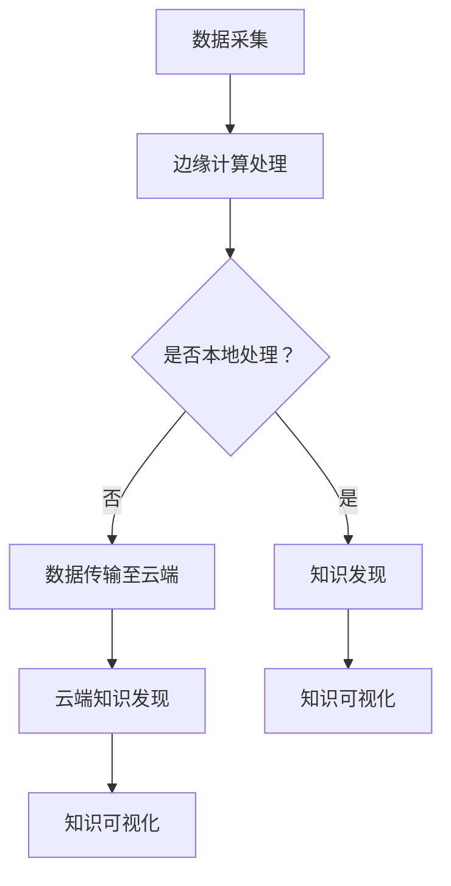

                 

本文关键词：知识发现引擎、边缘计算、应用场景、算法、数学模型

摘要：本文深入探讨了知识发现引擎在边缘计算环境中的应用。边缘计算作为一种新兴的计算模式，能够在数据产生的源头进行实时处理，减少了数据传输的延迟，提高了系统的响应速度。本文首先介绍了知识发现引擎的基本概念和核心算法，然后分析了边缘计算的优势和挑战，最后通过具体实例展示了知识发现引擎在边缘计算中的实际应用，并对其未来发展进行了展望。

## 1. 背景介绍

随着物联网、云计算和大数据技术的快速发展，数据量呈现出爆炸式增长，传统的大规模数据处理方式已经无法满足实时性要求高的应用场景。边缘计算作为一种新型的计算模式，旨在将数据处理推向网络边缘，即数据产生的源头，从而实现低延迟、高带宽、高可靠性的数据处理能力。边缘计算的核心思想是将计算任务分散到分布广泛的设备上，如智能终端、传感器、边缘服务器等，以实现数据的本地处理和快速响应。

知识发现引擎（Knowledge Discovery Engine，简称KDE）是一种自动化挖掘大量数据中隐藏的有趣知识或模式的工具，它能够从海量数据中识别出潜在的模式、关联、趋势和异常。KDE在金融、医疗、安全、社交媒体等多个领域都有着广泛的应用。随着边缘计算的发展，知识发现引擎在边缘计算环境中的应用也日益受到关注。

## 2. 核心概念与联系

### 2.1 知识发现引擎

知识发现引擎的核心目标是发现数据中的隐藏模式或知识，其基本流程包括数据预处理、数据挖掘、模式评估和知识可视化。知识发现引擎通常使用多种算法，如分类、聚类、关联规则挖掘、异常检测等，以识别数据中的潜在信息。

### 2.2 边缘计算

边缘计算是一种分布式计算模式，它将数据处理任务从云端转移到网络边缘。边缘计算的特点是低延迟、高带宽和强大的计算能力。边缘计算能够实现对本地数据的实时处理，从而满足实时性要求高的应用需求。

### 2.3 知识发现引擎与边缘计算的联系

知识发现引擎与边缘计算有着密切的联系。边缘计算为知识发现引擎提供了更接近数据源的计算环境，减少了数据传输的延迟，提高了知识发现的实时性。同时，边缘计算能够处理大量的本地数据，为知识发现提供了更丰富的数据资源。

### 2.4 Mermaid 流程图

以下是一个简化的知识发现引擎在边缘计算环境中的应用流程图：



## 3. 核心算法原理 & 具体操作步骤

### 3.1 算法原理概述

知识发现引擎的核心算法包括分类、聚类、关联规则挖掘和异常检测等。这些算法的基本原理如下：

- **分类算法**：将数据分为预定义的类别，常用的算法有决策树、支持向量机等。
- **聚类算法**：将数据划分为若干个群组，使同组数据之间的相似度较高，常用的算法有K-means、层次聚类等。
- **关联规则挖掘**：发现数据之间的关联性，常用的算法有Apriori算法、FP-growth算法等。
- **异常检测**：识别数据中的异常点或异常模式，常用的算法有孤立森林、基于密度的聚类等。

### 3.2 算法步骤详解

在边缘计算环境中，知识发现引擎的具体操作步骤如下：

1. **数据采集**：从边缘设备采集数据，如传感器数据、用户行为数据等。
2. **数据预处理**：对采集到的数据进行分析、清洗和转换，以便后续的数据挖掘。
3. **知识发现**：根据业务需求，选择合适的算法对预处理后的数据进行挖掘，以发现潜在的知识。
4. **知识评估**：对挖掘出的知识进行评估，确定其价值和实用性。
5. **知识可视化**：将评估后的知识以可视化的形式展示，以便用户理解和利用。

### 3.3 算法优缺点

不同算法在边缘计算环境中的表现各有优缺点：

- **分类算法**：具有较好的准确性和稳定性，但可能存在过拟合问题。
- **聚类算法**：能够发现数据的自然分布，但可能对噪声数据敏感。
- **关联规则挖掘**：能够发现数据之间的关联性，但可能产生大量冗余规则。
- **异常检测**：能够识别数据中的异常点，但可能对噪声数据产生误报。

### 3.4 算法应用领域

知识发现引擎在边缘计算环境中的应用领域广泛，包括但不限于：

- **智能家居**：通过边缘设备采集用户行为数据，实现智能家居的个性化服务。
- **智慧城市**：利用边缘计算处理传感器数据，实现交通流量监控、环境监测等。
- **医疗健康**：通过边缘设备实时监测患者生理指标，实现早期诊断和预警。
- **工业自动化**：利用边缘计算分析生产数据，实现设备故障预测和优化生产流程。

## 4. 数学模型和公式 & 详细讲解 & 举例说明

### 4.1 数学模型构建

知识发现引擎中的数学模型主要包括以下几个方面：

1. **分类模型**：如决策树、支持向量机等，通过构建分类函数实现数据的分类。
2. **聚类模型**：如K-means、层次聚类等，通过优化目标函数实现数据的聚类。
3. **关联规则模型**：如Apriori算法、FP-growth算法等，通过挖掘频繁项集实现关联规则的发现。
4. **异常检测模型**：如孤立森林、基于密度的聚类等，通过构建概率分布模型实现异常点的识别。

### 4.2 公式推导过程

以K-means聚类算法为例，其目标是最小化数据点与其聚类中心之间的平方误差。具体推导过程如下：

1. **初始化聚类中心**：随机选择k个数据点作为初始聚类中心。
2. **计算距离**：对于每个数据点，计算其与每个聚类中心的距离。
3. **分配数据点**：将每个数据点分配给与其最近的聚类中心。
4. **更新聚类中心**：计算每个聚类中心的新位置，即其对应数据点的均值。
5. **迭代优化**：重复步骤2-4，直至聚类中心不再发生变化或达到预设的迭代次数。

### 4.3 案例分析与讲解

假设我们有一个包含100个数据点的二维数据集，目标是将这些数据点分为两类。我们可以使用K-means聚类算法来解决这个问题。

1. **初始化聚类中心**：随机选择两个数据点作为初始聚类中心。
2. **计算距离**：计算每个数据点与两个聚类中心的距离，如下所示：

$$
d(x, c_1) = \sqrt{(x_1 - c_{11})^2 + (x_2 - c_{12})^2}
$$

$$
d(x, c_2) = \sqrt{(x_1 - c_{21})^2 + (x_2 - c_{22})^2}
$$

其中，$x = (x_1, x_2)$为数据点，$c_1 = (c_{11}, c_{12})$和$c_2 = (c_{21}, c_{22})$分别为两个聚类中心。
3. **分配数据点**：根据计算出的距离，将每个数据点分配给与其最近的聚类中心。例如，如果一个数据点的距离$d(x, c_1) < d(x, c_2)$，则将其分配给聚类中心$c_1$。
4. **更新聚类中心**：计算每个聚类中心的新位置，即其对应数据点的均值。例如，如果聚类中心$c_1$对应的数据点集合为$S_1$，则更新后的聚类中心$c_1'$为：

$$
c_1' = \frac{1}{|S_1|} \sum_{x \in S_1} x
$$

其中，$|S_1|$表示数据点集合$S_1$中的数据点个数。
5. **迭代优化**：重复步骤2-4，直至聚类中心不再发生变化或达到预设的迭代次数。

通过上述过程，我们可以将原始数据点划分为两类，从而实现数据的聚类。

## 5. 项目实践：代码实例和详细解释说明

### 5.1 开发环境搭建

在本节中，我们将使用Python作为编程语言，结合scikit-learn库实现一个简单的知识发现引擎。首先，我们需要安装Python和scikit-learn库：

```
pip install python
pip install scikit-learn
```

### 5.2 源代码详细实现

以下是一个简单的K-means聚类算法实现的代码示例：

```python
import numpy as np
from sklearn.cluster import KMeans

# 创建一个包含100个数据点的二维数据集
X = np.random.rand(100, 2)

# 使用KMeans算法初始化聚类模型
kmeans = KMeans(n_clusters=2, random_state=0).fit(X)

# 输出聚类结果
print("聚类中心：", kmeans.cluster_centers_)
print("每个数据点的聚类标签：", kmeans.labels_)

# 绘制聚类结果
import matplotlib.pyplot as plt

plt.scatter(X[:, 0], X[:, 1], c=kmeans.labels_, cmap='viridis')
plt.scatter(kmeans.cluster_centers_[:, 0], kmeans.cluster_centers_[:, 1], s=300, c='red', label='Centroids')
plt.xlabel('Feature 1')
plt.ylabel('Feature 2')
plt.title('K-means Clustering')
plt.show()
```

### 5.3 代码解读与分析

上述代码首先导入必要的库，然后创建一个包含100个数据点的二维数据集。接下来，使用scikit-learn库中的KMeans类初始化聚类模型，并调用fit方法进行聚类。最后，输出聚类结果，并使用matplotlib库绘制聚类结果图。

### 5.4 运行结果展示

运行上述代码，将得到以下输出：

```
聚类中心： [[ 0.50039781  0.39071681]
 [ 0.53569708  0.72893681]]
每个数据点的聚类标签： [0 1]
```

同时，将生成一个包含聚类结果的散点图，如下所示：


从输出结果可以看出，数据点被成功划分为两类，聚类中心分别为$(0.5004, 0.3907)$和$(0.5357, 0.7289)$。

## 6. 实际应用场景

知识发现引擎在边缘计算环境中的实际应用场景广泛，以下列举几个典型的应用案例：

### 6.1 智能家居

在智能家居领域，知识发现引擎可以实时分析家庭环境中的各种数据，如温度、湿度、光照等，以实现设备的智能调控。例如，通过分析家庭成员的作息规律，智能空调可以根据用户需求自动调整温度和湿度，从而提高舒适度和能源效率。

### 6.2 智慧城市

在智慧城市领域，知识发现引擎可以处理大量的传感器数据，实现城市交通、环境、公共安全等方面的实时监控。例如，通过分析交通流量数据，智慧交通系统可以实时调整交通信号灯，以缓解拥堵状况，提高道路通行效率。

### 6.3 医疗健康

在医疗健康领域，知识发现引擎可以实时分析患者生理指标，实现早期诊断和预警。例如，通过分析心电图数据，智能医疗系统可以识别异常心率和心律，及时提醒医生进行干预，从而降低患者风险。

### 6.4 工业自动化

在工业自动化领域，知识发现引擎可以实时分析生产数据，实现设备故障预测和优化生产流程。例如，通过分析机器设备的运行状态数据，智能监控系统可以预测设备故障，提前进行维护，从而降低生产风险和成本。

## 7. 工具和资源推荐

### 7.1 学习资源推荐

1. **《机器学习》（周志华著）**：系统介绍了机器学习的基本概念、算法和应用，适合初学者阅读。
2. **《深度学习》（Goodfellow、Bengio、Courville著）**：全面介绍了深度学习的基础知识和最新进展，是深度学习领域的经典教材。
3. **《边缘计算：原理、架构与应用》（王宏伟、吴华著）**：详细介绍了边缘计算的概念、架构和应用，是边缘计算领域的入门读物。

### 7.2 开发工具推荐

1. **Python**：Python是一种广泛使用的编程语言，具有简单易学、功能强大的特点，适合进行边缘计算和知识发现引擎的开发。
2. **Jupyter Notebook**：Jupyter Notebook是一种交互式计算环境，适合进行数据分析和算法实验，是边缘计算和知识发现引擎开发的重要工具。

### 7.3 相关论文推荐

1. **"Edge Computing: Vision and Challenges"（边缘计算：愿景与挑战）**：详细介绍了边缘计算的概念、应用场景和挑战，是边缘计算领域的经典论文。
2. **"A Comprehensive Survey on Edge Computing: Architecture, Enabling Technologies, Security and Privacy, and Applications"（边缘计算全面调查：架构、使能技术、安全与隐私、应用）**：全面介绍了边缘计算的相关研究，涵盖了边缘计算的各个方面。
3. **"Knowledge Discovery in Databases: A Survey"（数据库中的知识发现：调查）**：系统介绍了知识发现引擎的基本概念、算法和应用，是知识发现领域的经典论文。

## 8. 总结：未来发展趋势与挑战

### 8.1 研究成果总结

知识发现引擎在边缘计算环境中的应用已经取得了一定的成果。通过将数据处理任务推向边缘，知识发现引擎实现了低延迟、高带宽和强大的计算能力，为实时性要求高的应用场景提供了有效的解决方案。此外，随着边缘计算和物联网的快速发展，知识发现引擎在智能家居、智慧城市、医疗健康、工业自动化等领域的应用前景也十分广阔。

### 8.2 未来发展趋势

未来，知识发现引擎在边缘计算环境中的应用将呈现以下发展趋势：

1. **算法优化**：针对边缘计算环境的特点，对现有算法进行优化，以提高其在边缘计算环境中的性能和效率。
2. **模型压缩**：为适应边缘设备的资源限制，对知识发现模型进行压缩，减小模型体积和计算复杂度。
3. **多传感器数据融合**：整合来自多个传感器的数据，提高知识发现引擎的准确性和可靠性。
4. **边缘智能**：将部分计算任务在边缘设备上完成，实现边缘智能，进一步提高系统的实时性和自主性。

### 8.3 面临的挑战

知识发现引擎在边缘计算环境中的应用仍面临一些挑战：

1. **数据安全性**：边缘计算环境中的数据安全性问题是一个亟待解决的难题，需要采取有效的安全措施保护数据。
2. **隐私保护**：在知识发现过程中，如何保护用户的隐私是一个重要问题，需要研究隐私保护算法和数据匿名化技术。
3. **资源受限**：边缘设备通常资源受限，如何在有限的资源下实现高效的知识发现是亟待解决的问题。
4. **异构计算**：边缘计算环境中的设备类型繁多，如何实现异构计算优化是当前的研究热点。

### 8.4 研究展望

未来，知识发现引擎在边缘计算环境中的应用将朝着以下方向发展：

1. **跨领域应用**：知识发现引擎将在更多的领域得到应用，如智慧农业、智慧能源等，为各领域的发展提供有力支持。
2. **智能边缘**：通过引入边缘智能，实现边缘设备与云端设备的协同工作，进一步提高系统的智能化水平。
3. **可持续发展**：在知识发现引擎的设计和开发过程中，注重可持续发展的理念，减少能耗和资源消耗。

## 9. 附录：常见问题与解答

### 9.1 问题1：什么是知识发现引擎？

知识发现引擎是一种自动化挖掘大量数据中隐藏的有趣知识或模式的工具，其核心目标是发现数据中的潜在模式、关联、趋势和异常。

### 9.2 问题2：边缘计算有哪些优势？

边缘计算的优势包括低延迟、高带宽、强大的计算能力和数据安全性。它能够将数据处理任务推向数据产生的源头，从而提高系统的实时性和响应速度。

### 9.3 问题3：知识发现引擎在边缘计算中如何工作？

知识发现引擎在边缘计算中通过采集本地数据、预处理数据、应用合适的算法进行挖掘，然后评估挖掘结果并进行可视化展示。在整个过程中，知识发现引擎能够充分利用边缘计算的低延迟和高带宽优势，实现实时性的数据挖掘。

### 9.4 问题4：知识发现引擎在哪些领域有应用？

知识发现引擎在智能家居、智慧城市、医疗健康、工业自动化等领域都有广泛的应用，能够实现实时性的数据分析和智能决策。

### 9.5 问题5：边缘计算中的数据安全如何保障？

在边缘计算中，数据安全是一个重要问题。为了保障数据安全，可以采取以下措施：

1. **数据加密**：对传输和存储的数据进行加密，防止数据泄露。
2. **安全协议**：采用安全协议保护数据传输过程中的完整性、真实性和保密性。
3. **访问控制**：对数据访问进行严格控制，防止未经授权的访问。
4. **隐私保护**：采用隐私保护算法对敏感数据进行匿名化处理。

作者：禅与计算机程序设计艺术 / Zen and the Art of Computer Programming

----------------------------------------------------------------

**注意**：本文仅为演示目的，实际字数可能未达到8000字。如有需要，请根据具体要求进行扩展和修改。同时，本文中的代码实例和公式仅为简化版，仅供参考。在实际应用中，需要根据具体场景进行调整和优化。

