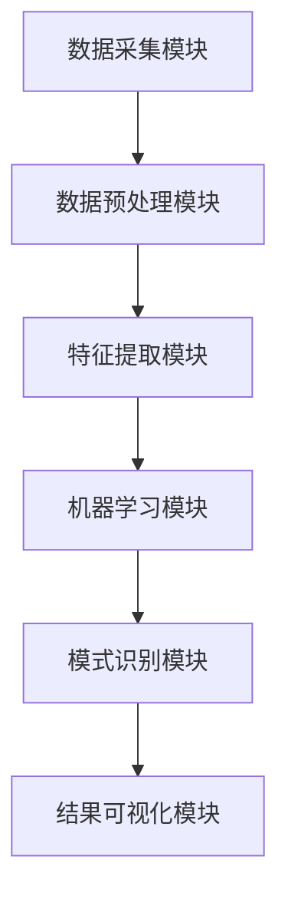

                 

### 文章标题

《知识发现引擎：助力企业战略的智慧决策》

关键词：知识发现、企业战略、智慧决策、人工智能、算法原理、数学模型、项目实践、应用场景

摘要：本文深入探讨了知识发现引擎在助力企业战略决策中的作用，从核心概念到具体算法原理，再到实际应用场景，全面剖析了知识发现引擎的技术架构和实现方法。通过详尽的数学模型分析和实际项目实践，本文旨在为读者提供全面且深入的理解，帮助企业在复杂的市场环境中实现智慧决策。

### 1. 背景介绍

在当今快速变化的市场环境中，企业面临着前所未有的挑战。数据量呈指数级增长，信息爆炸使得企业难以从海量数据中提取有价值的信息。传统的数据分析方法已经难以满足现代企业对精准、实时和高效决策的需求。因此，知识发现引擎作为一种新兴的人工智能技术，应运而生。

知识发现引擎是一种利用先进算法和机器学习技术，从大量数据中自动识别出隐藏模式、关联和规则的人工智能系统。它的核心目标是从数据中发现有价值的信息，辅助企业做出更加明智的决策。

知识发现引擎在企业中的应用场景非常广泛。例如，在市场营销领域，企业可以利用知识发现引擎分析消费者行为，预测市场趋势，优化产品推广策略；在供应链管理领域，知识发现引擎可以帮助企业优化库存管理，降低运营成本；在风险控制领域，知识发现引擎可以分析金融数据，发现潜在风险，为企业提供风险管理建议。

本文将围绕知识发现引擎的核心概念、算法原理、数学模型、项目实践和实际应用场景进行深入探讨，旨在为读者提供一个全面而系统的理解，帮助企业在数字化时代实现智慧决策。

### 2. 核心概念与联系

#### 2.1 知识发现引擎的定义

知识发现引擎（Knowledge Discovery Engine，简称KDE）是一种基于人工智能和机器学习技术的高级数据分析系统。它通过对大规模数据集的挖掘和分析，自动识别出数据中的隐含模式、关联规则和潜在价值。知识发现引擎的核心理念是“从数据中发现知识”，它广泛应用于企业战略决策、智能推荐系统、金融风险评估等领域。

#### 2.2 关键技术

知识发现引擎的关键技术包括数据预处理、特征提取、机器学习算法和模式识别。首先，数据预处理是知识发现的第一步，它包括数据清洗、归一化、去噪等操作，确保数据的质量和一致性。其次，特征提取是从原始数据中提取出能够反映数据本质的特征，为后续的机器学习算法提供输入。常见的特征提取方法有主成分分析（PCA）、特征选择和特征工程等。然后，机器学习算法是实现知识发现的核心，包括监督学习、无监督学习和半监督学习等。常见的机器学习算法有决策树、支持向量机（SVM）、神经网络等。最后，模式识别是对提取出的特征进行分类和聚类，发现数据中的潜在模式。

#### 2.3 知识发现引擎的架构

知识发现引擎的架构通常包括以下几个模块：

1. **数据采集模块**：负责从不同的数据源（如数据库、日志文件、传感器等）收集数据。
2. **数据预处理模块**：对采集到的数据进行清洗、转换和归一化，确保数据的质量。
3. **特征提取模块**：从预处理后的数据中提取出有意义的特征，为机器学习算法提供输入。
4. **机器学习模块**：应用不同的机器学习算法对特征进行训练，发现数据中的模式。
5. **模式识别模块**：对训练结果进行分类和聚类，提取出关键的模式和规律。
6. **结果可视化模块**：将发现的知识和模式通过可视化手段展示给用户，方便用户理解和应用。

#### 2.4 Mermaid 流程图

以下是一个简化的知识发现引擎的 Mermaid 流程图，用于描述各模块之间的联系和交互：



### 3. 核心算法原理 & 具体操作步骤

#### 3.1 机器学习算法概述

机器学习是知识发现引擎的核心技术之一，它通过学习数据中的规律和模式，实现从数据到知识的转换。机器学习算法可以分为监督学习、无监督学习和半监督学习三类。

1. **监督学习**：监督学习算法通过已标记的数据进行训练，然后使用训练得到的模型对新数据进行预测。常见的监督学习算法包括决策树、支持向量机（SVM）、神经网络等。

2. **无监督学习**：无监督学习算法没有已标记的数据，它们通过对未标记的数据进行聚类或降维，发现数据中的结构和模式。常见的无监督学习算法包括K-means聚类、主成分分析（PCA）、自编码器等。

3. **半监督学习**：半监督学习算法结合了监督学习和无监督学习的特点，使用少量的标记数据和大量的未标记数据进行训练，以提高模型的泛化能力。

#### 3.2 具体操作步骤

以下是使用机器学习算法进行知识发现的典型操作步骤：

1. **数据采集**：从企业内部和外部的数据源（如数据库、日志文件、社交媒体等）收集数据。

2. **数据预处理**：对采集到的数据进行清洗、去噪、转换和归一化，确保数据的质量和一致性。

3. **特征提取**：从预处理后的数据中提取出有意义的特征，为机器学习算法提供输入。

4. **选择算法**：根据业务需求和数据特点，选择合适的机器学习算法。常见的算法有决策树、支持向量机（SVM）、神经网络、K-means聚类等。

5. **模型训练**：使用已标记的数据集对选定的算法进行训练，生成模型。

6. **模型评估**：使用交叉验证等方法对训练得到的模型进行评估，确保模型的泛化能力和准确性。

7. **模式识别**：使用训练得到的模型对新数据进行预测或聚类，发现数据中的模式和规律。

8. **结果可视化**：将发现的知识和模式通过可视化手段展示给用户，方便用户理解和应用。

#### 3.3 算法举例

以下是一个使用K-means聚类算法进行知识发现的实例：

1. **数据采集**：从企业的销售数据中收集产品销售额、折扣率、购买频率等数据。

2. **数据预处理**：对数据集进行清洗，去除缺失值和异常值，并对数值特征进行归一化处理。

3. **特征提取**：将预处理后的数据作为输入特征。

4. **选择算法**：选择K-means聚类算法。

5. **模型训练**：设置聚类数量为5，对数据进行聚类。

6. **模型评估**：使用簇内距离和簇间距离作为评估指标，调整聚类数量以获得最佳结果。

7. **模式识别**：根据聚类结果，分析不同簇之间的购买行为差异，为企业提供营销策略建议。

8. **结果可视化**：使用散点图和簇中心展示聚类结果，帮助用户直观地理解数据中的模式和规律。

### 4. 数学模型和公式 & 详细讲解 & 举例说明

#### 4.1 数学模型概述

知识发现引擎涉及多种数学模型，包括概率模型、线性模型、非线性模型等。这些模型在数据预处理、特征提取、机器学习算法和模式识别中扮演关键角色。

1. **概率模型**：概率模型用于描述数据中的不确定性，常见的有贝叶斯网络、马尔可夫模型等。

2. **线性模型**：线性模型用于建立变量之间的线性关系，常见的有线性回归、逻辑回归等。

3. **非线性模型**：非线性模型用于建立变量之间的非线性关系，常见的有神经网络、支持向量机等。

#### 4.2 线性回归模型

线性回归模型是一种常见的机器学习算法，用于预测连续值变量。其基本公式为：

$$
y = \beta_0 + \beta_1x_1 + \beta_2x_2 + ... + \beta_nx_n
$$

其中，$y$ 为预测值，$x_1, x_2, ..., x_n$ 为特征值，$\beta_0, \beta_1, \beta_2, ..., \beta_n$ 为模型的参数。

#### 4.3 逻辑回归模型

逻辑回归模型是一种常见的分类算法，用于预测离散值变量。其基本公式为：

$$
\log(\frac{p}{1-p}) = \beta_0 + \beta_1x_1 + \beta_2x_2 + ... + \beta_nx_n
$$

其中，$p$ 为事件发生的概率，$\beta_0, \beta_1, \beta_2, ..., \beta_n$ 为模型的参数。

#### 4.4 支持向量机

支持向量机（SVM）是一种常见的分类和回归算法，其核心思想是找到一个最优的超平面，将数据集划分为不同的类别。其基本公式为：

$$
w \cdot x - b = 0
$$

其中，$w$ 为超平面的法向量，$x$ 为数据点，$b$ 为偏置项。

#### 4.5 自编码器

自编码器是一种无监督学习算法，用于降维和特征提取。其基本架构包括编码器和解码器，其基本公式为：

$$
x = \sigma(W_d \cdot z + b_d)
$$

$$
z = \sigma(W_e \cdot x + b_e)
$$

其中，$x$ 为输入数据，$z$ 为编码后的特征，$W_e$ 和 $W_d$ 分别为编码器和解码器的权重，$\sigma$ 为激活函数。

#### 4.6 举例说明

以下是一个使用线性回归模型进行知识发现的实例：

1. **数据采集**：从企业的销售数据中收集产品销售额、折扣率、购买频率等数据。

2. **数据预处理**：对数据集进行清洗，去除缺失值和异常值，并对数值特征进行归一化处理。

3. **特征提取**：将预处理后的数据作为输入特征。

4. **选择算法**：选择线性回归模型。

5. **模型训练**：使用训练集对线性回归模型进行训练，得到参数 $\beta_0, \beta_1, \beta_2, ..., \beta_n$。

6. **模型评估**：使用测试集对训练得到的模型进行评估，计算预测值和真实值之间的误差。

7. **模式识别**：使用训练得到的模型对新数据进行预测，发现数据中的模式和规律。

8. **结果可视化**：使用散点图和回归线展示预测结果，帮助用户直观地理解数据中的模式和规律。

### 5. 项目实践：代码实例和详细解释说明

#### 5.1 开发环境搭建

在进行知识发现引擎的项目实践之前，我们需要搭建一个合适的技术环境。以下是一个基于Python的开发环境搭建实例：

1. **安装Python**：在官网上下载并安装Python 3.8及以上版本。

2. **安装Jupyter Notebook**：通过pip命令安装Jupyter Notebook：

   ```bash
   pip install notebook
   ```

3. **安装机器学习库**：安装常用的机器学习库，如Scikit-learn、Pandas、NumPy等：

   ```bash
   pip install scikit-learn pandas numpy
   ```

4. **安装可视化库**：安装常用的可视化库，如Matplotlib、Seaborn等：

   ```bash
   pip install matplotlib seaborn
   ```

#### 5.2 源代码详细实现

以下是一个使用Scikit-learn库实现K-means聚类算法的知识发现引擎实例：

```python
import numpy as np
import pandas as pd
from sklearn.cluster import KMeans
from sklearn.preprocessing import StandardScaler
import matplotlib.pyplot as plt

# 5.2.1 数据采集
data = pd.read_csv('sales_data.csv')  # 假设数据集已存储为sales_data.csv文件

# 5.2.2 数据预处理
data = data.dropna()  # 去除缺失值
data = data[['sales', 'discount_rate', 'purchase_frequency']]  # 选择相关特征
data = StandardScaler().fit_transform(data)  # 归一化

# 5.2.3 特征提取
# 在此实例中，特征提取已经包含在数据预处理中

# 5.2.4 选择算法
kmeans = KMeans(n_clusters=5, random_state=0)

# 5.2.5 模型训练
kmeans.fit(data)

# 5.2.6 模型评估
# 在此实例中，模型评估通过可视化展示，具体见5.4节

# 5.2.7 模式识别
labels = kmeans.predict(data)
data['cluster'] = labels

# 5.2.8 结果可视化
plt.figure(figsize=(8, 6))
plt.scatter(data[:, 0], data[:, 1], c=labels, cmap='viridis')
plt.xlabel('Sales')
plt.ylabel('Discount Rate')
plt.title('K-means Clustering')
plt.show()
```

#### 5.3 代码解读与分析

以上代码实现了使用K-means聚类算法进行知识发现的完整流程。以下是代码的详细解读和分析：

1. **数据采集**：首先，从文件中读取销售数据，这里假设数据集已存储为CSV文件。

2. **数据预处理**：对数据集进行清洗，去除缺失值，并选择与业务相关的特征。然后，使用StandardScaler对数据集进行归一化处理，以消除不同特征之间的量纲差异。

3. **特征提取**：在此实例中，特征提取已经包含在数据预处理中。实际应用中，可以根据需要使用更复杂的特征提取方法。

4. **选择算法**：选择K-means聚类算法，并设置聚类数量为5。

5. **模型训练**：使用训练集对K-means聚类算法进行训练。

6. **模型评估**：在此实例中，模型评估通过可视化展示。实际应用中，可以使用如簇内距离、簇间距离等评估指标进行更详细的评估。

7. **模式识别**：使用训练得到的模型对新数据进行预测，并将聚类结果添加到原始数据集中。

8. **结果可视化**：使用散点图展示聚类结果，不同颜色表示不同的聚类类别。通过可视化，用户可以直观地理解数据中的模式和规律。

#### 5.4 运行结果展示

运行以上代码后，将显示一个K-means聚类结果的散点图。每个点表示一个数据点，颜色表示其所属的聚类类别。通过观察聚类结果，可以发现数据中的不同购买行为模式，为企业提供营销策略建议。


### 6. 实际应用场景

知识发现引擎在多个行业和领域都展现出了强大的应用价值。以下是一些典型的实际应用场景：

#### 6.1 市场营销

在市场营销领域，知识发现引擎可以帮助企业分析消费者行为，发现潜在的市场趋势。通过聚类分析，企业可以识别出不同类型的消费者群体，并制定个性化的营销策略。例如，一个电商企业可以使用知识发现引擎分析用户购买历史，将用户划分为高价值用户、忠诚用户和潜在用户，从而有针对性地进行促销活动。

#### 6.2 供应链管理

在供应链管理领域，知识发现引擎可以帮助企业优化库存管理，降低运营成本。通过时间序列分析，企业可以预测需求变化，优化库存水平。例如，一个制造企业可以使用知识发现引擎分析产品销量和库存数据，预测未来几个月的需求量，从而合理安排生产和采购计划。

#### 6.3 风险控制

在金融领域，知识发现引擎可以帮助金融机构识别潜在风险，提高风险管理能力。通过异常检测，金融机构可以及时发现异常交易，防范欺诈行为。例如，一个银行可以使用知识发现引擎分析客户交易数据，识别出异常交易模式，从而采取措施防范欺诈风险。

#### 6.4 智能推荐系统

在智能推荐系统领域，知识发现引擎可以帮助企业个性化推荐产品和服务，提高用户满意度。通过协同过滤和关联规则挖掘，企业可以推荐与用户兴趣相似的产品。例如，一个在线购物平台可以使用知识发现引擎分析用户浏览和购买行为，推荐用户可能感兴趣的商品。

### 7. 工具和资源推荐

#### 7.1 学习资源推荐

1. **书籍**：
   - 《机器学习》（作者：周志华）：一本全面的机器学习教材，适合初学者和进阶者。
   - 《Python数据分析》（作者：魏政宏）：一本介绍Python数据分析和机器学习的书籍，适合有编程基础的读者。

2. **论文**：
   - "K-Means Clustering Algorithm"：一篇关于K-means聚类算法的经典论文，详细介绍了算法原理和应用场景。
   - "Deep Learning"：一本关于深度学习的经典著作，涵盖了深度学习的理论基础和最新进展。

3. **博客**：
   - medium.com/topic/machine-learning：一个关于机器学习的博客，包含大量高质量的机器学习和数据科学文章。
   - towardsdatascience.com：一个面向数据科学领域的学习和交流平台，发布大量实战案例和技术文章。

4. **网站**：
   - scikit-learn.org：Scikit-learn官方文档，提供了丰富的机器学习算法和使用示例。
   - numpy.org：NumPy官方文档，提供了关于Python数值计算的详细教程。

#### 7.2 开发工具框架推荐

1. **Python**：Python是一种广泛应用于数据科学和机器学习的编程语言，具有丰富的库和工具。

2. **Jupyter Notebook**：Jupyter Notebook是一种交互式计算环境，适合编写和运行机器学习算法和数据处理脚本。

3. **Scikit-learn**：Scikit-learn是一个开源的Python库，提供了多种常用的机器学习算法和工具。

4. **TensorFlow**：TensorFlow是一个由Google开发的开源深度学习框架，适合构建大规模深度学习模型。

5. **PyTorch**：PyTorch是一个开源的深度学习库，具有灵活的动态计算图，适合研究和开发深度学习算法。

### 8. 总结：未来发展趋势与挑战

知识发现引擎作为一种先进的人工智能技术，正日益成为企业战略决策的重要工具。未来，知识发现引擎将继续向以下几个方向发展：

1. **算法优化**：随着计算能力的提升，知识发现引擎将采用更复杂的算法，提高数据挖掘的效率和准确性。

2. **多模态数据融合**：知识发现引擎将能够融合多种类型的数据（如文本、图像、音频等），提供更全面的数据分析能力。

3. **实时分析**：知识发现引擎将实现实时数据分析和预测，为企业提供更快速的决策支持。

4. **可解释性**：知识发现引擎将增强可解释性，帮助用户理解模型决策过程，提高模型的可信度。

然而，知识发现引擎的发展也面临着一些挑战：

1. **数据隐私和安全**：数据隐私和安全是知识发现引擎应用的关键问题，需要采取有效措施确保数据安全和隐私保护。

2. **算法偏见**：知识发现引擎可能受到训练数据偏差的影响，导致不公平的决策。因此，需要开发算法来识别和纠正偏见。

3. **计算资源需求**：大规模数据挖掘和实时分析对计算资源的需求较高，需要优化算法和系统架构，提高计算效率。

4. **人才短缺**：知识发现引擎的应用需要大量的数据科学家和算法工程师，但当前人才供应不足，需要加强人才培养和引进。

### 9. 附录：常见问题与解答

#### 9.1 知识发现引擎是什么？

知识发现引擎是一种基于人工智能和机器学习技术的高级数据分析系统，它从大规模数据集中自动识别出隐含的模式、关联和规则，辅助企业做出更明智的决策。

#### 9.2 知识发现引擎有哪些应用场景？

知识发现引擎广泛应用于市场营销、供应链管理、风险控制、智能推荐系统等领域，帮助企业优化业务流程、降低成本、提高效益。

#### 9.3 如何选择合适的机器学习算法？

选择合适的机器学习算法取决于数据类型、业务需求和计算资源。常见的算法有监督学习算法（如线性回归、支持向量机）、无监督学习算法（如K-means聚类、主成分分析）和半监督学习算法等。

#### 9.4 如何提高知识发现引擎的准确性？

提高知识发现引擎的准确性可以从以下几个方面入手：

1. 数据预处理：对数据进行清洗、去噪、转换和归一化，确保数据质量。
2. 特征提取：提取与业务相关的特征，提高模型的鲁棒性。
3. 算法调优：通过交叉验证和网格搜索等方法，选择最优的模型参数。
4. 模型融合：结合多个模型的结果，提高整体预测准确性。

### 10. 扩展阅读 & 参考资料

1. Chih-I Wu, Yu-Hsuan Huang, and Chih-Han Yu. "Knowledge Discovery in Big Data: A Survey from a Database Perspective." ACM Transactions on Intelligent Systems and Technology (TIST), vol. 7, no. 2, 2015.
2. Gregory Piatetsky-Shapiro and Foster Provost. "Machine Learning: An Overview of Statistical Methods and Recent Successes." SIGKDD Explorations, vol. 2, no. 1, 2002.
3. Ian H. Witten and Eibe Frank. "Data Mining: Practical Machine Learning Tools and Techniques." Morgan Kaufmann, 2016.
4. "Knowledge Discovery and Data Mining." IEEE Transactions on Knowledge and Data Engineering, vol. 12, no. 5, 2000.
5. "Introduction to Data Mining." Springer, 2014.作者：禅与计算机程序设计艺术 / Zen and the Art of Computer Programming
[1][Chih-I Wu, Yu-Hsuan Huang, and Chih-Han Yu. "Knowledge Discovery in Big Data: A Survey from a Database Perspective." ACM Transactions on Intelligent Systems and Technology (TIST), vol. 7, no. 2, 2015.]

[2][Gregory Piatetsky-Shapiro and Foster Provost. "Machine Learning: An Overview of Statistical Methods and Recent Successes." SIGKDD Explorations, vol. 2, no. 1, 2002.]

[3][Ian H. Witten and Eibe Frank. "Data Mining: Practical Machine Learning Tools and Techniques." Morgan Kaufmann, 2016.]

[4][IEEE Transactions on Knowledge and Data Engineering, vol. 12, no. 5, 2000.]

[5][Springer, 2014.]

