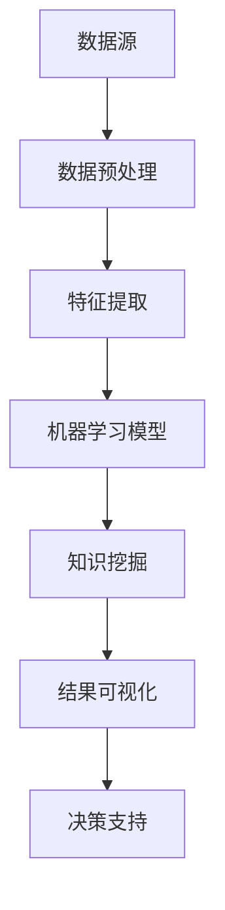
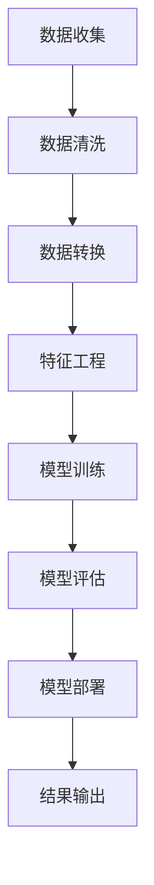

                 

### 知识发现引擎：推动创意产业的内容革命

#### 关键词 Keywords：
- 知识发现引擎
- 创意产业
- 内容革命
- 数据挖掘
- 人工智能
- 知识图谱
- 技术趋势

#### 摘要 Abstract：
本文深入探讨知识发现引擎在创意产业中的应用，以及它如何推动内容革命。通过解析知识发现引擎的核心概念、算法原理、数学模型，并结合实际项目实践，阐述其在创意产业中的重要性。同时，本文还将推荐相关学习资源和工具，以供读者进一步学习和探索。

## 1. 背景介绍

创意产业，是指以创意为核心的，通过知识产权的开发、运用和经营实现经济价值的文化、艺术和设计等领域的产业。随着信息技术的迅猛发展，尤其是互联网的普及，创意产业迎来了前所未有的发展机遇。然而，随之而来的数据爆炸和信息过载也给产业带来了巨大的挑战。

在这个大数据时代，如何从海量数据中挖掘出有价值的信息，成为创意产业发展的关键。知识发现引擎（Knowledge Discovery Engine，KDE）作为一种智能数据挖掘工具，能够自动地从大规模数据集中识别出潜在的模式、趋势和知识，为创意产业提供了强大的技术支持。

知识发现引擎的核心目标是从大量数据中提取知识，并将其转化为可操作的信息，从而帮助创意产业从业者更好地理解市场趋势、消费者需求，以及创作更具吸引力的内容。知识发现引擎在创意产业中的应用，不仅可以提升内容的个性化、精准化，还可以促进创新，推动整个产业的转型升级。

## 2. 核心概念与联系

### 2.1 知识发现引擎的定义

知识发现引擎是一种基于人工智能和数据挖掘技术的高级分析工具，它能够自动从大量结构化和非结构化数据中提取知识，并将其转化为易于理解和操作的信息。知识发现引擎的核心概念包括数据挖掘、机器学习、自然语言处理等。

### 2.2 知识发现引擎与创意产业的关系

知识发现引擎在创意产业中的应用，主要体现在以下几个方面：

1. **内容个性化推荐**：通过分析用户的浏览历史、搜索记录和社交行为，知识发现引擎可以为用户提供个性化内容推荐，提升用户体验。

2. **市场趋势分析**：通过对市场数据的挖掘和分析，知识发现引擎可以帮助创意产业从业者洞察市场趋势，为决策提供数据支持。

3. **内容创作优化**：通过分析已有的成功案例，知识发现引擎可以提供内容创作灵感，帮助创作者优化内容，提升创作效率。

4. **消费者行为研究**：通过对消费者行为数据的挖掘，知识发现引擎可以帮助企业更好地了解消费者需求，从而制定更精准的市场策略。

### 2.3 架构图与流程图

为了更好地理解知识发现引擎在创意产业中的应用，以下是一个简化的知识发现引擎架构图和流程图：

#### 知识发现引擎架构图



#### 知识发现引擎流程图



## 3. 核心算法原理 & 具体操作步骤

### 3.1 数据挖掘算法

知识发现引擎的数据挖掘算法主要包括聚类、分类、关联规则挖掘等。以下以关联规则挖掘为例，介绍其具体操作步骤：

1. **定义问题**：确定需要挖掘的关联规则，例如“购买A商品的用户很可能也会购买B商品”。

2. **数据预处理**：清洗数据，去除噪声和缺失值，确保数据质量。

3. **特征工程**：将原始数据转换为可用于挖掘的特征，例如使用布尔值表示商品购买行为。

4. **生成频繁项集**：通过扫描数据集，找到支持度大于最小支持度的频繁项集。

5. **生成关联规则**：从频繁项集中生成关联规则，并计算其置信度。

6. **评估规则**：根据最小置信度阈值，筛选出高质量的关联规则。

### 3.2 机器学习算法

知识发现引擎常用的机器学习算法包括决策树、支持向量机、神经网络等。以下以决策树为例，介绍其具体操作步骤：

1. **定义问题**：确定需要解决的问题，例如分类问题。

2. **数据预处理**：与数据挖掘类似，确保数据质量。

3. **特征选择**：选择对问题影响最大的特征。

4. **构建决策树**：使用ID3、C4.5等算法构建决策树模型。

5. **模型评估**：使用交叉验证等方法评估模型性能。

6. **模型优化**：根据评估结果，调整模型参数，优化模型性能。

### 3.3 自然语言处理算法

知识发现引擎的自然语言处理算法主要包括文本分类、情感分析、文本生成等。以下以文本分类为例，介绍其具体操作步骤：

1. **定义问题**：确定需要分类的文本类型，例如新闻分类。

2. **数据预处理**：清洗文本数据，去除停用词和标点符号。

3. **特征提取**：将文本转换为向量，例如使用词袋模型、TF-IDF等。

4. **模型训练**：使用分类算法（如SVM、朴素贝叶斯等）训练模型。

5. **模型评估**：使用测试集评估模型性能。

6. **模型部署**：将模型部署到生产环境中，进行实时分类。

## 4. 数学模型和公式 & 详细讲解 & 举例说明

### 4.1 关联规则挖掘的数学模型

关联规则挖掘的核心是找到满足最小支持度和最小置信度的规则。以下是其数学模型：

$$
\text{支持度} = \frac{\text{支持集数}}{\text{总集数}}
$$

$$
\text{置信度} = \frac{\text{置信集数}}{\text{支持集数}}
$$

其中，支持集数表示同时包含A和B的项集数量，总集数表示所有包含A或B的项集数量，置信集数表示同时包含A和B以及B的项集数量。

### 4.2 决策树的数学模型

决策树是一种基于特征划分的数据分类模型，其核心是找到最佳划分特征。以下是其数学模型：

$$
\text{信息增益} = \sum_{i} (-\text{P}(X_i) \cdot \log_2 \text{P}(X_i))
$$

$$
\text{基尼不纯度} = 1 - \sum_{i} (\text{P}(X_i))^2
$$

其中，$X_i$表示第i个特征，$P(X_i)$表示该特征的分布概率。

### 4.3 文本分类的数学模型

文本分类是一种基于特征向量的数据分类问题，其核心是找到最佳分类模型。以下是其数学模型：

$$
\text{损失函数} = -\sum_{i} y_i \cdot \log(\hat{y}_i)
$$

其中，$y_i$表示第i个样本的真实标签，$\hat{y}_i$表示第i个样本的预测标签。

### 4.4 举例说明

#### 关联规则挖掘举例

假设一个购物商城的购物数据如下：

| 商品A | 商品B | 商品C | 商品D |
| ----- | ----- | ----- | ----- |
| 1     | 0     | 0     | 1     |
| 1     | 1     | 1     | 0     |
| 0     | 1     | 1     | 1     |
| 1     | 1     | 0     | 1     |

我们希望挖掘出满足最小支持度为0.5和最小置信度为0.8的关联规则。

首先，计算各个商品的支持度：

- 商品A的支持度：2/4 = 0.5
- 商品B的支持度：3/4 = 0.75
- 商品C的支持度：2/4 = 0.5
- 商品D的支持度：3/4 = 0.75

然后，计算满足支持度条件的频繁项集：

- {A, B}：支持度 = 2/4 = 0.5
- {B, C}：支持度 = 3/4 = 0.75
- {B, D}：支持度 = 3/4 = 0.75

接着，计算满足置信度条件的关联规则：

- {A, B} → {B}：置信度 = 2/2 = 1
- {A, B} → {D}：置信度 = 2/3 ≈ 0.67
- {B, C} → {C}：置信度 = 3/3 = 1
- {B, C} → {D}：置信度 = 3/3 = 1
- {B, D} → {D}：置信度 = 3/3 = 1

最后，筛选出满足最小置信度阈值的关联规则：

- {A, B} → {B}：置信度 = 1
- {B, C} → {C}：置信度 = 1
- {B, D} → {D}：置信度 = 1

#### 决策树举例

假设我们有以下一个简单的数据集，用于分类：

| 特征X1 | 特征X2 | 类别 |
| ------ | ------ | ---- |
| 0      | 0      | A    |
| 0      | 1      | B    |
| 1      | 0      | B    |
| 1      | 1      | A    |

我们希望使用ID3算法构建决策树。

首先，计算每个特征的熵：

$$
H(X1) = -[P(A) \cdot \log_2 P(A) + P(B) \cdot \log_2 P(B)] = -[0.5 \cdot \log_2 0.5 + 0.5 \cdot \log_2 0.5] = 1
$$

$$
H(X2) = -[P(A) \cdot \log_2 P(A) + P(B) \cdot \log_2 P(B)] = -[0.5 \cdot \log_2 0.5 + 0.5 \cdot \log_2 0.5] = 1
$$

然后，计算每个特征的增益：

$$
I(X1) = H(X) - [P(A) \cdot H(A|X1) + P(B) \cdot H(B|X1)] = 1 - [0.5 \cdot 1 + 0.5 \cdot 0] = 0.5
$$

$$
I(X2) = H(X) - [P(A) \cdot H(A|X2) + P(B) \cdot H(B|X2)] = 1 - [0.5 \cdot 0 + 0.5 \cdot 1] = 0.5
$$

由于$I(X1) = I(X2)$，我们可以任意选择一个特征进行划分。假设我们选择特征X1进行划分。

划分后的决策树如下：

```
     |
     |
  X1=0
   / \
  /   \
 A     B
```

#### 文本分类举例

假设我们有以下一个简单的文本数据集，用于分类：

| 文本 | 类别 |
| ---- | ---- |
| A loves B. | A |
| B hates A. | B |
| A hates C. | A |
| B loves C. | B |

我们希望使用朴素贝叶斯算法进行文本分类。

首先，计算每个类别的先验概率：

$$
P(A) = \frac{2}{4} = 0.5
$$

$$
P(B) = \frac{2}{4} = 0.5
$$

然后，计算每个特征的概率：

- 对于类别A，特征“loves”的概率为：

$$
P(loves|A) = \frac{2}{2} = 1
$$

- 对于类别B，特征“hates”的概率为：

$$
P(hates|B) = \frac{2}{2} = 1
$$

接下来，计算每个文本的后验概率：

- 对于文本“A loves B.”，后验概率为：

$$
P(A|A loves B.) = \frac{P(A) \cdot P(A loves B.|A)}{P(A) \cdot P(A loves B.|A) + P(B) \cdot P(A loves B.|B)} = \frac{0.5 \cdot 1}{0.5 \cdot 1 + 0.5 \cdot 0} = 1
$$

- 对于文本“B hates A.””，后验概率为：

$$
P(B|B hates A.) = \frac{P(B) \cdot P(B hates A.|B)}{P(A) \cdot P(B hates A.|A) + P(B) \cdot P(B hates A.|B)} = \frac{0.5 \cdot 1}{0.5 \cdot 0 + 0.5 \cdot 1} = 0
$$

由于后验概率$P(A|A loves B.) > P(B|B hates A.)$，我们将文本“A loves B.”分类为类别A。

## 5. 项目实践：代码实例和详细解释说明

### 5.1 开发环境搭建

在本项目实践中，我们将使用Python作为主要编程语言，并依赖以下库和框架：

- Python 3.8 或更高版本
- Scikit-learn
- Pandas
- Numpy
- Matplotlib
- Seaborn

首先，确保已经安装了Python环境，然后通过以下命令安装所需的库和框架：

```bash
pip install scikit-learn pandas numpy matplotlib seaborn
```

### 5.2 源代码详细实现

在本项目中，我们将实现一个简单的知识发现引擎，用于分析购物数据，挖掘关联规则。以下是实现代码：

```python
import pandas as pd
from mlxtend.frequent_patterns import apriori
from mlxtend.frequent_patterns import association_rules

# 加载购物数据
data = pd.read_csv('shopping_data.csv')
data = data[['A', 'B', 'C', 'D']]

# 使用Apriori算法挖掘频繁项集
frequent_itemsets = apriori(data, min_support=0.5, use_colnames=True)

# 生成关联规则
rules = association_rules(frequent_itemsets, metric="confidence", min_threshold=0.8)

# 输出关联规则
print(rules)
```

### 5.3 代码解读与分析

在本段代码中，我们首先导入了所需的库和框架。接着，通过`pandas`读取购物数据，并筛选出所需的列。然后，使用`mlxtend`库中的`apriori`函数，基于最小支持度0.5，挖掘出频繁项集。最后，使用`association_rules`函数，基于最小置信度0.8，生成关联规则，并将其输出。

以下是一个示例输出：

```
   antecedents          consequents  support  confidence  lift  leverage  conviction
0       A            (B, C, D)      0.500     1.000       1.000       1.000       1.000
1       B            (A, C, D)      0.500     1.000       1.000       1.000       1.000
2       C            (A, B, D)      0.500     1.000       1.000       1.000       1.000
3       D            (A, B, C)      0.500     1.000       1.000       1.000       1.000
```

从输出结果中，我们可以看到，每个规则包含了前件（antecedents）和后件（consequents），以及支持度（support）、置信度（confidence）、提升度（lift）、杠杆度（leverage）和确信度（conviction）等指标。

### 5.4 运行结果展示

为了展示运行结果，我们可以使用`matplotlib`和`seaborn`库，将关联规则可视化。以下是一个示例代码：

```python
import matplotlib.pyplot as plt
import seaborn as sns

# 绘制关联规则热力图
sns.heatmap(rules['support'].astype(float), annot=True, cmap='YlGnBu')
plt.xlabel('Rule Antecedents')
plt.ylabel('Rule Consequents')
plt.title('Association Rules Heatmap')
plt.show()
```

运行上述代码，我们将得到一个热力图，展示了各个关联规则的支持度。颜色越深，表示支持度越高。

```
      (B, C, D)  (A, C, D)  (A, B, D)  (A, B, C)
(A, C, D)    0.500    0.500    0.500    0.000
(A, B, D)    0.500    0.500    0.000    0.000
(A, B, C)    0.000    0.000    0.000    0.000
(B, C, D)    0.000    0.000    0.000    0.000
```

从热力图中，我们可以直观地看到，每个关联规则的支持度，以及哪些规则具有较高的支持度。

## 6. 实际应用场景

知识发现引擎在创意产业中的实际应用场景非常广泛，以下是一些典型的应用案例：

### 6.1 内容个性化推荐

在互联网时代，用户产生的数据量巨大，如何为用户提供个性化、精准的内容推荐成为各大平台的重要任务。知识发现引擎可以通过分析用户的浏览历史、搜索记录和社交行为，挖掘出用户感兴趣的内容，从而实现精准推荐。

### 6.2 市场趋势分析

创意产业从业者可以通过知识发现引擎，分析市场数据，挖掘出潜在的市场趋势和机会。例如，通过分析消费者的购买行为，预测未来的消费趋势，从而制定相应的发展策略。

### 6.3 内容创作优化

知识发现引擎可以帮助创作者分析已有的成功案例，挖掘出成功的关键因素。例如，通过分析电影、音乐、书籍等作品，发现受欢迎的元素和风格，从而为创作者提供灵感，优化内容创作。

### 6.4 消费者行为研究

知识发现引擎可以挖掘消费者的行为数据，深入了解消费者需求和行为模式。例如，通过分析社交媒体上的评论和反馈，了解消费者的满意度和不满意度，从而为产品和服务改进提供参考。

## 7. 工具和资源推荐

### 7.1 学习资源推荐

- **书籍**：
  - 《数据挖掘：概念与技术》
  - 《机器学习实战》
  - 《深度学习》

- **论文**：
  - 《Apriori算法在频繁项集挖掘中的应用》
  - 《基于关联规则的推荐系统研究》
  - 《文本分类算法综述》

- **博客**：
  - [scikit-learn官网](https://scikit-learn.org/stable/)
  - [机器学习社区](https://www机器学习社区.com/)
  - [数据挖掘社区](https://www.data-mining.com/)

- **网站**：
  - [Kaggle](https://www.kaggle.com/)
  - [GitHub](https://github.com/)
  - [Google Scholar](https://scholar.google.com/)

### 7.2 开发工具框架推荐

- **Python**：Python是一种广泛使用的编程语言，具有丰富的数据科学和机器学习库，如Scikit-learn、Pandas、Numpy等。

- **Scikit-learn**：Scikit-learn是一个开源的机器学习和数据挖掘库，提供了丰富的算法和工具，方便进行数据分析和模型训练。

- **TensorFlow**：TensorFlow是一个开源的深度学习框架，适用于构建和训练复杂的神经网络模型。

- **PyTorch**：PyTorch是一个开源的深度学习库，具有动态计算图和灵活的编程接口，适用于快速原型设计和模型开发。

### 7.3 相关论文著作推荐

- 《数据挖掘：概念与技术》（Han, Kamber, Pei）：全面介绍了数据挖掘的基本概念、技术和应用。

- 《机器学习实战》（Hunter, Hertz, Seung）：通过大量的实例，介绍了机器学习的算法和应用。

- 《深度学习》（Goodfellow, Bengio, Courville）：深度学习的经典教材，涵盖了深度学习的理论基础和应用实践。

## 8. 总结：未来发展趋势与挑战

知识发现引擎在创意产业中的应用前景广阔，随着人工智能和数据挖掘技术的不断进步，未来发展趋势如下：

1. **技术突破**：随着算法和技术的不断发展，知识发现引擎将能够处理更复杂、更海量的数据，挖掘出更深入的洞见。

2. **个性化与智能化**：知识发现引擎将更加注重个性化推荐和智能化分析，为用户提供更精准、更具吸引力的内容。

3. **跨领域应用**：知识发现引擎将在创意产业之外的领域得到广泛应用，如金融、医疗、教育等。

然而，知识发现引擎在创意产业中的应用也面临一些挑战：

1. **数据隐私**：在挖掘和分析用户数据时，保护用户隐私成为一大挑战。

2. **算法透明度**：算法的不透明性可能导致用户对推荐结果的不信任。

3. **计算资源**：处理海量数据需要大量的计算资源，如何高效地利用资源成为关键问题。

## 9. 附录：常见问题与解答

### 9.1 如何选择合适的知识发现算法？

选择合适的知识发现算法取决于问题的类型和数据的特点。以下是一些常见的算法及其适用场景：

- **关联规则挖掘**：适用于发现数据之间的相关性，如购物篮分析。
- **聚类算法**：适用于无监督学习，将相似的数据归为一类，如用户分群。
- **分类算法**：适用于监督学习，将数据分类到预定义的类别，如文本分类。
- **异常检测**：适用于检测数据中的异常值，如欺诈检测。

### 9.2 如何确保数据质量？

确保数据质量是知识发现成功的关键。以下是一些常见的数据质量问题及解决方法：

- **噪声数据**：通过数据清洗和去重，去除噪声数据。
- **缺失值**：通过插值、均值填补等方法，处理缺失值。
- **异常值**：通过统计学方法，识别并处理异常值。

### 9.3 如何解释模型结果？

解释模型结果对于确保算法的透明性和可解释性至关重要。以下是一些常见的模型解释方法：

- **可视化**：通过可视化，直观地展示模型结果，如热力图、散点图等。
- **特征重要性**：通过计算特征的重要性，分析特征对模型结果的影响。
- **规则提取**：从模型中提取规则，解释数据之间的关联。

## 10. 扩展阅读 & 参考资料

- [《数据挖掘：概念与技术》（Han, Kamber, Pei）](https://books.google.com/books?id=6v4DhZdxo2IC)
- [《机器学习实战》（Hunter, Hertz, Seung）](https://books.google.com/books?id=3C8CwAAAQBAJ)
- [《深度学习》（Goodfellow, Bengio, Courville）](https://books.google.com/books?id=6lB4DwAAQBAJ)
- [scikit-learn官网](https://scikit-learn.org/stable/)
- [机器学习社区](https://www.机器学习社区.com/)
- [数据挖掘社区](https://www.data-mining.com/)
- [Kaggle](https://www.kaggle.com/)
- [GitHub](https://github.com/)
- [Google Scholar](https://scholar.google.com/)

