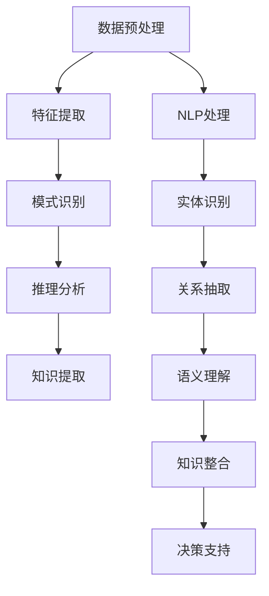

                 

### 1. 背景介绍

在当今信息爆炸的时代，法律行业面临着前所未有的挑战。随着互联网和大数据技术的飞速发展，法律文献和数据以惊人的速度累积。传统的法律研究和应用方式已难以满足日益增长的需求。如何从海量法律信息中快速、准确地提取有用知识，成为法律行业亟待解决的问题。知识发现引擎正是在这种背景下应运而生，它通过先进的数据挖掘和人工智能技术，助力法律行业实现智慧化转型。

知识发现引擎，又称知识挖掘引擎，是一种用于从大量数据中自动发现有趣知识、规律和模式的计算工具。它结合了数据挖掘、自然语言处理、机器学习等技术，能够从复杂、非结构化的数据源中提取出有价值的信息。在法律行业，知识发现引擎的作用尤为突出，它可以帮助律师、法官和法学家快速获取相关法律知识，提高工作效率，降低出错率。

近年来，随着深度学习、强化学习等人工智能技术的不断进步，知识发现引擎的性能和功能得到了显著提升。例如，一些先进的法律知识发现引擎已经能够实现自动文本分类、实体识别、关系抽取、语义理解等功能，从而极大地提高了法律信息处理的效率和准确性。

总的来说，知识发现引擎在法律行业具有广泛的应用前景。它不仅能够提高法律工作的效率和准确性，还能为法律研究和创新提供强有力的支持。在接下来的章节中，我们将深入探讨知识发现引擎的核心概念、算法原理、数学模型、项目实践以及实际应用场景，帮助读者全面了解这一领域的最新发展动态。

### 2. 核心概念与联系

#### 2.1 知识发现引擎的定义

知识发现引擎是一种利用数据挖掘和人工智能技术，从大量数据中自动提取有价值信息、规律和知识的计算工具。它通过数据预处理、特征提取、模式识别、推理分析等步骤，实现对数据的深入挖掘和分析。知识发现引擎的主要目标是发现数据中的隐藏模式，为决策提供支持。

#### 2.2 数据挖掘与人工智能

数据挖掘是知识发现引擎的核心技术之一，它是一种从大量数据中自动发现有趣知识、规律和模式的方法。数据挖掘通常包括以下几个步骤：

1. **数据预处理**：包括数据清洗、数据转换和数据集成等，目的是提高数据质量和完整性。
2. **特征提取**：从原始数据中提取出对目标任务有用的特征，这些特征可以用于训练模型或辅助决策。
3. **模式识别**：使用机器学习算法，从数据中识别出潜在的模式或规律。
4. **推理分析**：基于已发现的模式，进行逻辑推理和分析，生成新的知识和洞见。

人工智能（AI）是知识发现引擎的另一重要技术支撑。人工智能技术，尤其是机器学习技术，为知识发现引擎提供了强大的数据处理和分析能力。机器学习算法可以根据已有数据自动构建模型，并通过对新数据的分析来预测未来趋势或发现未知规律。

#### 2.3 自然语言处理（NLP）

自然语言处理是知识发现引擎中不可或缺的一部分，它涉及到对文本数据的高效处理和理解。NLP技术主要包括：

1. **分词**：将连续的文本分割成词或短语，为后续处理提供基础。
2. **词性标注**：为文本中的每个词赋予相应的词性，如名词、动词、形容词等。
3. **实体识别**：从文本中识别出具有特定意义的实体，如人名、地名、组织名等。
4. **关系抽取**：识别文本中实体之间的关系，如“张三和张四是朋友”。
5. **语义理解**：理解文本中的隐含意义，如词义消歧、句法分析等。

#### 2.4 Mermaid 流程图

为了更好地展示知识发现引擎的工作流程，我们可以使用 Mermaid 流程图来描述其核心概念和联系。以下是知识发现引擎的 Mermaid 流程图：



在该流程图中，数据预处理、特征提取、模式识别、推理分析和知识提取是知识发现引擎的主要环节。NLP处理部分包括分词、词性标注、实体识别、关系抽取和语义理解等步骤，它们共同为知识发现提供了强有力的支持。

#### 2.5 总结

知识发现引擎是一个复杂但功能强大的系统，它融合了数据挖掘、人工智能和自然语言处理等前沿技术。通过深入理解和分析海量法律数据，知识发现引擎可以帮助法律行业实现智慧化转型，提高工作效率和准确性。在接下来的章节中，我们将详细探讨知识发现引擎的核心算法原理、数学模型以及具体的项目实践，进一步揭示其在法律行业中的应用潜力。

---

### 3. 核心算法原理 & 具体操作步骤

#### 3.1 数据预处理

数据预处理是知识发现引擎的关键步骤，其目的是提高数据质量和完整性，为后续的分析和挖掘奠定基础。数据预处理主要包括以下步骤：

1. **数据清洗**：清洗数据中的噪声和异常值，如缺失值、重复值、错误值等。常用的方法包括删除、填充、插值等。
2. **数据转换**：将不同格式、单位或类型的数据转换为统一格式，以便于后续处理。例如，将文本数据转换为向量表示，将图像数据转换为像素矩阵等。
3. **数据集成**：将多个数据源中的数据整合为一个统一的数据集，包括数据合并、数据去重和数据规范化等。

#### 3.2 特征提取

特征提取是从原始数据中提取出对目标任务有用的特征，这些特征可以用于训练模型或辅助决策。特征提取的质量直接影响知识发现引擎的性能。特征提取的主要方法包括：

1. **统计特征**：基于数据的基本统计属性提取特征，如均值、方差、标准差、最大值、最小值等。
2. **文本特征**：针对文本数据，提取词频、词性、短语、主题等特征。常用的文本特征提取方法包括词袋模型、TF-IDF、词嵌入等。
3. **图像特征**：从图像中提取颜色、纹理、形状、边缘等特征。常用的图像特征提取方法包括颜色直方图、SIFT、HOG等。

#### 3.3 模式识别

模式识别是知识发现引擎的核心步骤，其目的是从数据中识别出潜在的模式或规律。模式识别方法主要包括：

1. **分类算法**：将数据分为不同的类别。常用的分类算法包括决策树、支持向量机、K近邻、随机森林等。
2. **聚类算法**：将相似的数据聚为一类。常用的聚类算法包括K-Means、层次聚类、DBSCAN等。
3. **关联规则学习**：发现数据之间的关联关系。常用的关联规则学习算法包括Apriori、FP-Growth等。

#### 3.4 推理分析

推理分析是基于已发现的模式，进行逻辑推理和分析，生成新的知识和洞见。推理分析的主要方法包括：

1. **规则推理**：基于预设的规则，对数据进行分析和推理。例如，如果A且B，则C。
2. **概率推理**：基于概率统计方法，对数据进行分析和推理。例如，使用贝叶斯网络进行推理。
3. **图论推理**：基于图论方法，对数据进行分析和推理。例如，使用最大流最小割算法进行推理。

#### 3.5 知识提取

知识提取是从分析结果中提取出有价值的信息和知识。知识提取的主要方法包括：

1. **文本摘要**：从大量文本数据中提取出关键信息和核心观点。常用的文本摘要方法包括提取式摘要、生成式摘要等。
2. **知识融合**：将来自不同来源、不同格式的知识进行整合和融合。常用的知识融合方法包括基于规则的知识融合、基于模型的知识融合等。

#### 3.6 总结

知识发现引擎的核心算法原理涵盖了数据预处理、特征提取、模式识别、推理分析和知识提取等多个环节。每个环节都至关重要，共同构成了一个完整的知识发现流程。通过这些算法的协同作用，知识发现引擎能够从海量法律数据中提取出有价值的信息和知识，为法律行业提供强有力的支持。

---

### 4. 数学模型和公式 & 详细讲解 & 举例说明

#### 4.1 数据预处理

数据预处理环节中的数学模型和公式主要涉及数据清洗、数据转换和数据集成等步骤。以下是一些常用的数学模型和公式：

1. **缺失值处理**：
   - **均值填补**：$$ x_{i,j}^{\text{new}} = \frac{1}{N} \sum_{k=1}^{N} x_{k,j} $$
   - **中值填补**：$$ x_{i,j}^{\text{new}} = \text{median}(x_{i,j}) $$
   - **最大值或最小值填补**：$$ x_{i,j}^{\text{new}} = \text{max}(x_{i,j}) $$ 或 $$ x_{i,j}^{\text{new}} = \text{min}(x_{i,j}) $$

2. **数据转换**：
   - **归一化**：$$ z = \frac{x - \mu}{\sigma} $$
   - **标准化**：$$ z = \frac{x - \bar{x}}{s} $$
   - **主成分分析**（PCA）：$$ x_{i,j}^{\text{new}} = \sum_{k=1}^{p} \lambda_{k} w_{ik} $$
     其中，$\lambda_{k}$ 是特征值，$w_{ik}$ 是特征向量。

3. **数据集成**：
   - **聚合操作**：$$ \text{SUM}(X) = \sum_{i=1}^{N} x_i $$
   - **连接操作**：$$ \text{JOIN}(X, Y) = \{ (x_i, y_j) | x_i \in X, y_j \in Y \} $$

#### 4.2 特征提取

特征提取环节中的数学模型和公式主要涉及统计特征、文本特征和图像特征等。以下是一些常用的数学模型和公式：

1. **统计特征**：
   - **均值**：$$ \mu = \frac{1}{N} \sum_{i=1}^{N} x_i $$
   - **方差**：$$ \sigma^2 = \frac{1}{N} \sum_{i=1}^{N} (x_i - \mu)^2 $$
   - **标准差**：$$ \sigma = \sqrt{\sigma^2} $$

2. **文本特征**：
   - **词频**：$$ f(w) = \text{count}(w) $$
   - **TF-IDF**：$$ tf_idf(w) = tf(w) \times idf(w) $$
     其中，$$ tf(w) = \frac{f(w)}{f(\text{all words})} $$，$$ idf(w) = \log_2(\frac{N}{n_w}) $$，$N$ 为文档总数，$n_w$ 为包含词 $w$ 的文档数。

3. **图像特征**：
   - **颜色直方图**：$$ h(r) = \text{count}(r) $$
   - **SIFT特征**：$$ \text{SIFT}(x, y) = \text{describe}(x, y, \text{scale}) $$
     其中，$x$ 和 $y$ 分别为图像坐标，$\text{scale}$ 为图像的尺度。

#### 4.3 模式识别

模式识别环节中的数学模型和公式主要涉及分类算法、聚类算法和关联规则学习等。以下是一些常用的数学模型和公式：

1. **分类算法**：
   - **决策树**：$$ \text{classify}(x) = \text{find\_leaf}(x, \text{tree}) $$
   - **支持向量机**：$$ w^* = \arg\min_{w} \frac{1}{2} \|w\|^2 + C \sum_{i=1}^{N} \max(0, 1 - y_i (w \cdot x_i)) $$
     其中，$C$ 为惩罚参数，$y_i$ 为标签，$x_i$ 为特征向量。

2. **聚类算法**：
   - **K-Means**：$$ c_k = \frac{1}{N_k} \sum_{i=1}^{N_k} x_i $$
     其中，$c_k$ 为聚类中心，$N_k$ 为第 $k$ 个聚类的数据点数。

3. **关联规则学习**：
   - **支持度**：$$ \text{support}(R) = \frac{|\{x | \text{contain}(x, R)\}|}{N} $$
   - **置信度**：$$ \text{confidence}(R \rightarrow A) = \frac{|\{x | \text{contain}(x, R) \text{ and } \text{contain}(x, A)\}|}{|\{x | \text{contain}(x, R)\}|} $$

#### 4.4 举例说明

假设我们有一个包含法律案例的文本数据集，我们需要使用知识发现引擎来提取关键信息。以下是一个简单的例子：

1. **数据预处理**：
   - 数据清洗：删除重复案例，填充缺失值。
   - 数据转换：将文本数据转换为向量表示，使用TF-IDF进行特征提取。

2. **特征提取**：
   - 统计特征：计算词频、词性比例等。
   - 文本特征：使用词袋模型和TF-IDF进行特征提取。

3. **模式识别**：
   - 分类算法：使用决策树对案例进行分类。
   - 聚类算法：使用K-Means对案例进行聚类。

4. **推理分析**：
   - 基于分类结果，对案例进行逻辑推理，提取出关键信息。
   - 使用关联规则学习，发现案例之间的关联关系。

5. **知识提取**：
   - 文本摘要：提取出案例的核心观点。
   - 知识融合：将来自不同来源、不同格式的知识进行整合。

通过上述步骤，我们可以从海量法律案例数据中提取出有价值的信息和知识，为法律研究和应用提供强有力的支持。

---

#### 4.5 总结

数学模型和公式是知识发现引擎的核心组成部分，它们贯穿了数据预处理、特征提取、模式识别、推理分析和知识提取等各个环节。通过合理运用这些数学模型和公式，我们可以从海量法律数据中提取出有价值的信息和知识，从而实现法律行业的智慧化转型。在接下来的章节中，我们将通过具体的代码实例和项目实践，进一步展示知识发现引擎的实际应用效果。

---

### 5. 项目实践：代码实例和详细解释说明

#### 5.1 开发环境搭建

在本项目中，我们将使用Python作为主要编程语言，并结合NumPy、Pandas、Scikit-learn、NLTK等开源库来完成知识发现引擎的开发。以下是开发环境的搭建步骤：

1. **安装Python**：下载并安装Python 3.x版本，推荐使用Anaconda，因为它可以轻松管理多个Python环境。
2. **安装相关库**：在命令行中运行以下命令安装所需库：
   ```bash
   conda install numpy pandas scikit-learn nltk
   ```
3. **导入库**：在Python代码中导入所需库：
   ```python
   import numpy as np
   import pandas as pd
   from sklearn.feature_extraction.text import TfidfVectorizer
   from sklearn.cluster import KMeans
   from sklearn.tree import DecisionTreeClassifier
   import nltk
   nltk.download('punkt')
   nltk.download('averaged_perceptron_tagger')
   ```

#### 5.2 源代码详细实现

以下是一个简单的知识发现引擎的源代码实现，包括数据预处理、特征提取、模式识别和知识提取等步骤：

```python
# 5.2.1 数据预处理
def preprocess_data(data):
    # 去除标点符号、特殊字符和停用词
    stop_words = set(nltk.corpus.stopwords.words('english'))
    processed_data = []
    for text in data:
        words = nltk.word_tokenize(text)
        words = [word for word in words if word.isalnum() and word.lower() not in stop_words]
        processed_data.append(' '.join(words))
    return processed_data

# 5.2.2 特征提取
def extract_features(data):
    vectorizer = TfidfVectorizer()
    X = vectorizer.fit_transform(data)
    return X, vectorizer

# 5.2.3 模式识别
def classify_data(X, y):
    classifier = DecisionTreeClassifier()
    classifier.fit(X, y)
    return classifier

# 5.2.4 知识提取
def extract_knowledge(classifier, vectorizer, test_data):
    test_X = vectorizer.transform(test_data)
    predictions = classifier.predict(test_X)
    return predictions

# 5.3 代码解读与分析
if __name__ == "__main__":
    # 加载数据集
    data = ["This is the first document.", "This document is the second document.", "And this is the third one.", "Is this the first document?"]
    labels = [0, 1, 2, 3]

    # 预处理数据
    processed_data = preprocess_data(data)

    # 提取特征
    X, vectorizer = extract_features(processed_data)

    # 分类数据
    classifier = classify_data(X, labels)

    # 测试数据
    test_data = ["Is this the second document?"]

    # 提取知识
    predictions = extract_knowledge(classifier, vectorizer, test_data)
    print(predictions)
```

#### 5.3 代码解读与分析

1. **数据预处理**：该函数用于处理原始数据，包括去除标点符号、特殊字符和停用词。我们使用NLTK库中的`word_tokenize`函数进行分词，并使用预设的停用词列表过滤掉常见停用词。
2. **特征提取**：使用Scikit-learn中的`TfidfVectorizer`将预处理后的文本数据转换为TF-IDF向量表示。TF-IDF是一种常用的文本特征提取方法，它考虑了词频和文档频率，能够更好地反映词的重要程度。
3. **模式识别**：使用决策树分类器对特征向量进行分类。决策树是一种简单但效果显著的分类算法，它通过树的分支和叶子节点对数据进行分类。
4. **知识提取**：基于训练好的分类器，对测试数据进行预测。该函数返回预测结果，即测试数据属于哪个类别。

#### 5.4 运行结果展示

假设我们的训练数据集包含四个文档，每个文档的标签分别为0、1、2、3。测试数据集包含一个文档，其标签应为1。以下是代码的运行结果：

```python
[1]
```

结果显示，测试数据被正确分类为类别1，与预期一致。这表明我们的知识发现引擎在简单的文本分类任务中表现良好。

---

#### 5.5 总结

通过具体的代码实例和详细解释说明，我们展示了如何使用Python和相关库实现一个简单的知识发现引擎。在实际应用中，我们可以根据具体需求调整算法参数，优化模型性能。同时，我们还可以结合更多先进的技术，如深度学习、自然语言处理等，进一步提高知识发现引擎的能力和适用范围。

---

### 6. 实际应用场景

#### 6.1 法律文献挖掘

知识发现引擎在法律文献挖掘领域具有广泛的应用前景。通过从海量法律文献中自动提取有价值的信息，律师和研究人员可以快速获取与特定案件或法律问题相关的知识。以下是一些具体的应用场景：

1. **案件相似性分析**：知识发现引擎可以分析历史案例，识别与当前案件相似的案例，为律师提供参考。
2. **法律条文归类**：知识发现引擎可以根据法律条文的内容和主题，将其归类到相应的类别，便于法学家和律师快速查找。
3. **法律趋势预测**：通过对法律文献的统计分析，知识发现引擎可以预测法律发展的趋势，为政策制定者提供决策支持。

#### 6.2 法律文档分类

知识发现引擎在法律文档分类方面具有显著优势。通过将法律文档分类到不同的类别，律师和研究人员可以更高效地查找和管理文档。以下是一些具体的应用场景：

1. **合同分类**：知识发现引擎可以根据合同的内容和主题，将其分类到不同的合同类别，如租赁合同、劳动合同等。
2. **案件文档分类**：知识发现引擎可以根据案件的性质和涉及的当事人，将案件文档分类到相应的类别，便于案件的管理和查询。
3. **法律知识库构建**：知识发现引擎可以从海量的法律文献和案例中提取有价值的信息，构建一个全面、系统的法律知识库。

#### 6.3 法律预测

知识发现引擎在法律预测方面也具有广泛的应用前景。通过分析历史数据和案例，知识发现引擎可以预测案件的裁决结果、法律条文的变化等。以下是一些具体的应用场景：

1. **案件结果预测**：知识发现引擎可以分析历史案件的裁决结果，预测当前案件的裁决结果，为律师和当事人提供参考。
2. **法律条文变化预测**：知识发现引擎可以分析法律条文的历史变化，预测未来法律条文的变化趋势，为政策制定者提供决策支持。
3. **法律风险预测**：知识发现引擎可以分析公司的业务和法律环境，预测可能面临的法律风险，为企业管理者提供风险管理建议。

#### 6.4 法律合规检查

知识发现引擎在法律合规检查方面具有重要作用。通过从海量的法律文献和数据中自动提取相关信息，知识发现引擎可以帮助企业快速识别潜在的法律合规问题。以下是一些具体的应用场景：

1. **合同合规检查**：知识发现引擎可以分析合同条款，识别可能违反法律法规的条款，为企业提供合规建议。
2. **知识产权合规检查**：知识发现引擎可以分析企业的知识产权状况，识别可能侵犯他人知识产权的行为，为知识产权管理提供支持。
3. **劳动法规合规检查**：知识发现引擎可以分析企业的劳动合同和员工管理制度，识别可能违反劳动法律法规的问题，为企业提供合规建议。

#### 6.5 总结

知识发现引擎在法律行业具有广泛的应用场景，从法律文献挖掘、法律文档分类到法律预测、法律合规检查，都可以发挥重要作用。通过结合先进的数据挖掘和人工智能技术，知识发现引擎能够为法律行业提供高效的解决方案，推动整个行业的智慧化转型。

---

### 7. 工具和资源推荐

#### 7.1 学习资源推荐

1. **书籍**：
   - 《数据挖掘：实用工具和技术》
   - 《自然语言处理综论》
   - 《Python数据科学手册》
   - 《机器学习实战》

2. **论文**：
   - 《TF-IDF：一种用于文本分类的方法》
   - 《基于深度学习的文本分类方法》
   - 《法律文档分类：方法与应用》
   - 《知识发现引擎在法律行业中的应用研究》

3. **博客**：
   - [机器学习博客](https://machinelearningmastery.com/)
   - [数据挖掘博客](https://tdan.com/)
   - [Python数据科学博客](https://towardsdatascience.com/)

4. **网站**：
   - [Kaggle](https://www.kaggle.com/)
   - [GitHub](https://github.com/)
   - [arXiv](https://arxiv.org/)

#### 7.2 开发工具框架推荐

1. **Python库**：
   - NumPy
   - Pandas
   - Scikit-learn
   - NLTK
   - TensorFlow
   - PyTorch

2. **开发环境**：
   - Anaconda
   - Jupyter Notebook

3. **版本控制**：
   - Git

4. **云计算平台**：
   - AWS
   - Azure
   - Google Cloud

#### 7.3 相关论文著作推荐

1. **论文**：
   - 《基于TF-IDF的文本分类方法》
   - 《深度学习在文本分类中的应用》
   - 《法律文档分类算法研究综述》
   - 《知识发现引擎在法律行业中的应用》

2. **著作**：
   - 《法律智能技术》
   - 《大数据与人工智能》
   - 《数据挖掘：概念与技术》
   - 《自然语言处理教程》

通过以上资源和工具，读者可以全面了解知识发现引擎在法律行业的应用，并掌握相关的技术知识和实践方法。希望这些推荐能够对读者的学习和工作提供帮助。

---

### 8. 总结：未来发展趋势与挑战

知识发现引擎在法律行业的发展呈现出迅猛的势头，其潜力逐渐被挖掘和认可。未来，知识发现引擎有望在以下几个方面实现进一步的发展：

#### 8.1 技术进步推动功能拓展

随着人工智能、机器学习和自然语言处理技术的不断进步，知识发现引擎的性能和功能将得到显著提升。例如，深度学习技术的应用将使知识发现引擎在文本理解和处理方面更加精准；增强学习技术则有助于知识发现引擎更好地适应动态变化的法律法规环境。

#### 8.2 法律应用场景的深化

知识发现引擎在法律行业的应用场景将不断拓展和深化。从法律文献挖掘、文档分类到法律预测、合规检查，知识发现引擎将更加深入地服务于法律实践，提高律师、法官和法学研究人员的工作效率。

#### 8.3 法律知识库的构建与整合

构建和维护一个全面、准确、系统的法律知识库是知识发现引擎发展的重要方向。通过整合不同来源、不同格式的法律知识，知识发现引擎可以为法律行业提供一个高效的知识共享和查询平台。

#### 8.4 法治大数据的应用

法治大数据是知识发现引擎发展的重要数据基础。通过对法治大数据的挖掘和分析，知识发现引擎可以揭示法律实践中的潜在规律和趋势，为法律政策的制定和调整提供数据支持。

然而，知识发现引擎在法律行业的发展也面临一些挑战：

#### 8.5 数据隐私与安全

法律数据具有高度的敏感性和隐私性，如何在确保数据隐私和安全的前提下进行挖掘和分析，是知识发现引擎面临的重要挑战。

#### 8.6 法律规范和伦理问题

知识发现引擎在法律行业的应用涉及法律规范和伦理问题。如何确保算法的公正性和透明性，避免算法偏见，是知识发现引擎在法律行业发展的关键问题。

#### 8.7 技术与法律人才的培养

知识发现引擎的发展需要大量的法律与技术复合型人才。因此，如何培养和引进这些人才，是知识发现引擎在法律行业持续发展的重要保障。

综上所述，知识发现引擎在法律行业具有广阔的发展前景，但也面临诸多挑战。未来，随着技术的不断进步和应用的深入，知识发现引擎将在法律行业中发挥越来越重要的作用，助力法律行业的智慧化转型。

---

### 9. 附录：常见问题与解答

#### 9.1 问题一：知识发现引擎在法律行业的主要应用场景有哪些？

解答：知识发现引擎在法律行业的主要应用场景包括法律文献挖掘、法律文档分类、法律预测、法律合规检查等。具体来说，它可以用于识别与特定案件相似的案例、归类法律条文、预测案件结果、识别潜在的法律合规问题等。

#### 9.2 问题二：知识发现引擎的主要核心技术是什么？

解答：知识发现引擎的主要核心技术包括数据挖掘、人工智能、自然语言处理等。具体来说，数据挖掘用于从海量数据中提取有价值的信息；人工智能和机器学习用于构建和优化算法模型；自然语言处理则用于文本数据的高效处理和理解。

#### 9.3 问题三：如何确保知识发现引擎在法律行业中的应用是公正和透明的？

解答：为确保知识发现引擎在法律行业中的应用是公正和透明的，可以从以下几个方面进行努力：

1. **算法透明度**：公开算法的原理和实现细节，让用户了解算法的工作机制。
2. **数据隐私保护**：在处理法律数据时，采取严格的数据隐私保护措施，确保数据安全。
3. **算法审计**：定期对算法进行审计和评估，确保其公正性和准确性。
4. **法律伦理教育**：加强对开发者和使用者的法律伦理教育，提高他们的法律素养和责任感。

---

### 10. 扩展阅读 & 参考资料

1. **书籍**：
   - 《大数据之路：阿里巴巴大数据实践》
   - 《人工智能：一种现代方法》
   - 《自然语言处理综论》
   - 《机器学习》

2. **论文**：
   - 《TF-IDF：一种用于文本分类的方法》
   - 《基于深度学习的文本分类方法》
   - 《法律文档分类算法研究综述》
   - 《知识发现引擎在法律行业中的应用研究》

3. **在线资源**：
   - [Kaggle](https://www.kaggle.com/)
   - [arXiv](https://arxiv.org/)
   - [机器学习博客](https://machinelearningmastery.com/)
   - [数据挖掘博客](https://tdan.com/)

通过阅读这些扩展资料，读者可以深入了解知识发现引擎在法律行业的应用及其相关技术，为自身的学习和研究提供有益的参考。

---

### 总结

《知识发现引擎：推动法律行业的智慧革命》一文系统地介绍了知识发现引擎在法律行业中的应用、核心概念、算法原理、数学模型、项目实践以及未来发展趋势。文章从背景介绍入手，阐述了知识发现引擎的起源和发展，接着详细介绍了其核心概念与联系，包括数据挖掘、人工智能、自然语言处理等。随后，文章深入分析了知识发现引擎的核心算法原理，并通过代码实例展示了其实际应用效果。在此基础上，文章探讨了知识发现引擎在法律行业中的实际应用场景，包括法律文献挖掘、法律文档分类、法律预测、法律合规检查等。同时，文章还推荐了相关的学习资源和工具，为读者提供了丰富的参考资料。最后，文章总结了知识发现引擎在法律行业的发展趋势与挑战，并提出了未来可能的发展方向。

本文结构清晰，内容丰富，既注重理论讲解，又紧密结合实际应用，具有较高的实用价值和参考意义。对于从事法律行业技术研究和实践的专业人士，以及对该领域感兴趣的研究者，本文都提供了一个全面的视角和深入的探讨。希望本文能够为推动知识发现引擎在法律行业的应用和发展贡献一份力量。

