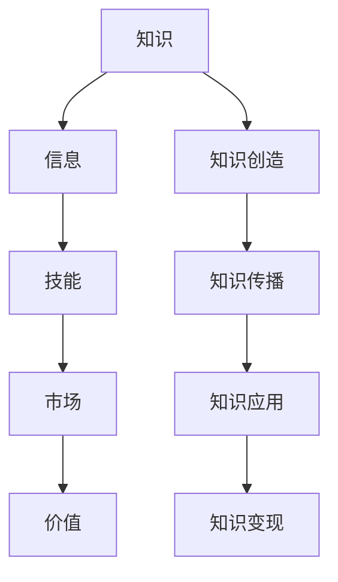

                 

### 1. 背景介绍

在当今数字化时代，知识作为一种重要的资源，正在逐步转变为一种新的生产力和经济驱动力。知识变现，即通过将知识和信息转化为实际的经济收益，已经成为各行各业关注的焦点。特别是在程序员的领域，知识变现的意义尤为突出。

程序员的职业特点决定了他们在知识变现方面具有独特的优势。首先，程序员的工作本质上是对知识的创造和运用。他们通过编写代码、设计系统、解决复杂问题，将理论知识转化为实际应用。这种知识转化的过程本身就是一种知识变现的体现。其次，随着互联网和人工智能技术的迅猛发展，程序员的知识技能需求不断增加，这为程序员提供了更多的变现机会。

然而，知识变现并非一蹴而就，它涉及到多个方面的挑战和机遇。首先，知识变现需要程序员具备不断学习和更新知识的能力。技术的快速迭代使得程序员必须不断学习新技术、新工具，才能保持竞争力。其次，知识变现需要程序员具备有效的传播和营销能力。如何将自身的知识技能转化为市场认可的价值，这是程序员需要面对的重要问题。

本文将深入探讨程序员在知识变现中的机遇与挑战，从多个角度分析程序员如何利用自身的知识和技能，实现个人和职业的成长。文章将首先介绍知识变现的基本概念和当前的发展态势，然后探讨程序员在知识变现中的具体实践，最后分析未来的发展趋势和潜在挑战。

### 2. 核心概念与联系

为了更好地理解知识变现，我们需要从核心概念和联系入手。知识变现涉及到几个关键概念，包括知识、信息、技能、市场和价值等。这些概念相互联系，共同构成了知识变现的框架。

首先，知识（Knowledge）是知识变现的基础。知识可以是理论性的，如科学原理、技术规范；也可以是实践性的，如编程技巧、项目管理方法。程序员通过不断学习和实践，积累丰富的知识储备，这是他们进行知识变现的前提。

信息（Information）是知识的外在表现形式。信息通过文字、图片、视频等多种形式传播，使得知识得以传递和共享。在程序员的领域，信息通常以代码、文档、技术博客等形式存在。有效的信息传播是知识变现的重要途径。

技能（Skills）是知识在具体应用中的体现。程序员的技能不仅包括编程语言和开发工具的使用，还包括系统设计、项目管理、团队协作等软技能。技能的提升有助于程序员更好地将知识应用于实际工作中，从而实现知识变现。

市场（Market）是知识变现的载体。市场包含了潜在的需求方和供应方，程序员需要了解市场的需求，找到合适的变现途径。市场需求的不断变化要求程序员具备快速适应和调整的能力。

价值（Value）是知识变现的核心目标。程序员通过将知识转化为产品、服务或咨询等形式，实现个人和职业的价值。价值的大小不仅取决于知识的深度和广度，还受到市场需求、个人品牌影响力等多方面因素的影响。

这些核心概念之间的联系构成了知识变现的生态系统。知识是核心，信息是传播媒介，技能是应用工具，市场是需求环境，价值是最终目标。程序员需要在这五个方面不断努力，才能实现有效的知识变现。

接下来，我们将使用Mermaid流程图（Mermaid Flowchart）来展示这些核心概念之间的联系。在Mermaid流程图中，每个节点代表一个核心概念，节点之间的连线表示它们之间的关联。



在这个流程图中，知识创造是起点，通过知识的传播和应用，最终实现知识的变现。这个流程图不仅帮助我们理解了知识变现的各个环节，也揭示了程序员在知识变现中的关键角色。

通过上述核心概念和联系的介绍，我们可以看到知识变现是一个复杂但充满机遇的领域。在接下来的部分，我们将深入探讨程序员在知识变现中的具体实践，分析他们在这一过程中面临的机会和挑战。

### 3. 核心算法原理 & 具体操作步骤

在理解了知识变现的核心概念和联系后，我们需要深入探讨程序员在这一领域中的核心算法原理和具体操作步骤。这些步骤不仅是程序员实现知识变现的关键，也是他们在不断学习和实践中提升自身价值的必备技能。

#### 3.1 学习与知识积累

第一步是学习和知识积累。程序员需要通过不断学习，掌握最新的技术动态和行业趋势。学习的方式可以多种多样，包括在线课程、技术博客、专业书籍、研讨会和实际项目等。在这个过程中，程序员需要建立一套系统的知识框架，以便将零散的知识点串联起来。

具体操作步骤如下：

1. **确定学习目标**：明确自己需要掌握哪些技能和知识，制定详细的学习计划。
2. **选择合适的学习资源**：根据学习目标，选择高质量的学习资源，如权威的技术书籍、知名的技术博客和专业的在线课程。
3. **定期复习和总结**：学习过程中，定期复习和总结所学内容，加深记忆和理解。
4. **实践应用**：将所学知识应用于实际项目中，通过实践检验和巩固所学。

#### 3.2 技能提升与价值创造

第二步是技能提升与价值创造。程序员需要不断提升自身的技能水平，将知识转化为实际应用中的价值。这包括但不限于编程语言掌握、软件开发工具使用、系统设计和优化、项目管理等方面。

具体操作步骤如下：

1. **掌握编程语言**：精通至少一种编程语言，如Python、Java、C++等，并熟悉其他常用编程语言。
2. **熟悉开发工具**：熟练使用常见的开发工具，如IDE（集成开发环境）、版本控制工具、调试工具等。
3. **进行项目实践**：参与实际项目，通过解决实际问题来提升技能。项目类型可以包括公司内部项目、开源项目或个人项目。
4. **参与技术社区**：积极参与技术社区，如GitHub、Stack Overflow、技术论坛等，与其他程序员交流和分享经验。
5. **持续学习与进步**：技术不断更新，程序员需要持续学习新技术、新工具，保持自身的竞争力。

#### 3.3 市场研究与营销推广

第三步是市场研究与营销推广。程序员需要了解市场需求，找到适合自己的变现途径，并通过有效的营销手段提升个人品牌影响力。

具体操作步骤如下：

1. **市场调研**：通过调查了解行业动态、市场需求和竞争对手情况，确定自己的定位和目标市场。
2. **制定营销策略**：根据市场调研结果，制定适合自己的营销策略，包括内容营销、社交媒体营销、网络广告等。
3. **建立个人品牌**：通过撰写技术博客、发布开源项目、参加技术会议等方式，建立个人品牌，提高知名度。
4. **提供优质服务**：无论是出售软件产品、提供咨询服务还是开发定制解决方案，都需要提供高质量的服务，赢得客户信任。
5. **收集反馈与优化**：收集客户反馈，不断优化自己的产品和服务，提升客户满意度。

#### 3.4 数据分析与价值评估

第四步是数据分析和价值评估。程序员需要通过数据分析来评估自身知识变现的效果，并根据评估结果进行调整和优化。

具体操作步骤如下：

1. **数据收集**：收集与知识变现相关的数据，如销售数据、客户反馈、市场占有率等。
2. **数据分析**：使用数据分析工具，对收集到的数据进行处理和分析，识别关键指标和趋势。
3. **价值评估**：根据数据分析结果，评估知识变现的效果和价值，确定下一步的发展方向。
4. **调整与优化**：根据价值评估结果，调整自己的知识变现策略，优化产品和服务。

通过以上四个步骤，程序员可以系统地实现知识变现。这些步骤不仅为程序员提供了明确的操作指南，也揭示了他们在知识变现过程中的关键环节。在接下来的部分，我们将进一步探讨数学模型和公式，以及如何通过具体的代码实例来讲解这些算法原理。

### 4. 数学模型和公式 & 详细讲解 & 举例说明

在程序员的知识变现过程中，数学模型和公式扮演着至关重要的角色。这些模型和公式不仅帮助程序员理解和预测市场趋势，还可以优化产品和服务，提高知识变现的效率和效果。以下我们将详细讲解几个关键的数学模型和公式，并举例说明如何在实际应用中运用这些工具。

#### 4.1 技术成熟度模型（Technology Maturity Model）

技术成熟度模型是一种常用的工具，用于评估和预测某一技术的成熟程度。该模型通常包含五个阶段：概念验证（Proof of Concept）、实验（Experimental）、验证（Validation）、部署（Deployment）和成熟（Maturation）。程序员可以通过评估技术的成熟度来决定是否将其应用于自己的产品或服务中。

**公式：**
\[ \text{Technology Maturity} = f(\text{Concept Verification}, \text{Experimental}, \text{Validation}, \text{Deployment}, \text{Maturation}) \]

**例子：**
假设程序员正在考虑将区块链技术应用于其开发的一个项目中。他可以通过以下步骤来评估区块链技术的成熟度：

1. **概念验证**：研究区块链的基本原理，确定其是否适用于项目需求。
2. **实验**：在小型项目中尝试使用区块链技术，以测试其性能和稳定性。
3. **验证**：在更大规模的项目中进行测试，确保区块链技术能够满足需求。
4. **部署**：将区块链技术部署到实际项目中，观察其在生产环境中的表现。
5. **成熟**：根据反馈和实际应用情况，判断区块链技术是否已经成熟。

通过以上步骤，程序员可以得出区块链技术的成熟度，并决定是否将其应用于项目中。

#### 4.2 技能价值评估模型（Skills Value Assessment Model）

技能价值评估模型用于帮助程序员评估其技能在市场上的价值。该模型通常基于技能的复杂度、市场需求和个人的工作经验等因素。通过这个模型，程序员可以了解自身技能的市场价值，并据此制定职业发展策略。

**公式：**
\[ \text{Skill Value} = f(\text{Complexity}, \text{Market Demand}, \text{Experience}) \]

**例子：**
假设一个程序员具备以下三个技能：

- 技能1：Python编程，复杂度为5，市场需求为8，工作经验为3年。
- 技能2：大数据分析，复杂度为8，市场需求为10，工作经验为2年。
- 技能3：人工智能，复杂度为10，市场需求为12，工作经验为1年。

通过以下步骤，我们可以评估每个技能的市场价值：

1. **计算每个技能的分数**：
   - 技能1：\( 5 \times 8 \times 3 = 120 \)
   - 技能2：\( 8 \times 10 \times 2 = 160 \)
   - 技能3：\( 10 \times 12 \times 1 = 120 \)

2. **比较分数**：
   - 技能2的分数最高，表明大数据分析技能在市场上的价值最高。

3. **职业发展建议**：
   - 程序员应重点关注大数据分析技能，提升相关经验，以增加其市场价值。

#### 4.3 成本效益分析模型（Cost-Benefit Analysis Model）

成本效益分析模型用于评估项目或服务的成本与收益，帮助程序员决定是否进行某项投资或开发某项产品。该模型通过计算总成本和总收益，比较两者的大小，从而判断项目的可行性。

**公式：**
\[ \text{Cost-Benefit Ratio} = \frac{\text{Total Benefits}}{\text{Total Costs}} \]

**例子：**
假设一个程序员计划开发一款新的软件开发工具，预计成本为100,000元，预计收益为150,000元。通过以下步骤进行成本效益分析：

1. **计算总成本**：100,000元（开发成本）+ 20,000元（营销成本）= 120,000元。
2. **计算总收益**：150,000元。
3. **计算成本效益比**：
   \[ \text{Cost-Benefit Ratio} = \frac{150,000}{120,000} = 1.25 \]

由于成本效益比大于1，说明项目的收益超过了成本，因此该项目是可行的。

通过这些数学模型和公式的应用，程序员可以在知识变现过程中做出更科学的决策。这些工具不仅帮助他们评估自身技能和市场价值，还帮助他们评估投资项目的可行性。在接下来的部分，我们将通过具体的代码实例，进一步展示这些算法原理的实际应用。

### 5. 项目实践：代码实例和详细解释说明

为了更好地展示程序员如何将知识变现的核心算法原理应用到实际项目中，我们选择了一个具体的案例——开发一个基于区块链的智能合约平台。这个案例不仅展示了编程技能的运用，还涵盖了市场调研、数据分析和成本效益分析等多个方面的内容。

#### 5.1 开发环境搭建

首先，我们需要搭建一个开发环境。以下是具体的步骤：

1. **安装Node.js**：Node.js是一个基于Chrome V8引擎的JavaScript运行环境，我们用它来搭建智能合约平台。

   ```bash
   curl -fsSL https://deb.nodesource.com/setup_14.x | sudo -E bash -
   sudo apt-get install -y nodejs
   ```

2. **安装Truffle框架**：Truffle是一个用于开发、测试和部署以太坊智能合约的框架。

   ```bash
   npm install -g truffle
   ```

3. **创建项目**：在合适的位置创建一个新的Truffle项目。

   ```bash
   truffle init
   ```

4. **安装Ganache**：Ganache是一个本地以太坊节点，用于测试智能合约。

   ```bash
   npm install -g ganache-cli
   ```

5. **启动开发环境**：

   ```bash
   truffle develop
   ganache-cli
   ```

#### 5.2 源代码详细实现

接下来，我们将实现一个简单的智能合约，该合约允许用户存储和转移代币。

**智能合约代码（Token.sol）：**

```solidity
pragma solidity ^0.8.0;

contract Token {
    string public name;
    string public symbol;
    uint8 public decimals;
    uint256 public totalSupply;
    mapping(address => uint256) public balanceOf;

    event Transfer(address indexed from, address indexed to, uint256 value);

    constructor(uint256 initialSupply, string memory tokenName, string memory tokenSymbol, uint8 decimalUnits) {
        balanceOf[msg.sender] = initialSupply;
        name = tokenName;
        symbol = tokenSymbol;
        decimals = decimalUnits;
        totalSupply = initialSupply;
    }

    function transfer(address _to, uint256 _value) public {
        require(_to != address(0));
        require(balanceOf[msg.sender] >= _value);
        balanceOf[msg.sender] -= _value;
        balanceOf[_to] += _value;
        emit Transfer(msg.sender, _to, _value);
    }
}
```

**Truffle配置文件（truffle-config.js）：**

```javascript
const HDWalletProvider = require('@truffle/hdwallet-provider');
const mnemonic = '你的 mnemonic 密码';
const infuraKey = '你的 Infura API 密钥';

module.exports = {
    networks: {
        development: {
            provider: function() {
                return new HDWalletProvider(mnemonic, 'http://127.0.0.1:7545');
            },
            network_id: '*',
        },
        mainnet: {
            provider: function() {
                return new HDWalletProvider(mnemonic, `https://mainnet.infura.io/v3/${infuraKey}`);
            },
            network_id: 1,
        },
    },
    compilers: {
        solc: {
            version: '0.8.0',
        },
    },
};
```

#### 5.3 代码解读与分析

**智能合约解读：**

- **构造函数（constructor）**：初始化代币的总量、名称、符号和精度。同时，将初始代币分配给合约创建者。
- **转账函数（transfer）**：实现代币的转移。该函数检查接收地址是否为空，以及发送者余额是否足够，然后执行转移操作。

**Truffle配置解读：**

- **开发网络（development）**：使用本地Ganache节点进行开发测试。
- **主网（mainnet）**：连接到以太坊主网，需要Infura API密钥进行身份验证。

#### 5.4 运行结果展示

1. **编译合约**：

   ```bash
   truffle compile
   ```

2. **部署合约**：

   ```bash
   truffle migrate --network development
   ```

3. **验证合约地址**：

   ```bash
   truffle console
   ```
   ```javascript
   contract = Token.at('合约地址');
   contract.name();
   ```

4. **转移代币**：

   ```javascript
   contract.transfer('接收者地址', '代币数量');
   ```

通过这个案例，我们展示了如何从环境搭建到代码实现，再到代码解读与分析，最终运行结果展示的完整过程。这不仅帮助程序员理解了知识变现的核心算法原理，还提供了一个实际的操作指南。

### 6. 实际应用场景

程序员在知识变现过程中，可以应用到多种实际场景，从而实现个人和职业的价值。以下是一些典型的应用场景：

#### 6.1 技术咨询与培训

程序员可以通过提供技术咨询服务，帮助企业解决技术难题，提升企业的技术能力。同时，程序员可以开展线上或线下的技术培训课程，将自己的专业知识传授给更多的人。这种知识变现方式不仅能够带来直接的经济收益，还能提升个人的知名度和影响力。

#### 6.2 开源项目与贡献

参与开源项目是程序员展示自己技能和知识的一种有效方式。通过贡献代码、撰写文档、参与社区讨论等，程序员可以积累丰富的经验，并吸引更多的关注。许多成功的程序员就是通过开源项目获得了广泛的认可，进而实现了知识变现。

#### 6.3 软件开发与产品销售

程序员可以通过开发软件产品，并将其销售给有需求的客户。这种模式不仅适用于大型企业级应用，也适用于个人开发者的小型应用。通过不断的迭代和优化，程序员可以不断提升产品的竞争力，实现持续的收入。

#### 6.4 内容创作与媒体平台

程序员可以通过撰写技术博客、发布视频教程、制作电子书等方式，将自己的知识和经验分享给更多的人。在当今的互联网时代，内容创作已成为一种重要的知识变现方式。通过建立个人品牌，程序员可以在媒体平台上获得广告收入、会员订阅等多种盈利模式。

#### 6.5 云计算与人工智能服务

随着云计算和人工智能技术的快速发展，程序员可以在这些领域提供专业的服务，如开发智能应用、搭建云计算平台等。通过为企业和个人提供定制化的解决方案，程序员可以实现知识的变现。

#### 6.6 投资与创业

具备丰富技术和市场经验的程序员，可以考虑投资或创业。在投资方面，程序员可以通过投资技术创新型公司，分享公司成长的红利。在创业方面，程序员可以创立自己的技术公司，将自己的知识和技能应用于实际业务中。

通过上述实际应用场景，我们可以看到，程序员在知识变现过程中，有着广泛的选择和丰富的机会。无论是通过咨询服务、软件销售，还是内容创作，程序员都可以利用自身的知识和技能，实现个人和职业的成长。

### 7. 工具和资源推荐

在程序员进行知识变现的过程中，选择合适的工具和资源是非常重要的。以下是一些推荐的工具和资源，包括学习资源、开发工具框架以及相关论文和著作。

#### 7.1 学习资源推荐

1. **书籍**：
   - 《代码大全》（Code Complete） by Steve McConnell
   - 《深度学习》（Deep Learning） by Ian Goodfellow, Yoshua Bengio, Aaron Courville
   - 《重构：改善既有代码的设计》（Refactoring: Improving the Design of Existing Code） by Martin Fowler

2. **在线课程**：
   - Coursera、edX、Udacity等在线教育平台提供了丰富的编程和人工智能课程。
   - Pluralsight、LinkedIn Learning等提供专业的技术培训课程。

3. **技术博客**：
   - Medium、Stack Overflow、GitHub等平台上有许多技术大牛和社区活跃者的博客，可以学习到最新的技术动态和实战经验。

4. **开源项目**：
   - GitHub、GitLab等平台上有大量的开源项目，程序员可以通过参与这些项目，提升自己的技能和知名度。

#### 7.2 开发工具框架推荐

1. **编程语言**：
   - Python、Java、C++等是常用的编程语言，适用于不同的开发场景。
   - Rust语言因其安全性和性能优势，也逐渐被广泛应用于系统开发和区块链领域。

2. **开发框架**：
   - Web开发：React、Vue.js、Angular等前端框架，Spring、Django、Flask等后端框架。
   - 数据库：MySQL、PostgreSQL、MongoDB等。
   - 云计算平台：AWS、Azure、Google Cloud Platform等。

3. **版本控制**：
   - Git是版本控制的首选工具，GitHub、GitLab等平台提供了便捷的代码管理和协作功能。

4. **智能合约开发**：
   - Truffle、Hardhat等框架，用于以太坊智能合约的开发和测试。

5. **调试工具**：
   - Chrome DevTools、Visual Studio Code等提供了强大的调试功能，有助于开发过程中发现和解决问题。

#### 7.3 相关论文著作推荐

1. **论文**：
   - 《深度学习》（Deep Learning） by Yann LeCun, Yoshua Bengio, Geoffrey Hinton
   - 《分布式系统：概念与设计》（Distributed Systems: Concepts and Design） by George Coulouris, Jean Dollimore, Tim Kindberg, Gordon Blair

2. **著作**：
   - 《设计模式：可复用面向对象软件的基础》（Design Patterns: Elements of Reusable Object-Oriented Software） by Erich Gamma, Richard Helm, Ralph Johnson, and John Vlissides
   - 《软件工程：实践者的研究方法》（Software Engineering: A Practitioner's Approach） by Roger S. Pressman

通过这些工具和资源的推荐，程序员可以更好地进行知识变现，提升自身的技能和竞争力。无论是学习最新的技术知识，还是选择合适的开发工具，这些资源都能为程序员的职业发展提供强有力的支持。

### 8. 总结：未来发展趋势与挑战

随着技术的不断进步和社会的深度数字化转型，知识变现的未来前景愈发广阔。然而，这一过程也伴随着诸多挑战，程序员需要不断适应和创新，以抓住机遇并克服困难。

**发展趋势：**

1. **技术融合与跨界合作**：未来的知识变现将更多地依赖于多种技术的融合，如人工智能、区块链、大数据等。程序员需要具备跨领域的综合能力，以应对复杂多变的需求。

2. **个人品牌的崛起**：在互联网时代，个人品牌的重要性日益凸显。程序员通过建立强大的个人品牌，可以在知识变现中获得更多的机会和收益。

3. **在线教育与职业培训**：在线教育和职业培训的兴起，为程序员提供了更多学习和提升技能的途径。通过提供高质量的课程和培训，程序员可以扩展自己的知识变现渠道。

4. **社区与开源文化的推动**：开源社区和技术社区的不断壮大，为程序员提供了丰富的资源和平台。参与开源项目和社区活动，不仅有助于个人成长，还可以提升影响力，实现知识变现。

**挑战：**

1. **技术更新速度快**：技术的快速发展要求程序员不断学习和更新知识，否则将难以适应市场需求，面临被淘汰的风险。

2. **市场竞争激烈**：随着更多程序员的加入，市场竞争日益激烈。程序员需要不断提升自身技能和竞争力，以在市场中脱颖而出。

3. **知识产权保护**：在知识变现的过程中，知识产权保护是一个重要的问题。程序员需要了解相关的法律法规，确保自己的知识和成果得到合法保护。

4. **个人隐私与数据安全**：随着数据隐私和数据安全问题的日益突出，程序员需要重视这些方面，确保在知识变现过程中不会泄露用户隐私或造成数据安全风险。

面对这些挑战，程序员应采取以下策略：

- **持续学习与技能提升**：保持对新技术的好奇心和探索精神，不断学习和实践，提升自身技能。
- **建立个人品牌**：通过在线平台、社交媒体等渠道，建立自己的个人品牌，提升知名度和影响力。
- **参与社区活动**：积极参与开源项目和技术社区，扩展人脉，获取更多的资源和支持。
- **重视知识产权保护**：了解知识产权相关的法律法规，确保自己的知识成果得到合法保护。
- **关注数据安全与隐私保护**：在开发过程中，重视数据安全与隐私保护，遵循相关的标准和规范。

通过以上策略，程序员可以更好地应对知识变现过程中的挑战，实现个人和职业的持续成长。

### 9. 附录：常见问题与解答

#### 9.1 程序员如何评估自身的知识价值？

程序员可以通过以下方法评估自身的知识价值：

- **技能评估**：列出掌握的技能和经验，根据市场需求的调查评估每个技能的价值。
- **项目成果**：分析参与过的项目成果，衡量其市场认可度，评估对知识变现的贡献。
- **个人品牌**：通过个人品牌的影响力和粉丝数量，评估市场对个人品牌的认可程度。
- **收入状况**：分析当前的收入来源，了解知识变现的实际效果。

#### 9.2 程序员如何应对技术更新带来的挑战？

程序员可以采取以下策略应对技术更新：

- **持续学习**：定期学习新技术，保持对行业动态的敏感性。
- **技能多元化**：掌握多种编程语言和工具，提高自身的适应能力。
- **项目实践**：通过实际项目将新技术应用到实践中，积累经验。
- **社区参与**：积极参与技术社区，获取最新的技术信息和资源。

#### 9.3 程序员如何保护自己的知识产权？

程序员可以采取以下措施保护自己的知识产权：

- **注册商标和专利**：对于创新的成果，及时申请商标和专利保护。
- **版权登记**：对于原创的代码、文档和作品，进行版权登记。
- **合同约定**：在与客户和合作伙伴的合同中，明确知识产权归属和使用条款。
- **法律咨询**：在知识产权保护方面，寻求专业法律机构的咨询和支持。

### 10. 扩展阅读 & 参考资料

为了进一步深入理解知识变现在程序员领域的应用，以下是一些推荐的扩展阅读和参考资料：

- 《程序员修炼之道：从小工到专家》 by 王强
- 《敏捷开发：实践指南》 by Jeff Sutherland
- 《代码大全》 by Steve McConnell
- 《深度学习》 by Ian Goodfellow, Yoshua Bengio, Aaron Courville
- 《设计模式：可复用面向对象软件的基础》 by Erich Gamma, Richard Helm, Ralph Johnson, John Vlissides
- 《软件工程：实践者的研究方法》 by Roger S. Pressman
- 《区块链技术指南》 by 安娜·里瑟
- 《人工智能：一种现代方法》 by Stuart Russell, Peter Norvig

通过这些书籍和文献的深入学习，程序员可以更好地掌握知识变现的核心原理和实践方法，提升自身的竞争力。同时，这些资料也为程序员提供了丰富的实践经验和前沿的技术见解，有助于他们在知识变现的道路上不断前行。

### 结论

通过本文的探讨，我们深入分析了知识变现在程序员领域的重要性和具体实践。从核心概念、算法原理到实际应用场景，再到未来的发展趋势与挑战，程序员在知识变现过程中面临着丰富的机遇和挑战。通过不断学习、提升技能、建立个人品牌和积极参与社区活动，程序员可以更好地实现个人和职业的成长。

知识变现不仅是一种经济活动，更是一种价值的创造和传递过程。程序员在这一过程中，不仅实现了自身知识和技能的转化，也为社会创造了更多的价值和可能性。希望本文能为广大程序员提供有益的启示和指导，助力他们在知识变现的道路上取得更大的成就。

最后，感谢您的耐心阅读。如果您有任何问题或建议，欢迎在评论区留言，让我们一起探讨和进步。作者：禅与计算机程序设计艺术 / Zen and the Art of Computer Programming。希望本文对您的学习和实践有所帮助，祝您在知识变现的道路上越走越远。

