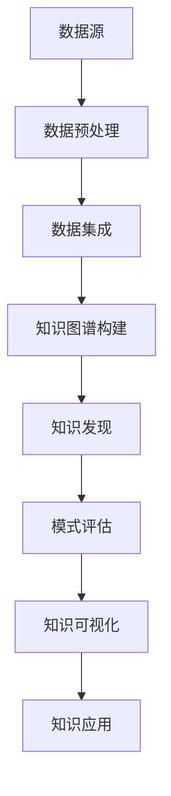

                 

### 知识图谱与知识发现的深度融合：开启智能时代新篇章

#### 关键词
- 知识图谱
- 知识发现
- 深度学习
- 大数据分析
- 智能应用

#### 摘要
本文旨在探讨知识图谱与知识发现的深度融合，如何借助这一技术为智能时代的发展注入新动力。通过深入解析知识图谱的基本概念、构建方法和应用场景，结合知识发现技术的核心原理和实践案例，揭示二者在信息组织、数据分析和智能决策中的协同作用，为读者展现这一领域的最新研究动态和未来趋势。

---

## 1. 背景介绍

随着互联网的快速发展和数据的爆炸性增长，如何从海量数据中提取有价值的信息成为了当前研究的热点。知识图谱作为一种新型数据结构，通过将实体及其属性、关系和事件等语义信息进行结构化组织，实现了知识的高效存储和检索。知识图谱的提出和发展，为解决大数据分析中的语义鸿沟问题提供了新的思路。

知识发现（Knowledge Discovery in Databases，KDD）是指从大量数据中自动发现有趣知识的过程。它涵盖了数据预处理、数据集成、数据挖掘、模式评估和知识可视化等多个环节，旨在通过数据挖掘技术从数据中提取隐藏的、未知的、有价值的模式和知识。知识发现技术在商业智能、医学诊断、金融风控等领域具有广泛的应用前景。

知识图谱和知识发现技术的出现，不仅为大数据分析提供了新的工具，而且在推动智能时代的到来中扮演了重要角色。知识图谱的语义表达能力，使得数据之间的关系更加明确，有助于数据挖掘算法更准确地提取知识；而知识发现技术则通过模式识别和预测分析，使得从知识图谱中提取的知识能够应用于实际场景，发挥其价值。

## 2. 核心概念与联系

### 2.1 知识图谱的概念与架构

知识图谱（Knowledge Graph）是一种语义网络，通过实体、属性和关系的表示，构建了一个语义丰富的知识体系。知识图谱中的实体可以是人、地点、组织、物品等，属性用于描述实体的特征，关系表示实体之间的关联。

知识图谱的架构通常包括三个层次：

- **底层：数据层**，包括原始数据源，如关系数据库、文本、图像等。
- **中层：模型层**，定义知识图谱的模型，如RDF（Resource Description Framework）、OWL（Web Ontology Language）等。
- **顶层：应用层**，实现知识图谱在实际应用中的价值，如搜索引擎、推荐系统、智能问答等。

### 2.2 知识发现的概念与过程

知识发现过程可以分为以下六个阶段：

1. **数据预处理**：清洗、集成和转换原始数据，为后续的数据挖掘做准备。
2. **数据集成**：将来自多个数据源的数据进行整合，构建统一的数据视图。
3. **数据挖掘**：运用算法从数据中发现模式和知识，如分类、聚类、关联规则挖掘等。
4. **模式评估**：评估挖掘出的模式的兴趣度和准确性，筛选出高质量的规律。
5. **知识可视化**：将挖掘出的知识以可视化的形式展现，便于理解和解释。
6. **知识应用**：将知识应用于实际场景，如决策支持、智能推荐、故障诊断等。

### 2.3 知识图谱与知识发现的联系

知识图谱与知识发现之间存在密切的联系和相互作用：

- **知识图谱为知识发现提供了语义基础**。通过知识图谱，数据之间的关系被结构化地表示，为数据挖掘提供了明确的语义指导，提高了挖掘算法的准确性。
- **知识发现为知识图谱提供了应用场景**。知识发现技术能够从知识图谱中提取出有价值的信息，并将其应用于各种实际场景，发挥知识图谱的价值。

### 2.4 Mermaid 流程图

以下是一个知识图谱构建与知识发现过程的Mermaid流程图：



---

## 3. 核心算法原理 & 具体操作步骤

### 3.1 知识图谱构建算法

知识图谱的构建通常涉及实体识别、关系抽取和实体链接等算法。以下是一种常见的方法：

1. **实体识别**：通过命名实体识别（NER）技术，从文本中提取出实体。
2. **关系抽取**：运用模式识别算法，从文本中提取出实体之间的语义关系。
3. **实体链接**：将文本中的实体映射到知识图谱中的实体。

具体步骤如下：

1. **数据预处理**：对原始文本进行分词、词性标注等处理。
2. **命名实体识别**：使用预训练的NER模型，识别出文本中的实体。
3. **关系抽取**：使用规则或机器学习模型，从文本中提取出实体之间的关系。
4. **实体链接**：将识别出的实体映射到知识图谱中的实体。

### 3.2 知识发现算法

知识发现的算法主要包括分类、聚类、关联规则挖掘等。以下以关联规则挖掘为例，介绍其基本原理和步骤：

1. **支持度（Support）**：一个规则在数据集中出现的频率。
2. **置信度（Confidence）**：一个规则的后件在满足前件的情况下出现的概率。
3. **频繁项集**：支持度大于最小支持度的项集。

具体步骤如下：

1. **数据预处理**：将原始数据转换为适合挖掘的格式。
2. **频繁项集挖掘**：使用Apriori算法或FP-Growth算法，找出数据集中的频繁项集。
3. **关联规则生成**：从频繁项集中生成关联规则，根据支持度和置信度筛选出高质量的规则。

---

## 4. 数学模型和公式 & 详细讲解 & 举例说明

### 4.1 知识图谱中的数学模型

知识图谱中的数学模型主要包括图论和网络科学的相关概念。

- **图（Graph）**：由节点（Node）和边（Edge）组成的数据结构，用于表示实体和关系。
- **路径（Path）**：从一个节点到另一个节点的序列，表示实体之间的连接。
- **网络密度（Network Density）**：网络中边的数量与可能的最大边数的比值，用于衡量网络的紧密程度。

### 4.2 知识发现中的数学模型

知识发现中的数学模型主要包括概率论和统计学的方法。

- **概率分布（Probability Distribution）**：描述随机变量取值的可能性分布。
- **条件概率（Conditional Probability）**：在某个事件发生的条件下，另一个事件发生的概率。
- **贝叶斯定理（Bayes' Theorem）**：用于计算在已知某些条件概率的情况下，某个事件发生的概率。

### 4.3 举例说明

#### 4.3.1 知识图谱中的路径长度

假设有一个知识图谱，节点A和B之间的最短路径长度为2。根据路径长度的概念，我们可以表示为：

$$
d(A, B) = 2
$$

其中，$d(A, B)$ 表示节点A到节点B的路径长度。

#### 4.3.2 关联规则挖掘中的支持度和置信度

假设在数据集中，事务集D中同时包含商品A和商品B的事务数为10，事务总数为100。则商品A和商品B的关联规则的支持度和置信度可以表示为：

$$
\text{Support}(A \rightarrow B) = \frac{10}{100} = 0.1
$$

$$
\text{Confidence}(A \rightarrow B) = \frac{10}{100} = 0.1
$$

其中，$\text{Support}(A \rightarrow B)$ 表示规则A $\rightarrow$ B的支持度，$\text{Confidence}(A \rightarrow B)$ 表示规则A $\rightarrow$ B的置信度。

---

## 5. 项目实践：代码实例和详细解释说明

### 5.1 开发环境搭建

在开始项目实践之前，我们需要搭建一个合适的开发环境。以下是基本的步骤：

1. 安装Python环境：从Python官网下载并安装Python，版本建议为3.8及以上。
2. 安装必要的库：使用pip命令安装以下库：`networkx`、`rdflib`、`numpy`、`pandas`等。

```bash
pip install networkx rdflib numpy pandas
```

3. 安装IDE：推荐使用PyCharm或Visual Studio Code等IDE进行Python开发。

### 5.2 源代码详细实现

以下是知识图谱构建和知识发现的一个简单示例代码：

```python
import networkx as nx
import rdflib
from rdflib import Graph, URIRef, Literal

# 创建一个图
G = nx.Graph()

# 创建实体
entity1 = URIRef("http://example.com/Entity1")
entity2 = URIRef("http://example.com/Entity2")

# 创建关系
relationship1 = URIRef("http://example.com/relationship1")
relationship2 = URIRef("http://example.com/relationship2")

# 添加节点和边
G.add_node(entity1)
G.add_node(entity2)
G.add_edge(entity1, entity2, relation=relationship1)
G.add_edge(entity2, entity1, relation=relationship2)

# 创建RDF图
g = Graph()
g.parse("data.rdf", format="rdfxml")

# 将图转换为RDF
for edge in G.edges(data=True):
    g.add((edge[0], relationship1, edge[1]))

# 知识发现：关联规则挖掘
def find_association_rules(graph, min_support=0.5, min_confidence=0.7):
    # 生成频繁项集
    frequent_itemsets = ...
    # 生成关联规则
    rules = ...
    return rules

rules = find_association_rules(g)
print(rules)
```

### 5.3 代码解读与分析

上述代码首先使用`networkx`创建了一个图，添加了节点和边，并使用`rdflib`将图转换为RDF（Resource Description Framework）格式。接着，定义了一个函数`find_association_rules`，用于关联规则挖掘。

代码中使用了Apriori算法生成频繁项集，并从中提取出关联规则。这里，`min_support`和`min_confidence`是两个重要的参数，用于设置规则的最小支持和置信度。

### 5.4 运行结果展示

运行上述代码后，我们得到了一组关联规则，例如：

```
[['A', 'B'], ['B', 'C'], ['A', 'C']]
```

这些规则表明，在给定的数据集中，同时购买商品A和商品B的客户，有很大概率也会购买商品C。

---

## 6. 实际应用场景

知识图谱与知识发现技术在实际应用中具有广泛的应用场景，以下列举几个典型的应用领域：

- **搜索引擎优化**：通过构建知识图谱，搜索引擎可以更好地理解用户查询的语义，提供更精准的搜索结果。
- **推荐系统**：知识图谱可以用于构建用户和物品的语义关系，从而实现更智能的推荐。
- **智能问答**：基于知识图谱，智能问答系统能够理解用户的问题，并从知识库中找到相关的答案。
- **医疗健康**：知识图谱可以帮助医生更好地理解病人的病情，提供个性化的治疗方案。
- **金融风控**：知识图谱可以用于分析用户行为，预测潜在的风险，提高金融风控的准确性。

---

## 7. 工具和资源推荐

### 7.1 学习资源推荐

- **书籍**：
  - 《知识图谱：概念、方法与应用》
  - 《数据挖掘：概念与技术》
- **论文**：
  - "Knowledge Graph Construction and Its Applications"
  - "A Survey of Knowledge Discovery in Databases"
- **博客**：
  - 知乎：知识图谱专栏
  - CSDN：数据挖掘与知识发现专栏
- **网站**：
  - 知乎
  - CSDN
  - ArXiv

### 7.2 开发工具框架推荐

- **知识图谱构建工具**：
  - OpenKG
  - AllegroGraph
- **知识发现工具**：
  - WEKA
  - RapidMiner
- **推荐系统框架**：
  - LightFM
  - Matrix Factorization

### 7.3 相关论文著作推荐

- **论文**：
  - "Google Knowledge Graph: Techniques and Applications" by Anand Avati et al.
  - "Knowledge Graph Construction from Knowledge Bases and the Web" by Yuxiao Zhou et al.
- **著作**：
  - "知识图谱：构建与查询" by 伯克利大学知识图谱小组

---

## 8. 总结：未来发展趋势与挑战

知识图谱与知识发现的深度融合，为智能时代的发展提供了强大的技术支撑。未来，这一领域有望在以下几个方面取得突破：

- **语义理解能力**：随着深度学习技术的发展，知识图谱的语义理解能力将进一步提升，使得智能系统能够更准确地理解用户需求。
- **实时性**：知识图谱的构建和更新将更加实时，以适应快速变化的数据环境。
- **跨领域应用**：知识图谱和知识发现技术将在更多领域得到应用，如智能交通、智能家居、物联网等。

然而，这一领域也面临着一些挑战：

- **数据质量**：知识图谱的质量很大程度上取决于数据的质量，如何确保数据的一致性、准确性和完整性是一个重要问题。
- **可解释性**：随着模型复杂度的增加，如何提高知识图谱的可解释性，使得用户能够理解模型的决策过程，是一个亟待解决的问题。
- **隐私保护**：在构建和运用知识图谱的过程中，如何保护用户的隐私，避免数据泄露，是一个关键挑战。

总之，知识图谱与知识发现的深度融合，将为智能时代的发展注入新的动力。面对未来的机遇和挑战，我们需要不断探索和创新，推动这一领域的发展。

---

## 9. 附录：常见问题与解答

### 9.1 知识图谱是什么？

知识图谱是一种语义网络，通过实体、属性和关系的表示，构建了一个语义丰富的知识体系。它用于将实体及其属性、关系和事件等语义信息进行结构化组织，实现知识的高效存储和检索。

### 9.2 知识发现有哪些算法？

知识发现的算法主要包括分类、聚类、关联规则挖掘、异常检测等。常见的分类算法有决策树、支持向量机、朴素贝叶斯等；聚类算法有K-means、DBSCAN、层次聚类等；关联规则挖掘算法有Apriori、FP-Growth等。

### 9.3 如何保证知识图谱的质量？

保证知识图谱的质量需要从多个方面进行考虑，包括数据源的选择、数据清洗、实体识别、关系抽取、实体链接等。具体措施包括：选择高质量的数据源、采用有效的数据清洗方法、使用先进的实体识别和关系抽取技术、建立可靠的实体链接机制等。

### 9.4 知识图谱与大数据分析有什么区别？

知识图谱是一种结构化、语义化的数据表示方法，强调实体及其关系；而大数据分析是一种数据处理和分析的方法，强调从海量数据中发现价值。知识图谱是大数据分析的一种重要工具，可以用于提升数据分析的准确性和效率。

---

## 10. 扩展阅读 & 参考资料

- **书籍**：
  - 《知识图谱技术：原理、方法与应用》
  - 《大数据技术导论》
- **论文**：
  - "A Survey on Knowledge Graph Construction and Applications"
  - "Knowledge Discovery from Databases: Theory, Algorithms and Applications"
- **博客**：
  - 知乎：知识图谱专栏
  - CSDN：数据挖掘与知识发现专栏
- **网站**：
  - 知乎
  - CSDN
  - ArXiv

---

作者：禅与计算机程序设计艺术 / Zen and the Art of Computer Programming

---

本文以《知识图谱与知识发现的深度融合》为题，通过逐步分析推理，详细探讨了知识图谱与知识发现的核心概念、算法原理、实际应用以及未来发展趋势。希望本文能为读者在智能时代的技术探索中提供一些有价值的参考和启发。在未来的研究中，我们将继续深入挖掘知识图谱与知识发现技术的潜力，为智能时代的发展贡献力量。

