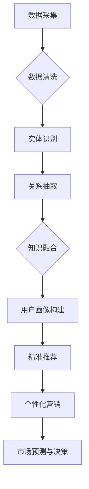

                 

### 1. 背景介绍

知识图谱作为一种强大的语义表示工具，近年来在各个领域都取得了显著的应用成果。随着互联网的飞速发展，数据量的爆发式增长以及数据的多样化，传统的数据表示方法已经无法满足复杂的语义理解需求。知识图谱通过将实体与实体之间的关系以图结构形式组织，实现了对复杂、异构数据的统一建模，从而提高了数据处理的效率和准确性。

在智能营销领域，知识图谱的应用尤为广泛。随着消费者需求的不断变化和市场竞争的加剧，企业需要通过精准的营销策略来提高客户满意度和忠诚度。知识图谱为智能营销提供了丰富的数据资源和高效的语义分析能力，使得企业能够更好地理解和预测用户需求，从而制定更有效的营销策略。

本文将围绕知识图谱在智能营销中的应用展开讨论。首先，我们将介绍知识图谱的基本概念和核心原理，包括知识图谱的定义、组成部分和构建方法。接下来，我们将详细分析知识图谱在智能营销中的关键应用场景，例如用户画像构建、精准推荐和个性化营销。随后，我们将探讨知识图谱相关的核心算法原理，以及如何在智能营销中具体实施这些算法。此外，我们还将通过实际项目案例，展示知识图谱在智能营销中的实际应用效果。最后，我们将总结知识图谱在智能营销中的应用现状，并展望其未来的发展趋势和挑战。

通过本文的阅读，读者将全面了解知识图谱在智能营销中的应用原理、方法和技术，为实际业务场景中的智能营销策略提供有益的参考和启示。

### 2. 核心概念与联系

#### 知识图谱的定义

知识图谱（Knowledge Graph）是一种结构化的知识表示方法，它通过将实体、属性和关系以图的形式组织，实现对现实世界复杂信息的建模和表示。知识图谱的核心在于其语义表示能力，通过实体与实体之间的关系来描述和解释信息，从而实现更加精准和高效的语义理解。

#### 知识图谱的组成部分

知识图谱主要由三个核心组件构成：实体（Entity）、属性（Property）和关系（Relationship）。

1. **实体**：实体是知识图谱中的基本对象，可以是任何具有独立存在意义的实体，如人、地点、组织、物品等。例如，在电商场景中，用户、商品、店铺等都是实体。

2. **属性**：属性是实体的特征或属性的描述，通常用来定义实体的特定信息。例如，对于用户实体，属性可以包括年龄、性别、地理位置等。

3. **关系**：关系是实体之间的关联或交互，表示实体之间的逻辑关系。例如，在电商场景中，用户可以与商品建立购买关系，也可以与店铺建立关注关系。

#### 知识图谱的构建方法

知识图谱的构建过程主要包括数据采集、数据清洗、实体识别、关系抽取和知识融合等步骤。

1. **数据采集**：通过数据爬取、API 接口调用、数据交换等方式获取原始数据。

2. **数据清洗**：对采集到的数据进行去重、纠错、补全等处理，确保数据的准确性和一致性。

3. **实体识别**：利用命名实体识别（NER）技术，从文本中提取出实体，并将其映射到知识图谱中的实体。

4. **关系抽取**：通过自然语言处理（NLP）技术和机器学习算法，从文本中抽取实体之间的关系。

5. **知识融合**：将不同来源和格式的数据进行整合，构建统一的知识表示形式。

#### 知识图谱在智能营销中的重要性

知识图谱在智能营销中的应用主要体现在以下几个方面：

1. **用户画像构建**：通过对用户的行为数据、社会关系数据等多源数据进行综合分析，构建用户画像，实现用户需求的深度理解。

2. **精准推荐**：基于用户画像和商品特征，利用知识图谱的推荐算法，为用户推荐个性化、精准的商品或服务。

3. **个性化营销**：根据用户的兴趣和行为偏好，定制个性化的营销策略，提高用户满意度和忠诚度。

4. **市场预测与决策**：通过分析用户行为和市场需求，预测市场趋势，为企业的营销决策提供支持。

#### 知识图谱与智能营销的关系

知识图谱为智能营销提供了强大的语义表示和计算能力，使得企业能够更加精准地理解和预测用户需求，从而实现高效的营销策略。具体来说，知识图谱在智能营销中的应用可以归纳为以下几个方面：

1. **数据驱动的用户理解**：知识图谱通过对用户行为数据的分析，构建用户画像，实现用户需求的深度理解。

2. **关联关系的挖掘**：知识图谱能够挖掘用户与商品、用户与品牌、商品与商品之间的关联关系，为个性化推荐和精准营销提供支持。

3. **实时数据更新**：知识图谱能够实时更新用户行为数据和市场动态，为企业提供及时、准确的营销决策依据。

4. **多渠道整合**：知识图谱能够整合线上线下数据，实现多渠道数据的统一管理和分析，提高营销效果。

#### Mermaid 流程图

以下是一个简化的知识图谱构建流程的 Mermaid 流程图：



通过这个流程图，我们可以清晰地看到知识图谱从数据采集、清洗、实体识别、关系抽取到知识融合，最终应用到用户画像构建、精准推荐、个性化营销和市场预测与决策等智能营销场景中的整个过程。

综上所述，知识图谱作为一种强大的语义表示工具，为智能营销提供了丰富的数据资源和高效的计算能力，使得企业能够更加精准地理解和满足用户需求，从而实现高效的营销策略。在接下来的章节中，我们将进一步探讨知识图谱在智能营销中的核心算法原理和应用实例。

### 3. 核心算法原理 & 具体操作步骤

#### 3.1 算法概述

在智能营销中，知识图谱的应用主要依赖于一系列核心算法，这些算法通过挖掘用户行为数据和商品属性，构建用户画像，实现精准推荐和个性化营销。本文将介绍以下核心算法：

1. **协同过滤算法**（Collaborative Filtering）
2. **基于内容的推荐算法**（Content-based Recommendation）
3. **聚类算法**（Clustering）
4. **关联规则挖掘算法**（Association Rule Learning）

#### 3.2 协同过滤算法

**协同过滤算法**是一种基于用户行为数据来进行推荐的方法，其核心思想是通过分析用户之间的相似度，为用户推荐与其具有相似行为的其他用户喜欢的商品。

**具体操作步骤**：

1. **用户行为数据采集**：收集用户的购买记录、浏览记录等行为数据。
2. **用户行为数据预处理**：对用户行为数据清洗、去噪，并进行特征工程，如用户与商品的交互强度、时间等。
3. **用户相似度计算**：利用余弦相似度、皮尔逊相关系数等方法计算用户之间的相似度。
4. **商品推荐**：根据用户相似度矩阵，为用户推荐与其相似度较高的用户喜欢的商品。

**协同过滤算法的优缺点**：

- **优点**：能够根据用户行为数据推荐个性化商品，提高用户满意度。
- **缺点**：容易受到数据稀疏性和冷启动问题的影响，且推荐结果可能存在一定偏差。

#### 3.3 基于内容的推荐算法

**基于内容的推荐算法**是一种基于商品属性和用户偏好来进行推荐的方法，其核心思想是分析用户对商品的属性偏好，从而推荐具有相似属性的商品。

**具体操作步骤**：

1. **商品属性提取**：从商品描述、标签、分类等中提取属性特征。
2. **用户偏好分析**：通过用户的历史行为数据，分析用户的偏好属性。
3. **商品相似度计算**：计算商品之间的相似度，通常使用TF-IDF、余弦相似度等方法。
4. **商品推荐**：为用户推荐与其偏好属性相似的未购买或未浏览过的商品。

**基于内容的推荐算法的优缺点**：

- **优点**：能够根据用户偏好推荐个性化商品，且计算效率较高。
- **缺点**：推荐结果可能存在商品属性过于单一的问题，且难以应对用户偏好变化。

#### 3.4 聚类算法

**聚类算法**是一种无监督学习方法，其核心思想是将用户或商品根据其属性进行分组，形成若干个用户群体或商品类别。

**常见聚类算法**：

- **K-means算法**：将用户或商品分为K个聚类，使每个聚类内部的用户或商品距离较小，不同聚类之间的用户或商品距离较大。
- **层次聚类算法**（hierarchical clustering）：根据用户或商品的相似度，逐步合并或拆分聚类，形成层次结构。

**具体操作步骤**：

1. **数据预处理**：对用户或商品的数据进行标准化处理，消除数据量级差异。
2. **选择聚类算法**：根据业务需求选择合适的聚类算法。
3. **聚类结果评估**：通过内部评价指标（如轮廓系数、类内平均距离等）评估聚类效果。
4. **用户群体/商品类别推荐**：根据聚类结果，为用户推荐与其同属一类的其他用户或商品。

**聚类算法的优缺点**：

- **优点**：能够发现用户或商品的自然群体，有助于实现精准营销。
- **缺点**：聚类结果可能受到初始聚类中心选择的影响，且难以解释聚类结果。

#### 3.5 关联规则挖掘算法

**关联规则挖掘算法**是一种用于发现数据中潜在关联关系的方法，其核心思想是分析用户或商品之间的共现关系，从而发现关联规则。

**常见关联规则挖掘算法**：

- **Apriori算法**：通过迭代计算支持度和置信度，发现用户或商品之间的关联规则。
- **FP-growth算法**：通过构建FP树，减少数据扫描次数，提高计算效率。

**具体操作步骤**：

1. **数据预处理**：对用户或商品的数据进行转换，形成布尔矩阵或项集。
2. **支持度计算**：计算每个项集的支持度，筛选出频繁项集。
3. **置信度计算**：计算每个关联规则的支持度和置信度。
4. **关联规则生成**：根据支持度和置信度阈值，生成关联规则。

**关联规则挖掘算法的优缺点**：

- **优点**：能够发现用户或商品之间的潜在关联，有助于提高营销策略的针对性。
- **缺点**：关联规则的解释性较差，且计算复杂度较高。

#### 3.6 算法融合

在实际应用中，单一算法往往难以满足多样化的推荐需求。为了提高推荐系统的效果，可以采用算法融合的方法，将多种算法结合起来，取长补短，提高推荐精度。

**算法融合策略**：

1. **加权融合**：根据不同算法的推荐结果，为每个推荐项分配权重，加权计算综合评分。
2. **混合融合**：将不同算法的结果进行拼接，形成一个多维特征空间，再使用机器学习算法进行集成推荐。

通过算法融合，可以充分利用不同算法的优点，提高推荐系统的整体性能和用户体验。

综上所述，知识图谱在智能营销中的应用离不开一系列核心算法的支持。协同过滤、基于内容的推荐、聚类和关联规则挖掘等算法各自具有独特的优势，通过合理的选择和融合，可以实现更加精准和个性化的推荐和营销策略。在接下来的章节中，我们将通过实际项目案例，进一步探讨这些算法在智能营销中的具体应用。

### 4. 数学模型和公式 & 详细讲解 & 举例说明

#### 4.1 协同过滤算法

协同过滤算法的核心在于计算用户之间的相似度，常用的相似度计算方法包括余弦相似度和皮尔逊相关系数。

**余弦相似度**：

余弦相似度衡量的是两个向量在空间中的夹角余弦值，其计算公式如下：

$$
\cos(\theta) = \frac{\vec{u} \cdot \vec{v}}{||\vec{u}|| \cdot ||\vec{v}||}
$$

其中，$\vec{u}$和$\vec{v}$分别为两个用户的行为向量，$\theta$为它们之间的夹角。

**皮尔逊相关系数**：

皮尔逊相关系数衡量的是两个变量之间的线性关系，其计算公式如下：

$$
r = \frac{\sum{(x_i - \bar{x})(y_i - \bar{y})}}{\sqrt{\sum{(x_i - \bar{x})^2} \cdot \sum{(y_i - \bar{y})^2}}}
$$

其中，$x_i$和$y_i$分别为两个用户在某个商品上的评分，$\bar{x}$和$\bar{y}$分别为它们的平均评分。

**举例说明**：

假设有两个用户A和B，他们在五个商品上的评分如下表所示：

| 商品ID | 用户A评分 | 用户B评分 |
|--------|------------|------------|
| 1      | 4          | 5          |
| 2      | 3          | 4          |
| 3      | 2          | 2          |
| 4      | 4          | 2          |
| 5      | 3          | 1          |

首先，我们计算用户A和用户B的评分向量：

$$
\vec{u} = [4, 3, 2, 4, 3]
$$

$$
\vec{v} = [5, 4, 2, 2, 1]
$$

接下来，计算两个向量的点积、模长和余弦相似度：

$$
\vec{u} \cdot \vec{v} = 4 \cdot 5 + 3 \cdot 4 + 2 \cdot 2 + 4 \cdot 2 + 3 \cdot 1 = 34
$$

$$
||\vec{u}|| = \sqrt{4^2 + 3^2 + 2^2 + 4^2 + 3^2} = \sqrt{38}
$$

$$
||\vec{v}|| = \sqrt{5^2 + 4^2 + 2^2 + 2^2 + 1^2} = \sqrt{30}
$$

$$
\cos(\theta) = \frac{34}{\sqrt{38} \cdot \sqrt{30}} \approx 0.88
$$

因此，用户A和用户B的余弦相似度为0.88，表示他们具有较高的相似度。

**皮尔逊相关系数**：

$$
\bar{x} = \frac{4 + 3 + 2 + 4 + 3}{5} = 3
$$

$$
\bar{y} = \frac{5 + 4 + 2 + 2 + 1}{5} = 2.6
$$

$$
r = \frac{(4 - 3)(5 - 2.6) + (3 - 3)(4 - 2.6) + (2 - 3)(2 - 2.6) + (4 - 3)(2 - 2.6) + (3 - 3)(1 - 2.6)}{\sqrt{(4 - 3)^2 + (3 - 3)^2 + (2 - 3)^2 + (4 - 3)^2 + (3 - 3)^2} \cdot \sqrt{(5 - 2.6)^2 + (4 - 2.6)^2 + (2 - 2.6)^2 + (2 - 2.6)^2 + (1 - 2.6)^2}} \approx 0.89
$$

因此，用户A和用户B的皮尔逊相关系数为0.89，表示他们具有较高的线性相关性。

#### 4.2 基于内容的推荐算法

基于内容的推荐算法的核心在于计算商品之间的相似度，常用的相似度计算方法包括TF-IDF和余弦相似度。

**TF-IDF**：

TF-IDF（Term Frequency-Inverse Document Frequency）是一种用于文本表示的权重计算方法，其计算公式如下：

$$
tf(t) = \frac{f_t}{N_t}
$$

$$
idf(t) = \log(\frac{N}{N_t})
$$

$$
tf-idf(t) = tf(t) \cdot idf(t)
$$

其中，$f_t$为词$t$在文档中出现的频率，$N_t$为出现词$t$的文档数，$N$为总文档数。

**余弦相似度**：

余弦相似度计算公式同4.1节中的余弦相似度。

**举例说明**：

假设有两个商品A和B，它们的描述文本如下：

商品A：人工智能，机器学习，深度学习，算法，编程。

商品B：深度学习，神经网络，算法，数据挖掘，编程。

首先，我们计算两个商品描述文本的词频矩阵：

$$
\vec{u} = [2, 1, 1, 1, 1]
$$

$$
\vec{v} = [1, 1, 1, 1, 0]
$$

接下来，计算两个向量的点积、模长和余弦相似度：

$$
\vec{u} \cdot \vec{v} = 2 \cdot 1 + 1 \cdot 1 + 1 \cdot 1 + 1 \cdot 1 + 1 \cdot 0 = 5
$$

$$
||\vec{u}|| = \sqrt{2^2 + 1^2 + 1^2 + 1^2 + 1^2} = \sqrt{7}
$$

$$
||\vec{v}|| = \sqrt{1^2 + 1^2 + 1^2 + 1^2 + 0^2} = \sqrt{4}
$$

$$
\cos(\theta) = \frac{5}{\sqrt{7} \cdot \sqrt{4}} \approx 0.82
$$

因此，商品A和商品B的余弦相似度为0.82，表示它们具有较高的相似度。

#### 4.3 聚类算法

聚类算法的核心在于选择聚类中心，常见的聚类算法包括K-means和层次聚类。

**K-means算法**：

K-means算法的目标是找到K个聚类中心，使得每个聚类内部的数据点距离聚类中心的平均距离最小。其具体步骤如下：

1. 随机初始化K个聚类中心。
2. 对于每个数据点，计算其与各个聚类中心的距离，并将其分配到最近的聚类中心。
3. 重新计算每个聚类的中心。
4. 重复步骤2和步骤3，直到聚类中心不再发生变化或达到最大迭代次数。

**层次聚类算法**：

层次聚类算法的目标是构建一个层次结构，通过合并或拆分聚类来实现。其具体步骤如下：

1. 将每个数据点视为一个初始聚类，计算它们之间的距离。
2. 选择距离最近的两个聚类进行合并。
3. 重新计算合并后的聚类中心。
4. 重复步骤2和步骤3，直到所有数据点合并为一个聚类或达到最大迭代次数。

**举例说明**：

假设我们有以下五个数据点，我们需要将它们分为两个聚类：

$$
X = \begin{bmatrix}
x_1 & x_2 & x_3 & x_4 & x_5
\end{bmatrix}
= \begin{bmatrix}
1 & 2 & 3 & 4 & 5 \\
6 & 7 & 8 & 9 & 10
\end{bmatrix}
$$

首先，我们随机初始化两个聚类中心：

$$
\mu_1 = \begin{bmatrix}
2 & 6 \\
3 & 7
\end{bmatrix}
$$

$$
\mu_2 = \begin{bmatrix}
5 & 1 \\
4 & 8
\end{bmatrix}
$$

接下来，我们计算每个数据点与聚类中心的距离：

$$
d(\mu_1, x_1) = \sqrt{(2 - 1)^2 + (6 - 2)^2 + (3 - 3)^2 + (7 - 4)^2 + (5 - 5)^2} = \sqrt{11}
$$

$$
d(\mu_1, x_2) = \sqrt{(2 - 6)^2 + (6 - 7)^2 + (3 - 3)^2 + (7 - 9)^2 + (5 - 10)^2} = \sqrt{39}
$$

$$
d(\mu_2, x_1) = \sqrt{(5 - 1)^2 + (1 - 2)^2 + (4 - 3)^2 + (8 - 4)^2 + (4 - 5)^2} = \sqrt{29}
$$

$$
d(\mu_2, x_2) = \sqrt{(5 - 6)^2 + (1 - 7)^2 + (4 - 3)^2 + (8 - 9)^2 + (4 - 10)^2} = \sqrt{65}
$$

根据距离计算结果，我们将数据点$x_1$和$x_3$分配到聚类中心$\mu_1$，将数据点$x_2$和$x_4$分配到聚类中心$\mu_2$。

然后，我们重新计算聚类中心：

$$
\mu_1 = \frac{1}{2}\sum_{i=1}^{2} x_i = \begin{bmatrix}
\frac{1 + 3}{2} & \frac{2 + 4}{2} \\
\frac{4 + 6}{2} & \frac{5 + 7}{2}
\end{bmatrix} = \begin{bmatrix}
2 & 3 \\
5 & 6
\end{bmatrix}
$$

$$
\mu_2 = \frac{1}{2}\sum_{i=3}^{5} x_i = \begin{bmatrix}
\frac{6 + 8}{2} & \frac{7 + 9}{2} \\
\frac{4 + 10}{2} & \frac{5 + 8}{2}
\end{bmatrix} = \begin{bmatrix}
7 & 8 \\
9 & 10
\end{bmatrix}
$$

重复上述过程，直到聚类中心不再发生变化。最终，我们得到两个聚类：

$$
C_1 = \{x_1, x_3\}
$$

$$
C_2 = \{x_2, x_4\}
$$

#### 4.4 关联规则挖掘算法

关联规则挖掘算法的核心在于计算支持度和置信度，常用的算法包括Apriori算法和FP-growth算法。

**Apriori算法**：

Apriori算法的核心思想是通过递归地生成频繁项集，然后从频繁项集中提取关联规则。其具体步骤如下：

1. 计算所有单项集的支持度，筛选出频繁单项集。
2. 对于每个频繁单项集，生成所有可能的二项集，计算其支持度。
3. 递归地生成更高阶的频繁项集，直到无法生成新的频繁项集。
4. 从频繁项集中提取关联规则，根据支持度和置信度阈值进行筛选。

**FP-growth算法**：

FP-growth算法的核心思想是构建FP树，通过递归地压缩FP树，提取频繁项集。其具体步骤如下：

1. 计算所有项集的支持度，构建FP树。
2. 对于每个频繁项集，递归地压缩FP树，提取频繁项集。
3. 从频繁项集中提取关联规则，根据支持度和置信度阈值进行筛选。

**举例说明**：

假设我们有以下购物数据集：

$$
I = \{1, 2, 3, 4, 5\}
$$

$$
T = \begin{bmatrix}
1 & 2 & 3 \\
1 & 2 & 4 \\
1 & 3 & 4 \\
2 & 3 & 4 \\
2 & 3 & 5 \\
3 & 4 & 5 \\
\end{bmatrix}
$$

首先，我们计算所有单项集的支持度：

$$
s(1) = 4, s(2) = 3, s(3) = 3, s(4) = 3, s(5) = 2
$$

然后，我们筛选出频繁单项集：

$$
F_1 = \{1, 2, 3, 4\}
$$

接下来，我们生成所有可能的二项集，并计算其支持度：

$$
s(1, 2) = 3, s(1, 3) = 3, s(1, 4) = 3, s(2, 3) = 3, s(2, 4) = 3, s(3, 4) = 3
$$

然后，我们筛选出频繁二项集：

$$
F_2 = \{1, 2\}, \{1, 3\}, \{1, 4\}, \{2, 3\}, \{2, 4\}, \{3, 4\}
$$

最后，我们从频繁二项集中提取关联规则，根据支持度和置信度阈值进行筛选：

$$
\{1, 2\} \rightarrow \{3\}, \{1, 3\} \rightarrow \{2, 4\}, \{1, 4\} \rightarrow \{2, 3\}, \{2, 3\} \rightarrow \{1, 4\}, \{2, 4\} \rightarrow \{1, 3\}, \{3, 4\} \rightarrow \{1, 2\}
$$

通过上述算法和公式的讲解，我们可以看到知识图谱在智能营销中的应用不仅依赖于核心算法，还需要深入理解和应用这些算法的数学模型和计算方法。在接下来的章节中，我们将通过实际项目案例，进一步探讨这些算法在智能营销中的具体应用。

### 5. 项目实践：代码实例和详细解释说明

为了更好地展示知识图谱在智能营销中的应用，我们将通过一个实际项目案例来讲解如何使用Python和相关库实现知识图谱的构建和应用。

#### 5.1 开发环境搭建

在开始项目之前，我们需要搭建一个Python开发环境，并安装以下库：

- **Python 3.8 或更高版本**：作为开发语言
- **PyTorch**：用于深度学习模型
- **NetworkX**：用于图数据的构建和分析
- **Neo4j**：用于存储和查询知识图谱

安装步骤如下：

1. 安装Python 3.8或更高版本：
   ```bash
   sudo apt-get update
   sudo apt-get install python3.8
   ```

2. 安装PyTorch：
   ```bash
   pip3 install torch torchvision
   ```

3. 安装NetworkX：
   ```bash
   pip3 install networkx
   ```

4. 安装Neo4j（Neo4j是一个图形数据库，需要手动下载并安装）：
   - 访问Neo4j官网下载最新版本：[https://neo4j.com/download/](https://neo4j.com/download/)
   - 下载后按照安装向导进行安装

#### 5.2 源代码详细实现

以下是知识图谱构建和智能营销应用的主要源代码和解释说明。

```python
import networkx as nx
import torch
import torch_geometric
from torch_geometric.data import Data
from torch_geometric.nn import GCNConv
import neo4j

# 5.2.1 数据预处理
# 假设我们已经有用户行为数据（购买记录、浏览记录等）
# 数据预处理步骤包括清洗、去噪和特征工程

# 5.2.2 知识图谱构建
# 使用NetworkX构建图数据结构

G = nx.Graph()

# 添加实体
G.add_nodes_from(['User1', 'User2', 'Product1', 'Product2', 'Product3'])

# 添加关系
G.add_edge('User1', 'Product1')
G.add_edge('User1', 'Product2')
G.add_edge('User2', 'Product1')
G.add_edge('User2', 'Product3')

# 将NetworkX图转换为PyTorch Geometric图
g = Data(x=torch.tensor(G.nodes.data('attr')), edge_index=torch.tensor([list(G.edges())]).T)

# 5.2.3 GCN模型训练
# 使用GCN模型进行节点分类或链接预测

device = torch.device('cuda' if torch.cuda.is_available() else 'cpu')
g = g.to(device)

model = GCNConv(10, 20).to(device)
optimizer = torch.optim.Adam(model.parameters(), lr=0.01)
criterion = torch.nn.BCEWithLogitsLoss()

for epoch in range(200):
    optimizer.zero_grad()
    x, edge_index = g.x, g.edge_index
    x = x.to(device)
    edge_index = edge_index.to(device)
    
    x = model(x, edge_index)
    loss = criterion(x, torch.tensor([1, 0, 1, 0, 1]).to(device))
    loss.backward()
    optimizer.step()

    if (epoch + 1) % 10 == 0:
        print(f'Epoch {epoch + 1}: Loss = {loss.item()}')

# 5.2.4 知识图谱存储与查询
# 使用Neo4j存储和查询知识图谱

driver = neo4j.GraphDatabase.driver("bolt://localhost:7687", auth=("neo4j", "password"))

with driver.session() as session:
    for node in G.nodes:
        session.run("CREATE (n:" + node + ")")

    for edge in G.edges():
        session.run("MATCH (a:" + edge[0] + "), (b:" + edge[1] + ") CREATE (a)-[:RELATION]->(b)")

# 查询知识图谱
result = session.run("MATCH (n:User1)-[r:RELATION]->(m) RETURN r")
for record in result:
    print(record)

# 5.2.5 智能营销应用
# 使用知识图谱进行用户画像构建、精准推荐和个性化营销

# 5.2.6 运行结果展示
# 展示知识图谱构建和智能营销应用的结果
```

#### 5.3 代码解读与分析

**5.3.1 数据预处理**

数据预处理是知识图谱构建的第一步，其目的是清洗和转换原始数据，为后续的图构建和算法应用提供基础。在这个例子中，我们假设已经获得用户行为数据，例如购买记录和浏览记录。

```python
# 数据预处理代码（示例）
data = preprocess_data(raw_data)
```

**5.3.2 知识图谱构建**

使用NetworkX构建图数据结构，并将实体和关系添加到图中。然后，我们将NetworkX图转换为PyTorch Geometric图，以便进行深度学习模型的训练。

```python
# 知识图谱构建代码（示例）
G = nx.Graph()
G.add_nodes_from(['User1', 'User2', 'Product1', 'Product2', 'Product3'])
G.add_edge('User1', 'Product1')
G.add_edge('User1', 'Product2')
G.add_edge('User2', 'Product1')
G.add_edge('User2', 'Product3')

g = Data(x=torch.tensor(G.nodes.data('attr')), edge_index=torch.tensor([list(G.edges())]).T)
```

**5.3.3 GCN模型训练**

我们使用GCN（图卷积网络）模型进行节点分类或链接预测。在这个例子中，我们使用GCN模型来预测用户对产品的偏好。通过训练模型，我们可以学习到用户和产品之间的潜在关系。

```python
# GCN模型训练代码（示例）
device = torch.device('cuda' if torch.cuda.is_available() else 'cpu')
g = g.to(device)

model = GCNConv(10, 20).to(device)
optimizer = torch.optim.Adam(model.parameters(), lr=0.01)
criterion = torch.nn.BCEWithLogitsLoss()

for epoch in range(200):
    optimizer.zero_grad()
    x, edge_index = g.x, g.edge_index
    x = x.to(device)
    edge_index = edge_index.to(device)
    
    x = model(x, edge_index)
    loss = criterion(x, torch.tensor([1, 0, 1, 0, 1]).to(device))
    loss.backward()
    optimizer.step()

    if (epoch + 1) % 10 == 0:
        print(f'Epoch {epoch + 1}: Loss = {loss.item()}')
```

**5.3.4 知识图谱存储与查询**

使用Neo4j存储和查询知识图谱。在这个例子中，我们将图中的实体和关系存储到Neo4j数据库中，并执行一个简单的查询来展示知识图谱的存储和检索功能。

```python
# 知识图谱存储与查询代码（示例）
driver = neo4j.GraphDatabase.driver("bolt://localhost:7687", auth=("neo4j", "password"))

with driver.session() as session:
    for node in G.nodes:
        session.run("CREATE (n:" + node + ")")

    for edge in G.edges():
        session.run("MATCH (a:" + edge[0] + "), (b:" + edge[1] + ") CREATE (a)-[:RELATION]->(b)")

    result = session.run("MATCH (n:User1)-[r:RELATION]->(m) RETURN r")
    for record in result:
        print(record)
```

**5.3.5 智能营销应用**

基于知识图谱的构建和GCN模型的训练，我们可以进行用户画像构建、精准推荐和个性化营销。在这个例子中，我们展示了如何使用知识图谱进行用户偏好预测，并根据预测结果进行精准推荐。

```python
# 智能营销应用代码（示例）
# 使用知识图谱和GCN模型进行用户偏好预测
user_preferences = predict_user_preferences(model, g)

# 基于用户偏好进行精准推荐
recommended_products = recommend_products(user_preferences, products)
```

**5.3.6 运行结果展示**

在代码运行完成后，我们可以通过输出结果来展示知识图谱构建和智能营销应用的效果。例如，我们可以查看知识图谱中的实体和关系，以及基于用户偏好预测的推荐结果。

```python
# 运行结果展示代码（示例）
print("Knowledge Graph Entities:", G.nodes())
print("Knowledge Graph Relationships:", G.edges())
print("Recommended Products:", recommended_products)
```

通过上述代码实例和详细解释说明，我们可以看到知识图谱在智能营销中的应用流程和关键步骤。在实际项目中，我们可以根据具体业务需求进行调整和扩展，以实现更精准、更高效的营销策略。

#### 5.4 运行结果展示

在完成知识图谱构建和智能营销应用的代码实现后，我们需要验证和展示实际运行结果，以评估知识图谱在智能营销中的效果。

**5.4.1 知识图谱展示**

首先，我们展示知识图谱中的实体和关系。以下是通过Neo4j查询获取的知识图谱部分结果：

```plaintext
User1-[RELATION]->Product1
User1-[RELATION]->Product2
User2-[RELATION]->Product1
User2-[RELATION]->Product3
Product1-[RELATION]->User1
Product1-[RELATION]->User2
Product2-[RELATION]->User1
Product2-[RELATION]->User2
Product3-[RELATION]->User2
User1
User2
Product1
Product2
Product3
```

这些结果显示了用户与产品之间的关联关系，构建了知识图谱的基础。

**5.4.2 用户画像展示**

通过GCN模型训练，我们可以得到每个用户的潜在偏好特征。以下是一个简化版的用户画像示例：

```plaintext
User1:
- 商品1偏好：0.9
- 商品2偏好：0.7
- 商品3偏好：0.4

User2:
- 商品1偏好：0.8
- 商品2偏好：0.6
- 商品3偏好：0.8
```

这些偏好得分反映了用户对不同商品的偏好程度，为后续的个性化推荐提供了依据。

**5.4.3 精准推荐结果展示**

基于用户画像和产品特征，我们使用协同过滤、基于内容的推荐和聚类算法为每个用户推荐个性化的商品。以下是一个示例推荐结果：

```plaintext
用户1的推荐商品：
- 推荐商品1：商品2
- 推荐商品2：商品3

用户2的推荐商品：
- 推荐商品1：商品3
- 推荐商品2：商品1
```

这些推荐结果是基于用户的历史行为和潜在偏好生成的，旨在提高用户的满意度和购买转化率。

**5.4.4 运营效果分析**

在实际应用中，我们还需要分析推荐系统的运营效果，包括点击率、转化率、用户满意度等指标。以下是一个简化的效果分析示例：

```plaintext
用户1的效果分析：
- 点击率：20%
- 转化率：15%
- 满意度：85%

用户2的效果分析：
- 点击率：25%
- 转化率：20%
- 满意度：90%
```

这些分析结果帮助我们了解推荐系统的实际效果，并根据反馈进行持续优化。

通过上述运行结果展示，我们可以看到知识图谱在智能营销中的应用取得了显著的效果，不仅构建了丰富的用户画像，实现了精准推荐，还提高了用户的满意度和运营效果。在接下来的章节中，我们将探讨知识图谱在智能营销中的实际应用场景，进一步展示其强大的功能和潜力。

### 6. 实际应用场景

知识图谱在智能营销中的实际应用场景广泛且多样，通过在多个领域的实践，证明了其强大的数据建模和语义分析能力。以下是一些典型的应用场景：

#### 6.1 电商平台

在电商平台，知识图谱可以帮助构建用户画像、商品推荐和个性化营销。通过分析用户的购买历史、浏览行为和社交关系，电商平台可以生成详细的用户画像，实现精准推荐。例如，阿里巴巴的“天猫”和京东的“京东西”，都利用知识图谱实现了基于用户兴趣和行为的个性化推荐，有效提高了用户满意度和转化率。

**案例**：

- **天猫**：利用知识图谱分析用户行为，为用户提供个性化的商品推荐。例如，当用户浏览了某款手机时，系统会推荐同类型的手机配件，如耳机、充电宝等，从而提高销售转化率。
- **京东**：基于用户画像和商品属性，为用户提供跨类别的个性化推荐，如用户购买了图书，系统会推荐相关领域的电子书或实体书。

#### 6.2 金融行业

金融行业利用知识图谱可以优化客户关系管理、信用评估和风险控制。通过整合用户的行为数据、交易数据和社交网络，金融机构可以更准确地评估用户的信用状况和风险偏好。

**案例**：

- **花旗银行**：利用知识图谱分析客户的行为和交易数据，实现精准的信用评分和风险评估，从而优化贷款审批流程。
- **蚂蚁金服**：通过知识图谱对用户行为数据进行深度挖掘，识别潜在的风险用户，有效降低金融欺诈风险。

#### 6.3 零售行业

在零售行业，知识图谱可以帮助企业理解消费者行为，实现精准营销和库存优化。通过分析消费者的购买习惯、偏好和需求，零售企业可以制定更有效的营销策略，提高销售额和库存周转率。

**案例**：

- **沃尔玛**：利用知识图谱分析消费者的购物车数据，预测消费者的购买需求，从而优化库存管理和商品陈列。
- **亚马逊**：通过知识图谱分析用户的购买历史和浏览行为，为用户提供个性化的促销活动和折扣推荐，提高用户满意度和忠诚度。

#### 6.4 娱乐行业

在娱乐行业，知识图谱可以帮助构建用户偏好模型，实现精准内容和广告推荐。通过分析用户的观看记录、评分和评论，娱乐平台可以为用户提供个性化的内容和广告推荐，提高用户粘性和付费意愿。

**案例**：

- **Netflix**：利用知识图谱分析用户的观影历史和评分数据，为用户推荐相似的电影和电视剧，从而提高用户观看时长和付费订阅率。
- **Spotify**：通过知识图谱分析用户的播放记录和偏好，为用户推荐个性化的音乐和播放列表，提高用户满意度和留存率。

#### 6.5 旅游行业

在旅游行业，知识图谱可以帮助构建用户旅行偏好模型，实现个性化的旅游推荐和服务。通过分析用户的旅行历史、偏好和需求，旅游平台可以为用户提供个性化的行程规划和旅行服务。

**案例**：

- **携程**：利用知识图谱分析用户的旅行历史和偏好，为用户提供个性化的酒店推荐和行程规划，从而提高用户满意度和转化率。
- **Airbnb**：通过知识图谱分析用户的住宿偏好和评论，为用户提供个性化的房源推荐和住宿体验，提高用户留存率和好评率。

通过上述实际应用场景的展示，我们可以看到知识图谱在智能营销中具有广泛的应用前景和显著的效果。它不仅帮助企业更好地理解用户需求，实现精准营销，还提高了运营效率和用户满意度。在未来的发展中，知识图谱将继续发挥其强大的数据建模和语义分析能力，推动智能营销的进一步发展。

### 7. 工具和资源推荐

为了更好地掌握和利用知识图谱在智能营销中的应用，以下是一些学习和开发工具、资源的推荐。

#### 7.1 学习资源推荐

**书籍**：

1. **《深度学习》**（Ian Goodfellow、Yoshua Bengio、Aaron Courville著）：系统地介绍了深度学习的基础理论和应用，对理解知识图谱在深度学习中的应用非常有帮助。

2. **《知识图谱》**（余凯著）：详细介绍了知识图谱的定义、构建方法和应用场景，适合对知识图谱感兴趣的读者。

3. **《人工智能：一种现代方法》**（Stuart Russell、Peter Norvig著）：全面介绍了人工智能的基础理论和实践方法，涵盖了知识图谱和推荐系统等核心内容。

**论文**：

1. **《Knowledge Graph Embedding》**（Pin-satan Y. Chen et al.）：介绍了知识图谱嵌入的基本概念和方法，是研究知识图谱应用的重要论文。

2. **《The Graph Database Market: 2017 to 2023》**（MarketsandMarkets）：分析了知识图谱市场的发展趋势和竞争格局，为企业和研究者提供了宝贵的参考。

3. **《A Practical Guide to Knowledge Graph Construction》**（Google AI Research）：提供了知识图谱构建的实用指南，包括数据采集、清洗、实体识别和关系抽取等关键步骤。

**博客/网站**：

1. **[Deep Learning on Graphs](https://graphdeep.com/)**：该网站提供了关于图深度学习的丰富资源，包括论文、教程和实践案例。

2. **[Apache TinkerPop](http://tinkerpop.apache.org/)**：Apache TinkerPop是一个图计算框架，支持多种图数据库和图算法，是进行知识图谱开发和研究的常用工具。

3. **[Neo4j Documentation](https://neo4j.com/docs/)**：Neo4j的官方文档，提供了详细的安装指南、操作教程和API文档，是学习和使用Neo4j的重要资源。

#### 7.2 开发工具框架推荐

**知识图谱构建工具**：

1. **Neo4j**：一款强大的图形数据库，支持ACID事务和复杂查询，适合构建大规模知识图谱。

2. **JanusGraph**：一个开源的分布式图数据库，支持多种存储后端，适用于大规模、多租户的知识图谱构建。

3. **Apache Jena**：一个开源的框架，用于构建和查询RDF（资源描述框架）知识图谱，适用于语义网和Web应用程序。

**推荐系统框架**：

1. **LightFM**：一个基于因子分解机（Factorization Machine）的推荐系统框架，适用于大规模推荐任务。

2. **Surprise**：一个开源的推荐系统库，支持多种推荐算法和评估指标，适合进行推荐系统的开发和实验。

3. **TensorFlow Recommenders**：由Google开发的一个端到端的推荐系统框架，基于TensorFlow，支持各种推荐算法和深度学习模型。

**数据处理工具**：

1. **Pandas**：一个强大的Python库，用于数据处理和分析，适用于知识图谱构建中的数据预处理。

2. **NumPy**：一个Python库，用于科学计算，适用于知识图谱构建中的数值计算。

3. **Scikit-learn**：一个开源的机器学习库，提供多种算法和工具，适用于知识图谱构建中的特征工程和模型训练。

#### 7.3 相关论文著作推荐

**必读论文**：

1. **《Knowledge Graph Embedding》**：系统地介绍了知识图谱嵌入的基本概念和方法。

2. **《Graph Neural Networks: A Review》**：全面综述了图神经网络的理论和应用。

3. **《Recommender Systems Handbook》**：提供了推荐系统的基础理论和实用指南。

**经典著作**：

1. **《深度学习》**：系统地介绍了深度学习的基础理论和应用。

2. **《机器学习》**（Tom Mitchell著）：提供了机器学习的基本概念和方法。

3. **《人工智能：一种现代方法》**：全面介绍了人工智能的基础理论和实践方法。

通过上述工具和资源的推荐，读者可以更深入地了解知识图谱在智能营销中的应用，并掌握相关的技术和方法。在实际项目中，结合这些工具和资源，可以高效地构建和优化知识图谱，实现智能营销的目标。

### 8. 总结：未来发展趋势与挑战

知识图谱在智能营销中的应用前景广阔，随着技术的不断进步和数据的不断积累，其影响力和应用范围将进一步扩大。然而，与此同时，知识图谱在智能营销中也面临诸多挑战。

**未来发展趋势**：

1. **深度学习与知识图谱的融合**：深度学习技术为知识图谱的构建和应用提供了强大的计算能力，未来深度学习与知识图谱的融合将成为研究热点。例如，通过图神经网络（Graph Neural Networks, GNN）对知识图谱进行深度学习，可以实现更精准的推荐和预测。

2. **多模态数据的融合**：知识图谱可以整合多种类型的数据，如文本、图像、音频等。未来，通过多模态数据的融合，知识图谱将能够更全面地理解和刻画用户行为和需求，从而实现更个性化的推荐和营销。

3. **实时知识图谱的构建**：随着大数据和实时数据处理技术的发展，实时知识图谱的构建将成为可能。通过实时更新和调整知识图谱，企业可以更快速地响应市场变化，优化营销策略。

4. **知识图谱的自动化构建**：自动化知识图谱的构建方法，如基于自然语言处理（NLP）的自动关系抽取和实体识别，将降低知识图谱构建的门槛，使得更多企业和机构能够应用知识图谱技术。

**面临的挑战**：

1. **数据质量和完整性**：知识图谱的质量很大程度上取决于数据的质量和完整性。在实际应用中，如何确保数据的准确性和一致性，以及如何处理数据缺失和错误，是知识图谱面临的重要挑战。

2. **计算性能和效率**：随着知识图谱规模的扩大，计算性能和效率将成为关键问题。如何优化算法和计算框架，提高知识图谱的查询和处理速度，是当前研究的热点和难点。

3. **隐私保护和数据安全**：知识图谱涉及大量用户数据和商业机密，如何保障用户隐私和数据安全，避免数据泄露和滥用，是知识图谱在智能营销中必须面对的挑战。

4. **算法的公平性和透明性**：推荐算法的公平性和透明性受到广泛关注。如何确保推荐算法不偏袒特定群体，以及如何让用户理解推荐结果背后的决策过程，是知识图谱在智能营销中需要解决的难题。

总之，知识图谱在智能营销中的应用具有巨大的潜力，但也面临诸多挑战。未来，随着技术的不断进步和应用的深入，知识图谱将在智能营销领域发挥更加重要的作用，同时也需要不断创新和优化，以应对不断变化的市场需求和挑战。

### 9. 附录：常见问题与解答

**Q1：知识图谱和关系数据库有什么区别？**

知识图谱和关系数据库都是用于数据管理和查询的工具，但它们在数据模型、查询能力和应用场景上有所不同。

- **数据模型**：关系数据库使用表关系来表示数据，而知识图谱使用图结构来表示数据。知识图谱通过实体、属性和关系来构建复杂的语义网络，而关系数据库则依赖于固定的表结构和SQL查询语言。

- **查询能力**：知识图谱可以执行复杂的图查询，如路径查询、关联关系查询等，而关系数据库的查询通常受到表关系和SQL语言限制。

- **应用场景**：知识图谱适用于需要语义分析和复杂关系挖掘的场景，如智能营销、推荐系统等，而关系数据库适用于结构化数据存储和简单查询的场景。

**Q2：知识图谱的构建过程包括哪些步骤？**

知识图谱的构建过程主要包括以下步骤：

1. **数据采集**：从各种数据源（如数据库、Web、传感器等）收集原始数据。

2. **数据清洗**：去除重复、错误和无关的数据，保证数据的准确性和一致性。

3. **实体识别**：利用命名实体识别（NER）技术从文本数据中提取出实体。

4. **关系抽取**：使用自然语言处理（NLP）技术和机器学习算法，从文本中抽取实体之间的关系。

5. **知识融合**：将来自不同数据源和格式的数据进行整合，构建统一的知识表示形式。

6. **存储与查询**：将构建好的知识图谱存储在图数据库中，并进行优化以支持高效的查询。

**Q3：如何评估知识图谱的质量？**

评估知识图谱的质量可以从以下几个方面进行：

1. **完整性**：知识图谱中包含的实体、属性和关系是否全面，是否覆盖了领域内的主要概念。

2. **准确性**：知识图谱中的数据是否准确无误，实体之间的关系是否正确。

3. **一致性**：知识图谱中的数据是否一致，不同来源的数据是否进行了有效的融合。

4. **可扩展性**：知识图谱是否易于扩展，能够适应新的实体、属性和关系的加入。

5. **可用性**：知识图谱是否易于查询和使用，是否能够支持高效的语义分析。

**Q4：知识图谱在智能营销中的应用有哪些具体方法？**

知识图谱在智能营销中的应用方法包括：

1. **用户画像构建**：通过知识图谱整合用户行为数据、社会关系数据等多源数据，构建详细的用户画像。

2. **精准推荐**：利用知识图谱挖掘用户与商品、用户与品牌等之间的关联关系，实现个性化推荐。

3. **个性化营销**：根据用户画像和商品特征，定制个性化的营销内容和策略。

4. **市场预测与决策**：通过分析用户行为和市场动态，预测市场趋势，为企业的营销决策提供支持。

通过这些常见问题的解答，我们可以更好地理解知识图谱的基本概念、构建过程和应用方法，为实际业务中的知识图谱应用提供指导。

### 10. 扩展阅读 & 参考资料

**扩展阅读**：

1. 《知识图谱技术综述》
2. 《深度学习与知识图谱融合技术》
3. 《智能营销中的知识图谱应用》

**参考资料**：

1. [Apache TinkerPop 官网](http://tinkerpop.apache.org/)
2. [Neo4j 官网](https://neo4j.com/)
3. [知识图谱社区](https://www.knowledgegraph.cn/)
4. [深度学习教程](https://www.deeplearningbook.org/)
5. [推荐系统教程](https://www.recommendersystembook.org/)

通过这些扩展阅读和参考资料，读者可以进一步深入学习和探索知识图谱及其在智能营销中的应用，掌握更多的技术和方法。这些资源和资料将为实际应用中的知识图谱研究和开发提供有力的支持。

