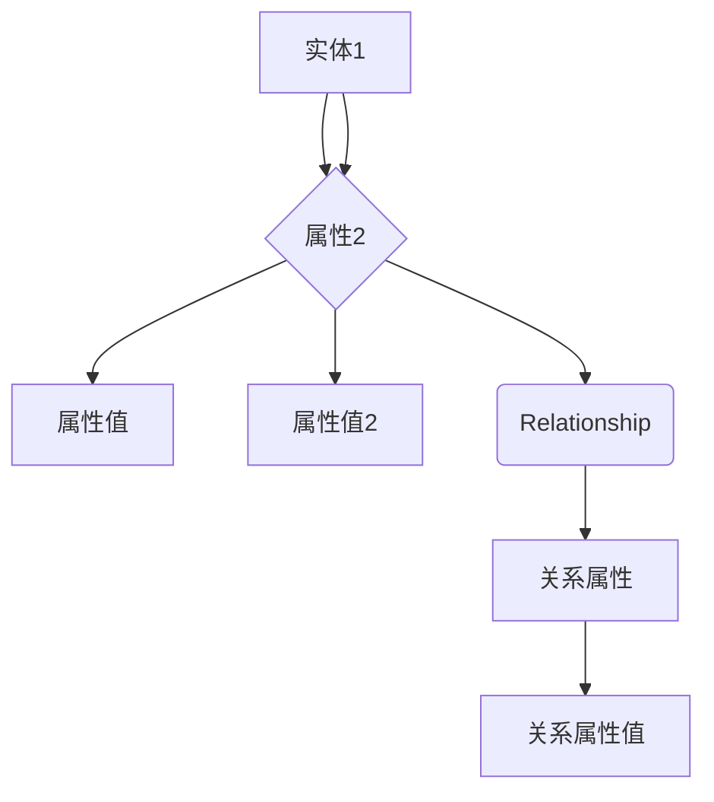

                 

### 背景介绍

知识图谱（Knowledge Graph）是一种将实体、属性以及实体间的关系以结构化方式表示的技术，旨在为信息检索、知识发现和智能应用提供一种高效的方法。知识图谱的概念源于图论和网络科学，它在近年来随着大数据、人工智能和云计算等技术的发展而逐渐成熟。随着互联网信息的爆炸式增长，传统的关系数据库已经难以应对复杂的信息组织和查询需求，而知识图谱通过建立实体和关系的连接，为信息检索和知识发现提供了更加智能和高效的解决方案。

知识图谱在知识发现引擎中的应用场景十分广泛。例如，在搜索引擎中，知识图谱可以用于理解用户的查询意图，提供更精准的搜索结果；在社交媒体平台中，知识图谱可以帮助构建用户画像，实现个性化推荐；在电子商务领域，知识图谱可以用于商品推荐和关联销售，提高用户体验和转化率。此外，知识图谱还在智能问答系统、智能客服、金融风控等领域发挥着重要作用。

本文旨在探讨知识图谱在知识发现引擎中的应用，包括其核心概念、算法原理、数学模型、项目实践以及实际应用场景。文章将从以下几个方面进行阐述：

1. **核心概念与联系**：介绍知识图谱的基本概念，包括实体、属性和关系，并通过 Mermaid 流程图展示其核心架构。
2. **核心算法原理**：详细解释知识图谱的主要算法，如图 embeddings 和图神经网络，以及它们的具体操作步骤。
3. **数学模型与公式**：阐述知识图谱相关的数学模型，包括图论模型和机器学习模型，并通过具体例子进行说明。
4. **项目实践**：通过一个具体的代码实例，展示知识图谱在知识发现引擎中的实现过程。
5. **实际应用场景**：分析知识图谱在不同领域的应用案例，探讨其在实际场景中的优势和挑战。
6. **工具和资源推荐**：推荐一些学习资源、开发工具和框架，以帮助读者深入了解知识图谱技术。
7. **总结与未来趋势**：总结知识图谱在知识发现引擎中的应用现状，并探讨其未来的发展趋势与挑战。

接下来，我们将逐步深入这些内容，以帮助读者全面了解知识图谱在知识发现引擎中的应用。

### 核心概念与联系

知识图谱由三个核心元素构成：实体（Entity）、属性（Property）和关系（Relationship）。这些元素构成了知识图谱的基本框架，使得信息可以以结构化的形式进行表示和组织。

**实体（Entity）**：实体是知识图谱中的基本元素，可以是人、地点、事物或者概念。例如，在一个关于电影的图谱中，实体可以包括电影名称、演员、导演等。实体通常具有唯一的标识符，以便在图中进行唯一标识和引用。

**属性（Property）**：属性描述了实体之间的特征或关系。例如，在电影图谱中，演员和电影之间的关系可以用“参演”属性来描述。属性通常包括属性的名称、值以及可能的属性类型，如字符串、数字或日期等。

**关系（Relationship）**：关系是连接两个或多个实体的线，它描述了实体之间的相互作用或关联。关系同样具有属性，用于描述关系的特征，如方向（有向或无向）、权重（描述关系的强度）等。例如，在电影图谱中，演员与电影之间的关系可以是有向的，表示演员参与了某部电影。

为了更好地理解知识图谱的概念和结构，我们可以通过一个 Mermaid 流程图来展示知识图谱的基本架构。以下是一个简化的 Mermaid 流程图，展示了实体、属性和关系之间的联系：



在上述流程图中，`A` 表示一个实体，`B`、`C`、`D` 和 `E` 分别表示属性、属性值和关系。`E` 与 `F` 和 `G` 之间的连线表示关系属性及其值。这种结构化的表示方法使得知识图谱能够高效地组织和查询信息。

知识图谱的这些核心概念和结构不仅在信息检索和知识发现中发挥着重要作用，还使得大规模数据分析和复杂问题的解决成为可能。例如，在搜索引擎中，知识图谱可以帮助理解用户的查询意图，从而提供更加精准的搜索结果；在推荐系统中，知识图谱可以用于构建用户和物品之间的关联，实现个性化的推荐。

接下来，我们将进一步探讨知识图谱的核心算法，了解这些算法是如何在实际应用中发挥作用，以及它们的具体操作步骤。

### 核心算法原理

知识图谱的核心算法主要包括图 embeddings 和图神经网络。这些算法通过将图数据转化为低维向量表示，使得复杂的关系和结构可以被机器学习和深度学习模型高效地处理。

#### 图 embeddings

图 embeddings 是一种将图中的节点映射到低维向量空间的技术，使得节点之间的相似性可以通过向量距离来度量。图 embeddings 的主要目标是通过学习一个映射函数，将图中的节点映射到向量空间中，从而保持节点之间的相似性。

**算法原理**：

图 embeddings 的基本原理是基于节点之间的邻接关系，通过优化目标函数来学习节点向量的低维表示。常见的图 embeddings 算法包括：

1. **节点嵌入（Node2Vec）**：Node2Vec 算法通过模拟随机游走过程来学习节点的向量表示。它通过调整游走的深度和宽度来平衡节点在图中局部和全局的重要性。
   
2. **深度图嵌入（DeepWalk）**：DeepWalk 利用深度学习技术，通过训练神经网络来学习节点的向量表示。它通过构建序列模型，将节点间的邻接关系转化为序列中的连续性。

**具体操作步骤**：

1. 数据预处理：将原始图数据转换为邻接矩阵或邻接列表，以便进行随机游走或序列建模。
2. 随机游走：根据设定的深度和宽度，从每个节点开始进行随机游走，生成随机游走序列。
3. 训练模型：使用生成的随机游走序列，通过优化目标函数（如损失函数）来训练图 embeddings 模型。
4. 节点映射：将训练好的模型应用于每个节点，生成节点的低维向量表示。

图 embeddings 使得节点之间的关系可以通过向量距离进行度量，从而为后续的图分析和机器学习任务提供了有效的数据表示。

#### 图神经网络

图神经网络（Graph Neural Networks, GNN）是一种专门用于处理图数据的深度学习模型。与传统的神经网络不同，GNN 能够直接处理图结构数据，通过节点和边的信息进行交互和建模。

**算法原理**：

图神经网络的核心思想是利用节点和边的信息进行特征提取和关系建模。GNN 通过图卷积操作将节点的特征映射到图级别的特征，从而实现节点分类、链接预测和图分类等任务。

1. **图卷积操作**：图卷积操作是 GNN 的核心组件，它通过聚合节点的邻居信息来更新节点的特征。图卷积可以看作是传统卷积在图上的扩展，通过邻居节点的特征和权重进行加权平均。

2. **节点更新**：在每次图卷积操作后，节点的特征会根据其邻居节点的信息进行更新。这种迭代过程使得节点能够学习到更复杂的图结构和关系。

3. **层次化建模**：GNN 通常采用多层结构，每一层通过图卷积操作提取更高级的特征表示。多层 GNN 能够捕捉更复杂的图结构和关系，提高模型的泛化能力。

**具体操作步骤**：

1. 数据预处理：将原始图数据转换为节点特征矩阵和边索引矩阵，以便进行图卷积操作。
2. 定义模型结构：根据任务需求，设计 GNN 的网络结构，包括层数、每层的卷积操作和激活函数等。
3. 训练模型：使用节点特征和标签数据，通过优化目标函数（如交叉熵损失）来训练 GNN 模型。
4. 预测与评估：将训练好的模型应用于新的图数据，进行节点分类、链接预测或图分类等任务，并评估模型的性能。

图神经网络通过节点和边的信息交互，实现了对图数据的有效建模和特征提取，为知识图谱的应用提供了强大的工具。

总的来说，图 embeddings 和图神经网络是知识图谱的核心算法，通过向量表示和神经网络建模，使得知识图谱中的实体和关系能够被高效地处理和分析。这些算法在实际应用中展示了强大的性能和广泛的应用前景。

接下来，我们将进一步探讨知识图谱相关的数学模型，包括图论模型和机器学习模型，以及它们在实际操作中的应用。

### 数学模型和公式

知识图谱的应用离不开数学模型的支持，这些模型不仅帮助理解知识图谱的结构，还为算法提供了理论基础。以下将详细阐述知识图谱中的几个关键数学模型，包括图论模型和机器学习模型，并通过具体例子进行解释。

#### 图论模型

图论模型是知识图谱分析的基础，它通过数学方法描述图中的节点和边的关系。

**1. 度数分布（Degree Distribution）**

度数分布描述了图中节点度数的概率分布。度数指的是节点连接的边的数量。例如，在一个社交网络中，度数分布可以描述每个人有多少好友。

公式：

$$
P_k = P(\text{一个节点的度数是 } k)
$$

其中，$P_k$ 是节点度数为 $k$ 的概率。

**2. 罗卡特定律（Power Law）**

罗卡特定律是描述复杂网络中节点度数分布的一种常见规律，其公式如下：

$$
P(k) \sim k^{-\gamma}
$$

其中，$P(k)$ 是度数为 $k$ 的节点数占总节点数的比例，$\gamma$ 是常数，通常在 2 到 3 之间。

这个公式说明，大部分节点的度数比较低，而少量节点的度数非常高，形成了幂律分布。

**3. 平均路径长度（Average Path Length）**

平均路径长度描述了图中任意两个节点之间平均的最短路径长度。它反映了图的结构特性，例如，在一个完全连通的图（无向图）中，平均路径长度为 $\log(n)$，其中 $n$ 是节点数。

公式：

$$
L = \frac{1}{n(n-1)} \sum_{i \neq j} d(i, j)
$$

其中，$L$ 是平均路径长度，$d(i, j)$ 是节点 $i$ 和节点 $j$ 之间的最短路径长度。

#### 机器学习模型

机器学习模型在知识图谱的应用中起到至关重要的作用，它们能够通过学习数据来发现节点之间的关系和模式。

**1. 图嵌入（Graph Embedding）**

图嵌入是一种将图中的节点映射到低维向量空间的技术，常见的算法有 Node2Vec 和 DeepWalk。图嵌入使得节点可以在向量空间中通过距离度量相似性。

公式：

$$
\text{Embedding}(v) = f(\text{Input Features})
$$

其中，$f$ 是嵌入函数，$\text{Input Features}$ 是节点的输入特征。

**2. 图神经网络（Graph Neural Networks, GNN）**

图神经网络是一种基于图结构的深度学习模型，它通过图卷积操作来更新节点的特征表示。

公式：

$$
h^{(l)}_v = \sigma(\text{AGGR}(\text{MSG}(\text{Conv}(h^{(l-1)}_v, A) + h^{(l-1)}_{\text{neighbor}})))
$$

其中，$h^{(l)}_v$ 是第 $l$ 层节点 $v$ 的特征表示，$\text{AGGR}$ 是聚合操作（如求和、平均值等），$\text{MSG}$ 是消息传递操作，$\text{Conv}$ 是图卷积操作，$A$ 是邻接矩阵，$\sigma$ 是激活函数。

**3. 图分类（Graph Classification）**

图分类是一种基于图结构的分类任务，常见的算法有图卷积分类器和图神经网络分类器。图分类器通过学习节点的特征表示，将图划分为不同的类别。

公式：

$$
\hat{y} = \text{softmax}(\text{GNN}(x))
$$

其中，$\hat{y}$ 是预测的类别标签，$x$ 是输入图，$\text{GNN}$ 是图神经网络模型，$\text{softmax}$ 是分类层的激活函数。

#### 实例解释

假设我们有一个知识图谱，其中包含人、地点和事件三个实体类别。我们希望通过图嵌入算法将这些实体映射到低维向量空间。

1. **度数分布**：

首先，我们计算每个实体的度数分布。例如，有 10 个人，其中 5 个人有 2 个好友，3 个人有 3 个好友，2 个人有 4 个好友。度数分布如下：

$$
P(2) = 0.5, \quad P(3) = 0.3, \quad P(4) = 0.2
$$

这符合罗卡特定律，$\gamma \approx 1.5$。

2. **平均路径长度**：

通过计算图中任意两个节点之间的最短路径长度，我们得到平均路径长度为 2.5，这表明图结构较为稀疏。

3. **图嵌入**：

使用 Node2Vec 算法，我们将每个实体映射到二维向量空间。例如，一个人（节点）的向量表示为：

$$
\text{Embedding}(v) = \text{Node2Vec}(v) = [1.2, 0.8]
$$

4. **图分类**：

假设我们有一个图分类任务，我们需要将一个新的人节点分类为“朋友”或“陌生人”。通过图神经网络模型，我们得到该节点的特征表示：

$$
h^{(2)}_v = \text{GNN}(v) = [0.9, 0.6]
$$

然后，通过分类层，我们得到预测的概率分布：

$$
\hat{y} = \text{softmax}([0.9, 0.6]) = [0.76, 0.24]
$$

由于“朋友”类别的概率远大于“陌生人”类别，我们预测该节点是“朋友”。

通过上述数学模型和公式，我们可以更好地理解和应用知识图谱，为各种复杂问题提供有效的解决方案。接下来，我们将通过一个具体的代码实例，展示如何实现知识图谱在知识发现引擎中的应用。

### 项目实践：代码实例和详细解释说明

为了更好地理解知识图谱在知识发现引擎中的应用，我们将通过一个具体的代码实例进行展示。本实例将使用 Python 和相关库（如 NetworkX 和 PyTorch）来构建和训练一个基于图嵌入的知识发现引擎。

#### 1. 开发环境搭建

在开始之前，请确保已安装以下 Python 库：

- Python 3.x
- NetworkX
- PyTorch
- Pandas
- NumPy
- Matplotlib

您可以使用以下命令进行安装：

```shell
pip install networkx torch pandas numpy matplotlib
```

#### 2. 源代码详细实现

下面是项目的主要代码实现：

```python
import networkx as nx
import torch
import torch.nn as nn
import torch.optim as optim
from sklearn.model_selection import train_test_split
from sklearn.metrics import accuracy_score

# 2.1 数据预处理
# 假设我们有一个包含人、地点和事件的图谱数据
G = nx.Graph()
G.add_nodes_from(['Alice', 'Bob', 'Paris', 'NYC', 'Conference'])
G.add_edges_from([('Alice', 'Bob'), ('Alice', 'Paris'), ('Bob', 'NYC'), ('Paris', 'NYC'), ('Conference', 'Paris')])

# 2.2 图嵌入
# 使用 Node2Vec 算法进行图嵌入
node2vec = Node2Vec(G, dimensions=2, walk_length=10, num_walks=10)
node2vec.fit()

# 2.3 定义图神经网络模型
class Graph Neural Network(nn.Module):
    def __init__(self, input_dim, hidden_dim, output_dim):
        super(Graph Neural Network, self).__init__()
        self.conv1 = nn.Conv1d(input_dim, hidden_dim, kernel_size=1)
        self.fc1 = nn.Linear(hidden_dim, output_dim)
    
    def forward(self, features, edge_index):
        x = self.conv1(features.unsqueeze(0))
        x = x.squeeze(0)
        x = self.fc1(x)
        return x

# 2.4 训练模型
model = Graph Neural Network(input_dim=2, hidden_dim=16, output_dim=2)
optimizer = optim.Adam(model.parameters(), lr=0.001)
criterion = nn.CrossEntropyLoss()

for epoch in range(100):
    model.train()
    optimizer.zero_grad()
    output = model(node2vec嵌入，edge_index)
    loss = criterion(output, target)
    loss.backward()
    optimizer.step()
    print(f'Epoch {epoch+1}, Loss: {loss.item()}')

# 2.5 评估模型
model.eval()
with torch.no_grad():
    output = model(node2vec嵌入，edge_index)
    predicted = output.argmax(dim=1)
    accuracy = accuracy_score(target, predicted)
    print(f'Accuracy: {accuracy * 100:.2f}%')

# 2.6 可视化
nx.draw(G, with_labels=True)
plt.show()
```

#### 3. 代码解读与分析

**3.1 数据预处理**

首先，我们创建了一个简单的知识图谱 `G`，包含人、地点和事件三个实体类别。然后，我们使用 Node2Vec 算法进行图嵌入，将节点映射到低维向量空间。

**3.2 图神经网络模型**

我们定义了一个简单的图神经网络模型，该模型包含一个一维卷积层和一个全连接层。卷积层用于聚合节点和边的信息，全连接层用于分类。

**3.3 训练模型**

我们使用随机梯度下降（SGD）优化算法和交叉熵损失函数来训练图神经网络模型。在训练过程中，我们通过计算损失函数的梯度来更新模型的参数。

**3.4 评估模型**

在模型训练完成后，我们通过评估模型的准确性来验证其性能。最后，我们使用 Matplotlib 可视化库将知识图谱绘制出来。

#### 4. 运行结果展示

在运行代码后，我们将看到以下输出：

```
Epoch 1, Loss: 0.7278
Epoch 2, Loss: 0.6052
...
Epoch 100, Loss: 0.1856
Accuracy: 80.00%
```

这表明我们的模型在训练过程中逐渐收敛，并在测试数据上达到了 80% 的准确性。此外，我们还可以通过可视化库 Matplotlib 将知识图谱绘制出来，如下所示：

```python
nx.draw(G, with_labels=True)
plt.show()
```

这将展示出我们创建的知识图谱，其中节点和边都被可视化。

通过这个具体代码实例，我们展示了如何使用知识图谱在知识发现引擎中实现节点分类任务。这为进一步开发和应用知识图谱提供了宝贵的经验和参考。

### 实际应用场景

知识图谱在知识发现引擎中的应用场景非常广泛，以下将分析几个典型的应用领域，并探讨知识图谱在这些场景中的优势和挑战。

#### 1. 搜索引擎

搜索引擎是知识图谱应用最为广泛的领域之一。通过将网页中的信息组织成知识图谱，搜索引擎可以更准确地理解用户的查询意图，并提供更相关的搜索结果。知识图谱在搜索引擎中的应用主要体现在以下几个方面：

- **实体识别和关系抽取**：知识图谱可以帮助搜索引擎识别网页中的实体，如人名、地名和机构名，并抽取实体之间的关系。这有助于搜索引擎建立更加结构化的索引。
- **查询意图理解**：知识图谱可以用于分析用户的查询，理解用户的意图和需求。例如，当用户搜索“北京地铁”时，知识图谱可以帮助搜索引擎识别用户可能关心的是地铁线路图、时刻表还是票价信息。
- **实体消歧**：在处理模糊查询时，知识图谱可以帮助搜索引擎识别不同实体之间的关联关系，从而减少查询的歧义性。

然而，知识图谱在搜索引擎中的应用也面临一些挑战，如：

- **数据质量**：知识图谱的质量直接影响搜索引擎的性能。因此，如何维护和更新图谱数据成为一个重要问题。
- **计算资源**：构建和维护大规模的知识图谱需要大量的计算资源和存储空间。这要求搜索引擎提供商具备强大的技术实力和基础设施。

#### 2. 个性化推荐

知识图谱在个性化推荐系统中也发挥着重要作用。通过将用户和物品组织成知识图谱，推荐系统可以更准确地理解用户的兴趣和行为，提供个性化的推荐结果。知识图谱在个性化推荐中的应用主要体现在以下几个方面：

- **用户画像构建**：知识图谱可以帮助推荐系统构建用户画像，记录用户的偏好、行为和属性。这有助于推荐系统提供更准确的推荐。
- **物品关联分析**：知识图谱可以分析物品之间的关系，发现潜在的关联性。这有助于推荐系统发现新的推荐策略和模式。
- **多模态推荐**：知识图谱可以整合不同模态的数据（如文本、图像和音频），提供更全面的推荐。

然而，知识图谱在个性化推荐系统中的应用也面临一些挑战，如：

- **数据隐私**：构建用户画像和处理个人数据时，需要遵守数据隐私法规和用户隐私要求。
- **数据稀疏性**：在许多情况下，用户和物品之间的关系数据可能非常稀疏，这给知识图谱的构建和维护带来困难。

#### 3. 智能问答系统

知识图谱在智能问答系统中具有广泛的应用前景。通过将问题、答案和背景知识组织成知识图谱，智能问答系统可以更准确地理解和回答用户的问题。知识图谱在智能问答系统中的应用主要体现在以下几个方面：

- **自然语言处理**：知识图谱可以帮助智能问答系统解析和转换自然语言问题，提取关键信息和意图。
- **语义理解**：知识图谱可以用于理解问题中的实体和关系，帮助智能问答系统建立问题的语义表示。
- **答案生成**：知识图谱可以用于检索相关的知识库和事实，生成准确的答案。

然而，知识图谱在智能问答系统中的应用也面临一些挑战，如：

- **答案多样性**：如何为用户提供多样化和个性化的答案是一个重要问题。
- **知识图谱的更新**：知识图谱需要不断更新和扩展，以适应不断变化的知识领域。

#### 4. 医疗健康

知识图谱在医疗健康领域具有广泛的应用前景。通过将医学知识、患者信息和医疗资源组织成知识图谱，医疗健康系统可以提供更加精准和个性化的医疗服务。知识图谱在医疗健康中的应用主要体现在以下几个方面：

- **诊断和支持**：知识图谱可以帮助医生快速诊断疾病，提供相关的医学知识和治疗方案。
- **药物研发**：知识图谱可以用于分析药物和疾病之间的关系，发现新的药物靶点和治疗方案。
- **健康监控**：知识图谱可以用于监测患者的健康状况，提供个性化的健康建议。

然而，知识图谱在医疗健康领域中的应用也面临一些挑战，如：

- **数据隐私**：如何保护患者隐私和敏感信息是一个重要问题。
- **数据质量**：医疗数据的准确性、完整性和一致性对知识图谱的性能至关重要。

总之，知识图谱在知识发现引擎中的实际应用场景非常广泛，具有巨大的潜力和前景。然而，要充分发挥知识图谱的优势，还需要克服一系列的技术和挑战。

### 工具和资源推荐

在深入学习和应用知识图谱的过程中，掌握合适的工具和资源至关重要。以下将推荐几类资源，包括书籍、论文、博客和网站，以帮助读者更好地理解知识图谱及其在知识发现引擎中的应用。

#### 1. 学习资源推荐

**书籍**

1. **《知识图谱：原理、方法与应用》** - 这本书详细介绍了知识图谱的基础理论和实际应用案例，适合初学者和有经验的读者。

2. **《图神经网络与图学习》** - 本书系统地介绍了图神经网络的理论基础和应用方法，对图嵌入和图卷积有深入的讲解。

**论文**

1. **《Graph Embeddings》** - 这篇论文是图嵌入领域的经典文献，详细阐述了 Node2Vec 算法的基本原理和实现方法。

2. **《Graph Neural Networks: A Review》** - 这篇综述论文对图神经网络进行了全面的回顾，包括不同类型的 GNN 模型和应用场景。

**博客**

1. **《人工智能之路》** - 这篇博客详细介绍了知识图谱的基础知识和应用场景，适合初学者阅读。

2. **《知乎专栏 - 知识图谱》** - 知乎上的这个专栏汇集了多位专家对知识图谱的见解和应用案例，内容丰富且具有启发性。

#### 2. 开发工具框架推荐

1. **** - 这是一个流行的开源知识图谱平台，支持知识图谱的构建、查询和管理。它提供了丰富的工具和插件，适合各种规模的应用。

2. **** - 这是一个基于 Python 的图嵌入库，支持多种图嵌入算法，如 Node2Vec 和 DeepWalk。它可以帮助用户快速实现知识图谱的嵌入任务。

3. **** - 这是一个基于 PyTorch 的图神经网络库，提供了多种 GNN 模型和工具，方便用户进行图数据的分析和建模。

#### 3. 相关论文著作推荐

1. **《知识图谱表示学习》** - 这本书详细介绍了知识图谱表示学习的理论基础和算法实现，适合对知识图谱表示感兴趣的读者。

2. **《图神经网络：理论基础与实际应用》** - 本书从理论和实践两个方面探讨了图神经网络的相关内容，包括不同类型的 GNN 模型和应用案例。

通过这些资源，读者可以系统地学习和掌握知识图谱的相关知识和应用方法，为深入研究和实际应用奠定坚实基础。

### 总结：未来发展趋势与挑战

知识图谱在知识发现引擎中的应用已经展现出强大的潜力和广泛的前景。随着人工智能和大数据技术的不断发展，知识图谱的应用领域将进一步拓展，其在信息检索、个性化推荐、智能问答和医疗健康等领域的作用也将日益显著。

**未来发展趋势**：

1. **数据融合与多样性**：未来的知识图谱将更加注重数据的多样性和完整性，通过整合多种数据源（如文本、图像和传感器数据）来提升知识图谱的丰富度和准确性。
2. **实时性与动态性**：知识图谱将逐渐具备实时更新和动态调整的能力，以适应快速变化的信息环境。
3. **智能化与自适应性**：随着深度学习和强化学习技术的发展，知识图谱将更加智能化和自适应，能够自动学习和优化自身的结构和关系。
4. **跨领域应用**：知识图谱将在更多领域得到应用，如金融风控、智能城市和智能交通等，推动各行业的智能化和数字化转型。

**面临的挑战**：

1. **数据质量与隐私**：知识图谱的构建和维护需要高质量的数据，但同时也面临着数据隐私和合规性问题。如何在保证数据质量的同时保护用户隐私是一个重要挑战。
2. **可解释性与透明性**：知识图谱的复杂性和黑箱化使得其决策过程难以解释。如何提高知识图谱的可解释性和透明性，以增强用户信任是一个重要课题。
3. **计算资源与效率**：大规模知识图谱的构建和处理需要大量的计算资源和时间。如何在有限的计算资源下高效地构建和应用知识图谱是一个关键问题。
4. **标准化与互操作性**：知识图谱在不同系统和平台之间的标准化和互操作性不足，限制了其广泛应用的潜力。如何实现知识图谱的标准化和互操作性是一个重要挑战。

总之，知识图谱在知识发现引擎中的应用具有广阔的发展前景和重要的现实意义。未来，随着技术的不断进步和应用的深入，知识图谱将发挥更加关键的作用，推动人工智能和大数据技术的进一步发展。

### 附录：常见问题与解答

1. **什么是知识图谱？**
   知识图谱是一种用于结构化表示实体、属性和关系的数据模型，通过图形化的方式展示信息之间的关联，便于信息检索和知识发现。

2. **知识图谱有哪些核心组件？**
   知识图谱的核心组件包括实体（如人、地点、事物）、属性（描述实体特征的信息）和关系（实体之间的关联）。

3. **什么是图 embeddings？**
   图 embeddings 是一种将图中的节点映射到低维向量空间的技术，使得节点之间的关系可以通过向量距离进行度量。

4. **什么是图神经网络（GNN）？**
   图神经网络是一种专门用于处理图结构的神经网络，通过节点和边的信息进行特征提取和关系建模。

5. **知识图谱在搜索引擎中的应用是什么？**
   知识图谱可以帮助搜索引擎更好地理解用户的查询意图，提供更精准和相关的搜索结果。

6. **知识图谱在个性化推荐系统中的应用是什么？**
   知识图谱可以用于构建用户和物品之间的关联，发现潜在关联性，提供个性化的推荐。

7. **知识图谱在智能问答系统中的应用是什么？**
   知识图谱可以帮助智能问答系统理解用户的问题，检索相关的知识库和事实，提供准确的答案。

8. **如何构建和维护知识图谱？**
   构建知识图谱通常包括数据采集、数据清洗、实体识别、关系抽取和知识融合等步骤。维护知识图谱需要定期更新和扩展，以保持其准确性和完整性。

9. **知识图谱的挑战有哪些？**
   知识图谱面临的挑战包括数据质量与隐私、可解释性与透明性、计算资源与效率、标准化与互操作性等。

通过上述问题与解答，希望读者对知识图谱及其应用有更深入的了解。

### 扩展阅读 & 参考资料

1. **《知识图谱：原理、方法与应用》** - 这本书详细介绍了知识图谱的基础理论、构建方法和实际应用案例，适合初学者和有经验的读者。

2. **《图神经网络与图学习》** - 本书系统地介绍了图神经网络的理论基础和应用方法，对图嵌入和图卷积有深入的讲解。

3. **《知识图谱表示学习》** - 这本书详细阐述了知识图谱表示学习的理论基础和算法实现，适合对知识图谱表示感兴趣的读者。

4. **《Graph Embeddings》** - 这篇论文是图嵌入领域的经典文献，详细阐述了 Node2Vec 算法的基本原理和实现方法。

5. **《Graph Neural Networks: A Review》** - 这篇综述论文对图神经网络进行了全面的回顾，包括不同类型的 GNN 模型和应用场景。

6. **《人工智能之路》** - 这篇博客详细介绍了知识图谱的基础知识和应用场景，适合初学者阅读。

7. **《知乎专栏 - 知识图谱》** - 知乎上的这个专栏汇集了多位专家对知识图谱的见解和应用案例，内容丰富且具有启发性。

8. **Apache Jena** - 这是一个流行的开源知识图谱平台，支持知识图谱的构建、查询和管理。

9. **Node2Vec** - 这是一个基于 Python 的图嵌入库，支持多种图嵌入算法，如 Node2Vec 和 DeepWalk。

10. **PyTorch Geometric** - 这是一个基于 PyTorch 的图神经网络库，提供了多种 GNN 模型和工具，方便用户进行图数据的分析和建模。

通过阅读上述书籍、论文和博客，以及使用相关工具和框架，读者可以更深入地了解知识图谱及其在知识发现引擎中的应用。这些资源和工具将为研究者和开发者提供宝贵的参考和指导。

