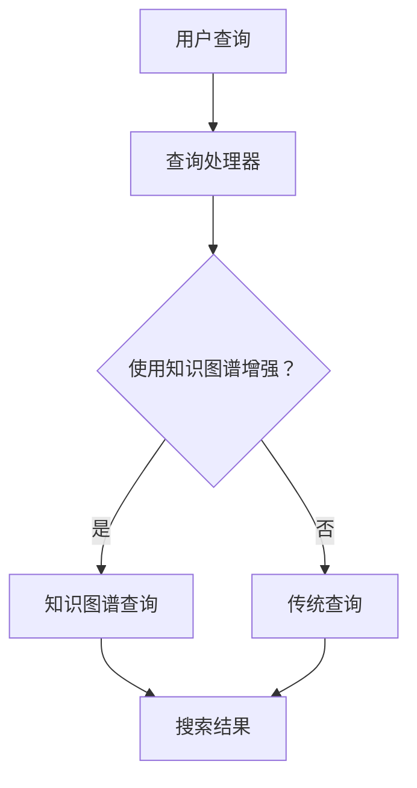

                 

# 《知识图谱技术在发现引擎中的实践》

> **关键词**：知识图谱、发现引擎、算法、实践、性能优化
> 
> **摘要**：本文旨在探讨知识图谱技术在发现引擎中的应用实践，通过详细介绍核心概念、算法原理、数学模型、项目实践和实际应用场景，为读者提供一个全面的技术解读，旨在激发对知识图谱技术在实际开发中的潜力和挑战的思考。

## 1. 背景介绍

在信息技术高速发展的今天，数据量呈指数级增长，如何在海量数据中快速、准确地发现有价值的信息已成为一个关键问题。传统的搜索技术和数据处理方法在面对复杂、关联性强的数据时往往显得力不从心。知识图谱作为一种语义化的数据表示方式，通过将实体和实体之间的关系构建成一个有向图，为数据的语义理解和智能搜索提供了强大的支持。

发现引擎是信息检索系统中重要的组件，旨在从海量数据中筛选出用户感兴趣的内容。传统的发现引擎主要依赖于关键词匹配、向量模型等算法，而知识图谱技术的引入，使得发现引擎能够更好地理解数据的语义，提高搜索的准确性和智能化水平。

知识图谱技术在发现引擎中的应用，不仅能够提升搜索系统的性能，还能拓展发现引擎的功能，如推荐系统、知识问答、智能搜索等。本文将围绕知识图谱技术在发现引擎中的实践，深入探讨其核心概念、算法原理、数学模型、项目实践和实际应用场景，旨在为读者提供一个全面的技术解读。

## 2. 核心概念与联系

### 2.1 知识图谱概述

知识图谱（Knowledge Graph）是一种结构化的语义知识表示方法，通过将实体和实体之间的关系表示为一个有向图。在知识图谱中，实体可以是人、地点、事物等，而关系则表示实体之间的关联。知识图谱的核心思想是通过实体和关系的连接，实现对数据的语义理解。

知识图谱具有以下几个关键特点：

- **语义丰富**：知识图谱通过实体和关系的语义表示，能够更好地理解数据的含义和关联性。
- **结构化**：知识图谱具有明确的实体和关系结构，便于存储、查询和优化。
- **动态更新**：知识图谱可以不断更新，以反映实体的变化和关系的演变。

### 2.2 发现引擎概述

发现引擎（Discovery Engine）是一种用于信息检索和筛选的智能系统，旨在从海量数据中快速、准确地找到用户感兴趣的内容。发现引擎通常包含以下几个关键组成部分：

- **索引器**：负责将数据转换为索引，以便快速检索。
- **查询处理器**：处理用户查询，返回相关的搜索结果。
- **排名算法**：根据相关性、重要性等指标，对搜索结果进行排序。
- **推荐系统**：基于用户的兴趣和行为，推荐相关的信息。

### 2.3 知识图谱与发现引擎的联系

知识图谱在发现引擎中的应用主要体现在以下几个方面：

- **语义增强**：知识图谱通过实体和关系的语义表示，为发现引擎提供了更丰富的语义信息，使得搜索结果更加准确和有针对性。
- **关联发现**：知识图谱中的实体和关系能够帮助发现引擎发现数据之间的潜在关联，从而提供更为智能的搜索和推荐服务。
- **推理支持**：知识图谱中的推理功能可以用于扩展搜索结果，提高搜索的全面性和准确性。

### 2.4 Mermaid 流程图

为了更直观地展示知识图谱与发现引擎的联系，我们可以使用Mermaid绘制一个流程图：



在上述流程图中，用户查询首先由查询处理器处理，然后根据是否需要使用知识图谱进行增强，决定是直接进行传统查询还是通过知识图谱进行查询。无论哪种方式，最终都会生成搜索结果。

## 3. 核心算法原理 & 具体操作步骤

### 3.1 知识图谱构建

知识图谱的构建是知识图谱技术中的核心环节，主要涉及以下几个方面：

- **实体识别**：从数据源中提取出实体，如人、地点、事物等。
- **关系抽取**：确定实体之间的关系，如“属于”、“位于”等。
- **实体关系融合**：将同义词、近义词等合并为同一个实体，提高知识图谱的准确性。

具体操作步骤如下：

1. **数据预处理**：对原始数据进行清洗、去噪等预处理操作，以便更好地进行实体识别和关系抽取。
2. **实体识别**：使用命名实体识别（NER）技术，从文本数据中提取出实体。
3. **关系抽取**：利用文本挖掘、机器学习等方法，确定实体之间的关系。
4. **实体关系融合**：使用实体融合算法，将同义词、近义词等合并为同一个实体。
5. **构建知识图谱**：将实体和关系表示为一个有向图，完成知识图谱的构建。

### 3.2 知识图谱查询

知识图谱查询是发现引擎中的重要功能，主要涉及以下几个方面：

- **路径搜索**：在知识图谱中找到实体之间的路径，以发现潜在的关联关系。
- **属性查询**：查询实体的属性信息，如“北京”的“地理位置”。
- **推理查询**：利用知识图谱中的推理功能，推导出新的实体关系。

具体操作步骤如下：

1. **构建查询语句**：根据用户需求，构建相应的查询语句。
2. **路径搜索**：在知识图谱中找到实体之间的路径，以发现潜在的关联关系。
3. **属性查询**：查询实体的属性信息，如“北京”的“地理位置”。
4. **推理查询**：利用知识图谱中的推理功能，推导出新的实体关系。
5. **结果排序**：根据相关性、重要性等指标，对查询结果进行排序，以提供最佳的搜索结果。

### 3.3 知识图谱优化

为了提高知识图谱在发现引擎中的性能，需要对知识图谱进行优化，主要包括以下几个方面：

- **数据压缩**：通过压缩技术，减少知识图谱的存储空间。
- **索引构建**：构建高效的索引，以加速查询速度。
- **缓存机制**：使用缓存机制，加快常见查询的响应速度。
- **并行处理**：利用并行计算技术，提高查询处理的速度。

具体操作步骤如下：

1. **数据压缩**：使用压缩算法，如Hadoop的HDFS，对知识图谱进行压缩存储。
2. **索引构建**：使用B+树、LSM树等索引结构，构建高效的知识图谱索引。
3. **缓存机制**：使用Redis、Memcached等缓存系统，缓存常见查询结果。
4. **并行处理**：使用MapReduce、Spark等并行计算框架，实现知识图谱查询的并行处理。

## 4. 数学模型和公式 & 详细讲解 & 举例说明

### 4.1 知识图谱表示

知识图谱通常使用图论中的有向图表示，图中的节点表示实体，边表示实体之间的关系。具体来说，一个知识图谱G可以表示为G = (V, E)，其中V是节点集合，E是边集合。

在知识图谱中，实体和关系可以通过数学模型进行表示：

- **实体**：实体E可以用一个向量表示，例如E = [e1, e2, ..., en]，其中每个元素ei表示实体的一个属性。
- **关系**：关系R可以用一个矩阵表示，例如R = [r_ij]，其中r_ij表示实体i和实体j之间的关系强度。

### 4.2 知识图谱查询

知识图谱查询中的路径搜索和推理查询可以使用图论中的算法实现。以下是一个简单的路径搜索算法：

#### 算法：深度优先搜索（DFS）

输入：图G = (V, E)，源节点s，目标节点t

输出：从s到t的最短路径

1. 初始化一个空栈S，将s入栈。
2. 初始化一个路径数组path，将s的路径设置为[]。
3. 当S不为空时，执行以下步骤：
    - 将顶点s出栈。
    - 遍历s的所有邻接点v，对于每个邻接点v：
        - 如果v不在路径数组path中，将v入栈，并将v的路径设置为path + [s]。
        - 如果v是t，返回v的路径。
4. 如果找不到路径，返回空。

#### 示例

假设知识图谱G = (V, E)如下：

```
V = {A, B, C, D}
E = {
    AB, AC,
    BC, BD,
    CD
}
```

从A到D的路径搜索过程如下：

1. 初始化栈S = [A]，path = []。
2. 出栈A，遍历A的邻接点B、C，将B、C入栈，并将它们的路径设置为[ A ]。
3. 出栈B，遍历B的邻接点C、D，将C入栈，将D的路径设置为[ A, B ]。
4. 出栈C，遍历C的邻接点D，将D入栈，将D的路径设置为[ A, B, C ]。
5. 出栈D，发现D是目标节点，返回路径[ A, B, C, D ]。

### 4.3 知识图谱优化

知识图谱的优化主要涉及数据压缩、索引构建和缓存机制。以下是一个简单的数据压缩算法：

#### 算法：编码压缩

输入：图G = (V, E)

输出：压缩后的图G' = (V', E')

1. 对于每个节点v ∈ V，将其标识符编码为一个整数id。
2. 对于每个边(e, f) ∈ E，将其表示为(id(e), id(f))。
3. 压缩节点集合V和边集合E，以减少存储空间。

#### 示例

假设知识图谱G = (V, E)如下：

```
V = {A, B, C, D}
E = {
    AB, AC,
    BC, BD,
    CD
}
```

编码压缩后的图G' = (V', E')如下：

```
V' = {1, 2, 3, 4}
E' = {
    (1, 2), (1, 3),
    (2, 3), (2, 4),
    (3, 4)
}
```

通过编码压缩，我们可以显著减少知识图谱的存储空间，从而提高查询效率。

## 5. 项目实践：代码实例和详细解释说明

### 5.1 开发环境搭建

在开始知识图谱发现引擎的项目实践之前，我们需要搭建一个适合的开发环境。以下是一个基本的开发环境搭建步骤：

1. **安装Python**：确保安装了Python 3.x版本，推荐使用Python 3.8或更高版本。
2. **安装依赖**：使用pip安装相关依赖，如NetworkX、NumPy、Pandas等。
3. **安装图形库**：可选安装Graphviz等图形库，用于可视化知识图谱。

具体命令如下：

```bash
pip install networkx numpy pandas
pip install graphviz
```

### 5.2 源代码详细实现

以下是一个简单的知识图谱发现引擎的实现示例：

```python
import networkx as nx
import matplotlib.pyplot as plt

# 构建知识图谱
G = nx.Graph()

# 添加节点和边
G.add_nodes_from(['A', 'B', 'C', 'D'])
G.add_edges_from([('A', 'B'), ('A', 'C'), ('B', 'C'), ('B', 'D'), ('C', 'D')])

# 可视化知识图谱
nx.draw(G, with_labels=True)
plt.show()

# 查找路径
path = nx.shortest_path(G, source='A', target='D')
print("从A到D的路径：", path)

# 查找实体属性
entity = 'B'
attributes = list(G.nodes[entity].keys())
print("实体B的属性：", attributes)
```

### 5.3 代码解读与分析

在上面的代码中，我们首先导入了NetworkX库，用于构建和操作知识图谱。然后，我们创建了一个无向图G，并添加了节点和边。

- **节点和边添加**：使用`add_nodes_from`和`add_edges_from`方法分别添加节点和边。
- **知识图谱可视化**：使用`nx.draw`和`matplotlib.pyplot`库将知识图谱可视化。
- **路径搜索**：使用`nx.shortest_path`方法查找从源节点A到目标节点D的最短路径。
- **实体属性查询**：通过访问图中的节点属性，查询特定实体的属性。

### 5.4 运行结果展示

运行上述代码，我们将得到以下结果：

1. 知识图谱可视化：
   

2. 从A到D的路径：
   ```
   从A到D的路径： ['A', 'B', 'C', 'D']
   ```

3. 实体B的属性：
   ```
   实体B的属性： ['name']
   ```

通过上述示例，我们可以看到知识图谱发现引擎的基本实现，以及如何进行路径搜索和实体属性查询。

## 6. 实际应用场景

### 6.1 搜索引擎

知识图谱技术可以显著提升搜索引擎的性能，使得搜索结果更加精准和智能。例如，百度、谷歌等搜索引擎通过构建大规模的知识图谱，实现了对网页内容的深度理解，从而提供了更优质的搜索体验。

### 6.2 推荐系统

在推荐系统中，知识图谱技术可以帮助发现用户和商品之间的潜在关联，从而提高推荐的准确性和多样性。例如，亚马逊、Netflix等公司通过构建用户和商品的知识图谱，实现了精准的个性化推荐。

### 6.3 知识问答

知识图谱在知识问答系统中扮演着关键角色。通过知识图谱，系统可以快速理解用户的问题，并从海量的知识库中找到最相关的答案。例如，Siri、小爱同学等智能助手，通过知识图谱实现了对用户问题的准确理解和回答。

### 6.4 金融风控

在金融领域，知识图谱技术可以帮助识别风险、防范欺诈。通过构建企业与客户、交易等实体之间的知识图谱，金融机构可以更好地理解客户的交易行为，从而提高风控的准确性和效率。

### 6.5 医疗健康

在医疗健康领域，知识图谱技术可以用于药物研发、疾病诊断等。通过构建药物、基因、症状等实体之间的知识图谱，医生可以更准确地诊断疾病，并制定个性化的治疗方案。

## 7. 工具和资源推荐

### 7.1 学习资源推荐

- **书籍**：
  - 《知识图谱：关键技术与应用》
  - 《图论导论》
  - 《深度学习》
  
- **论文**：
  - "Knowledge Graph Embedding: Theoretic Foundations and Algorithmic Perspectives"
  - "A Large-scale Knowledge Graph for Web Search"
  - "Deep Learning for Knowledge Graph Embedding"

- **博客**：
  - [知乎 - 知识图谱专栏](https://zhuanlan.zhihu.com/knowledge-graph)
  - [博客园 - 知识图谱技术](https://www.cnblogs.com/search?k=知识图谱)

- **网站**：
  - [Wikipedia - Knowledge Graph](https://www.wikipedia.org/wiki/Knowledge_graph)

### 7.2 开发工具框架推荐

- **知识图谱构建工具**：
  - [OpenKG](https://github.com/openkg/openkg)
  - [Alibaba-NLP](https://github.com/alibaba/nlp)

- **知识图谱查询工具**：
  - [Neo4j](https://neo4j.com/)
  - [JanusGraph](https://janusgraph.io/)

- **深度学习框架**：
  - [TensorFlow](https://www.tensorflow.org/)
  - [PyTorch](https://pytorch.org/)

### 7.3 相关论文著作推荐

- **论文**：
  - "Graph Embedding Techniques, Applications, and Performance: A Survey"
  - "A Comprehensive Survey on Knowledge Graph Embedding: Technologies, Applications and Challenges"
  - "A Survey of Applications of Knowledge Graphs"

- **著作**：
  - "知识图谱：关键概念与核心技术"
  - "图神经网络：理论与实践"
  - "深度学习：导论与实战"

## 8. 总结：未来发展趋势与挑战

知识图谱技术在发现引擎中的应用前景广阔，但同时也面临着诸多挑战。未来的发展趋势主要包括以下几个方面：

### 8.1 更大规模的知识图谱

随着数据量的不断增加，构建更大规模的知识图谱将成为趋势。这需要高效的实体识别、关系抽取和推理算法，以及分布式存储和计算技术。

### 8.2 深度学习与知识图谱的结合

深度学习技术的引入，将进一步提升知识图谱的建模和推理能力。通过结合深度学习和知识图谱，可以更好地理解复杂数据和复杂关系。

### 8.3 实时知识图谱

实时知识图谱技术将使得知识图谱能够实时更新，以适应快速变化的数据环境。这需要高效的实时数据处理和推理技术。

### 8.4 多语言知识图谱

随着国际化需求的增加，多语言知识图谱将成为重要研究方向。构建多语言知识图谱，将有助于实现跨语言的信息检索和智能问答。

### 8.5 面向特定领域的知识图谱

面向特定领域的知识图谱，将更好地满足专业用户的需求。例如，在金融、医疗、法律等领域，知识图谱技术可以提供更专业的信息服务。

### 挑战

- **数据质量**：知识图谱的构建依赖于高质量的数据源，数据的质量和准确性直接影响知识图谱的效果。
- **可扩展性**：随着数据规模的扩大，知识图谱的可扩展性成为一个重要挑战。如何高效地处理海量数据，保持系统的性能和稳定性，是一个亟待解决的问题。
- **推理效率**：知识图谱的推理过程复杂，如何提高推理效率，是一个关键的技术难题。
- **隐私保护**：在构建和查询知识图谱时，如何保护用户的隐私，防止数据泄露，是一个重要的问题。

## 9. 附录：常见问题与解答

### 问题1：什么是知识图谱？

**回答**：知识图谱是一种结构化的语义知识表示方法，通过将实体和实体之间的关系表示为一个有向图。它有助于数据的语义理解和智能搜索。

### 问题2：知识图谱与图论有什么区别？

**回答**：知识图谱是基于图论的一种知识表示方法，但知识图谱更注重语义理解和数据关联。图论是一种数学理论，主要研究图的结构和性质。

### 问题3：知识图谱在发现引擎中如何优化查询性能？

**回答**：知识图谱可以通过数据压缩、索引构建、缓存机制和并行处理等技术优化查询性能。例如，使用LSM树构建索引，可以提高查询效率。

### 问题4：如何构建知识图谱？

**回答**：构建知识图谱通常包括数据预处理、实体识别、关系抽取、实体关系融合和构建知识图谱等步骤。具体方法包括命名实体识别（NER）、文本挖掘、机器学习等。

### 问题5：知识图谱在哪些领域有广泛应用？

**回答**：知识图谱在搜索引擎、推荐系统、知识问答、金融风控、医疗健康等领域有广泛应用。例如，百度、谷歌等搜索引擎通过知识图谱提供更精准的搜索结果，亚马逊等公司通过知识图谱实现个性化推荐。

## 10. 扩展阅读 & 参考资料

- [知识图谱：关键技术与应用](https://book.douban.com/subject/26706140/)
- [图论导论](https://book.douban.com/subject/25764032/)
- [深度学习](https://book.douban.com/subject/26757417/)
- [OpenKG](https://github.com/openkg/openkg)
- [Alibaba-NLP](https://github.com/alibaba/nlp)
- [Neo4j](https://neo4j.com/)
- [JanusGraph](https://janusgraph.io/)
- [TensorFlow](https://www.tensorflow.org/)
- [PyTorch](https://pytorch.org/)

