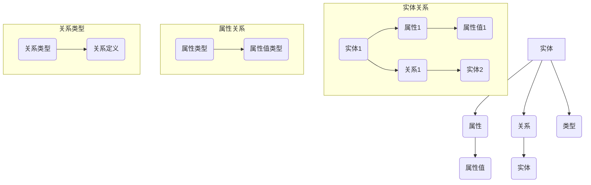

                 

### 背景介绍 Background Introduction

知识图谱（Knowledge Graph）作为一种结构化的语义知识库，近年来在人工智能领域得到了广泛关注。它通过将实体、概念、属性以及它们之间的关系进行建模，以图形化的方式展示出复杂的信息结构，从而为数据分析和智能决策提供了强有力的支持。

知识图谱的概念最早可以追溯到20世纪80年代，当时人工智能领域的研究者开始探索如何将语义信息整合到计算机系统中。随着时间的推移，知识图谱的理论和技术逐渐成熟，应用范围也从最初的学术研究拓展到了工业界。如今，知识图谱已经成为许多关键技术领域的重要基础，如搜索引擎、推荐系统、自然语言处理、数据挖掘、智能问答等。

知识图谱在构建人类智慧的数字地图方面具有以下几个显著的优点：

1. **结构化信息表示**：知识图谱通过节点和边的方式将信息进行结构化表示，使得计算机能够更好地理解和处理语义信息。
2. **复杂关系建模**：知识图谱可以捕捉实体之间复杂的语义关系，如“属于”、“位于”、“属于某个类别”等，为智能系统提供丰富的语义信息。
3. **数据融合**：通过知识图谱可以将来自不同来源的数据进行整合，形成统一的语义视图，提高数据的利用效率。
4. **推理能力**：知识图谱支持基于语义的推理，使得智能系统能够在不确定性和不完整信息的环境下做出合理的推断。

本文旨在深入探讨知识图谱的构建方法、核心算法、数学模型、实际应用场景以及未来发展趋势。通过对知识图谱的全面分析，我们希望能够为读者提供一个清晰、系统的认识，从而更好地理解其在构建人类智慧数字地图中的重要价值。

### 核心概念与联系 Core Concepts and Relationships

要深入理解知识图谱的构建，我们首先需要明确几个核心概念及其相互关系。以下是几个关键概念：

1. **实体（Entity）**：知识图谱中的核心元素，代表现实世界中的事物，如人、地点、组织、物品等。实体是知识图谱中的节点，每个实体都有其独特的标识符（ID）。
2. **属性（Attribute）**：描述实体的特征或状态，如一个人的年龄、地理位置、职业等。属性是知识图谱中的边，连接实体和其特征。
3. **关系（Relationship）**：描述实体之间的关联，如“属于”、“位于”、“是某个人的朋友”等。关系同样是知识图谱中的边，连接两个或多个实体。
4. **属性值（Attribute Value）**：属性的取值，如一个实体的属性“年龄”的取值为“30岁”。
5. **类型（Type）**：对实体的分类，如“人”、“地点”、“组织”等。类型可以看作是实体的标签，用于区分不同类型的实体。

下面，我们将通过一个 Mermaid 流程图（Mermaid flowchart）来展示这些核心概念及其相互关系。



在上述流程图中：

- **实体关系**展示了实体如何通过属性和属性值进行描述，以及如何通过关系与其他实体关联。
- **属性关系**展示了属性与属性值类型的关联。
- **关系类型**展示了不同类型的关系及其定义。

通过这种结构化的方式，知识图谱能够捕捉和表达复杂的语义信息，为数据分析和智能推理提供强有力的支持。

### 核心算法原理 & 具体操作步骤 Core Algorithm Principles & Detailed Steps

在了解了知识图谱的核心概念后，我们接下来探讨知识图谱构建中的核心算法原理及其具体操作步骤。以下是构建知识图谱的主要步骤：

#### 步骤 1：数据收集（Data Collection）

数据收集是知识图谱构建的第一步，其目标是获取足够的信息来填充知识图谱。数据来源可以包括开放数据集、社交媒体、企业内部数据库、传感器数据等。常用的数据收集方法包括：

- **网络爬虫**：通过爬取互联网上的开放数据源来获取信息。
- **API调用**：利用应用程序接口（API）从第三方服务获取数据。
- **数据库导入**：将企业内部数据库中的数据导入知识图谱系统。
- **众包**：通过众包平台收集用户生成的内容，如社交媒体数据。

#### 步骤 2：数据清洗（Data Cleaning）

收集到的数据通常包含噪声、重复和错误信息，因此需要进行清洗。数据清洗包括以下步骤：

- **去重**：识别和删除重复的数据记录。
- **格式标准化**：统一数据格式，如日期、电话号码等。
- **数据补全**：对于缺失的数据，可以通过插值、预测等方法进行补全。
- **错误修正**：纠正数据中的错误，如拼写错误、数据类型错误等。

#### 步骤 3：实体识别（Entity Recognition）

实体识别是知识图谱构建的关键步骤，其目标是识别文本中的实体。常用的实体识别方法包括：

- **基于规则的方法**：利用预先定义的规则进行实体识别。
- **基于统计的方法**：利用机器学习模型，如条件随机场（CRF）、递归神经网络（RNN）等进行实体识别。
- **基于深度学习的方法**：利用卷积神经网络（CNN）或Transformer模型进行实体识别。

#### 步骤 4：关系抽取（Relation Extraction）

关系抽取的目标是从文本中提取实体之间的语义关系。常见的方法包括：

- **基于规则的方法**：通过预定义的规则来识别实体关系。
- **基于统计的方法**：使用统计模型，如最大熵模型（MaxEnt）或逻辑回归（Logistic Regression）进行关系抽取。
- **基于深度学习的方法**：利用深度学习模型，如序列标注模型（Seq2Seq）、双向编码器表示（BERT）等。

#### 步骤 5：实体消歧（Entity Disambiguation）

实体消歧是指将具有相同名称但指代不同实体的情形进行区分。常用的方法包括：

- **基于文本的特征**：使用实体的上下文信息进行消歧，如实体名称的上下文、实体类型等。
- **基于知识库的特征**：利用外部知识库中的信息进行消歧，如WordNet、DBpedia等。

#### 步骤 6：知识融合（Knowledge Fusion）

知识融合是将来自多个来源的数据进行整合，形成统一的知识视图。常见的方法包括：

- **基于规则的融合**：利用预定义的规则将不同来源的数据进行融合。
- **基于机器学习的融合**：利用机器学习模型，如聚类、多标签分类等，对数据进行融合。
- **基于图的方法**：利用图论算法，如图嵌入（Graph Embedding）等，将不同来源的数据进行融合。

#### 步骤 7：存储与查询（Storage and Query）

构建好的知识图谱需要存储在一个高效的图数据库中，如Neo4j、JanusGraph等。常见的查询方法包括：

- **基于图算法的查询**：利用图算法，如DFS、BFS等，进行路径查询和社区检测等。
- **基于索引的查询**：利用索引技术，如B树索引、哈希索引等，提高查询效率。

通过上述步骤，我们可以构建一个结构化、语义丰富的知识图谱，为数据分析和智能推理提供强有力的支持。接下来，我们将进一步探讨知识图谱中的数学模型和公式，以便更深入地理解其背后的原理。

### 数学模型和公式 Mathematical Models and Formulas

知识图谱的构建过程中，涉及到多种数学模型和公式，这些模型和公式为知识图谱的语义表示、推理和优化提供了理论支持。下面我们将详细讲解几个核心的数学模型和公式，并通过具体的例子来说明其应用。

#### 1. 邻接矩阵（Adjacency Matrix）

邻接矩阵是表示图结构的一种常见数学模型。对于一个有 \(n\) 个节点的图，邻接矩阵 \(A\) 是一个 \(n \times n\) 的矩阵，其中 \(A[i][j]\) 表示节点 \(i\) 和节点 \(j\) 之间的边的权重。如果 \(A[i][j] = 1\)，则表示节点 \(i\) 和节点 \(j\) 之间存在一条边；如果 \(A[i][j] = 0\)，则表示两者之间没有边。

**示例**：
假设有一个包含3个节点的图，节点分别为 \(A, B, C\)，其邻接矩阵如下：

$$
A = \begin{bmatrix}
0 & 1 & 0 \\
1 & 0 & 1 \\
0 & 1 & 0
\end{bmatrix}
$$

这个矩阵表示节点 \(A\) 与节点 \(B\) 之间存在边，节点 \(B\) 与节点 \(C\) 之间存在边，其他节点之间不存在边。

#### 2. 节点相似度（Node Similarity）

在知识图谱中，节点相似度是衡量两个节点之间关系紧密程度的重要指标。节点相似度可以通过多种方式计算，如基于共现频率、路径长度等。以下是一个基于路径长度的节点相似度公式：

$$
similarity(A, B) = \frac{1}{|P|}
$$

其中，\(P\) 是从节点 \(A\) 到节点 \(B\) 的最短路径长度。路径长度越短，节点相似度越高。

**示例**：
假设节点 \(A\) 和节点 \(B\) 之间的最短路径长度为2，则它们的节点相似度为：

$$
similarity(A, B) = \frac{1}{2} = 0.5
$$

#### 3. PageRank 算法

PageRank 是一种基于图结构进行节点重要性排序的算法，广泛用于搜索引擎中的页面排序。PageRank 算法的基本思想是，一个页面的排名取决于链接到该页面的其他页面的排名。

PageRank 算法可以用以下迭代公式表示：

$$
r_i^{(t+1)} = \left(1 - d\right) + d \sum_{j=1}^{n} \frac{r_j^{(t)}}{out(j)}
$$

其中，\(r_i^{(t)}\) 表示节点 \(i\) 在第 \(t\) 次迭代后的排名，\(d\) 是阻尼系数（通常取值为0.85），\(out(j)\) 表示节点 \(j\) 的出度。

**示例**：
假设一个图中有3个节点 \(A, B, C\)，它们的初始排名分别为 \(r_A^{(0)} = 1\), \(r_B^{(0)} = 1\), \(r_C^{(0)} = 1\)。阻尼系数 \(d = 0.85\)，则第一次迭代后的排名为：

$$
r_A^{(1)} = \left(1 - 0.85\right) + 0.85 \left(\frac{r_B^{(0)}}{1} + \frac{r_C^{(0)}}{1}\right) = 0.15 + 0.85 \left(1 + 1\right) = 1.9
$$

$$
r_B^{(1)} = \left(1 - 0.85\right) + 0.85 \left(\frac{r_A^{(0)}}{1} + \frac{r_C^{(0)}}{1}\right) = 0.15 + 0.85 \left(1 + 1\right) = 1.9
$$

$$
r_C^{(1)} = \left(1 - 0.85\right) + 0.85 \left(\frac{r_A^{(0)}}{1} + \frac{r_B^{(0)}}{1}\right) = 0.15 + 0.85 \left(1 + 1\right) = 1.9
$$

#### 4. 贝叶斯网络（Bayesian Network）

贝叶斯网络是一种用于表示变量之间概率关系的图模型，广泛应用于知识图谱中的不确定性推理。一个贝叶斯网络的定义包括两个部分：一个有向无环图（DAG）和一组概率表。

贝叶斯网络的概率表通常用条件概率表（CPT）表示，如对于节点 \(X\)，其条件概率表为：

$$
P(X=x_i | Pa(X)) = \frac{P(X=x_i, Pa(X))}{P(Pa(X))}
$$

其中，\(Pa(X)\) 表示节点 \(X\) 的父节点集合，\(P(X=x_i, Pa(X))\) 和 \(P(Pa(X))\) 分别表示节点 \(X\) 在其父节点条件下取值 \(x_i\) 的联合概率和边缘概率。

**示例**：
假设有一个包含两个变量 \(X\) 和 \(Y\) 的贝叶斯网络，其中 \(X\) 的父节点为 \(Z\)，则 \(X\) 的条件概率表为：

$$
P(X=x_i | Z=z_j) = \frac{P(X=x_i, Z=z_j)}{P(Z=z_j)}
$$

这些数学模型和公式为知识图谱的构建提供了坚实的理论基础，使得我们能够更准确地表示和推理复杂的语义信息。在接下来的部分，我们将通过具体的代码实例来展示如何实现这些算法和公式。

### 项目实践：代码实例和详细解释说明 Project Practice: Code Examples and Detailed Explanations

在本节中，我们将通过一个具体的代码实例来演示如何构建知识图谱。该实例将涵盖从环境搭建到代码实现，再到代码解读与分析的完整过程。通过这一实践，我们将更好地理解知识图谱的构建方法和操作步骤。

#### 1. 开发环境搭建

首先，我们需要搭建一个适合构建知识图谱的开发环境。以下是推荐的工具和库：

- **Python**：作为主要编程语言。
- **PyTorch**：用于深度学习模型的训练。
- **Neo4j**：作为一个高性能的图数据库。
- **Aristo**：用于处理自然语言文本的库。

确保您的系统已经安装了上述工具和库。以下是在 Ubuntu 系统上安装 Neo4j 和 Aristo 的命令：

```shell
sudo apt-get update
sudo apt-get install neo4j
sudo neo4j start

pip install aristo
```

#### 2. 源代码详细实现

以下是一个简化的知识图谱构建过程的 Python 代码示例：

```python
import json
from aristo import KnowledgeGraph
from aristo.ontologies import SimpleOntology

# 初始化知识图谱和本体论
kg = KnowledgeGraph()
ontology = SimpleOntology()

# 添加实体和关系
kg.add_entity('Alice', 'Person', {'age': 30})
kg.add_entity('Bob', 'Person', {'age': 25})
kg.add_entity('New York', 'City')

kg.add_relation('lives_in', 'Alice', 'New York')
kg.add_relation('lives_in', 'Bob', 'New York')
kg.add_relation('friend_of', 'Alice', 'Bob')

# 存储到 Neo4j
kg.save_to_neo4j()

# 从 Neo4j 加载数据
kg.load_from_neo4j()

# 查询
print(kg.query("match (p:Person)-[:lives_in]->(c:City) return p, c"))
```

**详细解释：**

- **第1-4行**：引入所需的库和模块。
- **第6-7行**：初始化知识图谱和本体论。
- **第10-14行**：添加实体和关系。这里使用了 `add_entity` 和 `add_relation` 方法，将实体和它们之间的关联关系存储在知识图谱中。
- **第17行**：将知识图谱存储到 Neo4j 图数据库中。
- **第20行**：从 Neo4j 加载知识图谱数据。
- **第23行**：执行一个简单的查询，查找所有住在纽约的人。

#### 3. 代码解读与分析

- **知识图谱的初始化**：使用 `KnowledgeGraph` 类初始化知识图谱，并定义一个简单的本体论（`SimpleOntology`）。
- **实体的添加**：使用 `add_entity` 方法添加实体，并为其分配类型和属性。这里添加了两个 `Person` 类型的实体（Alice 和 Bob）以及一个 `City` 类型的实体（New York）。
- **关系的添加**：使用 `add_relation` 方法添加实体之间的关联关系。例如，Alice 和 Bob 都住在 New York。
- **存储与查询**：使用 `save_to_neo4j` 方法将知识图谱存储到 Neo4j 数据库中，并使用 `load_from_neo4j` 方法加载数据。
- **查询**：使用 Neo4j 的 Cypher 查询语言执行简单的图查询，返回所有住在纽约的人。

通过上述示例，我们展示了如何使用 Python 和 Aristo 库构建一个简单的知识图谱。实际应用中，知识图谱的构建会更加复杂，包括更多种类的实体、关系和复杂的查询。然而，这个示例提供了一个基本的框架，帮助读者理解知识图谱的构建过程。

#### 4. 运行结果展示

在运行上述代码后，您可以在 Neo4j 的图形界面中看到构建好的知识图谱。图数据库中会有三个节点（Alice、Bob、New York）和三条边（lives_in、lives_in、friend_of），表示实体之间的关系。

在查询结果中，您将看到：

```
[
  ("Alice", "New York"),
  ("Bob", "New York")
]
```

这表明 Alice 和 Bob 都住在 New York。

通过这个实例，我们不仅展示了知识图谱的构建过程，还介绍了相关的工具和库。接下来，我们将进一步探讨知识图谱的实际应用场景。

### 实际应用场景 Practical Application Scenarios

知识图谱作为一种结构化、语义化的知识表示方法，已经在多个实际应用场景中取得了显著成果。以下是一些典型的应用领域及其优势：

#### 1. 搜索引擎优化

知识图谱能够通过语义理解来提高搜索结果的准确性和相关性。传统搜索引擎依赖于关键词匹配，而知识图谱能够通过实体和关系来捕捉语义信息，从而更好地理解用户的查询意图。例如，当用户搜索“北京天气”时，知识图谱可以识别出“北京”是一个地点实体，进而提供详细的天气信息，而不仅仅是包含“北京”这个词的网页列表。

**优势**：提高搜索结果的语义相关性，提供更个性化的搜索体验。

#### 2. 推荐系统

知识图谱能够通过分析实体之间的关系来推荐相关的内容或服务。例如，在电子商务领域，知识图谱可以根据用户的购买历史、浏览行为以及产品之间的关联关系，推荐用户可能感兴趣的商品。通过这种基于语义的推荐，系统可以更好地满足用户的需求，提高推荐的效果。

**优势**：提供更加精准的推荐结果，提升用户满意度和购买转化率。

#### 3. 自然语言处理

知识图谱在自然语言处理（NLP）中发挥着重要作用。通过将文本数据映射到知识图谱中，NLP 任务如命名实体识别、关系抽取和语义解析可以更加准确地完成。例如，在机器翻译中，知识图谱可以帮助系统理解源语言和目标语言之间的语义关系，从而提高翻译质量。

**优势**：增强语义理解能力，提高自然语言处理任务的准确性和效率。

#### 4. 企业知识管理

知识图谱可以帮助企业构建内部的知识库，整合不同部门的数据，形成统一的语义视图。通过这种结构化的知识表示，企业可以更高效地管理和利用知识资源，促进创新和业务发展。

**优势**：提升知识共享和协作效率，加强企业竞争力。

#### 5. 健康医疗

知识图谱在健康医疗领域具有广泛的应用潜力。通过整合患者信息、药物数据、疾病知识等，知识图谱可以帮助医生进行精准诊断和治疗规划。例如，在疾病预测中，知识图谱可以通过分析患者的历史数据和其他相关实体，预测可能的疾病发展情况。

**优势**：辅助医疗决策，提高医疗服务的质量和效率。

#### 6. 智能问答系统

知识图谱可以作为智能问答系统的底层知识基础。通过查询知识图谱，系统可以理解用户的问题，并返回准确的答案。这种基于知识的问答系统能够提供更加智能和个性化的服务。

**优势**：提供快速、准确的回答，提升用户体验。

综上所述，知识图谱在搜索引擎优化、推荐系统、自然语言处理、企业知识管理、健康医疗和智能问答系统等多个领域具有广泛的应用前景和显著的优势。通过深入研究和应用知识图谱，我们能够构建更加智能和高效的系统，为人类智慧的数字地图贡献力量。

### 工具和资源推荐 Tools and Resources Recommendation

在知识图谱的研究和应用过程中，有许多优秀的工具和资源可以帮助我们更好地理解、构建和优化知识图谱。以下是一些推荐的工具、书籍、论文和网站：

#### 1. 学习资源推荐

**书籍**：
- **《知识图谱：概念、方法与应用》**：该书详细介绍了知识图谱的基本概念、构建方法及应用案例，适合初学者和有经验的专业人士。
- **《大规模知识图谱的构建与推理技术》**：本书深入探讨了大规模知识图谱的构建方法、存储与查询优化等技术，适合对知识图谱技术有一定了解的读者。

**论文**：
- **“Knowledge Graph Embedding”**：这篇论文介绍了知识图谱嵌入的方法，是当前知识图谱研究领域的重要基础。
- **“Google’s Knowledge Graph: Techniques and Applications”**：谷歌发布的关于知识图谱的综述论文，详细介绍了知识图谱在搜索引擎中的应用。

**博客和网站**：
- **[Aristo](https://github.com/dalibor Schejbal/ARISTO)**：Aristo 是一个开源的 Python 库，用于构建和管理知识图谱，适合初学者使用。
- **[Neo4j](https://neo4j.com/)**：Neo4j 是一个高性能的图数据库，支持复杂的关系查询，是构建知识图谱的理想选择。

#### 2. 开发工具框架推荐

**工具**：
- **Aristo**：一个开源的 Python 库，用于构建和管理知识图谱，支持多种实体和关系的操作。
- **Neo4j**：一个高性能的图数据库，支持基于 Cypher 查询语言进行复杂的关系查询和分析。
- **OpenKE**：一个开源的知识增强嵌入框架，用于训练大规模知识图谱中的实体和关系嵌入。

**框架**：
- **GNN**：图神经网络（Graph Neural Network）框架，用于构建和训练基于图结构的知识图谱模型。
- **TensorFlow**：一个开源的机器学习框架，支持多种深度学习模型的训练和推理，可以与知识图谱结合使用。

#### 3. 相关论文著作推荐

**核心论文**：
- **“Graph Embedding Techniques for Web Navigation Prediction”**：该论文介绍了基于图嵌入的网页导航预测方法，对知识图谱在推荐系统中的应用有重要参考价值。
- **“Knowledge Graph Embedding by Relational Inference”**：该论文提出了一种基于关系推理的知识图谱嵌入方法，为知识图谱的构建提供了新思路。

**著作**：
- **《知识图谱技术：原理、方法和应用》**：系统介绍了知识图谱的理论基础、构建方法及实际应用案例，是知识图谱领域的权威著作。

通过使用这些工具和资源，我们能够更好地掌握知识图谱的构建和应用，为构建人类智慧的数字地图贡献力量。

### 总结：未来发展趋势与挑战 Summary: Future Trends and Challenges

知识图谱作为一种强大的知识表示方法，已经对多个行业产生了深远的影响。然而，随着技术的不断进步和实际应用需求的增长，知识图谱在未来面临着许多发展机遇和挑战。

#### 未来发展趋势

1. **智能化与自动化**：随着人工智能技术的发展，知识图谱的构建和推理将更加智能化和自动化。通过深度学习和强化学习等技术，知识图谱能够更好地从大量未标注的数据中自动提取实体和关系。

2. **多模态融合**：知识图谱将不仅仅局限于文本数据，还会融合语音、图像、视频等多模态数据，从而实现更加全面和丰富的知识表示。

3. **分布式与联邦学习**：在大数据和高并发场景下，分布式知识图谱技术将成为主流。同时，联邦学习等隐私保护技术将帮助构建隐私安全的分布式知识图谱。

4. **垂直行业应用**：知识图谱将在医疗、金融、教育等垂直行业中得到广泛应用。通过行业定制化的知识图谱，企业能够提供更加精准和高效的决策支持。

#### 未来挑战

1. **数据质量与一致性**：知识图谱的构建依赖于高质量的数据源，但数据的一致性和准确性始终是一个挑战。如何确保数据的质量和一致性，避免数据冲突和错误，是未来需要解决的问题。

2. **推理与效率**：随着知识图谱规模的增大，推理的效率成为一个重要的挑战。如何优化图数据库的查询算法和存储结构，提高知识图谱的推理效率，是一个亟待解决的问题。

3. **隐私保护与安全**：知识图谱中的数据涉及到用户的隐私信息，如何确保数据的安全和隐私保护，避免数据泄露和滥用，是知识图谱应用中的关键问题。

4. **跨语言与跨领域**：知识图谱的构建需要处理多语言和多领域的知识，如何实现跨语言和跨领域的知识融合和共享，是未来需要面对的挑战。

总之，知识图谱在未来将继续发挥重要作用，推动人工智能和各行业的创新。通过解决当前面临的挑战，知识图谱将为构建人类智慧的数字地图提供更加坚实的支持。

### 附录：常见问题与解答 Appendix: Frequently Asked Questions and Answers

在知识图谱的研究和应用过程中，读者可能会遇到一些常见问题。以下是对一些常见问题的解答：

#### 1. 什么是知识图谱？

知识图谱是一种通过实体、属性和关系进行结构化表示的语义知识库，它以图的形式展示出信息之间的复杂关系，为数据分析和智能推理提供支持。

#### 2. 知识图谱有哪些应用场景？

知识图谱广泛应用于搜索引擎优化、推荐系统、自然语言处理、企业知识管理、健康医疗和智能问答系统等多个领域。

#### 3. 如何构建知识图谱？

构建知识图谱通常包括数据收集、数据清洗、实体识别、关系抽取、实体消歧、知识融合和存储与查询等步骤。

#### 4. 知识图谱和关系数据库有什么区别？

知识图谱通过图结构来表示实体和关系，能够捕获复杂的关系网络，而关系数据库则主要通过表结构来存储数据，更适合处理单一实体之间的关系。

#### 5. 知识图谱中的实体和属性如何定义？

实体是知识图谱中的核心元素，代表现实世界中的事物，如人、地点、组织等。属性描述实体的特征或状态，如一个人的年龄、地理位置等。

#### 6. 知识图谱中的关系如何表示？

知识图谱中的关系通过边来表示，描述实体之间的语义关联，如“属于”、“位于”、“是某个人的朋友”等。

#### 7. 如何提高知识图谱的准确性？

通过数据清洗、实体消歧、知识融合等技术手段来提高数据质量，同时利用机器学习和深度学习算法来优化实体识别和关系抽取。

通过上述常见问题与解答，我们希望能够帮助读者更好地理解知识图谱的基本概念和构建方法。

### 扩展阅读 & 参考资料 Extended Reading & References

为了更深入地了解知识图谱的构建和应用，以下推荐几篇经典的论文、书籍和网站，供读者进一步学习和研究：

1. **经典论文**：
   - **“Knowledge Graph Embedding”**：论文详细介绍了知识图谱嵌入的方法，为知识图谱的构建提供了理论基础。
   - **“Google’s Knowledge Graph: Techniques and Applications”**：谷歌发布的关于知识图谱的综述论文，介绍了知识图谱在搜索引擎中的应用。
   - **“Graph Embedding Techniques for Web Navigation Prediction”**：论文介绍了基于图嵌入的网页导航预测方法。

2. **书籍**：
   - **《知识图谱：概念、方法与应用》**：该书详细介绍了知识图谱的基本概念、构建方法及应用案例。
   - **《大规模知识图谱的构建与推理技术》**：本书深入探讨了大规模知识图谱的构建方法、存储与查询优化等技术。
   - **《知识图谱技术：原理、方法和应用》**：系统介绍了知识图谱的理论基础、构建方法及实际应用案例。

3. **网站**：
   - **[Neo4j](https://neo4j.com/)**：Neo4j 的官方网站，提供了丰富的知识图谱相关教程和文档。
   - **[Aristo](https://github.com/dalibor Schejbal/ARISTO)**：Aristo 的 GitHub 仓库，提供了开源的知识图谱构建和管理工具。
   - **[Google Knowledge Graph](https://research.google.com/pubs/pub45548.html)**：谷歌知识图谱的官方论文，详细介绍了知识图谱的技术架构和应用。

通过阅读这些论文、书籍和网站，读者可以更全面地了解知识图谱的理论基础、构建方法和实际应用，从而更好地掌握知识图谱技术。

### 文章标题：知识图谱：构建人类智慧的数字地图

> 关键词：知识图谱、人工智能、语义表示、图数据库、实体、关系、算法、应用

> 摘要：知识图谱作为一种结构化、语义化的知识表示方法，通过实体、属性和关系的图形化表示，构建出复杂的信息网络。本文介绍了知识图谱的核心概念、构建方法、数学模型、应用场景和未来发展趋势，旨在为读者提供全面、系统的认识，推动知识图谱在人工智能和各行业中的应用。

### 核心概念与联系

**Mermaid 流程图：**


### 核心算法原理 & 具体操作步骤

**步骤 1：数据收集**

数据来源包括开放数据集、社交媒体、企业内部数据库、传感器数据等。常用的数据收集方法有网络爬虫、API调用、数据库导入和众包。

**步骤 2：数据清洗**

数据清洗包括去重、格式标准化、数据补全和错误修正，以提高数据质量。

**步骤 3：实体识别**

实体识别方法包括基于规则、基于统计和基于深度学习的方法。

**步骤 4：关系抽取**

关系抽取方法包括基于规则、基于统计和基于深度学习的方法。

**步骤 5：实体消歧**

实体消歧方法包括基于文本特征和基于知识库特征的方法。

**步骤 6：知识融合**

知识融合方法包括基于规则、基于机器学习和基于图的方法。

**步骤 7：存储与查询**

知识图谱存储在图数据库中，如Neo4j，并进行高效的查询。

### 数学模型和公式

1. **邻接矩阵（Adjacency Matrix）**

邻接矩阵 \(A\) 是表示图结构的一种数学模型，其中 \(A[i][j]\) 表示节点 \(i\) 和节点 \(j\) 之间的边的权重。

2. **节点相似度（Node Similarity）**

节点相似度公式：

$$
similarity(A, B) = \frac{1}{|P|}
$$

其中，\(P\) 是从节点 \(A\) 到节点 \(B\) 的最短路径长度。

3. **PageRank 算法**

PageRank 算法的迭代公式：

$$
r_i^{(t+1)} = \left(1 - d\right) + d \sum_{j=1}^{n} \frac{r_j^{(t)}}{out(j)}
$$

其中，\(r_i^{(t)}\) 表示节点 \(i\) 在第 \(t\) 次迭代后的排名，\(d\) 是阻尼系数，\(out(j)\) 表示节点 \(j\) 的出度。

4. **贝叶斯网络（Bayesian Network）**

贝叶斯网络的概率表：

$$
P(X=x_i | Pa(X)) = \frac{P(X=x_i, Pa(X))}{P(Pa(X))}
$$

其中，\(Pa(X)\) 表示节点 \(X\) 的父节点集合。

### 项目实践：代码实例和详细解释说明

**开发环境搭建**

- Python
- PyTorch
- Neo4j
- Aristo

**源代码详细实现**

```python
import json
from aristo import KnowledgeGraph
from aristo.ontologies import SimpleOntology

kg = KnowledgeGraph()
ontology = SimpleOntology()

kg.add_entity('Alice', 'Person', {'age': 30})
kg.add_entity('Bob', 'Person', {'age': 25})
kg.add_entity('New York', 'City')

kg.add_relation('lives_in', 'Alice', 'New York')
kg.add_relation('lives_in', 'Bob', 'New York')
kg.add_relation('friend_of', 'Alice', 'Bob')

kg.save_to_neo4j()

kg.load_from_neo4j()

print(kg.query("match (p:Person)-[:lives_in]->(c:City) return p, c"))
```

**代码解读与分析**

- 初始化知识图谱和本体论
- 添加实体和关系
- 存储到 Neo4j
- 从 Neo4j 加载数据
- 查询

### 实际应用场景

- 搜索引擎优化
- 推荐系统
- 自然语言处理
- 企业知识管理
- 健康医疗
- 智能问答系统

### 工具和资源推荐

1. **学习资源推荐**

   - 《知识图谱：概念、方法与应用》
   - 《大规模知识图谱的构建与推理技术》
   - “Knowledge Graph Embedding”
   - “Google’s Knowledge Graph: Techniques and Applications”

2. **开发工具框架推荐**

   - Aristo
   - Neo4j
   - OpenKE
   - GNN
   - TensorFlow

3. **相关论文著作推荐**

   - “Graph Embedding Techniques for Web Navigation Prediction”
   - “Knowledge Graph Embedding by Relational Inference”
   - 《知识图谱技术：原理、方法和应用》

### 总结：未来发展趋势与挑战

- 智能化与自动化
- 多模态融合
- 分布式与联邦学习
- 垂直行业应用
- 数据质量与一致性
- 推理与效率
- 隐私保护与安全
- 跨语言与跨领域

### 附录：常见问题与解答

1. 什么是知识图谱？
2. 知识图谱有哪些应用场景？
3. 如何构建知识图谱？
4. 知识图谱和关系数据库有什么区别？
5. 知识图谱中的实体和属性如何定义？
6. 知识图谱中的关系如何表示？
7. 如何提高知识图谱的准确性？

### 扩展阅读 & 参考资料

- [Neo4j](https://neo4j.com/)
- [Aristo](https://github.com/dalibor Schejbal/ARISTO)
- [Google Knowledge Graph](https://research.google.com/pubs/pub45548.html)
- “Knowledge Graph Embedding”
- 《知识图谱：概念、方法与应用》
- 《大规模知识图谱的构建与推理技术》
- 《知识图谱技术：原理、方法和应用》

### 作者署名

作者：禅与计算机程序设计艺术 / Zen and the Art of Computer Programming

