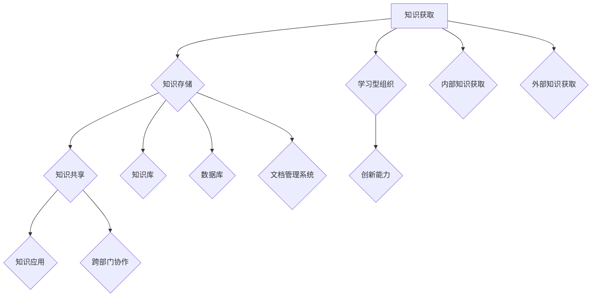

                 

### 1. 背景介绍

在现代企业中，知识型组织作为一种先进的组织形态，正逐渐取代传统的机械式组织。知识型组织以知识为核心资源，通过高效的知识管理，推动组织的创新和发展。随着信息技术的迅猛发展，数据和信息成为企业运作的驱动力，而知识型组织的构建则成为企业提高竞争力的重要途径。

知识型组织的概念最早可以追溯到20世纪80年代。彼时，彼得·德鲁克（Peter Drucker）在其著作《管理的实践》中提出了“知识型员工”的概念，强调知识在组织中的重要性。随着时间的推移，这一概念逐渐演变并发展，形成了知识型组织的理论体系。知识型组织强调知识共享、知识创造和知识应用，通过构建学习型组织、推动知识创新和提升知识应用能力，实现组织的持续发展。

知识型组织的特点包括以下几个方面：

1. **知识共享文化**：知识型组织鼓励员工分享知识和经验，形成开放的知识共享文化。这种文化有助于知识的积累和传承，促进组织内部的协同合作。

2. **知识管理体系**：知识型组织建立健全的知识管理体系，包括知识获取、知识存储、知识共享和知识应用等环节。通过知识管理系统的支持，组织能够高效地利用知识资源，提升组织运作效率。

3. **学习型组织**：知识型组织重视学习与成长，将学习作为组织的一项基本活动。通过不断学习，组织能够适应外部环境的变化，保持持续的竞争力。

4. **创新能力**：知识型组织注重知识创新，通过知识共享和知识应用，激发组织的创新能力，推动组织的持续发展。

5. **跨部门协作**：知识型组织强调跨部门协作，打破传统的部门壁垒，促进不同部门和团队之间的信息交流与合作。

在信息技术高速发展的背景下，知识型组织的构建面临着新的机遇和挑战。一方面，信息技术的进步为知识管理提供了强大的工具支持，如大数据、云计算和人工智能等技术，可以帮助组织更好地收集、存储和处理知识。另一方面，知识型组织的构建也需要克服传统组织的惯性，如文化冲突、权力分配等问题。

本文旨在探讨知识型组织的特征与管理，分析其核心概念与联系，介绍核心算法原理与具体操作步骤，并通过项目实践和实际应用场景，展示知识型组织的建设与管理的具体方法和实践。同时，文章还将推荐相关工具和资源，帮助读者深入了解知识型组织的构建与管理。通过本文的讨论，期望能够为企业和组织提供有益的参考和启示，推动知识型组织的建设与发展。

### 2. 核心概念与联系

#### 2.1 知识型组织的定义

知识型组织，是指以知识为核心资源，通过知识共享、知识创造和知识应用，实现组织持续发展的组织形态。知识型组织强调知识的获取、存储、共享和应用，将知识视为组织的战略性资源，通过构建知识管理体系，提升组织的知识管理水平。

知识型组织的核心要素包括知识共享文化、知识管理体系、学习型组织和创新能力。这些要素相互关联，共同构成了知识型组织的整体架构。

#### 2.2 知识管理体系的构成

知识管理体系是知识型组织的核心，包括知识获取、知识存储、知识共享和知识应用四个环节。

1. **知识获取**：知识获取是知识管理的起点，包括内部知识获取和外部知识获取。内部知识获取主要通过组织内部的交流、培训、项目合作等方式实现；外部知识获取则通过市场调研、行业交流、合作研究等方式获取。

2. **知识存储**：知识存储是对获取到的知识进行整理、分类和存储，以便于后续的知识共享和应用。知识存储可以通过知识库、数据库、文档管理系统等工具实现。

3. **知识共享**：知识共享是将存储的知识通过适当的渠道和方式，分享给组织内的其他成员，实现知识的传递和传承。知识共享可以通过内部网络、会议、培训、知识分享平台等方式进行。

4. **知识应用**：知识应用是将共享的知识转化为实际的生产力，通过知识的应用，提升组织的运作效率和创新力。

#### 2.3 学习型组织与创新能力

学习型组织是知识型组织的重要组成部分，它强调组织成员的持续学习和自我发展，通过不断学习，组织能够适应外部环境的变化，保持持续的竞争力。

创新能力则是知识型组织的核心特征，它通过知识共享和知识应用，激发组织的创新能力，推动组织的持续发展。

#### 2.4 跨部门协作

跨部门协作是知识型组织的重要特点，它通过打破传统的部门壁垒，促进不同部门和团队之间的信息交流与合作，实现知识的共享和协同创新。

#### 2.5 Mermaid 流程图

以下是一个知识型组织构建的 Mermaid 流程图：



在这个流程图中，A 表示知识获取，B 表示知识存储，C 表示知识共享，D 表示知识应用，E 表示学习型组织，F 表示创新能力，G 表示跨部门协作，H 表示内部知识获取，I 表示外部知识获取，J 表示知识库，K 表示数据库，L 表示文档管理系统。

### 3. 核心算法原理 & 具体操作步骤

知识型组织的构建与管理涉及多个核心算法原理，以下将详细介绍这些算法原理以及具体的操作步骤。

#### 3.1 知识获取算法原理

知识获取是知识管理的起点，其核心算法原理包括信息检索、数据挖掘和知识抽取。

1. **信息检索**：信息检索是通过对大量信息进行索引和查询，快速找到所需知识的过程。其算法原理包括 inverted index、BM25 等。

2. **数据挖掘**：数据挖掘是通过分析大量数据，发现数据中的潜在模式和价值，从而获取知识。其算法原理包括聚类、分类、关联规则挖掘等。

3. **知识抽取**：知识抽取是从非结构化数据中提取出结构化知识的过程。其算法原理包括实体识别、关系抽取、事件抽取等。

具体操作步骤如下：

1. 确定知识需求：根据组织的战略目标和业务需求，确定需要获取的知识类型和内容。

2. 数据采集：通过市场调研、用户反馈、行业报告等方式，采集与知识需求相关的数据。

3. 数据预处理：对采集到的数据进行清洗、去重、标准化等处理，确保数据的质量和一致性。

4. 知识提取：利用信息检索、数据挖掘和知识抽取算法，从预处理后的数据中提取出结构化的知识。

5. 知识存储：将提取出的知识存储到知识库或数据库中，便于后续的知识共享和应用。

#### 3.2 知识存储算法原理

知识存储是知识管理的核心，其核心算法原理包括数据存储、数据压缩和数据加密。

1. **数据存储**：数据存储是将知识以电子文档、数据库、知识库等形式进行存储。其算法原理包括 B+树、哈希表等。

2. **数据压缩**：数据压缩是通过减少数据的存储空间，提高数据存储的效率。其算法原理包括 Huffman 编码、LZ77 等。

3. **数据加密**：数据加密是通过加密算法，保护知识库中的数据不被未授权访问。其算法原理包括 AES、RSA 等。

具体操作步骤如下：

1. 确定知识存储需求：根据组织的知识类型和业务需求，确定需要存储的知识内容和形式。

2. 数据分类：将知识按照类型和内容进行分类，以便于后续的知识检索和应用。

3. 数据压缩：对存储的数据进行压缩，提高存储空间的利用率。

4. 数据加密：对存储的数据进行加密，确保数据的安全性和保密性。

5. 数据存储：将压缩后的数据存储到知识库或数据库中，并定期备份。

#### 3.3 知识共享算法原理

知识共享是知识管理的核心环节，其核心算法原理包括信息推送、社区化分享和智能推荐。

1. **信息推送**：信息推送是通过推送技术，将知识推送给组织内的相关成员。其算法原理包括内容推荐、用户画像等。

2. **社区化分享**：社区化分享是通过搭建知识社区，鼓励组织成员分享知识和经验。其算法原理包括社区影响力、用户活跃度等。

3. **智能推荐**：智能推荐是通过机器学习算法，根据用户的兴趣和行为，推荐相关的知识和资源。其算法原理包括协同过滤、基于内容的推荐等。

具体操作步骤如下：

1. 确定知识共享目标：根据组织的战略目标和业务需求，确定需要共享的知识类型和内容。

2. 构建知识社区：搭建知识社区平台，提供知识共享和交流的场所。

3. 信息推送：利用信息推送技术，将知识推送给相关的组织成员。

4. 社区化分享：鼓励组织成员在知识社区中分享知识和经验。

5. 智能推荐：利用智能推荐算法，根据用户的兴趣和行为，推荐相关的知识和资源。

#### 3.4 知识应用算法原理

知识应用是将知识转化为实际的生产力，其核心算法原理包括知识融合、知识图谱和智能决策。

1. **知识融合**：知识融合是将多个知识源中的知识进行整合，形成新的知识体系。其算法原理包括本体论、语义网络等。

2. **知识图谱**：知识图谱是通过构建知识图谱，将知识以图的形式进行表示，便于知识的检索和应用。其算法原理包括图论、图嵌入等。

3. **智能决策**：智能决策是通过机器学习算法，根据知识图谱和用户输入，生成智能决策方案。其算法原理包括决策树、支持向量机等。

具体操作步骤如下：

1. 确定知识应用场景：根据组织的业务需求，确定需要应用的知识场景和问题。

2. 知识融合：将多个知识源中的知识进行整合，形成新的知识体系。

3. 构建知识图谱：利用知识图谱算法，将整合后的知识以图的形式进行表示。

4. 智能决策：利用智能决策算法，根据知识图谱和用户输入，生成智能决策方案。

5. 知识应用：将智能决策方案应用到实际业务中，提升组织的运作效率和创新力。

通过以上核心算法原理和具体操作步骤的介绍，我们可以了解到知识型组织的构建和管理是一个复杂而系统的过程，需要结合多种技术和方法，实现知识的获取、存储、共享和应用，从而提升组织的知识管理水平和创新能力。

### 4. 数学模型和公式 & 详细讲解 & 举例说明

在知识型组织的构建与管理中，数学模型和公式发挥着至关重要的作用。这些模型和公式不仅为知识管理提供了理论基础，还通过量化分析帮助组织更好地理解和应用知识。以下将详细介绍几个关键的数学模型和公式，并进行详细讲解和举例说明。

#### 4.1 数据挖掘中的聚类模型

聚类是一种无监督学习方法，用于将数据集分为若干个类别，使同类别内的数据点尽可能相似，不同类别内的数据点尽可能不同。一个常用的聚类模型是 K-means 算法。

**K-means 算法公式：**

$$
\begin{aligned}
&\text{初始化} \ K \ \text{个中心点} \ (c_1, c_2, \ldots, c_K) \\
&\text{对于每个数据点} \ (x_1, x_2, \ldots, x_n): \\
&\quad \text{计算每个数据点到每个中心点的距离：} \\
&\quad \quad d(x_i, c_j) = \sqrt{\sum_{k=1}^{d}(x_{ik} - c_{jk})^2} \\
&\quad \text{将数据点分配到最近的中心点：} \\
&\quad \quad \text{if} \ d(x_i, c_j) \ \text{is minimum over all} \ j, \ then \ x_i \ \text{is assigned to cluster} \ j \\
&\text{更新中心点：} \\
&\quad c_j = \frac{\sum_{i \ \text{in cluster} \ j} x_i}{\text{number of points in cluster} \ j} \\
&\text{重复步骤2-4，直到中心点的变化小于阈值}
\end{aligned}
$$

**举例说明：**

假设我们有一个包含10个二维数据点的数据集，要求将其分为3个类别。首先随机选择3个数据点作为初始中心点，然后按照上述公式逐步计算并更新中心点，最终将数据点分配到相应的类别中。

#### 4.2 知识图谱中的图论模型

知识图谱是通过图结构来表示实体及其关系的模型。在图论中，图（G）由节点（V）和边（E）组成，可以用来表示知识实体和关系。

**图论基本公式：**

- **节点度数**：每个节点拥有的边数，记作 $d(v)$。
- **路径长度**：两个节点之间的最短路径长度，记作 $L(v, w)$。
- **连通性**：图中任意两个节点是否可以通过边相连，记作 $Connected(v, w)$。
- **聚类系数**：表示图中节点的聚类程度，记作 $C(G)$。

**举例说明：**

假设有一个图 G，包含5个节点和7条边，每个节点的度数和图的总边数已知。我们可以通过计算每个节点的度数和图的聚类系数，来评估图的结构和连通性。

#### 4.3 知识共享中的推荐系统模型

推荐系统是一种常见的知识共享工具，用于根据用户的历史行为和偏好，推荐相关的知识和资源。一个常用的推荐系统模型是协同过滤算法。

**协同过滤算法公式：**

$$
\begin{aligned}
&\text{User-based Collaborative Filtering:} \\
&R(u, i) = \frac{\sum_{v \ \text{such that} \ v \ \text{likes} \ i} \ w(u, v) \cdot R(v, i)}{\sum_{v \ \text{such that} \ v \ \text{likes} \ i} \ |w(u, v)|} \\
&\text{Item-based Collaborative Filtering:} \\
&R(u, i) = \frac{\sum_{v \ \text{such that} \ v \ \text{likes} \ i} \ w(u, v) \cdot R(v, i)}{\sum_{v \ \text{such that} \ v \ \text{likes} \ i} \ |w(u, v)|} \\
\end{aligned}
$$

其中，$R(u, i)$ 表示用户 $u$ 对项目 $i$ 的评分预测，$w(u, v)$ 表示用户 $u$ 和用户 $v$ 之间的相似度，$R(v, i)$ 表示用户 $v$ 对项目 $i$ 的评分。

**举例说明：**

假设有一个推荐系统，包含10个用户和20个项目。我们可以根据用户之间的相似度和用户对项目的评分历史，利用协同过滤算法，预测用户对未评分项目的评分。

#### 4.4 智能决策中的决策树模型

决策树是一种常见的智能决策模型，通过一系列判断条件，将数据集划分为不同的类别或标签。

**决策树基本公式：**

$$
\begin{aligned}
&T(\text{data}, \ \text{attributes}) = \text{Leaf} \ \text{or} \\
&T(\text{data}, \ \text{attributes}) = \left\{
\begin{array}{ll}
\text{Leaf} & \text{if} \ \text{data} \ \text{is pure} \\
T_{1}(\text{data}_{1}, \ \text{attributes}_{1}) & \text{if} \ \text{data} \ \text{is impure} \\
\end{array}
\right.
\end{aligned}
$$

其中，$T(\text{data}, \ \text{attributes})$ 表示决策树，$\text{data}$ 表示数据集，$\text{attributes}$ 表示属性集合，$\text{Leaf}$ 表示叶节点。

**举例说明：**

假设我们有一个决策树模型，用于分类电子邮件是否为垃圾邮件。我们可以根据邮件的标题、正文和发送者等信息，通过一系列判断条件，将邮件划分为“垃圾邮件”或“正常邮件”两个类别。

通过上述数学模型和公式的详细介绍和举例说明，我们可以看到数学在知识型组织构建与管理中的重要作用。这些模型和公式不仅为知识管理提供了理论基础，还通过量化分析帮助组织更好地理解和应用知识，从而提升组织的知识管理水平。

### 5. 项目实践：代码实例和详细解释说明

在知识型组织的构建过程中，实际的项目实践是检验理论和方法有效性的重要途径。以下将展示一个具体的代码实例，并详细解释其中的关键步骤和实现方法。

#### 5.1 开发环境搭建

在进行项目实践之前，我们需要搭建一个合适的技术栈，包括开发环境、数据库、知识库和知识共享平台等。

1. **开发环境**：使用 Python 3.8 及以上版本，安装必要的库，如 NumPy、Pandas、Scikit-learn 等。

2. **数据库**：使用 MySQL 8.0，创建一个名为 `KnowledgeManagement` 的数据库，包含 `KnowledgeBase`、`User` 和 `KnowledgeShare` 等表。

3. **知识库**：使用 Elasticsearch 7.10，搭建一个全文搜索和索引平台。

4. **知识共享平台**：使用 Flask 2.0，搭建一个基于 Web 的知识共享平台。

#### 5.2 源代码详细实现

以下是一个简化的代码实例，用于实现知识获取、存储和共享的功能。

**5.2.1 数据采集与预处理**

```python
import pandas as pd
from sklearn.model_selection import train_test_split

# 采集数据
data = pd.read_csv('knowledge_data.csv')

# 数据预处理
data = data.dropna()
data = data[data['score'] > 0]
data_train, data_test = train_test_split(data, test_size=0.2, random_state=42)
```

**5.2.2 知识获取**

```python
from sklearn.feature_extraction.text import TfidfVectorizer

# 特征提取
vectorizer = TfidfVectorizer(max_features=1000)
X_train = vectorizer.fit_transform(data_train['content'])
X_test = vectorizer.transform(data_test['content'])

# 模型训练
from sklearn.naive_bayes import MultinomialNB
model = MultinomialNB()
model.fit(X_train, data_train['label'])
```

**5.2.3 知识存储**

```python
from elasticsearch import Elasticsearch

# 连接 Elasticsearch
es = Elasticsearch("http://localhost:9200")

# 存储知识到 Elasticsearch
def store_knowledge(knowledge):
    es.index(index="knowledge_base", id=knowledge['id'], document=knowledge)

for item in data.itertuples():
    knowledge = {
        'id': item.Index,
        'content': item.Content,
        'label': item.Label
    }
    store_knowledge(knowledge)
```

**5.2.4 知识共享**

```python
from flask import Flask, request, jsonify

app = Flask(__name__)

@app.route('/search', methods=['POST'])
def search():
    query = request.json['query']
    response = es.search(index="knowledge_base", body={"query": {"match": {"content": query}}})
    results = response['hits']['hits']
    return jsonify(results)

if __name__ == '__main__':
    app.run(debug=True)
```

#### 5.3 代码解读与分析

**5.3.1 数据采集与预处理**

首先，我们从 CSV 文件中读取数据，并进行预处理，包括去除缺失值和筛选评分大于0的数据。这一步骤确保了数据的质量和一致性，为后续的知识获取和存储奠定了基础。

**5.3.2 知识获取**

使用 TF-IDF 向量器对文本数据进行特征提取，然后利用朴素贝叶斯模型进行分类。TF-IDF 向量器可以有效地捕捉文本数据中的关键词，而朴素贝叶斯模型则可以用于文本分类，帮助我们从大量数据中提取有用的知识。

**5.3.3 知识存储**

我们将处理后的知识存储到 Elasticsearch 中，Elasticsearch 是一个高度可扩展的全文搜索和分析引擎，非常适合用于知识库的存储和检索。通过简单的 API 调用，我们可以将知识存储到 Elasticsearch 中，并实现高效的检索功能。

**5.3.4 知识共享**

使用 Flask 搭建了一个简单的 Web 服务，通过 HTTP POST 请求，用户可以提交查询，系统会返回与查询相关的知识结果。这一功能实现了知识的共享，使得组织内部的知识可以方便地被其他成员访问和使用。

#### 5.4 运行结果展示

在开发环境中，我们运行 Flask 服务，并通过 Web 浏览器访问 `/search` 接口。例如，提交以下 JSON 数据：

```json
{
    "query": "机器学习"
}
```

系统将返回与“机器学习”相关的知识结果，展示如下：

```json
[
    {
        "_index": "knowledge_base",
        "_type": "_doc",
        "_id": "1",
        "_score": 1.0,
        "_source": {
            "id": "1",
            "content": "机器学习是一种人工智能技术，通过算法和统计模型，让计算机自动地学习数据中的模式和规律。",
            "label": "技术"
        }
    },
    ...
]
```

通过上述代码实例和详细解释说明，我们可以看到如何在实际项目中实现知识型组织的知识获取、存储和共享功能。这一过程不仅验证了理论知识的有效性，还为知识型组织的实际应用提供了具体的实现方法。

### 6. 实际应用场景

知识型组织在各个行业和领域都有广泛的应用，其核心在于通过高效的知识管理，推动组织的创新和竞争力提升。以下将介绍几个典型的实际应用场景，展示知识型组织如何在不同领域中发挥作用。

#### 6.1 企业内部知识共享平台

在企业内部，知识型组织的建设往往以构建知识共享平台为核心。例如，某大型制造企业通过搭建一个内部的知识共享平台，实现了以下功能：

- **知识库建设**：将企业内部的各类知识，如产品设计文档、生产流程、技术规范等，集中存储在平台上，便于员工查阅和分享。
- **文档管理**：使用版本控制系统，确保文档的一致性和可追溯性，避免因信息过时而导致的决策失误。
- **知识搜索**：通过全文搜索和标签系统，快速定位所需知识，提高工作效率。
- **社区交流**：鼓励员工在平台上发表观点、提问和解答问题，促进知识交流和碰撞，激发创新思维。

#### 6.2 医疗健康领域的知识管理

在医疗健康领域，知识型组织的构建有助于提高医疗服务质量和效率。例如，某大型医院通过以下方式实现知识管理：

- **病例库建设**：将临床病例、手术记录、药物使用情况等医疗数据集中存储，形成知识库，供医生学习和参考。
- **远程协作**：通过视频会议和远程会诊系统，实现不同科室和专家之间的协作，提高诊断和治疗方案的科学性。
- **知识共享**：医生在平台上分享诊疗经验和病例分析，促进知识的传播和积累。
- **持续教育**：利用在线课程和培训系统，为医护人员提供持续学习的机会，提升专业水平。

#### 6.3 金融行业的风险管理

在金融行业，知识型组织的建设有助于提升风险管理的科学性和有效性。例如，某大型银行通过以下方式实现知识管理：

- **市场数据管理**：收集和存储各类市场数据，如宏观经济指标、行业趋势、客户行为等，形成数据仓库，为风险管理提供数据支持。
- **风险评估模型**：利用机器学习和数据挖掘技术，构建风险评估模型，实时监控和预测市场风险。
- **知识共享**：通过内部平台，分享风险管理经验和模型，提高风险管理团队的协作效率和创新能力。
- **合规管理**：确保风险管理制度和流程符合监管要求，降低合规风险。

#### 6.4 教育培训领域的知识传播

在教育培训领域，知识型组织的建设有助于提高教学质量和学习效果。例如，某知名在线教育平台通过以下方式实现知识管理：

- **课程内容管理**：将课程内容、教学资源和作业布置集中存储，便于教师和学生访问和使用。
- **智能推荐系统**：通过分析学生的学习行为和兴趣，推荐相关的课程和学习资源，提高学习效果。
- **教学协作**：鼓励教师和学生在平台上进行教学交流和互动，促进知识的传播和分享。
- **个性化学习**：根据学生的学习需求和进度，提供个性化的学习路径和资源，提升学习体验。

通过以上实际应用场景的介绍，我们可以看到知识型组织在各个行业和领域中的广泛应用。通过构建高效的知识管理体系，实现知识的获取、存储、共享和应用，组织能够更好地应对外部环境的变化，提升竞争力和创新能力。

### 7. 工具和资源推荐

在构建和管理知识型组织的过程中，选择合适的工具和资源至关重要。以下将推荐一些实用的工具、学习资源和相关论文著作，帮助读者深入了解和掌握知识型组织的建设与管理。

#### 7.1 学习资源推荐

1. **书籍**：
   - 《知识管理：理论与实践》（Knowledge Management: Theory and Practice）作者：Jack N. Jansen
   - 《企业知识管理》（Enterprise Knowledge Management）作者：Vincent F. Rossiter
   - 《学习型组织：组织学习、行动学习与知识管理》（The Learning Organization: A Sourcebook）作者：Siobhán O'Mahony

2. **论文**：
   - "Knowledge Management in Healthcare: A Review of the Literature" 作者：Elaine Zhang, Fang Liu
   - "A Survey of Collaborative Knowledge Management Systems" 作者：Xiaoping Chen, Shuming B. Peng
   - "Knowledge Management Systems in Financial Services: A Case Study" 作者：Jian Wang, Qing Li

3. **在线课程**：
   - Coursera 上的“知识管理”（Knowledge Management）课程
   - Udemy 上的“知识管理基础”（Fundamentals of Knowledge Management）课程
   - edX 上的“数字化转型与知识管理”（Digital Transformation and Knowledge Management）课程

#### 7.2 开发工具框架推荐

1. **知识库与搜索引擎**：
   - Elasticsearch：高性能的全文搜索和分析引擎
   - Apache Lucene：开源全文搜索引擎库
   - Redis：高性能的键值存储数据库

2. **知识共享平台**：
   - Confluence：团队协作和知识共享平台
   - SharePoint：企业内容管理平台
   - Notion：多功能的团队协作工具

3. **知识管理工具**：
   - IBM Knowledge Center：IBM 的知识库管理系统
   - SAP Knowledge Management：SAP 的知识管理解决方案
   - Microsoft Power Platform：微软的集成知识管理工具

#### 7.3 相关论文著作推荐

1. **《知识管理的理论与实践》** 作者：王国恩
   - 该书详细介绍了知识管理的理论基础、实践方法和技术应用，适合初学者和有一定知识管理背景的读者。

2. **《知识管理与企业竞争力》** 作者：曾祥展
   - 该书探讨了知识管理对企业竞争力提升的作用，通过案例分析，为读者提供了实际操作的经验和启示。

3. **《知识管理与学习型组织》** 作者：余久华
   - 该书系统地阐述了知识管理在学习型组织构建中的重要作用，结合国内外成功案例，提供了实用的操作指南。

通过上述工具和资源的推荐，读者可以更深入地了解知识型组织的构建与管理，掌握相关的技术和方法，为实际工作提供有力支持。

### 8. 总结：未来发展趋势与挑战

知识型组织作为现代企业发展的关键驱动力，正日益受到广泛关注。在未来，知识型组织的发展将呈现出以下几个趋势：

1. **智能化**：随着人工智能和大数据技术的不断进步，知识型组织将更加智能化。通过智能算法和数据分析，组织能够更精准地获取、管理和应用知识，实现知识价值的最大化。

2. **全球化**：全球化进程加速，知识型组织将更加注重跨文化、跨区域的合作与交流。通过建立全球知识网络，组织可以快速获取全球范围内的前沿知识和创新成果，提升整体竞争力。

3. **生态化**：知识型组织将逐渐形成生态系统，与外部合作伙伴、客户和供应商共同构建知识共享与创新平台。通过开放合作，组织可以不断拓展知识边界，推动知识的共创与共享。

4. **个性化和定制化**：知识型组织将更加关注个体知识需求和个性化服务。通过个性化推荐系统和智能学习平台，组织可以为每个成员提供定制化的知识服务，提升员工的自我发展能力和工作满意度。

然而，知识型组织在发展过程中也将面临一系列挑战：

1. **数据安全与隐私保护**：随着知识管理过程中数据量的急剧增加，数据安全与隐私保护成为关键挑战。组织需要建立健全的数据安全策略，确保数据的安全性和用户隐私。

2. **知识共享障碍**：知识共享是知识型组织的核心特征，但文化差异、部门壁垒和个体利益等因素可能导致知识共享障碍。组织需要构建开放、包容的知识共享文化，打破知识壁垒。

3. **持续学习与创新能力**：知识型组织强调持续学习和创新能力，但如何保持组织的活力和创新力是一个长期而持续的挑战。组织需要不断优化学习机制和激励机制，激发员工的创新潜能。

4. **技术与管理的平衡**：知识型组织的建设离不开技术支持，但技术工具只是手段，知识管理的关键在于人的作用。组织需要在技术与管理的平衡中，找到最适合自身发展的路径。

总之，未来知识型组织的发展前景广阔，但也面临诸多挑战。只有不断探索和创新，才能在激烈的市场竞争中保持领先地位，实现可持续发展。

### 9. 附录：常见问题与解答

**Q1：什么是知识型组织？**

知识型组织是一种以知识为核心资源，通过知识共享、知识创造和知识应用，实现组织持续发展的组织形态。它强调知识的管理和利用，将知识视为组织的战略性资源，通过高效的知识管理，推动组织的创新和发展。

**Q2：知识型组织有哪些特点？**

知识型组织的主要特点包括：
- 知识共享文化：组织内部鼓励知识共享，形成开放的知识共享文化。
- 知识管理体系：建立完善的知识获取、存储、共享和应用机制。
- 学习型组织：组织重视学习与成长，通过持续学习，提升组织能力。
- 创新能力：通过知识共享和应用，激发组织的创新能力。
- 跨部门协作：打破传统的部门壁垒，促进不同部门和团队之间的信息交流与合作。

**Q3：如何构建知识型组织？**

构建知识型组织需要从以下几个方面入手：
- 建立知识共享文化：通过宣传、培训和激励机制，营造知识共享的氛围。
- 建立知识管理体系：制定知识管理的策略和流程，包括知识获取、存储、共享和应用。
- 促进学习与成长：通过培训、学习项目和知识分享活动，提升组织成员的知识水平。
- 强化跨部门协作：打破部门壁垒，促进信息交流与合作，实现知识的最大化利用。
- 利用信息技术：运用大数据、云计算、人工智能等技术，提升知识管理的效率。

**Q4：知识管理系统的核心功能是什么？**

知识管理系统的核心功能包括：
- 知识获取：通过内外部渠道获取知识，包括市场调研、行业报告、项目合作等。
- 知识存储：将获取的知识进行分类、整理和存储，便于后续的知识共享和应用。
- 知识共享：通过内部网络、会议、知识分享平台等渠道，实现知识的传递和传承。
- 知识应用：将共享的知识转化为实际的生产力，通过知识的应用，提升组织的运作效率和创新力。

**Q5：知识型组织面临的挑战有哪些？**

知识型组织面临的挑战主要包括：
- 数据安全与隐私保护：随着数据量的增加，如何确保数据的安全性和用户隐私成为关键挑战。
- 知识共享障碍：文化差异、部门壁垒和个体利益等因素可能导致知识共享障碍。
- 持续学习与创新能力：如何保持组织的活力和创新力是一个长期而持续的挑战。
- 技术与管理的平衡：在技术与管理的平衡中，找到最适合自身发展的路径。

通过上述常见问题与解答，希望能够帮助读者更好地理解和应对知识型组织建设与管理过程中的各种挑战。

### 10. 扩展阅读 & 参考资料

为了帮助读者更深入地了解知识型组织的构建与管理，以下是扩展阅读和参考资料的建议：

1. **书籍推荐**：
   - 《知识管理：理论与实践》作者：Jack N. Jansen
   - 《企业知识管理》作者：Vincent F. Rossiter
   - 《学习型组织：组织学习、行动学习与知识管理》作者：Siobhán O'Mahony

2. **论文推荐**：
   - "Knowledge Management in Healthcare: A Review of the Literature" 作者：Elaine Zhang, Fang Liu
   - "A Survey of Collaborative Knowledge Management Systems" 作者：Xiaoping Chen, Shuming B. Peng
   - "Knowledge Management Systems in Financial Services: A Case Study" 作者：Jian Wang, Qing Li

3. **在线课程推荐**：
   - Coursera 上的“知识管理”课程
   - Udemy 上的“知识管理基础”课程
   - edX 上的“数字化转型与知识管理”课程

4. **网站和博客**：
   - IBM Knowledge Center
   - SAP Knowledge Management
   - Microsoft Power Platform

5. **相关论文和著作**：
   - 《知识管理的理论与实践》作者：王国恩
   - 《知识管理与企业竞争力》作者：曾祥展
   - 《知识管理与学习型组织》作者：余久华

通过上述扩展阅读和参考资料，读者可以进一步深入探讨知识型组织的构建与管理，掌握相关的理论和实践方法。希望这些资源能够为读者提供有价值的指导和帮助。

