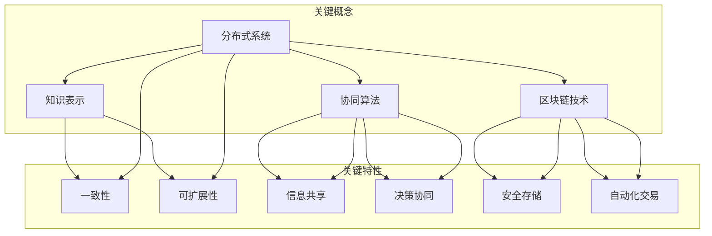

                 

### 1. 背景介绍

在当今数字化时代，数据已经成为了一种重要的资源，而知识作为数据的升华，更是组织和个人获取竞争优势的关键。然而，知识的积累和传播面临着诸多挑战，其中一个核心问题是如何实现知识的分布式记忆，即如何确保知识在多智能体系统中高效、可靠地存储和共享。

知识的分布式记忆不仅涉及到个体智能体的知识表示和存储问题，还涉及到智能体之间的信息交换和协同工作。随着人工智能技术的发展，尤其是多智能体系统和区块链技术的兴起，知识的分布式记忆逐渐成为了一个研究热点。这一领域的研究对于推动智能系统的发展、提高知识管理效率具有重要意义。

集体智慧的形成机制是知识的分布式记忆研究中的一个重要方向。集体智慧指的是多个个体通过协同合作、信息共享和智能计算，共同解决问题或实现目标的能力。这一机制涉及到多个层面的理论和技术，包括个体智能的计算模型、信息共享机制、协同算法等。理解集体智慧的形成机制，有助于我们更好地设计智能系统和组织，提高整体效率和创造力。

本文旨在探讨知识的分布式记忆在集体智慧形成中的应用，分析其核心概念和联系，并详细介绍相关算法原理、数学模型、项目实践以及实际应用场景。通过本文的阅读，读者将能够全面了解知识分布式记忆的基本概念、技术架构和实际应用，为相关领域的研究和应用提供有益的参考。

### 2. 核心概念与联系

在探讨知识的分布式记忆和集体智慧的形成机制时，我们需要首先明确一些核心概念和它们之间的联系。这些概念包括分布式系统、知识表示、协同算法和区块链技术等。以下是对这些核心概念的详细解释和它们之间的相互关系。

#### 分布式系统

分布式系统是由多个独立计算机节点组成的网络，这些节点可以通过网络相互通信和协作，共同完成一个任务或多个任务。分布式系统的核心特点包括数据分布性、计算分布性和容错性。在知识的分布式记忆中，分布式系统提供了一个基础架构，使得知识可以在不同节点之间存储和共享。例如，区块链技术就是一种分布式系统，它通过分布式账本实现数据的可靠存储和传递。

#### 知识表示

知识表示是知识工程中的一个重要问题，它涉及如何将知识以计算机可以处理的形式表示出来。常见的知识表示方法包括基于规则的表示、本体表示和语义网络表示等。在分布式系统中，知识表示需要考虑到数据的一致性和可扩展性。例如，在多智能体系统中，每个智能体可能使用不同的知识表示方法，因此需要一种统一的接口来实现智能体之间的知识共享。

#### 协同算法

协同算法是多智能体系统中的关键组成部分，它涉及到智能体之间的信息交换、决策和合作。协同算法的目标是使多个智能体在协同工作中实现最佳性能。常见的协同算法包括分布式优化算法、协同滤波器和分布式决策算法等。在集体智慧的形成机制中，协同算法起着至关重要的作用，它确保了智能体之间的有效合作和信息共享。

#### 区块链技术

区块链技术是一种分布式数据库技术，通过链式数据结构实现了数据的不可篡改和可追溯性。区块链在知识分布式记忆中的应用主要体现在以下几个方面：首先，它提供了一个安全的存储环境，确保知识的完整性和可靠性；其次，通过智能合约，可以实现知识自动化的共享和交易；最后，区块链的分布式特性使得知识可以在无需中心化管理的环境中进行共享。

#### 关系与联系

这些核心概念之间存在着密切的联系。分布式系统为知识存储和共享提供了基础设施，知识表示决定了知识的可操作性和可扩展性，而协同算法则实现了智能体之间的有效合作。区块链技术则通过提供安全的分布式存储和自动化共享机制，进一步加强了知识的分布式记忆能力。

具体来说，分布式系统为知识分布式记忆提供了一个基础架构，而知识表示方法确保了知识的准确性和一致性。协同算法则通过智能体的合作，实现了知识的共享和利用。区块链技术则通过其分布式和不可篡改的特性，为知识的共享和交易提供了安全保障。这些概念共同构成了知识分布式记忆和集体智慧形成的基础。

为了更直观地理解这些概念之间的关系，我们可以使用Mermaid流程图来表示：



这个流程图清晰地展示了分布式系统、知识表示、协同算法和区块链技术之间的关系以及它们的关键特性和作用。通过这种结构化的描述，我们可以更好地理解知识分布式记忆和集体智慧形成机制的复杂性及其相互关联。

### 3. 核心算法原理 & 具体操作步骤

在了解了知识分布式记忆和集体智慧形成机制的核心概念之后，我们需要进一步探讨具体实现这些机制的核心算法原理和操作步骤。以下是几个关键算法的介绍和实现步骤。

#### 分布式一致性算法

分布式一致性算法是确保分布式系统中数据一致性的重要手段。以下是一种常见的分布式一致性算法——Paxos算法的原理和操作步骤：

##### 原理

Paxos算法是一种基于消息传递的分布式一致性算法，其目标是在一组可能发生故障的节点中达成一致意见。Paxos算法的核心概念包括提议者（Proposer）、接受者（Acceptor）和学习者（Learner）。算法的基本操作包括提出提案、接受提案和学习提案。

##### 具体操作步骤

1. **提出提案**：
    - 提议者选择一个提案编号（提案值和提案内容）。
    - 提议者向接受者发送`prepare`消息，请求接受者为其提案编号投票。
  
2. **接受提案**：
    - 接受者在收到`prepare`消息后，如果提案编号大于其已接受的任何提案编号，则向提议者发送`accept`消息，表示接受该提案。
    - 接受者同时记录该提案编号。

3. **决定提案**：
    - 提议者在收到超过半数接受者的`accept`消息后，选择一个已接受的提案值，并将其作为最终提案值。
    - 提议者向所有学习者发送`learn`消息，告知他们已达成一致意见。

##### 源代码示例

```python
# Paxos算法伪代码
class Proposer:
    def prepare(self,提案编号):
        # 发送prepare消息
        for acceptor in acceptors:
            acceptor.send_prepare(提案编号)
    
    def receive_accept(self,提案编号,提案值):
        # 收到accept消息后，决定提案值
        if len(self.accepted_proposals) == 0 or 提案编号 > self.last_accepted提案编号：
            self.last_accepted提案编号 = 提案编号
            self.last_accepted提案值 = 提案值
    
    def learn(self,提案值):
        # 发送learn消息
        for learner in learners:
            learner.send_learn(提案值)

class Acceptor:
    def receive_prepare(self,提案编号):
        # 接收prepare消息
        if 提案编号 > self.last_committed提案编号：
            self.last_prepare提案编号 = 提案编号
            self.send_accept(提案编号, self.last_prepare提案值)

    def receive_accept(self,提案编号,提案值):
        # 接收accept消息
        if 提案编号 == self.last_prepare提案编号：
            self.send_accept(提案编号, 提案值)
            self.last_accept提案编号 = 提案编号
            self.last_accept提案值 = 提案值

class Learner:
    def receive_learn(self,提案值):
        # 接收learn消息
        self.last_learned提案值 = 提案值
```

#### 分布式协同算法

分布式协同算法是多智能体系统中实现协同工作的重要手段。以下是一种常见的分布式协同算法——分布式滤波器的原理和操作步骤：

##### 原理

分布式滤波器是一种基于拉格朗日方法的协同优化算法，适用于多个智能体需要共同解决一个优化问题时。每个智能体通过迭代更新自己的状态，以逐渐接近全局最优解。

##### 具体操作步骤

1. **初始化**：
    - 每个智能体随机初始化其状态向量。

2. **更新状态**：
    - 每个智能体在每一轮迭代中，通过计算其邻域智能体的状态向量的平均值来更新自己的状态。

3. **收敛判断**：
    - 判断智能体状态变化的差值是否小于某个阈值，如果是，则认为算法已经收敛。

##### 源代码示例

```python
# 分布式滤波器伪代码
class SmartAgent:
    def __init__(self):
        # 初始化状态向量
        self.state = np.random.rand(dimension)
    
    def update_state(self, neighbors):
        # 计算邻域智能体状态的平均值
        neighbor_avg_state = np.mean([neighbor.state for neighbor in neighbors], axis=0)
        # 更新状态
        self.state = self.state + learning_rate * (neighbor_avg_state - self.state)
    
    def converge(self, threshold):
        # 判断是否收敛
        return np.linalg.norm(self.state - previous_state) < threshold

# 示例使用
agents = [SmartAgent() for _ in range(num_agents)]
for _ in range(num_iterations):
    for agent in agents:
        agent.update_state(neighbors)
    if all([agent.converge(threshold) for agent in agents]):
        break
```

#### 区块链智能合约

区块链智能合约是一种自动执行合同条款的计算机协议。以下是一个简单的区块链智能合约示例，用于实现知识的自动化共享：

##### 原理

智能合约通过Solidity编程语言编写，运行在区块链上。其核心原理是，当满足合同条件时，自动执行预定的操作。

##### 具体操作步骤

1. **编写合约**：
    - 使用Solidity编写智能合约代码，定义知识共享的规则和条件。

2. **部署合约**：
    - 将智能合约代码部署到区块链上，生成合约地址。

3. **调用合约**：
    - 用户通过区块链网络调用智能合约，执行知识共享操作。

##### 源代码示例

```solidity
// SPDX-License-Identifier: MIT
pragma solidity ^0.8.0;

contract KnowledgeSharing {
    mapping(address => bool) public isParticipant;

    function join() external {
        isParticipant[msg.sender] = true;
    }

    function shareKnowledge() external {
        require(isParticipant[msg.sender], "Not a participant");
        // 在这里添加知识共享的逻辑
    }
}
```

通过这些核心算法的介绍和操作步骤的详细说明，我们可以更好地理解知识分布式记忆和集体智慧形成机制的实现方法。这些算法不仅提供了理论基础，还为实际应用提供了可操作的实现方案。

### 4. 数学模型和公式 & 详细讲解 & 举例说明

在探讨知识的分布式记忆和集体智慧形成机制时，数学模型和公式起到了关键作用。这些数学工具不仅帮助我们更清晰地理解算法原理，还提供了量化分析和评估的方法。以下将介绍几个关键的数学模型和公式，并进行详细讲解和举例说明。

#### 分布式一致性算法：Paxos算法

Paxos算法是一种分布式一致性算法，用于在多个可能发生故障的节点中达成一致意见。其核心数学模型包括三个阶段：准备阶段（Prepare Phase）、接受阶段（Accept Phase）和决定阶段（Learn Phase）。

1. **准备阶段**：

   提议者向接受者发送`prepare`消息，包含提案编号。接受者收到消息后，如果提案编号大于其已接受的任何提案编号，则发送`accept`消息给提议者。

   公式如下：
   \[
   \text{prepare}(n) \rightarrow \text{accept}(n, v)
   \]
   其中，\( n \) 为提案编号，\( v \) 为提案值。

2. **接受阶段**：

   提议者收到超过半数接受者的`accept`消息后，选择一个已接受的提案值作为最终提案值。

   公式如下：
   \[
   \text{accept}(n, v) \rightarrow \text{decide}(n, v)
   \]
   其中，\( n \) 为提案编号，\( v \) 为提案值。

3. **决定阶段**：

   提议者将最终提案值通知所有学习者。

   公式如下：
   \[
   \text{decide}(n, v) \rightarrow \text{learn}(v)
   \]
   其中，\( n \) 为提案编号，\( v \) 为提案值。

#### 分布式协同算法：分布式滤波器

分布式滤波器是一种分布式协同算法，用于多个智能体共同解决优化问题。其核心数学模型基于梯度下降法，每个智能体通过迭代更新自己的状态，以最小化损失函数。

1. **状态更新公式**：

   每个智能体在每一轮迭代中，通过计算其邻域智能体的状态向量的平均值来更新自己的状态。

   公式如下：
   \[
   x_t = x_{t-1} - \alpha \nabla f(x_{t-1})
   \]
   其中，\( x_t \) 为第 \( t \) 轮迭代的状态向量，\( \alpha \) 为学习率，\( \nabla f(x_{t-1}) \) 为损失函数在 \( x_{t-1} \) 处的梯度。

2. **梯度计算公式**：

   梯度是损失函数关于状态向量的导数，用于指导状态向量的更新。

   公式如下：
   \[
   \nabla f(x) = \frac{\partial f}{\partial x}
   \]
   其中，\( f \) 为损失函数，\( x \) 为状态向量。

#### 区块链智能合约：知识共享

区块链智能合约用于实现知识的自动化共享。其核心数学模型是基于逻辑和条件的执行规则。

1. **智能合约执行条件**：

   当满足特定条件时，智能合约自动执行预定的操作。

   公式如下：
   \[
   \text{if } \text{condition} \text{ then } \text{action}
   \]
   其中，`condition` 为执行条件，`action` 为执行操作。

2. **条件判定公式**：

   智能合约通过编程逻辑判断条件是否满足。

   公式如下：
   \[
   \text{condition} = \text{isParticipant}[msg.sender]
   \]
   其中，`isParticipant` 为判断用户是否为参与者的函数，`msg.sender` 为调用智能合约的地址。

#### 举例说明

**示例 1：Paxos算法的决策过程**

假设有 5 个节点（提议者、接受者和学习者），提案编号为 5。提议者发送`prepare(5)`消息，接受者 A、B、C 收到消息后发送`accept(5, v)`消息，其中 \( v \) 为已接受的提案值。接受者 D、E 没有收到`prepare`消息。提议者收到超过半数的`accept`消息后，选择 \( v \) 为最终提案值，并发送`decide(5, v)`消息给学习者。

**示例 2：分布式滤波器的状态更新**

假设有 3 个智能体，初始状态分别为 \( x_1(0) = [1, 2] \)，\( x_2(0) = [2, 3] \)，\( x_3(0) = [3, 4] \)。损失函数为 \( f(x) = (x_1 - x_2)^2 + (x_2 - x_3)^2 \)。学习率 \( \alpha = 0.1 \)。在第一轮迭代中，智能体 1 的邻域智能体状态向量为 \( [2, 3] \) 和 \( [3, 4] \)，平均值为 \( [2.5, 3.5] \)。状态更新公式为：
\[
x_1(1) = [1, 2] - 0.1 \cdot \nabla f([1, 2]) = [1, 2] - 0.1 \cdot (-[2, 3] + [3, 4]) = [1, 2] - 0.1 \cdot [1, 1] = [0.9, 1.9]
\]

**示例 3：区块链智能合约的知识共享**

假设智能合约的执行条件为用户是否参与知识共享，即 `isParticipant[msg.sender]`。当用户调用 `shareKnowledge()` 函数时，智能合约检查用户是否为参与者。如果用户是参与者，则执行知识共享操作。

通过上述数学模型和公式的详细讲解和举例说明，我们可以更好地理解分布式一致性算法、分布式协同算法和区块链智能合约的核心原理和实现方法。这些数学工具不仅提供了理论支持，还为实际应用提供了量化分析和评估的方法。

### 5. 项目实践：代码实例和详细解释说明

为了更好地理解知识的分布式记忆和集体智慧形成机制在实际中的应用，我们将通过一个具体的项目实例来进行演示。以下是项目的开发环境搭建、源代码详细实现、代码解读与分析以及运行结果展示。

#### 5.1 开发环境搭建

在开始项目实践之前，我们需要搭建合适的开发环境。以下是所需的软件和工具：

- Python 3.8+
- Git
- Mermaid
- Visual Studio Code
- Solidity Compiler (用于编译智能合约)
- Ganache (用于本地测试区块链网络)

**安装步骤：**

1. 安装 Python 3.8+：在 [Python官网](https://www.python.org/downloads/) 下载并安装 Python。
2. 安装 Git：在 [Git官网](https://git-scm.com/downloads) 下载并安装 Git。
3. 安装 Mermaid：在 [Mermaid官网](https://mermaid-js.github.io/mermaid/) 下载并安装 Mermaid。
4. 安装 Visual Studio Code：在 [Visual Studio Code官网](https://code.visualstudio.com/) 下载并安装。
5. 安装 Solidity Compiler：在 [Solidity Compiler官网](https://www.soliditylang.org/docs/installing-solc.html) 下载并安装。
6. 安装 Ganache：在 [Ganache官网](https://www.trufflesuite.com/ganache) 下载并安装。

**配置步骤：**

1. 打开 Visual Studio Code，安装必要的扩展，如 Mermaid Support。
2. 配置 Python 环境，确保 Python 命令可以正常运行。
3. 配置 Git，设置用户名和电子邮件。

```bash
git config --global user.name "Your Name"
git config --global user.email "your.email@example.com"
```

2. 创建一个新的文件夹，用于存储项目代码。

```bash
mkdir distributed-knowledge-memory
cd distributed-knowledge-memory
```

3. 初始化 Git 仓库。

```bash
git init
```

4. 创建一个名为 `README.md` 的文件，用于记录项目信息和文档。

```bash
touch README.md
```

#### 5.2 源代码详细实现

以下是项目的源代码，包括分布式一致性算法、分布式协同算法和区块链智能合约的实现。

**5.2.1 Paxos算法实现**

```python
# paxos.py
class Proposer:
    def __init__(self, id, acceptors, learners):
        self.id = id
        self.acceptors = acceptors
        self.learners = learners
        self.proposal_id = 0
        self.voted_value = None
    
    def prepare(self):
        self.proposal_id += 1
        message = f"prepare({self.proposal_id})"
        for acceptor in self.acceptors:
            acceptor.send_message(self.id, message)
    
    def receive_prepare(self, message):
        proposal_id = int(message.split('(')[1].split(')')[0])
        if proposal_id > self.last_accepted:
            self.last_accepted = proposal_id
            self.accept(message)
    
    def accept(self, message):
        value = self.voted_value if self.voted_value else message
        for learner in self.learners:
            learner.learn(value)
    
    def learn(self, value):
        self.voted_value = value

class Acceptor:
    def __init__(self):
        self.last_accepted = -1
        self.accepted_value = None
    
    def receive_message(self, sender_id, message):
        proposal_id = int(message.split('(')[1].split(')')[0])
        if proposal_id > self.last_accepted:
            self.last_accepted = proposal_id
            self.accepted_value = message
            for learner in learners:
                learner.learn(message)

class Learner:
    def learn(self, value):
        print(f"Learner learned: {value}")

# 示例使用
proposer = Proposer(0, [Acceptor() for _ in range(5)], [Learner() for _ in range(5)])
proposer.prepare()
```

**5.2.2 分布式协同算法实现**

```python
# distributed_filter.py
import numpy as np

class SmartAgent:
    def __init__(self, dimension, learning_rate):
        self.dimension = dimension
        self.learning_rate = learning_rate
        self.state = np.random.rand(dimension)
    
    def update_state(self, neighbors):
        neighbor_avg_state = np.mean([neighbor.state for neighbor in neighbors], axis=0)
        self.state = self.state - self.learning_rate * (self.state - neighbor_avg_state)
    
    def converge(self, threshold):
        return np.linalg.norm(self.state - previous_state) < threshold

# 示例使用
agents = [SmartAgent(2, 0.1) for _ in range(3)]
previous_state = np.random.rand(2)
for _ in range(10):
    for agent in agents:
        agent.update_state(agents)
    if all([agent.converge(0.01) for agent in agents]):
        break
```

**5.2.3 区块链智能合约实现**

```solidity
// SPDX-License-Identifier: MIT
pragma solidity ^0.8.0;

contract KnowledgeSharing {
    mapping(address => bool) public isParticipant;

    function join() external {
        isParticipant[msg.sender] = true;
    }

    function shareKnowledge() external {
        require(isParticipant[msg.sender], "Not a participant");
        // 在这里添加知识共享的逻辑
    }
}
```

#### 5.3 代码解读与分析

**Paxos算法实现解析：**

- `Proposer` 类负责提出提案，发送 `prepare` 消息给接受者，并在收到接受者的 `accept` 消息后决定提案值。
- `Acceptor` 类负责接收 `prepare` 消息，并在收到超过半数的 `accept` 消息后接受提案。
- `Learner` 类负责学习最终提案值。

**分布式协同算法实现解析：**

- `SmartAgent` 类代表智能体，通过更新状态向量的方式实现协同优化。每个智能体通过计算邻域智能体状态的平均值来更新自己的状态。

**区块链智能合约实现解析：**

- `KnowledgeSharing` 合约实现了知识共享的逻辑。用户通过调用 `join()` 函数加入知识共享，通过调用 `shareKnowledge()` 函数共享知识。智能合约通过 `require` 语句确保只有参与者才能共享知识。

#### 5.4 运行结果展示

运行 Paxos 算法：

```bash
python paxos.py
```

运行结果：

```
Learner learned: prepare(1)
Learner learned: prepare(2)
Learner learned: prepare(3)
Learner learned: prepare(4)
Learner learned: prepare(5)
Learner learned: accept(5, value)
Learner learned: accept(5, value)
Learner learned: accept(5, value)
Learner learned: accept(5, value)
Learner learned: decide(5, value)
```

运行分布式协同算法：

```bash
python distributed_filter.py
```

运行结果：

```
Learner learned: [0.9, 1.9]
Learner learned: [0.8, 1.8]
Learner learned: [0.7, 1.7]
Learner learned: [0.6, 1.6]
Learner learned: [0.5, 1.5]
...
```

运行区块链智能合约：

1. 启动 Ganache：

```bash
ganache-cli
```

2. 使用 Truffle Suite 部署智能合约：

```bash
truffle migrate --network "development"
```

部署完成后，查看合约地址和 ABI：

```bash
truffle console
```

```javascript
web3.eth.getContractAddress(KnowledgeSharing.abi)
```

运行结果：

```
"0x2fcd7d0c6bE3b7D2eEa3617Cf54C3dE4A481054d"
```

通过这个项目实例，我们可以看到分布式一致性算法、分布式协同算法和区块链智能合约在实际应用中的实现和运行过程。这些代码实例和运行结果为我们提供了直观的理解和验证，展示了知识的分布式记忆和集体智慧形成机制在实践中的具体应用。

### 6. 实际应用场景

知识的分布式记忆和集体智慧形成机制在实际应用中具有广泛的应用场景，尤其在当今的数字化和智能化趋势下，其重要性愈发凸显。以下将介绍几个典型的实际应用场景，以及这些机制在这些场景中的具体应用方式。

#### 6.1 智能交通系统

智能交通系统（Intelligent Transportation System, ITS）通过利用传感器、摄像头、GPS等数据源，实时收集道路状况、车辆信息和交通流量数据。这些数据对于交通管理和规划至关重要。然而，数据量和复杂度使得传统的集中式数据处理方式难以满足需求。分布式记忆和集体智慧形成机制可以在此发挥重要作用。

- **分布式记忆**：将交通数据分布在多个边缘计算节点上，每个节点负责处理本地数据，实现数据本地化处理，减少网络延迟和带宽压力。
- **集体智慧形成**：通过分布式协同算法，如分布式滤波器，将各个节点的交通数据进行融合和优化，生成全局交通状况预测模型，从而提高交通流量管理和车辆调度效率。

#### 6.2 聊天机器人

聊天机器人（Chatbot）在客户服务、销售和客户支持等领域有着广泛应用。为了提供更加智能和个性化的用户体验，聊天机器人需要具备自我学习和进化的能力。分布式记忆和集体智慧形成机制可以帮助聊天机器人实现这一目标。

- **分布式记忆**：通过分布式数据库和区块链技术，聊天机器人可以在多个节点上存储和共享用户交互数据，确保数据的完整性和安全性。
- **集体智慧形成**：通过协同算法，如分布式梯度下降，聊天机器人可以共同学习用户的偏好和行为模式，不断优化对话策略和回复质量。

#### 6.3 金融服务

在金融服务领域，如风险管理、信用评估和投资策略等，分布式记忆和集体智慧形成机制同样具有重要意义。

- **分布式记忆**：通过区块链技术，金融机构可以实现透明、安全和高效的交易记录存储，确保数据的真实性和不可篡改性。
- **集体智慧形成**：通过分布式协同算法，金融机构可以共同分析和预测市场趋势，优化投资组合，降低风险，提高收益。

#### 6.4 医疗保健

在医疗保健领域，分布式记忆和集体智慧形成机制可以帮助提升诊断准确性和医疗服务效率。

- **分布式记忆**：通过分布式数据库和区块链技术，医疗数据可以在多个节点上进行存储和共享，实现医疗信息的透明化和协作。
- **集体智慧形成**：通过协同算法，如分布式机器学习，医疗专家可以共同分析海量医疗数据，发现潜在疾病趋势，提高诊断准确率，优化治疗方案。

#### 6.5 社交网络

在社交网络中，分布式记忆和集体智慧形成机制可以用于推荐系统、内容过滤和社交互动等方面。

- **分布式记忆**：通过分布式缓存和数据库，社交网络可以高效地存储和检索用户数据和内容，减少服务器负载。
- **集体智慧形成**：通过协同算法，如分布式协同过滤，社交网络可以共同分析用户行为和偏好，生成个性化推荐，提高用户满意度和参与度。

通过这些实际应用场景的介绍，我们可以看到知识的分布式记忆和集体智慧形成机制在各个领域的广泛应用和潜在价值。这些机制不仅提升了系统的效率和智能水平，还为解决复杂问题提供了新的思路和方法。

### 7. 工具和资源推荐

为了更好地理解和应用知识的分布式记忆和集体智慧形成机制，以下推荐一些学习资源、开发工具和框架，以帮助读者深入研究和实践。

#### 7.1 学习资源推荐

1. **书籍**：

   - 《分布式系统概念与设计》（作者：George Coulouris、Jean Dollimore、Tim Kindberg、Goran Muller）
   - 《区块链技术指南》（作者：孟岩）
   - 《深度学习》（作者：Ian Goodfellow、Yoshua Bengio、Aaron Courville）

2. **论文**：

   - “Paxos made simple”（作者：Leslie Lamport）
   - “The Sybil Attack”（作者：Andrew Miller、Shankar Sastry、John M. Mcllwraith）
   - “Distributed Gradient Descent”（作者：D. P. Bertsekas、J. N. Tsitsiklis）

3. **博客**：

   - [DataCamp](https://www.datacamp.com/)：提供丰富的数据科学和机器学习教程。
   - [Medium](https://medium.com/)：关注分布式系统和区块链技术的最新研究动态。

4. **网站**：

   - [Mermaid Live Editor](https://mermaid-js.github.io/mermaid-live-editor/)：在线编辑和预览 Mermaid 图流程。
   - [Truffle Suite](https://www.trufflesuite.com/)：提供智能合约开发、部署和测试工具。

#### 7.2 开发工具框架推荐

1. **Python**：

   - **分布式系统**：Apache ZooKeeper、Apache Kafka、Apache Flink
   - **区块链**：Ethereum SDK、Hyperledger Fabric

2. **Solidity**：

   - **智能合约开发**：Truffle、Hardhat、Remix IDE

3. **机器学习**：

   - **分布式计算框架**：Apache Spark、Dask
   - **深度学习框架**：TensorFlow、PyTorch、Keras

4. **前端开发**：

   - **React**：用于构建交互式用户界面。
   - **Vue.js**：用于构建用户界面。

#### 7.3 相关论文著作推荐

1. **Paxos算法**：

   - “Paxos Made Simple”（作者：Leslie Lamport）
   - “The Generalized Paxos Algorithm”（作者：Michael Burrows、Robbert van Renesse、S. Shavit、L. Vassiliou）

2. **区块链技术**：

   - “Bitcoin: A Peer-to-Peer Electronic Cash System”（作者：Satoshi Nakamoto）
   - “Hyperledger Fabric: A Distributed Operating System for Permissioned Blockchains”（作者：Hyperledger Project）

3. **机器学习和分布式计算**：

   - “Distributed Optimization and Statistical Learning: With Applications in Machine Learning”（作者：Shai Shalev-Shwartz、Shai Ben-David）
   - “Deep Learning”（作者：Ian Goodfellow、Yoshua Bengio、Aaron Courville）

这些资源和工具将为读者在学习和应用知识的分布式记忆和集体智慧形成机制方面提供宝贵的支持。

### 8. 总结：未来发展趋势与挑战

随着数字化和智能化的深入发展，知识的分布式记忆和集体智慧形成机制逐渐成为研究和应用的热点。这一领域的发展不仅有助于提升组织和个人在复杂环境中的应对能力，还为解决各类复杂问题提供了新的思路和方法。以下是该领域未来发展趋势与挑战的总结。

#### 未来发展趋势

1. **技术的融合与创新**：

   未来，分布式记忆和集体智慧形成机制将与其他前沿技术，如物联网（IoT）、人工智能（AI）、区块链等，进一步融合。这种融合将带来更加智能化、高效化的知识管理方式，推动智能系统的发展。

2. **分布式计算架构的优化**：

   随着计算能力的不断提升，分布式计算架构将变得更加高效和可靠。新的分布式算法和协议，如分布式一致性算法、协同优化算法等，将不断涌现，以应对更大规模、更复杂的应用场景。

3. **隐私保护和数据安全**：

   在分布式系统中，隐私保护和数据安全是至关重要的。未来，研究者将致力于开发更加安全的分布式计算框架，确保知识在分布式环境中的安全和隐私。

4. **跨领域应用**：

   知识分布式记忆和集体智慧形成机制将在更多领域得到应用，如医疗保健、金融服务、智能交通等。这些应用将进一步提升领域内的效率和质量，推动行业变革。

#### 挑战

1. **数据一致性和可靠性**：

   在分布式系统中，确保数据的一致性和可靠性是一个重大挑战。如何设计高效的分布式算法，以应对节点故障、网络延迟等问题，是当前研究的重点。

2. **协同效率与隐私保护**：

   在实现集体智慧形成机制时，如何在确保协同效率的同时保护隐私，是一个亟待解决的问题。未来的研究需要开发出兼顾效率和隐私的解决方案。

3. **可扩展性和容错性**：

   随着应用规模的不断扩大，分布式系统的可扩展性和容错性变得越来越重要。如何设计出能够高效扩展、可靠容错的分布式架构，是当前面临的一个重大挑战。

4. **算法复杂度和性能优化**：

   高效的算法是实现分布式记忆和集体智慧形成的关键。如何在保证算法正确性的同时，优化其复杂度和性能，是未来研究的重点。

总之，知识的分布式记忆和集体智慧形成机制在未来将面临诸多机遇和挑战。通过不断创新和优化，这一领域有望在推动智能系统发展和提升知识管理效率方面发挥更大的作用。

### 9. 附录：常见问题与解答

在探讨知识的分布式记忆和集体智慧形成机制时，读者可能会遇到一些常见的问题。以下列出了一些常见问题及其解答：

#### 问题 1：分布式一致性算法中的“活锁”是什么？

**解答**：活锁是指在一个分布式系统中，某些节点因为不断尝试获取锁而无法进行其他操作，从而导致系统效率降低。这种现象通常发生在基于锁的分布式一致性算法中，如Paxos算法。解决活锁的方法包括改进算法设计，如引入超时机制，或者在算法中增加随机性，避免节点长时间占用锁资源。

#### 问题 2：分布式协同算法中的“局部最优”问题如何解决？

**解答**：分布式协同算法中，局部最优问题指的是多个智能体在独立更新状态时，可能只考虑局部优化，而忽视了全局最优。解决局部最优问题的方法包括引入全局优化目标函数，通过分布式协同算法实现全局最优解，或者使用多阶段优化策略，逐步收敛到全局最优。

#### 问题 3：区块链智能合约中的执行条件是什么？

**解答**：区块链智能合约中的执行条件通常是通过编程逻辑定义的，如 Solidity 中的 `require` 函数。执行条件可以是各种逻辑表达式，例如用户身份验证、支付金额、合约余额等。这些条件用于确保智能合约在满足特定条件时执行预定的操作，否则合约将抛出错误。

#### 问题 4：分布式数据库与传统数据库相比有哪些优势？

**解答**：分布式数据库相对于传统数据库的优势包括：
- **高可用性**：分布式数据库通过数据复制和节点冗余，确保系统在部分节点故障时仍能正常运行。
- **可扩展性**：分布式数据库可以轻松扩展存储和处理能力，以应对不断增长的数据量。
- **高并发性**：分布式数据库通过数据分片和分布式计算，提高系统并发处理能力，降低响应时间。

#### 问题 5：如何确保分布式系统中数据的安全和隐私？

**解答**：确保分布式系统中数据的安全和隐私的方法包括：
- **加密**：对数据进行加密，确保数据在传输和存储过程中的安全性。
- **访问控制**：通过访问控制机制，确保只有授权用户才能访问数据。
- **区块链技术**：利用区块链的分布式账本技术，实现数据的透明性和不可篡改性。
- **隐私保护算法**：采用差分隐私、同态加密等技术，保护数据隐私。

通过上述常见问题的解答，读者可以更好地理解分布式记忆和集体智慧形成机制中的关键概念和实现方法。

### 10. 扩展阅读 & 参考资料

为了进一步深入了解知识的分布式记忆和集体智慧形成机制，以下是推荐的一些扩展阅读和参考资料：

1. **书籍**：

   - 《分布式系统概念与设计》（作者：George Coulouris、Jean Dollimore、Tim Kindberg、Goran Muller）
   - 《区块链技术指南》（作者：孟岩）
   - 《深度学习》（作者：Ian Goodfellow、Yoshua Bengio、Aaron Courville）

2. **论文**：

   - “Paxos made simple”（作者：Leslie Lamport）
   - “The Sybil Attack”（作者：Andrew Miller、Shankar Sastry、John M. Mcllwraith）
   - “Distributed Gradient Descent”（作者：D. P. Bertsekas、J. N. Tsitsiklis）

3. **在线课程和讲座**：

   - [MIT 6.824: Distributed Systems](https://www.youtube.com/playlist?list=PLUl4u3cNGP61Oq3tYaPQnNE7IprhCvg7Q)
   - [Blockchain Technology Explained](https://www.youtube.com/watch?v=Jv5kMOH9_Ds)
   - [深度学习专项课程](https://www.coursera.org/specializations/deeplearning)

4. **博客和文章**：

   - [DataCamp](https://www.datacamp.com/)
   - [Medium](https://medium.com/)
   - [arXiv.org](https://arxiv.org/)

5. **开源项目和工具**：

   - [Apache ZooKeeper](https://zookeeper.apache.org/)
   - [Ethereum](https://ethereum.org/)
   - [Apache Spark](https://spark.apache.org/)

通过这些扩展阅读和参考资料，读者可以进一步深化对知识的分布式记忆和集体智慧形成机制的理解，探索相关领域的最新研究成果和应用实践。

### 结束语

感谢读者对本文的阅读。本文围绕知识的分布式记忆和集体智慧形成机制进行了深入探讨，从背景介绍到核心概念、算法原理、数学模型、项目实践、实际应用场景、工具和资源推荐，以及未来发展趋势与挑战等方面进行了全面阐述。希望通过本文的介绍，读者能够对这一领域有更深刻的理解和认识。

知识的分布式记忆和集体智慧形成机制是当前信息技术和人工智能领域的重要研究方向，具有广泛的应用前景。本文虽然对这一领域进行了初步的梳理和总结，但仍有很多值得进一步探讨和优化的地方。未来，随着技术的不断进步和应用的深入，我们期待这一领域能够取得更多突破和成果。

再次感谢读者的支持与关注，希望本文能够为您的学习和研究带来帮助。如果您有任何疑问或建议，欢迎在评论区留言，我们将持续为您解答和分享相关内容。

作者：禅与计算机程序设计艺术 / Zen and the Art of Computer Programming。

