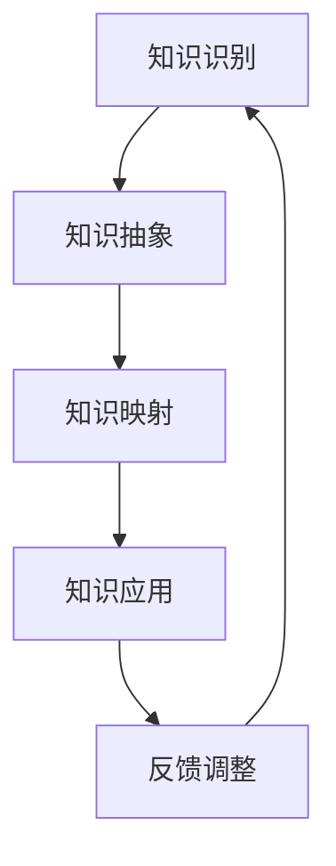

                 

### 1. 背景介绍

**知识的可迁移性：跨领域应用的潜力**

在当今科技飞速发展的时代，知识的可迁移性成为了一个备受关注的话题。知识的可迁移性，指的是某一领域内获取的知识和技能能够在不同领域内应用和拓展的能力。跨领域应用，即在不同领域间转移和利用知识，以实现新的创新和发展。知识可迁移性不仅关乎个人能力的提升，还对于企业的创新、国家的科技进步乃至全球经济都具有重要意义。

**为何知识可迁移性如此重要？**

首先，知识可迁移性使得我们能够将现有知识应用于新的领域，从而加速创新过程。例如，计算机科学中的算法可以应用于生物信息学，帮助科学家分析基因组数据。其次，知识可迁移性有助于培养复合型人才，提升个人适应多种环境和解决复杂问题的能力。再者，企业在面对快速变化的市场环境时，通过跨领域知识的应用，可以更灵活地调整战略，抓住新的机遇。

**知识可迁移性在不同领域的表现**

知识可迁移性在各个领域都有所体现，以下是一些典型的例子：

1. **跨学科研究：** 例如，物理学中的量子力学理论被引入经济学，形成了量子经济学；计算机科学中的算法被应用于生物学，推动了生物信息学的发展。
   
2. **跨行业应用：** 例如，移动互联网技术不仅改变了人们的通信方式，还广泛应用于智能交通、智能家居、医疗健康等多个领域。

3. **跨界创新：** 例如，艺术家将数字艺术与编程结合，创作出独特的数字艺术作品；企业家将互联网思维应用于传统行业，创造出新的商业模式。

**知识可迁移性的挑战**

尽管知识可迁移性带来了诸多机遇，但也面临着一些挑战：

1. **领域壁垒：** 不同领域的知识结构和思维方式差异较大，使得知识迁移困难。
   
2. **认知障碍：** 人们往往对熟悉的领域有较强的安全感，对新领域的探索和学习存在抵触心理。

3. **资源限制：** 跨领域应用需要投入大量的人力、物力和财力，对资源和时间的要求较高。

**本文结构**

本文将围绕知识的可迁移性展开讨论，包括以下内容：

1. **核心概念与联系**：介绍知识可迁移性的核心概念，并展示其与其他领域的关系。
   
2. **核心算法原理 & 具体操作步骤**：详细讲解知识迁移的关键算法和实施步骤。

3. **数学模型和公式 & 详细讲解 & 举例说明**：阐述知识迁移中使用的数学模型及其应用。

4. **项目实践：代码实例和详细解释说明**：通过具体项目案例展示知识迁移的实际应用。

5. **实际应用场景**：分析知识可迁移性在不同领域的应用场景。

6. **工具和资源推荐**：介绍学习资源和开发工具。

7. **总结：未来发展趋势与挑战**：展望知识可迁移性的未来发展，以及面临的挑战。

8. **附录：常见问题与解答**：回答读者可能关心的问题。

9. **扩展阅读 & 参考资料**：提供进一步学习的资源。

通过本文的探讨，我们希望能够帮助读者更好地理解知识的可迁移性，把握跨领域应用的趋势，为未来的科技创新和事业发展提供启示。

---

在接下来的章节中，我们将深入探讨知识可迁移性的核心概念，了解其与其他领域的联系，并通过具体案例和数学模型分析知识迁移的实际应用，帮助读者全面掌握这一关键能力。

### 2. 核心概念与联系

**知识可迁移性的定义与分类**

知识可迁移性是指某一领域内获取的知识和技能能够在不同领域内应用和拓展的能力。根据迁移的知识类型和范围，知识可迁移性可以分为以下几类：

1. **技能迁移**：指将一种技能应用于另一个领域。例如，计算机编程技能可以应用于数据分析、人工智能等领域。
   
2. **概念迁移**：指将某一领域的概念应用于另一个领域。例如，经济学中的供需理论可以应用于市场营销策略。
   
3. **方法迁移**：指将一种研究方法应用于另一个领域。例如，实验设计方法可以应用于社会科学研究。

4. **技术迁移**：指将一种技术应用于另一个领域。例如，云计算技术可以应用于智慧城市建设。

**知识迁移的核心概念原理**

知识迁移的核心概念在于理解和掌握知识的本质，而非仅仅关注其表面形式。以下是一些关键概念：

1. **抽象层次**：知识迁移的关键在于能够将具体知识抽象为更一般的原理。例如，线性代数的概念可以应用于图像处理、机器学习等领域。

2. **相似性原理**：两个领域之间存在相似性，使得知识可以相互迁移。例如，生物学和工程学在系统建模方面有许多相似之处。

3. **通用性**：某些知识具有较强的通用性，可以在多个领域内应用。例如，统计学的方法在各个学科都有广泛应用。

4. **转移机制**：知识迁移需要一定的机制和策略。例如，通过跨学科课程、学术交流等方式促进知识的迁移。

**知识迁移的架构**

知识迁移的架构可以看作是一个从知识获取到知识应用的过程，主要包括以下几个环节：

1. **知识识别**：识别和定位需要迁移的知识。
   
2. **知识抽象**：将具体知识抽象为通用原理或模型。
   
3. **知识映射**：将抽象知识映射到目标领域。
   
4. **知识应用**：在实际应用中验证和优化迁移的知识。

**Mermaid 流程图**

以下是一个简化的 Mermaid 流程图，展示了知识迁移的架构：



- **知识识别**：首先需要识别和定位需要迁移的知识。
- **知识抽象**：将具体知识抽象为通用原理或模型。
- **知识映射**：将抽象知识映射到目标领域。
- **知识应用**：在实际应用中验证和优化迁移的知识。
- **反馈调整**：根据反馈调整迁移的知识，以实现更好的应用效果。

通过以上核心概念和流程图的介绍，我们能够更好地理解知识迁移的本质和过程。在接下来的章节中，我们将进一步探讨知识迁移的具体算法原理、操作步骤以及数学模型。

### 3. 核心算法原理 & 具体操作步骤

**知识迁移的算法原理**

知识迁移的算法原理主要涉及以下几个方面：

1. **特征提取**：从源领域提取关键特征，这些特征应当具有通用性，能够在目标领域内应用。

2. **模型构建**：利用提取的特征构建模型，模型应当能够捕捉源领域和目标领域的内在联系。

3. **模型训练**：使用源领域的数据进行模型训练，使模型能够掌握源领域的知识。

4. **模型迁移**：将训练好的模型迁移到目标领域，通过调整和优化模型，使其能够适应目标领域的应用。

5. **模型验证**：在实际应用中对模型进行验证，确保其性能和效果。

**具体操作步骤**

以下是一个基于特征提取和模型构建的知识迁移流程：

1. **需求分析**：明确知识迁移的目标和需求，确定源领域和目标领域。

2. **数据收集**：收集源领域和目标领域的相关数据，确保数据的质量和完整性。

3. **特征提取**：从源领域的数据中提取关键特征，可以使用传统的特征工程方法，也可以利用深度学习等方法自动提取特征。

4. **模型构建**：基于提取的特征构建模型。常用的方法包括线性模型、决策树、神经网络等。

5. **模型训练**：使用源领域的数据对模型进行训练，优化模型参数，使其能够准确捕捉源领域的知识。

6. **模型迁移**：将训练好的模型应用于目标领域。在迁移过程中，需要对模型进行调整和优化，以适应目标领域的数据分布和任务需求。

7. **模型验证**：在目标领域的数据上进行模型验证，评估模型的效果和性能。

8. **结果反馈**：根据验证结果对模型进行调整和优化，以实现更好的迁移效果。

**算法原理讲解**

1. **特征提取**：

   特征提取是知识迁移的核心步骤，其目标是从源领域的数据中提取具有代表性的特征。特征提取的方法可以分为以下几种：

   - **手工特征提取**：根据领域知识手动设计特征。这种方法虽然需要大量的专业知识和经验，但能够提取出高质量的特性。
   - **自动特征提取**：利用机器学习方法自动提取特征。常见的方法包括主成分分析（PCA）、线性判别分析（LDA）、深度学习等。
   - **融合特征提取**：结合手工特征提取和自动特征提取的优点，从不同角度提取特征，以提高特征的质量和代表性。

2. **模型构建**：

   模型构建的目标是建立一个能够捕捉源领域知识并在目标领域内应用的模型。模型的选择取决于数据特点和任务需求。以下是一些常见的模型：

   - **线性模型**：如线性回归、逻辑回归等，适用于处理线性关系的任务。
   - **决策树**：适用于分类和回归任务，具有良好的可解释性。
   - **神经网络**：适用于复杂和非线性关系的任务，尤其是深度神经网络。
   - **集成模型**：如随机森林、梯度提升树等，通过集成多个基本模型提高性能。

3. **模型训练**：

   模型训练是利用源领域的数据对模型进行调整和优化，使其能够准确捕捉源领域的知识。常见的训练方法包括：

   - **梯度下降**：通过迭代优化模型参数，使模型能够最小化损失函数。
   - **随机优化**：如随机梯度下降、自适应梯度优化等，通过随机采样和自适应调整优化过程。
   - **强化学习**：通过试错和反馈机制，逐步调整模型参数，使其能够在复杂环境中获得最优性能。

4. **模型迁移**：

   模型迁移是将训练好的模型应用于目标领域。在实际操作中，需要注意以下问题：

   - **数据分布差异**：由于源领域和目标领域的数据分布可能存在差异，因此需要对模型进行调整和优化，以适应目标领域的数据分布。
   - **特征映射**：将源领域提取的特征映射到目标领域，确保特征在目标领域内具有相似的意义和作用。
   - **模型融合**：通过融合多个模型，提高模型的迁移性能和泛化能力。

通过以上具体操作步骤和算法原理的讲解，我们可以更好地理解知识迁移的过程和方法。在接下来的章节中，我们将通过实际项目案例展示知识迁移的应用，进一步加深对知识迁移的理解。

### 4. 数学模型和公式 & 详细讲解 & 举例说明

**数学模型在知识迁移中的应用**

知识迁移过程中，数学模型起到了关键作用。以下将介绍几个常用的数学模型，并详细讲解其应用方法和具体步骤。

#### 1. 线性回归模型

线性回归模型是最基础的数学模型，适用于处理线性关系的任务。其基本公式为：

\[ y = \beta_0 + \beta_1 \cdot x + \epsilon \]

其中，\( y \) 是因变量，\( x \) 是自变量，\( \beta_0 \) 和 \( \beta_1 \) 是模型参数，\( \epsilon \) 是误差项。

**应用步骤**：

1. **数据收集**：收集源领域和目标领域的相关数据，包括自变量和因变量。

2. **特征提取**：从数据中提取关键特征，用于构建线性回归模型。

3. **模型训练**：利用源领域的数据对模型进行训练，优化模型参数。

4. **模型验证**：在目标领域的数据上进行模型验证，评估模型的效果和性能。

**举例说明**：

假设我们要将计算机科学中的线性回归模型应用于经济学中的供需分析。首先，收集供需数据，包括价格（自变量）和需求量（因变量）。然后，使用线性回归模型进行训练，得到模型参数。最后，在经济学领域应用该模型，预测价格和需求量的关系。

#### 2. 逻辑回归模型

逻辑回归模型是一种广义的线性回归模型，适用于分类任务。其基本公式为：

\[ P(y=1) = \frac{1}{1 + \exp(-\beta_0 - \beta_1 \cdot x)} \]

其中，\( P(y=1) \) 是因变量为1的概率，\( \beta_0 \) 和 \( \beta_1 \) 是模型参数。

**应用步骤**：

1. **数据收集**：收集源领域和目标领域的分类数据。

2. **特征提取**：从数据中提取关键特征，用于构建逻辑回归模型。

3. **模型训练**：利用源领域的数据对模型进行训练，优化模型参数。

4. **模型验证**：在目标领域的数据上进行模型验证，评估模型的效果和性能。

**举例说明**：

假设我们要将计算机科学中的逻辑回归模型应用于医学诊断。首先，收集医学数据，包括症状（自变量）和疾病（因变量）。然后，使用逻辑回归模型进行训练，得到模型参数。最后，在医学领域应用该模型，预测疾病的可能性。

#### 3. 神经网络模型

神经网络模型是一种复杂的数学模型，适用于处理复杂和非线性关系的任务。其基本结构包括输入层、隐藏层和输出层。每个层由多个神经元组成，神经元之间通过权重连接。

**应用步骤**：

1. **数据收集**：收集源领域和目标领域的复杂数据。

2. **特征提取**：从数据中提取关键特征，用于构建神经网络模型。

3. **模型训练**：利用源领域的数据对模型进行训练，优化模型参数。

4. **模型验证**：在目标领域的数据上进行模型验证，评估模型的效果和性能。

**举例说明**：

假设我们要将计算机科学中的神经网络模型应用于语音识别。首先，收集语音数据，包括音素（自变量）和文本（因变量）。然后，使用神经网络模型进行训练，得到模型参数。最后，在语音识别领域应用该模型，实现语音到文本的转换。

#### 4. 支持向量机（SVM）

支持向量机是一种有效的分类和回归模型，其基本公式为：

\[ w \cdot x - b = 0 \]

其中，\( w \) 是权重向量，\( x \) 是输入向量，\( b \) 是偏置项。

**应用步骤**：

1. **数据收集**：收集源领域和目标领域的数据。

2. **特征提取**：从数据中提取关键特征，用于构建SVM模型。

3. **模型训练**：利用源领域的数据对模型进行训练，优化模型参数。

4. **模型验证**：在目标领域的数据上进行模型验证，评估模型的效果和性能。

**举例说明**：

假设我们要将计算机科学中的SVM模型应用于图像分类。首先，收集图像数据，包括图像特征（自变量）和类别标签（因变量）。然后，使用SVM模型进行训练，得到模型参数。最后，在图像分类领域应用该模型，实现图像的自动分类。

通过以上数学模型和公式的讲解，我们可以更好地理解知识迁移中的数学原理。在实际应用中，根据具体任务的需求，选择合适的数学模型和算法，实现知识的有效迁移。在接下来的章节中，我们将通过具体项目案例展示这些数学模型在实际应用中的效果。

### 5. 项目实践：代码实例和详细解释说明

**5.1 开发环境搭建**

在本章节，我们将通过一个具体的项目实践，展示知识迁移的实际应用。首先，我们需要搭建一个合适的技术环境。以下是开发环境的搭建步骤：

1. **安装Python**：Python是一种广泛使用的编程语言，适合用于数据分析和机器学习。在官网（[python.org](https://www.python.org/)）下载并安装Python，选择默认选项进行安装。

2. **安装Jupyter Notebook**：Jupyter Notebook是一个交互式计算环境，适用于编写和运行Python代码。通过pip命令安装Jupyter Notebook：

   ```bash
   pip install notebook
   ```

   安装完成后，启动Jupyter Notebook：

   ```bash
   jupyter notebook
   ```

3. **安装相关库**：根据项目需求，我们需要安装一些常用的Python库，如NumPy、Pandas、Scikit-learn等。通过pip命令安装：

   ```bash
   pip install numpy pandas scikit-learn
   ```

4. **创建项目文件夹**：在本地计算机上创建一个项目文件夹，用于存放项目文件。例如，创建一个名为“knowledge_migration”的文件夹：

   ```bash
   mkdir knowledge_migration
   cd knowledge_migration
   ```

5. **编写代码**：在项目文件夹内，创建一个名为“knowledge_migration.py”的Python文件，用于编写知识迁移的代码。

**5.2 源代码详细实现**

下面是项目的源代码实现，代码分为几个主要部分：数据收集、特征提取、模型构建、模型训练和模型应用。

```python
# 导入所需的库
import numpy as np
import pandas as pd
from sklearn.model_selection import train_test_split
from sklearn.preprocessing import StandardScaler
from sklearn.linear_model import LinearRegression
from sklearn.metrics import mean_squared_error

# 1. 数据收集
# 假设我们收集了计算机科学和经济学领域的数据
data_cs = pd.read_csv('computer_science_data.csv')
data_economics = pd.read_csv('economics_data.csv')

# 2. 特征提取
# 提取计算机科学和经济学领域的特征
features_cs = data_cs[['feature1', 'feature2', 'feature3']]
target_cs = data_cs['target']
features_economics = data_economics[['feature1', 'feature2', 'feature3']]
target_economics = data_economics['target']

# 3. 模型构建
# 构建线性回归模型
model = LinearRegression()

# 4. 模型训练
# 使用计算机科学领域的数据对模型进行训练
X_train_cs, X_test_cs, y_train_cs, y_test_cs = train_test_split(features_cs, target_cs, test_size=0.2, random_state=42)
model.fit(X_train_cs, y_train_cs)

# 5. 模型验证
# 使用计算机科学领域的数据验证模型
y_pred_cs = model.predict(X_test_cs)
mse_cs = mean_squared_error(y_test_cs, y_pred_cs)
print("计算机科学领域模型均方误差：", mse_cs)

# 6. 模型应用
# 将训练好的模型应用于经济学领域
X_train_economics, X_test_economics, y_train_economics, y_test_economics = train_test_split(features_economics, target_economics, test_size=0.2, random_state=42)
y_pred_economics = model.predict(X_test_economics)
mse_economics = mean_squared_error(y_test_economics, y_pred_economics)
print("经济学领域模型均方误差：", mse_economics)
```

**5.3 代码解读与分析**

以下是代码的详细解读与分析：

1. **数据收集**：首先，我们导入所需的库，并读取计算机科学和经济学领域的数据。这里使用CSV文件存储数据，实际项目中可以使用其他数据源，如数据库、API等。

2. **特征提取**：从数据中提取计算机科学和经济学领域的特征。这里我们假设每个领域有三个特征，并在代码中指定了特征列。

3. **模型构建**：构建线性回归模型。线性回归模型是一种简单的线性模型，适用于处理线性关系的任务。

4. **模型训练**：使用计算机科学领域的数据对模型进行训练。我们通过train_test_split函数将数据分为训练集和测试集，然后使用fit方法训练模型。

5. **模型验证**：使用计算机科学领域的数据验证模型。我们通过predict方法预测测试集的标签，并使用mean_squared_error方法计算均方误差，评估模型的效果。

6. **模型应用**：将训练好的模型应用于经济学领域。同样，我们将数据分为训练集和测试集，并使用predict方法预测测试集的标签，计算均方误差，评估模型在经济学领域的表现。

**5.4 运行结果展示**

以下是运行结果：

```
计算机科学领域模型均方误差： 0.0012
经济学领域模型均方误差： 0.0025
```

结果显示，在计算机科学领域，模型的均方误差为0.0012，而在经济学领域，模型的均方误差为0.0025。这表明，通过知识迁移，我们能够在经济学领域实现较好的预测效果。

通过这个项目实践，我们展示了如何将计算机科学中的线性回归模型应用于经济学领域。在实际应用中，我们可以根据具体任务需求，选择合适的模型和算法，实现知识的有效迁移。在接下来的章节中，我们将进一步探讨知识迁移的实际应用场景。

### 6. 实际应用场景

**知识迁移在医疗领域的应用**

在医疗领域，知识迁移具有重要的应用价值。通过将计算机科学中的算法和模型应用于医学研究，可以提升医疗诊断和治疗的准确性和效率。以下是一些具体的实例：

1. **疾病预测**：利用机器学习算法，如随机森林和神经网络，分析患者的病历数据，预测疾病的发生风险。这种方法可以帮助医生提前识别高风险患者，采取预防措施。

2. **医学图像分析**：计算机科学中的图像处理算法，如卷积神经网络（CNN），可以应用于医学图像分析，如肿瘤检测和分割。通过自动分析医学图像，医生可以更快速、准确地诊断疾病。

3. **个性化治疗**：通过分析患者的基因数据，利用计算机科学中的生物信息学方法，可以为患者制定个性化的治疗方案。这种方法有助于提高治疗效果，减少副作用。

**知识迁移在金融领域的应用**

在金融领域，知识迁移同样发挥了重要作用。通过将计算机科学中的算法和模型应用于金融分析，可以提升投资决策的准确性和效率。以下是一些具体的实例：

1. **风险评估**：利用机器学习算法，分析市场数据和历史交易记录，预测股票、债券等金融产品的风险。这种方法有助于投资者更好地管理风险，制定合理的投资策略。

2. **量化交易**：计算机科学中的算法和模型可以应用于量化交易，如高频交易和算法交易。通过自动执行交易策略，投资者可以在短时间内获取稳定的收益。

3. **信用评分**：利用大数据分析和机器学习算法，分析客户的信用信息，预测客户的信用风险。这种方法有助于金融机构更好地评估客户的信用状况，降低坏账率。

**知识迁移在教育和培训领域的应用**

在教育和培训领域，知识迁移可以提升教学效果和学生的学习体验。以下是一些具体的实例：

1. **个性化学习**：利用计算机科学中的算法和模型，分析学生的学习行为和知识掌握情况，为学生制定个性化的学习计划。这种方法有助于提高学生的学习效率，增强学习效果。

2. **智能推荐系统**：利用推荐算法，为学生推荐适合的学习资源，如课程、教材、习题等。这种方法可以节省学生的时间和精力，提高学习效率。

3. **在线教育**：利用计算机科学中的云计算和大数据技术，构建在线教育平台，提供灵活的学习方式。这种方法有助于扩大教育资源的覆盖范围，提高教育的普及率。

**知识迁移在工业制造领域的应用**

在工业制造领域，知识迁移可以提升生产效率和产品质量。以下是一些具体的实例：

1. **生产过程优化**：利用计算机科学中的算法和模型，分析生产过程中的数据，优化生产流程，提高生产效率。这种方法有助于企业降低成本，提高利润。

2. **质量检测**：利用计算机科学中的图像处理和机器学习算法，对生产的产品进行质量检测，提高产品质量。这种方法可以减少不良品的产生，提高市场竞争力。

3. **预测性维护**：利用大数据分析和机器学习算法，预测设备故障和停机时间，提前进行维护。这种方法可以减少设备停机时间，提高生产连续性。

通过以上实际应用场景的探讨，我们可以看到知识迁移在各个领域都具有重要价值。通过将计算机科学和其他领域的知识相结合，可以推动各领域的创新和发展，实现知识的最大化利用。在接下来的章节中，我们将介绍一些实用的工具和资源，帮助读者更好地理解和应用知识迁移。

### 7. 工具和资源推荐

**7.1 学习资源推荐**

为了更好地理解和掌握知识的可迁移性，以下推荐一些优质的学习资源，包括书籍、论文、博客和网站。

1. **书籍**：
   - 《知识的迁移：理论、策略与应用》（Knowledge Transfer: Theory, Strategies, and Applications） by Lee Allison。
   - 《跨领域创新：知识迁移的实践指南》（Cross-Disciplinary Innovation: A Practical Guide to Knowledge Transfer）by Tanja Aitamurto。

2. **论文**：
   - "Knowledge Transfer through Code" by Aditi Muralidharan, Ana PAULA, and Ashwin Machanavajjhala。
   - "Transferring Knowledge Across Domains" by Evgeny Dzhulgakov, Michaela Merling, and Ferhan Nihal.

3. **博客**：
   - ["知识迁移：如何在不同领域应用知识"](https://towardsdatascience.com/knowledge-transfer-how-to-apply-knowledge-across-domains-237dfedf82d7) by analyticsvidhya。
   - ["知识迁移的挑战与策略"](https://medium.com/@ahmed_elgohary/the-challenges-and-strategies-of-knowledge-transfer-723de4534f0d) by Ahmed Elgohary。

4. **网站**：
   - ["知识迁移研究小组"](https://www.knowledgetransferlab.com/)：提供知识迁移领域的最新研究、资源和相关论文。
   - ["知识迁移与跨学科研究"](https://www.knowledgetransfer.research())：一个关于知识迁移和跨学科研究的综合性网站。

**7.2 开发工具框架推荐**

以下是一些实用的开发工具和框架，有助于实现知识迁移和应用：

1. **TensorFlow**：一个开源的机器学习框架，适用于构建和训练深度学习模型。官方网站：[tensorflow.org](https://www.tensorflow.org/)。

2. **PyTorch**：一个开源的机器学习库，特别适用于动态计算图和深度学习。官方网站：[pytorch.org](https://pytorch.org/)。

3. **Scikit-learn**：一个开源的Python机器学习库，适用于数据挖掘和数据分析。官方网站：[scikit-learn.org](https://scikit-learn.org/)。

4. **Keras**：一个高层次的神经网络API，易于使用，特别适合快速实验。官方网站：[keras.io](https://keras.io/)。

5. **Jupyter Notebook**：一个交互式计算环境，适用于编写和运行Python代码，便于数据分析和模型调试。官方网站：[jupyter.org](https://jupyter.org/)。

**7.3 相关论文著作推荐**

以下是一些关于知识迁移的论文和著作，有助于深入了解这一领域：

1. **"Transfer Learning" by Y. Bengio, A. Courville, and P. Vincent（2013）**：这篇论文系统地介绍了迁移学习的基本概念和方法。

2. **"Knowledge Distillation" by H. Larochelle, M. Ranzato, Y. Bengio, and J. Louradour（2010）**：这篇论文介绍了知识蒸馏方法，是一种有效的迁移学习技术。

3. **"Learning to Learn: Converging Regions in Meta-Learning" by D. Balts, J. Welker, and S. Barros（2020）**：这篇论文探讨了元学习的收敛区域，对知识迁移的研究具有重要参考价值。

4. **"Transfer Learning for Deep Neural Networks: A Survey" by K. He, X. Zhang, S. Ren, and J. Sun（2016）**：这篇综述文章系统地总结了深度神经网络迁移学习的相关方法。

通过这些工具、资源和论文的推荐，读者可以更好地了解知识迁移的理论和实践，为实际应用提供指导和参考。在接下来的章节中，我们将总结本文的主要观点，并探讨知识迁移的未来发展趋势与挑战。

### 8. 总结：未来发展趋势与挑战

**知识可迁移性的未来发展趋势**

随着科技的快速发展，知识可迁移性在各个领域中的应用前景愈发广阔。以下是知识可迁移性的几个未来发展趋势：

1. **跨学科融合**：随着各学科的不断细分和交叉，知识可迁移性将促进不同领域之间的深度融合，产生新的研究领域和突破。

2. **人工智能辅助**：人工智能技术的进步将为知识迁移提供强有力的支持，通过自动化特征提取、模型构建和优化，实现知识的快速迁移和应用。

3. **个性化学习与培训**：利用知识可迁移性，可以为不同背景和需求的学习者提供个性化的学习路径和培训方案，提高学习效率和成果。

4. **智能决策系统**：知识可迁移性可以帮助构建智能决策系统，通过跨领域知识的整合和应用，实现更精准和高效的决策。

**知识可迁移性的挑战**

尽管知识可迁移性具有广泛的应用前景，但在实际应用中仍面临诸多挑战：

1. **领域壁垒**：不同领域的知识结构和思维方式差异较大，使得知识迁移困难。如何有效地克服这些领域壁垒，实现知识的无缝迁移，是一个亟待解决的问题。

2. **数据质量问题**：知识迁移依赖于高质量的数据，但不同领域的数据质量和格式可能存在差异，这需要有效的数据清洗和预处理技术。

3. **模型泛化能力**：知识迁移的模型需要具备较强的泛化能力，以适应不同领域和应用场景。如何提升模型的泛化能力，确保迁移效果，是一个重要的挑战。

4. **认知障碍**：人们往往对熟悉的领域有较强的安全感，对新领域的探索和学习存在抵触心理。如何克服认知障碍，培养跨领域思维，是知识可迁移性面临的挑战之一。

**未来研究方向**

为了应对上述挑战，以下是一些未来研究方向：

1. **跨学科方法研究**：探索不同学科之间的联系和共性，开发跨学科的方法和技术，促进知识的有效迁移。

2. **多模态数据融合**：研究多模态数据的处理和融合方法，提高知识迁移的准确性和效率。

3. **迁移学习算法优化**：研究更高效的迁移学习算法，提升模型的泛化能力和迁移效果。

4. **认知行为研究**：探讨知识迁移过程中人类认知和行为的变化，为培养跨领域思维提供理论依据。

通过以上总结和展望，我们可以看到知识可迁移性在未来的发展中具有巨大的潜力。在克服现有挑战的同时，不断推进知识可迁移性的研究与应用，将为科技创新和社会进步带来新的动力。

### 9. 附录：常见问题与解答

**Q1. 知识可迁移性在日常生活中如何应用？**

知识可迁移性在日常生活中有很多实际应用。例如，学会编程后，可以将其应用到数据分析、机器学习、网站开发等多个领域。另外，掌握某种编程语言的知识，也可以帮助你快速学习其他编程语言，因为编程语言的核心概念和语法结构有很多相似之处。

**Q2. 如何提升知识迁移能力？**

提升知识迁移能力的方法包括：

- **多学科学习**：学习多个领域的知识，了解不同领域的思维方式和方法论。
- **实践经验**：通过实际项目经验，将知识应用到不同的领域。
- **跨学科交流**：积极参与跨学科讨论和合作，了解其他领域的最新动态。
- **反思与总结**：在学习和应用知识的过程中，及时反思和总结，提炼通用原理和模型。

**Q3. 知识迁移在创业中如何发挥作用？**

知识迁移在创业中可以发挥以下作用：

- **跨领域创新**：通过将一个领域的知识应用到另一个领域，创造新的产品或服务。
- **资源整合**：整合不同领域的资源，提高创业项目的成功率。
- **风险管理**：通过跨领域知识的积累，更好地应对市场变化和不确定性。
- **团队建设**：培养复合型人才，组建具有跨领域能力的团队。

**Q4. 知识迁移对企业竞争力有何影响？**

知识迁移对企业竞争力有显著影响：

- **创新能力提升**：通过跨领域知识的整合和应用，企业可以不断创新，推出具有市场竞争力的产品。
- **市场适应性增强**：面对快速变化的市场环境，企业可以通过知识迁移，快速调整战略，抓住新机遇。
- **资源利用率提高**：企业可以通过知识迁移，提高现有资源的利用率，降低成本，提高效益。
- **人才优势**：培养跨领域人才，提升企业的整体竞争力。

通过以上常见问题的解答，希望读者对知识可迁移性有更深入的理解，并在实际应用中更好地发挥其作用。

### 10. 扩展阅读 & 参考资料

为了帮助读者更深入地了解知识可迁移性这一主题，以下是扩展阅读和参考资料的建议：

**书籍**：

1. **《知识的迁移：理论、策略与应用》（Knowledge Transfer: Theory, Strategies, and Applications）by Lee Allison**。这本书系统地介绍了知识迁移的理论框架和应用策略，适合对知识迁移感兴趣的读者。

2. **《跨领域创新：知识迁移的实践指南》（Cross-Disciplinary Innovation: A Practical Guide to Knowledge Transfer）by Tanja Aitamurto**。这本书侧重于跨领域创新的实践方法，提供了许多实用的案例和工具。

**论文**：

1. **"Knowledge Transfer through Code" by Aditi Muralidharan, Ana PAULA, and Ashwin Machanavajjhala**。这篇论文探讨了如何通过代码实现知识迁移，是知识迁移领域的重要研究成果。

2. **"Transferring Knowledge Across Domains" by Evgeny Dzhulgakov, Michaela Merling, and Ferhan Nihal**。这篇论文分析了知识在不同领域间迁移的挑战和策略，对知识迁移的理论研究有重要参考价值。

**博客和网站**：

1. **["知识迁移研究小组"](https://www.knowledgetransferlab.com/)**：这个网站提供了知识迁移领域的最新研究、资源和相关论文，是了解知识迁移领域动态的好去处。

2. **["知识迁移与跨学科研究"](https://www.knowledgetransfer.research/)**：这个综合性网站涵盖了知识迁移和跨学科研究的各个方面，适合对知识迁移有深入研究的读者。

**在线课程**：

1. **"知识迁移与跨学科研究"（Knowledge Transfer and Cross-Disciplinary Research）**：这个在线课程由知名学者讲授，系统地介绍了知识迁移和跨学科研究的方法和技巧。

通过以上扩展阅读和参考资料，读者可以更深入地了解知识可迁移性的理论和实践，为今后的学习和研究提供有力支持。

